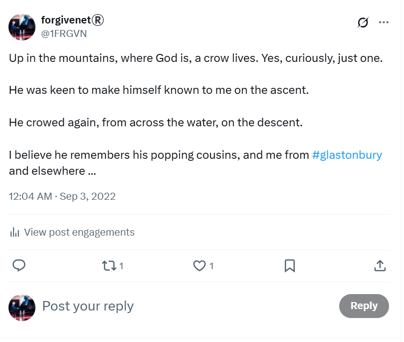
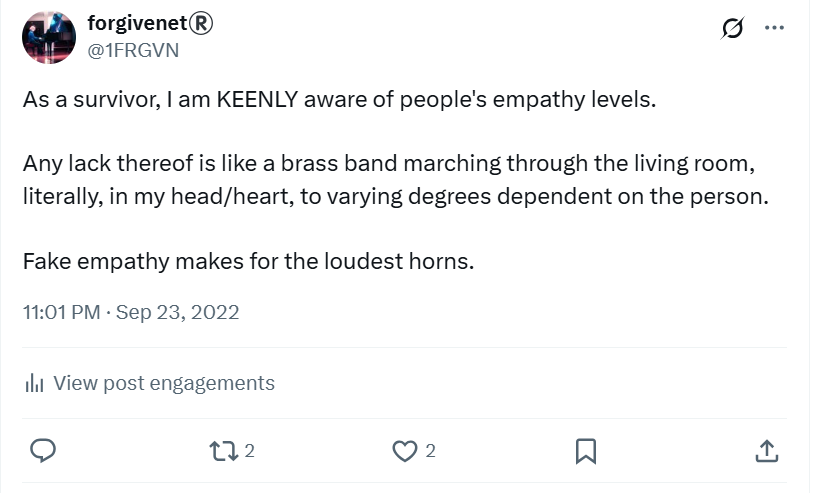
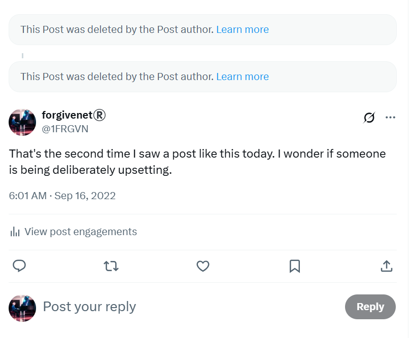
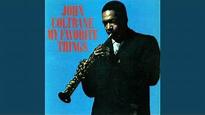

# September 2022

## Omens in the Pyrenees

- I'm staying in Cauterets, a small town near Lourdes in the Pyrenees.
- It's close to the high mountains and I go for long hikes whenever I can.
- When I'm back in my room I start to think about the rave music from 1989, and I listen to it on YouTube.
- I tweet about curious events during this time.
- On one trip particular trip early in the month, a crow is unusually vocal. Some might say this was a warning.

- Later in the month, I post something which also appears to be premonitory.

### A curious man

- For about a week of my stay, there was a couple I bumped into regularly on the trails and in the town.
- They were usually running the trail around Cauterets.
- Nothing unusual about them except I'm drawn to his face, I recognize it somehow.
- I think he must be a film or TV star, and that's why I know him.
- He has a very distinctive look.
- I will see the same man at the [choir concert in December](december.md#the-curious-man) and do a double-take.
- Again, I think he must be a film or TV star, and that's why I know him.
- I saw the man yet again on the [online meeting in September 2023](../2023/september.md#chamber-music) led by Paqui Fornet.
- He was sitting with [Katia](../2023/september.md#katia).
- Is it possible this man had already been in my apartment, and that's how I knew him? 
- Is it possible that the sedating had started long before I began my conservatory studies?
- I would recognize this man in an instant.

## Threatening tweets

- An example of some threatening tweets I mentioned [in a previous chapter](march.md#planting-the-choker-seeds), now deleted by the author.

## Classes start at the conservatory

- I commence the year 3 professional piano studies at the conservatory of Dénia.
- The organized stalking begins, although I won't know the horrible extent of it for another 18 months when I begin to seriously fear for my life.

!!! tip "Context around gang stalkers ultimate goals"
    - The reader should know that the teachers and staff at the conservatory of Dénia, my English expat friends, and persons at that time unknown, had been planning an exaggerated and vicious gang stalking situation with me as target and, although I was aware that something evil was going on, I was completely unaware of the extent of it and how many people were involved until March 2024, 18 months away.
    - Everything I describe with regards to the actions and behavior of the staff and teachers at the conservatory of Dénia therefore is part of a carefully choreographed deceit, managed and directed by Domingo Lopez and his associates, which include the trumpet teacher who was calling himself Vidal Sastre Sanchez Hornero - the name in the Generalitat Valenciana systems - Domingo's family members including his sister Carmen, and other NPCs such as Paqui Fornet Pastor and Maria Hontanilla, all teachers and staff at the conservatory, and eventually the whole town of Dénia.
    - It is not clear whether *all* the staff and teachers at the conservatory were aware of the full implications of what was happening with regards to online criminal sexual exploitation, spy-cam and rape-gang porn, or whether they just assumed I was just another vulnerable woman being bullied, and this was a normal occurrence and rather enjoyable to them, rather like the bullfighting but with vulnerable humans as victim.
    - The question is, did teachers, staff, and students at the conservatory, and my English expat friends like Patricia and Christine, know about the underlying plot running parallel to the gang-stalking which was sexual grooming, clandestine medicating/spiking with aphrodisiac substances in class and elsewhere, porn gathered from cyber-stalking/hacking/voyeurism, poisoning with methanol and/or pesticides with the intent to cause me serious injury, and maybe kill me, and who knows what else. 
    - In retrospect, it seems highly likely that everyone, including students, would know the full implications for targets which I assume have always been female.
    - Given that everyone knew I was suicidally depressed at that time, either because I shared the information with them personally (Christine BJ and Maria Hontanilla who I had trusted), or because they had been reading my Twitter activity from very early on, one must assume that an attack like this would have as its main intention my suicide or a total nervous breakdown.
    - Given the efficiency and skill of the attack, and its elaborate nature, one must ask how many local suicides may be explained by gang stalking and I cannot help wonder what led [Lorraine Blackbourn](../early-years/2008.md#working-for-lorraine-blackbourn) to kill herself, a mother of three with a successful local business.
    - Given the significant resources put into terrorizing me, not least the use of costly technological systems used for clandestine surveillance, cyber-stalking, and mass voyeurism, we have to assume that certain people were making a lot of money from the attack on my person.
    - That certain NPCs seemed to benefit financially, or talk about possible financial or personal benefits to themselves, adds more credence to the previous point.
    - It is clear, however, that whatever horrible ending my persecutors planned for me did not work out, again and again, and so they had to rethink and adjust their conspiracy, over and over, until it got to the stage where I genuinely feared for my life, in March 2024, and I felt I had no option but to leave my studies at the conservatory.

## Matriculation and classes

- Some documentation regarding my [application and sign up for studies](../../content/documents/papeles-conservatorio/2022-3/application/signing-up.zip).
- Piano teacher [preference document](../../content/documents/papeles-conservatorio/2022-3/Formulari%20tria%20professorat%2022-23.pdf).
- List of students in year 3 for [harmony and choir and other classes](../../content/documents/papeles-conservatorio/2022-3/22-23%20HORARI%20a%2009.09.22%20PROVISIONAL%20PROFESSIONAL.pdf).

### Piano

- My teacher is Maria Hontanilla Alfonso. 
- [Mercedes](../early-years/2013.md#meeting-mercedes) is her student also. This doesn't make sense because Mercedes was in the first year in 2015-16, which means she should have finished her studies two years previously.
- It's even more curious given that Mercedes has clearly done no practice in 6 years.
- Whenever I go to class, Mercedes is finishing her class and I wait 20/30 minutes while she eats into my class time (because she was late) before she finishes. 
- Then Mercedes spends 10/15/20 minutes talking to Maria before she actually leaves. 
- Sometimes I'm left with just 10 minutes of class. 
- This is a weekly occurrence. 
- I'm unable to stay later as I'm working and my hours aren't flexible.
- It feels purposeful but I don't complain. 
- I feel like complaining will make them feel justified about something.

#### Miguel Angel her husband

- I ask how Miguel Angel is doing.
- She says oh he's very bad, he's all yellow and losing his hair, she tells me.
- She says he can hardly speak now.
- I expected her to tell me he had passed away or recovered.
- I did not think people lingered for years with lung cancer, just deteriorating.
- I'm now worried about the true fate of Miguel Angel.

### Harmony

- The teacher is Adrià Gil Boronat, an erratic and extremely nervous man in his fifties.
- One of my classmates is Samuel Viciano Herranz who has near perfect English. He is Domingo's student.
- Samuel had been studying singing at the Javea conservatory but moved to study piano in Dénia instead. It's not clear why. He doesn't have a good reason for it and his singing voice is amazing. 
- Samuel makes a huge effort to help me throughout this year with translation and explaining things the fast-speaking teacher says. He walks home with me a little way after every class.
- After the end of the course, in [June 2023](../2023/june.md), Samuel rarely speaks to me at all and never walks with me. 
- Samuel tells me he used to be a student of Lorraine Blackbourn. I cry when he tells me this and have to leave the room. This is not like me normally.
- Elvira is also in this class. She is a minor child and she is Domingo's student also.
- Elvira has a sister, Lucía, in the year above who is also Domingo's student.
- Now and then, Samuel, Domingo, Elvira and Lucía will go out in the evenings together, just those four. 
- Samuel avoids telling me where they're going when I ask.
- Samuel talks about Elvira as if he knows her intimately; "oh she's very erratic", he tells me.

!!! warning "Elvira and Lucía"
    - Elvira and Lucía have moved to Dénia from Madrid.
    - They live with their mother who is very rich and possibly a widow or divorced.
    - Domingo is often seen alone with Elvira and Lucía in the town.
    - Domingo is alone with them a lot and will have had unfettered access to their mobiles as he does with all his students.
    - At some point, Samuel informs me that the girl's mother is buying a Steinway piano.
    - I am concerned about the safety of these females.

!!! tip "Sara"
    - A girl called Sara attends classes this year, but she does not return for year 4.
    - She looks a lot like (one of) the trumpet teachers and I eventually wonder if she could be a daughter, or a close family member, sent to report back on the unconsenting British rape porn star.

!!! info "A curious irony"
    - The harmony teacher minds me of Gene Hackman and I start thinking about the film, The Conversation, where Gene Hackman is recording and eavesdropping on a conversation between lovers.

    <iframe width="1280" height="720" src="https://www.youtube.com/embed/elJL5D6HTvA" title="The Conversation (1974) ORIGINAL TRAILER [HD 1080p]" frameborder="0" allow="accelerometer; autoplay; clipboard-write; encrypted-media; gyroscope; picture-in-picture; web-share" referrerpolicy="strict-origin-when-cross-origin" allowfullscreen></iframe>

    - I start thinking of the piano music from that film.
    - I find the sheet music online and practice it often at the conservatory.

    <iframe width="857" height="228" src="https://www.youtube.com/embed/RUsEIdHxBPk" title="Main theme from The Conversation (1974)" frameborder="0" allow="accelerometer; autoplay; clipboard-write; encrypted-media; gyroscope; picture-in-picture; web-share" referrerpolicy="strict-origin-when-cross-origin" allowfullscreen></iframe>

### Choir

- The teacher is Concha Ballester.
- I have known Concha for years, since 2014.
- I sold her a guitar before I left Dénia in 2016, and she used to come to the Orfeo de Dénia choir with Klara Sarkadi from time to time.
- Elvira and Lucía are both in the choir class.

!!! warning "Students bullying teachers at the request of other teachers"
    - Throughout the year, Lucía bullies Concha in choir class; sarcastic comments, dirty looks to the rest of the class, etc.
    - It's very embarrassing and I notice some of the other students are really angry and bored with this.
    - It's obvious Domingo is instructing Lucía to bully Concha. Why is anyone's guess.
    - Is it because Concha is the go-to person for any students experiencing sexual or grooming abuses from teachers, as she will reveal to me when I reach out to her in July 2023?

### Chamber music

- This class is where I accompany a soloist.
- I have been designated a trumpet student: Pablo, a 14 year old boy.
- There is no teacher assigned to this class in September.
- There will be no teacher assigned to this class until the end of November. 
- This is extremely unusual as the Generalitat has an over abundance of music teachers available at all times.

#### My Favorite Things

- Nevertheless, I come in every Monday evening to practice accompanying an invisible soloist.
- I had thought Pablo might come in anyway, but he didn't.
- At that time, I was obsessed with John Coltrane's *My Favorite Things*.

- I had been listening to it in the mountains, along with all the rave music.
- The piano part is exceptional and I've always wanted to play it.
- I download the music and study it.
- I didn't have to transpose the trumpet part when I downloaded it for us to play in January or February 2023, which is curious perhaps.
- As I'm writing this in August 2025, I look back and find my obsession with this piece even more curious, for reasons I won't go into.

## Domingo's little group of youngsters

- Occasionally, I see Domingo around the conservatory and sometimes in the town. 
- He's always with his little group of youngsters, Elvira and Lucía, and Samuel, a man in his 20s.
- It's cliquey, at best, but extremely weird. 
- I remain concerned for the safety of Domingo's female students.
