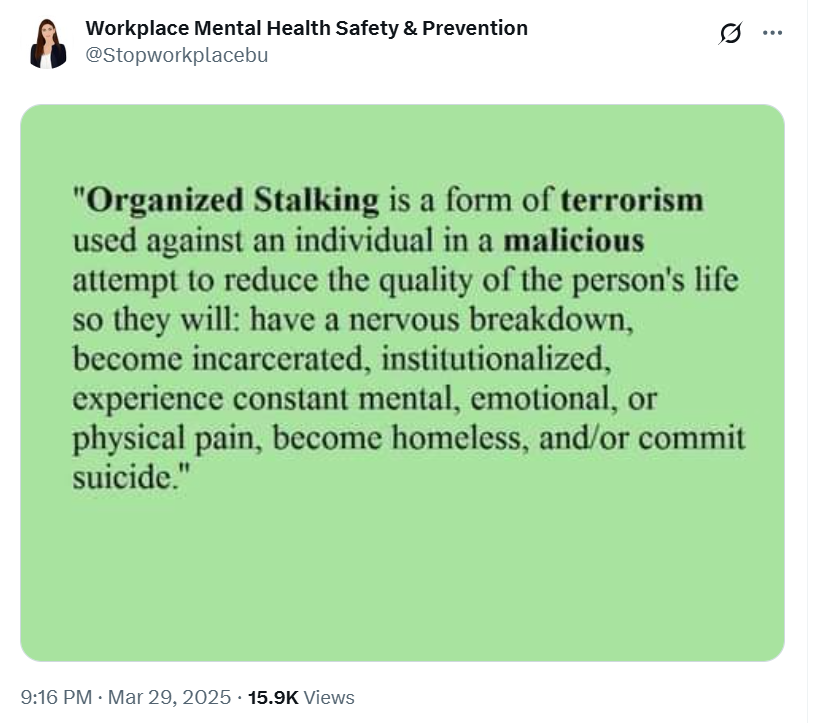
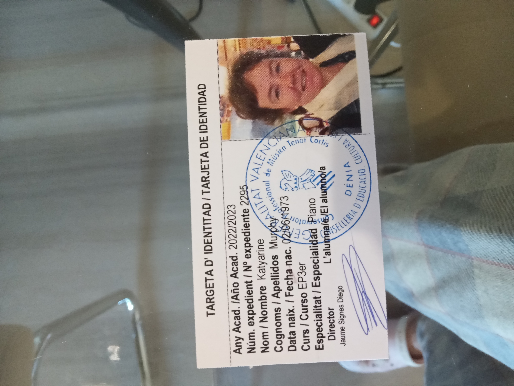

## Classes start at the conservatory

- I commence the year 3 professional piano studies at the conservatory of Dénia.
- The organized stalking begins, although I won't know the horrible extent of it for another 18 months when I begin to seriously fear for my life.

!!! tip "Context around gang stalkers ultimate goals"
    - The reader should know that the teachers and staff at the conservatory of Dénia, my English expat friends, and persons at that time unknown, had been planning an exaggerated and vicious gang stalking situation with me as target and, although I was aware that something evil was going on, I was completely unaware of the extent of it and how many people were involved until March 2024, 18 months away.
    - Everything I describe with regards to the actions and behavior of the staff and teachers at the conservatory of Dénia therefore is part of a carefully choreographed deceit, managed and directed by Domingo Lopez and his associates, which include the trumpet teacher who was calling himself Vidal Sastre Sanchez Hornero - the name in the Generalitat Valenciana systems - Domingo's family members including his sister Carmen, and other NPCs such as Paqui Fornet Pastor and Maria Hontanilla, all teachers and staff at the conservatory, and eventually the whole town of Dénia.
    - It is not clear whether *all* the staff and teachers at the conservatory were aware of the full implications of what was happening with regards to online criminal sexual exploitation, spy-cam and rape-gang porn, or whether they just assumed I was just another vulnerable woman being bullied, and this was a normal occurrence and rather enjoyable to them, rather like the bullfighting but with vulnerable humans as victim.
    - The question is, did teachers, staff, and students at the conservatory, and my English expat friends like Patricia and Christine, know about the underlying plot running parallel to the gang-stalking which was sexual grooming, clandestine medicating/spiking with aphrodisiac substances in class and elsewhere, porn gathered from cyber-stalking/hacking/voyeurism, poisoning with methanol and/or pesticides with the intent to cause me serious injury, and maybe kill me, and who knows what else. 
    - In retrospect, it seems highly likely that everyone, including students, would know the full implications for targets which I assume have always been female.
    - Given that everyone knew I was suicidally depressed at that time, either because I shared the information with them personally (Christine BJ and Maria Hontanilla who I had trusted), or because they had been reading my Twitter activity from very early on, one must assume that an attack like this would have as its main intention my suicide or a total nervous breakdown.
    - Given the efficiency and skill of the attack, and its elaborate nature, one must ask how many local suicides may be explained by gang stalking and I cannot help wonder what led [Elaine Black](../early-years/2008.md#working-for-elaine-black) to kill herself, a mother of three with a successful local business.
    - Given the significant resources put into terrorizing me, not least the use of costly technological systems used for clandestine surveillance, cyber-stalking, and mass voyeurism, we have to assume that certain people were making a lot of money from the attack on my person.
    - That certain NPCs seemed to benefit financially, or talk about possible financial or personal benefits to themselves, adds more credence to the previous point.
    - It is clear, however, that whatever horrible ending my persecutors planned for me did not work out, again and again, and so they had to rethink and adjust their conspiracy, over and over, until it got to the stage where I genuinely feared for my life, in March 2024, and I felt I had no option but to leave my studies at the conservatory.

## Documentation

- Some documentation regarding my [application and sign up for studies](../../content/documents/papeles-conservatorio/2022-3/application/signing-up.zip).
- Piano teacher [preference document](../../content/documents/papeles-conservatorio/2022-3/Formulari%20tria%20professorat%2022-23.pdf).
- List of students in year 3 for [harmony and choir and other classes](../../content/documents/papeles-conservatorio/2022-3/22-23%20HORARI%20a%2009.09.22%20PROVISIONAL%20PROFESSIONAL.pdf).

### Piano

- My teacher is Maria Hontanilla Alfonso. 
- Porsche  is her student also. This doesn't make sense because Porsche was in the first year in 2015-16, which means she should have finished her studies two years previously.
- It's even more curious given that Porsche has clearly done no practice in 6 years.
- Whenever I go to class, Porsche is finishing her class, and I wait 20/30 minutes while she eats into my class time (because she was late) before she leaves. 
- Then Porsche spends 10/15/20 minutes talking to her before she actually leaves. 
- Sometimes I'm left with 10 minutes of class. 
- This is a weekly occurrence. 
- I'm unable to stay later as I'm working and my hours aren't so flexible.
- It feels purposeful but I don't complain. I feel like complaining will make them feel justified about something.

### Harmony

- The teacher is Adrià Gil Boronat, an erratic and extremely nervous man in his fifties.
- One of my classmates is Samuel Viciano Herranz who has near perfect English. He is Domingo's student.
- Samuel was studying singing at the Javea conservatory but moved to study piano in Dénia instead. It's not clear why.
- Samuel tells me he used to be a student of Elaine Black. I cry when he tells me this and have to leave the room. This is not like me normally.
- Elvira Valdivia Escribano is also in this class. She is a minor child and she is Domingo's student also.
- Elvira has a sister, Lucía, in the year above who is also Domingo's student.

!!! warning "Elvira and Lucía"
    - Elvira and Lucía have moved to Dénia from Madrid.
    - They live with their mother who is very rich and possibly a widow or divorced.
    - Domingo is often seen alone with Elvira and Lucía in the town.
    - Domingo is alone with them a lot and will have had unfettered access to their phones.
    - At some point, Samuel informs me they are buying a Steinway piano.
    - I am concerned about the safety of the girls and their mother.

!!! tip "Sara"
    - A girl called Sara Pastor de Miguel attends classes this year, but she does not return for year 4.
    - She looks a lot like the trumpet teacher and I now wonder if she could be his daughter, or a close family member, sent to report back on the unconsenting British rape porn star.
    - Could the people of Dénia really be this evil?

!!! info "A curious irony"
    - The harmony teacher minds me of Gene Hackman and I start thinking about the film, The Conversation, where Gene Hackman is recording and eavesdropping on a conversation between lovers.
    - I think of the piano music from that film and find it, and practice it often at the conservatory.

### Choir

- The teacher is Concha Ballester.
- I have known Concha for years, since 2014.
- I sold her a guitar before I left Dénia in 2016, and she used to come to the international choir from time to time.
- Elvira and Lucía are both in the choir class.

!!! warning "Lucía bullies Concha"
    - Throughout the year, Lucía bullies Concha in choir class; sarcastic comments, dirty looks to the rest of the class, etc.
    - It's very embarrassing and I notice some of the other students are really angry and bored with this.
    - It's obvious Domingo is instructing Lucía to bully Concha. Why is anyone's guess.
    - Is it because she acts as the go to person for any abuses by teachers as she will reveal to me when I reach out to her in July?

### Chamber music

- This class is where I accompany a soloist.
- I have been designated a trumpet student: Pablo Sesé Savall, a 14 year old boy.
- There is no teacher assigned to this class in September.

## Domingo's little group

- Occasionally, I see Domingo around. 
- He's always with his little group of youngsters, Elvira and Lucía, and Samuel, a man in his 20s.
- It's cliquey and extremely weird. I'm concerned for the safety of Domingo's female students.
