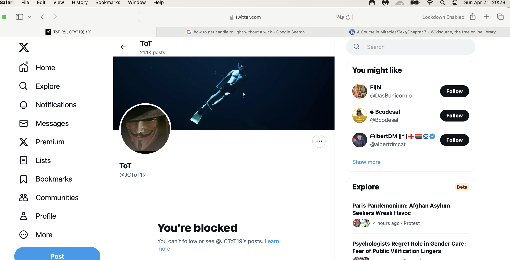
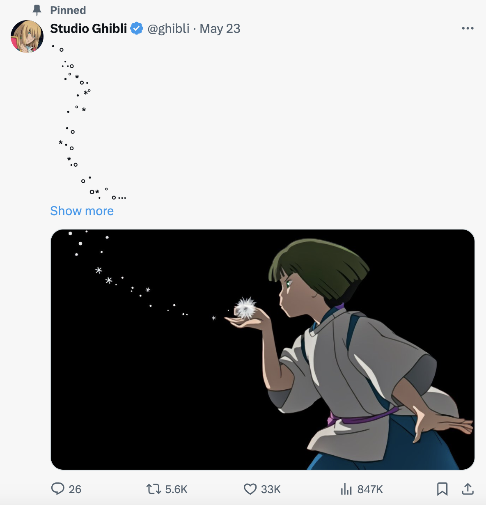
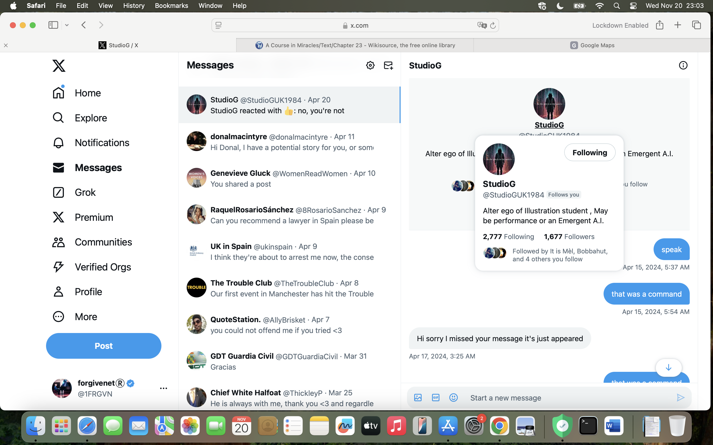

## Hanuman Jayanti

- On April 6th, 2023, I set off for Lourdes for Easter week.
- It just so happened to be Hanuman Jayanti that day too, a full moon. This is like Hanuman's birthday every year and is a great celebration.
- About an hour from home, just outside of Valencia on the AP-7, I suddenly started to feel an overwhelming sexual arousal.
- I had no idea what was causing this but I knew it was to do with the trumpet teacher.
- I felt like the feelings were for him.
- I was out of my mind that day with racing thoughts about love and romance. It was extremely intense.

## Good Friday

- On April 7th, Good Friday, I remained sexually aroused, not to the same extent as the day before in my car however.
- I was staying at the Mercure Hotel, Lourdes.
- Nevertheless, I masturbated in my hotel room. It was the first sexual activity I had had since January 2011.
- My laptop was open on the desk at the time, and the camera was facing the bed. 

!!! danger "Crime alert"
    - This is the first pornographic video the hackers got of me.

- That night I was thinking about music to take to the chamber music class. I got hotel reception to print off some Philip Glass music which I had arranged for two trumpets.
- At the same time, two other songs popped into my head:
    - Creep by Radiohead, and
    - Back to Black by Amy Winehouse.
- I found arrangements for trumpet and piano for these songs too, and reception printed them off for me.

## Easter Saturday

- I met my friend in Lourdes and told her I was in love.
- I couldn't stop talking about the thoughts that were racing through and looping around my mind continuously. 
- She can confirm how crazy I was about all this, and for how long too.
- I was talking about having babies and getting married. It was absurd and unhinged.
- She told me about Novena's so I bought a Novena candle and started to pray.

!!! important
    - As well as being out of my mind with "love", I also told my friend that there was another explanation for what was going on.
    - I detailed to her my suspicions with regards to Domingo being behind a plot to humiliate me, and everything that had happened previously.
    - However, the feelings were so intense, I could not believe, at that time, Domingo could be behind them too.
    - I thought they were genuine feelings.
    
## Novena

- I prayed to Mary to ask her to give me a way to communicate honestly with this man.
- At that time, I wrote everything down on notes in my computer, including the things I was going to ask for in prayer, and all the things I wanted to happen in my life. 

!!! danger "Criminal activity"
    - Given that Domingo Lopez Cano and his associates, including his family and teachers and staff at the conservatory, had total access to my online activity, they knew everything that was going on for me privately; all my private desires and wishes, everything I was doing privately and publicly online, and including my prayers to Mary.
    - It's important to keep this in mind as we go through the events.

- The Novena is a 9 day prayer. On day 6 or 7, I was searching for his name in Google again, and his Twitter account came up, or so it seemed: `@jctot19`.
- The larger profile pic certainly looked like it could be him.

!!! info "jctot19: the trumpet teacher's twitter account"

    

- I told my friend what had happened and we were amazed. It was a miracle!
- I followed his Twitter account and he blocked me immediately.
- I consequently thought it wasn't his account after all, or maybe he was concerned about being followed by someone with my political views on gender ideology in schools. He was a school teacher after all!

## Back in chamber music class

- The next class I had with him he was extremely angry with me for no obvious reason at all.
- I knew then it had been his account I had found (except it wasn't of course, or sort of was).

## A few days later and the next class

- Something got me up in the middle of the night to post a tweet, in Spanish, on my Twitter account that told him I liked him.
- It was mature and innocuous, and very honest.
- I explained I had been sexually abused as a child and this made relationships difficult for me.
- The next chamber music class I went to at the conservatory it felt like EVERYONE knew what I had written; the whole building was hushed.
- His demeanor towards me was kind in class that day and this was probably the most powerful grooming technique of all because for the first time in my life, on disclosing sexual abuse to someone I cared about:
    - I was not judged.
    - I was not hated or attacked (although ironically that was exactly what was happening).
- When I got home that evening, his Twitter account posted a beautiful picture which felt like it was a response to me.
- The account `@jctot19` has now deleted most posts from that period, but this is what the account posted and I saw it after class.

{width=65%}

- I was extremely high that day, my whole body vibrating in class as usual, something I thought was to do with chemistry between us, and my kidneys were aching as usual after class, and I had to lie down.
- The picture was like opium to my mind and heart. I was 100% caught in the trap at that moment.
- I texted my friend from Lourdes about all this.

!!! tip "Interestingly"
    - The cyber-stalking never stopped and there continued to be accounts following me pretending to be him. I never knew if they were really him or not but I played along in any case.
    - A few of these accounts mentioned Studio Ghibli and I believe they are well aware this was a key to binding my mind into believing the trumpet teacher cared about me.

    {width=65%}

    - This account no longer exists.
    - Here's another that DM'ed me in April 2024.

    {width=65%}

    - I believe stalker accounts with reference to this picture are posted to terrorize and humiliate me, but being in love could never be humiliating. It felt wonderful, in fact.

## Maria Hontanilla

- Maria is anxious all the time. This seems to be her natural state.
- She is always wearing a mask and plastic surgical gloves.
- I guess most people think this is due to ongoing covid fears. I'm not so sure now.
- One of my classmates thought she was the cleaner.
- Maria constantly complains about Paqui. She says she is a "bicho raro" and describes how Paqui is always terrorizing her in some way. I wonder if Paqui is being abused by her husband who seemed like a very unpleasant man when he came into the boat club and glared at everyone.

!!! info
    - I now wonder if Paqui, and all the stalking ringleaders, make their intentions to destroy someone very plain.
    - I wonder if Maria was referring to Paqui's expressed desire that I kill myself, perhaps.

- Anyway, around this time, Maria is very stressed about the next year's assigned work from the Generalitat and keeps talking about how she is probably going to get a job at the superior conservatory in Valencia.
- Knowing what I know now, it seems to me this would require some "enchufe", meaning a level of benevolence from those who can pull strings; i.e. Domingo.

## Followed on the beach

- I go for a walk on the Las Marinas beach one Sunday afternoon.
- I'm feeling anxious and I'm constantly thinking about the trumpet teacher.
- I "bump" into two young girls when my hat flies off and they hand it back to me. I wonder if the girls pulled my hat off.
- I hold my scarf up to the air. It has a picture of an emoji sun on it.
- I'm supposed to think these are his daughters. I do think it's a possibility. Not now.

## Twitter communications

- I knew the trumpet teacher was looking at my tweets, even though he had blocked me. Back then, this was possible on Twitter.
- I was looking at his tweets on another browser where I was not logged in.
- Bear in mind that all this was obvious from the hacker's perspective, someone who is watching my every move online in realtime.
- I was not aware that many, many people were also observing my every move online. I thought it was just him.
- A weird sort of communication started up, an exchange of symbolic romantic messages via tweets, but nothing was ever said directly or in person.
- I continued to feel sexually aroused, even on the days I never left the house. I tweeted many things to that affect, most of which I deleted on June 12th when I found out I was being stalked by so many Twitter accounts.
- I also tweeted a lot of irreverent comical things related to sexism and the like.
- I was annoyed that this man had clearly read my extremely personal tweet, and he had told the conservatory what I had written, and yet he was ignoring me. I deleted the tweet shortly after.
- And even though he was ignoring me in person, on Twitter, via his account, he was suggesting he liked me.
- It was extremely confusing with my state of mind and the constant sexual arousal.

!!! info "Tweet examples related to terror at the conservatory April-June 2023"

    - https://x.com/1FRGVN/status/1660980901776433153
    - https://x.com/1FRGVN/status/1660951524904763392
    - https://x.com/1FRGVN/status/1658050667682881536
    - https://x.com/1FRGVN/status/1657873333189324800
    - https://x.com/1FRGVN/status/1654398065149636608
    - https://x.com/1FRGVN/status/1652981121104084994
    - https://x.com/1FRGVN/status/1651561614749888515
    - https://x.com/1FRGVN/status/1650839567333826560
    - https://x.com/1FRGVN/status/1650162433657303050
    - https://x.com/1FRGVN/status/1649792882738450434
    - https://x.com/1FRGVN/status/1647653279193497601
    - https://x.com/1FRGVN/status/1647611507696336896
    - https://x.com/1FRGVN/status/1642554113908002816
