# April 2023

## Hanuman Jayanti

- On April 6th, 2023, I set off for Lourdes for Easter week.
- It just so happened to be Hanuman Jayanti that day too, a full moon. This is like Hanuman's birthday every year and is a great celebration.

- Hanuman is celibate. 
- I myself had been completely celibate since 2010. 
- There was no question about that in my mind at the time.
- About an hour from home, just outside of Valencia on the AP-7, I suddenly start to feel an overwhelming sexual arousal.
- I had no idea what was causing this but I knew it was to do with the trumpet teacher.
- My feelings were for him. I was sure of it.
- I was out of my mind that day with racing thoughts about love and romance. It was extremely intense and destabilizing.
- I write about this on X about 6 months later: https://x.com/1FRGVN/status/1713726935371551010.

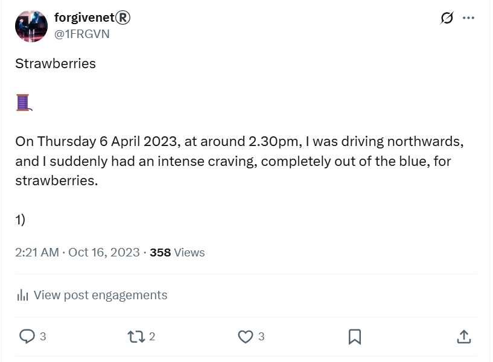

- This twitter thread causes something of a ruckus in the town of Dénia in October 2023, and people start to leave strawberries at my feet on my route to and from the conservatory for classes.

- It's almost as if the whole town is reading my tweets, and the whole town knows about the sedated sexual relationship I'm having, or had been having at that time, with the trumpet teacher.

### Overwhelming romantic feelings

- I had been experiencing these overwhelming romantic feelings for a few days.
- A vivid story is on loop in my mind.
- It's like I can see a scene happening, over and over again.
- The trumpet teacher and I are at the beach and we're having a wonderful time.
- We're playing in the sea, laughing, having fun, and rolling in the sand.
- We are in love.
- I cannot get these images out of my head, nor do I want to really because they are pleasant.
- Except, they're unusually intense, never letting up, firing on a loop, destabilizing.
- I believe this event is going to happen.
- I believe it so much, I buy him some swimming shorts in Zaragoza which I leave in my car.
- I throw the swimming shorts away about a week later when I realize this was temporary insanity.
- How did they do that? I wonder.
- Were they flashing up photos of him in the sea and at the beach playing with the photographer, so that I thought these things were happening to me?

## Good Friday

- On April 7th, Good Friday, I remain sexually aroused.
- I was staying at the Mercure Hotel, Lourdes.
- I masturbated in my hotel room. It was the first sexual activity I had experienced for over 12 years.
- My laptop was open on the desk at the time, and the camera was facing the bed. 
- That night I was thinking about the music I wanted to take to the chamber music class. 
- I got the hotel reception to print off some Philip Glass music which I had arranged for two trumpets and piano.
- At the same time, two other songs popped into my head:
    - *Creep* by Radiohead, and
    - *Back to Black* by Amy Winehouse.
- I found arrangements for trumpet and piano for these songs too.

### Back to Black

- Back in 2008, I dressed up for carnival weekend with friends from Dénia: Paul, Alessandra (we call her Alex mostly), Zoe, John, and me.
- Paul was dressed as a serial killer in an orange Guantanamo suit.
- Alex was dressed as a pirate.
- John dressed, most hilariously, as a nun.
- Zoe came as Britney. 
- I went dressed as a cow and took my ukelele.
- I serenaded anyone who might listen with Amy Winehouse's Back to Black, continuously, so that even the Montgo might enjoy it.
- There are photos, somewhere. Let's see if I can find them.

## Easter Saturday

- I meet [Sandra Rita Diaz in Lourdes](../early-years/2014.md#march-to-july). 
- I tell her I'm in love.
- I talk incessantly about the thoughts racing through and looping around my mind continuously. 
- Sandra Rita Diaz can confirm how crazy I was about all this, and for how long too. It went on for well over 18 months more; I assume while I was being drugged.
- While sitting across the river from the grotto, I text the trumpet teacher the Philip Glass music I had arranged the night before.
- About half an hour later, I walk over to the grotto to sit with the pilgrims in front of Mary.
- My phone goes off. It's WhatsApp. The trumpet teacher has replied.
- I believe it is *more than serendipitous* that he has texted me at that moment, in the grotto at Lourdes, at 12.30pm. Mary's hour.

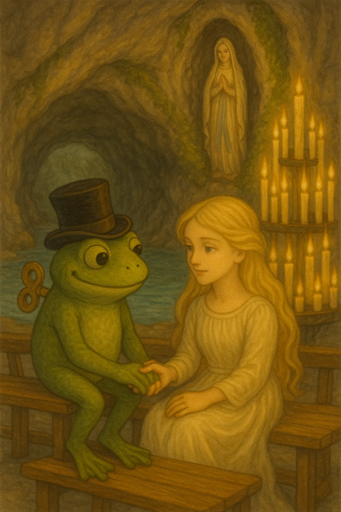

- I have no idea that hackers and pornographers are tracking my movements and carefully building a trap.
- With Sandra Rita Diaz later, I talk about having babies and getting married. I'm obsessed and euphoric. I keep thinking about how old Sarah was when she had her first child. It was absurd and unhinged but, even though my suspicions remained, I couldn't ground myself at all.

!!! danger "My suspicions"
    - As well as being out of my mind with "love", I also told Sandra Rita Diaz that there was another explanation for what was going on.
    - I detailed my suspicions with regards to Domingo and the plot to humiliate me, and everything that had happened previously.
    - However, the feelings were so intense, I could not believe, at that time, that Domingo could be behind this too.
    - Sandra Rita Diaz, unknown to me at the time, was taking notes and reporting back. It is not yet clear to whom.

## The Novena prayer

- Sandra Rita Diaz told me about Novena prayers so I bought a Novena candle and started to pray.
- *I asked Mary to undo all the knots in the way of communicating honestly with this man.*
- At that time, I was writing all my private thoughts down on notes in my computer, including the things I was going to ask for in prayer, and all the things I wanted to happen in my life including my feelings for the trumpet teacher.

!!! danger "The whole town of Dénia knows everything about me - and who else? - via hacking"
    - Given that Domingo the piano teacher and his associates, including his family and teachers and staff at the conservatory, had full access to my online activity, they knew everything that was going on for me privately; all my private desires and wishes, everything I was doing privately and publicly online, including the content of my prayers to Mary.
    - They had seen me masturbating in my hotel room too.
    - I, of course, have no idea this is happening at that time.

- The Novena prayer is a nine-day prayer. 
- While I am praying, whenever I get to the end of a decade, at that exact moment, the laptop goes into sleep. It is extraordinarily peculiar and I think rather lovely, as if Mary herself is taking a breath. I wonder now if someone else was praying along with me.
- When I remember these small things, I'm certain that this was a very tender and very real connection, poisoned by evil.
- I hope it has healed others as much as it has healed me.
- Anyway.
- On evening six or seven of the prayer, I was searching for his name in Google again, ["Vidal Sastre Sanchez Hornero"](../../crimes/protagonists/vidal-sastre.md) and his Twitter account came up in results, or so it seemed: `@jctot19`.
- The larger profile pic certainly looked like it could very well be him.

!!! info "`@jctot19`: the trumpet teacher's twitter account"

    

- It's curious the main picture is from [a day at the sea](#overwhelming-romantic-feelings).
- In January 2024, I will see another side of this picture where the person deep down is taking a picture of the woman swimming above him.
- I guess that's how they entrap the men, or the lesbians.
- The next day I told Sandra Rita Diaz what had happened. We were amazed. It was a miracle!
- I followed the Twitter account. 
- The account blocked me immediately.
- I post a reaction on X.

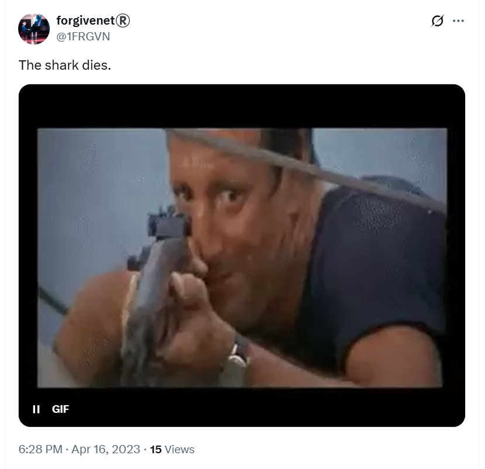

- I consequently thought it couldn't be his account after all, or maybe he was concerned about being followed by someone with my political views on gender ideology in schools. He was a school teacher after all!

!!! tip "More on the `@jctot19` account"
    - It turned out this account was not run by the trumpet teacher at all, whoever he was.
    - It was instead a bona fide honey-trap account run by numerous criminal gang members which may have on occasion been the trumpet teacher himself, but on other occasions was most likely Carmen Cano, Domingo Cano's sister, and other Spanish gang members from Dénia.
    - It was unlikely to have been controlled by anyone else at the conservatory.

- I tweet about the whole thing in November 2023.

[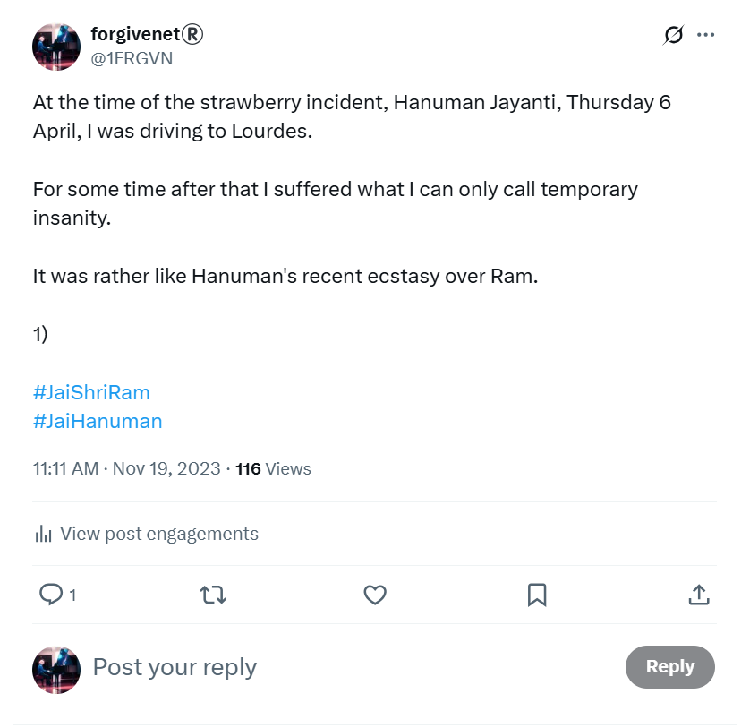](https://x.com/1FRGVN/status/1726196382644707724)

## Expecting to see him in Lourdes

- While I'm in Lourdes, I expect to see the trumpet teacher at any moment.
- I imagine he will be there with his secondary school class.
- I believe this because of the time he [handed me his phone](march.md#the-trumpet-teacher-hands-me-his-phone) and I saw he was making travel plans for a large group of people going to France.
- I tweeted about this the following March.

[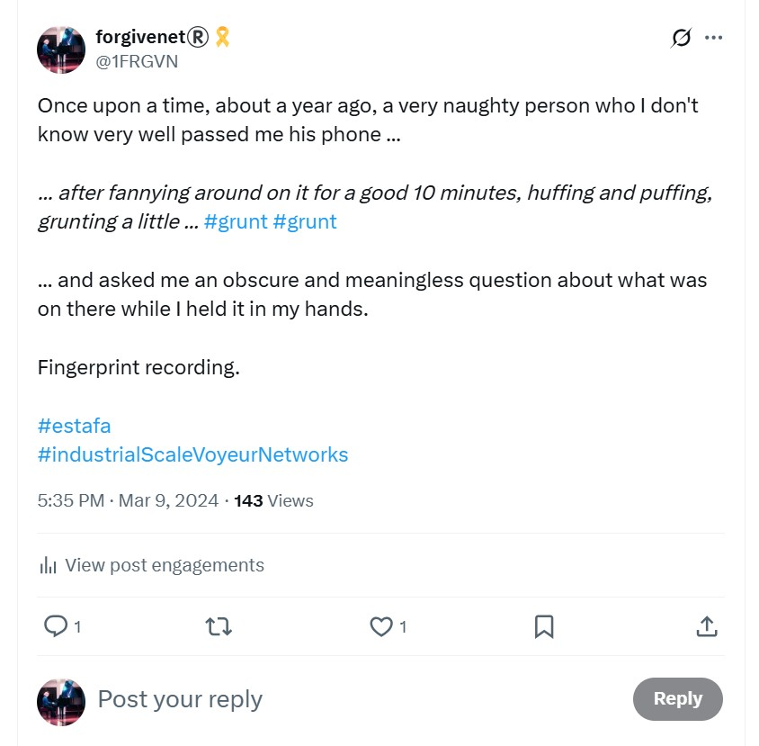](https://x.com/1FRGVN/status/1766412512306618714)

- The man who handed me his phone was [number two trumpet teacher](../../crimes/protagonists/vidal-sastre.md#the-brother-or-mark-from-english-class-in-2013).
- I also believe all this because I'm out of my mind on some psychoactive substance I'm unaware is probably in my shampoo; and most likely I'm being fed constant online reinforcement of this idea.
- I have a vision of the trumpet teacher with a large group of people; he himself rising up to be seen above the figures who surround him.
- I'm reminded of this vision when I see Sandra Rita Diaz in Lourdes again, sometime in 2024, and she gives me a bunch of Psalms of David to read for protection against the evil people in Dénia who plan to do me harm.

!!! quote "Psalm 27"

    <i>Then my head will be exalted  
    above the enemies who surround me;  
    at his sacred tent I will sacrifice with shouts of joy;  
    I will sing and make music to the Lord.  </i>

    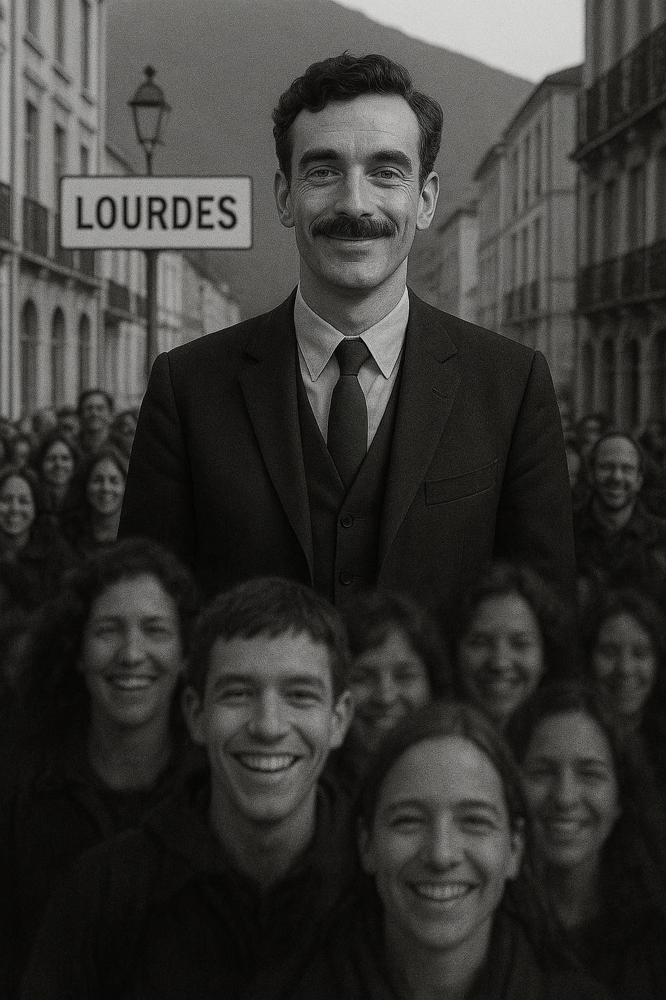

- I think of this again and again throughout 2023 and 2024. 
- I feel it cannot be wistful, meaningless mind dithering.
- I'm writing it all down now; everything that comes back to me, and at the perfect moment too. It feels like something outside us, and yet within us, is orchestrating everything.

## Wedding shoes

- On the way back to Dénia from Lourdes, I stop at Zaragoza again.
- In the Corte Ingles at Puerta de Venezia I see the most beautiful shoes.
- They have yellow roses on them, just like Our Lady had on her feet when she visited Bernadette.
- I must have them. I buy them.
- I notice that they would be perfect wedding shoes.
- At the time of writing this section, 20th October 2025, Diwali, I have never worn these shoes, but I still have them.
- I'm also wondering if these shoes might have indeed been intended for a wedding, mine, without my knowledge at the time I bought them.
- Weddings were a continuous meme in the online-romance stakes, and sometimes [in real life too](#a-wedding-on-las-rota-beach).
- I wonder if the reach of criminal honey-trapping porn-gangs in Spain extends to shops and businesses, and whether these shoes are part of the conspiracy.
- If so, what's in these shoes, I wonder?
- I text Sandra with a picture of them.
- Do the gypsy gangs misuse Our Lady in their occult practices?
- She won't like that.

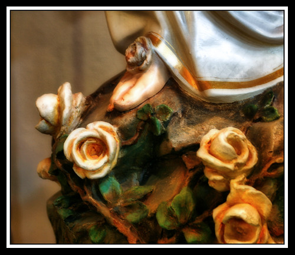

- I wonder what the lab is going to say about these shoes.
- It's likely the groom (whichever of the [trumpet teachers was scheduled for that role](../../crimes/protagonists/vidal-sastre.md#four-distinct-men), definitely not the first man) would want to be married for a short as time as possible to his honey-trapped target. 
- Maybe they run sweepstakes on that too. I bet they do.

## Back in chamber music class

- The next class I had with him on Monday 24th April he was extremely angry with me for no obvious reason at all.
- His anger surprised me and I stared at him. He could not hold my eye contact and looked away.
- This was [man two of the group of men pretending to be the trumpet teacher](../../crimes/protagonists/vidal-sastre.md#the-brother-or-mark-from-english-class-in-2013).
- I knew at that moment the `@jctot` account was his. At least, that was my assumption.
- Was the trumpet teacher angry because he knew I had fallen into a vile trap he could do nothing about?
- Or was he angry that his intention to keep me for himself was probably scuppered?

## Dreaming of the trumpet teacher

- On the Monday night after the class, I dream I wake up to see the trumpet teacher in my bed, staring at me.
- He says, "Katharine".
- I turn my back on him. I'm appalled. I didn't not want him there. He is not someone I want anything to do with.

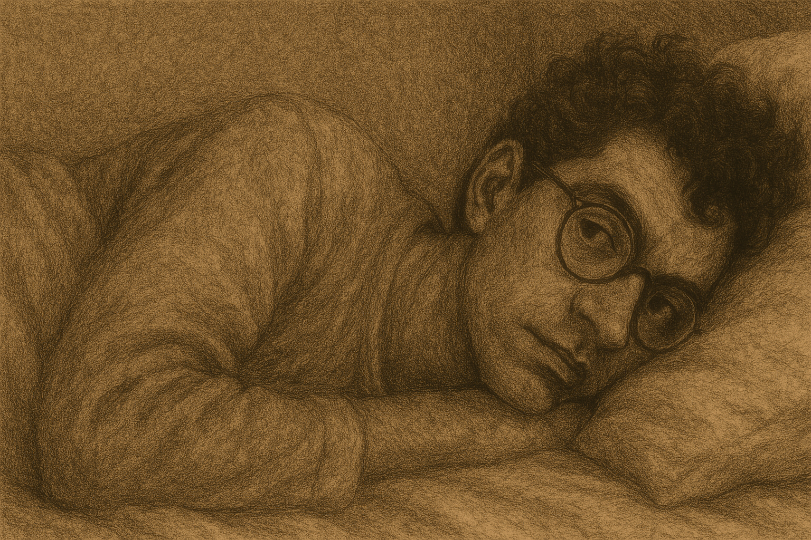

- I wake up even more obsessed and in love with the trumpet teacher.
- This particular trumpet teacher was the [fourth man I have since remembered in the Autumn of 2025](../../crimes/protagonists/vidal-sastre.md#dark-thick-curly-haired-deep-set-man).

## Disclosing child sexual abuse to the trumpet teacher

- A few days later, something woke me up in the middle of the night to post a tweet, in Spanish, on my Twitter account to tell him I liked him.
- I must have assumed, or hoped, he would be reading my tweets at that time.
- It was a mature and innocuous message, and very honest.
- I explained I had been sexually abused as a child and this made relationships very difficult for me.
- At the next chamber music class, the following Monday, he was waiting for me at the door.
- This was [hulking number three of the group of men pretending to be the trumpet teacher](../../crimes/protagonists/vidal-sastre.md#an-unknown-man-i-may-have-a-picture-of), the largest of them all, of course I didn't notice he wasn't the one I actually did like.
- It felt like *EVERYONE* knew what I had written; the whole conservatory building was hushed.
- We went up to the classroom and I babbled something about whether he was surprised or not.
- Ana was standing at her classroom as we went past looking at us.
- We went into the trumpet classroom and he kind of waited for me to say something to him. He was expecting me to say something to him. I didn't. And after a few moments, he shrugged and we went on with the class.
- His demeanor towards me was soft and kind in class that day and this was probably the most powerful grooming technique of all because for the first time in my life, on disclosing sexual abuse to someone I cared about:
    - I was not judged.
    - I was not hated or attacked (although ironically that was exactly what was happening).
- When I got home that evening, his Twitter account posted a beautiful picture which felt like it was a response to me.
- The account `@jctot19` has now deleted most posts from that period, but this is what the account posted and I saw it right after that class.

- While I was looking at this picture right after arriving home, Sandra WhatsApp'ed me and I told her the trumpet teacher was sending me beautiful pictures.
- I was extremely high that day, my whole body vibrating in class as usual, something I thought was to do with chemistry between us.
- My kidneys were aching as usual after class, and I had to lie down.
- The Studio Ghibli picture was like opium to my mind and heart. 
- I was 100% caught in the trap at that moment.

!!! tip "The Studio Ghibli tweet"
    - As the cyber-terrorism continued into late 2023 and on into 2024, numerous fake accounts followed me pretending to be the trumpet teacher.
    - I never knew if they were really him or not, but I played along in any case.
    - A few of these accounts mentioned Studio Ghibli and, whenever they did, it was like they were teasing me about me this bear trap snapping shut on me, or perhaps trying again. 
    - Cyber-terrorists were well aware this picture, coupled with drugging and my disclosure, were the key to fully binding my mind into believing the trumpet teacher cared about me.
    - It was very powerful sorcery and I can't imagine any young inexperienced girls have been able to escape once targeted.
    - An example fake account here:

    

    - This account no longer exists.
    - Here's another that DM'ed me in April 2024.

    

    - Fake accounts posted references like this to terrorize and humiliate me, but being in love could never be humiliating.
    - It felt wonderful, in fact, and became an extraordinarily powerful force for good in my life, healing me completely of depression.

- In October, I will tweet about this again to the multitude who I have come to realize are watching me.

[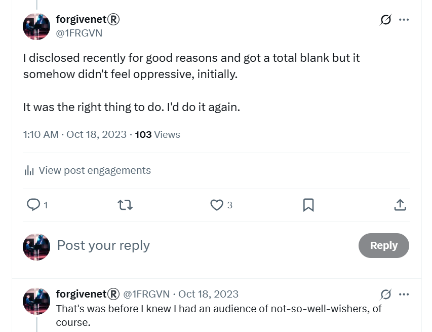](https://x.com/1FRGVN/status/1714433682046349597)

### Garbure

- It's clear everyone knows what's going on and no-one is going to communicate with me directly about it.
- This is excruciatingly stressful and feels like an assault on my whole person.
- My inner warrior emerges again.

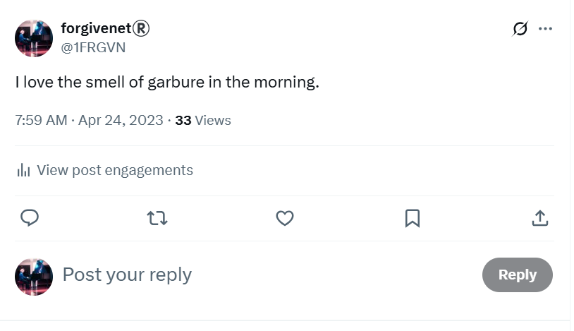

## Gorilla loses a hand

- On my handbag, the little gorilla that hangs off one side has lost a hand.
- I believe one of the trumpet teachers who turned up for class ripped it off while I was drugged or sedated at home.
- I used X to message hackers about this in the summer of 2024 and I received some kind of confirmation back.

## Maria Hontanilla

- Maria my piano teacher is anxious and distressed, all the time. It seems to be her natural state. 
- She gets obsessed over small things and talks incessantly about them.
- She is always wearing a mask and plastic surgical gloves.
- I guess most people think this is due to ongoing covid fears. I'm not so sure now.

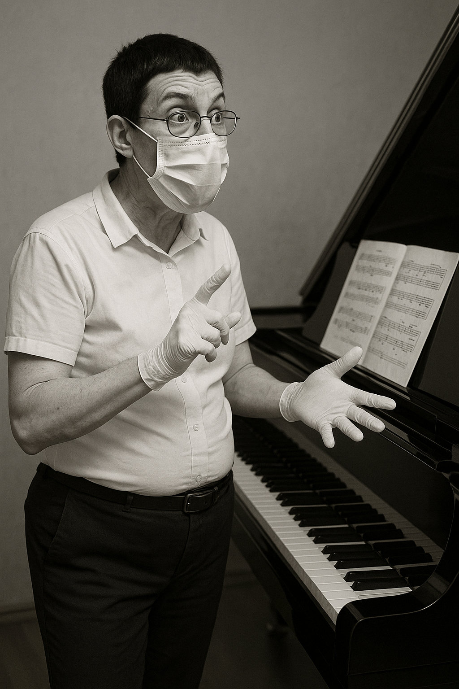

- One of my classmates thought she was the cleaner.
- Maria constantly complains about Paqui Fornet Pastor. She says she is a "bicho raro" and describes how Paqui is always terrorizing her in some way.
- I wonder if Paqui is being abused by her husband who seemed like a very unpleasant man [when he came into the boat club and glared at everyone](march.md#choir-rehearsal-at-the-boat-club).
- Maria is extremely stressed about her assigned classes for the next school year from the Generalitat.
- She keeps telling me how she is probably going to get a job at the superior conservatory in Valencia, and work just a few hours in the mornings.
- Knowing what I know now, it seems to me this would require some "enchufe", meaning a level of benevolence from those who can pull strings.

!!! info "Maria is very concerned that I get covered by Spanish public healthcare"
    - Maria was extremely anxious that I got my Spanish medical card.
    - She was overly concerned about this, and brought it up every week until I got my SIP card.
    - Before that, I tell her not to worry, I have private medical insurance but she is hugely concerned about a possible future situation in which I would have no cover and need medical assistance.
    - She seems relieved when I tell her I have received my medical card.
    - I wonder why she would be so concerned about this.

## Flying in choir class

- I remember one particular choir class where I'm totally out of my mind.
- I'm sitting there in a sort of reverie of romantic feelings.
- I probably masturbated that lunchtime due to the overwhelming sexual arousal.
- Choir class starts at 5pm but whatever has heightened my awareness at my apartment has not worn off, and has even perhaps been enhanced on my way up the stairs.
- Anyway.
- There's a fly in the class. 
- A giant, nasty one.
- It's buzzing around, annoying everyone.
- It's big and black and pretty awful actually.
- Concha gets her fly killer spray out and stuns it.
- It falls to earth under my chair, in its death throws, fizzing and whirling.
- I have to move seats because it's so grotesque.
- Eventually, the fly stops moving and dies.
- I get a tissue and pick it up and throw it out of the window, dead.
- I wonder if it hit anyone in the street.
- I return to my chair.

## Tarot

- I remember the tarot reading from [the summer before in Glastonbury](../2022/july.md#glastonbury).
- I'm shocked that the Knight of Wands card divination was so precise.
- I start doing the tarot online.
- I ask for a card to describe what is happening between myself and trumpet teacher; what does our relationship stand for, or mean?
- I pull Strength.

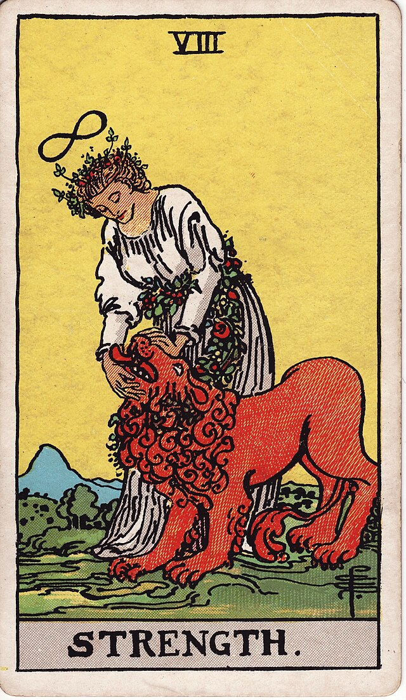

## A wedding on Las Rota beach

- Most Saturdays, I walk along Las Rotas beach.
- I get to the end, where the chair is, and rest a while before returning.
- A couple in their sixties is having their wedding photos done.
- I've been thinking about marriage and weddings with regards to the trumpet teacher a lot.
- I think, well, you don't have to be young do you.
- I wonder about this in retrospect.
- Another set up?
- Did I see the woman again somewhere?

## Followed on the beach

- I go for a walk on the Las Marinas beach one Sunday afternoon.
- I'm feeling anxious and I'm constantly thinking about the trumpet teacher. 
- I expect to bump into him at any moment. It's not clear why I believe this.
- Instead, I "bump" into two young girls when my hat flies off and they hand it back to me. I wonder later if the girls pulled my hat off.
- The two girls, who resembled the two girls I had seen on his facebook page in December, were angry or scared looking.
- I'm starting to realize now that people involved in the scam are quite often angry and scared, like Mercedes was when she [first mentioned studying piano at the conservatory](../early-years/2013.md#meeting-mercedes) or my [landlady who was alway furious](../2021/december.md#too-good-to-be-true-on-the-8th-december).
- I wonder if that's because they don't really want to be involved in a murderous conspiracy or is it unconscious guilt coming up.
- I hold my scarf up to the air as I walk away. 
- It has a picture of a burning sun with a rolling eyes emoji on it.

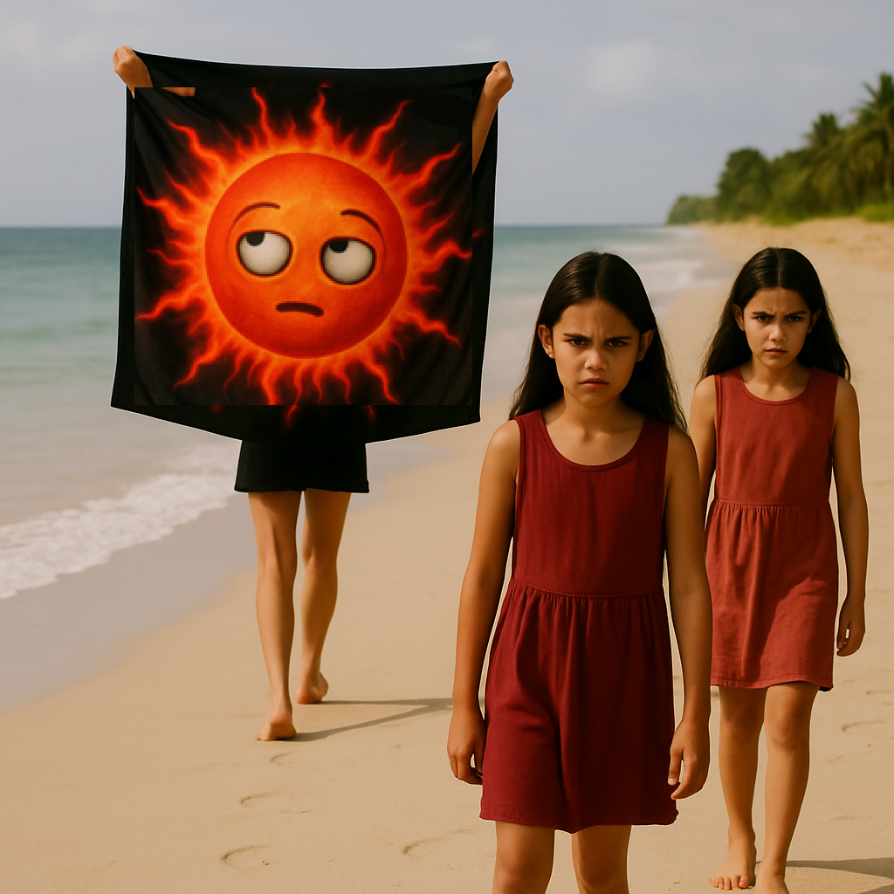

- I bought the scarf/sarong in Thailand at Christmas.
- I guess I'm supposed to think these two are his daughters. 
- I do think it's a possibility at that time.
- This movement of holding my sarong up in the air turns out to be very significant indeed. 
- It sort of becomes like a meme to me, it's repeated often in new stalker choreography and online storytelling.
- I'm not sure what it means until Steve mentions [the cat](../2024/january.md#san-antonio-and-the-cat) in January 2024.

## Twitter communications

- I knew the trumpet teacher was looking at my tweets, even though he had blocked me. 
- I was able to see the `@jctot19` tweets on another browser where I was not logged in on my account.
- I was unaware that many, many people were observing my every move online. I thought it was just him who was looking. 
- It's not clear why I wasn't more suspicious about this.
- Perhaps it was because a weird sort of communication had started up between my account `@1frgvn` and `@jctot19`, an exchange of symbolic romantic messages via tweets, but nothing was ever said directly or in person.
- I continued to feel sexually aroused, even on the days I never left the house. I tweeted many things to that affect, most of which I deleted on June 12th when I found out I was being stalked by a great many Twitter accounts.
- I also tweeted a lot of irreverent comical things related to sexism and the like.
- I was annoyed that this man had clearly read my extremely personal tweet, and that he had told everyone at the conservatory what I had written, and yet he was ignoring me. 
- Occasionally I tweeted angry messages because it was so frustrating.

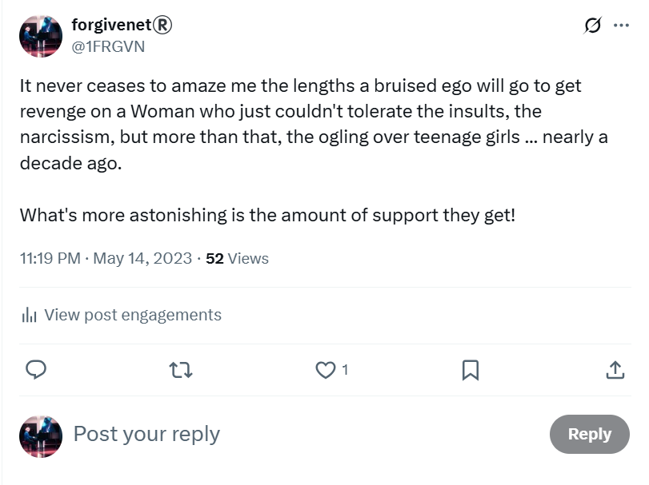

- And even though he was (apparently) ignoring me in person, on Twitter, via the `@jctot19` account, he was suggesting he liked me.
- All this was extraordinarily confusing coupled with my state of mind and the constant sexual arousal.

!!! info "More tweet examples related to terror at the conservatory April-June 2023"

    - https://x.com/1FRGVN/status/1660980901776433153
    - https://x.com/1FRGVN/status/1660951524904763392
    - https://x.com/1FRGVN/status/1658050667682881536
    - https://x.com/1FRGVN/status/1657873333189324800
    - https://x.com/1FRGVN/status/1654398065149636608
    - https://x.com/1FRGVN/status/1652981121104084994
    - https://x.com/1FRGVN/status/1651561614749888515
    - https://x.com/1FRGVN/status/1650839567333826560
    - https://x.com/1FRGVN/status/1650162433657303050
    - https://x.com/1FRGVN/status/1649792882738450434
    - https://x.com/1FRGVN/status/1647653279193497601
    - https://x.com/1FRGVN/status/1647611507696336896
    - https://x.com/1FRGVN/status/1642554113908002816
