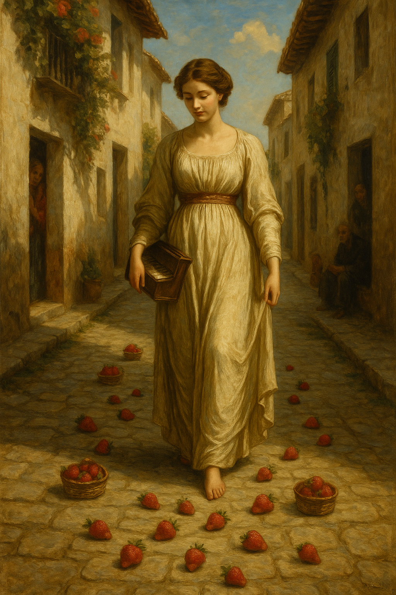

# April 2023

## Hanuman Jayanti

- On April 6th, 2023, I set off for Lourdes for Easter week.
- It just so happened to be Hanuman Jayanti that day too, a full moon. This is like Hanuman's birthday every year and is a great celebration.

- Hanuman is celibate. 
- I myself had been completely celibate since 2010. 
- There was no question about that in my mind at the time.
- About an hour from home, just outside of Valencia on the AP-7, I suddenly start to feel an overwhelming sexual arousal.
- I had no idea what was causing this but I knew it was to do with the trumpet teacher.
- The feelings were for him. I was sure of it.
- I was out of my mind that day with racing thoughts about love and romance. It was extremely intense and destabilizing.
- I write about this on X about 6 months later: https://x.com/1FRGVN/status/1713726935371551010.

- This twitter thread causes something of a ruckus in the town of Dénia in October 2023, and people start to leave strawberries at my feet on my route to and from the conservatory for classes.

- It's almost as if the whole town is reading my tweets, and the whole town knows about the sedated sexual relationship I'm having, or had been having at that time, with the trumpet teacher.

## Good Friday

- On April 7th, Good Friday, I remain sexually aroused.
- I was staying at the Mercure Hotel, Lourdes.
- I masturbated in my hotel room. It was the first sexual activity I had experienced for over 12 years.
- My laptop was open on the desk at the time, and the camera was facing the bed. 
- That night I was thinking about the music I wanted to take to the chamber music class. 
- I got the hotel reception to print off some Philip Glass music which I had arranged for two trumpets and piano.
- At the same time, two other songs popped into my head:
    - *Creep* by Radiohead, and
    - *Back to Black* by Amy Winehouse.
- I found arrangements for trumpet and piano for these songs too.

!!! tip "Back to Black"
    - Back in 2008, I dressed up for carnival weekend with friends from Dénia.
    - I wore a cow outfit and took my ukelele with me.
    - I serenaded anyone who might be listening with Amy Winehouse's Back to Black, continuously, so that even the Montgo might enjoy it.
    - There are photos, somewhere.

    

## Easter Saturday

- I meet [Sally in Lourdes](../early-years/2014.md#march-to-july). 
- I tell her I'm in love.
- I talk incessantly about the thoughts racing through and looping around my mind continuously. 
- Sally can confirm how crazy I was about all this, and for how long too. It went on for well over 18 months more; I assume while I was being drugged.
- While sitting across the river from the grotto, I text the trumpet teacher the Philip Glass music I had arranged the night before.
- About half an hour later, I walk over to the grotto to sit with the pilgrims in front of Mary.
- My phone goes off. It's WhatsApp. The trumpet teacher has replied.
- I believe it is *more than serendipitous* that he has texted me at that moment, in the grotto at Lourdes, at 12.30pm. Mary's hour.

- I have no idea that hackers and pornographers are tracking my movements and carefully building a trap.
- With Sally later, I talk about having babies and getting married. I'm obsessed and euphoric. I keep thinking about how old Sarah was when she had her first child. It was absurd and unhinged but, even though my suspicions remained, I couldn't ground myself at all.

!!! danger "My suspicions"
    - As well as being out of my mind with "love", I also told Sally that there was another explanation for what was going on.
    - I detailed my suspicions with regards to Domingo and the plot to humiliate me, and everything that had happened previously.
    - However, the feelings were so intense, I could not believe, at that time, that Domingo could be behind this too.
    - Sally, unknown to me at the time, was taking notes and reporting back. It is not yet clear to whom.

## Novena

- Sally told me about Novena prayers so I bought a Novena candle and started to pray.
- I prayed to Mary to ask her to give me a way to communicate honestly with this man.
- At that time, I wrote everything down on notes in my computer, including the things I was going to ask for in prayer, and all the things I wanted to happen in my life. 

!!! danger "Criminal activity"
    - Given that Domingo the piano teacher and his associates, including his family and teachers and staff at the conservatory, had total access to my online activity, they knew everything that was going on for me privately; all my private desires and wishes, everything I was doing privately and publicly online, and including my prayers to Mary.
    - It's important to keep this in mind as we go through the events.

- The Novena is a 9 day prayer. On day 6 or 7, I was searching for his name in Google again, and his Twitter account came up, or so it seemed: `@jctot19`.
- The larger profile pic certainly looked like it could be him.

!!! info "jctot19: the trumpet teacher's twitter account"

    

- I told my friend what had happened and we were amazed. It was a miracle!
- I followed his Twitter account and he blocked me immediately.
- I consequently thought it wasn't his account after all, or maybe he was concerned about being followed by someone with my political views on gender ideology in schools. He was a school teacher after all!

## Expecting to see him in Lourdes

- While I'm in Lourdes, I expect to see the trumpet teacher at any moment.
- I imagine he will be there with his secondary school class.
- I believe this because of the time he [handed me his phone](march.md#the-trumpet-teacher-hands-me-his-phone) and I saw he was making travel plans for a large group of people going to France.
- I also believe this because I'm out of my mind on some psychoactive substance I'm unaware is probably in my shampoo; and most likely there is some online reinforcement of this idea too.
- I have a vision of the trumpet teacher with a large group of people; he himself rising up to be seen above the figures who surround him.
- I'm reminded of this vision when I see Sally in Lourdes again, sometime in 2024, and she gives me a bunch of Psalms of David to read for protection against the evil people in Dénia who plan to do me harm.

!!! quote "Psalm 27"

    <i>Then my head will be exalted  
    above the enemies who surround me;  
    at his sacred tent I will sacrifice with shouts of joy;  
    I will sing and make music to the Lord.  </i>

    

- I think of this again and again throughout 2023 and 2024. 
- I feel it cannot be wistful, meaningless mind dithering.
- I'm writing it all down now; everything that comes back to me, and at the perfect moment too.

## Back in chamber music class

- The next class I had with him he was extremely angry with me for no obvious reason at all.
- I knew then it had been his account I had found (except it wasn't of course, or sort of was).

## Dreaming of the trumpet teacher

- Tuesday morning before I wake up, I dream I wake up to see the trumpet teacher in my bed, staring at me.
- He says, "Katharine".
- I turn my back on him. He is not someone I want anything to do with.

- I wake up still obsessed and in love with the trumpet teacher.

## Disclosing child sexual abuse to the trumpet teacher

- A few days later, something got me up in the middle of the night to post a tweet, in Spanish, on my Twitter account that told him I liked him.
- It was mature and innocuous, and very honest.
- I explained I had been sexually abused as a child and this made relationships difficult for me.
- The next chamber music class I went to at the conservatory it felt like EVERYONE knew what I had written; the whole building was hushed.
- His demeanor towards me was kind in class that day and this was probably the most powerful grooming technique of all because for the first time in my life, on disclosing sexual abuse to someone I cared about:
    - I was not judged.
    - I was not hated or attacked (although ironically that was exactly what was happening).
- When I got home that evening, his Twitter account posted a beautiful picture which felt like it was a response to me.
- The account `@jctot19` has now deleted most posts from that period, but this is what the account posted and I saw it after class.

- I was extremely high that day, my whole body vibrating in class as usual, something I thought was to do with chemistry between us, and my kidneys were aching as usual after class, and I had to lie down.
- The picture was like opium to my mind and heart. I was 100% caught in the trap at that moment.
- I texted my friend Sally from Lourdes about all this.

!!! tip "Interestingly"
    - The cyber-stalking never stopped and there continued to be accounts following me pretending to be him. I never knew if they were really him or not but I played along in any case.
    - A few of these accounts mentioned Studio Ghibli and I believe they are well aware this was a key to binding my mind into believing the trumpet teacher cared about me.

    

    - This account no longer exists.
    - Here's another that DM'ed me in April 2024.

    

    - I believe stalker accounts with reference to this picture are posted to terrorize and humiliate me, but being in love could never be humiliating. It felt wonderful, in fact.

## Maria Hontanilla

- Maria is anxious all the time. This seems to be her natural state. Is she being poisoned?
- She is always wearing a mask and plastic surgical gloves.
- I guess most people think this is due to ongoing covid fears. I'm not so sure now.
- One of my classmates thought she was the cleaner.
- Maria constantly complains about Paqui. She says she is a "bicho raro" and describes how Paqui is always terrorizing her in some way. I wonder if Paqui is being abused by her husband who seemed like a very unpleasant man [when he came into the boat club and glared at everyone](march.md#choir-rehearsal-at-the-boat-club).

!!! info
    - I now wonder if Paqui, and all the stalking ringleaders, make their intentions to destroy someone very plain.
    - I wonder if Maria was referring to Paqui's expressed desire that I kill myself, perhaps.

- Anyway, around this time, Maria is very stressed about the next year's assigned work from the Generalitat and keeps talking about how she is probably going to get a job at the superior conservatory in Valencia.
- Knowing what I know now, it seems to me this would require some "enchufe", meaning a level of benevolence from those who can pull strings; i.e. Domingo.

!!! info "Supplemental"
    - Maria has been extremely stressed with regards to me getting my Spanish medical card.
    - She is overly concerned about this with me, week on week.
    - I tell her I have private medical insurance but she is hugely concerned about a possible future situation in which I would have no cover and need medical assistance.
    - I wonder why.

## Followed on the beach

- I go for a walk on the Las Marinas beach one Sunday afternoon.
- I'm feeling anxious and I'm constantly thinking about the trumpet teacher.
- I "bump" into two young girls when my hat flies off and they hand it back to me. I wonder if the girls pulled my hat off.
- The girls were angry looking. I'm starting to realize how important the fact that people involved in the scam are quite often angry.
- I hold my scarf up to the air, like Juan Diego. It has a picture of an emoji sun on it.
- I'm supposed to think these are his daughters. I do think it's a possibility. Not now.

## Twitter communications

- I knew the trumpet teacher was looking at my tweets, even though he had blocked me. Back then, this was possible on Twitter.
- I was looking at his tweets on another browser where I was not logged in.
- Bear in mind that all this was obvious from the hacker's perspective, someone who is watching my every move online in realtime.
- I was not aware that many, many people were also observing my every move online. I thought it was just him.
- A weird sort of communication started up, an exchange of symbolic romantic messages via tweets, but nothing was ever said directly or in person.
- I continued to feel sexually aroused, even on the days I never left the house. I tweeted many things to that affect, most of which I deleted on June 12th when I found out I was being stalked by so many Twitter accounts.
- I also tweeted a lot of irreverent comical things related to sexism and the like.
- I was annoyed that this man had clearly read my extremely personal tweet, and he had told the conservatory what I had written, and yet he was ignoring me. I deleted the tweet shortly after.
- And even though he was ignoring me in person, on Twitter, via his account, he was suggesting he liked me.
- It was extremely confusing with my state of mind and the constant sexual arousal.

!!! info "Tweet examples related to terror at the conservatory April-June 2023"

    - https://x.com/1FRGVN/status/1660980901776433153
    - https://x.com/1FRGVN/status/1660951524904763392
    - https://x.com/1FRGVN/status/1658050667682881536
    - https://x.com/1FRGVN/status/1657873333189324800
    - https://x.com/1FRGVN/status/1654398065149636608
    - https://x.com/1FRGVN/status/1652981121104084994
    - https://x.com/1FRGVN/status/1651561614749888515
    - https://x.com/1FRGVN/status/1650839567333826560
    - https://x.com/1FRGVN/status/1650162433657303050
    - https://x.com/1FRGVN/status/1649792882738450434
    - https://x.com/1FRGVN/status/1647653279193497601
    - https://x.com/1FRGVN/status/1647611507696336896
    - https://x.com/1FRGVN/status/1642554113908002816
