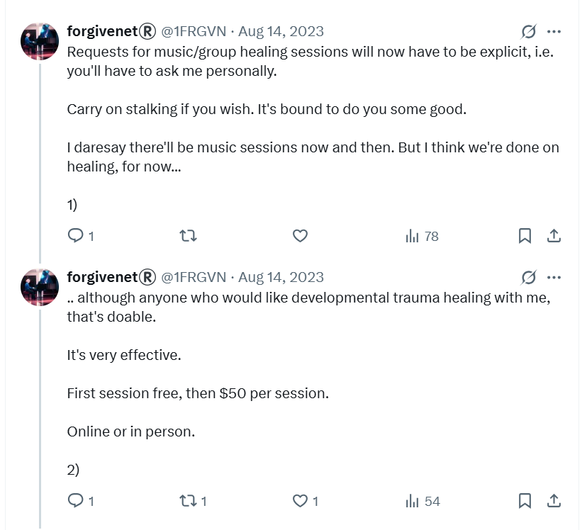
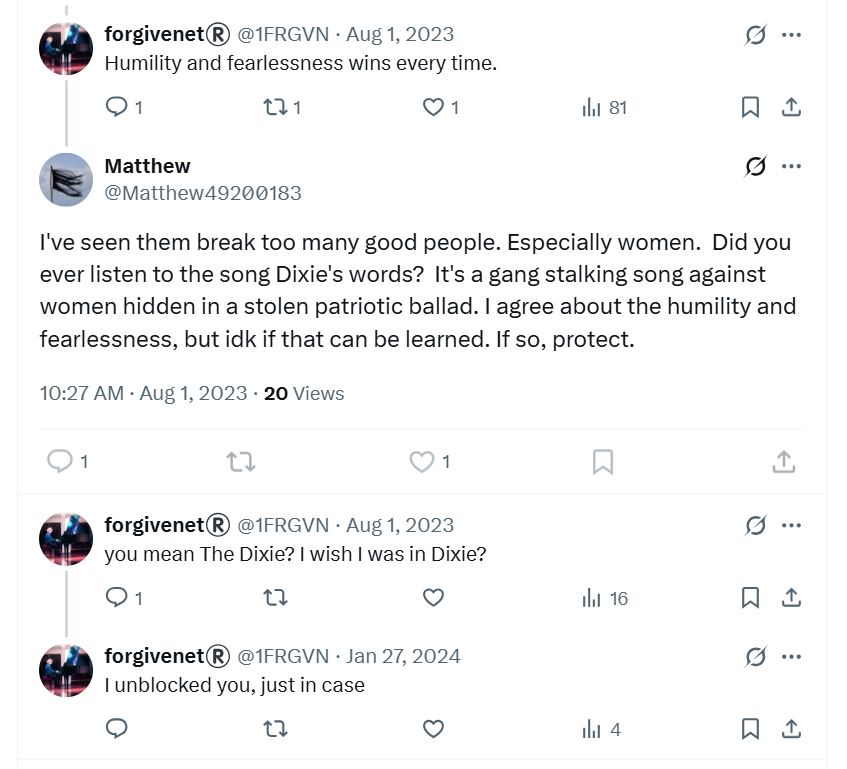
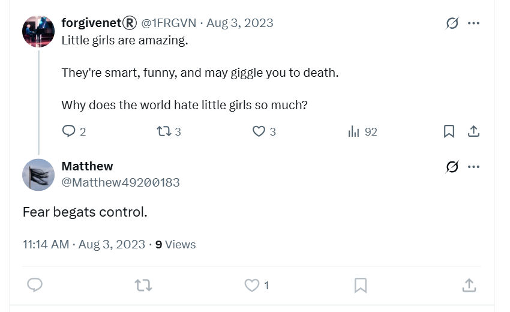

# August 2023

## France, Lourdes & Cauterets

- I spend the rest of the summer in France, right up to the end of August.
- I spend one week in Lourdes before heading up to Cauterets.
- Teachers and staff at the conservatory have decided my fate in the meantime, and it will be continued online harassment leading up to another "arrest" scare just before I leave France to come home.
- I guess the intention is that I don't return to my music studies at the conservatory, as before, leaving me isolated and open to acute fraud, drugging, and major sex crimes in my apartment.
- I'm unaware of the specifics of the evil in the background; although I can feel it very strongly.
- The online stalking intensifies and I realize people are monitoring my activity continuously.
- I'm still obsessed with the trumpet teacher and think about him constantly.
- It's as if I'm having a conversation with him online and we're in love with each other.
- I connect with an old friend on Facebook, Matthew Copeland.
- I tell him I'm in love with a man and I believe I have an audience on Twitter so I'm DJ'ing to them using the `#MaSelecta` hashtag.
- I tell him it's the chirps (chat up) of the century.

- I experience more online weirdness, such as confusing access issues on my Skype account, strange messages on Twitter and YouTube.
- The hackers are upping the game and getting ready to reveal themselves.

## Tarot

- Given the precision of the [tarot card reading](../2022/july.md#tarot) I had in Glastonbury the year before, I contact Michael on Wearyall Hill to request another reading over the phone.
- He insists I use my own deck, so I buy one from a 'spiritual' shop in Dénia a couple of days before leaving.
- At the beginning of the month, we do the reading over the phone from my hotel room in Lourdes.
- We do a general reading and a lot of the terror comes up; 10 of swords, etc. It's a grim outlook.
- I ask, of course, about my relationship with the trumpet teacher.
- We do a love reading.
- The outcome is The Lovers card.
- It's mind-blowing at the time and to this day remains very precise.

## Google search

- I continue to do Google searches on the `@jctot19`, `@sinremite`, and my own `@1frgvn` and `@jackchardwood` accounts.
- Nothing significant pops up on here until I'm back home in September and studying at the conservatory for year 4 of professional studies.

## Tweets

- The X communication with hackers is ongoing. 
- I assumed they were just reading my tweets, but then the conversation became definitively two-way again, like before with the `@jctot19` account.
- They post significant replies to me via *apparently* normal posts on my X feed or YouTube activity, via fake accounts that follow or like something I've posted, and even on adverts and spaces on the sidebars of my X UI.
- I don't remember the `@jctot19` account being overly significant at this time because the communication methods had expanded. 
- It was impossible to screenshot any of this as it was a fast moving conversation and, singly, each message they send me looks totally insignificant to an observer.
- These online activities are psychological and emotionally manipulating crimes that are steadily setting up a major fraud almost impossible to prosecute.
- I believe I am talking to the trumpet teacher directly in a loving manner, and then to Domingo and his family who communicate with me in a violent and threatening way, and it goes back-and-forth like this.
- I am obsessed with music from the 1989 rave scene which I was listening to at the time I was groomed, sedated, and gang-raped repeatedly as a child and put in porn.
- I tweet all the tunes I listen to on YouTube and you can find them by searching X with the tag `#MaSelecta`.
- Following is a selection of tweets from this period which relate to the previous six months' sexual grooming and psychological and online attacks by teachers and staff at the conservatory.
- I'm totally unaware at this stage that organized criminal gangs are behind everything, including British gangs.
- There is very little communication to me in English.
- Most of my tweets are translated, and I assume the Spanish are reading them. 
- Here's an example of some [tweet translation statistics from this month](../../content/tweets/people-translating-tweets.pdf) on a random and rather insignificant tweet. Everything I write was being monitored.
- The tweets confirm what is going on for me online; my concerns for my safety, constant communication with hidden groups, extremely threatening content including murder and violence, an overwhelm of porn bots and porn content, direct references from hidden groups to matters related to my experiences at the conservatory, continued suggestions that the trumpet teacher was in love with me, and on and on.
- Threat levels increased steadily throughout August until I was severely threatened with an online psychological trigger that I believed was real, (similar to my experience in [Thailand](july.md#the-first-time-i-become-terrified-about-being-arrested)), that I was going to be arrested by the police when I returned to my home in Dénia.
- The psychological trigger was powerful enough to get me to go public on X at the end of this month and ask the gender critical community (and feminist groups by default) for help.

### `@1frgvn`

- Saying hi to all my stalkers. I expected the English-speaking stalkers to be mainly trans activists, and the Spanish ones to be musicians.

- Reporting kidney damage. I had no idea I was maliciously poisoned on [Monday 28th January 2023](january.md#serious-poisoning-at-chamber-music-class) by the trumpet teacher and Dr Joan from the Dénia hospital at La Xara.

- Sometimes, the tunes I was playing with my `DJ #MaSelecta` tag had rather significant lyrics.

- I gave them all a good telling off.

- Given I'm in the right and have the moral high-ground, I imagine their behavior when they have to answer to their crimes, and I also wonder whether the trumpet teacher will remain with the Cano's or not.

- Watching misogynists tie themselves up in knots.

- Comment on (what I thought was) Domingo's woman-hating, but in fact was his commentary on my lack of baby-making or porn-readiness.

- Who is The One?

- How to communicate with constant online surveillance by people unknown? Why not clear the air for them.

- Things they needed to hear.

- I started referring to the upcoming 4th year of professional studies as season 3. Season 2 was the trumpet teacher debacle and season 1 was the [first attempt to control me in 2014](../early-years/2014.md#conservatory-audition).

- This post below blew my mind a little. The pic on the last post of the thread came up on a random gif selection, but I don't believe it was random at all. The character here actually looks gaunt and unwell just like Domingo. 

- Things like this made me start to believe there were two camps to the stalkers, some friends, some enemies, or they just took the piss out of each other constantly. Of course, the trumpet teacher would have been on my side.

- The whole story, sort of.

- Comment on corruption (enchufe).

- Comment on the lack of child safeguarding in our world and, in particular, my environment.

- I quite often tweeted about the benefits to me from falling in love and how it was a catharsis towards finding my latent fierceness and inner power.

- These thoughts often included my feelings that everything was connected to the child pedo-rape-gang abuse I'd experienced in 1989.

- I ask about [Benijembla](../2022/november.md#walking-in-benijembla-with-the-english-ladies).

- I mention that [Patricia](../2022/october.md#patricia) apparently benefitted from my suffering too.

- I mention the women in the trumpet teacher's life: Ana, Carmen, Silvia, etc.

- I ask directly, who is Silvia?

- I suddenly realized, and was absolutely sure, there was a two way conversation going on with a bunch of hidden people due to sudden interactions from random accounts that were 100% related to the tweet I had just posted. The post below was related to how I was going to somehow figure out the language of the hidden people who were communicating with me and use it for myself. These communication efforts of mine were really something marvelous to behold. It's not clear why teachers and staff at the conservatory remained steadfast on their grim trajectory given all the warnings.

- Here's a tweet about concern for my safety. It seemed to me that the hackers were OK about communication which was banal or comic, but whenever safety came into it, they went quiet; except on my [`@jackchardwood` account](#jackchardwood) at the end of the month when they were very clear about who they were and how much danger I was in.

- I told my cyber-stalkers interesting, and true stories about why I felt Dénia was such an important place for me.

- A comment on their evil.

- And another.

- And another.

- Here's a tweet where I'm trying to understand what provoked such an experience at the conservatory. I considered the "director" to be Domingo, and the "lead" to be the trumpet teacher.

- By November 2024, I had figured it all out.

- Here's a comment related to my belief that attempting to [communicate with the trumpet teacher by tweet](april.md#disclosing-child-sexual-abuse-to-the-trumpet-teacher) was my biggest mistake.

- I tweeted a lot of friendly content to them, as if we were mates.

- I tweeted a lot of direct comments to the hackers. I still do that; it's now May 2025 and they're still communicating openly with me online and in person in a threatening manner. Their membership is far wider now too, and most obvious, as per design.

- When the hackers took over my keyboard as I was typing, and I knew for sure I was being hacked, I told them to 'stop' in French.

- I report annoyance at having to deal with being hacked.

- I report being concerned about my personal safety.

### `@JackChardwood`

!!! tip "X search"
    - I'm using the following search in this section: https://x.com/search?q=(from%3Ajackchardwood)%20until%3A2023-09-01%20since%3A2023-07-15&src=typed_query&f=live

- My `@JackChardwood` account becomes infested with stalker activity during this period. It started when I got back from Thailand in July, so I'll add anything interesting from then too.
- I'm suddenly followed by a lot of fake accounts, many of them porn and crypto bots. My account had no more than a single-figure handful of followers prior to the 23rd July when I got back from Thailand. Before that there was little to no activity at all on this account.

 

- Even though I reply to crypto accounts, the views are in the single digits. This would be the normal activity level on this account, prior to cyber-stalking, and after too.

- I knew that something weird was going on or around the same time I did the [tarot over the phone](#tarot) in Lourdes. The tweets intended for hackers have multiple views. I assume there is some dissemination mechanism in place, such as a WhatsApp group perhaps.

- Durian is mentioned repeatedly on fake account profiles; remember I gave [Gloria some durian](july.md#durian-for-gloria) as a gift in July.

- My account was also heavily targeted by fake accounts related to dogs; of course the reference is to the surname Cano Lopez. This was at the end of August at the same time I started believing I was going to be arrested, and it coincided with the hackers revealing themselves by taking over my keyboard so I was 100% sure I was hacked.

- I should have realized at this time that the cyber-attack was industrial scale. It would take me nearly a year more before that became clear and even then my mind was so controlled by these people that I could not grasp the full extent of the conspiracy.
- Following is an example of the sort of interaction I was having with hackers over the month up until I became really scared again.
- Communication starts, as before, in a lighthearted manner.

- I say hi to the new followers.

- I know I have an audience, so I tweet interesting things, and get a lot of views.

- Tweeting about my DJ app.

- A comedy tweet on what the bots are like.

- Telling them how much I'm enjoying their funny posts. I also wonder if this kind of content is evidence of fawn.

- It's around now, I start to tell them they can come and work for the [forgivenet](https://1frgvn.com). My idea is that they can help me with marketing and getting people to use the platform.

- When Elon offers to pay legal fees for anyone treated unfairly by their employer after posting on X.com, I want to know if that includes government officials in Spain.

- Views of my tweets drop off after this post, dramatically, but the translation numbers remain stable. I'm still being targeted however. I complain about it and ask them to call off the dogs.

- Did this post annoy them into terrorizing me even more? Here's a response to some porn posted on my feed.

- Comment on closing the stable door after the horse has bolted. The man in this pic reminds me of the trumpet teacher.

- I offer them a truce.

- A response to something, it's not clear what.

- Another job offer to help me with the forgivenet.

- Offering forgivenet t-shirts.

- Offering a second interview to the hacker.

- Promising them the ride of their lives.

- The following tweet seems to be evidence for the 'good' trigger in action; manipulation techniques that make me feel warm and loving. This is a psychological technique often called 'coupling' in which a good feeling is associated quickly with terror and fear, locking a target into a trauma bond.

- Right after this, they take over my keyboard. I detail this in a [following section](#the-hackers-reveal-themselves) but it's important to note that from here I have no doubt they have video and sound recordings of me [masturbating in my hotel room in Lourdes](april.md#good-friday).

- The morning after the big hacking reveal, I explain what I need.

- Around this time, I was head-hunted by a company called Torus looking for a technical writer. I'm convinced it's part of the attack and explain this to the head-hunter. The manager is Spanish, from Valencia, and had worked for Polygon. I detail this in a [following section](#head-hunted). The web3 comment is related to this. 

- It's the end of the month and I'm starting to feel scared about something I cannot pinpoint.

- I believe the 'bad' trigger is starting now; another psychological coupling technique where online visuals and sounds are being used to trigger fear and anxiety about something. I try to talk to them about it.

- I try to communicate with them about this growing fear.

- I try to reason with them. Monday 4th is the first day I will be home in Spain.

- We need to talk.

- I tell them I won't go back to the conservatory if that's what they want, but I need some confirmation I'll be safe.

- At this exact moment, the fake account connected to "durian" pops up by liking the last seven of my tweets in quick succession. I examine it closely. It has a long list of followers and they are all 'dog' related. The account no longer exists.

- It's very obvious to me at this time I'm being targeted online by Domingo Cano Lopez and his family and that is absolutely what I'm supposed to think, whether it is true or not. I'm trying to understand what's going on.

- Note I'm suggesting they have private film of me.

- I wake up the next morning feeling paralyzed with fear.

- When I don't post anything for a while an account called Borey Ka follows me.

- I actually find this sort of interaction with them funny and think these people would be quite cool if they weren't so evil and self-destructive.

## Euphoria

- Throughout the month I remain in a state of intense euphoria.
- I had fallen in love, harder than ever before, and I felt that I was loved back.
- It was heavenly.

- For the first time in my life, I felt beautiful.
- I know very well that all these feelings were manipulated with software downloaded onto my phone and laptops, and reinforced by cyber-stalking on social media, and further solidified by whatever illicit substances the criminals of Dénia had managed to add to my bathroom products, health supplements, and any food or water I brought with me in the car.
- There's some suggestion that criminal gangs had managed to access my belongings in Lourdes and Cauterets too.
- Nevertheless, it felt real, and so I gave it to God for His purposes, and since July or August 2023, I have not experienced any suicidal depression at all. It's totally cured.

## Head hunted

- Throughout August I'm looking for a new role.
- I'm head hunted for a start-up called Torus who had a one-page website promising an upcoming release. 
- I believe the website was `torus.io` which now doesn't even redirect to anything.
- It's possible, if legit, the business ended up here: https://www.torusassociation.org/about-us.html#mission but I do not remember any of these people being part of the interview process or the company description.
- It could be easy to get the company confused with another crypto app `https://tor.us/` which has been going for years, but I didn't confuse them.
- I'm convinced it's a scam and I tell the recruiter my fears.
- I was so concerned about the person I was supposed to meet, David Ruiz from *Valencia* who was apparently a Project Manager at Polygon, I contacted Polygon to check if he existed.
- They were not able to confirm, or deny, that this person worked for Polygon, which was even stranger.
- I told the UK recruiter I was not interested because I believed it was a scam and I gave the background that I was being cyber-stalked at the time.

- The one-page release website never moved into a released stage, even when I checked months afterwards. Now the URL is dead.
- At the time, I didn't relate any of this to previous experiences that I had forgotten completely, such as [interviewing for a company where I'd be looking at genitals all day long](../early-years/2016.md#march), but now I do.

## Fighting back

- I realize that Domingo, the trumpet teacher, and all their mates from Dénia are continuing to harass me online.
- I have no choice but to fight back.

- The following point was written in November 2024, while I was still being drugged and poisoned via my bathroom products. Even then, I had yet to get the extent of the attack clear in my mind.

!!! quote "Written in November 2024 during the first draft of my statement"
    - In August 2023, I find myself thinking about the trumpet teacher constantly and, **given it's not possible for me to be drugged**, I now believe that, on top of the drugging, there was some NLP triggering mechanisms built into my Twitter usage which could be relied upon to trigger sexual feelings in the absence of medication, and which had been set up during those medicated times.

- This is probably true to a certain extent but for sure the drugging was continuing.
- I wonder also if there is some low level, sub-audio sexual sound files being played through my phone (which I have safely stored so that the Netflix cyber-experts can check the caches for evidence of this); perhaps porn film soundtracks, or even perhaps my own sexual sounds played back to me given I find porn quite vile.
- This may explain unpredictable sexual feelings I was having throughout this month in various situations away from my computer, and there is a possibility that such a mechanism affected at least one other person too, details of which I will forward when necessary, although I believe this person will have told a lot of people about his weird experience with me that day.
- I believe the hardware/software NLP/hypnotic triggering mechanisms downloaded onto my mobile phone will have focused on sexual arousal mainly, and then fear and anxiety triggers whenever teachers and staff at the conservatory decided to switch from sex to terror.
- It was a push and pull, good and bad, fear and love emotional rollercoaster, on a loop.
- Here's another marker to how difficult it was for me to figure out what was going on for so long.

!!! danger "In retrospect"
    - Now, January 2025, I also realize that criminals of Dénia had been accessing my apartment and adding poisons and drugs to my bathroom products, and food and water. So, continued sexual feelings whenever I was away from home could also be explained by this.

- I start playing a lot of music on Twitter, I add links from YouTube while listening to it with my earphones, and I'm often dancing around my room in Cauterets with my headphones on.
- I'm thinking about 1989 constantly, and specifically the music from that time. Again, this would be easy to trigger as sub-audio files reinforced by tweet content.
- My [tweets from that time](#1frgvn) reveal a fighter, someone who is not going to put up with being terrorized.
- I believe now my fiery behavior was a challenge to the sex-gang cyber-stalkers of Dénia, and they decided they would put a lot more effort into finishing me off in the cowardly way that they do to women, girls, and animals of course.
- They probably had a bet on as to how things would end for me, so certain they were they would win.
- I'm guessing there's 1000s of women and girl victims of these people over the last decades. 
- I hope my story helps them and the people who love them. 
- I pray they find their power, their voices.

## I take a picture of myself in my pants

- Like many women, I want to know how big my bum is.
- The mirror in my bathroom is very small, so I stand on a chair and take a photo of my bum with my mobile phone.
- I'm wearing my white knickers from M&S.
- I keep the photo for only a few days before I delete it.
- Around December 2023, I see this picture again, on a tweet added to my [Google search results](december.md#picture-of-me-in-my-pants-on-google-search).
- I had not seen this tweet before, or since outside of these results.
- When hackers post this for me to see in December, they want me to know how much content they have of me without my knowledge or permission, and to really let me know that I have had no privacy at all, and for a very long time too, longer that I can possibly imagine.

- When I see this picture of me in my underwear (the top half is not me, the bottom half is) in December 2023, it reinforces my certainty that woman-hating, criminal sex gangs from Dénia have film and sound of me [masturbating in Lourdes on Good Friday](april.md#good-friday). 
- Although I suspected it, and even though they had already taken over my keyboard, I was only 100% sure they were interested in photos of my naked body when they posted this picture in December 2023.
- Up until then I still felt it preposterous that I could be interesting in that way to anyone. 
- I did not know I was already famous in teen rape-gang porn and had been for decades. 
- Dénia cyber-stalkers were yet to inform me about that but they would soon [flash up stills for me to see](november.md#first-time-they-flash-up-my-naked-16-year-old-body-on-x) which apparently was supposed to *finish me off* psychologically at least.
- The pic was up for about a week in December and then it disappeared and never reappeared.
- I showed the search results on my mobile to two people who were physically present.

## YouTube

- I'm stalked by accounts on YouTube which you can see in the [August twitter doc](../../content/tweets/august-2023-twitter.pdf).
- I often look at my phone during the day. 
- As I'm looking at YouTube on the desktop one day I notice a video in the bottom section of the page which looks like me while I'm looking at my phone, singing along to the song I'm listening to. I'm startled.

## Matthew

- An account starts to interact with me, `@Matthew49200183`. Here is his first post to me; a reply to a reply.

- Did this person just spill all the beans?

- I see weird stuff going on with this account, such as my likes being added to his posts, without me actually adding them myself. I think it's a glitch but this happens just before hackers take over my keyboard so it makes sense now.
- His second post, a couple of days later, is equally intentional.

- I know the account is related to the cyber-stalking because the hair in the profile picture - at that time - is the same hair picture I saw in July when I was seeing [plate lady](july.md#plate-lady-early-in-the-month) and [Ana](july.md#ana) modelling. 
- I believe the hair pic was posted alone, together with [girl with a cross on her back](july.md#girl-with-a-cross-on-her-back), and maybe with a bit of the owner's head visible too.
- Later in the month, he replies again after I post Buffalo Springfield, Stop Children What's That Sound.

- There's no more interaction between us until 8th October when he replies to a post in a way that makes me now shudder.

- This is a significant account with regards to the cyber-stalking; whether it is an actual person from Denia, or a dark-web porn subscription account that's paying for access to sedated spy-cam targets, or a delegated hacker account given instructions on what to say to a target.
- Whenever the account interacts with me, it says significant things that make me wonder, and believe a little, and then more and more, that I am interacting with the trumpet teacher.
- I have a public tweet conversation with this person which is linked at the bottom of the page along with the other significant tweets.
- We end up DM'ing in December significantly, and for sure there is a connection to Dénia criminals as content from the tweet is mirrored by an adult member of the choir who sits next to me at class at the conservatory.
- Later on, I take a look at some of the posts on this account and I note extremely enticing, honey-trap-type content coming from (apparent) women.
- A snippet of a tweet chat with Matthew.

- Reviewing these interactions, particularly the one from the end of November, makes me shudder and shudder again.

- This was an out-of-the-blue meaningless reply, except *nervous sweaty elephant* was a reference to me. When I went to class about an hour later, the woman beside me stunk of peanuts and the choir master (who will send me a dick pic on X in September) spoke endlessly about elephant trunks, *trompas* the word also happens to be very similar to trumpet, *trompa*.

## Fake accounts

- On my other Twitter account, [@JackChardwood](https://x.com/JackChardwood), I'm followed by fake accounts with names like Ana, Carmen, and some are porn accounts.
- It's important to note that up until that moment, this account was dead, nothing happened on it at all. 
- This was the beginning of the obvious cyber stalking and, specifically, an ongoing porn infestation of my online activity.
- The porn accounts are no longer following me at the time of writing but there were many.
- One was particularly sinister, named Anna in the [August twitter doc](../../content/tweets/august-2023-twitter.pdf). 
- It was kind of demonic, with a woman who had her long thick black hair put all over her face so you couldn't see it, and she was dressed in her underwear, and making sexual suggestions. It was extremely weird actually.
- I noticed also that this account's profile message seemed to suggest a death threat against me.

- "Anti K a muerte" could be read as this account is "anti Katharine to the death".

!!! info
    - Thinking of that particular porn example now, and others like it, it was obvious that I was not actually dealing with just "foolish immature men", there was something much more sinister going on.
     
- Other accounts seemed to be threatening also:

- Curiously, this account now has completely changed tone: https://x.com/marcop51.
- Some of the fake accounts that follow me are called **Durian**, so I know it's Domingo and his associates.
- Another account is called JungleMary and this is significant because I have been playing a lot of jungle music online and tweeting jungle tracks. I am also devoted to Mary and often tweet about it too.

- Also, "just me" is something I have said a lot previously.
- [This document](../../content/tweets/august-2023-twitter.pdf) is a collection of some of those accounts. You will see durian mentioned and also the accounts mentioning dogs is a close relation to Domingo's surnames: Lopez Cano, which have a distinct canine connotation.
- I see an account with a woman I recognize taking a tablet suggestively and I know this is related to the 1989 drug scene.
- Since I opened a Facebook account for the general election in the UK in June 2024, I have the same sort of spam accounts full of dogs and horses trying to connect with me.

## In the baths at Cauterets with Sally

- I take Sally to the baths at Cauterets.

- She behaves as if she is very shy of being in her swimming suit in public.
- We sit in the bubbling beds outside, the Péguère mountain watching us.

- I tell her I'm going to tame the trumpet teacher, and that he'll enjoy it.

## The hackers reveal themselves

- It's getting time to go back to Spain and the cyber-stalking and harassment is intensifying.
- There are a lot of suggestive posts about someone going to be arrested, it's not clear why or what for, but it's clear they mean me.
- I'm starting to see a lot more porn, but also a lot of real-life death and murder videos from accounts I never followed.
- At one point, I'm on my laptop and I lose control of my keyboard, except someone is typing for me instead.
- I tweet "Arrettt-a" to say STOP.

- I realize with horror they have total access to my laptop, and probably my phone as well.
- I assume it is because my laptop is not very well secured and they got in via the hotel network. I'm very wrong about that but this is what I tell people for a while.
- Accounts full of dogs follow me on my @JackChardwood Twitter account. I assume to reference Lopez Cano, a pun of dog wolf.
- I'm horrified. I send a WhatsApp message to Concha to ask if she thinks they're dangerous. She says no. I'm not convinced.
- I understand from her silence and their audacity that police action will be difficult to obtain. 
- I [send an email to a private detective](../../content/documents/emails/pdick.pdf) in Spain to see if they can help me link these people to crimes against me. They say they cannot help me.
- I send a post on my @JackChardwood account saying I won't go back if I'm in danger, and other things. 
- An account, Sumithra, who follows an account Durian, follows me immediately (screenshots in the [August twitter doc](../../content/tweets/august-2023-twitter.pdf)) and likes every post. I know it's Domingo and the trumpet teacher.
- https://x.com/JackChardwood/status/1696990588628029460

- The Sumithra account no longer exists.
- If you look at the accounts that have followed the Sumithra account in the [August twitter doc](../../content/tweets/august-2023-twitter.pdf), you will see they are all dog-related.
- The `@january_myth` account who had posted triggering content on [12th June](june.md#monday-12th-june-2023) posts again.

- I miss the posts as being connected to what's going on for me at this time, and will only figure this out in March 2024.
- The two posts are related to events designed to terrorize me into never returning to my piano studies at the conservatory. 

## The second time I am convinced I'm going to be arrested

- I'm so scared I text Concha to ask her if she thinks these people are dangerous.
- I'm so scared I try to contract a private detective agency to help me gather evidence for the hacking and stalking.

<audio controls>
    <source src="../../../content/sounds/i-have-the-feeling-im-going-to-be-arrested.mp3" type="audio/mpeg">
    Your browser does not support the audio element.
</audio>

## Going public on Twitter

- I don't know what to do, I feel like parasites are all over me and I can't get them off.
- I'm on my way back to Spain and I believe the intensifying harassment is due to them not wanting me to return to Dénia.
- There has always been a suggestion that I was targeted for my gender critical beliefs, amongst other things.
- The only possible thing I can do is to go public on Twitter and ask for help, which I do.
- Going public means adding my real name to my Twitter account Dr Katharine Murphy.
- I do that and ask for help and overnight I gain 1000s of followers from the gender critical movement. 
- I feel much much safer.
- At the same time, many, if not a majority of these new accounts are fake accounts managed by the stalkers.

!!! danger "Throwing me to the wolves"
    - A running theme of being thrown to the wolves, first by the English ladies, then by my teachers, and now even by the wolves themselves.
    - At the moment I went public on Twitter, I believe many more criminal gang networks operating on social media were alerted to my presence and vulnerability.
    - So, although I was safer in some respects, I was also in more danger in others.

## More evidence from this period

- [Download my laptop browser history from this period](../../content/documents/evidence/history.csv).
- [JackChardwood Twitter download](https://drive.google.com/file/d/1uP3tH3Y7BKmPrqj9fHFN8ukcD_EyYCT6/view?usp=drive_link).
- A good sense of what was going on around the end of August and beginning of September can be seen using this [Twitter search: (from:jackchardwood) until:2023-09-10 since:2023-08-29](https://x.com/search?q=(from%3Ajackchardwood)%20until%3A2023-09-10%20since%3A2023-08-29&src=typed_query&f=live). All of these tweets have been translated many times.
