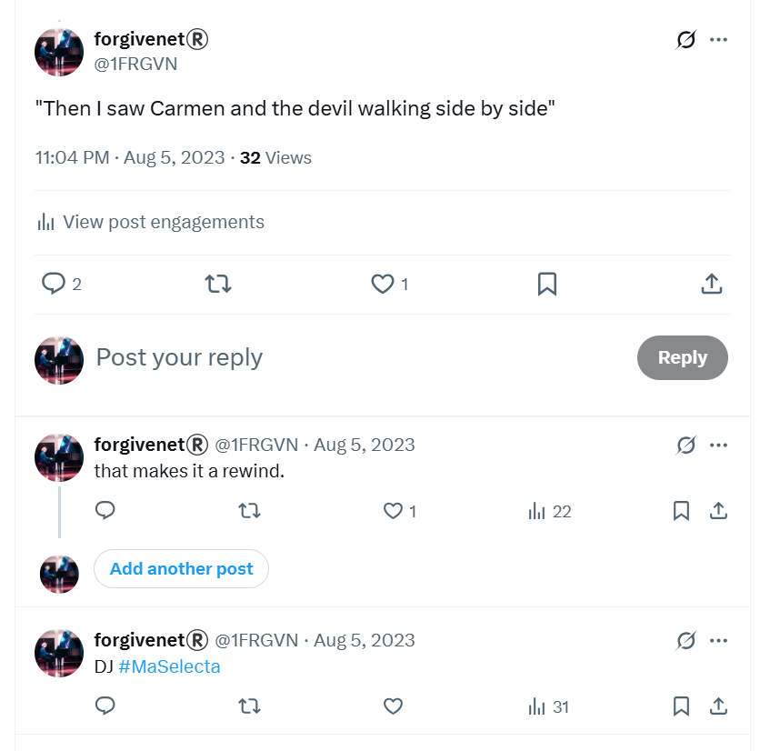
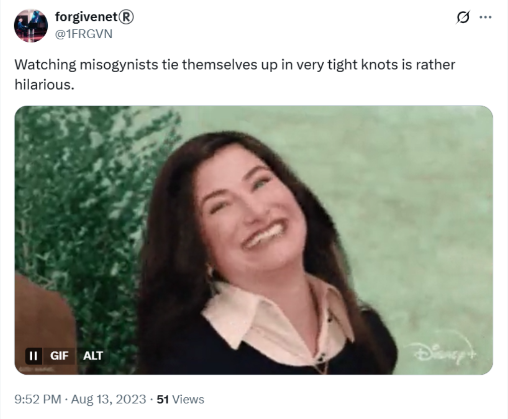
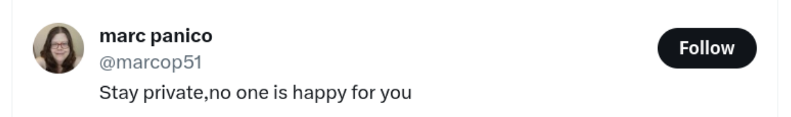
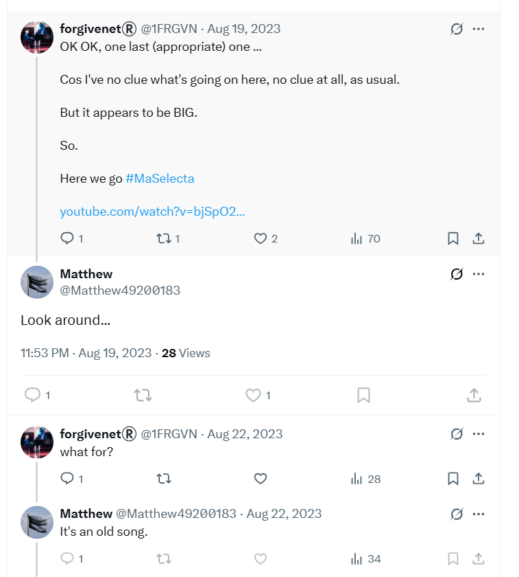
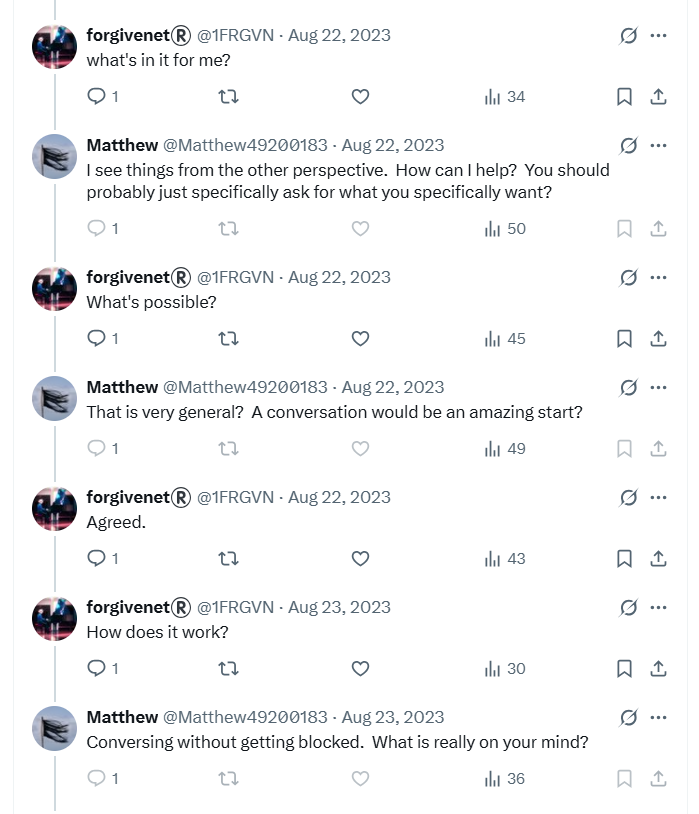
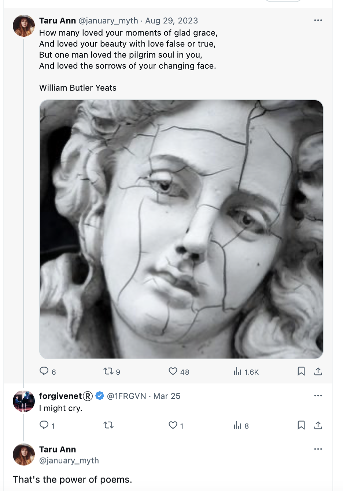

# August 2023

## France, Lourdes & Cauterets

- I spend the rest of the summer in France, right up to the end of August.
- I spend one week in Lourdes before heading up to Cauterets.
- Teachers and staff at the conservatory [have decided my fate in the meantime](july.md#urgent-staff-meetings-at-the-conservatory); continued online harassment leading up to another "arrest" scare just before I leave France to come home.
- I guess the intention is that I don't return to my music studies at the conservatory, as before, leaving me isolated and open to acute fraud, drugging, and major sex crimes in my apartment.
- I'm unaware of the specifics of the evil in the background; although I can feel it very strongly.
- The online stalking intensifies and I realize people are monitoring my activity continuously.
- I'm still obsessed with the trumpet teacher and think about him constantly.
- It's as if I'm having a conversation with him online and we're in love with each other.
- I connect with an old friend on Facebook, Matthew Copeland.
- I tell him I'm in love with a man and I believe I have an audience on Twitter so I'm DJ'ing to them using the `#MaSelecta` hashtag.
- I tell him it's the chirps (chat up) of the century.

- I experience more online weirdness, such as confusing access issues on my Skype account, strange messages on Twitter and YouTube.
- The hackers are upping the game and getting ready to reveal themselves.

!!! danger "A bombardment"
    - I'm cataloguing only the most important information as I see it.
    - I left masses of information out because it is impossible to report every tiny thing that happened.
    - Suffice to say, I experienced a cyber-stalking bombardment, from all possible angles.
    - Once I was back in Dénia, this would continue in the street and again at the conservatory.

### Larry

- I mention an old friend Larry from time to time.

- They don't know who he is. 
- I know this because a day later, I see a post on my X feed.

- At the time, I can imagine hacker have full root access to my browser and are running some kind of user interface editing software which means they can replace anything on my UI with their own content.

## Tarot

- Given the precision of the [tarot card reading](../2022/july.md#tarot) I had in Glastonbury the year before, I contact Michael on Wearyall Hill to request another reading over the phone.
- He insists I use my own deck, so I buy one from a 'spiritual' shop in Dénia a couple of days before leaving.
- At the beginning of the month, we do the reading over the phone from my hotel room in Lourdes.
- We do a general reading and a lot of the terror comes up; 10 of swords, etc. It's a grim outlook.
- I ask, of course, about my relationship with the trumpet teacher.
- We do a love reading.
- The outcome is The Lovers card.
- It's mind-blowing at the time and to this day remains very precise.

## Google search

- I continue to do Google searches on the `@jctot19`, `@sinremite`, and my own `@1frgvn` and `@jackchardwood` accounts.
- Nothing significant pops up on here until I'm back home in September and studying at the conservatory for year 4 of professional studies.

## Tweets

- The X communication with hackers is ongoing. 
- I assumed they were just reading my tweets, but then the conversation became definitively two-way again, like before with the `@jctot19` account.
- They post significant replies to me via *apparently* normal posts on my X feed or YouTube activity, via fake accounts that follow or like something I've posted, and even on adverts and spaces on the sidebars of my X UI.
- I don't remember the `@jctot19` account being overly significant at this time because the communication methods had expanded. 
- It was impossible to screenshot any of this as it was a fast moving conversation and, singly, each message they send looks totally insignificant in isolation to an observer.
- Everything I experienced was part of a calculated psychological and emotionally manipulation; crimes that are slowly and steadily setting up a major fraud almost impossible to prosecute.
- I believe I am talking to the trumpet teacher directly in a loving manner, and then to Domingo and his family who communicate with me in a violent and threatening way, and it goes back-and-forth like this.
- I am obsessed with music from the 1989 rave scene which I was listening to at the time I was groomed, sedated, and gang-raped repeatedly as a child and put in porn. There is no reason for this obsession outside of psychological triggers and online manipulation.
- I tweet all the tunes I listen to on YouTube and you can find them by searching X with the tag [`DJ #MaSelecta`](https://x.com/search?q=%23MaSelecta%20(from%3A1frgvn)&f=live&src=typed_query).
- Following is a selection of tweets from this period which relate to the previous six months' sexual grooming and psychological and online attacks by teachers and staff at the conservatory.
- I'm totally unaware at this stage that organized criminal gangs are behind everything, including British gangs.
- There is very little communication to me in English.
- Most of my tweets are translated, and I assume the Spanish are reading them. 
- Here's an example of some [tweet translation statistics from this month](../../content/tweets/people-translating-tweets.pdf) on a random and rather insignificant tweet. Everything I write was being monitored.
- The tweets confirm what is going on for me online; my concerns for my safety, constant communication with hidden groups, extremely threatening content including murder, suicide, and violence, an overwhelm of porn bots and porn content, direct references from hidden groups to matters related to my experiences at the conservatory, continued suggestions that the trumpet teacher was in love with me, and on and on.
- Threat levels increased steadily throughout August until I was severely threatened with an online psychological trigger that I believed was real, (similar to my experience in [Thailand](july.md#the-first-time-i-become-terrified-about-being-arrested)), that I was going to be arrested by the police when I returned to my home in Dénia.
- The psychological trigger was powerful enough to get me to go public on X at the end of this month and ask the gender critical community (and feminist groups by default) for help.

### `@1frgvn`

- Saying hi to all my stalkers. I expected the English-speaking stalkers to be mainly trans activists, and the Spanish ones to be musicians.

- Reporting kidney damage. I had no idea I was maliciously poisoned on [Monday 28th January 2023](january.md#serious-poisoning-at-chamber-music-class) by the trumpet teacher and Dr Joan from the Dénia hospital at La Xara.

- Sometimes, the tunes I was playing with my `DJ #MaSelecta` tag had rather significant lyrics.

- I gave them all a good telling off.

- Given I'm in the right and have the moral high-ground, I imagine their behavior when they have to answer to their crimes, and I also wonder whether the trumpet teacher will remain with the Cano's or not.

- Watching misogynists tie themselves up in knots.

- Comment on (what I thought was) Domingo's woman-hating, but in fact was his commentary on my lack of baby-making or porn-readiness.

- Who is The One?

- How to communicate with constant online surveillance by people unknown? Why not clear the air for them.

- Things they needed to hear.

- Note I mention the 'raging horn' here. This is very significant given I had no sexual partner for nearly 13 years and remained completely celibate without masturbating or feeling any sexual arousal throughout this time.
- The overwhelming sexual arousal came completely out of the blue. It would take me a further year to understand it could only be due to the effects of drugging. 
- Crazily, I thought it was evidence for true love! 
- Perhaps, crazily, it was.

- I started referring to the upcoming 4th year of professional studies as season 3. Season 2 was the trumpet teacher debacle and season 1 was the [first attempt to control me in 2014](../early-years/2014.md#conservatory-audition).

- This post below blew my mind a little. The pic on the last post of the thread came up on a random gif selection, but I don't believe it was random at all. The character here actually looks gaunt and unwell just like Domingo. 

- Things like this made me start to believe there were two camps to the stalkers, some friends, some enemies, or they just took the piss out of each other constantly. Of course, the trumpet teacher would have been on my side.

- The whole story, sort of.

- Comment on corruption (enchufe).

- Comment on the lack of child safeguarding in our world and, in particular, my environment.

- I quite often tweeted about the benefits to me from falling in love and how it was a catharsis towards finding my latent fierceness and inner power.

- These thoughts often included my feelings that everything was connected to the child pedo-rape-gang abuse I'd experienced in 1989.

- I ask about [Benijembla](../2022/november.md#walking-in-benijembla-with-the-english-ladies).

- I mention that [Patricia](../2022/october.md#patricia) apparently benefitted from my suffering too.

- I mention the women in the trumpet teacher's life: Ana, Carmen, Silvia, etc.

- I ask directly, who is Silvia?

- I suddenly realized, and was absolutely sure, there was a two way conversation going on with a bunch of hidden people due to sudden interactions from random accounts that were 100% related to the tweet I had just posted. The post below was related to how I was going to somehow figure out the language of the hidden people who were communicating with me and use it for myself. These communication efforts of mine were really something marvelous to behold. It's not clear why teachers and staff at the conservatory remained steadfast on their grim trajectory given all the warnings.

- Here's a tweet about concern for my safety. It seemed to me that the hackers were OK about communication which was banal or comic, but whenever safety came into it, they went quiet; except on my [`@jackchardwood` account](#jackchardwood) at the end of the month when they were very clear about who they were and how much danger I was in.

- I told my cyber-stalkers interesting, and true stories about why I felt Dénia was such an important place for me.

- A comment on their evil.

- And another.

- And another.

- Here's a tweet where I'm trying to understand what provoked such an experience at the conservatory. I considered the "director" to be Domingo, and the "lead" to be the trumpet teacher.

- By November 2024, I had figured it all out.

- Here's a comment related to my belief that attempting to [communicate with the trumpet teacher by tweet](april.md#disclosing-child-sexual-abuse-to-the-trumpet-teacher) was my biggest mistake.

- I tweeted a lot of friendly content to them, as if we were mates.

- I tweeted a lot of direct comments to the hackers. 
- I still do that; it's now May 2025 and they're still communicating openly with me online and in person in a threatening manner, although the intensity of it is infinitesimal compared to back then.
- Their membership is far wider now too and made up of mostly international porn gangs I would say.
- You have to wonder how international porn gangs managed to get so close to Spanish children, and no-one seems to care, rather they're all happy to muck in.

- When the hackers took over my keyboard as I was typing, and I knew for sure I was being hacked, I told them to 'stop' in French.

- I report annoyance at having to deal with being hacked.

- I report being concerned about my personal safety.

### `@JackChardwood`

!!! tip "X search"
    - I'm using the following search in this section: https://x.com/search?q=(from%3Ajackchardwood)%20until%3A2023-09-01%20since%3A2023-07-15&src=typed_query&f=live

- My [`@JackChardwood`](https://x.com/JackChardwood) account becomes infested with stalker activity during this period. It started when I got back from Thailand in July, so I'll add anything interesting from then too.
- I'm suddenly followed by a lot of fake accounts, many of them porn and crypto bots, many of them with names like Ana, Anna, Carmen, Silvia, etc.
- This account had no more than a single-figure handful of followers prior to the 23rd July when I got back from Thailand. Before that there was little to no activity at all on this account.

 

- Even though I reply to crypto accounts, the views are in the single digits. This would be the normal activity level on this account, prior to cyber-stalking, and after too.

- The porn accounts are no longer following me at the time of writing but there were many.
- One was particularly sinister, I'd never seen anything like it.
- It was kind of demonic; a woman with her long thick black hair pulled all over her face so you couldn't see who she was, dressed in her underwear, and making sexual suggestions. It was extremely weird. 
- The account now has porn warnings but it didn't at the time.
- I noticed also that the account's profile message seemed to suggest a death threat against me.

- "Anti K a muerte" could be read as "anti Katharine to the death".

!!! info
    - Thinking of that particular porn example now, and others like it, it was obvious that I was not actually dealing with just *foolish immature men* as I had thought; there was something much more sinister going on.
     
- Other accounts seemed to be threatening also:

- Curiously, this account now has completely changed tone: https://x.com/marcop51.
- I realized that something weird was going on online around the same time I did the [tarot over the phone](#tarot) in Lourdes and started conversing with cyber-stalkers directly. 
- All my tweets intended for hackers have multiple views while the others have minimal views.
- I assume there is some dissemination mechanism in place, such as a WhatsApp group perhaps.

- Durian is mentioned repeatedly on fake account profiles; remember I gave [Gloria some durian](july.md#durian-for-gloria) as a gift in July.

- My account was also heavily targeted by fake accounts related to dogs; of course the reference is to the surname Cano Lopez. This was at the end of August at the same time I started believing I was going to be arrested, and it coincided with the hackers revealing themselves by taking over my keyboard so I was 100% sure I was hacked.

- I should have realized at this time that the cyber-attack was industrial scale. It would take me nearly a year more before that became clear and even then my mind was so controlled by these people that I could not grasp the full extent of the conspiracy.
- Following is an example of the sort of interaction I was having with hackers over the month up until I became really scared again.
- Communication starts, as before, in a lighthearted manner.

- I say hi to the new followers.

- I know I have an audience, so I tweet interesting things, and get a lot of views.

- Tweeting about my DJ app.

- A comedy tweet on what the bots are like.

- Telling them how much I'm enjoying their funny posts. I also wonder if this kind of content is evidence of the fawn trauma-survivor response.

- It's around now, I start to tell them they can come and work for the [forgivenet](https://1frgvn.com). My idea is that they can help me with marketing and getting people to use the platform.

- When Elon offers to pay legal fees for anyone treated unfairly by their employer after posting on X.com, I want to know if that includes government officials in Spain.

- Views of my tweets drop off after this post, dramatically, but the translation numbers remain stable. I'm still being targeted however. I complain about it and ask them to call off the dogs.

- Did this post annoy them into terrorizing me even more? Here's a response to some porn posted on my feed.

- Comment on closing the stable door after the horse has bolted. The man in this pic reminds me of the trumpet teacher.

- I offer them a truce.

- A response to something, it's not clear what.

- Another job offer to help me with the forgivenet.

- Offering forgivenet t-shirts.

- Offering a second interview to the hacker who posts pictures of himself as a cartoon mutant ninja turtle, or a little fat man with glasses.

- Promising them the ride of their lives.

- The following tweet seems to be evidence for the 'good' trigger in action; manipulation techniques that make me feel warm and loving. This is a psychological technique often called 'coupling' in which a good feeling is associated quickly with terror and fear, locking a target into a trauma bond.

- Right after this, they take over my keyboard. I detail this in a [following section](#the-hackers-reveal-themselves) but it's important to note that from this point on I have no doubt they have video and sound recordings of me [masturbating in my hotel room in Lourdes](april.md#good-friday).

- The morning after the big hacking reveal, I explain what I need.

- Around this time, I was head-hunted by a company called Torus looking for a technical writer. I'm convinced it's part of the attack and explain this to the head-hunter. The manager is Spanish, from Valencia, and had worked for Polygon. I detail this in a [following section](#head-hunted-by-ex-polygon-director). The web3 comment is related to this. 

- It's the end of the month and I'm starting to feel scared about something I cannot pinpoint.

#### Threats

- The 'fear and anxiety' trigger is now being prepped by another psychological coupling technique where online visuals and sounds are used to trigger fear and anxiety about something non-specific. 
- I am seeing a lot of real-life murder, accidental death, and malicious injury online on X in accounts I never subscribed to. I see real-life stabbings, a man being eaten by a lion with his family watching, violent porn again, and more.
- I would turn my laptop on and these films would be the first thing I'd see.
- I'm worried about what they're intending to do, and I try to talk to them about it.

- I try to communicate with them about this growing fear.

- I try to reason with them. Monday 4th is the first day I will be home in Spain.

- We need to talk.

- I tell them I won't go back to the conservatory if that's what they want, but I need some confirmation I'll be safe.

- At this exact moment, a fake account connected to "durian" follows me and likes the last seven of my tweets in quick succession. 

- I examine it closely. It has a long list of followers and they are all 'dog' related. The account no longer exists.

!!! tip "June 2024 general election in the UK"
    - When I open a Facebook account to campaign in the [general election in the UK in June 2024](../2024/june.md#election-campaign) - amazingly while I was still being drugged and stalked by Dénia-based criminals - the same sort of spam accounts connect with me; accounts full of dogs and horses, mostly dogs.

- It's very obvious to me I'm being targeted online by Domingo Cano Lopez and his family and that is absolutely what I'm supposed to think, whether it is true or not. 
- I'm trying to understand what's going on.

- Note I'm suggesting they have private film of me.

- I wake up the next morning feeling paralyzed with fear.

- When I don't post anything for a while an account called Borey Ka follows me.

- I actually find this sort of interaction with them funny and I think these people would be quite cool if they weren't so evil and self-destructive.

## Euphoria

- Throughout the month I remain in a state of intense euphoria, and this includes sexual arousal.
- I had fallen in love, harder than ever before, and I felt that I was loved back.
- It was heavenly.

- For the first time in my life, I felt beautiful.
- I know very well that all these feelings were manipulated with software downloaded onto my phone and laptops, and reinforced by cyber-stalking on social media, and further solidified by whatever illicit substances the criminals of Dénia had managed to add to my bathroom products, health supplements, and any food or water I brought with me in the car.
- There's some suggestion that criminal gangs had managed to access my belongings in Lourdes and Cauterets too.
- Nevertheless, it felt real, and so I gave it to God for His purposes, and since July or August 2023, I have not experienced any suicidal depression at all. It's totally cured.

## Head hunted by ex-Polygon director

- Throughout August I'm looking for a new role.
- I'm head hunted by a recruitment agency Spectrum Search for a crypto start-up called Torus who had a one-page website promising an upcoming release (the following week they were supposed to be going live). 
- The website was `torus.io` which now doesn't even redirect to anything.
- They sent a [job description](../../content/documents/torus-jd.pdf) which I felt was bogus, and I told the recruiter I thought so.
- It's possible, if legit, the business ended up here: https://www.torusassociation.org/about-us.html#mission but I do not remember any of these people being part of the interview process and the company activity has completely changed from what was described in the job description.
- I'm also dubious about such an early start-up wanting to hire a technical writer, a job which is commonly the last thing anyone thinks about doing in companies like these.
- It could be easy to get the company confused with another crypto app `https://tor.us/` which has been going for years, but I didn't confuse them.
- I'm convinced it's a scam and I tell the recruiter my fears.
- I was so concerned about the person I was supposed to meet, David Ruiz from *Valencia* who was apparently a Project Manager at Polygon, I contacted Polygon to check if he existed.

- They were not able to confirm, or deny, that this person worked for Polygon, which was even stranger.
- I told the UK recruiter I was not interested because I believed it was a scam and I gave the background that I was being cyber-stalked and probably hacked at that time.
- You can confirm with him: Morgan McCarthy @ Spectrum Search.
- The one-page release website never moved into a released stage, and I checked regularly for months afterwards. Now the URL is dead.
- At the time, I didn't relate any of this to previous experiences that I had forgotten completely, such as [interviewing for a company where I'd be looking at genitals all day long](../early-years/2016.md#march), but now I do.

## Eagles

- Unlike the year before, when [crows had been significant](../2022/september.md#omens-in-the-pyrenees) during my mountain hikes, one of whom was undoubtedly warning me of things to come, this year it was eagles.
- Every time I went into the mountains there was an eagle alongside me, calling.
- When I went into the high mountains for a few days break, I was blessed to see five eagles swooping and playing together close to the peaks above my trail.

- I told someone about this, a mountain expert, and he didn't believe me. 
- He said, no, it couldn't be, no-one ever sees more than about two eagles. It must have been vultures.
- I said, no, it wasn't vultures because of the calls, which I imitated for him.
- He went silent.
- I took the eagles as a very good omen and tweeted about them.
- Eagles became a meme which the hackers and stalkers used to identify themselves.
- Sometimes even the trumpet teacher used this symbol to tell me very private things about himself, which made me love him even more.

## Fighting back

- I realize that Domingo, the trumpet teacher, and all their mates from Dénia are continuing to harass me online.
- They leave me no choice but to fight back.

- The following point was written in November 2024, while I was still being drugged and poisoned via my bathroom products. Even then, I had yet to get the extent of the attack clear in my mind.

!!! quote "Written in November 2024 during the first draft of my statement"
    - In August 2023, I find myself thinking about the trumpet teacher constantly and, **given it's not possible for me to be drugged**, I now believe that, on top of the drugging, there was some NLP triggering mechanisms built into my Twitter usage which could be relied upon to trigger sexual feelings in the absence of medication, and which had been set up during those medicated times.

- This is probably true to a certain extent but for sure the drugging was continuing.
- I wonder also if there is some low level, sub-audio sexual sound files being played through my phone (which I have safely stored so that the Netflix cyber-experts can check the caches for evidence of this); perhaps porn film soundtracks, or even perhaps my own sexual sounds played back to me given I find porn quite vile.
- This may explain unpredictable sexual feelings I was having throughout this month in various situations away from my computer, and there is a possibility that such a mechanism affected at least one other person too, details of which I will forward when necessary, although I do believe this person will have told a lot of people about his weird experience with me that day.
- I believe the hardware/software NLP/hypnotic triggering mechanisms downloaded onto my mobile phone will have focused on sexual arousal mainly, and then fear and anxiety triggers whenever teachers and staff at the conservatory decided to switch from sex to terror.
- It was a push and pull, good and bad, fear and love emotional rollercoaster, on a loop.
- Here's another marker to how difficult it was for me to figure out what was going on for so long.

!!! danger "In retrospect"
    - Now, January 2025, I also realize that criminals of Dénia had been accessing my apartment and adding poisons and drugs to my bathroom products, and food and water. So, continued sexual feelings whenever I was away from home could also be explained by this.

- I start playing a lot of music on Twitter, I add links from YouTube while listening to it with my earphones, and I'm often dancing around my room in Cauterets with my headphones on.
- I'm thinking about 1989 constantly, and specifically the music from that time. Again, this would be easy to trigger as sub-audio files reinforced by tweet content.
- My [tweets from that time](#1frgvn) reveal a fighter, someone who is not going to put up with being terrorized.
- I believe now my fiery behavior was a challenge to the sex-gang cyber-stalkers of Dénia, and they decided they would put a lot more effort into finishing me off in the cowardly way that they do to women, girls, and animals of course.
- They probably had a bet on as to how things would end for me, so certain they were they would win.
- I'm guessing there's 1000s of women and girl victims of these people over the last decades. 
- I hope my story helps them and the people who love them. 
- I pray they find their power, their voices.

## I take a picture of myself in my pants

- Like many women, I want to know how big my bum is.
- The mirror in my bathroom is very small, so I stand on a chair and take a photo of my bum with my mobile phone.
- I'm wearing my white knickers from M&S.
- I keep the photo for only a few days before I delete it.
- Around December 2023, I see this picture again, on a tweet added to my [Google search results](december.md#picture-of-me-in-my-pants-on-google-search).
- I had not seen this tweet before, or since outside of these results.
- When hackers post this for me to see in December, they want me to know how much content they have of me without my knowledge or permission, and to really let me know that I have had no privacy at all, and for a very long time too, longer that I can possibly imagine.

- When I see this picture of me in my underwear (the top half is not me, the bottom half is) in December 2023, it reinforces my certainty that woman-hating, criminal sex gangs from Dénia have film and sound of me [masturbating in Lourdes on Good Friday](april.md#good-friday). 
- Although I suspected it, and even though they had already taken over my keyboard, I was only 100% sure they were interested in photos of my naked body when they posted this picture in December 2023.
- Up until then I still felt it preposterous that I could be interesting in that way to anyone. 
- I did not know I was already famous in teen rape-gang porn and had been for decades. 
- Dénia cyber-stalkers were yet to inform me about that but they would soon [flash up stills for me to see](november.md#first-time-they-flash-up-my-naked-16-year-old-body-on-x) which apparently was supposed to *finish me off* psychologically at least.
- The pic was up for about a week in December and then it disappeared and never reappeared.
- I showed these search results on my mobile to two people who were physically present.

## YouTube

- Another avenue of cyber-violence is YouTube.
- I use YouTube links on my [`DJ #MaSelecta`](https://x.com/search?q=%23MaSelecta%20(from%3A1frgvn)&f=live&src=typed_query) series. 
- I listen to tunes that I like, or tunes that I want to share with hackers, such as *Who Is Silvia?*, and I share them by tweeting them on X.com which is where I think they're monitoring what I do.

- I also often look at my phone during the day, like most people.
- As I'm looking at YouTube on my Linux laptop one day, I notice a video in the bottom section of the page a woman who looks exactly like me while I'm looking at my phone, singing along to the song I'm listening to. 
- I'm startled.

- I look again and she doesn't really look like me at all. I suspect some kind of image manipulation at the time.
- The channel name is interesting too and the kind of name I would expect them to make up for me to see.
- I look for references on how to deal with hackers.

- Sometimes weirdly significant results pop up, such as *canis loupis* (Cano Lopez).

- Sometimes, as above, in a long list of videos I have watched, I see a random outlier which shouldn't be there. *Trdwnds* is one such example.

- I'm convinced it's the trumpet teacher by the names of the songs and by the picture which looks like it could be him with headphones on. I'm sure this is the intention and something more - sound or visuals flashed on my screen - is reinforcing this belief.

- The song names are significant. Ben Button is a meme the cyber-stalkers used a lot to refer to the trumpet teacher who, to-be-fair, is quite old.

- The alchemist is something I call myself on X a fair bit.

- Pretty sure stfu wasn't there previously. 

- Donatello is really interesting as the Donatello ninja-turtle cartoon character was often posted in reference to the hacker himself.

- I listened to some of these songs and politely said they were good, but they weren't, they were boring and all the same, very auto-generated. In fact, they were rubbish and I was extraordinarily disappointed in the trumpet teacher at that moment.
- Another album, Grief, also had interesting track names. I believe this content was an attempt to make me empathize generously with an unspecified grief and loss, typical honey-trap behavior.

- *Junglist* is significant as I always played jungle.

- I'm 6 years old is another repeated meme they used. The suggestion was Ana (his apparent girlfriend) would say that to him angrily: "Are you 6 years old?". Of course *playing* and *the beach* were well connected here.

- There was also a tune called *Jungle Mary* which has since disappeared and reminded me of the `@JungleMary` account which followed me; significant due to the jungle music I have been listening to and my devotion to Mother Mary, all of which I have been tweeting about.

- The stats are interesting. I believe they autogenerated all these tracks and the channel very quickly with AI, posted it with the intention of me seeing it, and did nothing more with it ever again.

## Matthew

- An account starts to interact with me, [`@Matthew49200183`](https://x.com/search?q=(from%3Amatthew49200183)%20(to%3A1frgvn)&src=typed_query&f=live). 
- Here is his first post to me; a reply to a reply.

- Did this person just spill *all* the beans in one go?
- I know the account is related to the cyber-stalking because the hair in the profile picture - initially, see the earlier profile pic below - is exactly the same hair picture I saw in July when I was shown [plate lady](july.md#plate-lady-early-in-the-month) and [Anna Requena, the violin teacher](july.md#ana) modelling amongst other things.

- The hair I saw in July was posted alone, maybe with a bit of the owner's head visible too, and alongside pics of the [girl with a cross on her back](july.md#girl-with-a-cross-on-her-back) on the `@jctot19` and `@sinremite` accounts.
- I remember this consciously when I see the Matthew account for the first time so I know the account is connected to the cyber-stalking.
- I start to see weird stuff going on with this account, such as my likes being added to his posts without me actually adding them myself. I think it's a glitch but this happens just before hackers take over my keyboard so it soon makes sense.
- His second post, a couple of days later, is equally intentional.

- Later in the month, he replies again after I play Buffalo Springfield, Stop Children What's That Sound on my [`DJ #MaSelecta`](https://x.com/search?q=%23MaSelecta%20(from%3A1frgvn)&f=live&src=typed_query) series.
- Note the observation I make about the situation in the first tweet.

- Note, also, my caginess and the reference to a conversation without getting blocked which I believe is a reference to me [trying to communicate with the trumpet teacher in April](april.md#disclosing-child-sexual-abuse-to-the-trumpet-teacher) after getting blocked.
- There's no further interaction between us until 7th October.

- Is Matthew confirming what's been going on for me in this tweet?
- On the 8th October, he replies to an ironic post in a manner that made no sense to me at the time, and now makes me shudder.

- I believe the Matthew account is significant with regards to the cyber-stalking; whether it is an actual person from Dénia, or a dark-web porn subscription account that pays for access to sedated and live spy-cam targets, or a delegated hacker account given instructions on what to say to a target by pornographers, or a mixture of everything I've just said.
- Whenever the account interacts with me, it says significant things that make me wonder, and then believe a little (perhaps a flash of the trumpet teacher in close up on my UI to remind my fascia of a sexual encounter I'm not consciously aware of), and then believe more and more, that I am interacting with the trumpet teacher himself.
- We end up [DM'ing in December 2023](december.md#chat-with-the-american-matthew) significantly.
- Later on, I take a closer look at some of the posts this account retweets and I note *extremely enticing*, honey-trap-type content coming from (apparent) women.
- In retrospect, it reminds me of the [job offer doing the same](../2024/february.md#the-denia-porn-gang-attempts-to-recruit-me) that I go to the police about.
- Reviewing these interactions, particularly the one from the end of November, makes me shudder and shudder again.

- This was an out-of-the-blue meaningless reply with overtones of sexual perversion, and *nervous sweaty elephant* I felt was a reference to me.
- When I went to class about an hour after this interaction, feeling *unusually* stressed and anxious as I always did at choir, the French-horn player who always sat beside me stunk of peanuts (she was eating a peanut bun), and the choir master (an extremely unpleasant man who will send me a dick pic on X in September) spoke endlessly about elephant trunks, *trompas* the word also happens to be very similar to trumpet, and can also mean "big nose".

## In the baths at Cauterets with Sandra Rita Diaz

- I take Sandra Rita Diaz to the baths at Cauterets.

- She behaves as if she is very shy of being in her swimming suit in public.
- We sit in the bubbling beds outside, the Péguère mountain watching us.

- I tell her I'm going to tame the trumpet teacher, and that he'll enjoy it.

## The hackers reveal themselves

- It's near the end of the month and getting time to go back to Spain.
- The cyber-stalking and harassment intensifies.
- I see a lot of suggestive posts about someone going to be arrested; it's not clear why or what for, but it's clear they mean me.
- I'm starting to see more porn, and also a lot of real-life death, suicide, murder, and malicious or accidental injury videos from accounts I never followed.
- They're right on my UI whenever I open my laptop.
- It doesn't make sense and makes me feel extremely uneasy.
- At one point, I'm on my laptop and I lose control of my keyboard, except someone is typing for me instead.
- I tweet "Arrettt-a" to say STOP.

- I realize with horror Domingo and his friends have total access to my laptop, and probably my phone as well.
- I assume it is because my laptop is not very well secured and they got in via the insecure hotel network. I'm wrong about that but this is what I assume and tell people for a while.
- Accounts full of dogs follow me on my [`@JackChardwood` account](#jackchardwood); I assume to reference Lopez Cano, a pun of dog wolf.
- I'm horrified.
- I send a WhatsApp message to Concha to tell her I'm hacked and ask if she thinks these people are dangerous. 
- She says that [my letters](july.md#second-letter-to-concha) now make more sense, but she doesn't think Domingo and his friends are dangerous. It's not convincing.
- She tells me it's imperative I get off social media. I wonder why.
- I understand from her silence and their audacity that police action will be difficult to obtain. 
- I [send an email to a private detective](../../content/documents/emails/pdick.pdf) in Spain to see if they can help me link these people to crimes against me. 

- They say they cannot help me, that I must go to the police.
- I post on my [`@JackChardwood`](#threats) account saying I won't go back if I'm in danger, and other things I mentioned above. 
- An account, `@Sumithra`, who follows an account `@Durian`, follows me while I'm posting these pleas to the hackers.
- The account likes every post. 
- I know it's Domingo and the trumpet teacher.

- The Sumithra account no longer exists.
- If you look at the accounts that have followed the Sumithra account in the [August twitter doc](../../content/tweets/august-2023-twitter.pdf), you will see they are all dog-related.
- The `@january_myth` account (who I suspect is probably [Patricia](../2022/october.md#patricia), at least some of the time) who had posted triggering content on the day of 'my funeral' at the conservatory on [12th June 2023](june.md#monday-12th-june-2023), posts again.

- I miss the significance of this and will only figure out the connection in [March 2024](../2024/march.md#24th-march) when I'm afraid for my life in Valencia and the account retweets this.
- The two `@january_myth` posts are trigger-posts, published at the very moment I'm being terrorized online.
- Was the trumpet teacher continuing to harbor hopes of drawing me into an abusive relationship where he could control me and defraud me of my wealth?
- Would these posts be retweeted back to me once I was entrapped and could not escape, and only then I would know the full extent of the conspiracy, and someone, somewhere would get an extraordinary kick of delight out of my sudden awareness.
- Perhaps they'd take a photo of my face at that very moment and send it round their *shock and embarrassment* paid-for WhatsApp groups?

## I become convinced I'm going to be arrested

- This is the second time I become 100% convinced I'm going to be arrested.
- It's terrifying.
- For sure, my fear and anxiety levels were irrational, and something external was definitely causing this.
- I experience the same fear again in [April 2024](../2024/april.md#the-third-time-im-convinced-im-going-to-be-arrested). 

<audio controls>
    <source src="../../../content/sounds/i-have-the-feeling-im-going-to-be-arrested.mp3" type="audio/mpeg">
    Your browser does not support the audio element.
</audio>

- It's curious that I talk about a 'feeling' rather than anything tangible. (The full video shows exactly how scared I am.)
- I wonder if this means that the criminal porn-gangs of Dénia had conversed with the Tottenham rape-gangs to share notes as to what kind of things might terrify me and how I could be better controlled.
- Being threatened by the gangs with being arrested by the police was something I *never* reported to the police, and I don't remember anything like that happening. However, this does not mean I was not threatened in this way by the gangs and other victims may confirm it as common practice.
- Certainly the level of terror the idea gave me, and gives me even writing this down, implies a suppressed traumatic event of some sort.
- Regardless of the evil around me, just like the first time it happened in [July in Thailand](july.md#the-first-time-i-become-terrified-about-being-arrested) and the [day after my apparent 'funeral' in June](june.md#monday-12th-june-2023) a powerful supporting grace surrounds me.
- First, when I go public a couple of days later, I get 1000s of new followers who will now hear what's been going on for me, although concerted efforts are made to silence and discredit me at that time.
- Second, my Tibetan monk friend will come to visit me when I tell him how upset I am.

## The dev they hired hacks my app

- My crypto app fails early in the month.
- I'm convinced the hacker is involved and say so online somehow - maybe in a short written note that I delete later.

- When I fix it myself (it's a small UI issue), I'm embarrassed and say sorry.
- The hacker responds satirically in a fake account profile message. I don't remember what he said.
- When I remember things like this in June 2025, I realized how much I knew and for how long, but how it was all so unbelievable to me even while it was happening!

## More evidence from this period

- Download my [laptop browser history](../../content/documents/evidence/history.csv) from this period.
- Download the full [`@JackChardwood` X archive](https://drive.google.com/file/d/1uP3tH3Y7BKmPrqj9fHFN8ukcD_EyYCT6/view?usp=drive_link).
- Use the [Twitter search: (from:jackchardwood) until:2023-09-10 since:2023-07-23](https://x.com/search?q=(from%3Ajackchardwood)%20until%3A2023-09-10%20since%3A2023-08-29&src=typed_query&f=live).
- [This document](../../content/tweets/august-2023-twitter.pdf) is a collection of some screenshots I saved. 
