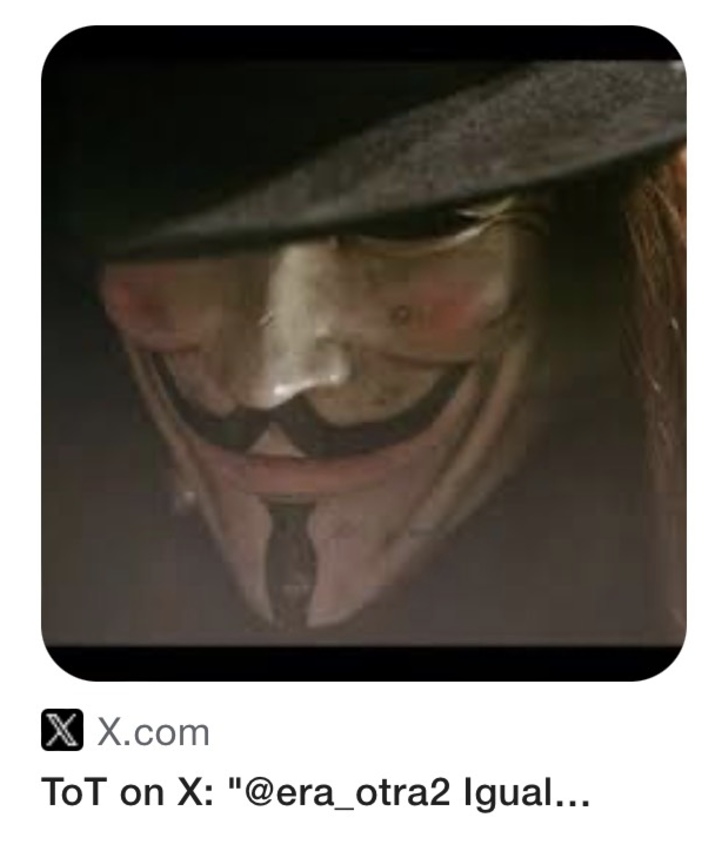

# December 2023

## The trumpet teacher has a brother

- I'm walking through the tunnel back home after class at the conservatory one evening as usual. 
- As I emerge from the tunnel, I see a man who looks *exactly* like the trumpet teacher walking along the road.
- They have timed it precisely so that I will see him.
- This man is clearly the trumpet teacher's brother.
- The likeness is so strong, they could be twins.

!!! danger "UPDATE: These two men, in fact, look completely different!"
    - This is very difficult to figure out; I believe due to being continually drugged and sedated in my home without my knowledge.
    - It's curious that I thought the man I saw outside the tunnel was the trumpet teacher's twin brother.
    - I believed this for over a year, and it was constantly repeated and reaffirmed online.
    - When I got my mind back, from around March 2025, and after I looked over some of the photos online that I posted in [protagonists](../../crimes/protagonists.md#vidal-sastre-sanchez-hornero), I recognize *at least* two men of interest, but there may be more.
    - I talk about the "other trumpet teacher" in [the protagonists section](../../crimes/protagonists.md#the-other-trumpet-teacher).
    - I would recognize these men as "the trumpet teacher" who came to teach classes on a Monday night at Dénia conservatory between 28th November 2022 and 12th June 2023.
    
    
    
    
    

    - Looking at these again, it's possible the first two are the same person.
    - Yet none of these pics are of the man I would see [driving past me](june.md#sunday-11th-june), or lurking around Dénia in [his or Ana's blue car](october.md#the-trumpet-teacher-drives-past-me-in-his-car).

- I run up behind the man and cross the road about a metre before I reach him. 
- He flinches.
- His body size and shape is *not* that of the bigger guy I'm more familiar with who I see around Dénia, [the thick set man I saw in my bed earlier in the year](april.md#dreaming-of-the-trumpet-teacher) who may have also been with [Patricia at Christmas in 2021](../2021/december.md#christmas).
- He's slighter in size and shape, and his hands and fingers are delicate, artistic.
- Later that evening on Twitter, a random stalker replies to one of my posts about something completely unrelated.

- The [Mary G Lamarche](november.md#1frgvn) account had been following me since [I went public](september.md#going-public-on-twitter).
- The profile pic had very surprisingly come up on the `@jctot19` Google search results also.
- At the time, I believe it is a hacker (honey trap, gang-stalker) account, and possibly Domingo or his sister are behind it.
- Now I believe it is more likely Hazel Smith's team as, again, the English is too good for Spanish-speakers, and the account mentions things like Avon, which surely only Brits or Americans would know about.
- I wonder if they wheeled the Valencia-based trumpet teacher out because I found the Dénia version so utterly abhorrent, and [I had *fallen in love* with the Valencia-based version](april.md#dreaming-of-the-trumpet-teacher), and so they needed to remind me of those feelings to keep me hooked in?
- Could teachers and staff at the conservatory of Dénia be this sick in the head?
- Have they been doing the same to countless minors for decades?
- Was the Dénia version of the trumpet teacher [Paco Sendra](../early-years/2007.md#hazel-smith), Hazel Smith's right-hand-man?
- Let's hope Paco does not play the trumpet, and Antonio is an Aries.

## Muscle men outside the tunnel

- Another time I'm walking home from the conservatory, a couple of muscle men approach me from out of the tunnel.
- It's cold but they are wearing tight t-shirts.
- They come up to me, flexing their muscles, and they are grinning at me.
- It's weird.

## Heading to Lourdes

- I spend the December Spanish bank holiday period in Lourdes, France (6-8th December).
- I leave on the 5th December.
- A blue car like the trumpet teacher's (apparent) car drives beside me a short while on the A23 with a man built like the trumpet teacher driving and a woman built like Ana in the passenger seat.

## Picture of me in my pants on Google search

- While I'm in Lourdes, I do the usual Google searches of `@1frgvn` and `@jctot19`.
- On my results, there is a picture of a woman in her underwear.

- I'm shocked as this was the picture I took in August when I was trying to see [how big my bum was](august.md#i-take-a-picture-of-myself-in-my-pants).
- It looks doctored a little, the top half is not me, but the bottom half does look like me.
- I know immediately that, without any doubt, they have sound and video clips of me masturbating.
- I show my friend in Lourdes this search result directly from the Google search function on my mobile.
- They will remove this result from Google search the day after I post a screenshot of it on Twitter: https://x.com/1FRGVN/status/1748728422262546895.

## Meeting Alessandra

- I'm meeting Alessandra now and then for coffee to chat. 
- It's nice to have someone to talk to as I have no one else apart from my friend in Lourdes.
- I now believe she is reporting back to the stalkers, including Hazel.
- When I first saw Alessandra again after nearly 15 years, one of the first things she asked me was "who's your accountant".
- I show her the Google search results I'm seeing and how it's a conversation of some sort. I explain how it works and how it has been working since it started in June.
- I show her the picture of me in my underwear and I explain where it's from.
- A flash of alarm crosses her face.
- I show her a tweet that comes up from time to time on the `@jctot19` account which is clearly a message for me. 

- It's quite complicated Spanish but says something like: "they thought you were an idiot, but they were wrong".
- I first saw this tweet in July, and I remember being so curious about what it meant as it was language I was unfamiliar with, I translated it on my mobile at Valencia airport on my way back from Thailand.
- Of course, every time it came up in search, which was continuously, it made me think that the trumpet teacher still liked me.
- Here is an example of it coming up again in [April 2024](../2024/april.md#google-searches). Scroll to the bottom pic and you will see the `@jctot19` profile pic with this tweet underneath it.

- She asks me how would I feel if he walked in the room right now.
- I believe she was asked to ask me that by criminals to see if the honey-trap 'relationship' was still a possibility.

## I see someone in town from Twitter

- I'm walking back from the Chinese restaurant and I "bump" into someone on the Calle Diana, or he nearly bumps into me.
- It's a person I've seen posted on this account https://x.com/Noahhweb3 quite frequently.
- I understand now that with Mac spoofing, hackers can literally edit everything you see online so that was probably happening with this person, or the account is hacked. There is nothing like that on this account at the time of writing.

## Piano concert

- There is an end of term piano concert at the Casa de Cultura.
- I play some Bach: 
    - [Prelude](https://drive.google.com/file/d/1uciK2nH0yhWDLTMLR7zdDAJDivkmFHkY/view?usp=drive_link)
    - [Fugue](https://drive.google.com/file/d/1iGCjrTOu-spsz4GcQ4mndQ9bJLR3mIYE/view?usp=drive_link)
- Patricia and Christine BJ come to the concert: I meet Christine from time to time for lunch so I guess I informed her about it then as I was still uninvited to hiking with the ladies!
- After the concert, Christine, Patricia, and I go for a drink in a bar nearby.
- We sit down and Christine says: "Why does someone always have to die?".
- I start talking about the drama still going on. I probably say something like "I'm still in love". Patricia looks upset. She leaves soon after.
- Christine and I stay a bit longer for a talk.

## Christmas

- I'm going to volunteer at the [Vipasana meditation center near Madrid](https://www.dhamma.org/en/schedules/schsacca) over Christmas for about 5 days.
- I'm exuberant and high.
- I drive up to Madrid and stay one night before heading to Avila the next morning.
- The Matthew account DMs me before I set off.

## Chat with the American Matthew

- The American account Matthew https://x.com/Matthew49200183 has been following me since August.
- I detail some of his [interesting tweets](november.md#matthew) in November 2023 information.
- We DM when I'm in my hotel in Madrid. 
- Due to the obvious references, I'm sure it's the trumpet teacher, or someone very close to him who can speak/write English.
- I now believe many of these accounts are probably delegate accounts whereby someone can take over them at any moment, although this one looks stolen to me.
- When I ask for verification of who he is, he posts in the DM an identification document for this actual person, Matthew. This happens with other accounts I interact with too.
- He tells me he's nervous because he usually sees me on the WhatsApp group and chatting with me directly is different.
- He tells me about his children. He says he has three daughters and a son from two different marriages. He talks about how he is unhappy his daughters have no political inclinations.
- The interaction goes on till the end of December.
- The communication make it much clearer to me about who he is, or who this person wants me to think he is, and I start to believe I have a boyfriend.

## Avila

- Matthew suggests I contact my parents. I buy angels for them and send them via DHL.
- In Avila I'm extremely sexually aroused. I don't really understand why. It's overwhelming.

## Meditation

- I'm extraordinarily high at meditation volunteering too.
- Looking back, my behavior is erratic and bizarre and not like me at all.
- I believe it is because I am in love but now I'm not so sure and I believe it's possible I was somehow being spiked, possibly through my car as the "problem" with the washing fluid was still happening. Could someone have been tampering with the air-conditioning/heating system in my car?
- The center may well remember my behavior being a bit strange. I was actually separated from the others because I was so exuberant, singing, talking, joking, making jokes of a sexual nature too. Honestly, it was like I'd been hit on the head. I'm not usually like this at all.
- You could ask them.
- Honestly, looking back, I must have been on something.

## The Finnish lady and her boyfriend

- On Christmas Day, a woman comes up to me after morning meditation and say "Thank you for relaxing my nervous system": https://x.com/1FRGVN/status/1740889587545751848
- We had spoken previously in the kitchen and she told me she had been feeling miserable and I cheered her up.
- I gave her and her boyfriend a lift back to Madrid in my car.
- They were musicians, she had her ukelele with her.
- She sang Back to Black to me outside the car and blinked weirdly at me while she was doing it.
- I add this because I texted her later that day to see how they were, and she ignored me.
- I wonder now if they got high with whatever was in my car too.
- It might be useful to track them down.
- She was Finnish, he was German. She was much older than him.
- Whenever I'm feeling a little bit paranoid, I wonder if she knew what was going on. There is a strong Finnish connection with the trumpet teacher, [something that Patricia said](../2022/march.md#conservatory-open-day) that first time we went walking and she was there. 
- She had a ukelele and sang Back to Black like I did in 2007 on Halloween.
- She blinks weirdly at me while she's singing the song.

!!! info
    - When I was sexually abused as a child, I endured extreme brutality and suffered an enormous PTSD afterwards which was debilitating.
    - I believe I brought some of the facial expressions that arose during those attacks into my daily life.
    - One of the things I do from time to time, I'm told, is blink in a weird manner.
    - I believe the blinking comes from when I was being repeatedly raped, and the assault on the body that took place at those times.
    - Blinking may have been my only way to register sexual assault as it was happening and while I was sedated.
    - If I'm right about the Finnish woman, in deeply paranoid moments, it certainly appears much more is going on than at first meets the eye.
    - I wonder if *all* the teachers and staff, especially the women, and the townsfolk of Dénia are aware of the depths of evil this story potentially contains.
    - It's perhaps important to note that abuse sufferers, like myself, are going to be broadly more open to subtle seduction manipulation techniques due to the tearing down of psychological boundaries during such attacks.
    - Ironically, we will also notice them more clearly due to our heightened awareness capabilities.

- I wonder now if this woman was somehow involved did she manage to drug me further because, when I got back to Madrid, I was still out of my mind.
- Curiously, she spoke to me about similar things I had noticed on Twitter content which seemed to be trying to make me insecure about how I looked and whether I was attractive enough for men. I thought that was weird, not as weird at the blinking though.

!!! info
    - This has reminded me of a man I knew in Dénia in 2014 or 15 who I had been introduced to by a French woman there who worked in an estate agency.
    - We had been out one night and he walked a little way towards my home with me, and the whole time he kept blinking and winking at me, while grinning, in an extraordinarily weird manner.
    - So weird, in fact, I mentioned it to the French woman in disgust.
    - The man was Greek and may have been one of the [muscle men](#muscle-men-outside-the-tunnel) I just mentioned.

## Madrid

- Back in Madrid after meditation, Matthew and I DM again.
- We talk about things from the chamber music class with the trumpet teacher, and other stuff. It's personal matters only people related to the gang stalking would know.
- In one of these chats, I ask him to come to Madrid. He says it's not happening.
- I'm not sure it's actually the trumpet teacher at all but I'm extremely high and sexually aroused at this time and it's difficult to keep clear about what's going on.
- I masturbate and I'm 100% sure now (at the time of writing) the sound of this happening is shared in real time with people in Dénia and beyond maybe, as the phone is on the bedside table.
- I visit a friend and tell her everything that's been going on.
- I tell her I'm communicating with the trumpet teacher with Twitter DMs, and I'm convinced I have a boyfriend, or soon will have one.
- I ask her about Spanish men, what they're like, etc.
- It's all totally insane.
- We have lunch and go to the cinema.
- On the way back to my hotel I start to feel extremely unwell.
- I projectile vomit into a wastepaper bin on a Metro platform.
- I have really bad food poisoning for about 2 days.
- My friend was not affected by anything, and we ate exactly the same things.
- As I trawl through the tweetage around this time, I notice I am very vocal about everything that is happening, and I have to wonder if they wanted to shut me up and somehow poisoned me for that reason.

## Hotel room selfie pic

- An account: https://x.com/ItsMe50474936 interacts with me. Note the "It's me" name.
- They post an extremely interesting picture to me.

- "Look at her, remind you of anything?", the account asks.
- I understand immediate that the reference is to me being hacked and filmed in my hotel room in France.
- I wonder who is managing this account but it is certainly someone who knows what's been going on, right back to before I went public on Twitter, when, I assume, the gang stalking was Dénia-contained.
- The hotel room in the photo also looks exactly like the hotel room I'm in at that moment.

## Twitter

- It was around now that the hackers started to suggest they had access to the rape porn filmed of me in 1989.
- They may have been suggesting it before (pictures of tables on Google search) but it had not yet registered.
- They posted pictures of a young girl's body that looked like me.
- They also posted silhouettes of the same thing, with brutal porn suggestions.

These are a selection of tweets from this period which relate to everything that has been happening. Most of them have been translated, a lot, so I assume the Spanish are reading them.

Many of these tweets are confirmation of what has been going on.

### @1frgvn

- https://x.com/1FRGVN/status/1741449673678729502 -> tweet remembering the storm on 13th June.
- https://x.com/1FRGVN/status/1741218414276858196 -> I think this gif was generated just for me.
- https://x.com/1FRGVN/status/1741192065680122260 -> response to stalker accounts, no idea what they'd said.
- https://x.com/1FRGVN/status/1741191051669287342
- https://x.com/1FRGVN/status/1741189826852884550
- https://x.com/1FRGVN/status/1741150130235937110 -> reference to me posting I liked the trumpet teacher in Spanish.
- https://x.com/1FRGVN/status/1741141991042306188 -> tweet explaining how exuberant I had been feeling over Christmas and what happened at meditation.
- https://x.com/1FRGVN/status/1741043648815653352 -> always questioning them.
- https://x.com/1FRGVN/status/1741012146736291935 -> I don't understand the strawberries (the overwhelming sexual feelings). I never once consider I'm being drugged. It's just too evil to enter my mind.
- https://x.com/1FRGVN/status/1740889587545751848 -> tweet about the Finnish lady who played Back 2 Black.
- https://x.com/1FRGVN/status/1740812188800188865 -> the Romina account had been messing with me since April 2022. I had no idea it was connected to Domingo and the gang stalking but clearly it was, and I was starting to realize how long I had been stalked for. https://x.com/whoawmina
- https://x.com/1FRGVN/status/1740837494638415890 -> responding to stalkers.
- https://x.com/1FRGVN/status/1740831827743670449
- https://x.com/1FRGVN/status/1740715260791697873 -> food poisoning.
- https://x.com/1FRGVN/status/1740799870586482896 -> hidden like.
- https://x.com/1FRGVN/status/1740786165593038998 -> trying to find out info and make sense of what's going on.
- https://x.com/1FRGVN/status/1740735296067563890
- https://x.com/1FRGVN/status/1740714546761814047
- https://x.com/1FRGVN/status/1740102880126996657 -> messing with them really.
- https://x.com/1FRGVN/status/1740331983136551267
- https://x.com/1FRGVN/status/1740314691388203079 -> unwitting infamy.
- https://x.com/1FRGVN/status/1740290316970738083 -> the cry I reference I mention [here](march.md#chamber-music-classes-continue)
- https://x.com/1FRGVN/status/1740273934833201503 -> only cried for love twice in my life.
- https://x.com/1FRGVN/status/1740268855480795581 -> talking about everything that's going on.
- https://x.com/1FRGVN/status/1740127866447094097
- https://x.com/1FRGVN/status/1740101710142652791
- https://x.com/1FRGVN/status/1740103211045048766
- https://x.com/1FRGVN/status/1739751872397791322 -> I mention my crypto business that I was asking the engineer for help with on the Jack Chardwood account.
- https://x.com/1FRGVN/status/1738665712795652332
- https://x.com/1FRGVN/status/1738476409599779094 -> sniffing something's up.
- https://x.com/1FRGVN/status/1737952355692253473 -> suddenly jyotirlingum account posts appear out of nowhere. I didn't follow them.
- https://x.com/1FRGVN/status/1737951785279500578 -> offering the stalkers t-shirts of the forgivenet, my crypto app.
- https://x.com/1FRGVN/status/1737553762045301184 -> offering t-shirts.
- https://x.com/1FRGVN/status/1737545423374463251
- https://x.com/1FRGVN/status/1737536074354753735
- https://x.com/1FRGVN/status/1737526642908491783
- https://x.com/1FRGVN/status/1737517825906913436
- https://x.com/1FRGVN/status/1737214390099730900 -> remarking on all the porn bots, hidden like and retweet.
- https://x.com/1FRGVN/status/1736923933897535687 -> erratic content behavior.
- https://x.com/1FRGVN/status/1736786105909784644 -> mentioned by choir student on my way to chamber music class.
- https://x.com/1FRGVN/status/1736751514587165134 -> worried about the women being angry with me again at chamber music.
- https://x.com/1FRGVN/status/1736515286654652817
- https://x.com/1FRGVN/status/1736430347221414053 -> I can't remember what this refers exactly to but it's to do with me feeling like there's a reciprocal relationship and I'm winning against the stalker. It's bollocks obviously but I'm not thinking straight.
- https://x.com/1FRGVN/status/1736377650216571250 -> mentioning the car issue and how it was intermittent. Did someone do something to my car at that point? 
- https://x.com/1FRGVN/status/1735986921720164437
- https://x.com/1FRGVN/status/1735973677823328645
- https://x.com/1FRGVN/status/1735803253278019868 -> I think this is in reference to a change in medication through the water, from anxiety causing to benevolent feelings causing. There was a shift.
- https://x.com/1FRGVN/status/1735791374862082307 -> A lot of dreams, note the "brothers" reference. I think whatever they're giving me is making me a little bit psychic.
- https://x.com/1FRGVN/status/1735669815954587663 -> This had come up with a positive vote previously, I believe via Mac spoofing.
- https://x.com/1FRGVN/status/1735595300247490608
- https://x.com/1FRGVN/status/1735586729996771515
- https://x.com/1FRGVN/status/1735572254388330653
- https://x.com/1FRGVN/status/1735041924908659152
- https://x.com/1FRGVN/status/1734118219152023628
- https://x.com/1FRGVN/status/1733764096124706962
- https://x.com/1FRGVN/status/1731716586631803194 -> interaction with stalker account, they deleted the post. Mary G Lamarche.
- https://x.com/1FRGVN/status/1731089945702371827 -> trying to make sense of why all this is happening. This is the best reason I have.
- https://x.com/1FRGVN/status/1731058092475916788
- https://x.com/1FRGVN/status/1730977373212889274
- https://x.com/1FRGVN/status/1730680949266841930 -> quote regarding Pablo and the fact he had to witness the psychological attack against a "vulnerable" female by males he probably respected, and he was a great kid. Note Matthew has something to say about this.
- https://x.com/1FRGVN/status/1730640137279639877 -> the Hanuman temple I want to build in Dénia.
- https://x.com/1FRGVN/status/1730355508186386608
- https://x.com/1FRGVN/status/1730335228047056929 -> practical issues around being the town pariah.

### @JackChardwood

- Nothing of note. Perhaps conversations are in here but it's too difficult to tell.
