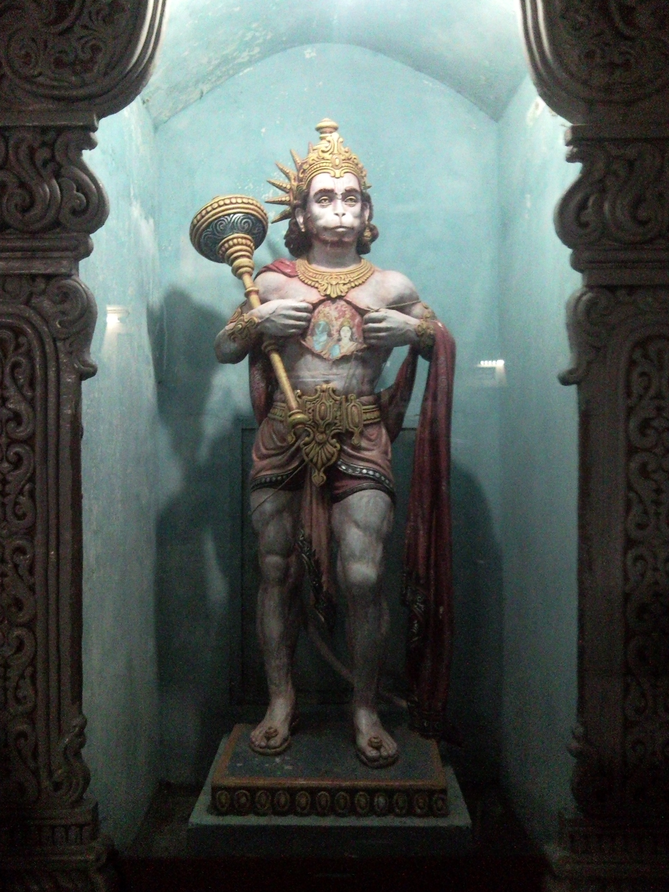

## Mental state and health concerns

- I can't stop thinking about this man, the trumpet teacher. My mind is racing with thoughts about him.
- I'm extremely concerned about rhabdo and having kidney damage.
- I go on a very strict kidney diet to try to heal myself.
- I start to lose a lot of weight but I manage to stop the froth in my urine which is exacerbated with dairy and any albumin intake.
- I contact an acupuncturist in Dénia to ask for help: https://www.thaoqi.com/.
- She is not back in town until May so she can't see me for a few months.
- I go to see a homeopath in Dénia, Ana Villalba. I'm not sure I trust her. 
- Each time I see her she wants to hear about my abuse story, and not in a kind way.

## PTSD

- Classes continue and I believe I'm in love with the trumpet teacher.

!!! tip "Disclaimer"
    - I'm always in love with someone.
    - It's never very serious.

- However, whenever I'm in class with him my whole body vibrates. 
- I have never felt like this before in my life and I reiterate that in many written messages to people while I had no idea what was going on. 
- He starts to take interest in me at one class and ask me questions about my life. I have a severe PTSD reaction - due to child sexual abuse - where I become scared and I'm not able to talk to him without being rude.
- Back at home I'm upset about this because it has caused me problems all my life.
- The irony is it was actually alarm bells.
- In any case, I believe he likes me and I'm devastated I cannot respond.

## Observations on the trumpet teacher

- The trumpet teacher seems poor and he is badly dressed.
- He seems like a desperate man somehow. I wonder if he takes drugs. He doesn't smell of smoke.
- Of the few classes he does turn up to, in some of the earlier classes he appears to be wearing a prison-issue shirt.
- I bring in a lot of the music we study, and he goes to photocopy it. Gloria will be helping him no doubt. Sometimes he takes a long time doing the photocopying.
- When he returns, I notice that he holds the pages he gives me in the top corner only.
- Sometimes he asks me about something on his phone and hands me his phone so I'm holding it. It's never clear what he wants.

!!! info "What I thought he might have wanted"
    - When I realized I had been targeted by criminal gangs, I had a theory that he was getting me to touch his phone so he could record my fingerprints.
    - I now think that perhaps he had some substance on the phone screen that he wanted me to touch and therefore ingest.
    - I wonder now also if he was ingesting whatever it was he was giving me but of his own accord.

## Ana the violin teacher

- The choreographed torment includes the suggestion that the trumpet teacher and Ana Requena Marín are having a romantic liaison.
- Ana comes into classroom every chamber music class with her instrument to leave it in the room, for reasons unclear, something that never happens normally.
- Ana and Rosa María Vidal Orengo come in together sometimes with instruments which they leave in this room.
- It's all very contrived.
- Rosa is the vice director of the conservatory.
- On one occasion, Rosa mentions to the trumpet teacher that it is his *funcionario* exam the following week.
- I understood that he was sitting the exam to become eligible for a pension and whenever I arrive at class, the trumpet teacher is often practicing for his exam and he says so.
- On one occasion, he mentions that he "needs to pay for his daughter's weddings".

!!! tip "List of teachers and staff"
    The current lists on the conservatory website may still reflect the state of the staff in 2023 although there will be changes.

    - Teachers: https://portal.edu.gva.es/conservatoridenia/es/departaments-es/
    - Staff: https://portal.edu.gva.es/conservatoridenia/es/centro/organigrama/

## Other times

- I also find myself light-headed and high in other classes, including choir and harmony class.
- Looking back, I can see that I was completely out of my mind during this time, and I had no idea that I was being drugged.
- I was being medicated without my knowledge, and I believe this had been going on from at least December 2022 at the conservatory itself.

## Unintended consequences of drugging an adult person without their knowledge

- I am a yoga practitioner and have done huge amounts of meditation and intense spiritual practices over the years.
- My practices have made me extremely sensitive, including physically, which is why possibly the dose of whatever they gave me the month previously had such a dramatic and traumatic effect on my system.
- Another of my favorite spiritual yoga practices is bhakti yoga devotion, where you worship God in all His forms.
- Around this time, I started to become a little obsessed with Hanuman, the monkey god from the Hindu religion.

- I have adored Hanuman for many years because he loves and protects vulnerable women and children.
- He is the number one yogi.
- I can't remember what started it, but around this time it was as if he was everywhere around me. 
- I couldn't stop thinking about him either.
- I subscribed to an Indian TV show of 630-odd episodes about his childhood and his relationship with Ram: https://www.sonyliv.com/shows/sankatmochan-mahabali-hanuman-1700000109
- I created little videos that I found delightful and put them on Facebook: https://www.facebook.com/jack.chardwood.3/videos
- I put Hanuman music on my phone and alarm clock.
- I was truly obsessed with Hanuman; and I still am but not to the extent I was during 2023 which was an intense obsession.

!!! tip "Who is Hanuman?"
    - Hanuman is a major player in the Hindu epic the Ramayana.
    - He helps save Ram, Sita, and Lakshman from the evil demon Ravana.
    - He rescues Sita from Ravana who had kidnapped her and taken her to Sri Lanka.
    - Consequently, Hanuman is known for protecting women from evil men.

    

## Silvia

- People keep saying a name so that I can hear it, Silvia.
- Maria and Mercedes say it meaningfully and look at me closely at piano class.
- I hear the name everywhere, I don't know why.

!!! info
    - To this day I don't know who or what Silvia refers to.
    - There have been numerous suggestions online about it such as:
        - Silvia is a trans identified young girl at the conservatory.
        - Silvia is one of the trumpet teacher's daughters who is being targeted by the porn gangs so he can pay a debt back.
        - Other nonsensical stories.
        - Who knows? Perhaps just a trigger to create more stress and anxiety in my mind. 
        - Probably just the trumpet teacher's wife.

