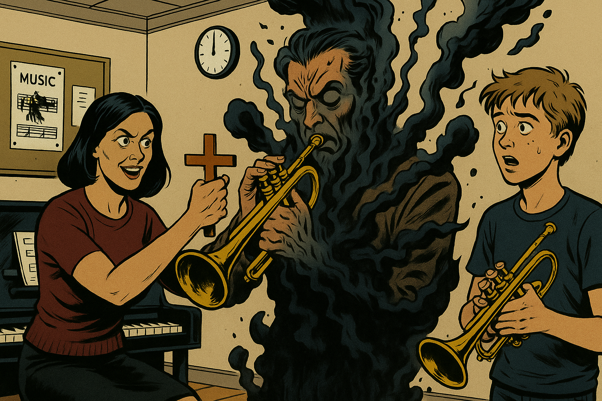

# February 2023

## Mental state and health concerns

- I can't stop thinking about this man, the trumpet teacher. My mind is racing with thoughts about him.
- I obsessively plan novel-after-novel about our romantic adventures in my head!
- I tell my therapist in June 2023 I wrote 1000s of romance novels in my head about this man.
- I'm extremely concerned about rhabdo and having kidney damage.
- I consider my GP to be ineffective.
- I go on a very strict kidney diet to try to heal myself.
- I start to lose a lot of weight but I manage to stop the froth in my urine which is exacerbated with any dairy or albumin intake.
- I contact an acupuncturist in Dénia to ask for help: https://www.thaoqi.com/.
- She is not back in town until May so she can't see me for a few months.
- I go to see a homeopath in Dénia, Ana Villalba. I'm not sure I trust her.
- Each time I see her she wants to hear about my child sexual abuse story, and not in a kind way. I feel like I'm being interrogated.
- Each time I see her she mentions her patients who have freed themselves of domestic violence.
- She prescribes drops to take every day which I collect from the Romany pharmacy in Dénia.
- She takes copious written notes.
- She asks me to phone her regularly. I explain I'm uncomfortable speaking on the phone in Spanish.

## A scan at the medical centre

- I go for a scan at the medical centre because I'm so concerned about my kidney health.
- The doctor who does the scan - and this is no exaggeration - looks in the air while he puts the ultra sound on my stomach and moves it around quickly.
- He doesn't look at the screen at all.
- It's all over in about 2 minutes and he says I'm fine.

## PTSD

- Classes continue and I believe I'm in love with the trumpet teacher.

!!! tip "Disclaimer"
    - I'm always in love with someone.
    - It's never very serious.

- However, whenever I'm in class with him my whole body vibrates. 
- I have never felt like this before in my life and I reiterate that in many written messages to people while I had no idea what was going on. 
- He starts to take interest in me at one class and ask me questions about my life. I have a severe PTSD reaction - due to child sexual abuse - where I become scared and I'm not able to talk to him without being rude.
- Back at home I'm upset about this because this reaction has caused me problems all my life.
- The irony is the reaction was genuine alarm bells.
- I'm not aware of this at that time, however, and I believe he likes me and I'm devastated I cannot respond to him normally.
- I tweet my reactions, and how I associate the trumpet teacher to the shark in Jaws.

## Gang stalking at the conservatory and the promise of a relationship

- The trumpet teacher flirts with me whenever I go to class.
- I'm extremely high at class, flushed and excited, vibrating, and I find the man who takes the class exceedingly and overwhelmingly attractive.
- Situations happen around the conservatory which seem to indicate there is a bit of gossip going on about a possible relationship. The male teachers are always excited around me, running to see me when I'm in other classes, pointing and laughing. I mention a lot of this activity in my [letters to the Generalitat](october.md#first-letter-to-the-generalitat) and elsewhere.
- At one chamber music class, I don't remember which one, the trumpet teacher suggests he is free in the afternoons and the implication is that we could maybe get together.
- For me, this is a bit much. I haven't had sexual relations for nearly 13 years, and I haven't had a proper boyfriend for over 20 years. I don't reply.

!!! danger "Sedating women is serious crime"
    - Was this an attempt to commence a regular sexual relationship with me at my apartment which could then be live-streamed on porn networks?
    - Was a regular sexual relationship *already* being live-streamed from my apartment, except without my knowledge?
    - Would the man have preferred a conscious and consenting target perhaps?

### Shadrach Meshach and Abednego

- Nevertheless, I have such a good feeling for this man, and I really want to communicate with him, after class I show him excitedly what I have been watching on YouTube.
- It's Louis Armstrong singing Shadrach Meshach and Abednego.

<iframe width="857" height="228" src="https://www.youtube.com/embed/ihOHhViUrdQ" title="Louis Armstrong   Shadrach, Meshach, and Abednego" frameborder="0" allow="accelerometer; autoplay; clipboard-write; encrypted-media; gyroscope; picture-in-picture; web-share" referrerpolicy="strict-origin-when-cross-origin" allowfullscreen></iframe>

- One might say I had already stepped into the Fiery Furnace, without realizing it, refusing to bow down.
- Every day in Dénia, for me, was another day living peacefully and without harm right in the middle of the Fiery Furnace.
- He looked at me in a strangely negative manner, with a little bit of worry and anxiety added.
- I did not know why at the time.

## Observations on the trumpet teacher

- The trumpet teacher seems poor and he is badly dressed.
- He seems like a desperate man somehow. I wonder if he takes drugs. He doesn't smell of smoke.
- Of the few classes he does turn up to, in some of the earlier classes he appears to be wearing a prison-issue shirt.
- He has the flu around three times between January and June 2023. Whenever I see him after one of these bouts of illness, I always put my fingers in a cross as a joke to ward him off.
- He never laughs at that, and, instead, sort of flinches.

- I bring in a lot of the music we study, and he goes to photocopy it. Gloria, as manager of the photocopier, will be helping him no doubt. 
- Sometimes he takes a long time doing the photocopying.
- When he returns, I notice that he holds the pages he gives me in the top corner only. 

!!! tip "Bait and switch"
    - Could these moments, whenever he leaves the class to go to the photocopier, or perhaps when he [goes downstairs with the doctor](january.md#serious-poisoning-at-chamber-music-class) be when a different man switches over?
    - When I think back on the men that took the trumpet teacher role, there seemed to be a soft spoken one who I had genuinely good feelings about, and a brash and violent one who made me feel nervous and afraid. 
    - Could these two have been the same person? 
    - When I look at the [men in the trumpet-teacher photos](../../crimes/protagonists/vidal-sastre.md), I don't remember having good feelings for him/them.
    - When I think back, I remember a slighter man at class, with a physique I found attractive.
    - And then, I also remember that the man who came to class was a large lumbering man, with extremely muscular forearms and enormous thick, long legs.

- Sometimes he asks me about something on his phone and hands me his phone so I'm holding it.
- It's never clear what he wants.

!!! info "What I thought he might have wanted"
    - When I realized I had been targeted by criminal gangs, I had a theory that he was getting me to touch his phone so he could record my fingerprints for future theft.
    - I now wonder if also perhaps he had some substance on the phone screen that he wanted me to touch and absorb through my skin.
    - Was he ingesting whatever it was he was spiking me with too, but of his own accord?

- When I see him wearing the prison shirt I notice he is a slight man, slim, not overly muscular, and his hands are small and his fingers thin and delicate, like an artists hands.
- Curiously, sometimes I notice he is a large man with enormous legs and muscular arms.
- I wonder if class happens to rarely so as to ensure my future confusion about who he actually is.

### Plot awareness

- Whatever drugs they were giving me made me extremely and unusually aware of hidden things going on, plots and subplots.
- Of course, I knew about the plot with Domingo, and what was coming up (a 'funeral' of some sort which I really didn't care about) so my experience of the classes were tainted with this knowledge.
- And, at the same time, I had such a good feeling for this man, I had only generous views of him. I felt he must be on my side.
- In one class, the three of us are sitting close together and practicing, and the trumpet teacher announces that we will play *My Way* for the concert.
- I chuckle conspiratorially.
- The man gets angry. He jumps up and starts interrogating me and all the answers I give him make him even more enraged.
- I tell him I was joking. It's rather funny. 
- Pablo and I look at each other and shrug. We have no idea what got into him.

### Triggered generosity

- Some of my thoughts-on-loop about the slim trumpet teacher I liked were extraordinarily over-generous.
- I wanted to help him, in any way I could.
- I thought a lot about giving him my car, from about February. 
- It's not clear why I would think that, and think it *all the time*.
- I'm guessing the suggestion came from online triggers and/or specific requests while sedated.
- I will see his [beat up two-door Peugeot](june.md#sunday-11th-june) for the second time, the day before [my funeral](june.md#monday-12th-june-2023) in June.
- By then, I had seen him in the Peugeot once before in [May](may.md#assessment-day-at-the-conservatory) and I will see him and the doctor in the same car again in [June at the beach](june.md#the-trumpet-teacher-and-the-doctor-joan-drive-past-me).
- The gang switches gears entirely from about April 2024 after I leave my studies at the conservatory due to [being afraid for my life](../2024/march/13-end.md#email-to-paqui).
- Instead of beat up old bangers, and [blue vans](november.md#ana-in-the-blue-van) they start to demonstrate their fleet of fast and new sports cars, often by driving past my [house and beeping](../2024/may.md#cars-beeping-outside).

- I can only assume the beat-up old banger trigger is part of a common conspiracy to relieve a target of their wealth on their own, apparent, volition.

## Ana the violin teacher

- Teachers and staff at the conservatory put enormous effort into trying to convince me that the trumpet teacher and Ana Requena Marín, the violin teacher, were having a romantic liaison.
- This included constant choreographed events, in the conservatory and around town, that were designed to torment and upset me.
- All choreographed events relied upon minute-by-minute knowledge of my whereabouts which they could only have had with access to my mobile activity.
- The lie was reinforced online with subliminal suggestions and NLP, and further reinforced with things other people might say or do.
- The Ana lie started at the first class when the trumpet teacher [bumps into her](../2022/november.md#the-trumpet-teacher) outside the toilet next to the classroom, and I am high and euphoric at that moment having been successfully spiked with some kind of psychoactive mood-altering substance.
- As this lie progressed, Ana interrupts every chamber music class for a few minutes to bring her instrument and leave it in the room, for reasons unclear, something that never happens normally.
- Ana and Rosa María Vidal Orengo come in together sometimes to do this.
- It's all very contrived. 
- Not-contrived is that whenever Rosa speaks to the trumpet teacher, it is with the utmost respect and reverence.
- Rosa is the vice director of the conservatory.

!!! tip "List of teachers and staff at the conservatory"
    - The current lists on the conservatory website may still reflect the state of the staff in 2023 although there will be changes.
        - Teachers: https://portal.edu.gva.es/conservatoridenia/es/departaments-es/
        - Staff: https://portal.edu.gva.es/conservatoridenia/es/centro/organigrama/

- The "Ana is his girlfriend" lie was particularly vicious and, even though I really didn't care, it upset me as intended because it was relentless, and I believed I was in love, and the feeling was overpowering, even if false.
- During the cyber stalking to come, aside from there being a host of pictures of [Ana Requena modeling](../../content/images/fake-accounts/GZ69WCMXQAEQdzB.png) and constant sexual and other derogatory references to her, there is also an interesting picture of the child catcher from Chitty Chitty Bang Bang.

- This is a picture I viewed some time in 2022, retweeted and never looked at again. However, it appeared on manipulated [Google search results](../../evidence/google-searches.md) continuously, up until even August 2024, when the stalkers started going on about Ana again.
- The inference is supposed to be that Ana has locked away the trumpet teacher's children and so he can't free himself from her to be with me.
- The lies evolved into Ana is pregnant with his child.
- The Ana theme was repeated endlessly over fake account messages, and by Ana herself at the conservatory.
- The lie and the teacher's at the conservatory's dedication to it was extraordinary. 
- Ana and the other teachers would be lying in wait for me; as I came out of the toilet, as I left a classroom, as I was walking in the street with my friend. They would be ready with an angry word, a contrived expression, a certain activity or way they had dressed that day.
- It was all so ridiculous and, ironically, had little direct effect apart from me wondering if they were retarded.
- However, couple this relentless activity with mind-altering substances and it became a constant psychological water-torture that chipped away at my self-assurance and wellbeing.
- I can only assume they were all having enormous fun terrorizing me. 
- These were the actions of professional and seasoned gang stalkers and I can only wonder at how many students they have destroyed over the years, and how many of those students were minors, and I also wonder about when the local cyber-stalking porn-gangs realized they could very easily get in on the act.

### Civil service exams

- On one occasion Rosa and Ana interrupt the class with their instruments and Rosa mentions to the trumpet teacher not to forget that it is his *funcionario* exam the following week.
- I understood that to mean he was sitting the exam to become eligible for a pension, and whenever I arrive at class, the trumpet teacher is often practicing for his exam and he says so.
- On one occasion, he mentions that he "needs to pay for his daughters' weddings".

## Feeling high at other times too

- I also find myself light-headed and euphoric in other classes, including choir and harmony class.
- Looking back, I can see that I was completely out of my mind during this time, and I had no idea that I was being drugged.
- I was being medicated without my knowledge, and I believe this had been going on from at least December 2022 at the conservatory itself.
- The drugging was most intense during the chamber music classes where a trumpet teacher was physically present, but I was experiencing this elsewhere too.
- When the criminal's plans didn't work out for them as they had hoped, and I continued turning up for music classes, the drugging became more intense.

## Unintended consequences of drugging an adult person without their knowledge

- I am a yoga practitioner and have done huge amounts of meditation and intense spiritual practices over the years.
- My practices have made me extremely sensitive, including physically, which is possibly why the dose of [whatever they gave me the month previously](january.md#serious-poisoning-at-chamber-music-class) had such a dramatic and traumatic effect on my system.
- Another of my favorite spiritual yoga practices is bhakti yoga devotion, where you worship God in all His forms.
- Around this time, I started to become obsessed with Hanuman, the monkey god from the Hindu religion.

- I have adored Hanuman for many years because he loves and protects women and children.
- He is the number one yogi.
- I can't remember what started it, but around this time it was as if he was everywhere around me. 
- I couldn't stop thinking about him either.
- Thinking back, something similar had happened in 2015 in Dénia too.
- I subscribed to an Indian TV show of 630-odd episodes about his childhood and his relationship with Ram: https://www.sonyliv.com/shows/sankatmochan-mahabali-hanuman-1700000109.
- I created little videos that I found delightful and put them on Facebook: https://www.facebook.com/jack.chardwood.3/videos.
- I put Hanuman music on my phone as a ring tone, and I put Hanuman music on my alarm clock which wakes me up, every morning, for over a year.

<audio controls>
  <source src="../../../content/sounds/devotion.mp3" type="audio/mp3">
  Your browser does not support the audio element.
</audio>

- I bought or made t-shirts with him on them and wore them to chamber music class to feel safer.
- I was truly obsessed with Hanuman; and I still am, but not to the extent I was during 2023.
- I became a lifelong devotee of Hanuman at this time and, by association, Ram.

!!! tip "Who is Hanuman?"
    - Hanuman is a major player in the Hindu epic the Ramayana.
    - He helps save Ram, Sita, and Lakshman from the evil demon Ravana.
    - He rescues Sita from Ravana who had kidnapped her and taken her to Sri Lanka.
    - Consequently, Hanuman is known for protecting women from evil men.

    

- Even [my alarm](https://drive.google.com/file/d/10Fohbs4oCy6qU2rnG40F3blPJ6TheJL9/view?usp=sharing) that I listened to every morning to wake me up was a devotional prayer from Hanuman to Ram.

### Dreaming of the trumpet teacher

- Whenever I watched an episode of Sankat Mochan Mahabali Hanuman, it was as if my best friend was sitting beside me watching the show with me, and he was as delighted with it as I was.
- I could practically see the trumpet teacher,sitting beside me on the sofa. I could certainly feel him.
- I cannot explain this.

## Silvia

- People keep saying a name so that I can hear it, Silvia.
- Maria and Mercedes say it meaningfully and look at me closely at piano class.
- I hear the name everywhere, I don't know why.

!!! info "Who is Silvia?"
    - To this day I don't know who or what Silvia refers to.
    - There have been numerous suggestions online about it such as:
        - Silvia is a trans identified young girl at the conservatory.
        - Silvia is one of the trumpet teacher's daughters who is being targeted by the porn gangs so he can pay a debt back.
        - Other nonsensical stories.
        - Who knows? Perhaps just a trigger to create more stress and anxiety in my mind. 
        - Probably just the trumpet teacher's wife, but which trumpet teacher, and does anyone even care?
    - I tweeted about this Silvia lie a fair bit: https://x.com/search?q=silvia%20(from%3A1frgvn)&src=typed_query&f=live

## Maria 

- At one class, Maria explains delightedly how the *men*, *machos* she calls them, (humans she seems to worship) apply screws to people, slowly screwing them in, tighter and tighter.
- I understand this to mean applying psychological pressure.
- Maria demonstrates the movement with her hands screwing an imaginary screw with great force into the wall, grimacing and giggling as she does.
- I don't know that she is talking about what they are doing to me.
