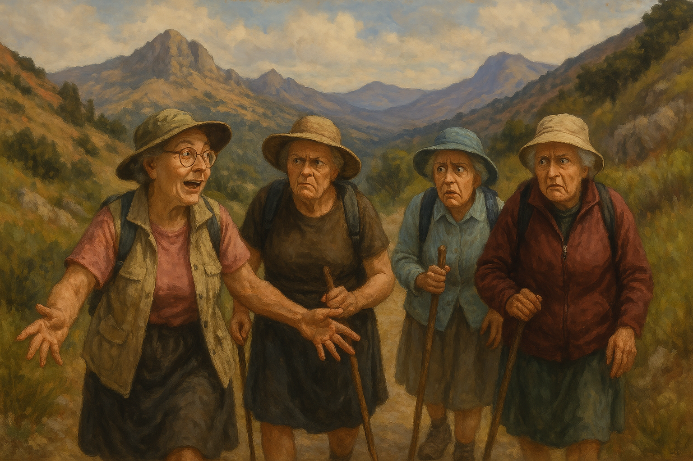
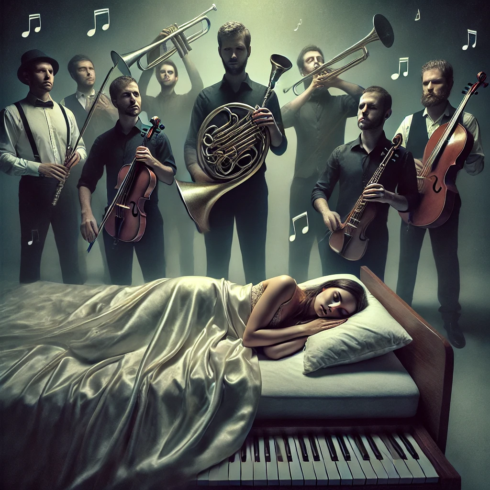
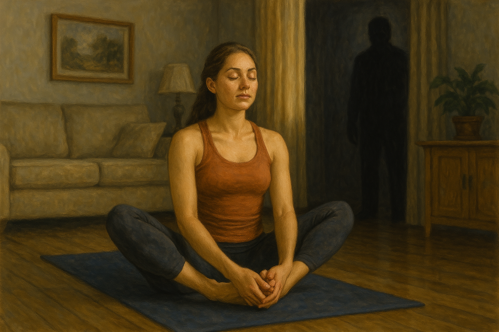
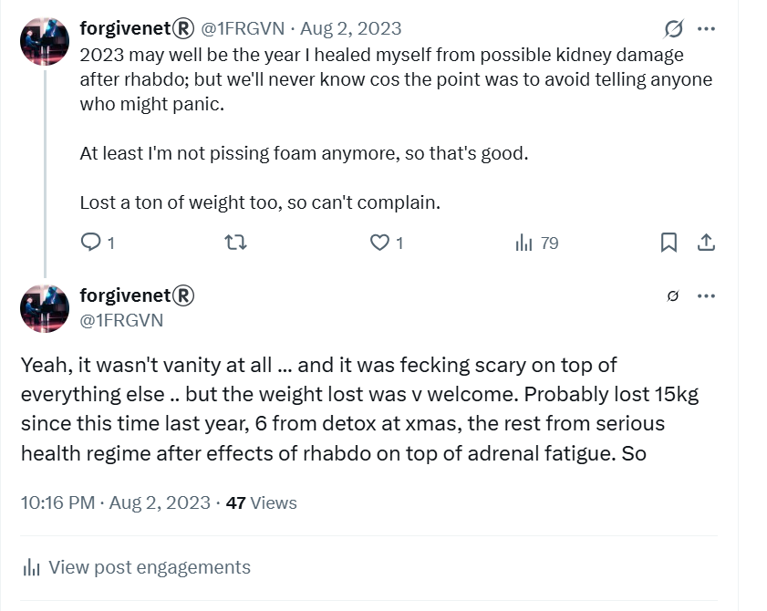
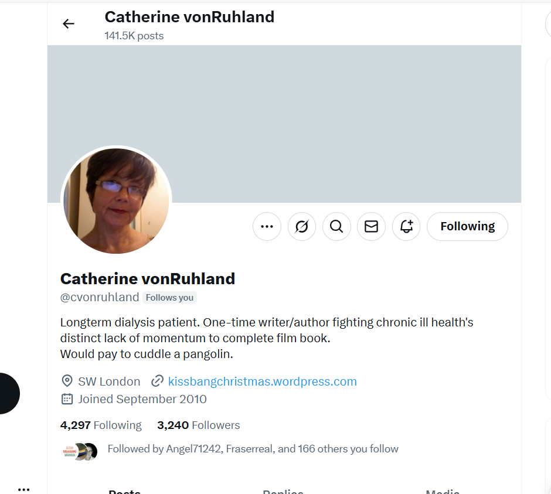
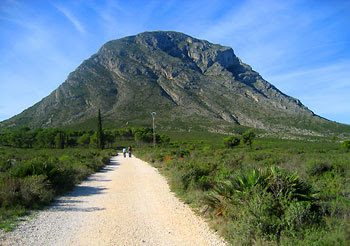

# January 2023

## Hiking with the English ladies

- The first Saturday in January I go hiking with the English ladies as normal.
- I mention falling in love twice; once with a gay man on holiday and once with the trumpet teacher. 
- Everyone's interested in the gay man I met on holiday, where he lives, what he does for a living, etc.
- Whenever I try to talk about the trumpet teacher, no one wants to know. Patricia and Christine, especially, go silent and tongue-tied.
- I have a vague feeling that all my English friends know what's going on at the conservatory somehow, and it's not good. 
- Their reactions add to my near-constant apprehension and stress levels.
- One of the other ladies says something like; "you wanna be careful, he might put you in the movies", but whenever people said incongruous things like this, I thought it was just a joke.
- I notice everything and file it away.
- My mind could not, at that time, possibly comprehend that a female student of the conservatory could be terrorized by teachers and staff there, and be ignored by the school board and police when trying to get help. 
- For my cultural ignorance, perhaps, I didn't fully understand why Patricia and Christine would be so unusually reticent.
- It's so weird, however, I don't forget it.

!!! info "Oh, Patricia's done porn"
    - This was the day that Christine made an off-the-cuff remark about Patricia being in porn.
    - "She's done porn", she said.
    - Patricia shrugged and brushed it aside in an annoyed way, and said nothing.
    - I thought must be a joke.
    - It was extremely weird.

- When we are alone a little later, I mention to Patricia that the trumpet teacher is the same guy we saw in [Benijembla at the end of November](../2022/november.md#walking-in-benijembla-with-the-english-ladies).
- Patricia gets angry and changes the subject.
- **I'm never invited to walk again.** In fact, I'm cut off completely from the English ladies walking group. It's shocking to me actually and I can't figure it out at all. 
- Not only that, I go for a walk on my own a week or two later and "bump" into them; Patricia, Christine, and the others. Christine tries to talk to me like I'm an idiot.
- I'm offended and upset.
- I still see Christine now and then for lunch, however, and she behaves as if everything's fine.

!!! warning "Reporting back"
    - Having successfully removed my only (apparent, probably not) support network, the criminals will have required someone to report back on me. 
    - And that must have been Christine in her 'let's have lunch' capacity, even though she had completely stopped inviting me out to walk.
    - It's funny how everyone treated me as if I was an idiot.
    - I wonder what the conversations were like between Christine and whoever she was reporting back to, Patricia probably, Hazel Smith eventually.
    - Were there discussions on how likely it was that I would have a nervous breakdown or commit suicide, if I would be terrorized sufficiently to leave the conservatory and enter a honey-trap relationship, the likelihood of having to murder me if things worked out a different way than planned?
    - As the horror continued into late 2023 and then 2024, were they surprised that I had managed to avoid whatever the trumpet teacher, Domingo's family and the Smith's had been planning for me after June 12th 2023?
    - Who are they targeting now, I wonder? A wealthy ex-pat new to the area with no knowledge of the extent of criminal corruption that controls even the schools your children might go to? Or a beautiful foreign minor child they're keen to quickly get up on the porn networks and start earning for them?

- They must have seen no option but to exclude me, as they were surprised about how much I had noticed already, and would not want me going along each week babbling on about the terror, drugging, and poisoning they were likely well aware was coming up, set up for me by local people they knew.
- It would be embarrassing for them and they would have had to keep it quiet from other members of the walking group, some of whom had been complaining about weird and unusual health problems I now wonder about in a different way, as you might do if you had my experience, or were hearing about it.

## Chamber music classes continue

- The chamber music classes continue on a Monday evening, whenever the trumpet teacher can be bothered to turn up.

!!! tip "Attendance"
    - The trumpet teacher's attendance is extremely poor. He has missed nearly 3 months of classes before he arrives, and only turns up to maximum 50% of the classes scheduled to the end of the school year.
    - I wonder now if his sketchy attendance was more about a group of men's availability on Monday evenings, and not just his alone.
    - Or, even better, if there were normal periods between each class, was I more likely to notice two separate men playing the part of the trumpet teacher?

- I vaguely remember on one occasion Pablo asking the trumpet teacher that turned up one evening where the other guy was.
- The trumpet teacher flirts with me more and more, but his behavior is garish and ignorant; phoney.
- Nevertheless, I believe he likes me because he looks at me in a certain way, he cannot hold eye contact with me, and some of the things he says and does - outside of him behaving like an immature and sexist brute - make me quite sure he is sexually attracted to me.
- It also starts to feel electric in the classroom when I'm with him. I feel breathless and flushed, and my whole body is vibrating.
- I wonder if he feels it too.

!!! danger "Spiking with aphrodisiacs"
    - I had no clue at all I was being spiked with drugs in class.
    - However, everything I wrote about my feelings over this period supports this - in letters, emails, and tweets.
    - More damning perhaps are the things I told my therapists such as a list of health problems that correlate with poisoning, about how I had never felt anything like what I was feeling in the chamber music class before in my whole life, that my whole body was vibrating in class when I was with him, how my PTSD levels were fever pitched before going to class but seemed to drop off once I was there, and other things.
    - Most especially, I always mentioned the debilitating aftereffects of class each week, particularly on my kidney health, and how I would come home and go straight to my bedroom and lie down I was so exhausted.
    - Then, of course, there was the class in January after which I had [rhabdomyolysis](#serious-poisoning-at-chamber-music-class).
    - Was this the moment, Monday evening after class with the trumpet teacher, that I was sedated and filmed with men who had access to my apartment?

    

### Swapping trumpet teachers

- Somehow, these two men swapped places during classes.
- Possibly when going to the photocopier.
- Possibly when my back was turned away from the door and my eyesight exceptionally blurred with drugging.
- Certainly, this will have happened in the presence of Pablo and [others](may.md#chamber-music-concert).

### Noises upstairs after Monday's chamber-music classes

- After every chamber music class, I arrive home feeling dreadful; my kidneys ache, I'm exhausted, and I have to lie down.
- I fall asleep and wake up late, lying on top of the bed in my clothes.
- I put my pyjamas on and get into bed, but I am kept from going back to sleep by loud noises from the upstairs apartment; scraping chairs, loud TV, and loud laughing voices, men and women.
- Did those people upstairs have anything to do with the conspiracy? 
- It's curious they were only ever there on a Monday night.

## Ganesha

- I print out a copy of Ganesha on an A4 piece of paper.
- Ganesha is a Hindu god who removes obstacles. 

- I take it to chamber music class in my folder because there is something sinister going on that I don't understand which is a major obstacle to my peace of mind.
- The trumpet teacher grabbed my folder in class that day. 
- He started to look inside my folder as if he was annoyed about something. It was weird and quite aggressive and, at that moment, it seemed to me he had information about something I had put in my folder that he shouldn't have.

## Yoga

- I do yoga three times a week online at home.
- I started to have the distinct sensation that the trumpet teacher was in the room with me whenever I did yoga.
- It was very bizarre but there was a sense of a dark figure standing watching me, and it was him.
- I can't explain this.

!!! info "What on earth to make of this?"
    - After I find out in August 2023 that all my devices have been hacked to an extraordinary extent; key loggers, root access, full access to cameras and microphones, and for a long time too, this memory is startling as it is highly likely cyber-stalkers were *literally* watching me do yoga.
    - After I realize I was being drugged continuously, this memory is even more concerning.

## Serious poisoning at chamber-music class

- On Monday 30th January I go to chamber music class at Dénia conservatory as normal for 8pm.
- The doctor, Joan, from the [Dénia hospital](https://denia.san.gva.es/es/localizacion) attends his class which is scheduled before mine at 7-8pm.
- I'm a little early so I wait outside. No-one is around.
- There is no sound coming from inside the classroom; no music, no talking, nothing. 
- Eventually the doctor comes out with the trumpet teacher and they leave together; the trumpet teacher returning after a few minutes.
- Class is relatively normal except there is an electricity between myself and the trumpet teacher, a chemistry.
- My body is vibrating.
- After class finishes, I'm surprised to find I cannot walk down the stairs of the conservatory as my calves are in excruciating pain at every step I take.
- It is very strange and concerning, and when I get home I look my symptoms up on Google and discover I have the systems of rhabdomyolysis. 
- I consider going to A&E as it is very serious and a person can require dialysis, but I decide not to when I read that it can cure after a few days on its own.
- The pain goes on for about 5 days then disappears.
- I have some other unusual symptoms too: sudden dark rings under my eyes, aching in my back at the kidney area, and particularly the right kidney. My urine is frothy, especially after eating anything with albumin in such as eggs or dairy.
- I have an enormous dramatic bump and discoloration on my left thumbnail, remnants of which are still apparent to this day, and similar but less on the right thumbnail. It's ugly and very noticeable. 
- Maria Hontanilla notices my traumatized thumbnail and mentions it in piano class that week.
- All these symptoms tie in with a rhabdo diagnosis which requires major trauma to muscles and internal systems. 
- Rhabdo is something you get when you:
    - Are in a car accident.
    - Run a marathon dehydrated.
    - Get hit by lightning.
    - Are poisoned.
- I put it down to a hike I did at the weekend - and I do a lot of Google searching to that effect - but there was nothing extraordinary about the hike other than I had sweated a lot and it was extremely cold at the summit.
- I had recently done far more strenuous hikes in the Pyrenees. 
- There was no other explanation at that time, however.
- I lost a lot of weight after this, probably 10kg or thereabouts, 15kg in total since the [seizure in Thailand](../2022/december.md#a-seizure-in-thailand).

!!! info "Tweets related to rhabdo"
    - I didn't tweet about rhabdo at the time but I did Google search it extensively.
    - Given I was being monitored online continuously, teachers and staff at the conservatory will have been very aware of what I was experiencing and its ramifications.
    - I mention rhabdo in August of 2023 at the time the "conversation" with hackers really began.
    - Example: https://x.com/1FRGVN/status/1686848541346443270
    
    

    - These tweets were viewed a lot by an audience needing to translate them, I assume Spanish cyber-stalkers from Dénia.

- The doctor **never comes to class again** after this. He only came to two classes in total. 
- When Pablo and I asked where he was, the trumpet teacher told us he was at the hospital as he was a doctor.

### Going to my doctor

- I go to my GP on a few occasions over the next months after this incident because I am extremely concerned about my kidney health.
- I never mention my specific concerns about my kidneys, or the rhabdo experience.
- I ask for a full blood work up including kidney analysis. 
- They send blood and urine to the lab to do all the tests, except when the results come back they have done everything except the kidney tests.
- I ask why. The GP doesn't know and doesn't offer another solution or to repeat the test.
- I try to do a test myself from the local chemist; their pamphlet says they have them available. They never have the test whenever I ask for it, and they never seem to know why they don't have it, or when it's coming in.
- One of the pharmacists tells me, "Oh, I don't think we sell the kidney tests anymore."

#### Criminal gang online cruelty 

- Regarding this kidney injury which was further exacerbated by constant poisoning and drugging, criminal gangs relentlessly tease me about how I probably have a severe kidney disease, if not failure.
- They do this online using fake accounts such as with the Catherine vonRuhland account you can see here which even looks like me a bit.

- They also do this with sly comments such as when [Susan Hamill told me she had kidney failure](../2025/march.md#let-women-speak-aberdeen) for 10 years and her doctors never told her.
- It's never ending.

### The police close the road for me

- I decide to go hiking in the [Montgo national park](https://parquesnaturales.gva.es/es/web/pn-el-montgo) again the following weekend.

- There is a bike crash on the mountain and a huge traffic jam.
- I wait for about 30 minutes but there is still a delay.
- I'm not in any hurry, and I'm just going to wait.
- Everyone starts to turn around and go back the way they came. I stay.
- As each car disappears, I creep up, closer to the front of the queue, and I wait.
- Eventually, I see a couple of cyclists on the road but nothing serious.
- Even so, a policeman tells everyone left to turn around and go home. There's only about four cars left waiting.
- I wonder about this now.
- Could anyone have been heavily invested in making sure I didn't get rhabdo again at class the following Monday? And, if so, why?
- Given everyone who was hacking me (the whole town) knew about [my rhabdo symptoms](#serious-poisoning-at-chamber-music-class) and my concerns that it could have come from the hike at the weekend, did the local police *and* the traffic police create a fake accident so that I wouldn't go up again, and die or be hospitalized; any tests would have shown the sorts of substances I was ingesting.
- Or was it more likely they didn't want to stop making so much money from the sedated porn they were distributing globally to the porn-addict tech elite (amongst others) with me in it, so I had to be kept alive and well enough for more abuse.
- It seems likely since there was no accident to see, and they told everyone to turn around and go home anyway, for no reason.
- This means the local police, and at least the traffic section of the Guardia Civil would also be conspiring in the porn network distribution of sedating and raping lone females in their apartments and/or hotel rooms in Denia and beyond.
- It puts [my interaction with the traffic police the following July](july.md#stopped-by-the-traffic-police) in a somewhat different light.
- It explains [being shown the door by the national police in February 2024](../2024/february.md#policia-nacional) because I didn't have a complaint, they told me, because the man who was threatening me online with violence might think I was ugly.
- And it explains being fobbed off and shown the door by the national police twice; once in [March 2024](../2024/march.md#reporting-the-matter-to-the-police-in-madrid) and then again in [January 2025](../2025/january.md#madrid-policia).
- It also explains why the [Denia local police](../2024/march.md#enric-gil) refused to speak to me.
- All in support of despicable porn networks including the global porn-addict engineering elite who were probably paying millions in subscriptions to porn networks to see me, and others, suffer, be sedated and raped, and goodness knows what else, perhaps even watching my activities at the conservatory; the concerts, the terrorizing, the drugging in class, going to the toilet; everything I expect they have been doing to the children and teenage girls for some time too.
- There are at least four or five specific children I have names for listed in this statement that I have told the authorities I'm concerned about them being in *extreme* danger.
- I was ignored.
- Nothing is done about it.
- I know it is just the tip of the iceberg, and I know Lorraine found something out so horrible that it broke her to know about it, and to know nobody cared either. 
- Was it that men in Denia were making women pregnant - with the help of online manipulation - so that they could earn thousands on the baby and pedo porn?

