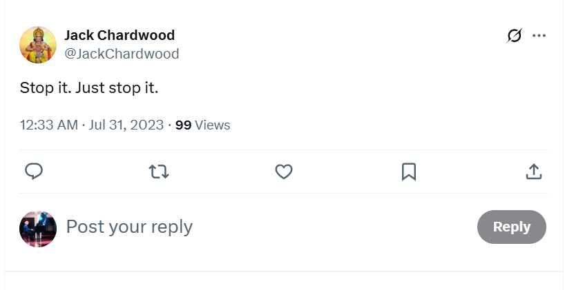
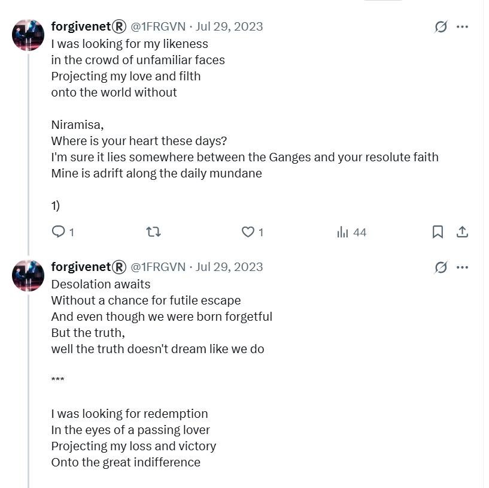

# July 2023

## Nacho caresses the 8-year old girl

- I continue to go into the conservatory to practice.
- One morning, all the teachers are collecting something from Gloria at reception; paperwork of some sort.
- I'm in the queue, waiting for a key to a room with a piano.
- I'm chatting with the harmony teacher Adria Gil.
- All the teachers are smirking at me aggressively.
- I feel like I'm the better person so it doesn't bother me.
- Nacho the clarinet teacher, Domingo's good friend and associate, is talking to a mother and her 8-year-old daughter.

- Nacho looks at me quickly, then starts to caress the child's face, stroking it suggestively, while talking to the mother and glancing back at me periodically.
- Everyone is embarrassed. I feel sick. Gloria looks away.
- He is doing this to show me that he, a teacher at the conservatory, can do whatever he likes to the little girls.
- He may claim common cultural practices for this later, and in the fairly recent past that may have been true in Spain; certainly in 2005 when I first lived in Spain I would not have been concerned about this sort of thing at all.
- However, since normal men across the world got themselves addicted to pedo-porn, creating a burgeoning market which requires the daily abuse of millions of minors; add to that my horrific sexual grooming experiences at the conservatory and online at home in Dénia, we should be extremely concerned about what this sort of behavior implies.

## X.com

- The weird communication continues on X.
- Pictures of Ana Requena continue to appear on the `@jctot19` timeline; the account I have been led to believe is the trumpet teacher's.
- I start to look more closely at the `@jctot19` account.
- I see a lot of interaction with an account `@SchrodingerGata`, but even more so with an account named `Carmen` with address `@sinremite`.
- I will find out over a year later that the woman who owns the `@SchrodingerGata` account, Rocío Vidal, suffered a serious hacking attack.
- I will also see Rocío Vidal in photos which remind me of [plate lady](#plate-lady-early-in-the-month) in that they imply filmed sexual activity.
- I believe that the `Carmen` account, given it has so much interaction with the `@jctot19` account over many many years, must be a girlfriend.

### `@1frgvn`

- All of my tweets over this period were being read by numerous non-English speakers.
- I knew I was being watched constantly online, so I told people what I thought of them and I gave them something of a show. 
- Why not? It was the only way I could think of positively dealing with this horrible situation which made me feel like ants were crawling all over me and I couldn't get them off by any normal means.
- I was away in Thailand for a good chunk of July 2023 without access to X.
- At the beginning of the month you can see I'm starting to think about the rave music scene from 1989; when I was sedated, gang-raped repeatedly, and filmed.
- I played this music to myself, and to my audience, and I was thinking about building a DJ-app on X so I tagged all the music I played on X with my DJ name: `#MaSelecta`.
- After two+ weeks away from Dénia, and two+ weeks off social media - apart from [Google searches on my mobile](#google-search) - my interest in 1989 had disappeared completely. However, this interest started up again *hard* in August in France when I was back online, just as it had the August before.
- I believe this interest was triggered directly by hackers who had root access to my laptop and thus social media account interfaces, and they were therefore able to manipulate me into thinking about these times, about sex, about the trumpet teacher, and then eventually to frighten me and make me believe I was going to be arrested when I returned to Dénia in September.
- Before I went to [Thailand](#thailand) this month, and after I returned, the conversation with hackers continued online in the same vein it had in June.
- The following screenshots are a summary of the communication; all my tweets from this period are available [here](https://x.com/search?q=(from%3A1frgvn)%20until%3A2023-08-01%20since%3A2023-06-30&src=typed_query&f=live).
- Remember, I believe I'm talking directly to Domingo Cano, the trumpet teacher, teachers and staff at the conservatory, their families, friends, and criminal associates.

- The black marauder is in reference to the dark images of the trumpet teacher I often saw online. For example, in the [plate lady pics](#plate-lady-later-in-the-month) and like I had imagined him in my apartment [watching me do yoga](january.md#yoga).
- In response to a post on the `@jctot19` [Google searches](#google-search) I was doing which said something like "you will now experience the bull sector", that I felt was a direct misogynist threat to me:

- ... I told them a little story about how me and bulls are quite good friends, especially Indian ones.

- I also told spiritual tales, little anecdotes, and significant stories; and I gave them information on trauma healing which I am certain they still need.

- Sometimes, the communication felt like friendly, gentle banter.

- Sometimes, my tweets triggered memes for the hackers they would use relentlessly in the mass of porn they sent me. This tweet mentioning *personal favorite* was oft repeated in pornographic scenarios on my X timeline that I did not subscribe to.

- When I am finally away from Dénia and in Lourdes, the hackers start to reveal themselves again.

### `@JackChardwood`

- This is another account I have which I did not use very much at all. 
- In fact, there are zero tweets on this account in June 2023.
- However, from about mid-July, hackers start to target this account extensively for about a year, then all activity stops again.
- We'll look at this more closely.

- The amount of views on these tweets is unprecedented given I had zero activity on this account only weeks before. 
- Currently, May 2025, I also have near zero activity on this account.
- I will be followed by numerous porn and other fake accounts; including accounts with pictures of men I would see in Dénia streets, relentless stalker accounts that suggested the Lopez Cano family, made up crypto accounts, even new crypto coins which seemed to have been generated for me specifically.
- The criminal resources put into terrorizing me were enormous but I didn't realize this until around a year later. 
- Until then, I believe I'm being terrorized by bored misogynist idiots with nothing better to do with their lives.

## Urgent staff meetings at the conservatory

- I do wonder what those staff meetings must have been like after I turned up to practice on 19th June.

- I wonder if the actors had expected finish with their constant charades; or whether they had hoped for a new and less problematic target like normal?
- Either way, teachers and staff at the conservatory must have realized, with some displeasure, that their part in this wild conspiracy was not over as I was obviously planning on returning for year 4 of professional piano studies in September.
- Did Domingo order a ramp up of the online harassment and terror with the intention that I would not return to my studies?
- Is this why the stalking got even worse for me, and why they even involved the traffic department of the Guardia Civil who stopped me on the A23 and told me who had called them and informed them about my out of date license, the document kept by the conservatory for my identification?
- Did anyone urge an end to it all; or if they had any sense did they know to keep quiet about it?
- Was there a monetary deal involved with the porn distributors who had expected me to be delivered up to them at the end of the school year, as usual?
- Did the arrogance and egoism get the better of them while they started to make crashing errors of judgment (more than previous, if that were possible) and give me a wealth of content for a best-selling book and Netflix documentary series?
- Were they so sure I'd be killed or die by suicide, they believed they would never have anything to answer to?

## Google search

- At the beginning of this month, Elon Musk makes it impossible to look at other accounts' content unless you are logged in.
- Up until then, I had been looking at the `@jctot19` account activity fairly easily as, even though the account had blocked me, I didn't have to log in to see the posts.
- Now that was impossible unless I used a fake account, which I did a couple of times, but it was cumbersome and whoever was managing this account seemed to know about these accounts immediately.
- So, instead, I start to look him up on Google search using the following search terms:
    
    - `jctot19 twitter`
    - `jctot19 x`

- I did this a lot when I was in Thailand on my mobile phone.
- The results I see, particularly in the image section, seem to be part of the conversation I'm having with the trumpet teacher.

!!! info "Extremely significant results"
    - This ended up being one of the more definitive ways the hackers communicated with me and shared information.
    - The hackers were able to manipulate the results of all my Google search requests.
    - This seemed incredible to me at first; but given their root access into my laptop, phone, and thus social media accounts, it would be a pretty rudimentary attack and with some time and investment the hack could become complex and full of features.
    - Significant pictures, or posts, would appear in these results and then disappear. 
    - This is where they will eventually post the picture of me in my underwear that I will take of myself in August 2023 with my mobile phone.
    - I will explain how this has been happening to the police and two cyber experts the following May, who all fail to provide any assistance.
    - In July 2023, I was not taking screenshots because it was unclear to me exactly what was going on, and I had no idea I had been hacked.
    - Screenshots eventually looked something like this: 

    

    

- The following sections are examples of things that came up in Google search during this period.

## Plate lady early in the month

- On the `@jctot19` account's Google search results, I start to see various photos of a tiny, pretty lady who is a Spanish potter or a ceramics artist.

- I see her in her studio, putting plates on the wall.

- She is short and cute. She looks Spanish and must be around 25-30 years old.
- She comes up on the `@jctot19` searches, and in relation to communications the account has with the `@sinremite` account.
- I assume she must be Carmen.
- She wears little navy blue shorts that look like Iyengar yoga pants.
- Whoever is taking the pictures is a male who is close to her. He's much taller than her and it's clear they are in a relationship of some sort.
- I never see what he looks like.

- From the look in her eyes, one photo is clearly taken just a few moments before they will be sexually intimate with each other.

- Her look reminds me of how myself and the trumpet teacher looked at each other at the [chamber music concert in May](may.md#chamber-music-concert).
- I start to wonder if plate lady is aware she's being photographed. And if not, I wonder how he is doing it.
- I wonder if plate lady, or Carmen if that's her name, is the trumpet teacher's girlfriend.

## Plate lady later in the month

- A few weeks go by.
- The pictures of plate lady change. I see her walking in the rice paddies of Valencia with a man. It's winter.

- The man's shape and build is exactly that of the trumpet teacher, although you cannot see his face.
- Whoever is taking these pictures is way back from the couple; 50-100 metres, following.
- The man is telling plate lady something important as they walk. The mood is so sombre, I wonder if he is breaking up with her.

- Whatever he tells her has shocked her to her core. 
- It's obvious that the man who has the exact silhouette of the trumpet teacher has told plate lady they are being photographed at that moment. 
- Plate lady's horrified expression is exaggerated in the photo as she looks directly at the cameraman.

!!! critical
    - At the time, I have no idea what any of this is about, what it means, or who she is.
    - I believe the pics to be current, present day activity; perhaps she is a girlfriend he has dumped, for me maybe?
    - Over a year later, hackers will give me her name; Irene.
    - I write about the discovery [in the August 2024 report](../2024/august.md#irene-the-plate-lady).
    - I look Irene up on Google and find her. 
    - The very same woman; except, she is in her 50s.
    - The pictures are from 30 years ago.
    - I'm stunned.
    - The revelation provokes more questions than it answers.
    - The trumpet teacher's gang had extraordinarily advanced surveillance technology even way back in the 80s and 90s. 
    - This casts a light on a million different other things we might be interested in.
    - And who would be so keen to grass up the trumpet teacher's gang in this way? Even giving a name?
    - Could it be the British gangs he had betrayed so boldly?

## Carmen

- Results of the `@jctot19` Google search always included a picture of a cartoon woman, Carmen.
- They still do, even today.
- This is the `@sinremite` account I mentioned before that has had a great deal of interaction with the `@jctot19` account over many years.

- Most of the images in the screenshot above are new.
- I haven't seen them previously, apart from the Carmen image which has been appearing on and off since July 2023, and the photo of Rocío Vidal which has been appearing since around October 2023 - we will talk about that [later](october.md#rocio-vidal) as it is significant.
- Curiously, I thought Carmen was plate lady but that wasn't the case.
- Carmen, as I'm informed later, represents Carmen Cano, Domingo's sister, a major player in the online deceit and harassment, and the woman who likely entered my home with others to douse my belongings in pesticides in October 2024, and add illicit substances to my food and bathroom products whenever I went out over the years 2022-2024.
- I sometimes wonder if Carmen Cano was managing *all* the Spanish stalker accounts that targeted me, and other victims obviously; delegating access from time to time when it got too busy.
- I also wonder if the `@jctot19` and the `@sinremite` accounts are both Carmen's responsibility; managed by an AI auto-post facility for phishing whenever she's not using them.
- Here's an earlier screenshot using the `@sinremite` as search term with some interesting results we'll examine below.

- The man in the picture above is dressed exactly the same as [the guy at the Alhambra](#the-guy-at-the-alhambra), another significant set of posts that I mention below.
- The first post refers to a 'table'. 
- This 'table' meme became a more frequent online reference over August and September 2023. I realized eventually this was referring to another part of my police statement in which I mention being aware of sitting on a tabletop, possibly undressed, in North London in 1989 when I was 16.
- What I was not aware of - that the criminal gangs of Dénia, and teachers and staff at the conservatory, were aware of, and informed me of during their relentless online harassment over 2023-2024 - is that this table incident I mentioned in my police statement had taken place just after being sedated, gang raped, and filmed.
- Of course, the bottom right picture is a direct reference to me [curled up in a little ball](november.md#first-time-they-flash-up-my-naked-16-year-old-body-on-x) as I was when I was filmed and gang raped. 
- Only the Dénia hackers knew about this in July 2023.
- Notably, the `@sinremite` account no longer exists. This is a very recent change, maybe in the last month or so, time of writing being May 2025.

## Other smaller examples from Google searches

### Seaweed

- I see photos of hanging strips of seaweed on the `@sinremite` account.
- They are from artist Julia Lohmann's installations.
- I have no idea what they're from and I think nothing of them.
- A few weeks later, I see Ana Requena Marin in a Julia Lohmann installation.

- I'm truly amazed at the dedication and commitment of the teachers and staff at the conservatory.
- None of it made any sense to me; unless they are truly evil people which I was never able to reconcile with my experience of living in Dénia, prior to being targeted by the criminal pedo-porn gangs.

### The guy at the Alhambra

- The plate lady pictures stop completely and I start seeing a similar "set" of repeated pictures with a specific character.
- This time, it's a man sitting at a bench with the Alhambra behind him in Granada. 
- The picture is viewable for a few weeks.
- I see this man at the beach in September when he walks in front of me, making sure I see his face.

### Ana

- Interspersed with this are more references to Ana, and more pictures of her modelling.

- I saw a whole range of these pictures of Ana which are undoubtedly easily to come across if you can be bothered to look. 
- You could ask her too, of course.

### Mortadelo y Filemón

- I see pictures of two cartoon men, Mortadelo y Filemón.
- I understood them to reference the trumpet teacher and Domingo as crashing fools.
- It turns out that around this time the cartoonist died so that was in keeping with the times and, perhaps, was not related intentionally.

### Girl with a cross on her back

- I see a picture of a woman wearing a black dress with a cross strap at the back.
- She has her back to the photographer and appears to be in a professional studio.
- I will see this woman again at the checkout at the Carrefour store in Dénia in October 2024.
- The reference is to the tattoo I have on my back, and that I am a target.

### Photos that seemed to have power over my mind

- I'd see photos online and become totally engrossed by them, as if there was something in the image trying to tell me something very important.
- Here's one I've just seen posted again at the time of writing.

- Other images were of people on beaches; such as lovers kissing but you could never make out who they were, families with children playing, again with people you could never make out.
- It all seemed extremely important.
- Perhaps it was!
- This sort of thing went on continuously. I guess it's automated.

## Thailand

- Early in the month I go to Thailand for a holiday.
- I do not take my laptop so I am not connected to my Twitter account for the duration.
- I use my mobile phone to run [Google searches](#google-search) on the `@jctot19` and the `@sinremite` accounts, and start running searches on my own account too.
- The pictures referenced above continue to appear in the search results of `@jctot19 twitter`.
- I see curious messages on the [Google search](#google-search) results which seem to be for me.

- The pictures of [plate lady](#plate-lady-early-in-the-month) stop appearing.
- There are now references to Thailand and the far east, pictures of tall apartment buildings in Hong Kong, for example.
- I'm certain he (I assume the trumpet teacher) is manipulating Google search and I don't know how.
- I usually connect to hotel networks and I have a lot of issues logging into my banking apps. I lose access to my Openbank app. I can't log in until I get back home.
- Then, I see a tweet which appears to have a message for me directly: **don't leave me murph**. 
- It blows my mind.
- (This is a misquote from what was said in the film. If you didn't know, my surname is Murphy.)

!!! info "How they do it"
    - Twitter hacking can take place in a number of ways, one of which is in a parasitical manner whereby hackers have delegated access to larger accounts and can post on them. 
    - I'm told they refer to this is as "leaching".
    - Mac spoofing can overwrite anything a targeted machine sees which explains the constant UI rewrite hacks but this requires root access to target machines which is probably only available with the help of internet company insiders.
    - However, the tweet from 10th July 2023 is public and available so I'm guessing delegated access and/or involvement of the account owner.
    - The X hacking was so expert and intense, it would not surprise me if there were some backend hack into the X network that criminals have been exploiting for years.

- I had no sexual feelings at all while I was in Thailand.
- I met a woman on holiday with her family in Thailand, Hala, and I told her everything that had happened, the whole story.

### My first request for help

### A nightmare, and God is there too

- One night, during the detox, I have a terrifying dream.
- I dream that Domingo and his family will have me arrested by the police, for some lie they invent, and I end up in jail for 7 years.
- I wake up, horrified. The wall beside my bed starts to glow. It is a window into another dimension, another world. I see trees, a forest.
- Something's coming.
- It's light like I've never seen before and it has nearly reached my bedroom.
- I'm so scared I get out of bed and run to an area of the room which is out of the 'line of sight', as it were, of the Light which is pounding in to my bedroom at the wall beside my bed.
- I'm hyperventilating, crouched down, terrified.
- The dream ends as the light gently fades.
- I feel like a biblical character when God comes with a message; someone who lies down on the floor in fear.
- It's all just too terrifying to comprehend.
- The next morning, I'm still reeling from this dream. I'm certain I'm going to be arrested and end up in jail for 7 years.
- I tell Hala and her ex-husband and the centre manager Patrick about my nightmare, but not about the light cos that's a bit embarrassing.
- Looking back, I can see I was psychologically unbalanced somehow at this time, and I wonder now if I was still ingesting some sort of psychoactive substance via my toiletries, or perhaps through some of my health supplements like my antifungal product maybe.
- I wonder now, in 2025, if I was being micro-dosed with mushrooms which were coupled with NLP/hypnosis techniques online for specific mind-controlling effects.
- I wonder too if this rather backfired on the criminal gangs as it seemed to be cracking open my mind in exceptionally good ways. I can't believe this was intentional.

## Durian for Gloria

- On my way back home to Spain, I buy a present for Concha and a present for Gloria.
- I'm so disgusted with Gloria's behavior, I buy her some durian which is quite delicious but famously doesn't smell very nice.
- I include a [letter to Concha in Spanish](../../content/documents/letters/Letter%20to%20Concha-ES.pdf) in Concha's present and I WhatsApp message her later to make sure she has received it.

!!! info "Letter to Concha in English"
    - My Spanish is not very good so I always have to have a starting point of English. 
    - Here is my first [letter to Concha in English](../../content/documents/letters/Letter%20to%20Concha.pdf).

- This letter was an attempt to apologize to Concha if I had upset her by mentioning Domingo's students bullying her on Twitter. I was worried about that, even though I never mentioned any names at any time.
- It's clear from my letter that, at this stage, I have absolutely no idea what's really going on other than that I have been bullied by teachers and staff at the conservatory. I assume it was because I wrote the message expressing my feelings to the trumpet teacher in Spanish on Twitter and some angry tweets about Domingo when he didn't respond.
- Concha was my friend so I felt I could reach out to her.
- She responded by asking me if I had been abused by the trumpet teacher and, if I had, I was to report it immediately and she would help me.

- Unfortunately, although indeed I had been abused by him, I had no idea how at that time.
- I wrote a longer letter explaining everything that had happened and what I understood at that time.

## Second letter to Concha

- Spanish version of the [second letter to Concha](../../content/documents/letters/My%20experience%20-%20ES.pdf).
- English version of the [second letter to Concha](../../content/documents/letters/My%20experience%20-%20EN.pdf).

!!! danger "Disinterested Dénia police"
    - When I go to the [police in February 2024](../2024/february.md#policia-nacional) after a threat of violence on Twitter, I take numerous documents written in Spanish for them to look at, including my complaints to the school board, to explain what has been happening to me. 
    - They only look at the letters I have written to Concha and tell me there's no crime and I should go away. 
    - They tell me I should take a civil case against the conservatory.
    - They clearly wanted nothing to do with me.

- After reading this document, Concha makes no response to me at all.
- Her silence speaks a thousand words.
- I WhatsApp Concha briefly when I'm being [cyber-stacked and attacked online at the end of August in France](august.md#the-hackers-reveal-themselves), and I tell her that they have been hacking me and I'm scared. I ask her if she thinks these people are dangerous? She says she doesn't think so.

## Driving to Lourdes

- I'm home briefly after returning from Thailand, the constant online communication (harassment) continues. I feel sexually aroused at home again.
- I set off for Lourdes and to spend the summer in France.
- I'm driving to Zaragoza where I will stay one night.
- Just ouside of Oliva, a woman calls me, it's a missed call. I look her up on WhatsApp. She looks like the trumpet teacher. I'm guessing its his mum. The message on her WhatsApp profile is significant too.

- While having lunch on the A23, I check my WhatsApp messages on my UK phone which I haven't checked in months.
- My friend from Singapore had contacted me a couple of months previously, and I hadn't noticed.
- I texted him back immediately.

## The traffic police stop me

- Just outside Teruel, I am stopped by the Guardia Civil traffic police.
- They inform me my driving license is invalid as it is a British one and I should have changed it.
- I tell them I thought I had six months from March 2023 when the law changed and was going to do it in September when I returned to Spain.
- Apparently it was three months, or I had made some mistake or other, anyway the conversation was very nice, we spoke amiably and politely, and the officer told me he was going to fine me 100 euros instead of the 500 I could have been fined.
- I was very apologetic and assured him I would deal with it immediately I was back from France. I had been initially really scared they would stop me from driving in Spain.
- We were talking about stuff, and I forgot a word I needed, the word for management service (gestor), as I was explaining I would get them to deal with it immediately, but I couldn't remember the word, and I was scratching my head ... and he says ...
- "Ladrones de Dénia", which means bad people of Dénia.
- It was an extraordinarily weird thing to say, and I took it to mean I had been grassed up by Domingo and his associates as I was driving to France because the identification document the conservatory had was my British driving license, and because of the good relationship I was having with this man, he informed me, somehow.
- What I didn't realize yet was that they could tell the police the exact moment I would be in a particular area of the carriageway, on the A23 outside Teruel, because they were tracking my movements and had been for some time probably. 
- This stop, and the missed call previously, is surely evidence that my movements were being tracked.
- In my consequent communication with my Singapore friend, I explain I was stopped by the police.
- He tells me he wrote a song about me. I ask permission from him to tweet it.

## Lourdes

- I arrive in Lourdes.
- When I meet my friend, I'm sorry to tell her that my negative suspicions about what had been going on were correct and that I had been bullied and targeted by Domingo and his associates and that the trumpet teacher was involved also.
- I was still in love, however. And still out of my mind.

## Tweets

These are a selection of tweets from this period which relate to everything that has been happening. Most of them have been translated, a lot, so I assume the Spanish are reading them.

Many of these tweets are confirmation of what has been going on.

### @1frgvn

- https://x.com/1FRGVN/status/1685697886325993472 -> I notice the stalkers again.

It's quite challenging to go through these at the moment, so I'll just pop the search request URL in: https://x.com/search?q=(from%3A1frgvn)%20until%3A2023-07-31%20since%3A2023-07-01&src=typed_query&f=live

