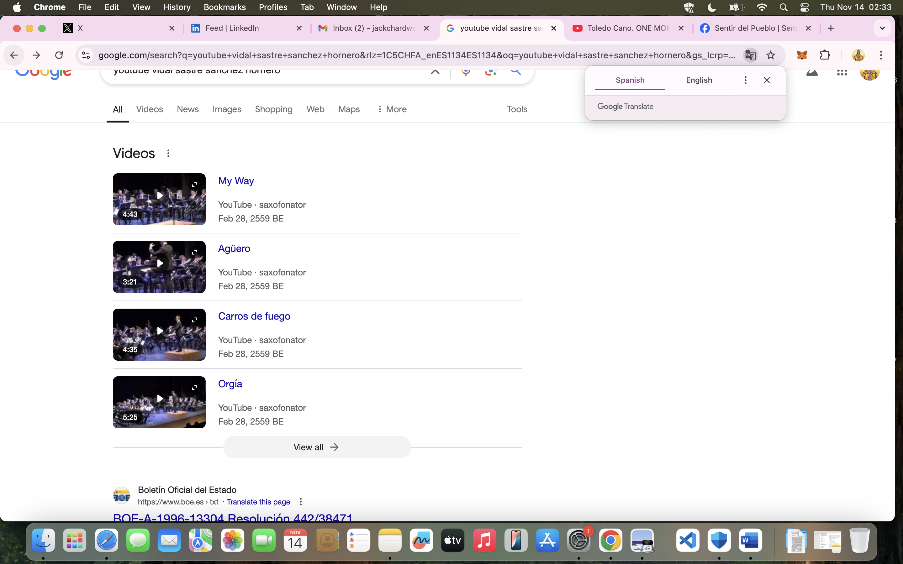
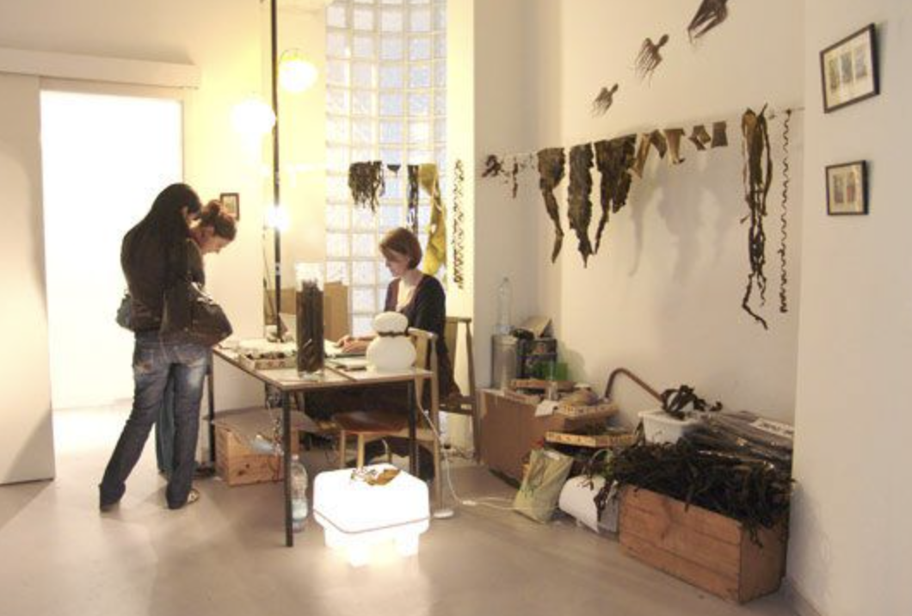

## Twitter

- The Twitter suggestions and odd communication continued.
- They were things like he was coming over, we would go out, he would ask me out, that he really liked me, would he get English ham or Spanish jamon for his dinner.
- I tweeted irreverence back, and it was quite amusing at times.

## Love

- I was so high on this feeling of being in love, it felt real to me.
- How else could I explain how I was feeling all the time, it was 24 hours a day?
- I thought continuously about him, I felt extremely sexually aroused all the time, even in other classes like choir for example.
- I can't imagine what people must have been thinking.
- I was feeling something I had never felt before in my life, it was really powerful. 
- I had no idea I was being drugged. None.
- I didn't understand why the trumpet teacher wasn't talking to me directly but I was prepared to excuse it because of the feelings.

## Work stress

- Work is becoming extremely stressful and I'm not able to handle the things that are going on there.
- I'm being bullied there too, I'm not sure why.
- I'm doing my best to do a good job but feel like the men are trying to get me to leave.
- It has all started because I corrected some instructions that were written by one of the men and he took offense at my corrections, even though we were getting complaints about them.
- It felt like there was more to it.
- The stress of being bullied at the conservatory, and the feelings of being high and anxious, made me unable to deal with any of this properly.

## Penultimate class

- The class on 5th June is just me and him.
- I bring a couple of tunes to play, Creep and Back to Black.
- Creep is for Domingo.
- Back to Black is for the trumpet teacher with regards to Ana his (apparent) girlfriend.
- These are tunes recommended to me, I believe, by Mary at Lourdes.

!!! info
    - It's more likely that these other tunes were suggested to me by hackers on Twitter of course.
    - At that class, the trumpet teacher asks me why I didn't bring them before.

- I'm aware everything is a big joke, and I'm the butt of the joke, but I'm not aware of the extent of it. 
- I mistakenly believe that only Domingo and his close associates are scheming against me.
- The overwhelming feelings I'm having, and some of the things he says, make me suggest to myself that the trumpet teacher doesn't really want to be a part of it.
- I think Ana is just a lie, it was all so contrived, and she grinned at me on the stairs like I was an idiot. 
- It was all extremely confusing and I couldn't keep anything straight in my mind.
- I'm aware something's going to happen at the last class of the school year, and I tweet about that as the day approaches.

## Sunday 11th June

- I often go to the beach on Sundays.
- As I'm walking down to the beach that afternoon, the trumpet teacher is driving towards me in a car, a beat up Peugeot 205.
- He sees me and takes a sharp, wheel-squealing turn into a no entry road. It's rather amusing to me.
- I reminds me of the Truman Show and I feel like Truman.
- I feel like he's coming back from scheming with Domingo and doesn't want me to see him.

!!! info
    - I'm pretty sure he wanted me to see him. I'm just not sure why.
    - Warning maybe? I didn't need one.

- At the beach my mind is racing, I feel like he's going to pop up at any moment, and it's extremely stressful.
- I know everything is a set up and I'm certain that the chamber music class the following day is planned as the grand finale.

!!! info "Related tweets"
    - https://x.com/1FRGVN/status/1667925200292159490
    - https://x.com/1FRGVN/status/1667785711263596545
    - https://x.com/1FRGVN/status/1665611717223612416

## Last class, my funeral, apparently

- I'm prepared for what is supposed to be my humiliation on Monday 12th June at chamber music class.
- I bring the trumpet teacher a present to say thanks, a little wooden frog instrument. He tries to kiss me and I flinch away. 
- We play Creep and My Way.
- Before we play My Way, he tells Pablo to make sure he's recording on his phone, and he starts recording on his phone.
- It's ugly. Every note is a sort of attack on me personally.
- The trumpet teachers blows his trumpet extremely loudly in my ear, so that it hurts, and he is marching up and down angrily, blowing his trumpet, and it's all with the intention of humiliating me.
- Gloria comes to the door when we're done and is practically wetting herself with laughter.
- I'm not at all surprised at any of it but it hurts of course.
- I walk out of the conservatory front door, and teachers and staff throw dirty water (I hope) onto me from an upstairs window (Ana the violin teacher's classroom actually).
- I still have the silk t-shirt that they ruined with the stains on it.
- As I walk home, I "bump" into Mercedes who I realize was waiting for me to walk the other way I go sometimes, the way she would have been more familiar with me going, and when she realized I'd gone a different way, she'd had to run. She was totally out of breath and trying to style it out. It was amusing to me.
- She was checking my face to see if I was crying. Perhaps she was recording it too.
- I got home and went onto Twitter and tweeted something like "well that was a crappy ending wasn't it".
- Suddenly, a huge number of people start to retweet my post and I discover I'm on a list of around 30 people and they're all laughing at what's happened.
- I block the list owner and delete all my tweets from the last six months that were related to everything that had been going on at the conservatory
- I'm shocked and alarmed. I had no idea so many people were involved in the deception, and the humiliation, at that time. 
- I was extremely upset by everything that had happened, reeling in fact. They broke me, but I was also so high all the time I could not get my head straight about anything that had happened.

!!! info "Related tweets"
    - https://x.com/1FRGVN/status/1670583744283983874

## Tuesday 13th June

- Maria phones me to ask me to go into the conservatory to see her.
- I ask Maria if everyone hates me. She says no, no one hates me. She's lying.
- I go to my acupuncture session and I'm extremely traumatized and shocked about what bullies they all are at the conservatory.
- The acupuncturist tells me I have diabetes, which I know fully well is a lie.
- While I'm on the acupuncture table, there is a violent storm outside, and lightning takes a tree down on the road outside.
- I leave for Ireland, via Alicante airport, that evening and there are rainbows all over the region. I take it as a good sign.

## Ireland

- I don't bring my connected devices so I cannot use my own Twitter account.
- I create a fake account and start following `jctot19`.
- The weird "communication" continues between myself and this account, as whoever is running it knows immediately that it is me.

!!! info
    - What I did not know at this time was that they had full access to my mobile phone anyway so they knew exactly what I was doing online at any given moment.

- Stephen Terrell and some of the other practitioners are aware of what's been going on from my perspective and they clearly see I'm in a traumatized state.

## YouTube

- In Ireland, I do a search for "Vidal Sastre Sanchez Hornero" on YouTube.
- A number of results come up, one of which is particularly interesting.
- He is a soloist playing at the Banda Sinfónica L'Amistat - Quart de Poblet. There is a young woman behind him who is clearly nervous. Whoever is filming zooms in on him, and her. She constantly looks up at him. I now wonder if she is medicated.

- There is a moment around 1.07 where she looks at another member of the band and makes a face that suggests she finds him attractive.
- I believe this girl was targeted, just like me, i.e. medicated with aphrodisiacs and cyber-stalked with NLP techniques which made her believe there was a kind of reciprocal relationship going on.
- It would be good to know what happened to her.

!!! info
    - Offline download link: [https://www.youtube.com/watch?v=Td74vBNPrW0]() -> file available on request

- It may also be interesting to know who some of the other people in the group are, especially one particular woman in glasses on the left which could possibly be Carmen Cano, Domingo's sister, and looks very much like a woman I saw outside my apartment on Friday 1st November 2024.
- It is also interesting to note that they have managed to make a lament sound like a funeral march which, I believe, is intentional.
- At the time I saw this I didn't really understand what I was looking at as nothing made any sense other than Domingo was "getting me back" for not allowing him to control me in 2014.

!!! info "Interestingly"
    - There are many other YouTube videos with him in musical scenarios, some of which I felt concern a girl maybe being targeted.

    

## Sunday 16th June Alicante airport

- On my return from Dublin to Alicante, I'm walking towards the arrivals hall and I see him standing there waiting.
- I can't believe it could be him, I'm horrified actually.
- I pull my hat down over my eyes and rush through.
- I forget about this, thinking I must have made a mistake, because it's so weird. 
- There is no way he could have known about the flight details without having access to my Google account, or a connection to someone who has access to flight databases which is what I thought at the time because I had no idea I was hacked at that time.

!!! warning
    - It seems to me that him meeting me off my flight from Dublin on this evening would have been the beginning of something physically sexual and likely porn-related and criminal.
    - I believe now that I had been sexually groomed online, and drugged, in order that I might easily welcome a sexual relationship with this man on this evening.
    - However, the truth of the set up would have been to get me in a situation where they could produce some gang-rape related porn, similar to what had happened to me when I was a child, and this was going to be monetized around porn networks and paid-for chat groups.
    - I believe they already had an audience ready and waiting for this.

!!! danger "Criminal activity"
    - If I'm right in thinking airports keep CCTV for 5 years, then this will be recorded.
    - There will be footage of him arriving, with his mates maybe, waiting for me, then leaving again when I don't stop.

## Back in Dénia

- I run a block list on his followers and who he's following.
- I'm worried they're after my Twitter account so I take steps to protect it.

!!! warning
    - I've no idea they have had full access via the router probably since I moved in and got connected.

## Monday 19th June

- I quit my job but I don't have another one to go to.
- To everyone's shock and surprise, I go to practice the piano at the conservatory.
- This was not what they intended, and I knew that very well.
- But how dare they treat a student like that! I couldn't believe at that time that such behavior could be considered normal, and protected by the school board, as I understand it is now.
- I'm also stubborn and deeply against injustices of all kinds. 
- Moreover, my child sexual abuse history has made me utterly intolerant of injustices to children and I knew very well that if Domingo and his associates were able to behave in such a way to an adult student, they would most definitely be doing similar to minors.
- I also realized that if I backed down and ran away, the evil would just grow.
- I had no idea that running away was not actually what they really wanted, although perhaps that's what some of the teachers assumed. It's unclear how much and who knew about the mass voyeurism, drugging, and porn connection.

## Rest of June

- I practice every day at the conservatory.
- I feel overwhelmingly sexually aroused a lot at home, and masturbate often, even on the days I don't go to the conservatory.

!!! info "In retrospect"
    - I don't realize I'm being recorded audibly doing this via my mobile phone. 
    - I find this out when the hackers reveal themselves to me, from August/September 2023 onwards, for example when they repeat parts of conversations I've had back to me in fake Twitter account profiles or random posts I see.
    - I don't realize it is highly likely I'm being filmed with secret cameras in my flat too.

## The beach

- I go to the beach every afternoon.
- I feel like I'm being followed.
- I walk up to the area of the beach that has a restaurant and a bar.
- The bar plays Back to Black while two people who look like the trumpet teacher and Ana walk by.
- This sort of thing goes on continuously, any time I leave the house.
- I can't believe people have nothing else to do with their lives.
- It's all set ups and contrived events designed to terrorize me.
- It is indeed very stressful and I'm still feeling enormously sexually aroused all the time and I cannot think straight.

## Twitter

- I'm still having the communication via Twitter posts with `@jctot19` who is, apparently, the trumpet teacher.
- This account posts communications that are very clearly intended for me.
- There are posts about Ana, British women, other relevant things.
- There are posts with a woman with hair flying which is a trigger picture that I will see again on the American fake account in August, the account I ended up having a prolonged DM with at Christmas 2023.
- There are posts with pictures of hanging seaweed, which is a Julia Lohmann art installation [I mentioned before](../early-years/2015.md) that will be revealed to me in July as something Ana the violin teacher was connected to.

{width=65%}

!!! tip "Ana"
    - Ana the violin teacher in a modeling role for Finnish artist Julia Lohmann. 
    - I do wonder if this is correct now as I can't find the connection between the two.
    - There is a Finnish connection with the trumpet teacher and I wonder if there is a connection between him and Julia Lohmann. Was she another victim maybe? 
    - Either way, Julia Lohmann pics with seaweed were coming up at the same time as pictures of Ana, so I related the two things in the same way I thought plate lady was Carmen.
    - A whole bunch of Ana pics were sent to me via the trumpet teacher's *apparent* account around June/July 2023 seemingly in order to convince me that Ana and the trumpet teacher were a romantic item.
    - Over the hacking duration, and during the conversations I had with hackers, Ana was talked about a lot, often in an extremely derogatory manner and often with relation to unsavory sexual activity.

    

- It's as if they are teasing, posting things that they hope will upset me.
- Suddenly I'm seeing a lot of porn on my Twitter timeline too.
- A porn video pops up on my timeline which looks like the trumpet teacher and Ana so I look at it. It is extremely violent and he is holding her by the neck and throwing her around the kitchen. It certainly wasn't actually Ana but the woman was of a similar build and look. It may have been the trumpet teacher however, as the man's back was to the camera and he was of the same build.
- https://x.com/1FRGVN/status/1664572450112258049
