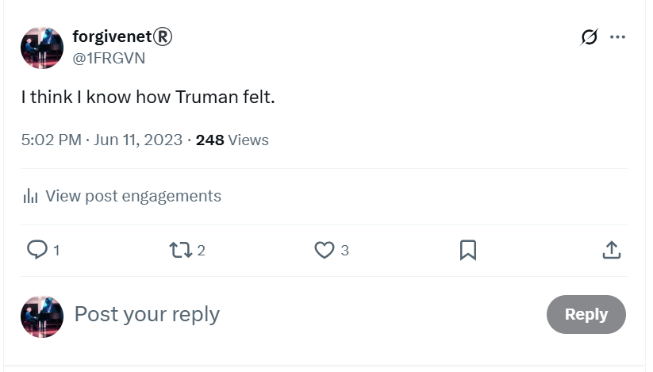
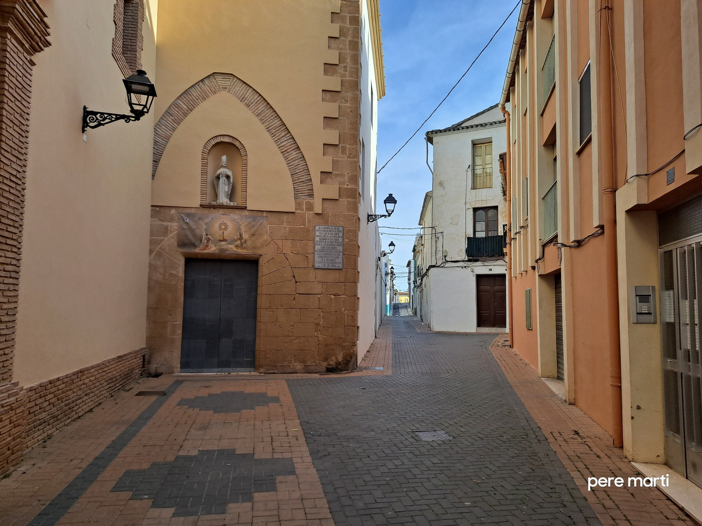
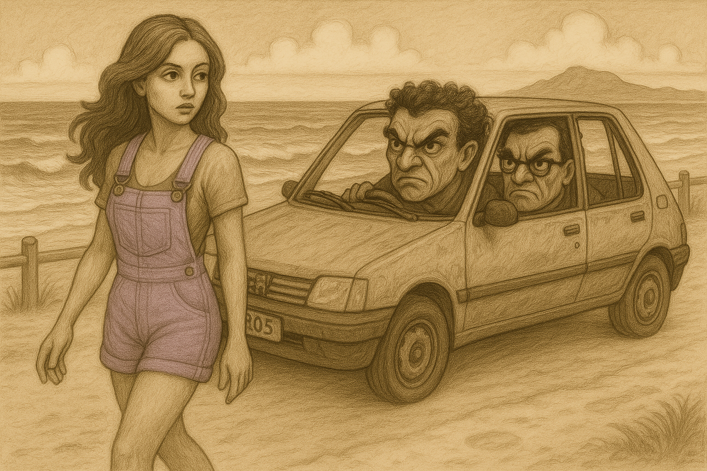
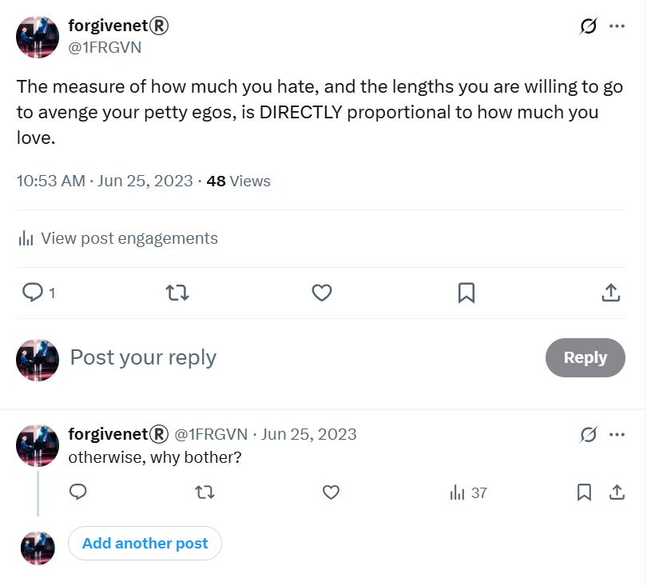
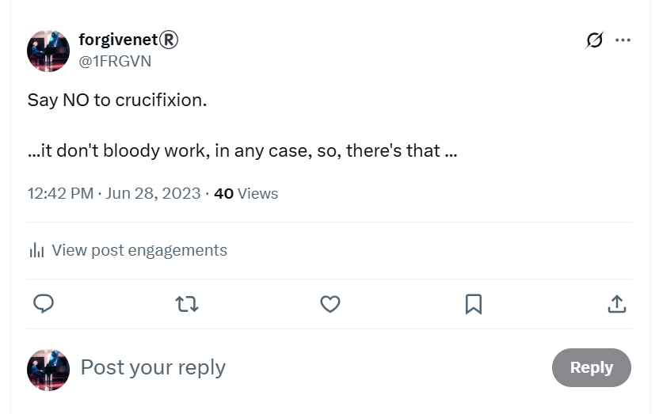

# June 2023

## Twitter/X

- Communication with the trumpet teacher continues.
- The `@jctot19` account posts tweets suggesting he is coming over, that we will go out, that he will ask me out, that he really likes me; wanting to know if he will get English ham or Spanish jamon for his dinner.
- I tweet irreverence back, and it is quite amusing at times. 
- I know I have an audience. I mistakenly believe it is an audience of no more than two or three: https://x.com/1FRGVN/status/1664572450112258049.

- It feels like a relationship somehow.
- Most of the posts I saw over this time are now deleted.
- Is this how they administered [Stockholm syndrome](https://en.wikipedia.org/wiki/Stockholm_syndrome) so that I would feel loyalty towards a man engaged in serious criminal-gang activity against me?
- Is this how they manipulated me into making constant excuses for his behavior in my mind?
- Did they even have to bother given the police literally don't care about the safety of women and children at public learning establishments in Spain?
- Perhaps terrorizing women and girls in this cowardly way is how they gain respect for themselves as men in a deeply misogynist culture?
- They certainly got a lot more than they bargained for with me.

## Love

- I was so high on this feeling of being in love, it felt real to me.

!!! tip "Retrospectively"
    - It still feels real at the time of writing; April 2025. 
    - I cannot explain this, and I've always been aware of the trick to some extent, awareness still expanding.
    - Ironically, I feel very grounded at the same time. It's strange and inexplicable.
    - From the very beginning, I have been giving all of it to God to use for His purposes, which seem to be rather good, at least from my perspective.

- How else could I explain how I was feeling all the time? It was 24 hours a day.
- I thought continuously about this man, and I felt extremely sexually aroused all the time.
- I was even super-high and aroused in other classes at the conservatory amongst the children; like choir for example.
- I can't imagine what people must have been thinking; more likely they knew exactly what was going on.
- I was feeling something I had never felt before in my life. It was really powerful. 
- I had no idea I was being drugged. None.

!!! danger "How did they drug me?"
    - Aside from having access to my apartment's water and air vents, I believe I was drugged while at the conservatory and during classes. This certainly happened on the [28 January 2023](january.md#serious-poisoning-at-chamber-music-class).
    - I also suspect that the drugging could have happened as I entered the conservatory too.
    - There always seemed to be a large group of older kids, and teachers, in reception or on the stairs with me whenever I came into class.
    - Someone could easily have added powder to my neck skin, or close to my ear, at those moments.

- I didn't understand why the trumpet teacher wasn't talking to me directly but I was prepared to excuse it because of the feelings.

## Penultimate chamber music class

- The second-to-last chamber music class is on 5th June.
- Pablo does not attend; only myself and the trumpet teacher turn up.
- The trumpet teacher looks like he has been taking testosterone and exercising. He's much bigger than he was at the end of November and even his face looks muscular.

- I wonder if he is pumping iron with Domingo and the Dénia testosterone (woman-hating) addicts.
- I bring a couple of tunes to play, Creep and Back to Black.
- Creep is for Domingo.
- Back to Black is for the trumpet teacher with regards to Ana his (apparent) girlfriend.
- These are tunes recommended to me, I believe, by Mary at Lourdes.
- We play them, and the trumpet teacher can't look me in the eye. He looks guilty.
- He asks me quietly why I didn't bring them before.
- I'm aware everything is a big joke, and I'm the butt of the joke, but I'm unaware of the extent of the conspiracy and how it has my total destruction as its end goal. 
- I mistakenly believe that only Domingo and his close associates are scheming against me; and it was so ridiculous and immature that on a day-to-day level I really didn't care.
- Moreover, the overwhelming sexual feelings I'm having, and some of the things the trumpet teacher says, seem to suggest he doesn't really want to be involved in this nonsense.
- The Ana relationship is obviously a lie; the conservatory's total dedication and commitment to it was so contrived. 
- Ana had grinned at me on the stairs like I was an idiot, and I just thought they were all so ridiculous and easily ignored.
- None of these childish games really bothered me, and I'm certain they would have bothered me *not at all* if I wasn't being drugged.
- However, on top of the constant childishness, everything that was happening was extremely intense and confusing. I couldn't keep anything straight in my mind.
- Nevertheless, I'm clear that something horrible is going to happen at the last chamber music class of the school year, on the 12th.
- I tweet about my feelings as the day approaches: https://x.com/1FRGVN/status/1665611717223612416.

!!! tip "Was I being primed and groomed online for that day?"
    - A "setting up of events I should be worried about" was an ongoing theme with the cyber-stalkers from the conservatory, particularly in [August 2023](september.md#going-public-on-twitter) when I was so frightened I went public on Twitter, and then again in [March 2024](../2024/march/1-12.md#a-serious-attack-on-my-wellbeing-from-piano-teachers-at-denia-conservatory) when I became afraid for my life and left my piano studies, and then again in [April 2024](../2024/april.md#the-third-time-im-convinced-im-going-to-be-arrested) when I became certain I was going to be arrested.
    - Is the original childishness an intended and sinister part of the murderous plots?
    - Will an avalanche of victims corroborate my story with their own horrible experiences at the hands of teachers and staff of the Generalitat Valenciana's conservatory system for music and dance?

## Last harmony class

- The class sits the harmony written exam together.
- I am feeling extremely high, anxious, euphoric, and consequently quite confused.
- There's a lot going on I'm not fully aware of; the constant online stalking, gang stalking at the conservatory, drugging at home and in class.
- Work has become enormously stressful too and it's difficult to get anything clear in my mind.
- The two boys that attend the class are teasing me. 
- One of them, gypsy Andre, refers to me to the others, and then mentions something that's going to happen to me the following week and how excited everyone is about it.
- He then starts to laugh uproariously with delight.
- Andre looks like he could be related to the trumpet teacher; most certainly behaviorally they are a perfect match. 
- He could very well be his son they're so alike. He could certainly be [Sara's](../2022/september.md#harmony) brother; remember the girl with the strange surname who didn't return to study in the 4th year?
- I notice all these things but I'm not able to deal with them or respond to anyone.
- I'm feeling constantly euphoric and it's difficult to speak.

## June 9th piano concert

- The end of year piano concert takes place at the boat club venue in Dénia.
- A huge crowd of parents and children comes to listen to piano students of all levels and all ages.
- All the [piano teachers](https://portal.edu.gva.es/conservatoridenia/es/departaments-es/#dep-inst-tecla) attend.
- I play Philip Glass etude no 2: https://www.youtube.com/watch?v=850kyfwmRcM.
- Before the concert begins, and as we were all preparing, and just as I was a few bars into rehearsing my piece, Domingo shouts **"Again?"** in an accusatory tone, very very loudly.
- The whole auditorium hears him.
- I wonder what he means. Does he mean another ridiculous *apparent* romantic tryst for me at the conservatory like in [2014](../early-years/2014.md#first-piano-class-at-the-end-end-of-september)? Or something more sinister, perhaps, like a replay of the child sexual abuse events from 1989?
- As I am returning to my seat after rehearsing, another one of the piano teachers, a woman teacher who looks like her other job is porn-star, asks me **"Are you alright"?**
- I have no idea why she is asking me this.
- You may remember this happened before when Ana Girbes asked me, incongruously, "Are you alright?" just before the [chamber music concert](may.md#chamber-music-concert), and more recently online stalkers repeated it during the relentless online terror. 
- These words and phrases came directly from my [police statement of 2015](../early-years/2015.md#statement-to-the-metropolitan-police).
- The only way they could only have known about these specifics was if the Metropolitan police had given my statement to the teachers and staff at the conservatory, or if my apartment was hacked in 2014-2016 and Domingo Cano had access to my activity.
- Domingo must have instructed the woman to say this to me.
- Interestingly, given that no-one was permitted to communicate with me at all outside of regular classes while I was being targeted, the only time anyone ever said anything to me turned out to be *significant* like this.
- One of Domingo's students, Adriana, she is 14 or 15, runs over to him in a subservient and affected way. I believe he has requested her to do this too. I'm sure I'm not the only one cringing.
- Nevertheless, aside from the sexual terrorism, playing in this concert is an immense joy for me and exuberant doesn't come close to how I feel about the experience. I tweet about this later: https://x.com/1FRGVN/status/1667242652163514406:

- I'm so happy when all the piano students are photographed at the end of the concert; I am grinning from ear to ear. 
- However, I notice that all the piano teachers; Paqui, Joan Carles, Domingo, etc, are looking very unhappy, angry even, no smiles at all. 

- Underlying my delight is the continuing intense stress from the constant gang stalking by teachers and staff at the conservatory, which I know is ramping up to something really horrid I can expect on Monday 12th June at the final chamber music class.
- The recording of my performance at the June 9th concert, and the photos, were never shared with me as they usually are with students.

## Work stress

- Work is becoming extremely stressful and I'm not able to handle some of the emotionally challenging things that are going on there.
- I'm doing my best to do a good job but I feel like the *important men* are trying to make me look incompetent and get me to leave.
- One man, Coogan, has become exceptionally offended that I corrected some work he did; so much so he aggressively tries to take over control of my machine in a meeting where he is ostensibly trying to show me how wrong I was. I tell him no and ask him to demonstrate how wrong I am on his machine.
- He does so, but eventually comes up against the error I had corrected and has to back down.
- He never forgives me for this; or he's aware of the [porn fatwa](../early-years/2003.md#porn-fatwa) and how I'm an international porn-addict target.
- I am managing one other writer on the team whose level of English is pre-school. He doesn't know where to put full stops and capital letters.
- He was hired by someone who didn't know the job and he had been hacking away at the content for nearly a year.
- I redirect him into things he can do which I don't have time for, things he's really good at like web development - although sometimes, he admits, he gets someone else to help him.
- They fire him at the beginning of the month and I'm on my own.
- It starts to feel like the usual *woman-in-tech* scenario. You show competence and know-how and one of the insecure men takes great offense and starts a campaign of terror against you.
- Quite often, women-in-tech end up pretending to be not as competent as they are to avoid this, and obviously are targeted at that time for being incompetent.
- Tech is a game that women cannot win.
- We work side-by-side with violent men, and the predominantly decent men we work with usually do nothing to help or support us.
- I wonder how many of the men I have worked with over the years have [seen me in child rape-gang porn](november.md#first-time-they-flash-up-my-naked-16-year-old-body-on-x).
- In this specific case, I had corrected some published instructions which we were getting a lot of complaints about.
- The original author, an insecure male, Coogan, took great exception to this and tried to hack into my laptop directly with my permission, which I did not give him. He was very aggressive.
- Eventually, we worked through the examples together and he had to agree there was a problem he hadn't noticed.
- Nevertheless, these sorts of situations are death knells to women's careers in tech, and I was targeted by management from that moment onwards.
- The stress of being bullied and sexually groomed relentlessly at the conservatory and online and the feelings of being high and anxious from drugging and sedating, made me unable to deal with any of this effectively.
- I start thinking about resigning; for the second time in less than 6 months.
- Was getting me fired, or getting me to leave my job, part of the conspiracy so that I would be fully isolated from any possible avenue of help when the conservatory classes were over for the school-year and the porn gangs could begin their campaign of terror in earnest?

### Elon

- The CTO at zkSync, a British guy living in California, was particularly vicious towards me.
- The day before the mass-firing where my writer was sacked, he posted a gun emoji to me on Slack.
- Incidentally, his job prior to working at zkSync was with Elon Musk.
- Did he know Elon?
- Could Elon himself know about the [porn fatwa](../early-years/2003.md#porn-fatwa) and support it?
- Elon's posts [often strangely coincided](november.md#elons-violinist) with what was going on for me at the conservatory and with regards to the trumpet teacher.
- Was this just coincidence?
- Is Elon aware of the systemic targeting of women in tech by porn addicts?
- He clearly prefers pornified-women over real ones as his X posts demonstrate.

## Sunday 11th June

- I often go to the beach on Sundays.
- As I'm walking down to the beach that afternoon, the trumpet teacher is driving towards me in a beat up, grey, Peugeot 205.

- He sees me and takes a sharp, wheel-squealing turn into a no entry road. It's rather amusing.
- It reminds me of the Truman Show and I feel like Truman: https://x.com/1FRGVN/status/1667925200292159490.

- I feel like he's on his way back home to Valencia after a meeting with the conservatory teachers who are plotting against me and carefully planning Monday evening's attack.
- I guess he has been scheming with Domingo, Ana, Nacho and the others; and he doesn't want me to see him.

!!! info "Actually"
    - It really felt like he wanted me to see him. I wasn't sure why for a long time.
    - Then it clicked.
    - A sighting of the honey-trap victim's focus of desire is integral to the deception. That coupled with mind-altering substances and the victim is locked in.
    - The car itself was a way of convincing me the trumpet teacher was poor and would need my help financially.

- At the beach my mind is racing, I feel like he's going to pop up at any moment. It's extremely stressful. I'm 100% sure I was being drugged at this point given the constant looping thoughts and images, plus sexual feelings.
- I know everything is a set up and I'm certain that the chamber music class the following day is planned as the grand finale.
- In September, after the gang reveals itself to me online, I post about this event as I knew it was significant: https://x.com/1FRGVN/status/1698220957368725524.

- I tweet confirmations of everything that happened in 'conversation' with the hackers. Notice how many likes the tweet has! 

### Fighting talk

- On some level, I knew what was coming, and that it was going to be extremely ugly. I had no idea of exactly *how* ugly at that time and still considered teachers and staff at the conservatory to be overwhelmingly immature and ridiculous. I wasn't to know that the porn industry had successfully infiltrated the Spanish school system and I was experiencing the worst of that.
- Nevertheless, regardless of how much I knew or didn't know, at every level I'm a fighter.
- I'm reminded of my [tensegrity practice from years previous](https://www.castaneda.com/meet-carlos-castaneda), and I'm inspired to post Buckminster Fuller's quote in full about the trim tab: https://x.com/1FRGVN/status/1667785711263596545 and how true integrity, however small, can bring down the largest and vilest energies with very little effort.

- Notice the amount of views I'm getting at this time. This is before I went public in September and views increased even more, and before I signed up for premium in January and I started to get massive view counts.
- In contrast, each of my tweets now, in May 2025, gets on average a maximum of 20 views and I do still have a subscription.

## Monday 12th June 2023

- Today is the last chamber music class of the 3rd year of professional studies at the conservatory of Dénia; and my funeral, apparently.
- I'm prepared for what I'm quite sure is supposed to be enormously humiliating; except I really don't care. I'm still convinced that teachers and staff at the conservatory of Dénia are simply ignorant fools. I have no idea how dangerous they really are and how their intention is, in fact, murderous.
- They believe they will never see me again after this evening's class. I expect that's the only outcome they've known over the years.
- They are wrong.

### Devastated parents at the church

- I'm extraordinarily tense before class. 
- On my way into town to the conservatory, I decide to take a detour.
- I walk towards the Carrer Loreto and pop into the [chapel there](https://www.google.com/maps/place/Iglesia+Agustinas+Recoletas,+Denia/@38.8404519,0.1035054,19z/data=!4m15!1m8!3m7!1s0x129e1b22919b9785:0xcd3bcc58c432965f!2sC%2F+de+Loreto,+03700+D%C3%A9nia,+Alacant,+Spain!3b1!8m2!3d38.8404519!4d0.1044442!16s%2Fg%2F1w3swvhw!3m5!1s0x129e1b2297b6860d:0xeba2d1d681469aaa!8m2!3d38.8404811!4d0.1039396!16s%2Fg%2F12qf4wb9n?entry=ttu&g_ep=EgoyMDI1MDQzMC4xIKXMDSoASAFQAw%3D%3D) to ask Mary for guidance and blessings.

- The church is empty apart from a couple in their sixties sitting at the front near the altar.
- They have a portrait of a young girl with them.
- They are crying.

- I hum the Salve from the back.

### At the conservatory

- The intensity of the tension I am feeling is matched only by the delighted expectation on everyone's faces.

- I bring the trumpet teacher a present to say thank you for the classes; a little wooden frog instrument. 
- He tries to kiss me and I flinch away. I don't want to kiss him; his chin is rough and hairy. I don't get a good feeling from him.
- I tell him that the frog is lucky and that he should look after it.
- We play Creep and My Way.
- Before we play My Way, he tells Pablo to make sure he's recording on his phone. He sets his phone up for recording too.
- It's ugly. Every note is an attack on me personally.
- The trumpet teacher blows his trumpet extremely loudly in my ear, so that it hurts, and he is marching up and down angrily, blowing his trumpet right up against my ear with the intention of humiliating and dehumanizing me.
- It takes me a while to describe this on X: https://x.com/1FRGVN/status/1670583744283983874.

- Gloria comes to the door when we're done and is practically wetting herself with laughter.
- I'm not at all surprised at any of it, but it hurts of course.
- I'm quite sure I'm not the one in the wrong, however, and I'm appalled that grown adults are behaving this way, especially given the fact they have guardianship powers over a great many people's children.
- As I leave class, I remind the trumpet teacher that the frog is a lucky frog and to look after it.
- He says he will put it in his studio.
- I remind him again of the lucky frog, and say goodbye.
- He ignores me.
- I leave and walk down the conservatory steps and out the front gate.
- Teachers and staff throw dirty water (I hope) onto me from an upstairs window; Ana Requena's classroom.
- Their behavior reminds me of Carrie, the Stephen King horror novel.

- I still have the ruined silk t-shirt with the stains on it.
- I "bump" into Mercedes who I realize was waiting for me to walk the other way I go sometimes, the way she would have been more familiar with me going, and when she realized I'd gone a different way, she'd had to run. This poor woman in her 70s was totally out of breath and trying to style it out. It was actually rather amusing.
- She was checking my face to see if I was crying. Perhaps she was recording it too.
- Continuing up the Carrer La Mar, a car beeps at me. I hear my name called. I continue on.
- I got home and went onto X and tweeted something like *"well that was a crappy ending wasn't it"*.
- Suddenly, a huge number of people start to retweet my post and I discover I'm on a list of around 30 people and they're all laughing and jeering about what's happened.
- I block the list owner and delete all my tweets from the last six months that were related to everything that had been going on at the conservatory.
- I'm shocked and alarmed.
- I had no idea so many people were involved in the deception. 
- I was extremely upset by everything that had happened, reeling in fact. They broke me, but I was also so high all the time (anxious, euphoric, sexually aroused, scared again, all on a loop) I could not get my head straight about anything.
- A little later, an account `@january_myth` posts an extremely significant picture that I see after the shock of finding out I have been cyber-stalked so extensively and by so many. 
- It is very unsettling.
- At the time of writing, 20 November 2024, I'm unable to find this pic as the account owner has deleted it from their timeline. I ask the account owner for it.

- There is no reply. Eventually the account re-posts the pic and the poem at my request.

- Incidentally, the `@january_myth` account [will post another extremely triggering pic and poem](august.md#the-hackers-reveal-themselves) after another significant online-terror event in August.
- The two posts are directly related to events designed to terrorize me into never returning to my piano studies at the conservatory.
- I believe the "long, long way to go", post is in reference to the "romantic relationship" in which terrible things are planned for me, including being relieved entirely of my wealth, and health, has not even started yet at this time.

### World-saving lucky Forg

- The little frog I gave the trumpet teacher as a present would reappear often as I foiled the plot and continued attending classes at the conservatory, much to everyone's surprise.
- I was serenaded by the gypsies whenever I walked through the tunnel of Dénia, and they would sing to me about the little frog in the box.
- Frog meme's popped up on my browser UI's repeatedly.
- Eventually, the frog got a name, Forg, and is now appearing in his own [DeSocial page](https://desocialworld.com/u/KingForg) as King Forg and telling us all about his adventures.

!!! tip "World-saving lucky forg"
    

- He also has an X account, [`@KingForg1`](https://x.com/kingforg1) which was immediately suspended; probably due to British gang interactivity who were a bit annoyed about this when I initially set up the account on my very, *very* hacked Iphone.
- I do hope the trumpet teacher looks after him.

### Director and AD

- There is no way any of this choreographed activity could happen so seamlessly without a director watching the whole thing and prompting them to move.
- I expect there must be a *control room* somewhere which has access to everyone's phones.
- I expect, also, the conservatory is wired up with spy cams.

## Tuesday 13th June

- I wake up in fighting mode.

- Maria phones me first thing to ask me to go into the conservatory to sign something for her.
- It's nonsense. 
- They're able to hire a sex offender on a whim and give him a pension, they hardly need his student victims to sign something.
- No. Maria is checking to find out if I will come to the conservatory again, or not. 
- They're not sure if their plan has worked.
- I ask Maria if everyone hates me. 
- She says no, no one hates me. 
- She's lying.

### Rainbows from Heaven

- I go to my acupuncture session that afternoon with Thao Qui.
- I'm extremely traumatized and shocked about what happened at the conservatory.
- While I'm on the acupuncture table, there is a violent storm outside.
- Lightning takes a tree down on the road at the top of Sant Telm, the road the conservatory is on.
- I leave for the first TEB session I've done in person since 2020 in Cork. It's taking place in Ireland again and I drive to Alicante airport to fly to Dublin.
- As I'm driving through Dénia and out into the mountains, I see rainbows all over the region.
- I take the dramatic weather as a very good sign.
- A sign from God Himself.

- June 13th is Saint Anthony of Padua's day.
- I tweet about this in December 2023.

!!! warning "Teachers and staff involved in gang stalking students at Dénia Conservatory"
    - You can find a list of current teachers and staff on the [conservatory website](https://portal.edu.gva.es/conservatoridenia/es/inici/).
    - As a taste of things to come in this story, hackers will create numerous fake X accounts using genuine pictures of teachers and staff in the profiles.
    - These accounts interact with me endlessly from September 2023 onwards, when these people try once again to terrorize me into having a nervous breakdown, or worse, and to not return to classes.
        
    For example:

    The trumpet teacher's apparent account. One wonders if the name could be translated to something like "Jesus Christ, there's been 19 victims so far?"

    
    
    An AI mix of the trumpet teacher and Gloria the conservatory receptionist, an account which has been following me since September 2023 when I went public on Twitter.

    {width=35%}

    My piano teacher for year 4, a young Paqui Fornet Pastor in a rather threatening pose. This was posted in March 2024, after what I felt were credible threats to my life when I didn't stop going into practice after the piano concert; the concert which was set up to terrorize me into never coming back to the conservatory.

    {width=35%}
 
    An AI generated old Domingo, the piano teacher, posted around March 2024.

    {width=35%}

    A young Maria Hontanilla, posted around March 2024.

    {width=35%}

    The chamber music teacher from year 4. Posted around March 2024.

    {width=35%}

    Ana the violin teacher in a modeling role for Finnish artist Julia Lohmann. A whole bunch of these pics were sent to me via the trumpet teacher's *apparent* account around June/July 2023 seemingly in order to further convince me that Ana and the trumpet teacher were a romantic item.

    

    [Tweet thread](https://x.com/1FRGVN/status/1846120069010473024) containing the rogues gallery.

    A more recent pic of what looks like Alfonso the harmony teacher who had been rather shocked when I informed him I was leaving classes in March 2024 because I feared for my life.

    

    Did they threaten him too? Is this a picture of that happening?

!!! danger "Critical"
    - It is *highly* likely all these fake X accounts were controlled by Hazel and Sandra Smith and English-speaking members of their gang.

## Ireland

- It's the first TEB course I've taken in person since February 2020 in Cork.
- I'm utterly traumatized from my experience over the last 6 months and especially over the last week.
- I don't bring my connected devices so I cannot use my own Twitter account.
- I create a fake account and start following `@jctot19`.
- I'm angry. 
- I tweet a list of pros and cons about the man.

- The weird "communication" continues between my new fake account and the `@jctot19` account. 
- I have a long WhatsApp chat with Sandra Rita Diaz, my French friend who I believe now is a spy, where I complain that the man is lazy. 
- I hear about him being lazy again and again over the next year or so online.

!!! info
    - What I did not know at this time was that the criminal gangs had full access to my mobile phone anyway so they knew exactly what I was doing online at any given moment, and had done for a very long time.
    - Incidents way back in 2017 and earlier suggest the visual access to my movements via my laptops and phones was going on even then.

- I tell Stephen Terrell and some of the other practitioners what's been going on from my perspective at that time, i.e. I had been terrorized by teachers and staff at the conservatory.
- I tell a practitioner there that I had defecated in my bed while asleep and it was [a little round flattened bolus](may.md#teb-with-robin).
- Everyone on the course can see I'm in a traumatized state.
- I meet a few of the practitioners in the hot tub at the hotel one evening. Steve is there.
- He asks me, repeatedly, how much does land cost in Spain?
- I tell him it depends, repeatedly, and he asks again.

- The sexual feelings stop completely while I am away.

## YouTube

- In Ireland, I do a search for *"Vidal Sastre Sanchez Hornero"* on YouTube.
- A number of results come up, one of which is particularly interesting.
- He is a soloist playing at the [Banda Sinfónica L'Amistat - Quart de Poblet](https://www.lamistatquart.com/sociedad/). 
- The website makes for interesting reading, particularly concerning the unconditional support of the female members.

- In the video, there is a young woman behind the trumpet teacher who is clearly nervous and agitated.
- Whoever is filming zooms in on him, and her, repeatedly.
- She constantly looks up at him and then away, troubled. 
- I now wonder if she has been medicated.

- There is a moment around 1.07 where the woman looks at another member of the band and makes a face that suggests she finds the trumpet soloist sexually attractive.
- I believe this girl was targeted, just like me, i.e. medicated with aphrodisiacs and cyber-stalked with NLP techniques which made her believe there was a kind of reciprocal relationship going on.
- It would be good to know exactly what was happening here and whether the woman ended up in porn.

!!! info "Offline download link"
    - Click here if the YouTube entry isn't working for any reason: [https://www.youtube.com/watch?v=Td74vBNPrW0](https://drive.google.com/file/d/1AsGYbEVufI1pATGd1y0k4bAZ5Om_2gLg/view?usp=drive_link)

- It may also be interesting to know who some of the other people in the group are, especially one particular woman in glasses on the left which could possibly be Carmen Cano, Domingo's sister; someone who looks very much like a woman I believe to be Carmen Cano that I saw outside my apartment on Friday 1st November 2024.
- It is also interesting to note that they have managed to make a lament sound like a funeral march which, I believe, is very intentional.
- At the time I saw this in June 2023 I didn't really understand what I was looking at as nothing made any sense other than Domingo was "getting me back" for me not allowing him to control me in 2014.

!!! info "More evidence of mass sex abuse of women and girls by musicians in Spain?"
    - There are many other YouTube videos with the trumpet teacher in musical scenarios.
    - Many of these gave me concern that a girl, or girls, maybe being targeted.

    

    - Some videos have comments which suggest girls are being targeted by musician predators.
    - The names of the songs are also suggestive: My Way, Hole, .. Orgy, etc.

!!! danger "Which trumpet teacher?"
    - I have been seeing the man in this video since June 2023.
    - To me, he was *always* the trumpet teacher who came to the conservatory to take classes.
    - Except, he's only one of them, [number four](../../crimes/protagonists/vidal-sastre.md#dark-thick-curly-haired-deep-set-man).
    - His appearance is not even slightly similar to [any of the others](../../crimes/protagonists/vidal-sastre.md#four-distinct-men).
    - You cannot imagine how shocked and horrified I am to learn that, until [September 2025](../2025/september.md#thunderbolt-clarity), for over two-and-a-half years, I mistook at least four very different looking men for the same one man.
    - Until January 2025, I was being regularly drugged by the gangs in Dénia in my home without my knowledge, and whenever I traveled too via items I brought with me from home.
    - This is just part of a solid explanation for this.
    - Does the statement *Unconditional support in their entirety* about the women of the band signify the possibility of mass drugging of women, young girls, and children, by groups of men all over Spain?

### Who is grassing up the trumpet teacher like this?

- It seems to me that all this content is rather damning for the trumpet teacher and his gang.
- Could he be so sure of his untouchable state that he is sufficiently arrogant to post these examples to me, as a kind of trophy display?
- Or had he upset his British counterparts to the point where they decided they would grass him up?
- What did the trumpet teacher do that annoyed them so much?
- Was he planning on keeping me and my considerable finances and [web3-crypto app](https://1frgvn.com/) for himself, and shutting the British gangs out?

#### One other explanation perhaps

- There is one other explanation to all this, perhaps.
- A culture that is so utterly corrupt may literally be a sitting duck for global crime organizations.
- Does the trumpet teacher, and his band, publish this material in a *message-in-a-bottle* type manner.
- Are they saying, we have no choice but to do this, international porn gangs control us and no-one cares about our children.
- Are the good men of Valencia crying for help having been easily tricked into pure evil by their own misogynist way of life?
- It seems unlikely given how much fun the trumpet teacher had at the conservatory of Dénia while he was targeting me, and the things he said to everyone about me in meetings and in the staff room over coffee.
- But could those perverted demonstrations, too, have been *sand-in-the-eyes* of his local handlers so they would not suspect him of a double-cross?
- Whatever the story, he wasn't finished with me...

## Sunday 18th June Alicante airport

- On my return from Dublin to Alicante, I'm walking towards the arrivals hall and I see the trumpet teacher standing there waiting.

- I can't believe it could be him; I'm horrified actually.
- I pull my hat down over my eyes and rush through.
- I forget about this, thinking I must have made a mistake because it's so weird. 
- In my mind at the time, there is no way he could have known about the flight details without having access to my Google account; or a connection to someone who has access to flight databases which is what I thought at the time because I had no idea I was hacked.

!!! warning "What were his intentions?"
    - It seems to me that him meeting me off my flight from Dublin on this evening would have been the beginning of something physically sexual and likely porn-related and criminal.
    - I believe now that I had been sexually groomed online, and drugged, in order that I might easily welcome a sexual relationship with this man on this evening.
    - I was completely unaware that I had been distributed in 24-7 spy-cam porn for over a year while in my apartment, and that this was ongoing.
    - However, I also believe that they wanted to get me into a situation where they could produce some gang-rape related porn, similar to what had happened to me when I was a child, and this was going to be monetized around porn networks and paid-for chat groups.
    - I believe there was an audience ready and waiting for this.

!!! danger "Criminal activity"
    - If I'm right in thinking airports keep CCTV for 5 years, then this will be recorded.
    - There will be footage of him arriving, with his mates, waiting for me, then leaving again when I don't stop.
    - I also suspect it is highly likely that Winston May and his sex offending cohort would have been invited out at this stage, probably to "turn up" at my apartment for the grand finale which I expect would have involved me being gang raped probably to death. There is likely air ticket references and evidence for this.

!!! warning "Mentions of hallucinating"
    - When I mentioned this on Twitter at some point in the future, I use the phrase "I thought I was hallucinating".
    - An account picks up on that word and makes a big deal out of it, suggesting I might be the sort of person who hallucinates.
    - I explain that, in English you can use exaggerated words to explain things like this and no-one will think you're mentally unwell.
    - It reminded me of a time in a piano lesson with Maria where I had used the word "hallucinating" in a similar way.
    - Maria had picked up on it as if I was stating I was mentally unwell and I had to explain to her the same word usage rules of English.
    - I now believe that these instances were seen as opportune moments for suggesting I was mentally unwell or imagining things if I ever went to the police about what was going on.
    - **Or**, the instances in which people got excited over my use of the word "hallucinate" were due to the fact they knew I was being given hallucinogens of some variety without my knowledge.

- I tweet about this in November as it is so incongruent and I never forgot it. I wonder what sparked the memory. Was I still seeing this man somehow?

- The rather innocuous tweet was translated a fair bit too.

## Monday 19th June

- I run a block list on `@jctot19`'s followers and everyone the account is following.
- I'm worried they're after my X account name, so I take steps to protect it.

!!! warning "Acting in ignorance"
    - I've no idea they have had full access to my online activity, and all my devices, via the router probably since I moved in and got connected, possibly from even earlier.
    - Hackers could have taken over my account at any time. 
    - It's not what they wanted.

- I quit my job but I don't have another one to go to.
- I'm wondering if my role at zkSync was also part of the conspiracy, as the men at that organization built up the stress and tension to extraordinary levels on the run up to the day of the concert, so much so I was determined to leave. Was this a manipulated response too?
- To everyone's shock and surprise, I go to practice the piano at the conservatory.
- This was not what they intended, and I knew that very well.
- But how dare they treat a student like that! 
- I couldn't believe at that time that such behavior could be considered normal, and protected by the school board, as I understand it is now.
- I'm also stubborn and deeply against injustices of all kinds. 
- Moreover, my child sexual abuse history has made me utterly intolerant of injustices to children and I knew very well that if Domingo and his associates were able to behave in such a way to an adult student, they would most definitely be doing similar to minors.
- I remembered many extremely concerning incidents.
- I also realized that if I backed down and ran away, the evil would just grow.
- I had no idea that running away was not actually what they really wanted, although from the conservatory studies yes, and perhaps that's what some of the teachers assumed. 
- It's unclear who knew about the mass voyeurism, drugging, and spy-cam porn connection.
- There is also the important point that hackers will have known how much money I have for a long time, and it is not inconsiderable. I continued to be a honey-trap target on that basis alone.
- I wasn't to know at that time how much money criminal gangs had been making from spy-cam porn of sexual abuse with me as victim.

!!! tip "Laptop"
    - On two occasions I go into practice, and there are someone elses belongings in the practice room.
    - One time, there is a laptop on the desk.
    - I realize Domingo can set me up as looking like I stole something from the conservatory so I take a picture of these items.

    
    

## Last session with the acupuncturist

- I have another acupuncture session with Tao Qi on Tuesday 20th June.
- My system is very regulated unlike it's chaotic nearly dead state the week before and at all previous sessions - especially with regards to my kidneys.
- I know that this is because I have been doing TEB therapy in Ireland which is incredibly healing. What I don't know is that it also due to the fact I've been out of my toxic apartment for nearly a week too.
- I do a urine analysis strip for her at her request.
- She tells me it is highly likely I have diabetes.
- I know she is lying.
- She says I should visit my GP about this.
- I pick up my sarong to put in my bag to take home. She forcefully insists on folding my sarong for me.
- While folding it up, she rolls up a needle into it which I find when I get home.
- I cancel all sessions with her without telling her why.

!!! tip "My suspicions"
    - I believe that if I would have gone to my GP after Tao's concerns, he would have confirmed a diabetes diagnosis and given me medication for it.
    - Glaucoma, and daily medication, is then justifiable.

## Rest of June

- In direct defiance of the criminal gang that has targeted me, I go in to practice the piano every day at the conservatory.
- I'm still under the impression that only Domingo Cano plus his willing helpers had my destruction in mind.
- I'm hoping it's all over now and we can get on with playing music without any drama.
- One morning while I'm practicing, Domingo opens the door and pokes his head through and looks at me meaningfully and menacingly, as if to say; "So you're still here!".
- I feel overwhelmingly sexually aroused a lot at home, and masturbate often, even on the days I don't go to the conservatory.

!!! info "The slow and steady realization that all my activity, particularly sexual, is being monitored by many people"
    - I don't realize I'm being recorded audibly via my mobile phone. 
    - I find this out when the hackers reveal themselves to me during online communication with them that starts in August 2023.
    - For example, they may repeat significant parts of conversations I've had during the day back to me in fake X account profiles or random posts I see on my X timeline.
    - I realize then they may have heard me masturbating.
    - They will reveal they have access to the cameras on all my devices in August too.
    - I still don't realize it is highly likely I'm being filmed with secret cameras all over my flat. 
    - I realize at that time they very likely have film and sound of me masturbating in [Lourdes on Good Friday 2023](april.md#good-friday).
    - I will have no idea I'm being drugged continuously until November 2024 when I throw away all my toiletries and suddenly feel a million times better health-wise and massively clearer-headed.

## The beach

- I go to the beach every afternoon.
- I feel like I'm followed every time, and that at any moment I will bump into the trumpet teacher.
- One afternoon, I walk up to the Las Brisas area of the Las Marinas beach that has a restaurant and a bar.
- As I walk to the rocks, I notice a young couple sitting on the beach. She is sitting on what looks like a white beach towel.
- I get to the end and start walking back as I usually do, then sit for a while in the sun near some shade.
- I'm quite close to the bar and can hear the music.
- The bar plays Back to Black and the couple I saw before, who from a distance now could be mistaken for the trumpet teacher and Ana, walk by, except I know it’s not them because I saw these two previously sitting on a white scarf on my walk to the end of the beach.
- The man is blatantly too young also.
- The man opens the scarf to the air above his head, in a similar way that I did [in April](april.md#followed-on-the-beach) another time I was followed on my beach walk.

- It's clear the whole scene is meant for me.
- This sort of thing goes on continuously, any time I leave the house.

- I believe now that if I wasn't drugged it would be pretty easy to dismiss.
- At the time I can't believe people have nothing better to do with their lives.
- It's all set ups and contrived events designed to terrorize me.
- I guess when the whole town knows who is being live-streamed on porn networks, and the men are getting a little free view themselves, dehumanizing the victims must be obligatory; a tried and tested method of projecting their collective guilt outwards, except it never works and they eventually need even more evil to feast on.
- Where does it end, I wonder? 
- Mass baby rape porn? Maybe? 
- This content has to come from somewhere and we are hearing about 100s of 1000s of films every day in the courts as they let another pedo off with a slapped wrist.
- Could Dénia be the pedo-porn capital of the world; as well as the spy-cam porn capital of the world? Maybe?
- Seems reasonable since no-one can say anything or do anything about the totally normalized vilest of human behavior without the threat of their children being kidnapped, as the hackers would admit to me themselves during our lengthy communications online.

### The trumpet teacher and the doctor Joan drive past me

- Another afternoon, I'm walking towards the road back home from the beach.
- I see the [trumpet teacher and doctor Joan](january.md#serious-poisoning-at-chamber-music-class) in the grey Peugeot I mention [above](#sunday-11th-june). The same car I had seen in [May on my way to piano class](may.md#assessment-day-at-the-conservatory).

- Dr Joan looks at me.
- The trumpet teacher grabs him by the arm and appears to be saying "don't look, don't look".
- The doctor looks away.
- All this surveillance and stalking is very stressful; especially as I'm feeling enormously sexually aroused all the time and I cannot think straight.
- I believe that setting up little events like these have a hypnotic 'meme' type effect which can then be reinforced online on hacked social media.
- These signs and symbols, coupled with the continued promise of a relationship and overwhelming sexual arousal, plus and whatever narcotics I'm ingesting, create a strong mental attachment to all these events.
- The car is significant as it reinforces my belief that the trumpet teacher is poor and needs financial help.
- I now know these are well-known criminal manipulation techniques usually employed by honey-trappers and pornographers/pimps on vulnerable women.
- This double-edged sword will turn against them very unexpectedly.

!!! quote "A Course In Miracles: II. The Atonement as Defense: 7"
    The Atonement is a total commitment. You may still think this is associated with loss, a mistake all the separated Sons of God make in one way or another. It is hard to believe a defense that cannot attack is the best defense. This is what is meant by "the meek shall inherit the earth." They will literally take it over because of their strength. A two-way defense is inherently weak precisely because it has two edges, and can be turned against you very unexpectedly. This possibility cannot be controlled except by miracles. The miracle turns the defense of Atonement to your real protection, and as you become more and more secure you assume your natural talent of protecting others, knowing yourself as both a brother and a Son.

- I talk about the double-edged sword [a fair bit](https://x.com/search?q=two-way%20defense%20(from%3A1frgvn)&src=typed_query&f=live) online.

## X.com

!!! tip "My X activity"
    - All the online activity is on my `@1frgvn` account at this time.
    - In a very short time, hackers will invade my other X account `@jackchardwood` in an extraordinary manner.

- I'm still having the communication via tweets with `@jctot19` who I believe is the trumpet teacher.
- This account posts communications that are very clearly intended for me.
- There are posts about Ana, British women, and other relevant things.

### Matthew trigger

- Alongside the [woman with a cross on her back](july.md#girl-with-a-cross-on-her-back), I see tweets with a woman with hair flying which is a trigger picture that I will see again on the [American fake account](december.md#chat-with-the-american-matthew) from August onwards, the account I ended up having a prolonged DM with at Christmas 2023.

- If this account is not fake, it may be a spy-cam porn subscription account which is allowed controlled and delegated access to live targets and will eventually communicate with me directly and in an extremely sinister manner from August 2023.

### Ana Requena and Julia Lohmann

- On the `@sinremite` and `@jctot19` accounts, I see pictures of strips of hanging seaweed such as that which you can see behind Julia in the photo below.

- This goes on for a week or two, inexplicably.
- I have no idea what this means until I see numerous pictures of [Ana Requena](https://lamarina.eldiario.es/2015/03/02/denia-classics-a-piacere-ha-sido-un-orgullo-poder-tocar-por-fin-en-denia/) modeling for Julia Lohmann.
- The Julia Lohmann art installation is revealed to me in [July on Google searches as something Ana Requena the violin teacher took part in](july.md#seaweed) with a kind of *mean girl* energy that's supposed to upset me and make me jealous. 
- The pics come up on the `@sinremite` account, now deleted, which I believe is Carmen Cano's account.

!!! tip "Ana"
    - Below, Ana the violin teacher is in a modeling role for Finnish artist Julia Lohmann. 
    - There is a strong Finnish connection to the sex gangs of Dénia, as [Patricia Penny mentioned previously](../2022/october.md#patricia) and I wonder if there is a connection with Julia Lohmann. 
    - Was/is she another honey-trap victim maybe; scouted and introduced to the honey-trappers by the Cano's using Ana Requena?
    - Given the gang is so proud of their accomplishments, and never ceases telling me about someone else they've destroyed - often but not always a woman with money - I believe it is highly likely Lohmann is a victim and, if so, Ana Requena is implicated again.
    - A whole bunch of Ana pics were posted for me to see via the trumpet teacher's *apparent* account around June/July 2023 seemingly in order to convince me that Ana and the trumpet teacher were a romantic item.
    - Over the hacking duration, and during the conversations I had with hackers, they mentioned Ana a lot, often in an extremely derogatory manner such as comments about her bad skin, about her poor quality sexual behavior.
    - They even posted pictures of what looked like her, sometimes AI cartoons in dreadful poses or insulting states. I was truly appalled.

    

### The excessive porn on X begins

- Suddenly I'm seeing a lot of porn on my X timeline and google searches.
- It feels like Domingo and his cohort are teasing me; posting things that they hope will upset me.
- A porn video pops up on my timeline which looks like the trumpet teacher and Ana so I look at it.
- It is extremely violent and he is holding her by the neck and throwing her around the kitchen. It certainly wasn't Ana but the woman was of a similar build and look.
- It may have been the trumpet teacher however, as the man's back was to the camera and he was of the same build, the build of the man that I was always *shown*; at the [choir concert](../2022/december.md#choir-concert), just as I was [drugged outside the tunnel](../2024/april.md#the-trumpet-teacher-in-denia), at [the beach](../2023/september.md#gang-stalking-on-the-beach), and elsewhere.
- It would be very interesting if the *actual* trumpet teacher, the one who I had a genuine if somewhat unorthodox connection with, was of a shorter, slimmer, and slighter build as I had always remembered him to be those sporadic times he came to class, switching places with the larger man whenever they told him to.
- I understand that they may have forced him to *muscle up*, although perhaps they didn't even need to do that as there were so many stand-ins for him, all of this same tall and lumbering size and shape.
- Could one of those stand-ins have been Lorraine Blackbourn's ex-husband?

### Interesting tweets from this period that suggest communication with online groups unknown

- After 12th June, I became more conscious I had been stalked online by a large group of people.
- I tweeted my thoughts and feelings about everything with the expectation they would be read.

- I tried to address the female teachers at the conservatory directly.

- I now wonder if the reply to this tweet is a criminal retort with relation to the `@january_myth` trigger post on [12th June](#monday-12th-june-2023).

- I gave some warnings, which were ignored of course.

- I had tried to block all the accounts connected to `@jctot19` but was aware of a conversation beginning related to my X activity with my `@1frgvn` account.

- I start to communicate back.

- I get a confirmation that, yes, they are trying to communicate with me (I believe it is the trumpet teacher).

- The 'parallel universe' thing was in relation to the horrible back-and-forth online conversation I had had with `@jctot19` from April-June 2023 which ended with [my funeral at the conservatory](#monday-12th-june-2023).
- Something I was yet to realize was that my tweets were being translated, presumably by local Spanish speakers. You can see this on analytics. 

- Whenever a user translates a post on X, they have to click 'Detail expands'; so all translations were recorded in this way for me to see.

### Say no to crucifixion

#### A few more interesting ones

- https://x.com/1FRGVN/status/1674175133030686725 -> Comment on Spanish insincerity (understatement).
- https://x.com/1FRGVN/status/1672536083425312774 -> Comment on Spanish misogyny.
- https://x.com/1FRGVN/status/1671791604066136066 -> Kaicy.
- https://x.com/1FRGVN/status/1671381584144891905 -> Comment on child molesters.
- https://x.com/1FRGVN/status/1668539402967035905 -> 13th June Love will find a way.
- https://x.com/1FRGVN/status/1668171820179103745 -> 12th June calm before the storm
- https://x.com/1FRGVN/status/1667836859181932548 -> Trying to understand why everyone hates me so much.
- https://x.com/1FRGVN/status/1666071924944846848 -> Kaicy.
- https://x.com/1FRGVN/status/1665430464847331328 -> The Ho'oponopono prayer I post from time to time.
