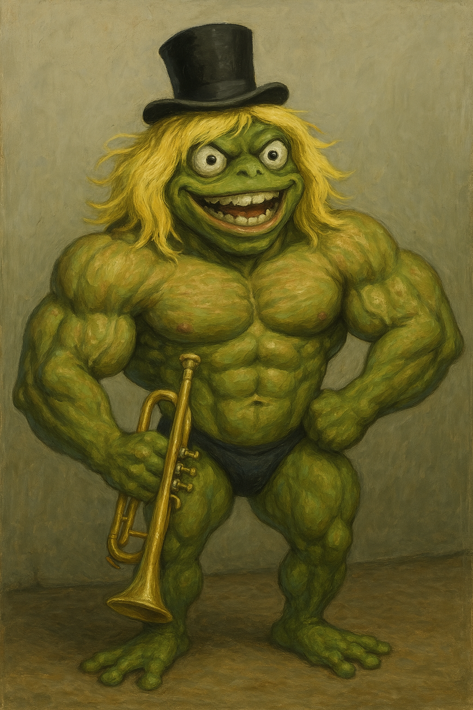
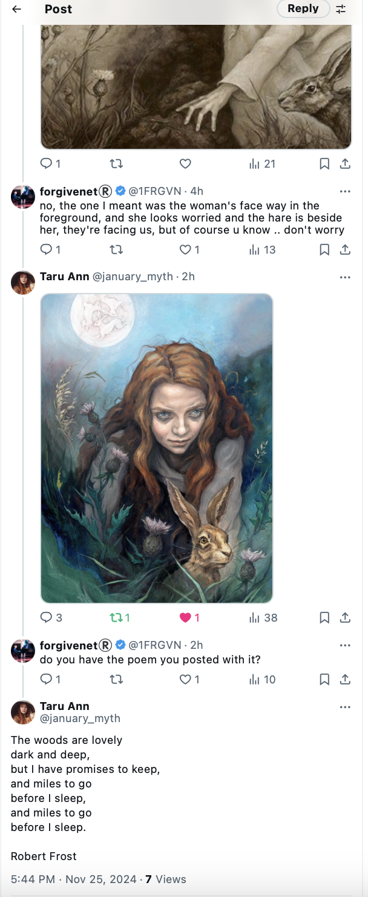

# June 2023

## Twitter/X

- Communication with the trumpet teacher continues.
- The `@jctot19` account posts tweets suggesting he is coming over, that we will go out, that he will ask me out, that he really likes me; wanting to know if he will get English ham or Spanish jamon for his dinner.
- I tweet irreverence back, and it is quite amusing at times.
- It feels like a relationship somehow.
- Most of the posts I saw over this time are now deleted.
- Is this how they administered [Stockholm syndrome](https://en.wikipedia.org/wiki/Stockholm_syndrome) so that I would feel loyalty towards a man engaged in serious criminal-gang activity against me?
- Is this how they manipulated me into making constant excuses for his behavior in my mind?
- Did they even have to bother given the police literally don't care about the safety of women and children at public learning establishments in Spain?
- Perhaps terrorizing women and girls in this cowardly way is how they gain respect for themselves as men in a deeply misogynist culture?
- They certainly got a lot more than they bargained for with me.

## Love

- I was so high on this feeling of being in love, it felt real to me.

!!! tip "Retrospectively"
    - It still feels real at the time of writing; April 2025. 
    - I cannot explain this, and I've always been aware of the trick to some extent, awareness still expanding.
    - Ironically, I feel very grounded at the same time. It's strange and inexplicable.
    - From the very beginning, I have been giving all of it to God to use for His purposes, which seem to be rather good, at least from my perspective.

- How else could I explain how I was feeling all the time? It was 24 hours a day.
- I thought continuously about this man, and I felt extremely sexually aroused all the time.
- I was even super-high and aroused in other classes at the conservatory amongst the children; like choir for example.
- I can't imagine what people must have been thinking; more likely they knew exactly what was going on.
- I was feeling something I had never felt before in my life. It was really powerful. 
- I had no idea I was being drugged. None.

!!! danger "How did they drug me?"
    - Aside from having access to my apartment's water and air vents, I believe I was drugged while at the conservatory and during classes. This certainly happened on the [28 January 2023](january.md#serious-poisoning-at-chamber-music-class).
    - I also suspect that the drugging could have happened as I entered the conservatory too.
    - There always seemed to be a large group of older kids, and teachers, in reception or on the stairs with me whenever I came into class.
    - Someone could easily have added powder to my neck skin, or close to my ear, at those moments.

- I didn't understand why the trumpet teacher wasn't talking to me directly but I was prepared to excuse it because of the feelings.

## Penultimate chamber music class

- The second-to-last chamber music class is on 5th June.
- Pablo does not attend; only myself and the trumpet teacher turn up.
- The trumpet teacher looks like he has been taking testosterone and exercising. He's much bigger than he was at the end of November and even his face looks muscular.

- I wonder if he is pumping iron with Domingo and the Dénia testosterone (woman-hating) addicts.
- I bring a couple of tunes to play, Creep and Back to Black.
- Creep is for Domingo.
- Back to Black is for the trumpet teacher with regards to Ana his (apparent) girlfriend.
- These are tunes recommended to me, I believe, by Mary at Lourdes.
- We play them, and the trumpet teacher can't look me in the eye. He looks guilty.
- He asks me quietly why I didn't bring them before.
- I'm aware everything is a big joke, and I'm the butt of the joke, but I'm unaware of the extent of the conspiracy and how it has my total destruction as its end goal. 
- I mistakenly believe that only Domingo and his close associates are scheming against me; and it was so ridiculous and immature that on a day-to-day level I really didn't care.
- Moreover, the overwhelming sexual feelings I'm having, and some of the things the trumpet teacher says, seem to suggest he doesn't really want to be involved in this nonsense.
- The Ana relationship is obviously a lie; the conservatory's total dedication and commitment to it was so contrived. 
- Ana had grinned at me on the stairs like I was an idiot, and I just thought they were all so ridiculous and easily ignored.
- None of these childish games really bothered me, and I'm certain they would have bothered me *not at all* if I wasn't being drugged.
- However, on top of the constant childishness, everything that was happening was extremely intense and confusing. I couldn't keep anything straight in my mind.
- Nevertheless, I'm clear that something horrible is going to happen at the last chamber music class of the school year, on the 12th.
- I tweet about my feelings as the day approaches: https://x.com/1FRGVN/status/1665611717223612416.

!!! tip "Was I being primed and groomed online for that day?"
    - A "setting up of events I should be worried about" was an ongoing theme with the cyber-stalkers from the conservatory, particularly in [August 2023](august.md#going-public-on-twitter) when I was so frightened I went public on Twitter, and then again in [March 2024](../2024/march.md#a-serious-attack-on-my-wellbeing-from-piano-teachers-at-denia-conservatory) when I became afraid for my life and left my piano studies, and then again in [April 2024](../2024/april.md#lawyer) when I became certain I was going to be arrested.
    - Is the original childishness an intended and sinister part of the murderous plots?
    - Will an avalanche of victims corroborate my story with their own horrible experiences at the hands of teachers and staff of the Generalitat Valenciana's conservatory system for music and dance?

## Last harmony class

- The class sits the harmony written exam together.
- I am feeling extremely high, anxious, euphoric, and consequently quite confused.
- There's a lot going on I'm not fully aware of; the constant online stalking, gang stalking at the conservatory, drugging at home and in class.
- Work has become enormously stressful too and it's difficult to get anything clear in my mind.
- The two boys that attend the class are teasing me. 
- One of them, gypsy Andre, refers to me to the others, and then mentions something that's going to happen to me the following week and how excited everyone is about it.
- He then starts to laugh uproariously with delight.
- Andre looks like he could be related to the trumpet teacher; most certainly behaviorally they are a perfect match. 
- He could very well be his son they're so alike. He could certainly be [Sara's](../2022/september.md#harmony) brother; remember the girl with the strange surname who didn't return to study in the 4th year?
- I notice all these things but I'm not able to deal with them or respond to anyone.
- I'm feeling constantly euphoric and it's difficult to speak.

## June 9th piano concert

- The end of year piano concert takes place at the boat club venue in Dénia.
- A huge crowd of parents and children comes to listen to piano students of all levels and all ages.
- All the [piano teachers](https://portal.edu.gva.es/conservatoridenia/es/departaments-es/#dep-inst-tecla) attend.
- I play Philip Glass etude no 2: https://www.youtube.com/watch?v=850kyfwmRcM.
- Before the concert begins, and as we were all preparing, and just as I was a few bars into rehearsing my piece, Domingo shouts **"Again?"** in an accusatory tone, very very loudly.
- The whole auditorium hears him.
- I wonder what he means. Does he mean another ridiculous *apparent* romantic tryst for me at the conservatory like in [2014](../early-years/2014.md#first-piano-class-at-the-end-end-of-september)? Or something more sinister, perhaps, like a replay of the child sexual abuse events from 1989?
- As I am returning to my seat after rehearsing, another one of the piano teachers, a woman teacher who looks like her other job is porn-star, asks me **"Are you alright"?**
- I have no idea why she is asking me this.
- You may remember this happened before when Ana Girbes asked me, incongruously, "Are you alright?" just before the [chamber music concert](may.md#chamber-music-concert), and more recently online stalkers repeated it during the relentless online terror. 
- These words and phrases came directly from my [police statement of 2015](../early-years/2015.md#statement-to-the-metropolitan-police).
- The only way they could only have known about these specifics was if the Metropolitan police had given my statement to the teachers and staff at the conservatory, or if my apartment was hacked in 2014-2016 and Domingo Cano had access to my activity.
- Domingo must have instructed the woman to say this to me.
- Interestingly, given that no-one was permitted to communicate with me at all outside of regular classes while I was being targeted, the only time anyone ever said anything to me turned out to be *significant* like this.
- One of Domingo's students, Adriana, she is 14 or 15, runs over to him in a subservient and affected way. I believe he has requested her to do this too. I'm sure I'm not the only one cringing.
- Nevertheless, aside from the sexual terrorism, playing in this concert is an immense joy for me and exuberant doesn't come close to how I feel about the experience. I tweet about this later: https://x.com/1FRGVN/status/1667242652163514406:

- I'm so happy when all the piano students are photographed at the end of the concert; I am grinning from ear to ear. 
- However, I notice that all the piano teachers; Paqui, Joan Carles, Domingo, etc, are looking very unhappy, angry even, no smiles at all. 

- Underlying my delight is the continuing intense stress from the constant gang stalking by teachers and staff at the conservatory, which I know is ramping up to something really horrid I can expect on Monday 12th June at the final chamber music class.
- The recording of my performance at the June 9th concert, and the photos, were never shared with me as they usually are with students.

## Work stress

- Work is becoming extremely stressful and I'm not able to handle some of the emotionally challenging things that are going on there.
- I'm doing my best to do a good job but I feel like the *important men* are trying to make me look incompetent and get me to leave.
- I am managing one other writer on the team whose level of English is pre-school. He doesn't know where to put full stops and capital letters.
- He was hired by someone who didn't know the job and he had been hacking away at the content for nearly a year.
- I redirect him into things he can do which I don't have time for, things he's really good at like web development - although sometimes, he admits, he gets someone else to help him.
- They fire him at the beginning of the month and I'm on my own.
- It starts to feel like the usual *woman-in-tech* scenario. You show competence and know-how and one of the insecure men takes great offense and starts a campaign of terror against you.
- Quite often, women-in-tech end up pretending to be not as competent as they are to avoid this, and obviously are targeted at that time for being incompetent.
- Tech is a game that women cannot win.
- We work side-by-side with violent men, and the predominantly decent men we work with usually do nothing to help or support us.
- In this specific case, I had corrected some published instructions which we were getting a lot of complaints about.
- The original author, a very insecure male, took great exception to this and tried to hack into my laptop directly with my permission, which I did not give him. He was very aggressive.
- Eventually, we worked through the examples together and he had to agree there was a problem he hadn't noticed.
- Nevertheless, these sorts of situations are death knells to women's careers in tech, and I was targeted by management from that moment onwards.
- The stress of being bullied and sexually groomed relentlessly at the conservatory and online, and the feelings of being high and anxious from drugging, made me unable to deal with any of this effectively.
- I start thinking about resigning; for the second time in less than 6 months.
- Was getting me fired, or getting me to leave my job, part of the conspiracy so that I would be fully isolated from any possible avenue of help when the conservatory classes were over for the school-year and the porn gangs could begin their campaign of terror in earnest?

## Sunday 11th June

- I often go to the beach on Sundays.
- As I'm walking down to the beach that afternoon, the trumpet teacher is driving towards me in a beat up, grey, Peugeot 205.
- He sees me and takes a sharp, wheel-squealing turn into a no entry road. It's rather amusing.
- It reminds me of the Truman Show and I feel like Truman: https://x.com/1FRGVN/status/1667925200292159490.

- I feel like he's on his way back home to Valencia after a meeting with the conservatory teachers who are plotting against me and carefully planning Monday evening's attack.
- I guess he has been scheming with Domingo, Ana, Nacho and the others; and he doesn't want me to see him.

!!! info "Actually"
    - I'm pretty sure he wanted me to see him. I'm just not sure why.
    - Warning maybe? I didn't need one.
    - The next point maybe explains it. A sighting of the honey-trap victim's focus of desire is integral to the deception. That coupled with mind-altering substances and the victim is locked in.

- At the beach my mind is racing, I feel like he's going to pop up at any moment. It's extremely stressful. I'm 100% sure I was being drugged at this point given the constant looping thoughts and images, plus sexual feelings.
- I know everything is a set up and I'm certain that the chamber music class the following day is planned as the grand finale.

### Fighting talk

- On some level, I knew what was coming, and that it was going to be extremely ugly. I had no idea of exactly *how* ugly at that time and still considered teachers and staff at the conservatory to be overwhelmingly immature and ridiculous. I wasn't to know that the porn industry had successfully infiltrated the Spanish school system and I was experiencing the worst of that.
- Nevertheless, regardless of how much I knew or didn't know, at every level I'm a fighter.
- I'm reminded of my [tensegrity practice from years previous](https://www.castaneda.com/meet-carlos-castaneda), and I'm inspired to post Buckminster Fuller's quote in full about the trim tab: https://x.com/1FRGVN/status/1667785711263596545 and how true integrity, however small, can bring down the largest and vilest energies with very little effort.

- Notice the amount of views I'm getting at this time. This is before I went public in September and views increased even more, and before I signed up for premium in January and I started to get massive view counts.
- In contrast, each of my tweets now, in May 2025, gets on average a maximum of 20 views and I do still have a subscription.

## Monday 12th June 2023

- Today is the last chamber music class of the 3rd year of professional studies at the conservatory of Dénia; and my funeral, apparently.
- I'm prepared for what I'm quite sure is supposed to be enormously humiliating and ridiculous from any sane person's stand point.

### Devastated parents at the church

- I'm extraordinarily tense before class. As I walk around, I decide to take a detour.
- I take a detour and pop into the [chapel on the Carrer Loreto](https://www.google.com/maps/place/Iglesia+Agustinas+Recoletas,+Denia/@38.8404519,0.1035054,19z/data=!4m15!1m8!3m7!1s0x129e1b22919b9785:0xcd3bcc58c432965f!2sC%2F+de+Loreto,+03700+D%C3%A9nia,+Alacant,+Spain!3b1!8m2!3d38.8404519!4d0.1044442!16s%2Fg%2F1w3swvhw!3m5!1s0x129e1b2297b6860d:0xeba2d1d681469aaa!8m2!3d38.8404811!4d0.1039396!16s%2Fg%2F12qf4wb9n?entry=ttu&g_ep=EgoyMDI1MDQzMC4xIKXMDSoASAFQAw%3D%3D) to say hi to Mary and ask for her blessings and guidance.
- The church is empty apart from a couple in their sixties sitting at the front of the church near the altar.
- They have a portrait with them of a young girl.
- They are crying.

- I hum the Salve from the back.

### At the conservatory

- The tension I am feeling is matched by the delighted expectation on everyone's faces.

- I bring the trumpet teacher a present to say thanks, a little wooden frog instrument. He tries to kiss me and I flinch away. I don't want to kiss him, he's hairy and I don't get a good feeling from him.

!!! tip "The lucky frog"
    

    Wee Forg, the lucky world-saving frog will become more and more important to our story as we go along.

- I tell him that the frog is lucky and that he should look after it.
- We play Creep and My Way.
- Before we play My Way, he tells Pablo to make sure he's recording on his phone, and he starts recording on his phone.
- It's ugly. Every note is a sort of attack on me personally.
- The trumpet teacher blows his trumpet extremely loudly in my ear, so that it hurts, and he is marching up and down angrily, blowing his trumpet, and it's all with the intention of humiliating me.
- Gloria comes to the door when we're done and is practically wetting herself with laughter.
- I'm not at all surprised at any of it but it hurts of course.
- I'm quite sure I'm not the one in the wrong, however, and I'm slightly appalled that grown adults are behaving this way, especially given the fact they have guardianship powers over a great many people's children.
- As I leave class, I remind the trumpet teacher that the frog is a lucky frog and to look after it.
- I walk out of the conservatory front door, and teachers and staff throw dirty water (I hope) onto me from an upstairs window (Ana Requena, the violin teacher's classroom actually). Their behavior reminds me of Carrie 1, the Stephen King horror novel.
- I still have the silk t-shirt that they ruined with the stains on it.
- As I walk home, I "bump" into Mercedes who I realize was waiting for me to walk the other way I go sometimes, the way she would have been more familiar with me going, and when she realized I'd gone a different way, she'd had to run. This poor woman in her 70s was totally out of breath and trying to style it out. It was actually rather amusing.
- She was checking my face to see if I was crying. Perhaps she was recording it too.
- I got home and went onto Twitter and tweeted something like "well that was a crappy ending wasn't it".
- Suddenly, a huge number of people start to retweet my post and I discover I'm on a list of around 30 people and they're all laughing and jeering at what's happened.
- I block the list owner and delete all my tweets from the last six months that were related to everything that had been going on at the conservatory
- I'm shocked and alarmed. I had no idea so many people were involved in the deception, and the humiliation, at that time. 
- I was extremely upset by everything that had happened, reeling in fact. They broke me, but I was also so high all the time (anxious, euphoric, sexually aroused, scared again, all on a loop) I could not get my head straight about anything.

!!! info "Related tweets"
    - https://x.com/1FRGVN/status/1670583744283983874

## Tuesday 13th June

- Maria phones me to ask me to go into the conservatory to sign something.
- I believe now that she is checking up on me to see how upset I am and if I'll come in to sign something or not.
- I ask Maria if everyone hates me. She says no, no one hates me. She's lying.
- I go to my acupuncture session and I'm extremely traumatized and shocked about what bullies they all are at the conservatory.
- While I'm on the acupuncture table, there is a violent storm outside, and lightning takes a tree down on the road outside.
- I leave for Ireland, via Alicante airport, that evening and there are rainbows all over the region. I take it as a good sign.

## Teachers and staff involved in gang stalking students at Dénia Conservatory

!!! warning
    - You can find a list of current teachers and staff on the [conservatory website](https://portal.edu.gva.es/conservatoridenia/es/inici/).
    - The Generalitat Valenciana systems are so vulnerable to attack that it is possible that names are incorrect or even false in the GV systems and/or websites.
    - As a taste of things to come, hackers created numerous fake Twitter accounts and sent them to me with pictures of all the conservatory teachers and staff of interest, often in their younger years. 
    
    For example:
    
    An AI mix of the trumpet teacher and Gloria the conservatory receptionist, an account which has been following me since September 2023 when I went public on Twitter.

    {width=35%}

    My piano teacher for year 4, a young Paqui Fornet Pastor in a rather threatening pose. This was posted in March 2024, after what I felt were credible threats to my life when I didn't stop going into practice after the piano concert; the concert which was set up to terrorize me into never coming back to the conservatory.

    {width=35%}
 
    An AI mix containing Domingo the piano teacher posted around March 2024.

    {width=35%}

    A young Maria Hontanilla, posted around March 2024.

    {width=35%}

    The chamber music teacher from year 4, a lovely man, posted no doubt to cause unnecessary trouble as I can't imagine he would have been involved in stalking me, at least not to the murderous extent of many of the other teachers. Posted around March 2024.

    {width=35%}

    Ana the violin teacher in a modeling role for Finnish artist Julia Lohmann. A whole bunch of these pics were sent to me via the trumpet teacher's *apparent* account around June/July 2023 seemingly in order to convince me that Ana and the trumpet teacher were a romantic item.

    

    - [Relevant tweet thread](https://x.com/1FRGVN/status/1846120069010473024).

    A more recent pic of what looks like Alfonso the harmony teacher who had been rather shocked when I informed him I was leaving because I feared for my life.

    

!!! danger "Critical"
    - It is *highly* likely all these accounts are controlled by Hazel and Sandra Smith.

## Ireland

- It's the first TEB course I've taken in person since February 2020 in Cork.
- I'm utterly traumatized from my experience over the last 6 months and especially over the last week.
- I don't bring my connected devices so I cannot use my own Twitter account.
- I create a fake account and start following `@jctot19`.
- I'm angry. 
- I tweet a list of pros and cons about the man.

- The weird "communication" continues between myself and this account, as whoever is running it knows immediately that it is me.
- I have a long WhatsApp chat with Sally where I complain that the man is lazy. I hear about this again and again over the next year or so online.

!!! info
    - What I did not know at this time was that they had full access to my mobile phone anyway so they knew exactly what I was doing online at any given moment.

- I tell Stephen Terrell and some of the other practitioners what's been going on from my perspective at that time, i.e. I had been terrorized by teachers and staff at the conservatory, and they clearly see I'm in a traumatized state.
- The sexual feelings stop completely while I am away.

## YouTube

- In Ireland, I do a search for "Vidal Sastre Sanchez Hornero" on YouTube.
- A number of results come up, one of which is particularly interesting.
- He is a soloist playing at the Banda Sinfónica L'Amistat - Quart de Poblet. There is a young woman behind him who is clearly nervous. Whoever is filming zooms in on him, and her. She constantly looks up at him. I now wonder if she is medicated.

- There is a moment around 1.07 where she looks at another member of the band and makes a face that suggests she finds the trumpet soloist attractive.
- I believe this girl was targeted, just like me, i.e. medicated with aphrodisiacs and cyber-stalked with NLP techniques which made her believe there was a kind of reciprocal relationship going on.
- It would be good to know what happened to her.

!!! info
    - Offline download link: [https://www.youtube.com/watch?v=Td74vBNPrW0](https://drive.google.com/file/d/1AsGYbEVufI1pATGd1y0k4bAZ5Om_2gLg/view?usp=drive_link)

- It may also be interesting to know who some of the other people in the group are, especially one particular woman in glasses on the left which could possibly be Carmen Cano, Domingo's sister, and looks very much like a woman I saw outside my apartment on Friday 1st November 2024.
- It is also interesting to note that they have managed to make a lament sound like a funeral march which, I believe, is intentional.
- At the time I saw this I didn't really understand what I was looking at as nothing made any sense other than Domingo was "getting me back" for not allowing him to control me in 2014.

!!! info "Interestingly"
    - There are many other YouTube videos with him in musical scenarios, some of which I felt concern a girl maybe being targeted.

    

### Who is posting this for me to see?

- It seems to me that this is rather damning content for the trumpet teacher.
- Could he really be posting it himself?
- I wonder who was posting content which appeared to be grassing-up the trumpet teacher?
- And why?
- Had the trumpet teacher been planning to keep me for himself, and betrayed the British and Spanish criminal gangs of Denia in doing so?

## Sunday 18th June Alicante airport

- On my return from Dublin to Alicante, I'm walking towards the arrivals hall and I see the trumpet teacher standing there waiting.
- I can't believe it could be him, I'm horrified actually.
- I pull my hat down over my eyes and rush through.
- I forget about this, thinking I must have made a mistake, because it's so weird. 
- There is no way he could have known about the flight details without having access to my Google account, or a connection to someone who has access to flight databases which is what I thought at the time because I had no idea I was hacked at that time.

!!! warning
    - It seems to me that him meeting me off my flight from Dublin on this evening would have been the beginning of something physically sexual and likely porn-related and criminal.
    - I believe now that I had been sexually groomed online, and drugged, in order that I might easily welcome a sexual relationship with this man on this evening.
    - However, I also surmise that the truth of the set up would have been to get me in a situation where they could produce some gang-rape related porn, similar to what had happened to me when I was a child, and this was going to be monetized around porn networks and paid-for chat groups.
    - I believe they already had an audience ready and waiting for this.

!!! danger "Criminal activity"
    - If I'm right in thinking airports keep CCTV for 5 years, then this will be recorded.
    - There will be footage of him arriving, with his mates, waiting for me, then leaving again when I don't stop.
    - I also suspect it is highly likely that Winston May and his sex offending cohort would have been invited out at this stage, probably to "turn up" at my apartment for the grand finale which I expect would have involved me being gang raped probably to death. There is likely air ticket references and evidence for this.

!!! warning "Mentions of hallucinating"
    - When I mentioned this on Twitter at some point in the future, I use the phrase "I thought I was hallucinating".
    - An account picks up on that word and makes a big deal out of it, suggesting I might be the sort of person who hallucinates.
    - I explain that, in English you can use exaggerated words to explain things like this and no-one will think you're mentally unwell.
    - It reminded me of a time in a piano lesson with Maria where I had used the word "hallucinating" in a similar way.
    - Maria had picked up on it as if I was stating I was mentally unwell and I had to explain to her the same word usage rules of English.
    - I now believe that these instances were seen as opportune moments for suggesting I was mentally unwell or imagining things if I ever went to the police about what was going on.
    - **Or**, the instances in which people got excited over my use of the word "hallucinate" were due to the fact they knew I was being given hallucinogens of some variety without my knowledge.

## Back in Dénia

- I run a block list on his followers and who he's following.
- I'm worried they're after my Twitter account so I take steps to protect it.

!!! warning
    - I've no idea they have had full access via the router probably since I moved in and got connected.

## Monday 19th June

- I quit my job but I don't have another one to go to.
- To everyone's shock and surprise, I go to practice the piano at the conservatory.
- This was not what they intended, and I knew that very well.
- But how dare they treat a student like that! I couldn't believe at that time that such behavior could be considered normal, and protected by the school board, as I understand it is now.
- I'm also stubborn and deeply against injustices of all kinds. 
- Moreover, my child sexual abuse history has made me utterly intolerant of injustices to children and I knew very well that if Domingo and his associates were able to behave in such a way to an adult student, they would most definitely be doing similar to minors.
- I also realized that if I backed down and ran away, the evil would just grow.
- I had no idea that running away was not actually what they really wanted, although from the conservatory studies yes, and perhaps that's what some of the teachers assumed. 
- It's unclear how much and who knew about the mass voyeurism, drugging, and porn connection.
- There is also the important point that hackers will have known how much money I have for a long time, and it is not inconsiderable. I am a target on that basis alone.

!!! tip "Laptop"
    - On one occasion I go into practice, there is a laptop sitting on the desk in the piano room.
    - I realize Domingo can set me up as looking like I stole something from the conservatory so I take a picture of it.

## Last session with the acupuncturist

- I have another acupuncture session with Tao Qi.
- My system is very regulated unlike it's chaotic nearly dead state - especially with regards to my kidneys - at other sessions.
- She does a blood analysis strip and tells me it is highly likely I have diabetes.
- I know she is lying.
- She says I should visit my GP about this.
- I pick up my sarong to put in my bag to take home. She forcefully insists on folding my sarong for me.
- While folding it up, she rolls up a needle into it which I find when I get home.
- I cancel all sessions with her without telling her why.

!!! tip "My suspicions about all this"
    - I believe I would have gone alone to my GP after Tao's concerns, and he would have confirmed a diabetes diagnosis and given me medication for it.
    - Glaucoma is then explainable.

## Rest of June

- I practice every day at the conservatory.
- One morning I am practicing and Domingo opens the door and pokes his head through and looks at me meaningfully, as if to say "I won".
- I feel overwhelmingly sexually aroused a lot at home, and masturbate often, even on the days I don't go to the conservatory.

!!! info "In retrospect"
    - I don't realize I'm being recorded audibly (at least) via my mobile phone. 
    - I find this out when the hackers reveal themselves to me, from August/September 2023 onwards, for example when they repeat parts of conversations I've had back to me in fake Twitter account profiles or random posts I see.
    - I don't realize it is highly likely I'm being filmed with secret cameras in my flat too.

## The beach

- I go to the beach every afternoon.
- I feel like I'm being followed every time.
- One afternoon, I walk up to the area of the beach that has a restaurant and a bar.
- The bar plays Back to Black while two people who look like the trumpet teacher and Ana walk by. It's not them because I saw these two previously sitting on a white scarf on my walk to the end of the beach. The man is blatantly too young also.
- The man opens the scarf to the air above his head, in a similar way that I did [in April](april.md#followed-on-the-beach) another time I was followed on my beach walk.
- This sort of thing goes on continuously, any time I leave the house.
- I can't believe people have nothing better to do with their lives.
- It's all set ups and contrived events designed to terrorize me.
- Another time, I'm coming back home from the beach and walking towards the road. The trumpet teacher and the doctor Joan are in the grey Peugeot I mention [above](#sunday-11th-june). Joan looks at me and the trumpet teacher looks like he's saying "don't look, don't look", and he looks away.
- It is indeed very stressful and I'm still feeling enormously sexually aroused all the time and I cannot think straight.
- I believe the signs and symbols coupled with the promise of a relationship, the overwhelming sexual feelings, and whatever narcotics I'm ingesting create a sort of mental attachment to anything that has any relation to what's been going on.
- I now know these are well-known criminal manipulation techniques usually employed by honey-trappers and pornographers/pimps on vulnerable women.

## Twitter

All the twitter activity is on my `@1frgvn` account at this stage.

- I'm still having the communication via Twitter posts with `@jctot19` who is, apparently, the trumpet teacher.
- This account posts communications that are very clearly intended for me.
- There are posts about Ana, British women, other relevant things.
- There are posts with a woman with hair flying which is a trigger picture that I will see again on the [American fake account](december.md#chat-with-the-american-matthew) from August onwards, the account I ended up having a prolonged DM with at Christmas 2023.
- There are posts with pictures of hanging seaweed, which I end up finding out, much later, is a Julia Lohmann art installation [I mentioned before](../early-years/2015.md) that will be revealed to me in July as something Ana the violin teacher was connected to.

!!! tip "Ana"
    - Ana the violin teacher in a modeling role for Finnish artist Julia Lohmann. 
    - I do wonder if this is correct now as I can't find the connection between the two.
    - There is a Finnish connection with the trumpet teacher and I wonder if there is a connection between him and Julia Lohmann. Was/is she another victim maybe?
    - Either way, Julia Lohmann pics with seaweed were coming up at the same time as pictures of Ana, so I related the two things in the same way I thought [plate lady](july.md#plate-lady-early-in-the-month) was Carmen.
    - A whole bunch of Ana pics were posted for me to see via the trumpet teacher's *apparent* account around June/July 2023 seemingly in order to convince me that Ana and the trumpet teacher were a romantic item.
    - Over the hacking duration, and during the conversations I had with hackers, Ana was talked about a lot, often in an extremely derogatory manner and often with relation to unsavory sexual activity.

    

- It's as if they are teasing, posting things that they hope will upset me.
- Suddenly I'm seeing a lot of porn on my Twitter timeline too.
- A porn video pops up on my timeline which looks like the trumpet teacher and Ana so I look at it. It is extremely violent and he is holding her by the neck and throwing her around the kitchen. It certainly wasn't actually Ana but the woman was of a similar build and look. It may have been the trumpet teacher however, as the man's back was to the camera and he was of the same build.
- https://x.com/1FRGVN/status/1664572450112258049
- On June 12th 2023, an account `@january_myth` posts an extremely significant picture that I see when I get home and after the shock of finding out I have been cyber-stalked so extensively and by so many. At the time of writing, 20 November 2024, I'm unable to find this pic and I wonder if it's deleted. I ask the account owner for it.

- There is no reply.

### Interesting tweets from this period that suggest communication with online groups unknown

After 12th June, I became more conscious I had been stalked online by a large group of people. I believed I had managed to block them but was aware a conversation was starting.

Something I had not yet realized at that time was that every tweet was being read by a bunch of Spanish-speaking people who were translating them. You can see this on analytics. I would only start realizing this was going on when I was in France.

A lot of this is very telling.

- https://x.com/1FRGVN/status/1674499946681102348
- https://x.com/1FRGVN/status/1674508801444048911
- https://x.com/1FRGVN/status/1674175133030686725
- https://x.com/1FRGVN/status/1674020464258174977
- https://x.com/1FRGVN/status/1673979287773298690
- https://x.com/1FRGVN/status/1673232678357803010
- https://x.com/1FRGVN/status/1672905764166402048
- https://x.com/1FRGVN/status/1672536083425312774
- https://x.com/1FRGVN/status/1672531934046552064
- https://x.com/1FRGVN/status/1672518913081368576
- https://x.com/1FRGVN/status/1671791604066136066
- https://x.com/1FRGVN/status/1671431628248297472
- https://x.com/1FRGVN/status/1671381584144891905
- https://x.com/1FRGVN/status/1670583744283983874 -> commentary on 12th June
- https://x.com/1FRGVN/status/1668539402967035905 -> 13th June Love will find a way
- https://x.com/1FRGVN/status/1668534709599494144 -> 13th June Life on Mars
- https://x.com/1FRGVN/status/1668171820179103745 -> 12th June calm before the storm
- https://x.com/1FRGVN/status/1667836859181932548 -> 11th June
- https://x.com/1FRGVN/status/1666071924944846848
- https://x.com/1FRGVN/status/1665430464847331328 -> Ho'oponopono
- https://x.com/1FRGVN/status/1664572450112258049
