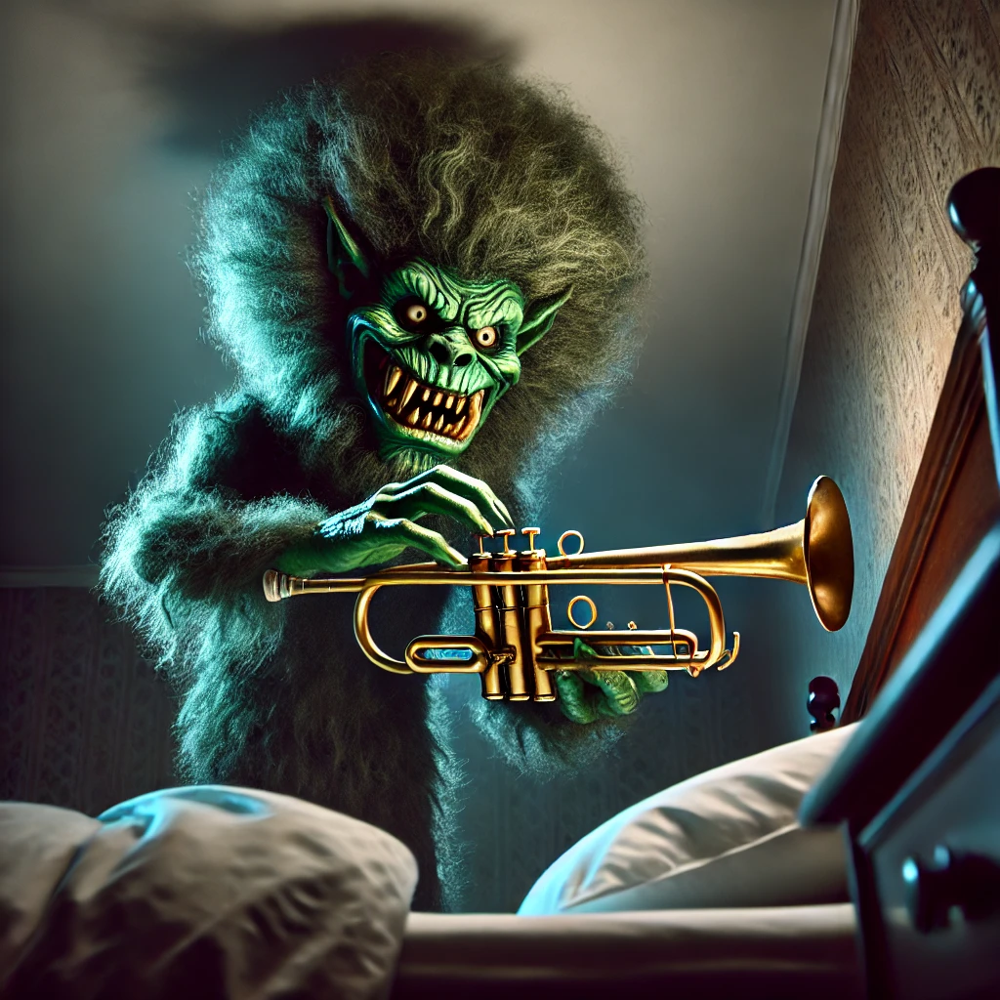
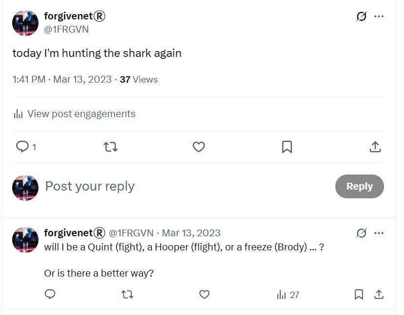
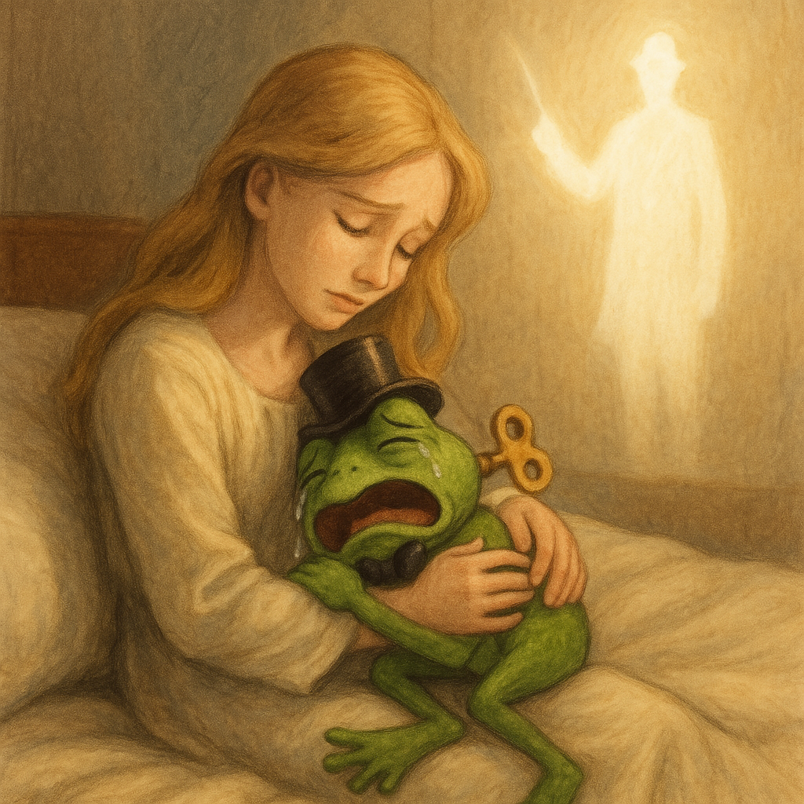
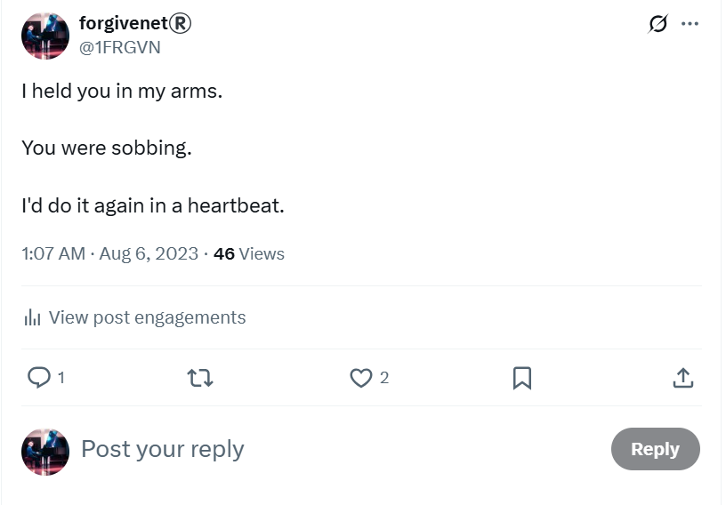
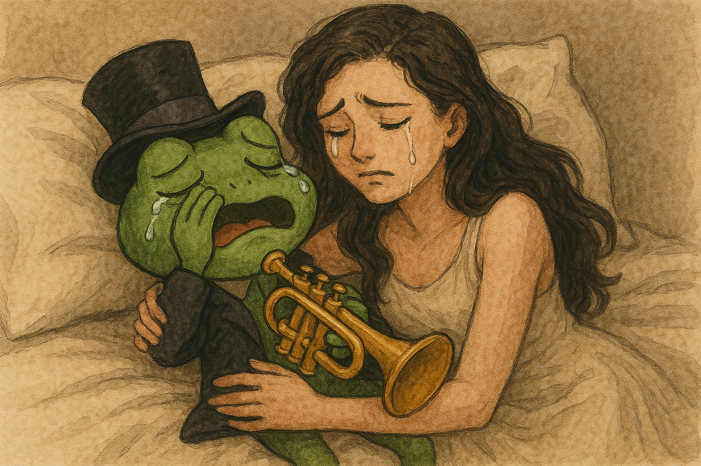
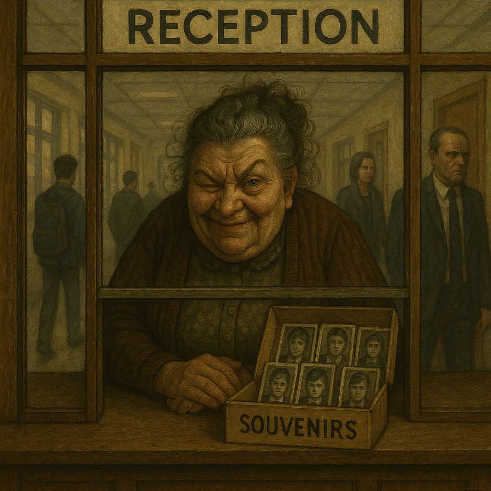

# March 2023

## Chamber music classes continue

- The conspiracy, sexual grooming, gang stalking, and terror continue.
- The trumpet teacher canceled one of the classes on WhatsApp. I cried that he was not coming. It was *extraordinarily* weird. I don't cry as a rule. It takes an awful lot to make me cry. I felt that I must really be in love with this guy!
- I found myself always harboring the expectation that he would be coming home with me after class, and I bought extra food for that purpose. There was no reason at all to think that might happen and, even if it were,  I'm pretty sure I would **not** have been OK with that anyway.
- All of it seemed to be just thoughts. Nothing real or tangible.
- The online romantic honey-trap grooming was really ramping up at this stage. I was being fed NLP/hypnosis suggestions on Twitter and elsewhere, which reinforced the euphoria I experienced in class.
- However, this alone would probably not have been enough to trap me, and so I was constantly fed mood-enhancing substances over the week which can exaggerate a small idea or feeling, and breakdown personal boundaries.
- But even those two things together might not break the strongest of minds, and so it is my view that there was *actual* physical sexual activity happening while I was sedated in my apartment; something which became addictive to me without my conscious awareness; a honeymoon period if you will.

!!! danger "A really, really evil man"
    - If this is true, and myself and the trumpet teacher *were* having a sexual relationship, albeit with me completely sedated, then it could be described as somewhat consensual.

    

- The trick was making me believe that I was in love and that it was reciprocal.
- It worked.
- He may have loved me back. It'd be hard not to.

!!! info "Seduction techniques - a primer"
    
    - NLP grooming techniques can suggest a romantic reciprocity that doesn't exist.
    - Add mood-enhancing substances to the mix and you are 100% controlling a person's thoughts and emotions.
    - I tweeted about this a lot as I reasoned my way out of the sticky mire of evil intentions.

    

    - https://x.com/1FRGVN/status/1860132157890679006 
    - There are many public resources that explain this process in detail.

- It was excruciating however, as intended, and I tweeted my personal reactions, unaware they were being read by everyone.

### Each class on a Monday

- Whenever the trumpet teacher turned up for class, not often, I felt the same lightheadedness and euphoria, my whole body vibrating.
- Moreover, whenever I returned home from class I felt like I had run a marathon, my kidneys ached, and I had to lie down
- I couldn't understand it and told all my therapists about what I was experiencing.
- The feelings were at their most intense on Mondays during and after chamber music class but these feelings, which I put down to being in love, continued every day of the week, even on the days I didn't leave the house.
- I was always extremely anxious about going to class on a Monday and had to take my PTSD remedy beforehand to get calm enough to go. I believe this was because, at a subconscious level, I knew exactly what was going on and it frightened me.

### The trumpet teacher hands me his phone

- I arrive at class one evening. The trumpet teacher is busy on his phone.
- I sit down to wait for class to begin.
- I am light headed and euphoric.
- The trumpet teacher stands up and says, "Katharine, please help me".
- He passes me his phone and asks me something (I can't remember what).
- I take his phone and see he is on `Booking.com` looking for accommodation in France for about 30 or 40 people.
- Before I can figure out what he wants, or what I'm looking at, my classmate Pablo enters the room and the class begins; the conversation about whatever is on his phone is over and the matter is never mentioned again.
- When I remember this strange incident around a year later, I will think the reason for it could be there is some psychoactive substance on his phone that I have absorbed through the screen.

## Dreaming of the trumpet teacher

- It is Tuesday in the wee hours, 3am, after a Monday class with the trumpet teacher.
- I dream the trumpet teacher is sobbing uncontrollably, and I hold him in my arms.
- I tell him everything is going to be OK.
- We are in my bed.

- The following morning I cannot get the man out of my head, it is excruciating.
- I believe I am in love with this man, and that he loves me back.
- I have never felt anything so powerful and wonderful in all my life.
- But something is very, very wrong.
- I wake up and sit with my head in my hands.
- My thoughts are like a hurricane.
- I tweet about this in August 2023, when hackers start to reveal themselves to me and communication begins in earnest.

### A loud voice

- As I'm sitting at the end of my bed, distressed, I hear a loud voice say: "He is not for you."
- I have no idea where this voice comes from.
- I do not believe this voice.

!!! tip "Suggestions through the walls"
    - I'm wondering if sometimes the neighbors who were involved in the conspiracy, probably the upstairs ones, were able to speak directly to me through the walls of my apartment (given the walls were so thin and you can hear everything).
    - If I was being drugged and in a very confused state, a statement like "He is not for you" might appear to be coming from my own mind.
    - It was an alien thought.
    - Another option is that it could have come from my phone which was on the bedside table.
    - The question is, why would the criminals want me to think that he was not for me on top of wanting me to believe there is a relationship?
    - Is it because there were so many other men they were filming me with, they needed me to be unsure of everything I was thinking and feeling?
    - Do they do the sobbing trick to all the girls?
    - Or was the poor fellow unable to help himself, and he fell in love with me back?
    - Maybe he had fallen in love first, maybe years before, and briefly, in that moment, he became aware of the enormity of his mistakes?

    

#### Valentine

- When I look back at this strange event, it was as if I was holding St Valentine himself in my arms as he sobbed his eyes out.

- Interestingly enough, if one was having a relationship with an actual saint, I suspect it might feel at least as intense as I felt it.
- Moreover, if Saint Valentine did find himself held in my arms in the most repellant situation imaginable, my view is he would sob his eyes out, and has probably been doing just that for centuries.
- Poor old Valentine. Maybe his image is safer now.

### A simple wooden box on the sofa

- I dream or vision a solid but simple wooden coffin-shaped box lying on the sofa in my sitting room.
- I see it all the time.
- It's a large box, big enough for a reasonably large man.
- I imagine it means that we will be married and I will bury him.
- Although I wonder now if I was completely off about that and, instead, it was in relation to the previous target who may have lived in the apartment, and died.
- And of course, it may have been a warning to me personally about the intentions of the people pretending to have normal roles in my life.

## Gloria winks conspiratorially

- Whenever I leave the chamber music class to go home on a Monday night, Gloria is at reception.
- Not one to turn a blind eye, she grins and winks at me in a conspiratorial manner.
- She obviously knows everything that's going on.
- She will probably have a list of all the victims, maybe some souvenirs too.

## Spanish registration for my car

- I register my car in Spain.
- I do this with a management service.
- When my license plate arrives, it is 7578 MDK.
- [Murder Death Kill](https://en.wikipedia.org/wiki/MDK) is a cult computer game, famous from 1981-1997.
- Could the criminal gangs of old men, with their numerous official contacts and powers of corruption have organized that too?

## Piano classes

- I'm reminded of the song Misty, I used to play it at university.
- It's from the film about a stalker, Play Misty for Me.

<iframe width="1280" height="720" src="https://www.youtube.com/embed/P_tAU3GM9XI" title="Erroll Garner plays Misty" frameborder="0" allow="accelerometer; autoplay; clipboard-write; encrypted-media; gyroscope; picture-in-picture; web-share" referrerpolicy="strict-origin-when-cross-origin" allowfullscreen></iframe>

!!! quote
    Erroll Garner was inspired to write "Misty" on a flight from San Francisco to Chicago which passed through a thunderstorm: as the plane descended into O'Hare, Garner (was thinking about his wife) and he looked through the window to see a rainbow glowing through a haze and (the word Misty and the tune popped into his head). Erroll was moved to begin composing "Misty" on the spot.
    
    - [https://en.wikipedia.org/wiki/Misty_(song)](https://en.wikipedia.org/wiki/Misty_(song))
    - https://www.steynonline.com/11411/misty

- I'm playing it one day at class with Maria, who was busy with something else as usual.
- She reads the marks out for me for the term. She tells me the marks the trumpet teacher has given me and that he has left me a little comment saying something like I'm very motivated. Looking back, I realize his comment is extremely telling with regards to what's actually going on for me.
- I expect the Generalitat will have deleted all the system records now.
- I tell her I feel like I'm on fire. She tells me I'm in love with him.
- She calls him Charlot; the name the Spanish use for Charlie Chaplin.

## Choir rehearsal at the boat club

- At the end of term we have a choir rehearsal at the boat club in Dénia.
- Concha is the choir master. Paqui Fornet is there filming and that's apparently the reason for the extra rehearsal. 
- It's all a bit contrived and time-wasting.
- Paqui Fornet's husband is there too. He sits scowling and glaring at everyone. I feel him looking at me.
- He looks extremely angry.
- It's weird.

!!! tip "Show and tell"
    - I now believe Paqui created this situation in order that he might see me, the target.

## Work stress

- Work is becoming extremely stressful and I'm unable to handle normal situations.
- I believe most of this stress was manipulated online by Dénia hackers and cyber-stalkers, and exacerbated by poisons and drugging.
- I quit my job with an amazing crypto company based in New York, Digital Asset, but I have another one lined up to go to immediately at zkSync.
- A headhunter had reached out to me on LinkedIn at a moment I was feeling extraordinarily unhappy at DA.
- The person I spoke to online about the role worked as an engineer at zkSync, but ended up not existing. 
- I never saw him in any meetings, including the all hands.
- I did an extensive search for the person in the company data and found no reference.
- I even asked my Spanish colleague who he was, and he didn't know him.
- Then suddenly there was a reference to him on Slack, so I left it.
- All the fake accounts stalking my professional life are in my LinkedIn account which will need to be subpoenaed as they banned me for life on someone at Polygon's request after [they fired me in October 2024, a few days before the porn-gangs tried to murder me at home](../2024/october.md#serious-poisoning-with-intent-to-harm-or-kill).
- In retrospect, Digital Asset was probably a safe space and I should have continued with them.
- They offered me a month's stay in New York to learn their programming language but I declined due to my conservatory studies - which was insane!
- I believe all my decisions were being controlled by online manipulation and emotional triggering coupled with drugging.
- I start my new role at zkSync.
- Looking back, I'm certain some of the men at zkSync were aware of the [porn fatwa against me](../early-years/2003.md#porn-fatwa); perhaps not the full story or they might have taken pause.
- My role at zkSync was another fabulous job which turns sour the minute you walk through the door, really sour.
- The men at zkSync build up the stress and tension, in-step with teachers and staff at the porn-school conservatory of Dénia, to extraordinary levels on the run up to [12th June 2023](../2023/june.md#monday-12th-june-2023), my "funeral".
- The week before the 12th June, the CTO, a British man living in California who knew Elon Musk closely from having worked with him at Tesla, pings me a gun emoji the day before a *firing day*.
- I believe this ramping up of stress and tension was an integral part of the conspiracy, and likely aired on criminal-porn channels.
- I expect many were itching to monitor my transition from female-tech-colleague-you-hate into a full time porn star from 12th June (no payment obviously); an abused, maimed, and extremely poor woman; eventually murdered for the worst sort of porn-addict subscriptions.
- Make no mistake, that was the plan; that's how it always has been for thousands of women like me in Dénia.

### One of my colleagues at zkSync calls me every Monday after chamber music class

- One of the Ukrainian staff at zkSync, someone who is apparently of no fixed abode and moving from place to place while working for the company since the war began, takes a special interest in me.
- He calls me frequently, and we chat about work, but about nothing particularly essential.
- He really has no need to call me.
- My job is a joke to the engineers anyway, so any excessive interest is always a red flag.
- The most dubious thing about these calls were that they always followed a chamber music class on a Monday evening.
- Was he watching the switcheroo porn specials live from the conservatory and back at my home?
- Was he curious about how a human being responds consciously after a sedated-rape event in their own home?
- Or was he trying to become an integral part of the romance-and-sex manipulation trigger by checking in with me in person at these key moments?
