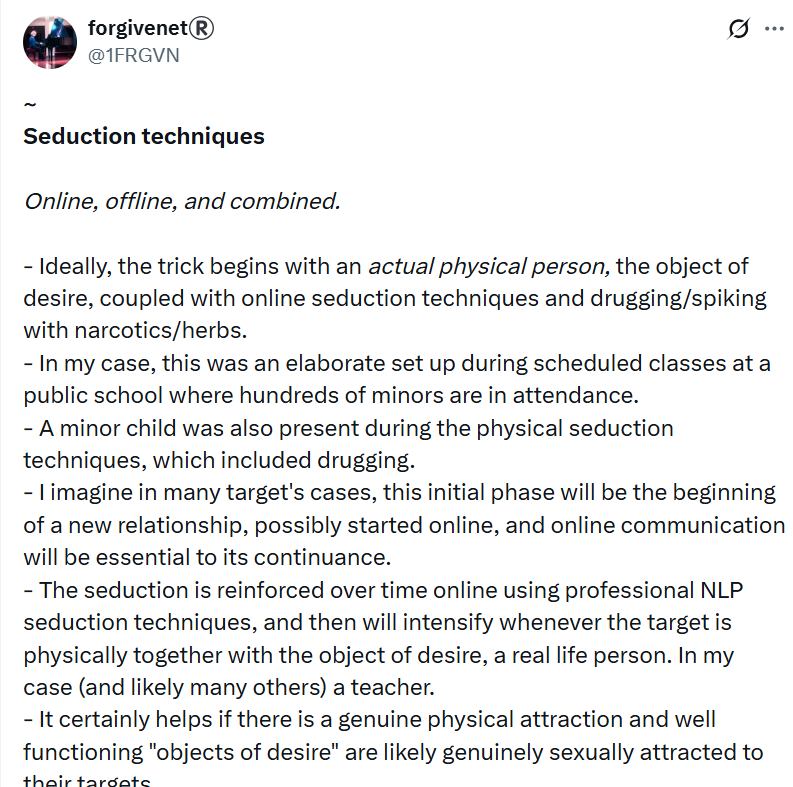

# March 2023

## Chamber music classes continue

- The conspiracy, sexual grooming, gang stalking, and terror continue.
- The trumpet teacher canceled one of the classes on WhatsApp. I cried that he was not coming. It was *extraordinarily* weird. I don't cry as a rule. It takes an awful lot to make me cry. I felt that I must really be in love with this guy!
- I found myself always harboring the expectation that he would be coming home with me after class, and I bought extra food for that purpose. There was no reason at all to think that might happen and, even if it were,  I'm pretty sure I would **not** have been OK with that anyway.
- All of it seemed to be just thoughts. Nothing real or tangible.
- The online romantic honey-trap grooming was really ramping up at this stage. I was being fed NLP/hypnosis suggestions on Twitter and elsewhere, which reinforced the euphoria I experienced in class.
- However, this alone would probably not have been enough to trap me, and so I was constantly fed mood-enhancing substances over the week which can exaggerate a small idea or feeling, and breakdown personal boundaries.
- But even those two things together might not break the strongest of minds, and so it is my view that there was *actual* physical sexual activity happening while I was sedated in my apartment; something which became addictive to me without my conscious awareness; a honeymoon period if you will.

!!! danger "A really, really evil man"
    - If this is true, and myself and the trumpet teacher *were* having a sexual relationship, albeit with me completely sedated, then it could be described as somewhat consensual.
    - Was this activity *out-of-scope* for the trumpet teacher's gang? Was this how he cheated the British gangs, and the reason why everyone got so angry with each other, and started careening around chaotically in the shared-mind arena, and start grassing each other and themselves up so marvelously?

- The trick was making me believe that I was in love and that it was reciprocal.
- It worked.
- He may have loved me back. It'd be hard not to.

!!! info "Seduction techniques - a primer"
    
    - NLP grooming techniques can suggest a romantic reciprocity that doesn't exist.
    - Add mood-enhancing substances to the mix and you are 100% controlling a person's thoughts and emotions.
    - I tweeted about this a lot as I reasoned my way out of the sticky mire of evil intentions.

    

    - https://x.com/1FRGVN/status/1860132157890679006 
    - There are many public resources that explain this process in detail.

### Each class on a Monday

- Whenever the trumpet teacher turned up for class, not often, I felt the same lightheadedness and euphoria, my whole body vibrating.
- Moreover, whenever I returned home from class I felt like I had run a marathon, my kidneys ached, and I had to lie down
- I couldn't understand this at all.
- It was never as intense as on Mondays during and after class but the lightheadedness, which I put down to being in love, continued every day of the week, even on the days when I never left the house.
- I was always extremely anxious about going to class on a Monday and had to take my PTSD remedy beforehand to get calm enough to go. I believe this was because at some level I knew what was going on and it frightened me.

## Dreaming of the trumpet teacher

- It is Tuesday in the wee hours, 3am, after a Monday class with the trumpet teacher.
- I dream the trumpet teacher is sobbing uncontrollably, and I hold him in my arms.
- We are in my bed.

- I cannot get the man out of my head, it is excruciating.
- I believe I am in love with this man, and that he loves me back.
- I wake up and sit with my hands in my head. My thoughts are like a hurricane.

### A loud voice

- As I'm sitting at the end of my bed, distressed, I hear a loud voice say: "He is not for you."
- I have no idea where this voice comes from.
- I don't believe this voice.

!!! tip "Suggestions through the walls"
    - I'm wondering if sometimes the neighbors who were involved in the conspiracy, probably the upstairs ones, were able to speak directly to me through the walls of my apartment (given the walls were so thin and you can hear everything).
    - If I was being drugged and in a very confused state, a statement like "He is not for you" might appear to be coming from my own mind.
    - It was an alien thought.
    - The question is, why would the criminals want me to think that he was not for me on top of wanting me to believe there is a relationship?
    - Is it because there were so many other men they were filming me with, they needed me to be unsure of everything I was thinking and feeling?
    - Do they do the sobbing trick to all the girls?

    

## Leaving class

- Whenever I left the chamber music class to go home on a Monday night, Gloria would be there at reception.
- She would grin and wink at me in a conspiratorial manner.

## Piano classes

- I'm reminded of the song Misty, I used to play it at university.
- It's from the film about a stalker, Play Misty for Me.
- I'm playing it one day at class with Maria who was busy with something else, as usual.
- She reads the marks out for me for the term, telling me the marks the trumpet teacher has given me.
- I tell her I feel like I'm on fire. She tells me I'm in love with him.
- She calls him Charlot, which is what the Spanish call Charlie Chaplin.

## Choir rehearsal at the boat club

- At the end of term we have a choir rehearsal at the boat club in Dénia.
- Paqui's husband is there, scowling and glaring at everyone.
- He looks extremely angry.
- It's weird.

!!! tip
    - I now believe Paqui brought him in to see me.

## Work stress

- Work is becoming extremely stressful and I'm not able to handle the things that are going on there.
- I quit my job but I have another one lined up to go to immediately.
