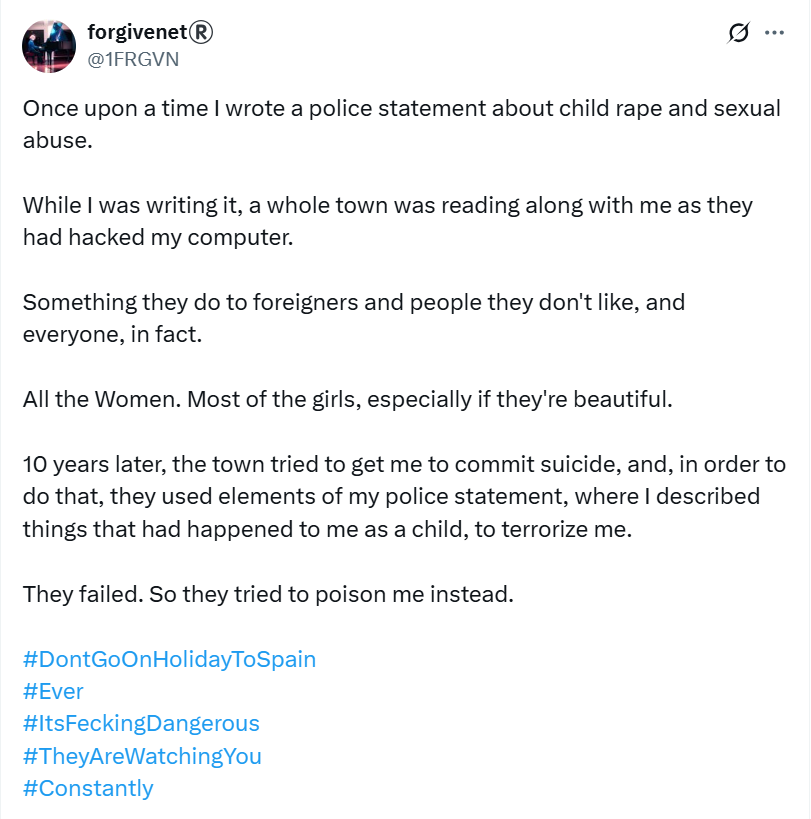
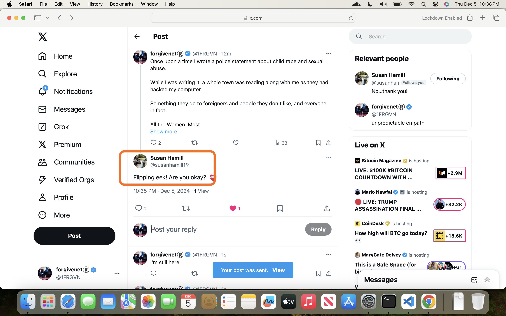
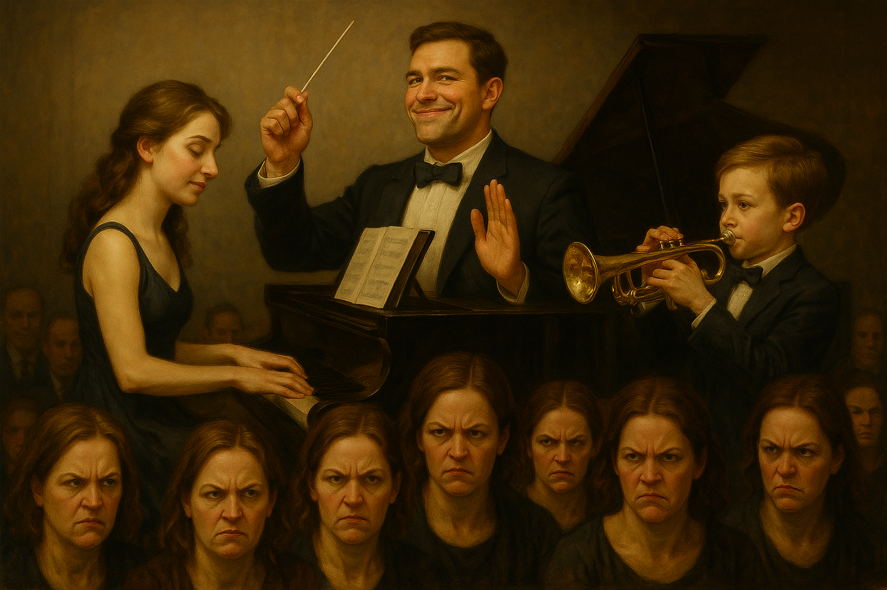
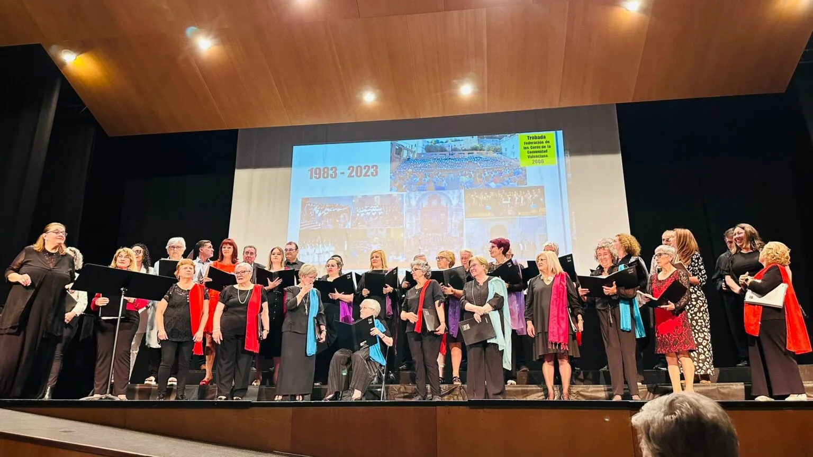
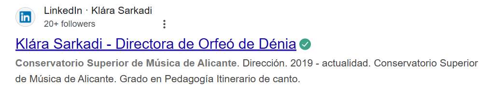
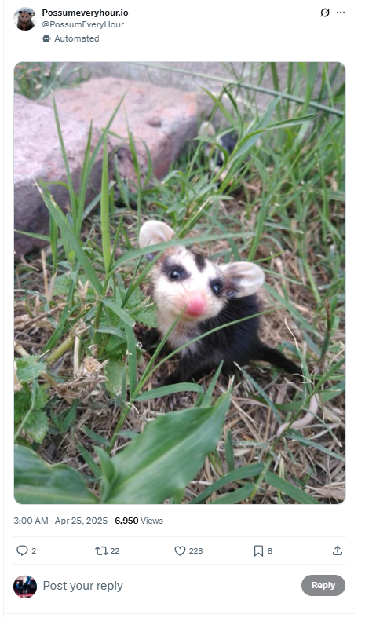
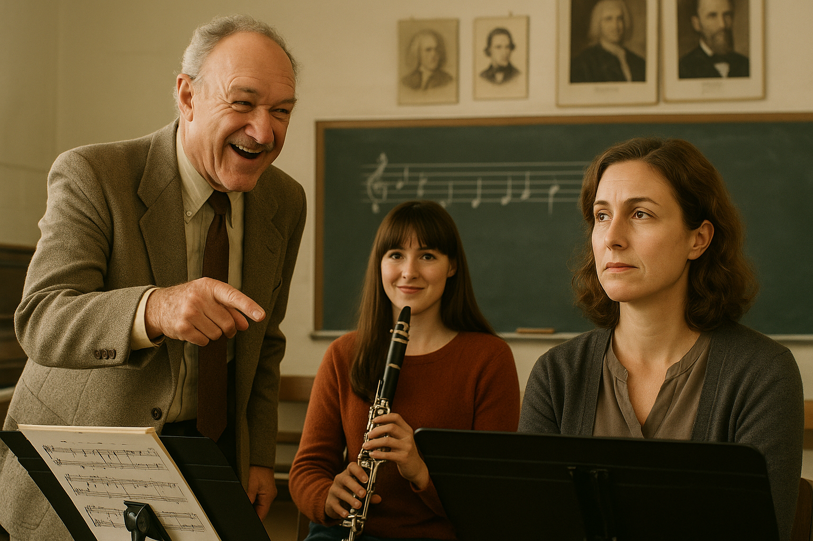
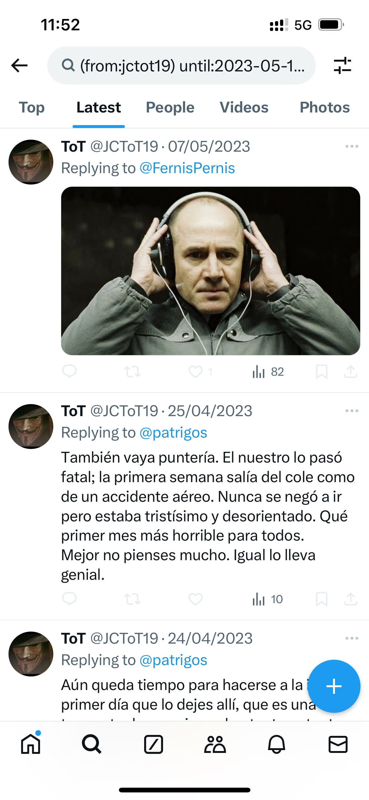

## Acupuncture with Thao Qi

- The [acupuncturist](https://www.thaoqi.com/) I spoke to in [February](february.md#mental-state-and-health-concerns), when I became extremely concerned about my health, is back in Dénia.
- We arrange sessions to start this month.
- When I visit, she is surprised at the poor state of my pulses, especially my kidneys and tells me my right kidney is practically dead.
- I explain that I've had some recent stresses, and my abuse history, and to expect my pulses to be weak due to this.
- I don't trust her. Something's not right.
- She only takes cash.
- When I tell her I work in crypto, she grins that grin.
- In one session, I have a 20 euro note in my phone jacket. It is not there when I look for it later.
- When I'm on the table, I have the sensation she takes my bag out of the room and photographs my bank cards.
- I do not bring my bag or wallet to sessions again.
- She gives me a pad and instructs me to take it home and write down my feelings on it. I don't.
- She insists I bring the pad back.
- I say things that make her surprised at my intuition and awareness.
- I tell her I believe I'm going to have a boyfriend soon.

### Thao at the beach

- On one of my Sunday walks this month, I see Thao at the beach sitting in the spot I usually stop at.
- It feels contrived, a set up, so I ignore her and walk home instead.
- I never see her at the beach again.

## Chamber music concert

- A small concert is arranged. 
- We will play [Misty](march.md#piano-classes) and another rehearsal tune.
- The thought of everyone coming to a concert where myself and the trumpet teacher are in the same room, and with everything that's happened so far; the constant bullying, my feelings for him, how my whole body vibrates whenever I'm with him, the whole conservatory knowing something of my child sexual abuse history, because he told them, and him not speaking to me about any of it. It's all too much. 
- I'm clear with the trumpet teacher that I do not want to do it, but I have to agree because it is a requirement of the course.
- It feels like a set up; a trap. I'm right about this with no details.
- The concert is originally arranged for the [Casa de Cultura](https://www.denia.com/casa-de-cultura/) in the town.
- After my groans of complaint, the venue somehow changes and the concert will take place at the conservatory instead. 
- Myself and Pablo, and the autistic girl and her guitarist partner turn up to play.
- I am, as usual, euphoric, anxious, and high.
- We wait in the trumpet teaching room while he goes out (and conspires with the other teachers).
- When it's time to set up, we all walk around to the concert room 5 at the conservatory.
- Ana Girbes is standing outside her room which is on the way.
- As I pass her, she asks me loudly, "Are you alright?". 
- It's incongruous.
- I have no idea why she would ask me this.

!!! danger "Teachers repeat phrases from my police statement"
    - Someone told Ana to say this to me as I walked past her, and she did as she was told.
    - This came directly from my [statement to the police in 2015](../early-years/2015.md#statement-to-the-metropolitan-police) in which I detailed clear memories from that time, including things people had said to me.
    - This phrase, specifically, was something an old school friend had said to me when I was in a traumatized freeze state after smoking pot. 
    - I didn't know my police statement was being read by the original British porn and prostitution gangs themselves, and their Spanish counterparts in Dénia, and that a repeat of everything that had happened to me when I was 16 was being organized and choreographed for 2023.
    - On the run up to the 12th June 2023, when I was supposed to have been so terrorized I would leave my studies at the conservatory and never come back, these triggering events became more frequent.
    - We can only guess at what was originally intended for me beyond 12th June 2023.
    - Whatever it was, my actions ensured it didn't happen, and teachers and staff at the conservatory had to double down and continue terrorizing me on into the following study year.

!!! danger "Further confirmation in December 2024?"
    - Just after posting this update: commit no: [2370a8d](https://github.com/kailash-manasarovar/statement/commit/2370a8dc918f1d6d6a7b6ce3c9c3765965e03275), I feel like tweeting it so I do: https://x.com/1FRGVN/status/1864692459860893752

    

    - A few moments later: 

    

- As we are setting up the concert, Ana Requena comes in again with her instrument, this time dressed up like she's going out; same old contrived weirdness.
- The trumpet teacher flirts with me outrageously in public. I flirt back. It's quite amusing.
- I remember I have cause to say, after he asks me about my surname, and just after Ana has been in, that "Katharine is sufficient," and he giggles. He primes this, of course.
- At one stage, our eyes lock, and there is a powerful and undeniably reciprocal sexual attraction which is rather overwhelming to both of us.
- The trumpet teacher heads to the back of the room, with his back to us, humming gently, for about 5 minutes, to collect himself.
- I sit as far away from him as possible in the room. I don't look at him, and he gives me a wide birth too.
- The sexual arousal I have for this man is overpowering.
- I tweet about this later on, and other key evidence as I tell my story on X: https://x.com/1FRGVN/status/1759770318409695275. 
- Eventually the concert begins and is successful, although I hear the trumpet teacher instructing Pablo to mess up on the Misty tune.

- It's interesting to see how much of the conspiracy I had figured out by February 2024 when I posted this, it wasn't much. I still hadn't realized I was being drugged continuously.
- The two Ana's (violin teacher and musical language teacher) make a great fuss of pretending that Ana the violin teacher is terribly jealous and angry with me for posting this information on X in February 2024.

## Concert de Orfeo de Dénia

- The choir I used to sing in, the Orfeo de Dénia, gave a [concert to celebrate 40 years of activity](https://www.denia.com/el-orfeo-de-denia-celebra-sus-40-anos-con-un-emotivo-concierto-que-unio-varias-generaciones-de-coristas/).
- Mercedes had told me about it at my piano classes.
- I went along and met some of my old pals. It was really wonderful to see them again.

- [Paqui Fornet Pastor](../../crimes/protagonists.md#paqui-fornet-pastor) was there, my final piano teacher at the conservatory when I eventually left in fear of my life in March 2024; someone very much involved in the conspiracy and gang-stalking although I couldn't have known that at the time.
- I saw Klara Sarkadi, the choir master, for the first time in nearly 10 years and we chatted for a while. 
- She spoke to me in a concerned way. She seemed nervous. Her mouth was dry and she kept tripping up on her words.
- Klara Sarkadi is a good friend of Domingo Cano. She has known him for years. She would ask me about him, what I thought of him and similar, back in [2014 when I first had classes with him](../early-years/2014.md#first-piano-class-at-the-end-end-of-september). I didn't realize she was reporting back.
- Klara has more recently been studying to be an orchestral conductor at the superior conservatory of Alicante.

- One wonders how she managed to get all that ['enchufe'](https://crossidiomas.com/tener-enchufe/) in the conservatory system? The same public school system which is actively sexually grooming students and attempting to murder anyone who complains.
- Looking back, Klari's demeanor towards me at that time spoke volumes about her close relationship to Domingo and what *she knew* was going on for me at that time.
- I got home that evening and got Covid.
- I was in bed for about 3 days.
- Covid battered my kidneys. I was really worried about my kidney health.
- When I managed to get out of bed, the weird communication with the trumpet teacher continued on Twitter.

## Conservatory choir concert

- The conservatory performed a summer choir and orchestra concert which was also a graduation celebration for the 6th year students passing out.
- I was probably still infectious with Covid, but I went to the conservatory choir concert nonetheless, masked up.
- I was thinking; with all this Twitter communication, the trumpet teacher must talk to me, so I will go.
- I saw him in the audience.
- He didn't talk to me.
- Nacho the clarinet teacher, close friend of Domingo Cano, stares at me and laughs like a hyena.
- I arrive home angry.
- I post an angry tweet about Domingo and his little group of followers; how it is extremely weird that adult men are hanging out with 14 year old girls, that a male teacher can get this group of little girls to bully another teacher, and other things.
- I tweet that Domingo is "probably a trans woman".
- It really was my only transgression in all of this, but I was really angry.
- In fact, it was the only thing I ever felt at all guilty about, in three years of psychological, sexual, and emotional torture, and only a tiny weeny bit.
- I was really only concerned that my tweet might have upset Concha because I had mentioned her (not by name).
- I deleted the tweet on June 12th.

## Next class at the conservatory

- When I went back to the conservatory for chamber music class the next Monday, the whole atmosphere had changed again.
- Gloria threw her hands up at me at reception angrily.
- I felt a coldness towards me I had not felt before.
- It was obvious everyone knew what I had said on X about Domingo.
- In my mind, I thought the trumpet teacher must be telling everyone what I had said. I believed he was the only person reading at my tweets!
- It was all very disconcerting, and yet the physical vibrations I was feeling were even stronger in class. My whole body was vibrating.
- I tried to ask him if he felt it too. I couldn't.
- I was out of my mind.

## Possums

- It was around this time I started to see X posts related to possums. All. The. Time.
- Daily possum, day of the possum, possum every hour, all sorts: https://x.com/PossumEveryHour.

- I have no interest in possums. I find them quite ugly. 
- I certainly never followed any of these accounts.
- This nonsense continues until October 2024 when I find out why I'm seeing possums all the time on my X feed.
- Since October 2024, no possums.
- Given hackers have root access to all my devices, they can manipulate my X timeline, and other social media accounts, directly. 
- I suspect there is a specific piece of software developed precisely for this purpose that law enforcement - if they were ever interested in protecting women and children - would find examples of on all my devices.

## Harmony class the week after my first explosive tweet

- After every harmony class, Samuel walked part of the way home with me and we chatted in English. 
- Samuel was planning on being an English teacher.
- You may remember I told you he had been studying singing at [Javea conservatory](../2022/september.md#harmony) and had changed to study piano with Domingo instead and it was never really clear why. 
- His singing voice was great and he was too old to be studying piano again.
- Whenever I asked him about why he had changed studies, he didn't really have a solid reason and instead sounded like he felt he was wasting his time. There was a sense of not really having any choice in the matter also.
- Nevertheless, he was really excited about becoming an English teacher. He kept telling me about the English teacher's course he was going to do over the summer online.
- He took pains to tell me how embarrassed he was his parents had paid for it.

!!! danger "Back handers?"
    - Who paid for Samuel's online English teaching course? Was it really his parents?
    - Or did Samuel rearrange his whole life at Domingo's request so he could sit by me and talk to me in English every week at class, and on the way home, and report back.
    - Was he being well paid for his services to the local porn industry?
    - Would he have been able to refuse such a request safely?

- On this particular evening, the first harmony class after I called Domingo a 'trans woman' on X, we walked home together.
- He was firing questions at me. He mentioned smoking pot, drugs, raving. He talked about how there were drug dealers everywhere. It was all most incongruous.
- Samuel had his phone in his hand, and any time I said anything, he stopped and typed something into a WhatsApp chat.
- It was as if he was repeating everything I said to someone. Domingo of course, his piano teacher.
- He also mentioned, bizarrely and repeatedly, a black man in a UK TV show and I believe he was referring to the `@AllyBrisket` account and suggesting it was Domingo.
- Did Samuel know that a person under the influence of certain psychoactive substances would understand suggestions like these in an exaggerated way?
- Or does my tendency to think better of people get in the way of the truth which is that the real trigger is black men, i.e. reference to the sedated rape-gang porn from 1989 and that which everyone knew was coming up for me again in real life after [my 'funeral' on 12th June 2023](june.md#last-class-my-funeral-apparently), but didn't.

### Did the harmony teacher know I was being poisoned at home?

- In one of the last classes in May, the harmony teacher was marking homework. 
- Only myself and one other student, Sofia, were there.
- The teacher, [Adria Gil](../2022/september.md#harmony), was erratic and bizarrely behaved, as usual.
- As he was marking my homework, he announced very loudly, "What happened Katharine? Usually your homework is really good but this is terrible, it's not like you at all."
- He says, "Were you angry?", and laughs in a jeering manner.

- He says this again and again, laughing.
- He was right, there was something extremely off about this particular piece of homework compared to the others.
- I thought about it and I remembered making tea and sitting down to do my homework, as usual, on a Sunday evening. 
- I remembered this occasion very well because I was not able to get my thoughts straight about anything at all. I was finding it very hard to concentrate and link ideas to keys and chords. It was like I had to push through a solid wall to get any thought about music to make sense. I was constantly going back and forth to the keyboard to check my work.
    - I had to keep going to the keyboard as I wasn't able to visualize the keys; something I had no trouble with all my life.
- Did Adria know or suspect I was being drugged/poisoned at home, and was he remarking on it?
- Had my tweet about Domingo being a 'trans woman' made everyone at the conservatory more open about their hatred and violent intentions towards me?
- Was that the instruction from above? For everyone to "treat the bitch extremely badly from now on"?

## TEB with Robin

- I book a number of Transformational Touch therapy sessions with Robin Sullivan.
- I usually book these therapy sessions to take place on the Monday before a chamber music class, mainly to calm my nerves and anxiety about going.
- Transforming the experienced-based brain, or [TEB](https://www.austinattach.com/transforming-the-experience-based-brain/), is the therapy that I have been learning in Ireland and online with Stephen Terrell since 2020.
- I explain in detail to Robin how I've been feeling, about this man the trumpet teacher, the chaos and anxiety I'm experiencing, and my powerful feelings for him.
- I detail the intensity of it, and also my kidney problems and when they began.
- I explain how I have never felt this way about someone before.
- She remains unconvinced and says let's leave that to one side.
- I am clearly out of my mind.
- During one of my sessions with Robin, he phones me during the session.
- It's a missed call which I return.
- When I speak to him he is taking the piss. He keeps talking about having "double sessions" because he missed so many classes, but it is in an extremely weird way (pervy even) and he is trying not to laugh as if he has an audience.

!!! danger "Double sessions"
    - Looking back, this sort of thing suggests that indeed they are sedating me and coming into my flat to sexually assault me, film it, and monetize it on porn networks.
    - Does 'double session' refer to more than one man involved?

- After one Monday evening when there is both a TEB session and a chamber music class, I wake the following morning and I have a small bolus of faeces in my knickers.
- I report this to Robin, and other TEB practitioners when I am in Ireland in June.

## Twitter

- The curious interaction on Twitter between my own account and `@jctot19` continues.
- He posts something on his timeline, a pic, a meme, and it's clearly for me and I respond.
- One significant post was in regards to a favorite film.

- This is a film called [The Lives of Others](https://en.wikipedia.org/wiki/The_Lives_of_Others) and is about the secret police listening into the resident's lives in East Germany. The irony was lost on me at the time.