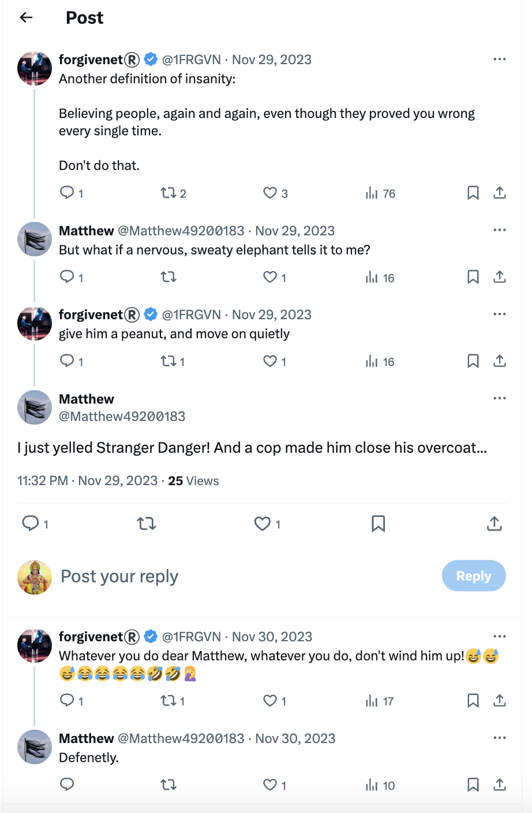
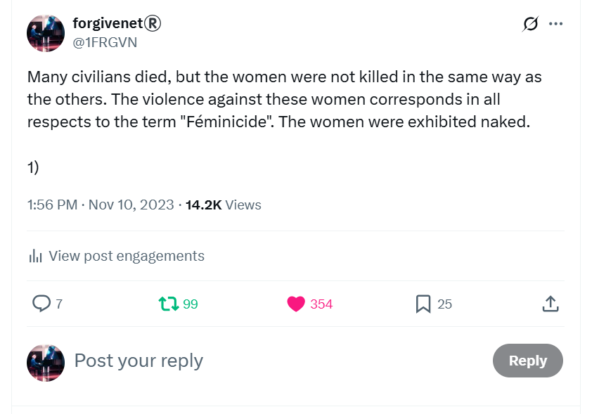

# November 2023

## Conservatory

### Choir

- Choir class continues to be threatening.
- The choir master Salva has created a list of suggestive scores.
- [Nacho](september.md#nacho-tries-to-terrorize-me) pops his nose in all the time and looks at me in a threatening manner. 
- Salva's continuous rant to the class includes comments on trumpets, elephants, trunks, mentions of Vidal (the trumpet teacher's apparent name) and how I'm thinking about him all the time, offensive comments towards me in Valenciano which I don't understand, constant mentions of [going away for the weekend with your boyfriend](october.md#choir).
- Add to that the comments from the Domingo's students which seem contrived and weird.
- The choir teacher makes fun of my name somehow; I don't understand the joke. This goes on continually and even concerns some of the children, particularly the Romanian girl who is Domingo's student; you may remember her from [the concert on the 9th June](june.md#june-9th-piano-concert).

!!! danger "Child safety warning"
    - The Romanian girl's name, Adriana, came up a lot on X.
    - I considered the references to be a warning that she had been targeted by the gangs.

- The French horn player, an adult woman probably called Vicen is involved.
- She sits next to me in choir.
- I suspect she is not using her real name as she and Salva discuss her name significantly every class.
- Of course, I will remember her to see.
- Whenever I leave class, I say goodbye to Salva. He ignores me deliberately.
- I'm anxious, a lot, in choir class. 
- It's a really horrible experience but I continue to attend to defend my human right to a music education, something I'm paying taxes for in the Valencian Community; and to watch and take notes on the outrageous behavior by teachers and staff with dwindling hope that the children are safe with these people.

### Piano 

- Piano is good. I enjoy playing. Paqui seems fierce but fair.
- I have no idea how much she hates me and/or what she is planning with all the teachers.

!!! note "In retrospect"
    - On balance, hate is probably not the main motivator for the relentless gang stalking and bullying by teachers at the conservatory at this stage of the game, although it probably helps them find a justification for their outrageous behavior.
    - In fact, my studies at the conservatory were supposed to end definitively on [June 12th](june.md#monday-12th-june-2023), but that didn't happen.
    - The fact that teachers and staff had to continue with their ridiculous charade must have been very annoying and upsetting for them.
    - So, instead of doing the right thing, and letting it all go, and leaving me in peace to play the piano, they decided their best move was to make things decidedly worse for me so that I would definitely leave, have a nervous breakdown, or even kill myself like so many others they knew.
    - Were they getting paid to deliver me, utterly isolated at home, to the honey-trapping gitano sex gangs?

### Harmony

- Harmony class is OK.
- I struggle to understand the content, however.
- My cognitive skills are not what they used to be. 
- Thinking about musical theory - something that came easy not so long before - now takes a concerted effort.
- I no longer sit next to Samuel who helped me in the previous year. 
- I sit on my own and no-one speaks to me.

### Chamber music 

- Chamber music is stressful. 
- The women are play acting they hate me and it's all a bit of a farce.
- Katia brings in a duet from the opera Norma about two women in love with the same man, one has two children with him. The trumpet teacher, allegedly, has two daughters and the reference is that Norma and Adalgisa are Ana and I and we are both in love with the same man.
- I have brought in something equally suggestive. 
- The whole business is ridiculous in the extreme.
- Random students make comments related to my Twitter activity in the halls.
- It's very stressful.
- I am literally on my own against the whole conservatory, and there is no reason for them to hate me at all. 
- In fact, everything I am doing is because I'm concerned for the safety of the children there, my classmates.
- I am waiting for the [Generalitat to come in and sort it out](october.md#first-letter-to-the-generalitat) like the adults I assume they are.

!!! important
    - It's key to note that no-one spoke to me at all about anything that was going on, right from the moment I came back in September 2022.
    - There was a wall of silence around me.
    - The only person who ever said anything to me about anything that was going on was Paqui. 
    - She remarked casually, sometime in February 2024, after I told her how stressed I was feeling because of being terrorized that, "oh it's what the men do here".

## Weird guy at the conservatory

- I'm stalked continuously online, and in the town, and at the conservatory.
- I often see the weird smug guy milling around that I noticed at the [mobile phone shop](october.md#telecommunications-shop).

- I never saw this man during the 2022-2023 year of studies, but suddenly I'm seeing him everywhere.
- I don't know who he is but I suspect he's either the engineer that has been interacting with me online someone who possibly calls himself David - or I've been triggered online to think that he is.
- I sometimes wonder if he is a computer technician at the conservatory.
- I would recognize him in an instant.

## The laundry

- Another place something was *always* happening to me is at the La Colada laundry.

- I took my laundry there, 2 minutes walk from my house, once-a-week to dry it.
- Sometimes there would be strange people in the laundry while I was there; gangs of young men speaking multiple languages, couples having arguments, men being threatening, a woman devastated about something terrible that's happened to her, a man coming in and laughing in an embarrassed manner when he sees me.
- I didn't really think anything of it until around November 2023.
- I do know that whoever is watching me 24-7 knows where I am at any given moment. 
- They also probably know when I'm planning to go to the laundry as I have my bag of damp clothes ready at my front door.
- During the months of January to April 2023, I remember that every time I went to the laundry I felt nervous and tense. 
- I was loop-thinking about the trumpet teacher and stressing about the chamber music class coming up the next day.
- Sunday night was always when I felt particularly unwell at home.
- I wasn't able to do [my homework properly](may.md#did-the-harmony-teacher-know-i-was-being-poisoned-at-home) on those evenings with a giant cup of tea, and I always felt unstable and tired. I often napped on those evenings.
- It was on Sunday evenings also that I might [walk into town](september.md#gypsy-serenades) and maybe [bump into someone](september.md#rosa-vidal-follows-me-around) or experience some other [menacing situation](../2024/april.md#drugged-in-the-street-by-denia-gypsies).
- I often chatted with the lovely man who worked at the laundry, but sometimes even he said things to me which suggested he knew exactly who I was and what I was experiencing.
- One particular time was in [October 2024](../2024/october.md#sunday-6th-october) when I saw the possum-man at the beach and was [offered a job working for this `Caesar`](../2024/october.md#job-offer), as they called him online when I got home.
- Remember I had inexplicably been seeing [possums online for over a year](may.md#possums) by that time.
- The evening after I had seen this guy at the beach, and gone to the laundry as normal; the owner of the laundry had asked me "¿Todo claro?"; meaning is everything clear now?
- I'm not sure what exactly was supposed to be clear.
- At that time, I was being [seriously poisoned at home](../2024/october.md#serious-poisoning-with-intent-to-harm-or-kill) and felt extremely unwell, especially around my kidneys, and facial, neck, and spinal nerves. I was also having raging migraines and problems with my eyes.
- I saw a woman who looked like Carmen Cano with another woman I'd recognize coming out of my building and smiling at me.
- I realized [some months later](../2025/february.md#paul-helps-me-move-back-to-uk) that I had been hallucinating quite badly in my apartment in October 2024 prior to leaving Dénia; specifically regarding a large hole I had seen in the bathroom wall behind the mirror where I believed a camera had been fitted and removed. 
- The hole was tiny when I saw it again the following February; my mind detoxed, sober, and unpoisoned.
- I believe that the Cano's had intended to finish me off in October 2024. 
- I'd already been in a film that was published online where I talked about being poisoned and my apartment set up with spy-cams.
- I had started to speak a lot about how teachers and staff at the conservatory were involved in serious crimes against students.
- It must have annoyed them. 
- My landlady's reaction to the film was priceless; a slow clap.
- Was I also being warned by the numerous good folk in Dénia that the Canos intended to murder me in the only way they could do so without being plain and putting their own lives in danger?

## The Adams family

- I start to see a transformer figure on the `@jctot19 x` search results.
- The character looks like a fierce and angry Ana Girbes carrying big guns.
- The likeness to Ana Girbes, the musical language teacher at the conservatory, is startling.

- This character remains in search results for a few months.
- Paqui Fornet insists I attend one of Ana's concerts which is taking place in the conservatory room 5 one evening.
- I go along.
- Ana Girbes has her elementary class playing *The Adams Family* theme tune on various percussion instruments.

- There are about 10 players made up of very young prepubescent children.
- It should be a fun occasion but Ana looks furious.
- I'm honestly quite amazed but I have no idea what any of this means, at the time.
- Was Ana Girbes trying to tell me something?
- Or had the Spanish gangs started trying to deflect any blame to come onto the British gangs?

## Tonya

- Fake accounts and constant online communications with nefarious players keep mentioning the name *Tonya*.
- I don't know why.
- Often on a Monday evening, when I walk back home from the conservatory through the tunnel, I see a woman being led along by a short wiry man.

- She is always grinning rather inanely, but behind the grin I see fear.
- She is frogmarched into bumping into me at times, and always is led about in such a way so that I notice her and her lack of autonomy.
- I wonder if she's Tonya. 
- She seems like she could be high on something.
- The following summer, another candidate for [who Tonya could be](../2024/august.md#photos-of-abused-women-and-girls) pops up every day on numerous fake accounts.

- Eventually I realize that perhaps the trumpet teacher himself is called Tonya, or Tonia, and that he was trying to communicate honestly with me against a lot of online noise that did not want us to communicate for some reason.
- Was Tonia the good hacker, the trumpet teacher who cried, a lone man trying to do the right thing against an online hellscape ridden with evil?

### Did they walk me around town too

- Did they sedate me without my knowledge and walk me around town too.
- Is that how everyone knows me, and was it broadcast on Dénia TV.
- Did they take me for coffee, or a lemon ice, in a cafe in the town, while I was sedated.
- Did they dress up as Batman and walk me around town.
- Did all those symbols, words, and memes that gang members mentioned or demonstrated to me, things that made me horribly anxious for no apparent reason, did they come from significant sedated moments just like the woman I saw might be experiencing too.
- If so, the porn gangs of Dénia are psychopathic in the extreme, and it is only a short hop to mass serial killing.
- Could Dénia be the first case of mass serial-killing in the modern world, fueled by porn-addictions and steroid use, where the targets are sedated women and children, or those cyber-stalked and manipulated online?
- Could Dénia be the snuff-porn capital of the world as well as baby rape?
- How bad has it gotten out there with police and government constantly turning a blind eye? The world needs to know.

## Ana in the blue van

- I'm driving back from the shops one Saturday afternoon around 4pm.
- As I'm driving through the [Cami de la Bota](https://www.google.com/maps/place/D%C3%A9nia,+Alicante,+Spain/@38.8407484,0.0914185,3a,90y,10.27h,79.58t/data=!3m7!1e1!3m5!1sOC2bNIiq-bCjgi3TQT8KPQ!2e0!6shttps:%2F%2Fstreetviewpixels-pa.googleapis.com%2Fv1%2Fthumbnail%3Fcb_client%3Dmaps_sv.tactile%26w%3D900%26h%3D600%26pitch%3D10.419428736231623%26panoid%3DOC2bNIiq-bCjgi3TQT8KPQ%26yaw%3D10.274182411708704!7i16384!8i8192!4m6!3m5!1s0x129e1b226dfbd341:0x86f3d778aff1e134!8m2!3d38.8387992!4d0.1050557!16zL20vMDFoc2Ri?entry=ttu&g_ep=EgoyMDI1MDYxNy4wIKXMDSoASAFQAw%3D%3D) towards home, I see the [blue Fiat Doblo](october.md#the-trumpet-teacher-drives-past-me-in-his-car) driving towards me.
- This is the trumpet teacher's car, [I've been led to believe](october.md#the-trumpet-teacher-drives-past-me-in-his-car).
- I see Ana Requena - the violin teacher who was tasked to relentlessly play-act she was having a relationship with the trumpet teacher - in the passenger seat.
- She looks embarrassed.
- There is NO-ONE at all in the driver's seat.

- Whoever is driving has ducked down behind the seats, and is driving extremely slowly.
- It certainly could not be the trumpet teacher as he is quite a large man and he would find it impossible to hide his bulk.
- Whoever it is, is small enough to duck down and not be seen.
- It turns out that behind the wheel is Ana's boyfriend, the short man I [saw at the cafe with Paul and Alex](september.md#alex-and-paul), and the same man I see with Ana on [the Montgo the next May](../2024/may.md#climbing-the-montgo).
- It is such a weird event, I tell many, many people about it.
- The blue car meme remains part of the choreographed terror going forward, and even after this ridiculous behavior I'm still expected to think the car belongs to the trumpet teacher.

## Dreaming of Jesus Christ

- I dream of dirty brown apartments and years of devastating criminal activity. 
- I dream again like this in December.

- A lot of my dreams had significant "brothers" symbolism.
- The November dream turns into a nightmare.
- I call out the name of Jesus Christ to help me.
- JC comes and states, very loudly, [**Vidal Sastre Sanchez Hornero control your sex**](../../conclusion/theories.md#vidal-sastre-sanchez-hornero-control-women-and-girls).

 
- I wake up and tweet about it, but I do not detail the message because I do not fully understand it.

- I wonder if this was after another sedating event as I seem to be unusually inspired to tweet my dreams on certain nights, and I have to wonder about it now as this only ever happened when I was living in my apartment in Carrer Furs.
- I'm not sure what  JC's statement means until 2025, but I often pondered the use of the third-person verb form for "control" which was unequivocal in the dream.
- Perhaps it was obvious but there was clearly a time when I was supposed to know what was meant; and it appears I had to go through some stuff, for his purposes, before I knew.
- I now know that JC was telling me exactly what was happening to me and many other women and girls.
- The VSSH gang, whoever they are - trumpet teachers from bands in Valencia, teachers and staff in the conservatory system of Spain, the Cano-Lopez's specifically, the Smiths of Dénia and their British gang-handlers - seem to all be part of a criminal sex-gang enterprise which prepares, grooms, and sedates women and children for the pleasure of paying porn addicts, often on spy-cam, and they've probably made millions on me *specifically* over the last 35 years.
- I suspect much of the many hundreds of thousands of baby-rape films we hear about in the British courts every week is produced by gangs just like these where women and girls are tricked and/or forced into porn and prostitution, controlled via drugs and fear, and then maybe even forced or manipulated into having children with their "handlers" or [introduction agents](../../crimes/introduction-agents.md).
- Certainly the gang manipulated my mind so effectively with spiked-drugs and online triggering activity, I actually believed I was going to become pregnant with the trumpet teacher and have his baby in 2024.
- Was this a demonstration to me of what they do to women? 
- What could the intention have been to manipulate my mind in this way, a 51 year old woman?
- Were they showing me how they are forced to procure more "product" for use if they get women pregnant and then control their offspring too?
- Are some of the gangs now remorseful after years of a downward spiralling trajectory into producing baby-rape material, the porn that makes them the most money, but remain unable to stop this vile and poisonous activity even if they wanted to?
- Was the whole thing a cry for help, as JC insists it is in A Course In Miracles?
- Curiously, I remain delighted with the idea of getting pregnant, and may well look into it as a reality as it is not out of the question, even at my age.
- Thanks again, criminal fools of Dénia for, yet again, helping me to heal my injured soul!
- Maybe I can help you in return?

## First time they flash up my naked 16-year-old body on X

- It was probably around this time that I first saw a flash of what I recognized as my 16-year-old naked body on an X post on my timeline, obviously posted by the hackers.
- My knees were up as if I was in a little ball, but I was lying on my back. 
- My skin was practically blue I was so pale, dappled.
- I may have had my hair in a pony tail. It wasn't clear.
- It was horrifying and I knew immediately that teachers and staff at the conservatory had seen me in child rape-gang porn.
- Here's a picture of me around that time, probably taken just a month or so before rape-gangs of North London sedated me and put me in rape-gang porn.

- I still find it really hard to accept that a whole town would feel justified in destroying a person because of something like this happening to them when they were a child.
- In conversations with hackers, I regularly tweet about what they had shown me, and what I now knew existed.
- This tweet is initially in reference to how they [filmed me masturbating in Lourdes via my hacked laptop](../2023/april.md#good-friday) on Good Friday 2023.

## Meeting Alex for coffee

- I meet Alex fairly regularly for coffee and a chat at the street food market.

- It's nice to have someone to talk to.
- She's the only person I am talking to at the time.
- I'm pretty sure now she was communicating with Hazel Smith, who may well be her landlady.
- I tell her how I'm feeling, how I'm in love with this man the trumpet teacher, how he continues to communicate with me online.
- She asks, "how would you feel if he walked right in now?"
- I look behind as if he is going to walk in.
- I'm scared and anxious.
- I wonder now if she's asking me to see if I would accept a meeting, knowing that I [ran from it previously](june.md#sunday-18th-june-alicante-airport).
- I tell her that the body always knows the truth.
- I imagine that very few "targets" have this sort of conscious awareness so I am being monitored closely.
- I'm guessing the criminal gangs haven't yet given up on relieving me of my wealth in some way.

## Matthew

- The account [`@Matthew49200183`](https://x.com/Matthew49200183) has been following me since [August 2023](august.md#matthew). 
- I'm supposed to think it is the trumpet teacher.
- I'm guessing it is instead managed by the Lopez-Cano's (Domingo & Carmen, probably their mother and aunts too), the Smiths, and maybe sometimes the local trumpet teacher [I see around from time-to-time](october.md#the-trumpet-teacher-drives-past-me-in-his-car), the big man [Patricia pointed me out to in November 2022](../2022/november.md#walking-in-benijembla-with-the-english-ladies), the man I recognize somehow but who was definitely not the other slighter man who sometimes came to class at the conservatory on Monday evenings until [June 12th 2023](june.md#monday-12th-june-2023).
- Here are all our interactions: https://x.com/search?f=live&q=(from%3AMatthew49200183)%20(to%3A1frgvn)&src=typed_query
- Notice the not-so-veiled violence in the content. This matches the Smiths' threatening social media content MO nearly precisely.
- There are a few references to punctured intestines (the sickest type of porn genre?).

- The very first time the account connects with me, it mentions women being gang stalked: 

- As [I mentioned before](august.md#matthew), the hair in the profile pic was a memory trigger from a post related to Carmen and the [plate lady from July](july.md#plate-lady-later-in-the-month) that I was seeing on both the `@jctot19` account, and the `@sinremite` accounts.
- The picture has changed now to a flag image with the same hair.
- On 29th November, just before I leave for choir at the conservatory, I have an unusual interaction with Matthew on X:

- "But what if a nervous sweaty elephant tells it to me", is in relation to my PTSD reaction towards the trumpet teacher when I tried to talk to him in class, something I wrote about and so well-known to stalkers.
- It is also a derogatory reference to my weight. 
- There's no reason for me to think the English is coming from a Spanish speaker so I believe they make up false mistakes like "tells it to me".
- My reaction to "give him a peanut" is ironic; I know I'm being wound up by stalkers.
- The reply is in reference to pedophiles and voyeurs; the main theme of the gang-stalking.
- I'm feeling extremely nervous and anxious at home.
- I leave for choir.
- I sit down at my usual seat. 
- I've started to notice that the choir master has a red birthmark on his face which is kind of an outline of another face, just inside his own face. It's a bit weird and not at all like AI drew it.

- Vicen, the woman who plays the French horn, sits down beside me as usual.
- She's grimacing.
- She stinks of peanuts. 
- She is eating a peanut-butter sandwich of some sort.

- The choir teacher mentions elephants and trumpets and trunks continually throughout the class.
- I wonder who this Matthew is. The English is very good.
- I'm pretty sure now, in June 2025, that Sandra and Hazel Smith had been running this account since inception.
- Could this be a bona fide connection between British criminal gangs and the Spanish conservatory system?
- At the time, I'm not sure who it is, so I leave all options, and avenues for communication, open.
- I come home and realize I've been sweating a lot and smell quite badly, obviously due to the stress I'm feeling.
- I apologize to the stalkers attending class with me (Vicen, Salva, Samuel, all the adults and possibly some of the older girls).

- The next day I tweet about the "regular nervous system workout" they give me in class and signpost yet again my damaged kidneys (I didn't know I was being drugged continually at that time, I just assumed it was due to stress and the after-effects of [rhabdo in January after class](january.md#serious-poisoning-at-chamber-music-class)).

## Polygon

!!! tip "Summary of the Polygon tech-bro porn-addict content"
    - I didn't think for one minute my professional life would be part of an international sedated rape-porn conspiracy when I first started writing this police statement.
    - That's why the Polygon content was initially not very well organized.
    - However, I did know that the porn-gangs of Dénia were involved in what was happening to me professionally at some level because it was obvious to me they were hacking my network and monitoring my every move.
    - Nevertheless, it felt dreadfully unlucky to be [bullied *again* in my role at zkSync as I was](june.md#work-stress) by the CTO, an ex-colleague of Elon Musk, and for apparently no reason at all while being terrorized by teachers and staff at the conservatory.
    - I took the blame in my own mind, and put it down to the constant stress making it impossible for me to react to situations and events appropriately, but it wasn't that at all.
    - In August, it became obvious that [my professional life was up for grabs too](august.md#head-hunted-by-ex-polygon-director) and bumping into [snickering Polygon node operators](september.md#polygon-node-operators-on-the-bus-home) with tickets for seats beside and behind me on the bus confirmed that.
    - What does end up happening to me at Polygon is really beyond the realms of imagination, you can't make this stuff up, and it will be a nail-biting Netflix special I'm certain of it, but, for now it does seem to me to be the natural progression of a society gone mad with porn addiction and hatred for women and children.
    - The tech-bro hacking pornocracy has broken its barriers and is now happily targeting female colleagues, as we should very well expect it to when it thinks it is going to get away with it.
    - How exciting that a female colleague might be living in a apartment with spy-cams watching her day and night, networked up and live-streaming onto porn channels, *switcheroo* specials a few times a week!
    - And look, she gets so high after her lunch, and who are these people coming in at all hours of the day and night while she's sleeping? 
    - Is she sleeping? Maybe she's dead.
    - Oh look, there they are again, and she's just gone out, what are they doing in her bathroom with her shampoo I wonder?
    - Oh, never mind, nobody cares.
    - Let's not forget the [UK recruitment companies](../2025/august.md#recruitment-agents) who set up bogus interviews for distracting me from writing my police statement and, I assume on occasion, jeering purposes (or perhaps for live-streaming next to historical rape-porn, me starring); humiliation++, just like they like it.
    - And let's not forget how [I'm now banned for life on LinkedIn](../2024/november.md#im-banned-for-life-on-linkedin) where multiple bogus LinkedIn accounts headhunted me for the roles I ended up in over the years, many of which, I expect, to work alongside colleagues who had seen me in child rape-gang porn and knew, therefore, who I was and judged me bitterly on that basis alone.

### Interview with Polygon

- I'm headhunted on LinkedIn by a Coinbase employee.
- A similar thing happened with the zkSync job, except that time I was headhunted by someone apparently working for the company, who didn't exist!
- I wonder who they both really were, and why hide?
- I have previously - about two weeks before - told Joel Barton at Hype that I'm interested in working for Polygon for a considerable package, so I'm happy to hear from this person.
- They tell me there is a tech writer's job at Polygon.
- It's an extremely well paid job, eye-watering amounts, just like the myself and the Spanish honey-trappers like it.
- I attend a series of interviews for the job over September and October.
- The technical interview stage is managed by [Nadim Kobesi](#nadim-kobesi), a curious fellow who turns out to be an actor.

- I'm asked to research and write about the zkEVM department's zero-knowledge engine and ask questions where necessary.
- I do a good job. 
- I have an online chat about what I have prepared with Nadim.
- As I'm interviewing, words fly by on my UI, *wow, you're an engineer*.
- Hackers are watching my every move, including my job interviews.

### Starting my new job

- I start my new job at [Polygon](https://polygon.technology/), web3 crypto giant, on 1st November as a Senior Technical Writer.
- Well, technically I start on the 2nd as the 1st is a public holiday, which is good because I was undoubtedly poisoned while out on [Halloween](october.md#halloween), or perhaps on my return home from tap water or something else I ingested.
- I spend 36 hours getting over it.
- I really pissed someone off on Halloween, didn't I. 
- Was it [my singing](october.md#halloween)? Probably.
- I wonder if this would have normally got someone like me killed had I not been scheduled to start my very important role at Polygon the next day.
- Regardless of my right kidney feeling like it exploded, I pull through ready to start.
- It's a great job and I'm very excited about my new role.
- My boss is Grace Torrellas and the team has about three other members, including Anthony Matlala.
- Nadim has only been with the firm for less than a month when I join.
- Indeed, Grace is also new to the team. 
- She's a personal friend of Jordi, one of the Polygon founders, and she has been tasked with building a new docs team.
- She's already fired a bunch of writers and she will fire one more before Nadim starts bullying me relentlessly.
- Anthony is joining the main writing team from his role working alone for the zkEVM team. 

!!! tip "Corruption in Spain again?"
    - As I started writing this police statement, I began to wonder about corrupt machinations behind my employment with Polygon as the company is very Spanish and I was earning heaps of money! A honey-trappers wet-dream indeed.
    - It came just after the [Torus](august.md#head-hunted-by-ex-polygon-director) nonsense job which was obviously part of the extreme hacking I was subject to. 
    - Were Polygon founders involved in that and by extension everything else that was going on?
    - In retrospect, my assignment with Polygon seems to be just another example of [the porn fatwa](../early-years/2003.md#porn-fatwa), especially when we consider [Nadim's outrageous behavior](#nadim-kobesi), [Hans Bodani's outrageous behavior](../2024/may.md#hans) and the [Pakistani Brit making threats of sexual violence towards me in Bali](../2024/may.md#the-pakistani-yorkshire-man), and other quite unbelievable Polygon events.
    - What's not clear is how many of the men I have worked with have seen the [child rape-gang porn with me in it](#first-time-they-flash-up-my-naked-16-year-old-body-on-x) and/or knew I was being drugged and sedated in my apartment in Dénia, and how many of them were aware that the criminal gangs intended to rob and murder me when I was run through, like they do with all the other women, and now children.
    - I'm wondering if my role at zkSync was also part of the conspiracy, as the men at that organization built up the stress and tension to extraordinary levels on the run up to [12th June 2023](../2023/june.md#monday-12th-june-2023), as if keeping in step with teachers and staff at the conservatory.
    - *It's what they do*, as [Paqui had said to me in class](../2024/january.md#i-tell-paqui-im-being-terrorized-by-teachers-and-staff-at-the-conservatory).
    - I don't think we should accept a world run by porn-addicts, their addictions growing ever more grotesque.
    - I'm sure they don't want it either, in those moments of clarity which come to us all from time to time.

### Nadim Kobesi

- [Nadim Kobesi](https://nadim.computer/), the man who gave me my technical interview, is *apparently* an engineer and cryptographer. 
- Every time he speaks, he prefaces his words with "as an engineer" or "as a security expert", in case we forget I suppose.
- Nadim is a weird guy but we have a good relationship, initially.
- I find out that Nadim was originally hired to work in the zero-knowledge engineering department (zkEVM) - the engine-room so to speak - and he had lasted one week before he was kicked out and into the technical writing team, where he couldn't do as much damage I assumed.
- The engineers, they told me, were agog at Nadim's output, and they spoke as if he had appeared to know nothing at all about what he was doing.
- But he could talk; oh he could talk. 
- His patter was exceptional.
- Nadim was a difficult person; rude, weird, and inappropriate.
- He was very loud and didn't let anyone else speak. 
- Team members were exhausted by him, particularly Anthony.
- Strangely, Grace demands I go to Barcelona with her and Nadim on one weekend about three weeks after I started.
- It's a bit strange and unexpected, and I don't really want to go.
- It feels like I'm obliged to go.
- Eventually, this is cancelled due to Nadim's outrageous behavior.
- I ask *as-a-security-expert* Nadim for advice about how to protect my network and devices.
- I explain a little bit about what's been happening to me, how I'm being terrorized online, how I've been cyber-stalked and hacked, and how it all centers around X.
- He tells me he will check out my X account for me.
- I give him my account details.
- Nadim gives me no helpful advice.
- In fact, what he does say about device security is common knowledge, nothing more.
- Once Grace has fired the last remaining writer from the old team, Nadim starts to give me a really hard time in meetings and on Slack.
- After one tirade on Slack, I stand my ground and get into an wholly exaggerated amount of trouble with Grace for *answering back*.
- Anthony Matlala is kind to me and tells me how difficult it must be for me being a woman in tech and having to deal with him. 
- I wonder if he was given these words from David Z.
- Nadim and my relationship falters completely.
- I demand mediation and Grace eventually calls us into a meeting where Nadim gaslights me and I nearly cry and Grace backs him.
- He's so outrageously rude, it's so exaggerated, and he's getting away with it, I start to get suspicious and wonder if he's putting it on.
- I start to wonder about how much of an engineer and security expert Nadim really is.
- At home on my personal laptop or phone, I look him up and discover he's a trained actor.
- He has a bachelor's degree from the [National Institute of Dramatic Art](https://www.nida.edu.au/) in Sydney, graduated in 2010, and he has been in a number of films. 
- The next day his aggression towards me becomes fever pitched.
- He starts to bully me even more outrageously on Slack, saying extremely disparaging things about my character, and it's a Sunday afternoon.
- I'm mortified and I'm sure I'm going to have to leave yet another tech job because I'm not going to be supported against this vile behavior, as usual.
- I wake up on the Monday morning to a rainbow over the view from my window.

- I post the picture of the rainbow from my window on Slack. I have the original somewhere.
- It turns out Nadim's bullying is so insubordinate, they fired him.
- We never see him again.
- I end up believing that, due to my X content, and before he was fired, he spread muck around the business about me, including to my boss and managers I have to work with very closely, that I am a *transphobe*. 
- This is probably incorrect but it was how I was able to explain my experiences at Polygon.
- It's the *only* explanation I have while I'm unaware I'm an international sedated spy-cam rape-porn sensation.
- The Barcelona trip gets cancelled and I still wonder what that was going to be all about. Was Jordi involved in that, or any of the other founders?
- Did hackers see me find out that Nadim is an actor, and tell the Polygon bosses, who advised he got himself fired asap?
- When I speak to Spanish engineers on the team about him in Bali, they couldn't believe the guy had got the job. They said he was totally ineffective and impossible to work with and any work he had done they couldn't believe he had done it, it was so poor quality, as if he had no idea what he was doing. 
- Who interviewed him and why would they let someone like that into the codebase?
- Nadim had root level access to all sensitive product systems for the short time he was on the engineering team and I thought this was interesting and wondered if he was an industrial spy.
- I did wonder how much damage he was able to do in the engineering department in such a short space of time.
- The tech failed and faltered again and again in early 2024. I think this is probably a red-herring though.
- He, or other parties, added a lot of malicious code to my backend set up which broke our SEO for months before we could figure out what had happened, but I'm guessing this is another red-herring given how my own colleagues hacked my systems to *make me look incompetent*.
- Was Nadim hired specifically with the intention of terrorizing me at work, for laughs alongside the other humiliation I didn't know I was suffering.
- Did Nadim find something out he didn't like, about the [porn fatwa maybe](../early-years/2003.md#porn-fatwa), and realize it wasn't such a fun gig after all and got himself out of there quick?
- In any case, from the moment I gave Nadim my X account details and looked him up online in private, everything changed for me at Polygon. 
- My boss Grace Torrellas starts to treat me with disdain and I am no longer given any work by Gabriel Silva who I am supposed to be working with closely. 
- Was this all intentional though?

### Hans Bodani

- In January, Grace employs a new writer Hans Bodani.
- We are four now: myself, Grace, Anthony, and Hans.
- Is Hans yet another actor playing a key role in the porn conspiracy?

### Redundancies

- In early 2024, 20% of the workforce is let go.
- Grace loses her job and she's only been doing it a short while.
- She disappears in seconds but seems to be OK about it, which is a bit strange.
- Did she also find out about the [porn fatwa](../early-years/2003.md#porn-fatwa) and want out quick, or was leaving at this time part of the deal for her?
- I step up to take the roll of team lead, I guess this was expected.
- I'm not entirely happy about this but it's clear neither Hans or Anthony are going to do it.
- It's a lot of work.
- Too much for one person, in fact, because the rest of the team don't do anything.
- There are three of us on the team now; myself, Hans Bodani, and Anthony Matlala.
- The others do a little bit of work each week, and only if I ask them to, and nothing more.
- I'm doing 14 hours days trying to get the docs into a reasonable state.
- We work on particular product areas. 
- Hans is with the node product, PoS, managed by Sandeep.
- Anthony is with zkEVM as he is, in fact, a mathematician and cryptographer.
- One of my product areas is Gabriel Silva's product, CDK, and I'm expected to work with him closely.

### Gabriel Silva

- Gabriel starts complaining about my work to me, and others; he doesn't like my writing style, he continually puts me down in meetings, he calls me and my work a *single point of failure* to other team members.

!!! tip "Single point of failure"
    - Like teachers and staff at the conservatory used events, words, and emotions I had described in my police statement in 2016, so too do the pornocracy use events, words, and emotions from past professional (apparent, certainly intended) *humiliations*.
    - SPOF is a direct reference to a breakdown in communication with a colleague at Consensys who was extraordinarily aggressive towards me, unable to speak calmly when challenged, tantruming, even, and no-one supported me on that.
    - *Fetch*, is another one.
    - Hackers flashed up names of men who had been extremely unpleasant towards me at work, one such person, Harsha, interrogating me continually on what I knew about my own PhD, triumphant when he convinced himself I was an idiot, other male colleagues glaring at me while I was at my desk or in meetings.
    - I became 100% suicidal on getting fired from the job with Adaptive and made an attempt on my life not long after.
    - There's bound to be more of this, of course.
    - It's a porn genre, don't you know.

- We have an [extraordinarily weird meeting in January 2024](../2024/january.md#a-strange-meeting-with-gabriel-silva) which I wonder about.
- He attends the first team meeting with us a team leader from his car along the Portland Oregon lakeside area where just recently middle-aged women trying to protect children from trans ideology were punched and attacked by trans activist. 
- Was he there with his balaclava?
- I am really busy as team lead so Gabriel not giving me work doesn't impact on my 14 hour days at all. However, had I not gone up, he would have effectively made me a candidate for redundancy very quickly.
- Interestingly, I am invited to the filmed management meeting that takes place regularly. Grace Torrellas was doing it prior to me. I find my presence a bit unnecessary to be honest. No-one cares about documentation. Why am I there? Is it so everyone who knows what's going on will know who I am? Will they be able to compare my real-life likeness to the sedated rape and *switcheroo* porn they've seen?
- My team (who are not really tech writers, and don't know the job well - one is an exceptional copy writer, the other an academic-writing-style mathematician) starts to mutiny.
- One of the team in particular, Hans Bodani, starts to shout at me in team meetings, gets angry with me, complains about things I did not say to my boss, who supports him, and then refuses to communicate with me at all.
- Curiously, a new HR head starts around same time, James Dawes, who has worked with Hans previously.
- I ask for help from my managers. 
- I am ignored.
- The other team member, Anthony Matlala, sides with Hans once he sees I'm getting no support from my managers.
- At an [offsite in Bali in May, I am threatened with sexual violence from an "apparent" Rust engineer](../2024/may.md#the-pakistani-yorkshire-man) who has started that week. He has clearly been told to target me. Anthony is at the dinner table when this happens.

- I tweet about it and tell Spanish HR the following morning.

- At the Bali offsite and in Belgium at EthCC in July, Polygon employees come up to me continually to say, oh I'm sorry you're leaving.
- Nothing is done. When I see Miriam the Spanish HR woman in Brussels, she asks me what my game is.
- My team refuses to communicate with me at all. Meetings are sabotaged by Hans' angry outbursts. I am unable to do my job.
- I believe the intention is that I leave due to the stress and unpleasantness.
- I don't leave but I cannot do my job and no-one is helping me fix the outrageous situation of an insubordinate team.
- I believe the team has been told to behave this way by managers.
- An email comes from from Kellie-J Keen as leader of the [Party Of Women](https://www.partyofwomen.org/) in the UK in June asking if anyone would like to stand as a political candidate for general election.
- I take two weeks off and run a [political campaign in North London](../2024/june.md#election-campaign) and come second-to-last in Finchley & Golders Green.
- I step down as technical writing team lead and Gabriel Silva steps in and immediately gives all the work to Anthony and Hans.
- He leaves me with nothing to do, certainly no writing, but as he said before he doesn't like how I write so I'm unsurprised.
- Gabriel doesn't know what he's talking about when it comes to technical writing. He is bullying me and trying to push me out.
- So I'm left with nothing to do. Anything I do write, he asks Hans to do over. 
- He picks on me in meetings and gives me impossible backend tasks which I complete successfully.
- By September/October, I'm getting really upset about it and contact HR to start harassment procedures because it's clear to me I'm being shoved out due to my political views.
- I'm unaware of the [porn fatwa](../early-years/2003.md#porn-fatwa) at that time which is the underlying purpose of terrorizing me.
- A couple of weeks later they fire me, and the whole team, saying we're redundant, which is not true.
- They formally accept that my dismissal is unlawful under Spanish employment law.
- I get a Spanish lawyer to help me.
- The lawyer appears to be colluding with the Spanish company, so I have no option but to fire them in December 2024.
- There's a lot more to this story; we are steadily unraveling it all.
- I felt that being targeted at my job for being "transphobic" on top of being targeted by criminal sedating rape-gangs of Dénia is really too much for one person to cope with without any support at all.
- And yet, I'm still here.

!!! danger "Could Nadim and Aziv, even Hans, have been yet more porn-gang spies?"
    - I wonder a bit about Nadim and Aziv (or whatever his name was) now.
    - It's easy to get paranoid when you're an international child rape-gang porn star of over 40 years and never knew it till very recently.
    - I did think Nadim was an industrial spy, but I now believe it's even more twisted.
    - Could Nadim have been set up to specifically get me the job, which made me a lot of money for future honey-trappers, and then cause me enough trouble to cause me to leave?
    - Or was it just plain and simple brutishness and I was a supreme target for abuse.
    - The implication is a conspiracy within the management team or amongst the founders at Polygon, specifically the Spanish ones.
    - And then, when James Dawes (Hans Bodani's ex-colleague) joins, finds out that I'm a target and does his research in UK male porn-addict networks, he finds out about all the other times I was targeted with sexual harassment and decides to use triggering words from those times at the [HR meeting in October 2024 just before I'm sacked](../2024/october.md#bullying-at-polygon) which felt like severe mental/emotional violence to me.
    - Was the Aziv sexual threat just more fun for them? Or were they hoping I would have violent sex with him.
    - Remember, I had been primed by the [gypsy sex drug ring right before leaving and the drugs had been put in my toiletries too](../2024/april.md#drugged-in-the-street-by-denia-gypsies).
    - I wonder what these two actors might tell the police if questioned.

### X with Polygon

- When I receive my Polygon laptop, I set up an X account.
- Immediately I have numerous followers, all with significantly meaningful profiles.
- I suspect that my work laptop has also been breached, via my home router.
- I'm so busy with my knew role, my conservatory studies, and the stress of what's going on, I don't have time to think about it much more until [March 2024](../2024/march/1-12.md#reporting-hacking-to-polygon-labs).

## Health

- I continue to have aches in my back around my kidney area, particularly during the day.
- Another curious symptom I have is that whenever I'm doing yoga, which I have been doing for 25 years, certain areas of my body feel extremely weak, for example the tops of my feet and ankles in particular poses.
- Sometimes, it feels like the pressure on my bones is intense in those areas, and I back off the pose due to the feeling.
- In 2024 and 2025, I will have three minor fractures of a rib which had fractured previously in 2003.
- This happens while doing yoga twice, and while coughing once.
- I constantly look up some very personal symptoms I'm having that I believe are connected to kidney problems.
- I do not mention these symptoms to anyone else.
- Teachers and staff at the conservatory will refer to these symptoms in horrible ways.
- They could only know about these symptoms if everything I do online, in private, is being monitored.

## Tweets

- Here is a selection of tweets from this period which relate to everything that has been happening. 
- Most of them have been translated, a lot, so I assume the Spanish are reading them.
- Many of these tweets are confirmations of what has been going on.

### @1frgvn

- Domingo's dad is (apparently) a car dealer, he told me in 2014, so I'm literally unable to get my car fixed anywhere without possible ridiculousness occurring. 
- Certainly in [September at the garage in Javea](september.md#problem-with-my-car) I wait all day long, and they do nothing at all and charge me a bunch for it. 
- I'm starting to feel the same way about everything else I need done too.

- I've started thinking about building a Hanuman temple in Dénia.

- I realize my cousin Leah is also stalking me. 
- Leah has been honey-trapped by British criminal gangs since around 2004.
- She is extremely vulnerable.
- I wonder why she is stalking me, and who told her about me. 
- Remember, at this time I still have no contact with my family, so I'm believed to be incredibly vulnerable to criminals who like to target wealthy and isolated women.

- I'm so nervous at the conservatory, I'm convinced they're planning another attack. 
- I tweet about my concerns. 
- Carrie 2 is obviously a reference to [Carrie 1 on 12th June](june.md#monday-12th-june-2023).

- I tweet my concerns about having a heart attack very early in the morning. 
- This is evidence I'm up and worried, but I also wonder if tweets like these signpost the times that criminals entered my flat while I was sedated.

- Many of these tweets are also curiously early.
- Waking up with music in my head is something that never happens to me outside of when I lived at my apartment in Carrer Furs. 

- I was thinking a lot about "meeting people in dreams" at that time.

- I tweet about the "list owner"; i.e. the person that sends my tweets out to the town for everyone to read.

- I post a number of chapters from my books this month. 
- In response, Google search for `@jctot19` showed multiple pictures of writing, and written words, sheets of typed pages, things like that.

- I often refer to being naughty in tweets. I'm not actually sure what I even meant.
- Could it have been something subconscious?

- Elon always seems to tweet some relevance at the right time.

- I still wonder who *gozer* is; someone's nickname maybe?

- Addressing the female stalkers who support the insane men.

- Interest in Season 3.

- I get tired of the cyber-stalking from time-to-time and try and make light of it.

- Elon again, right on time, says something most appropriate.
- I have been discussing empathy and the special abilities of empathic people who learned their trade, as it were, from being in constant fight-flight-and-freeze.

- I continue to think about a Hanuman temple in Dénia. It needs one for sure.

- As well as trauma healing, and empathic abilities, I often tweet about the outrageous things people say to child sexual abuse victims.

- I describe the stalking Seasons and ask for a suggestion for a film version of Season 1 from 2014.

- I talk directly to the stalkers about their behavior.

- This tweet is a direct reference to [the behavior of Mercedes](../early-years/2013.md#meeting-mercedes).

- I tell them about the bedbugs in Lourdes, and how that pushed me into visiting Dénia and renting a flat on 8th December 2021.
- I had no suspicion the whole thing was a set up while writing this, none at all. 
- It all seemed to me rather serendipitous, miraculous even. Perhaps it still is, regardless of the manipulations.

- I'm still watching the Hanuman show and tweeting about it.
- I'm obsessed with Hanuman, actually, and I now believe he came to help me and protect me while my life, health and wellbeing were in serious jeopardy.

- I'm still reeling from 7th October 2023.

- I believe I'm being protected by something divine, and that it is not just for me.

- My faith in God is unassailable and, in fact, grows exponentially during these horrible times.

- Jai Shri RAM.
- I remember feeling *extremely euphoric* around this time and wonder about whether the feeling was from being spiked in my house with mood-altering substances of some variety.

- Making light of it all again.

#### Elon's violinist

- Most curiously, in early November, Elon Musk posts an animation with a beautiful violinist playing in space, and the music accompanying her is *not a violin*, it is, instead, honky-tonk piano.

- Of course, the references to Ana Requena, trumpet teacher, and myself and our mythical-switcheroo-porn-love-triangle are not lost on anyone.

- Given the scale of the tech-bro porn-conspiracy we're uncovering, does this suggest Elon's involvement?
- He mentioned violins before too.

- Does this explain how some men seem to recognize me everywhere I go in the world?

#### Mary G Lamarche account

- I talk a lot about forgiveness on X. 
- I believe that the [`@g_lamarche`](https://x.com/g_lamarche) account is likely to be Domingo, or close to him, as it was coming up on Google search for `@jctot19`; I believed as a warning.
- Lamarche is a Spanish pun with a reference to raving.
- I believe this account sometimes warns and advises me about things going on at the conservatory and elsewhere.

- Note the `@g_lamarche` account has "manada" as location. 
- *Manada* is famously what the Spanish called the gang-rape team that attacked the lone woman at the Pamplona fiestas.
- I use the word in my [speech in Madrid](../2024/may.md#my-speech-at-let-women-speak-madrid).

### @JackChardwood 

- I post about Elon's staggering synchronicity here too.

- This reply was in reference to "ghost dev", the name I used for to address the professional hacker directly.
- It's not clear what was said.
- The account name was relevant previously, but looks like it has changed now to something non-relevant to our story.

- I get really tired of being followed by porn bots.

- A request to the engineer after my crypto app died again on me and I thought it was them.
- The same thing happened in [August](august.md#the-dev-they-hired-hacks-my-app).

- I continue to tweet about the forgivenet and how I believe these hackers could give up their evil schemes and start working for me instead.

- Perhaps March 2024 was a bit early, or maybe just blocked by the handmaiden-leader, Paqui Fornet's idiocy.
- Maybe June 2026 for the wedding, like I mentioned before?
- The stars may well be aligned at that time.
