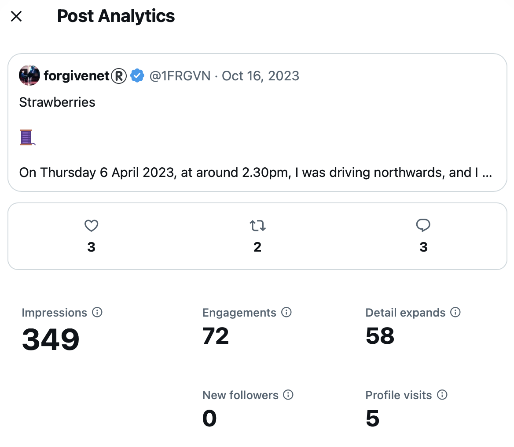

## Trumpet teacher drives past me in his car

- I'm walking back from the Indian restaurant with my takeaway.
- A car is driving slowly along beside me as I walk, kerb crawling. It is a bright primary-blue Fiat Doblo-type vehicle, the same car that Christine BJ has.
- As I reach the crossroads at my apartment block, the car turns into it behind me. 
- I look and the trumpet teacher is driving the car.
- I have no idea why he does this.
- This blue car often features in the stalking from this moment. I guess he was showing me the car so I'd recognize it again when I saw it.

!!! info
    - Hopefully it's now extremely clear that the people in Denia are able to know where I am at any time.
    - This could only be possible by tracking me via access to my mobile.
    - It's like they're constantly poised to begin something. They must put enormous effort into this. I wonder what benefit they could be getting from their behavior.

## Gang stalking

- Bullying at choir continues with Salva giving us *suggestive* scores related to the gang stalking.
- Things I have said on Twitter have been shared with the students and the choir teacher Salva. 
- For example, this rather innocuous tweet: https://x.com/JackChardwood/status/1708197553483763859 is suggesting that the trumpet teacher come with me to Ireland because I need to hire a car and don't have a driving license.
- A girl in the class comes up to me as I enter the choir classroom, and asks me, "Are you going away for the weekend?"
- This girl (Elsa Martí García) is a piano student of Domingo. Her picture was also posted on a fake account I received during continued cyber-stalking in 2024.

- This photo was sent the same time I was receiving tons of fake accounts with women who were clearly being sexual abused in some way, or that was the inference one was supposed to make, including women groomed from innocently sending nudes, or doing innocent photo shoots, to actually doing porn.
- I was concerned enough to send this pic to the Policia Nacional trafficking email (which is supposed to be anonymous) in October 2024.
- I got a reply from Denia Police which, at the time of writing, I have not responded to given their [total lack of interest](../2024/february.md#policia-nacional) when I visited them and my subsequent suspicion that I cannot trust them to help me.
- In chamber music classes, the music is extremely suggestive of what's been going on and I am bravely playing my hand.
- Piano classes are good and Paqui does a good job of pretending she's neutral.

!!! important
    - At this time, it was obvious to me that stalkers were reading my tweets around the clock.
    - Because I was able to see how many people were translating my tweets, I knew what time they had to be up.
    - It was very surprising to see people reading my tweets at all hours of the night.
    - I wondered who would be up to,
            - Read a tweet that needed to be shared,
            - Share the tweet.
            - See the alert about a tweet on the WhatsApp group or wherever they were sharing my information.
            - Read it.
    - Were they shift workers working at night, or were they truly around the world.

## Strawberries

- One morning I wake up long before dawn to write a tweet thread about strawberries: https://x.com/1FRGVN/status/1713726935371551010.
- It blows everyone's mind, I'm sure.
- When walking to the conservatory, as I pass [this spot](https://www.google.com/maps/@38.8442052,0.1081194,3a,75y,36.63h,77.57t/data=!3m7!1e1!3m5!1sB4ssIdTdFG6H4f6v4cNyeg!2e0!6shttps:%2F%2Fstreetviewpixels-pa.googleapis.com%2Fv1%2Fthumbnail%3Fcb_client%3Dmaps_sv.tactile%26w%3D900%26h%3D600%26pitch%3D12.43052595660501%26panoid%3DB4ssIdTdFG6H4f6v4cNyeg%26yaw%3D36.626678552174724!7i16384!8i8192?entry=ttu&g_ep=EgoyMDI0MTExMy4xIKXMDSoASAFQAw%3D%3D) on the Carrer de Manuel Sanchis Guarner, there's a strawberry on the ground.
- Incidentally, this is where I saw the fat bloke that had been behaving extremely strangely when [me and my Tibetan monk friend](../2023/september.md#my-friend-visits) were at the beach. 
- Check out the analytics to see how many people translated this tweet.

## Katia in the act

- It seems like the Google search results, and fake accounts, are sometimes on my side.
- I receive activity from the following account which was posted right before chamber music class. 

- I understood it to mean that Katia, one of the singers in chamber music, was embroiled in the fiasco somehow.
- She was. She started to become extremely angry with me for no reason, and give me a hard time generally.
- The other student obviously knew what was going on too.

## Rocio Vidal

- In the Google search results of `@jctot19 x` I now see a picture of Rocio Vidal. It is still there, even today.

!

- Rocio Vidal is a famous YouTuber in Spain.
- I've been reliably informed that she was hacked.
- At some point, on fake accounts, I saw pictures of her sitting on a bed, looking at someone who is filming her and she is about to take off her clothes.
- I believe the picture posted here is when she "finds out" that she was filmed secretly, or that she agreed to be filmed, and those recordings were going to be used in some sort of blackmail. She looks upset. I could be wrong.
- The `@jctot19` account has interacted a lot with Rocio Vidal's account `@SchrodingerGata` and I saw a lot of this interaction when I was able to see it prior to Elon locking down in July. 

## Telecommunications shop

- I decide to try and get my old mobile phone fixed so I can use it instead of the one they obviously have access to.
- I go to the telecommunications expert at Mobile Express C/ de Diana, 24, 03700 Alicante Spain which is run by Chinese people.
- As I approach the shop, a guy I have seen at the conservatory a lot comes out of the shop.
- I don't know who he is but he's always around, at the conservatory and in the street. 
- I assume he is the one who has been hacking me and I start to wonder if he works as a technician at the conservatory.
- Inside the shop, the Chinese guy clearly recognizes me as he can hardly stop smiling at me.

!!! tip "This may be nothing but..."
    - As I was searching for the address of the shop, I looked up experts, and this [name came up](https://www.einforma.com/informacion-empresa/lopez-moreno-juan-david).

## Baby Jo

- I'm followed by a crypto meme coin account on Twitter: https://x.com/BabyJoeERC.
- Lorraine's son is called Joe and I taught him piano when he was 12 or 13. We had a great time too.
- On Facebook, there's a lovely picture of Joe as a baby with his dummy in: https://www.facebook.com/photo/?fbid=10200343206052070&set=ecnf.1512218809.
- I believe the account and meme coin was created to terrorize me, but they might have tried to make it into something.

## My car is damaged on the Montgo

- I go walking on the Montgo, the mountain that overlooks the town, on Saturday 14th October.
- Usually I go to the top, but something told me to come back early which I did. I'm unusually concerned about my car.
- As I'm coming back, I bump into a good-looking man who has three large hunting dogs with him. I'm about 5 minutes away from my car at that point.
- As I get into my car, I notice the people at the gun club looking at me in a strange way.
- I do my shopping and go home.
- The following Saturday I go to use my car again and I notice a scratch all along its left side, clearly done purposefully.
- The only time that could have happened was the Saturday before.
- I'm furious.

## First letter to the Generalitat

- Letters to the Generalitat Valenciana have been appearing on Google search `@jctot19 x` and this puts an idea in my head.
- I would rather leave the police out of things unless it got extremely serious.
- I decide to write a letter of complaint to the Generalitat.
- I look up all the important people I can find and send it to them via email. 

    - [Letter in Spanish](../../content/documents/letters/3.%20Letter%20to%20Generalitat%20of%2022%20October%2023%20-%20ES.pdf).
    - [Letter in English](../../content/documents/letters/3.%20Letter%20to%20Generalitat%20of%2022%20October%2023%20-%20EN.pdf).
    - [Proof of sending](../../content/documents/letters/3.%20Proof%20of%20first%20emailed%20letter%20to%20Generalitat%20Octo%2023.png).
    - [List of recipients](../../content/documents/emails/list-of-recipients.png).

- I receive no reply at all, ever, not even a notification that my letter was received.
- In fact, I write again, a few times, to the GV and I never receive any reply from them.
- Given the seriousness of what I'm saying, it's more than weird that no-one replied to me.
- On the `jctot19 x` Google search results, a picture is displayed with a trampoline at the bottom of apartment blocks which I take to mean that Domingo is very upset.

## Hazel outside the conservatory

- I was talking about how it is often not a good idea to disclose child sexual abuse to people who aren't ready to hear it because they might attack you: https://x.com/1FRGVN/status/1714432159425925547.
- You may remember the reference from [earlier in 2007](../early-years/2007.md#hazel-smith).
- I was leaving the conservatory not long after that, and she was outside with a man.
- It's interesting because I never once mentioned her name on Twitter or any details that anyone except her would recognize.
- So I was certain then that she was involved in the current gang stalking. I wonder if she has been involved in the ongoing spiking/poisoning, or even the 2014 threat of poisoning from Domingo. It's certainly worth considering.
- Is it possible that the most evil people in a small town could have been introduced to something so abhorrent, but yet utterly addictive, which gave them utmost power over everyone? Is that the underlying nature of this story? I hope not, but I would not be surprised if it was.

## Porn intensifies

- The amount and nature of the porn that I'm seeing on my timeline intensifies. 
- There is a lot of artistic porn which is kind of interesting and a lot of cartoon, film, photographic, fake accounts, and textual porn.
- It's full on. A lot of it suggests violence, there's gay porn, all sorts. It's just insane.
- I now believe that, along with water is in the water at my home, the sexual grooming by hackers is intensifying and the porn I'm seeing is part of that.

## Halloween

- Alex, John, Paul, and I agree to go out for Halloween, a kind of remake of our evening all those years ago.
- The whole town knows I'm coming out but I was never clear about that on Twitter.
- I'm stopped for photos as I walk to the bar where we're going to meet.
- Prior to arriving, John has appeared a little fearful and wanted to go and find the tail I had lost from my cow costume. He said, "why don't you come with me Katie". What was he afraid of?
- The others lead the way and we end up in the Irish bar on the Calle La Mar.
- Once inside, we "bump into" this very dodgy French bloke who says he studies guitar at the conservatory and wants to know things about me. 
- A young man with him dressed as the joker is quite menacing towards me.
- I sing a song, a cockney song, You Made Me Love You, which blows their minds a little.
- Alessandra tells me later, a few times, that the French man had wanted to know about Halloween in 2007 and whether I had a ukelele and had sung Back to Black.

## Tweets

These are a selection of tweets from this period which relate to everything that has been happening. Most of them have been translated, a lot, so I assume the Spanish are reading them. Many of these tweets are confirmation of what has been going on.

!!! important
    - I'm realizing everyone is reading my tweets. I don't know how as I don't get all that much activity on them but everyone seems to know everything I've said.
    - A lot of my tweets have the intention of flushing the audience out, to see how far my reach goes.
    - I find out literally everyone in the town knows everything about me, and every tiny thing I've said online, and likely a lot of lies too because they all hate me.

### @1frgvn

- https://x.com/1FRGVN/status/1719116928617197916
- https://x.com/1FRGVN/status/1716371097128509890
- https://x.com/1FRGVN/status/1716087374759723455
- https://x.com/1FRGVN/status/1716069851888820287
- https://x.com/1FRGVN/status/1716068786313236773
- https://x.com/1FRGVN/status/1716028186289488047
- https://x.com/1FRGVN/status/1716068390735900850
- https://x.com/1FRGVN/status/1716066923631280635
- https://x.com/1FRGVN/status/1716065908488040538
- https://x.com/1FRGVN/status/1716066748456149202
- https://x.com/1FRGVN/status/1715729380352184352
- https://x.com/1FRGVN/status/1715795337489637651
- https://x.com/1FRGVN/status/1715789335658651794 -> re: 12th June 2023 psychological attack at the conservatory.
- https://x.com/1FRGVN/status/1715789145857990764
- https://x.com/1FRGVN/status/1715776669603041593 -> re: 12th June 2023 psychological attack at the conservatory.
- https://x.com/1FRGVN/status/1715776355630043269
- https://x.com/1FRGVN/status/1715751496480936129
- https://x.com/1FRGVN/status/1715741021655466380 -> my first and only reference to poisoned aunts.
- https://x.com/1FRGVN/status/1715735176062394796
- https://x.com/1FRGVN/status/1715734508132053031
- https://x.com/1FRGVN/status/1715733466585669913
- https://x.com/1FRGVN/status/1715730699653660878
- https://x.com/1FRGVN/status/1715729380352184352
- https://x.com/1FRGVN/status/1715585631022207058 -> certainly at the conservatory this was true.
- https://x.com/1FRGVN/status/1714577639233515681
- https://x.com/1FRGVN/status/1714433682046349597 -> talking about my Tweet post in Spanish from April 2023.
- https://x.com/1FRGVN/status/1714429310906351705 -> when I first mention Hazel, without mentioning Hazel.
- https://x.com/Lucyinbetween -> major player that followed me immediately I went public. I have interesting DMs with this account that include identification documents when it tried to prove who it said it was. Easy arrest probably.
- https://x.com/1FRGVN/status/1713298033910202647 -> referring to old friends Alex, John, and Paul out on Halloween.
- https://x.com/1FRGVN/status/1713292202674127032 -> mentioning I'll be taking the Uke out.
- https://x.com/1FRGVN/status/1713262652103819341 -> reference to the table again.
- https://x.com/1FRGVN/status/1712815203421688307
- https://x.com/1FRGVN/status/1712456797456359427
- https://x.com/1FRGVN/status/1711299138397032596 -> taking the piss out of muscle men, aka Domingo.
- https://x.com/1FRGVN/status/1710938372728885413
- https://x.com/1FRGVN/status/1710594308020084863 -> replied to by Matthew, the account that is pretending to be the trumpet teacher.
- https://x.com/1FRGVN/status/1710030138459484321 -> in reference to Matthew.
- https://x.com/1FRGVN/status/1708534848803971249 -> weird convo with Matthew.
- https://x.com/1FRGVN/status/1708504153788420212

### @JackChardwood

- https://x.com/JackChardwood/status/1712835795491459181 -> responding to the trumpet teacher who posted a picture of a famous man looking "pleased with" a woman after I posted the muscle tweet.
- https://x.com/JackChardwood/status/1711647385347145762 -> mentioning the gypsy serenade.
- https://x.com/JackChardwood/status/1711512447046062086 -> response to Tweets inexplicably coming up on my timeline saying, "he's just a baby" which was a common phrase in all this.
- https://x.com/JackChardwood/status/1711409585485906091 -> explaining how I feel about it all at that moment.
- https://x.com/JackChardwood/status/1711363060579942748 -> during the muscles tweet business, I posted this. The hacker posted immediately at tweet on my timeline which said "not a foot wrong". 
- https://x.com/JackChardwood/status/1711149172072603930 -> comment to hacker.
- https://x.com/JackChardwood/status/1711132004924670337 -> comment to hacker.
- https://x.com/JackChardwood/status/1710694553353609441 -> trying to figure it out. A post goes by about Mac spoofing.
- https://x.com/JackChardwood/status/1709967390979534933 -> regarding a response from hackers.
- https://x.com/JackChardwood/status/1709913077339025790 -> message to any of the bullies who may have a heart.
- https://x.com/JackChardwood/status/1708837976413724886 -> thought the hacker had messed with my crypto app, he complained, turned out he hadn't, he responded to this also. Always fake accounts with a message in the name, or first tweet, or profile.
- https://x.com/JackChardwood/status/1708819182798643206 -> trying to turn him.
