# October 2023

- Gang and cyber-stalking continues apace.
- It's relentless and I seem to be experiencing some persecutory evil every minute of the day.
- As a fake X account said to me in September, as if the person running it knew what was going on, "It sounds like they want you trapped and to watch you suffer."

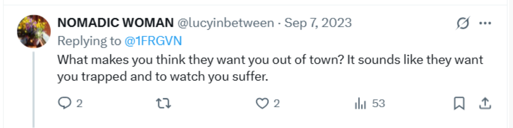

## Stalked online around the clock

- It is obvious to me that stalkers are reading my tweets around the clock, and not just a few.
- Because I could see how many people were translating my tweets, I knew what time they had to be up.
- It was very surprising to see people reading my tweets at all hours of the night whenever I tweeted.
- I wondered who might be up to:
    - Admin-read an interesting tweet that needed to be shared with the community of stalkers.
    - Share the tweet on WhatsApp or wherever.
    - See an alert about a new tweet on the WhatsApp group or wherever they were sharing my information.
    - Read it as a participant.
- Were they shift workers working at night, or were they truly around the world. I suspect the latter.

## The trumpet teacher drives past me in his car

- I'm walking back from the Indian restaurant with my takeaway.
- A car is driving slowly alongside me as I walk, kerb crawling.
- It is a bright primary-blue Fiat Doblo-type vehicle, the same car that Christine BJ has in white.

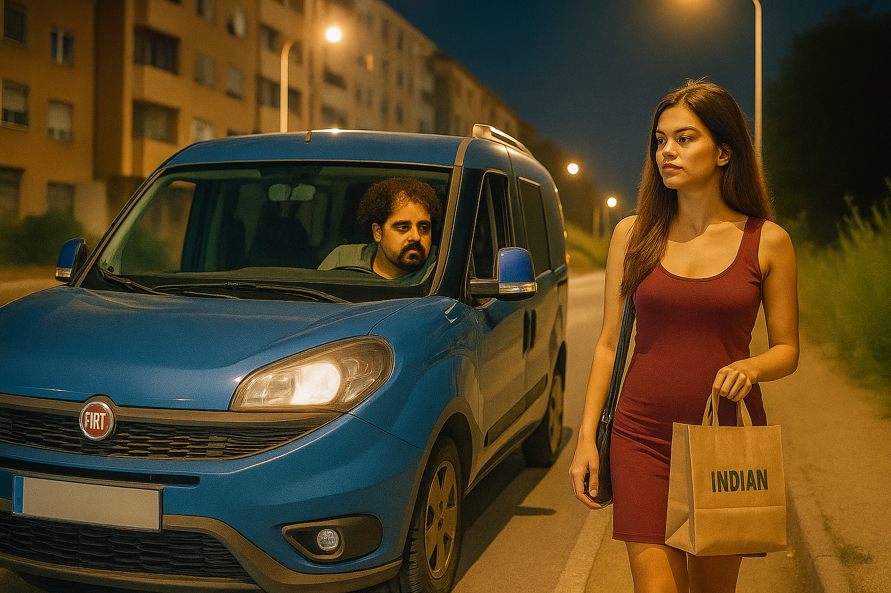

- As I turn into the road of my apartment block, the car follows slowly along beside me.
- As I'm opening the gate, the car drives slowly past. 
- I look and I see the trumpet teacher is driving the car.
- He looks at me.
- I have no idea why he has done this.
- This blue Fiat Doblo often features in the stalking from now on.
- I saw [Ana in it](november.md#ana-in-the-blue-van) a month later in a most bizarre scenario.
- I guess the trumpet teacher was showing me the car so I'd recognize it again when I saw it.
- Also, online hacker-chatter was suggesting that the Cano Lopez family had paid for his work torturing me with this car. 
- It was certainly a better one than the Peugeot I'd seen him driving before on [various occasions](june.md#the-trumpet-teacher-and-the-doctor-joan-drive-past-me). 
- Although probably none of these cars are his own car; I rather expect that one to be fast, expensive, and new.

!!! info "They are monitoring and surveilling me continuously"
    - Hopefully it's now extremely clear that the evil people in Dénia know exactly where I am at any time.
    - This could only be possible by tracking my mobile minute-by-minute.
    - Every time I leave my house, for whatever purpose, they're poised to begin some ridiculous choreographed torment.
    - They must put enormous effort and resources into this. 
    - I wonder what benefit they could be getting from their behavior. 
    - Do they have a choice in whether they take part?
    - It's clear the good people of Dénia have a really, really nasty festering problem.

## Gang stalking by conservatory civil servants

### Choir

- Bullying at choir continues.
- Salva gives us *suggestive* scores with titles and content related to the gang stalking.
- He's unpleasant and rude. 
- He makes fun of my name and the way I speak.
- Things I have said on Twitter have been shared with the students and the choir teacher Salva. 
- For example, this rather innocuous tweet:

[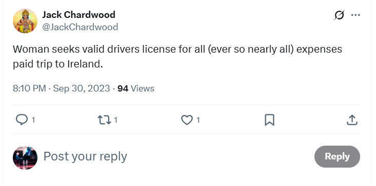](https://x.com/JackChardwood/status/1708197553483763859)

- You'd really have to know the whole backstory to understand that this message is suggesting that the trumpet teacher come with me to Ireland because I need to hire a car and don't have a driving license.
- I am in love with him after all, and we are having a relationship online.
- Salva mentions "going away for the weekend with your boyfriend" nearly every class after that.
- The class after I posted this tweet, a student comes up to me as I enter the choir classroom, and asks me grinning, "Are you going away for the weekend?"
- The girl (Elsa Martí García) is a piano student of Domingo. I suspect she's following his instructions.
- Her picture was posted on a fake account I received during continued cyber-stalking in 2024.

- Note the dog collar.
- This photo was sent the same time I was being bombarded with multiple fake accounts with pictures of women who were clearly being sexually abused in some way, or that was the inference one was supposed to make; including women [going from doing innocent photo shoots to doing porn](../2024/august.md#photos-of-abused-women-and-girls), and women [groomed from unwittingly sending nudes](../2024/september.md#another-upsetting-targeted-woman) into what looked to me like a sedated attack in a car with multiple people around.
- I was concerned enough to send the pic of Elsa to the Policia's trafficking email (which is supposed to be anonymous) in October 2024.
- I got a reply from Dénia Police which, at the time of writing, I have not responded to given their [total lack of interest when I visited them](../2024/february.md#policia-nacional) and my subsequent certainty, after two more visits to the Policia in Madrid, that I cannot trust them at all.

### Cannabis bar right outside the conservatory

- Sometimes when we are sitting in choir class, the room fills with the strong smell of cannabis.
- It's coming from the shop that's just opened right outside the conservatory where 100s of kids and their parents visit every day.
- I find it strange that the town would allow this.
- Salva often closes the windows because of the strong smell.

### Harmony

- Alfonso the harmony teacher seems to be only peripherally involved.
- Domingo’s students are still in the class with me and sometimes do or say curious things they’ve obviously been given instructions about.
- They're always on WhatsApp.
- No-one speaks to me anymore.
- This is remarkable, especially from Samuel who never stopped his friendly chatting and translating for me the year before, and walking home with me too.
- Now he sometimes politely answers a question I might have, but usually in no more than two words.

### Chamber music

- The music we play is extremely suggestive of what's been going on; i.e. operatic themes for two female voices in a love tryst with a man.
- It's clear why I was shepherded into this group in the [online meeting](september.md#chamber-music).
- We first studied a tune from [Norma](https://en.wikipedia.org/wiki/Norma_(opera)#Summary) where there is a dramatic love triangle between two women and a man, and the man has two daughters.
- I mean. Oh brother!
- At the end, interestingly, both women commit suicide.
- For my part, I am bravely playing my hand.
- I bring in [I know him so well](https://youtu.be/l30lsh0I3TY) from the musical Chess.
- [Katia](september.md#katia) remains angry with me, meaningfully.
- I see her waiting outside Ana Requena's room and talking with her. They're obviously friends, maybe!
- It's tiring to be constantly dealing with this infancy.

#### Katia in the act

- I guess they're not convinced she's doing a good enough job though.
- I receive activity from the following account posted right before chamber music class. 

- I understood it to mean that Katia was embroiled in the fiasco, but that was kind of obvious, I just didn't care that much.
- However, it does seems like the Google search results, and fake accounts, and therefore hackers, are sometimes on my side.
- Is it him? I wonder. Is he helping me?
- In retrospect, I suspect Hazel Smith probably thought I wasn't being tormented sufficiently. Or, they were setting up situations where I would feel like TT was on my side and helping me and so continue the 'romance' lie.

### Piano 

- Piano classes are good.
- Paqui does a good job of pretending she's neutral.
- I like her teaching style. 
- It's a breath of fresh air after Maria.
- It reminds me of when I studied with Joan Carles after becoming [totally fed up with Domingo in 2015](../early-years/2015.md#first-class-of-january).

## Porn and sexual arousal

- I start to see more and more porn online around this time.
- It comes up in posts on my X timelines, on fake accounts who follow me or interact with me. 
- Some porn bots yes, but with significant photos and meaningful comments in the profile.
- It's also on google search results.
- I start to feel a bit bombarded with porn.
- I see lots of cartoon images of a big muscular man having sex or lying down after sex with a small woman.
- I see similar photo pics of big men with small women in various sexual scenarios.
- I start to see a lot of artistic porn, a lot of fellatio.
- Some of the pictures are quite good, I mean well done and a tiny bit tasteful.
- For the record, please note that I don't like porn, at all.
- I know the porn is coming from hackers, and the frequency I see it is ramping up.
- Except I don't really know what's going on.
- I see multiple posts from accounts I have not followed that inform me of this.

- Indeed, the only way you could know what was going on is if you were aware of the Spanish cultural practice where a whole community targets a lone woman for some nonsense reason.
- It reminds me of how Spaniards saw the opportunity and rushed to get their neighbors killed in the civil war over jealousies and trifles.
- Except there's more now.
- Porn.
- I continue to feel overwhelmingly sexually aroused in my apartment at various times of the day, usually if not always lunchtimes. 
- I often masturbate.
- Am I being set up with visual triggers to match whenever I feel overwhelmingly sexually aroused?

## October 7th 2023

- It's a Saturday.
- I'm up early and on Twitter waiting for the usual stalker-game to begin.
- Suddenly, I see posts coming in from Israel, many of them with live-streamed video footage.
- I can't believe what I'm seeing.
- It's like I'm there.
- I tumble into a triggered trauma reaction when I see Naama Levy with her bloodied pants and slit ankles paraded around for all the jeering brutes to see.
- Everything changes at that moment.
- I realize that all the requests for money for Palestinian children I had seen on X over the last years were a scam. I'm relieved I never fell for it.
- I see a distressed family in their own living room, one of their children murdered, her siblings traumatized out of cognition; her father speechless, his hands covered in his daughter's blood.
- I see Shiri Bibas with her babies wrapped in a blanket, Ariel and Kfir, kidnapped by demons taunting her.
- I see the fear on her face, and I recognize it from my trauma history.

- Palestinians, civilians I heard, will murder them shortly after.
- Even though I don't have the full picture of what's happening to me in Dénia, at the level of my nervous system, I recognize that what I'm seeing online comes from the same source as that which is happening to me.
- In Israel, countless civilian barbarians are revealing their true nature for the world to see, while in Dénia countless Spanish and gitano barbarians are getting *as close* as they can to the same thing, and hiding themselves at the same time.
- Cowards! Each and every one of them.
- I later find out that the Jewish people in Israel on Sabbath, who could not look at their phones because of Jewish law, were wondering why the Arabs were looking at their phones so excitedly.
- Never again is now.
- I'm including a link here to some of the footage from that morning: https://www.hamas-massacre.net/.
- If you haven't seen it, look.
- I'm not going to watch it because unlike Greta, who thinks she already knows everything without having to look, I did look, while it was happening, and I saw enough to know.

- I felt like signing up to help the IDF.
- Hackers will have been watching along with me. 
- I wonder how they felt. Were they jeering along with their kind? Or could a spark of humanity have flashed across their twisted psyches?

## Strawberries

- I've always been sensitive, intuitive, and empathic; an easy target for bullies maybe.
- People who suffer early trauma, and especially those of us who have been sexually abused repeatedly, develop a kind of sixth sense.
- It's called hyper-vigilance in psychology parlance and it's part of the fight-flight-freeze-fawn cycle; i.e. if you know what you're attacker is going to do next, you are more likely to escape.
- Add to that a kind of clairvoyant ability I'm sure I got from my dad who I like to think descended from the Tuatha Dé Danann of ancient Ireland, and a few Irish gypsy influences in the ancestry, and you might forgive someone like me having rather strange experiences if they were ever to take any psychoactive substance.
- It's my belief that that's exactly what I was ingesting through the water mains and any food items that had been interfered with in my apartment.
- (I'm beginning to think that the water-mains thing is a red-herring to make victims look even more insane).
- Just over a week after October 7th, I'm sleeping. 
- Something drags me out of bed around 2am to write a very important tweet.
- The urgency is rather like the time I was dragged out of bed to write [a very important tweet declaring my romantic interest with TT in April 2023](april.md#disclosing-child-sexual-abuse-to-the-trumpet-teacher).
- In fact, looking back, I was dragged out of bed to write a very important tweet a lot while I was living at Carrer Furs, Dénia. 
- Could this be a subconscious reaction to sedated assault; an inner awareness something appalling has just happened and I need to do something about it, and all I have as weaponry are my words and thoughts?
- Here's the full tweet thread:

[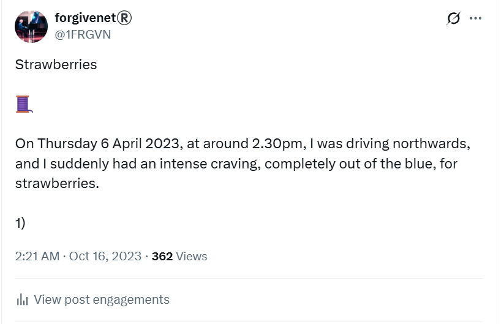](https://x.com/1FRGVN/status/1713726935371551010)

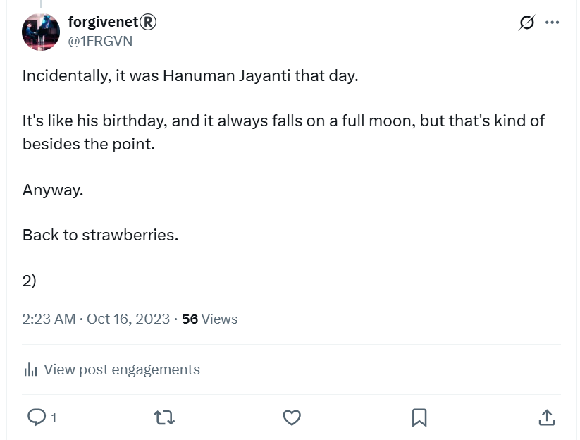

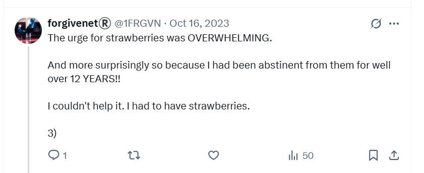

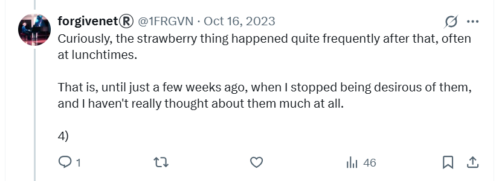

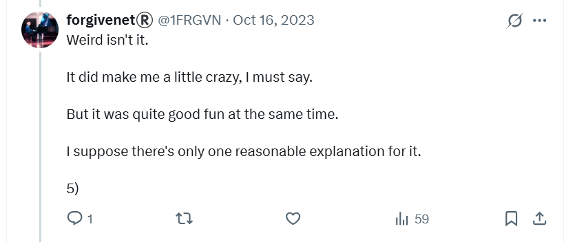

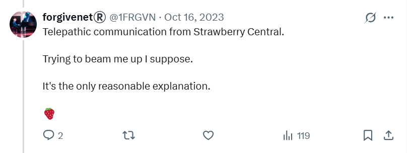

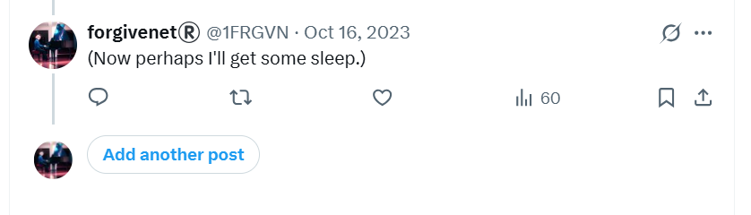

- And for good measure, an idea of how many times the first tweet was translated.

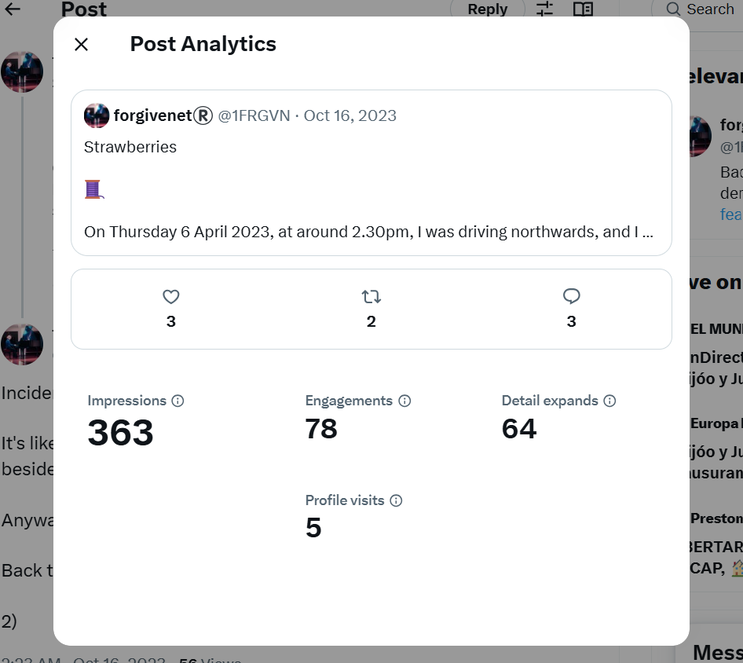
 
- It seems like there must have been a pause in the application of aphrodisiacs at that stage and I wonder if it was during [the time my friend, the Tibetan monk, visited](september.md#the-tibetan-monk-visits). Whenever there's a man around, the cowards tend to scurry away. Certainly, the overwhelming sexual urges returned shortly thereafter.
- I start to see strawberries on the ground wherever I walk.

- I'm pretty sure I've blown the mind of everyone watching.
- On my way to conservatory one day, as I pass [this spot](https://www.google.com/maps/@38.8442052,0.1081194,3a,75y,36.63h,77.57t/data=!3m7!1e1!3m5!1sB4ssIdTdFG6H4f6v4cNyeg!2e0!6shttps:%2F%2Fstreetviewpixels-pa.googleapis.com%2Fv1%2Fthumbnail%3Fcb_client%3Dmaps_sv.tactile%26w%3D900%26h%3D600%26pitch%3D12.43052595660501%26panoid%3DB4ssIdTdFG6H4f6v4cNyeg%26yaw%3D36.626678552174724!7i16384!8i8192?entry=ttu&g_ep=EgoyMDI0MTExMy4xIKXMDSoASAFQAw%3D%3D) on the Carrer de Manuel Sanchis Guarner, there's a strawberry on the ground.
- At the same spot, I see the fat bloke in a vest that had been behaving extremely strangely when [me and my Tibetan monk friend](../2023/september.md#the-tibetan-monk-visits) were at the beach. 

### Tweeting about being spiked in 2007

- The energy of the events around this time reminded me of events from the past. I also suspect the energy of the people around me was influencing me, even though I was not consciously aware of who they were outside of teachers and staff at the conservatory.
- It must have been curious for the stalkers to see me tweet content which suggested I knew, at least a little bit, about what was going on more broadly.

[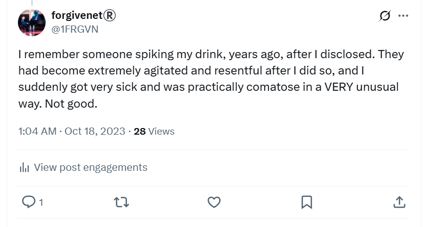](https://x.com/1FRGVN/status/1714432159425925547)

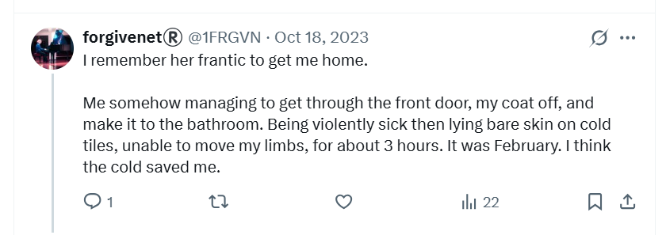

- I say three hours here, but it was much more. I wasn't able to get into bed until the sun had come up which would have been around 8am in November.
- Compare the above with [my experience in 2007](../early-years/2007.md#hazel-smith).

## Rocio Vidal

- In the Google search results of `@jctot19 x` I start seeing a photo of [Rocio Vidal](https://www.youtube.com/@LaGataDeSchr%C3%B6dinger), a famous YouTuber in Spain. 

- There's a sadness in her expression.
- The photo is still there, even today; (check the commits for the time of writing).

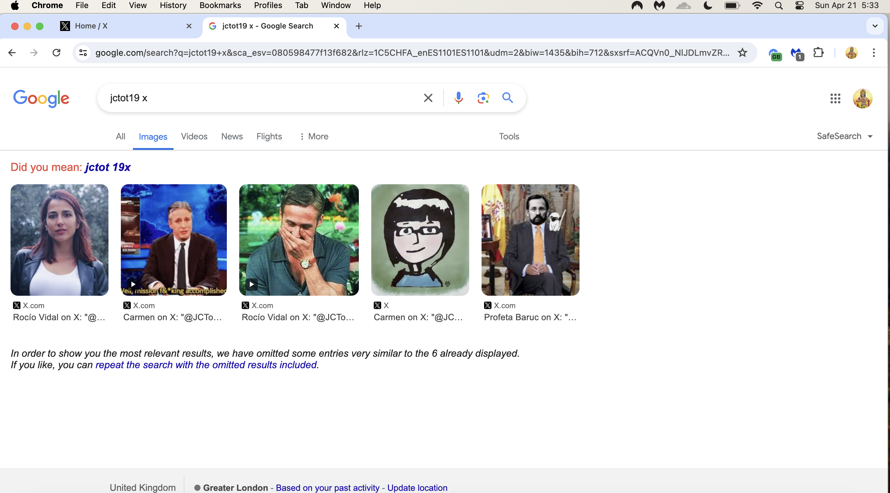

!!! tip "Hair and make-up"
    - Has she just been in hair-and-makeup, before a shoot?

- In October 2024, I was reliably informed by a government official that Rocio Vidal was seriously hacked.
- On fake account activity in the summer of 2024, I see photos of Rocio, sitting on a bed, looking up at someone who is filming her. 
- She has her fingers around her vest strap and it looks like she is about to take off her clothes.
- I'm reminded of [plate lady](july.md#plate-lady-early-in-the-month) when I see this, although the difference is, it looks like Rocio is doing what she's told.
- When I was examining the `@jctot19`, `@sinremite`, and other account activity back in July 2023, I noticed a lot of activity and communication between those accounts and Rocio Vidal's X account `@SchrodingerGata`.
- Interesting, isn't it.
- Another thing which is quite interesting is that when I was in Cauterets in September 2024, ostensibly fighting for my life, [I thought I saw her](../2024/september.md#rocio-vidal) at the Bistro du Boulevard with a bunch of Spaniards around lunchtime one afternoon.
- This was the period I realized I could do nothing online without ill-meaning and unseen eyes being aware of it, and I was busy writing letters by hand to as many people as I could.
- I was also continuously sexually aroused at that time, all the way up in the Pyrenees, and my online activity was infested with porn.
- I was also having an extremely intimate conversation online with stalkers; one of whom I considered to be the trumpet teacher; the man I love.
- The woman I saw was standing up in the crowd as if to point herself out; the others, mostly men, sitting down around her.
- Was it important I saw her?

!!! tip "Thoughts"
    - Is it possible that successful business women might agree to do porn, for free probably, so that their businesses won't be shut down by hackers, or for some other financial reason?
    - Is this yet another teat for cowardly men with no lives to suck on?

## Telecommunications shop

- I decide to try and get my old mobile phone fixed so I can use it instead of the one they obviously have access to.
- I go to the telecommunications expert at Mobile Express C/ de Diana, 24, 03700 Alicante Spain which is run by Chinese people.
- As I approach the shop, a guy I have seen at the conservatory a lot comes out of the shop.
- I don't know who he is but he's always around, at the conservatory and in the street. 
- I assume he is the one who has been hacking me and I start to wonder if he works as a technician at the conservatory.
- Inside the shop, the Chinese guy clearly recognizes me as he can hardly stop smiling at me.

!!! tip "This may be nothing but..."
    - As I was searching for the address of the shop, I looked up experts, and this [name came up](https://www.einforma.com/informacion-empresa/lopez-moreno-juan-david).

## My car is damaged on the Montgo

- I go walking on the Montgo, the mountain that overlooks the town, on Saturday 14th October.
- Usually I go to the top, but something told me to come back early which I did. I'm unusually concerned about my car.
- As I'm coming back, I bump into a good-looking man who has three large hunting dogs with him. I'm about 5 minutes away from my car at that point.
- As I get into my car, I notice the people at the gun club looking at me in a strange way.
- I do my shopping and go home.
- The following Saturday I go to use my car again and I notice a scratch all along its left side, clearly done purposefully.
- The only time that could have happened was the Saturday before.
- I'm furious.

## The gypsy glaring at me

- I'm walking one Saturday along the Las Rotas beaches.
- As I approach a parked car, I notice a man in the driving seat staring at me, glaring.
- He looks ridiculous and I smile at him. He flinches.
- I recognize him from somewhere.

## First letter to the Generalitat

- Letters to the Generalitat Valenciana have been appearing on Google search `@jctot19 x` and this puts an idea in my head.
- I would rather leave the police out of things unless it got extremely serious.
- I decide to write a letter of complaint to the Generalitat.
- I look up all the important people I can find and send it to them via email. 

    - [Letter in Spanish](../../content/documents/letters/3.%20Letter%20to%20Generalitat%20of%2022%20October%2023%20-%20ES.pdf).
    - [Letter in English](../../content/documents/letters/3.%20Letter%20to%20Generalitat%20of%2022%20October%2023%20-%20EN.pdf).
    - [Proof of sending](../../content/documents/letters/3.%20Proof%20of%20first%20emailed%20letter%20to%20Generalitat%20Octo%2023.png).
    - [List of recipients](../../content/documents/emails/list-of-recipients.png).

- I receive no reply at all, ever, not even a notification that my letter was received.
- In fact, I write again, a few times, to the GV and I never receive any reply from them.
- Given the seriousness of what I'm saying, it's more than weird that no-one replied to me.
- On the `jctot19 x` Google search results, a picture is displayed with a trampoline at the bottom of apartment blocks which I take to mean that Domingo is very upset.

## Hazel outside the conservatory

- I was talking about how it is often not a good idea to disclose child sexual abuse to people who aren't ready to hear it because they might attack you: https://x.com/1FRGVN/status/1714432159425925547.
- You may remember the reference from [earlier in 2007](../early-years/2007.md#hazel-smith).
- I was leaving the conservatory not long after that, and she was outside with a man.
- It's interesting because I never once mentioned her name on Twitter or any details that anyone except her would recognize.
- So I was certain then that she was involved in the current gang stalking. I wonder if she has been involved in the ongoing spiking/poisoning, or even the 2014 threat of poisoning from Domingo. It's certainly worth considering.
- Is it possible that the most evil people in a small town could have been introduced to something so abhorrent, but yet utterly addictive, which gave them utmost power over everyone? Is that the underlying nature of this story? I hope not, but I would not be surprised if it was.

## The petty tyrant

- https://x.com/1FRGVN/status/1715795337489637651

## Giving my trauma-therapy card to Domingo at the fruit and veg stall

- TODO:

## Halloween

- Alex, John, Paul, and I agree to go out for Halloween, a kind of remake of our evening all those years ago.
- The whole town knows I'm coming out but I was never clear about that on Twitter.
- I'm stopped for photos as I walk to the bar where we're going to meet.
- Prior to arriving, John has appeared a little fearful and wanted to go and find the tail I had lost from my cow costume. He said, "why don't you come with me Katie". What was he afraid of?
- The others lead the way and we end up in the Irish bar on the Calle La Mar.
- Once inside, we "bump into" this very dodgy French bloke who says he studies guitar at the conservatory and wants to know things about me. 
- I turn to Alex and say; "Sometimes it takes an outsider".
- A young man with him dressed as the joker is quite menacing towards me.
- I sing a song, a cockney song, You Made Me Love You, which blows their minds a little.
- Alessandra tells me later, a few times, that the French man had wanted to know about Halloween in 2007 and whether I had a ukelele and had sung Back to Black.

## Tweets

These are a selection of tweets from this period which relate to everything that has been happening. Most of them have been translated, a lot, so I assume the Spanish are reading them. Many of these tweets are confirmation of what has been going on.

!!! important
    - I'm realizing everyone is reading my tweets. I don't know how as I don't get all that much activity on them but everyone seems to know everything I've said.
    - A lot of my tweets have the intention of flushing the audience out, to see how far my reach goes.
    - I find out literally everyone in the town knows everything about me, and every tiny thing I've said online, and likely a lot of lies too because they all hate me.

### @1frgvn

- https://x.com/1FRGVN/status/1719116928617197916
- https://x.com/1FRGVN/status/1716371097128509890
- https://x.com/1FRGVN/status/1716087374759723455
- https://x.com/1FRGVN/status/1716069851888820287
- https://x.com/1FRGVN/status/1716068786313236773
- https://x.com/1FRGVN/status/1716028186289488047
- https://x.com/1FRGVN/status/1716068390735900850
- https://x.com/1FRGVN/status/1716066923631280635
- https://x.com/1FRGVN/status/1716065908488040538
- https://x.com/1FRGVN/status/1716066748456149202
- https://x.com/1FRGVN/status/1715729380352184352
- https://x.com/1FRGVN/status/1715795337489637651
- https://x.com/1FRGVN/status/1715789335658651794 -> re: 12th June 2023 psychological attack at the conservatory.
- https://x.com/1FRGVN/status/1715789145857990764
- https://x.com/1FRGVN/status/1715776669603041593 -> re: 12th June 2023 psychological attack at the conservatory.
- https://x.com/1FRGVN/status/1715776355630043269
- https://x.com/1FRGVN/status/1715751496480936129
- https://x.com/1FRGVN/status/1715741021655466380 -> my first and only reference to poisoned aunts.
- https://x.com/1FRGVN/status/1715735176062394796
- https://x.com/1FRGVN/status/1715734508132053031
- https://x.com/1FRGVN/status/1715733466585669913
- https://x.com/1FRGVN/status/1715730699653660878
- https://x.com/1FRGVN/status/1715729380352184352
- https://x.com/1FRGVN/status/1715585631022207058 -> certainly at the conservatory this was true.
- https://x.com/1FRGVN/status/1714577639233515681
- https://x.com/1FRGVN/status/1714433682046349597 -> talking about my Tweet post in Spanish from April 2023.
- https://x.com/Lucyinbetween -> major player that followed me immediately I went public. I have interesting DMs with this account that include identification documents when it tried to prove who it said it was. Easy arrest probably.
- https://x.com/1FRGVN/status/1713298033910202647 -> referring to old friends Alex, John, and Paul out on Halloween.
- https://x.com/1FRGVN/status/1713292202674127032 -> mentioning I'll be taking the Uke out.
- https://x.com/1FRGVN/status/1713262652103819341 -> reference to the table again.
- https://x.com/1FRGVN/status/1712815203421688307
- https://x.com/1FRGVN/status/1712456797456359427
- https://x.com/1FRGVN/status/1711299138397032596 -> taking the piss out of muscle men, aka Domingo.
- https://x.com/1FRGVN/status/1710938372728885413
- https://x.com/1FRGVN/status/1710594308020084863 -> replied to by Matthew, the account that is pretending to be the trumpet teacher.
- https://x.com/1FRGVN/status/1710030138459484321 -> in reference to Matthew.
- https://x.com/1FRGVN/status/1708534848803971249 -> weird convo with Matthew.
- https://x.com/1FRGVN/status/1708504153788420212

### @JackChardwood

- https://x.com/JackChardwood/status/1712835795491459181 -> responding to the trumpet teacher who posted a picture of a famous man looking "pleased with" a woman after I posted the muscle tweet.
- https://x.com/JackChardwood/status/1711647385347145762 -> mentioning the gypsy serenade.
- https://x.com/JackChardwood/status/1711512447046062086 -> response to Tweets inexplicably coming up on my timeline saying, "he's just a baby" which was a common phrase in all this.
- https://x.com/JackChardwood/status/1711409585485906091 -> explaining how I feel about it all at that moment.
- https://x.com/JackChardwood/status/1711363060579942748 -> during the muscles tweet business, I posted this. The hacker posted immediately at tweet on my timeline which said "not a foot wrong". 
- https://x.com/JackChardwood/status/1711149172072603930 -> comment to hacker.
- https://x.com/JackChardwood/status/1711132004924670337 -> comment to hacker.
- https://x.com/JackChardwood/status/1710694553353609441 -> trying to figure it out. A post goes by about Mac spoofing.
- https://x.com/JackChardwood/status/1709967390979534933 -> regarding a response from hackers.
- https://x.com/JackChardwood/status/1709913077339025790 -> message to any of the bullies who may have a heart.
- https://x.com/JackChardwood/status/1708837976413724886 -> thought the hacker had messed with my crypto app, he complained, turned out he hadn't, he responded to this also. Always fake accounts with a message in the name, or first tweet, or profile.
- https://x.com/JackChardwood/status/1708819182798643206 -> trying to turn him.
