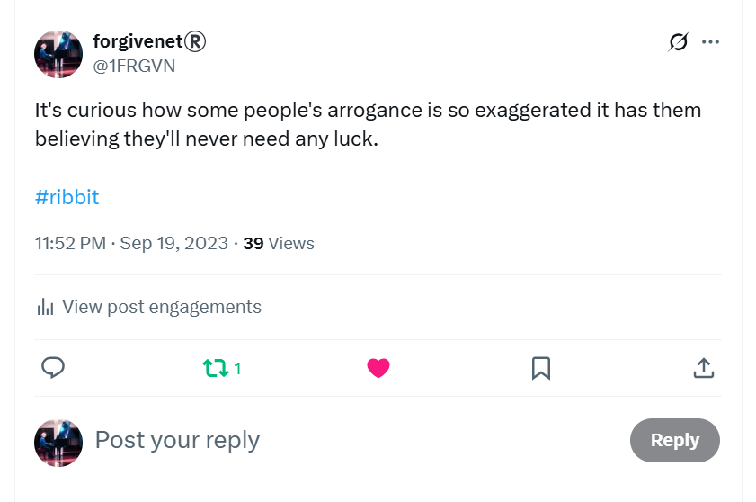
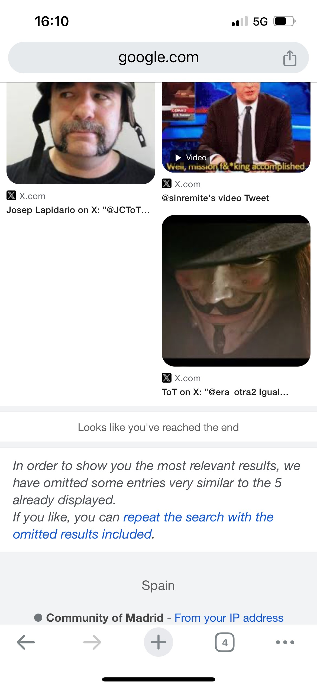
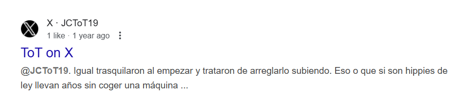

# September 2023

## Praying at Cauterets

- On Friday 1st September, I'm thoroughly convinced something bad is going to happen to me when I return to my home in Dénia.
- I offer Domingo trauma healing sessions on X in return for safe passage in Dénia.

- I also go to the church at Cauterets to pray with Sally.

- We discover that Sainte Bernadette came to Cauterets to take the cure three times, and she visited the church often to pray.
- There is a little altar set up for her.

- I get goose bumps.
- Before I head off to Spain, I go to the grotto at Lourdes to ask for Our Lady's protection from evil men.
- She supplies.

## Going public on Twitter

- I'm on my way home. 
- I will stop for one night in Zaragoza because it's a long drive.
- I don't know what to do. I'm extraordinarily stressed and anxious.
- I feel like parasites are running all over me and I can't get them off. 

!!! tip "Parasite baths"
    - I still feel like this in May 2025.
    - I've kinda got used to it because I've had to accept that this is no ordinary situation.
    - God's got my back though.
    - I hear that crows use this sort of thing for positive outcomes.
    - So will I.

    

- I believe the intensifying harassment and terror is because Domingo and his associates do not want me to return to Dénia.
- I feel that something awful is going to happen to me on Monday 4th September at home in Spain, possibly that I will be arrested but I don't know what for.
- It is exactly the same way I felt when I thought was [going to be arrested and go to prison for 7 years](july.md#the-first-time-i-become-terrified-about-being-arrested) in Thailand.
- It is also the same feeling of dread I experienced on the weeks of run-up to [chamber music class on 12th June](june.md#monday-12th-june-2023); my 'funeral' apparently.
- There had always been an online suggestion that I was targeted for my gender critical beliefs.
- I suddenly remember that there *had* been a girl who thought she was a boy at the conservatory, and her name was indeed Silvia.

- I put two-and-two together and make an assumption that I'm going to be arrested for my *transphobic* views on Twitter which teachers and staff at the conservatory have been sharing with everyone in the town.
- I make an initial plea for help before I leave Cauterets for Zaragoza.

- I really believe I am in danger.
- When I arrive in Zaragoza and settle in my hotel room on Saturday 2nd September, I tweet about my feelings of threat and dread so there will be something in writing which may serve as an explanation if anything does happen to me.

- I remain unsettled and anxious.
- I go to bed scared.
- Something pulls me out of bed about an hour later.
- I'm so concerned that something bad is going to happen to me, I go public on X which means I add my real name to my account, Dr Katharine Murphy.
- I then ask for help again.

- The tweet goes viral.
- Overnight I gain 1000s of followers from the gender critical movement. 
- I feel much, much safer.

### New followers 

- A great many of these new follower accounts are fake accounts managed by cyber-stalking criminals.
- So, although I was safer in some respects, I was in more danger in others.
- Some of my new followers have [profile pics of the faces of teachers and staff](../../crimes/protagonists.md) at the conservatory of Dénia.
- From this moment onwards, the English language of the stalker accounts becomes fluent, native, and vernacular. 
- In retrospect, I'm convinced this is when [Hazel Smith](../early-years/2007.md#hazel-smith), her family, the wider British gang membership, and her local English-speaking associates, such as [Patricia and Christine](../2022/november.md#walking-in-benijembla-with-the-english-ladies), step in.
- I guess many more criminal gang networks operating on social media were alerted to my presence and vulnerability.
- In September 2023, however, I have no idea Hazel and Sandra Smith are involved, and have been involved in the story since [2006](../early-years/2006.md#september). This key to the story starts to come out in a rather curious way about a month later.
- At the time, I believe the wild interest on my *tweet-for-help* and the sudden 1000s of followers I gained were mostly genuine. 

## Immature boy, bad companions, or both?

- When I finally arrive home to Carrer Furs 15 on Sunday 3rd at around 5pm, one more fake account has followed my `@jackchardwood` X account: **kaka**.

- I've pasted the full profile in the [August twitter doc](../../content/tweets/august-2023-twitter.pdf).
- *kaka* or similar is a way the cyber-stalkers refer to me; even the choir master in year 4 of professional studies will do so blatantly to my face.
- The profile message is very interesting.
- I suspect that someone got momentarily concerned about the ramifications of what had [been happening online](#going-public-on-twitter), and were worried about officials getting involved.

- It seems like a message intended to deflect the blame off Domingo Cano Lopez and onto unknown associates.
- The message is completely opposite to the very intentional terror I was experiencing online only days before, and over the previous 8 months, which told me something very different indeed.

## Shunned by international feminists

- Well known feminists reach out to me on X to see if they can help.
- I cannot be clear with them about what the Dénia hackers are going to do because it is all suggestions from ramped up threats online.
- I explain I've been terrorized for nearly a year by teachers and staff at the conservatory, and had been relentlessly harassed and stalked online too.
- They decide unilaterally I'm lying and that I'm not to be trusted.
- One woman upsets me enormously by telling me, "you're not being hacked", as if it's all in my mind. She then tells me I'm lying and I should get help! 
- This was extraordinarily triggering and so unbelievable I started to think that the woman I was talking to was not who she said she was. 
- I still wonder I'm so flabbergasted.

- I realize that feminists can be as misogynist as everyone else. I knew that anyway.
- Nevertheless, it was extremely upsetting and eyeopening.

- I will meet some of the Spanish feminists who were involved in discrediting me in [April 2024 in Madrid](../2024/may.md#madrid) when I tell my story at [Let Women Speak](https://www.youtube.com/watch?v=l9X6o11IwBc).
- I'm told that people thought/were told I was an unbalanced, domestic-violence victim and for that reason my request for help was ignored and I was discredited.
- I'm agog!!
- I find out recently that some of those feminists have links to Spanish misogynist networks that would have been extremely keen to keep what's been going on in Dénia, and no doubt elsewhere, very quiet.
- I guess they were just doing what they were told, like *good* women do, and were believed by everyone else.

!!! important "Full disclosure"
    - Contact me for full access to any emails, letters, documents, etc.

- I continue to send the Raquel account updates, including copies of police statements.
- I'm ignored.
- It seems to me that the possibility of a lone woman being terrorized by a whole town is common knowledge in Spain, accepted and protected; just normal daily events for a deeply misogynist culture.
- Protecting the gangs might have worked well for women prior to the porn-epidemic with growing pedophilia requirements alongside the mass access to home networks of unsuspecting victims.
- Remember. *Everyone* knows me in Dénia. 
- I myself know hardly anyone.

## Dénia townsfolk are informed of their latest female target, me

- I believe that, at this point, and given I went to practice immediately at the conservatory after arriving home, multiple people in Dénia are informed about me, photos of me are disseminated so I'll be recognized, and everyone is told that I am their next target for relentless gang-stalking, cyber-stalking, gender-violence and abuse.
- I can only assume that my total destruction is the town's intention.
- My location and whereabouts, coming from my hacked mobile phone, is also shared.
- I expect all this information, including my tweets, is posted on local WhatsApp groups amongst 100s maybe 1000s of people.
- It's possible that [child rape porn with me in it](#table) has also been shared with the townsfolk. This could very well explain the fear and loathing, and utter contempt offered me from nearly everyone I meet.
- You can imagine the owners of these WhatsApp groups being the bravest men in the city! The men that everyone worships fervently.
- I suspect that even more private information and photos of me are shared with the predatory sex-addict inner sanctums, with some local women being aware of this too.
- Not only that, but I suspect that some of my tweets are forged to look like I've said horrible things I never said.
- People I've had minor arguments with over the last 20 years are wheeled out to support the mass attack.
- I often wonder if anyone was aware I was being drugged and filmed in my apartment, and that I had a very big problem with the lack of child safeguarding at the conservatory.
- It seems to me they all had to know and they really just don't care.
- It seems that the people of Dénia are happy to sacrifice their children.
- The sacrifice of women must be a traditional pastime, but children? It's hard to get your head around it.
- Suffice to say, I begin to feel like Edward Woodward in the Wicker Man.

## X.com

- The following section lists some of the more interesting tweets from this period.

### `@1frgvn`

- This is a report on the times I saw the trumpet teacher in the Peugeot. Once, on [June 11th](june.md#sunday-11th-june) and again later in the month with the [doctor at the beach](june.md#the-trumpet-teacher-and-the-doctor-joan-drive-past-me).

- Given I'm being discredited massively, I try to defend myself a little.

- I'm sure another crucifixion is coming up, just like my first on [12th June 2023](june.md#monday-12th-june-2023). My consequent resurrection is encouraging to me, I must say.

- I remain astounded at the behavior of teachers and staff at the conservatory.

- The online support I received was miraculous and my stress levels came down and my nervous system had a short time to repair.

- I continue to try and explain what's been going on and why I'm scared. It's only over a year later I start to realize I've been subject to some kind of manipulating hypno-tech used by criminals, terrorists, pornographers, pimps, and honey-trappers which is often reinforced with drugs.

- It's hard to understand why feminists would dismiss me unilaterally.

- Someone wants to know why I hadn't contacted the major feminist organizations in Spain. It wouldn't have been worth the upset at the time. Eventually I did and I was unilaterally ignored by everyone, even when I was telling them I was being poisoned. No-one, including police, wanted to know.

- I deliberate with new X contacts about how the hackers got into my devices.

- I continue to wind-up my stalkers.

- On 7th September I report the fight within me again (in reply to a stalker account).

- Wondering why these men are so unwell.

- I often take the opportunity to remind these people that God's in control of it all.

- I tell them about the true romance in this story, often.

- I tell them what I think about the brutes, as often as possible.

- A commentary on the worst misogynists of all: feminists.

- I ask the online tarot to describe the relationship I'm having with the trumpet teacher and tweet and post this pic regularly on my X profile.

- I comment on the nature of Spanish misogyny.

- Here's a message for the pedo's who are benefitting from the outrageous behavior of teachers in Spain.

- A reminder for anyone supporting the obliteration of safeguarding for children at conservatories in Spain.

- There's always the option for redemption.

- Someone evil and local conversing with me; checking to see if I'm aware of how stalked I am, I guess, and whether it affects my honesty and integrity maybe.

- I'm still talking about the child sexual abuse I suffered, and what it does to the mind, and how you always remember but it may take time.

- I take the opportunity to remind everyone why I built my crypto app.

 
- Sexual abuse is a collective trauma and we're all in it together.

- Looking to the future when their own faeces will all hit them in the face spectacularly.

- Reporting how many times I fell in love that year, and with whom.

- There is so much 'teasing' (I'd call it terrorizing) by what seems to be hundreds of people, I'm reminded of a scene from Close Encounters.

- I always had my suspicions about the homeopath Ana. 

- I remind everyone from time-to-time that I have provided a way for them to ask forgiveness.

- I'm not the only woman who is discredited when she goes public.

### `@jackchardwood`

- I wish the hacker "Good luck getting paid". My experience with Domingo in 2015 was that he was extraordinarily tight-fisted. On our trip to London, he had done everything to avoid paying a 6 Euro toll on the road - I had paid the other one. I imagined anyone hired by him would struggle getting paid, and whoever it was was clearly a professional.

- I tweet more job offers for the [forgivenet](https://1frgvn.com/).

- I'm clearly starting to realize something wasn't right about the overwhelming sexual arousal I felt in chamber music class. I can't put my finger on it precisely, but I'm thinking about it and I'm starting to see through the deception.

- I call the hacker "donnie boy" after the Donatello character I keep seeing pop up on my X feed which is clearly meant to be him. This tweet is another job offer and concerns [Smurf cat](#smurf-cat), an extraordinary online admission that I'm being watched, followed, stalked and obsessed over online by countless people in the town.

- This tweet is offering an all expenses paid trip to the trumpet teacher. I'm reminded about this constantly at the conservatory by teachers, staff, and students, as if it is something to be embarrassed about.

- I suspect they may have taken me up on it had so much time not passed, and because it was obvious I could tell the difference between the man I loved, and [the man who intended to do me extraordinary harm](june.md#sunday-18th-june-alicante-airport), even if they had set it up for me to believe these two people were the same.

- It seems to me their main targets must usually be young and innocent, without a whole life of experience behind them, a turbo-powered empathy, and a rock-solid spiritual practice.

## Google search

### Generalitat letterheads

- On the `@jctot19 x` results, I see multiple photos of documents with the letterhead of the Generalitat Valenciana.

### Table

- On search results for `@1frgvn x` I'm shown multiple pictures of tables; literally every result is a table of some sort for a few days.

- I mention this in the [Carmen](july.md#carmen) section from July where I talk about the `@sinremite` account.
- The same thing happens with [sinks in April 2024](../2024/april.md#let-that-sink-in), i.e. *let that sink in*, when I fear for my life and leave my studies after the most [outrageous psychological assault involving someone dressing up as my murdered friend](../2024/march.md#tuesday-12th-march). Then again in April 2025 when I only see photos of refrigerators and show my mother.
- I have no idea why and puzzle over it.
- I come up with something. 
- I remember Domingo's mother's table at their flat in Pedreguer. 
- He had taken me there under the pretense of the flat being for sale and showing it to me in case I wanted to buy it.
- It was a huge table. 
- Domingo had called it her *caprice* and he suggested his father had been furious about her purchase.
- I tweet my assumption that the table refers to where the family meets to decide what they're going to do about me.

- I'm very wrong about this.
- In January 2024, when I buy a therapy table for the first time, I tweet about my new table and how everyone is invited for therapy on the table.
- A post comes up: **"I'M NOT DOING THAT!"**.
- It makes me wonder.
- After the second or third time I see flashes of [porn of myself when I'm 16](../2024/january.md#i-see-my-naked-16-year-old-body-on-x-again) on my X feed, I remember I *had* told the police about a table in my police statement from 2015.
- Perhaps I'm lying sedated on a table in the porn films, with a group of black men standing around me, raping me.

- If so, how do the people of Dénia know about this, and are they posting tables on my Google search results to let me know they have shared these films with everyone in the town?
- Is this why Domingo took me to see his mother's table in Pedreguer all those years before; to see if it would trigger a trauma memory which he could use to try to control me again?

## The evil eye

- On Monday 4th September, I go to the supermarket, Mercadona, five minutes walk from my house.
- A car pulls up alongside me and drives slowly, the driver and the passenger, a man and a woman glaring at me angrily.

- I tweet about it.

- This is the beginning of a *new normal* for me.
- I experience similar activity from random people I don't know every time I leave my house from this moment until I leave the town with my toxic belongings in February 2025.

## A hacker takes control of my mobile phone

- The following few days after I arrive home, I notice men outside my apartment on the street hanging around fiddling with handheld devices.
- I believe they are accessing my network somehow.
- On Wednesday 6th September, I am talking with my friend - a Tibetan monk - on my mobile phone through WhatsApp. 
- I'm explaining to him what's been going on and how scared I am, and he suggests he comes to visit me.
- I say yes, please do come.
- At that moment, I lose control of my mobile phone completely. Every key I press, does something entirely different. The whole screen is scrambled.

- I turn off the router and regain immediate control of my phone.
- I believe the activity outside my house was to *get me to think* that hackers are external to my network, when in reality they gained access to my devices directly through the router, with Mac spoofing or similar, using information known only to either the telecommunications company, Telco, or the ISP itself, which at that time was Yoigo.

## Rosa Vidal follows me around

- Whenever I walk into Dénia over the next few weeks, I see Rosa Vidal, Director of the Conservatory of Dénia.

- She often nearly bumps into me, or walks right in front of me, but she never says hello or acknowledges me.
- She seems to be doing it on purpose.
- If so, she knows exactly where I'm going to be at any given moment.
- On one occasion I go to the organic store on a Sunday evening and she is sitting outside the door of the shop.
- I see her as I'm walking out. She looks at me but again does not acknowledge me.
- Sitting next to her is a man resembling the trumpet teacher. 
- He has [his back to me](../2022/december.md#choir-concert).
- I feel frightened and I hurry away as quickly as possible.

## Sexual arousal

- I find myself overwhelmed with sexual arousal again, usually while I'm sitting in my flat using the laptop and often after I've just made some tea.
- I believe it is because I'm in love with the trumpet teacher, and that it is true love.
- I have no idea there are at least three trumpet teachers, and only one of them I love, and it's not the one I see with [his back to me](#rosa-vidal-follows-me-around) on countless occasions.
- The sexual arousal is so overwhelming, I masturbate at home; sometimes in the bathroom.
- It can feel like there are people, men, in the room with me while I'm masturbating. I can't explain this.
- On Google search using the search term `1frgvn twitter`, there are a handful of porn links in the video section with photos that remind me of myself masturbating; women in postures I might have been in, or figures with sheets over their heads in porn references that remind me of the position I was in when I was masturbating in bed under the covers.
- It's disturbing and I'm shocked.
- I don't make the obvious connection at that time.
- I don't realize that people are watching my every move so I wonder if they maybe heard me masturbating through my hacked mobile phone.
- I tweet about how I am doing a taoist sexual practice at home in an attempt to justify the masturbating noises, or whatever it was that made them know I was masturbating at home, because it makes me feel *intense embarrassment* to think that someone knows what I'm doing in private in my own home.

- The taoist sexual practice is something I used to do years before when I was trying to heal myself from the effects of child sexual abuse.
- Nevertheless, I am concerned about hidden cameras and so I take steps to hide myself if I am masturbating in the bathroom.
- In just a few days, I will need to call [a handyman to fix something random](#a-handyman-tells-me-exactly-how-much-everyone-hates-me) in the bathroom.

### A man I recognize

- I'm leaving my flat to go to the conservatory one afternoon after lunch.
- As I leave the door to my building, I see a man walking towards me. He's fat, not very tall, about 50, and has long black hair.
- I feel like I know him, intimately.
- He looks at me like he's trying to avoid eye contact, and he's stifling a smirk.
- He is one of the men [I remember being in the bathroom with me](../../crimes/poisoning.md#dreams-and-visions), it seems like in a dream.
- He looks like someone I see often on the `@jctot19` search results.

- This guy came up in results for months. He seems to have some dubious sexual predilections. In one pic of him, a Spanish woman who looked a little bit like Ana Requena stood beside him with her arms locked up in bondage gear.
- In his profile pic, you can see another example of a bound woman in an embrace.

- I guess this was another example of the continuing threats to my safety and wellbeing that I wasn't really understanding - apart from the obvious threats - as the whole thing was just too far fetched for my rather innocent mind and naïve good feelings for everyone.

## Problem with my car

- The caretaker at Carrer Furs, Pedro, informs me there is a leak in my car washing fluid. 
- I see the blue liquid all over the floor in the garage under my car's front-left wheel.
- Pedro complains that he is having to clean it up every day. 
- I think it is to do with a small bump I had on the road in France.
- He suggests I take the car to his friend who is a mechanic. I'm reluctant.
- I tell Pedro I'm being bullied by teachers and staff at the conservatory and that one of the piano teachers, Domingo, is behind everything.
- He hugs me.
- Instead of going to his friend, I take it to a garage in Javea: https://autocentermarinaalta.com/.
- Incidentally, I had asked Christine for a recommendation on a garage in Javea where I could take the car that might have a waiting area.
- She said she didn't know anywhere, which I found weird when I found this obvious place which gave me a great service the year before.
- Turns out this is where she takes her car.
- I had asked Christine because I was convinced I would not be able to take my car anywhere in Dénia safely.
- Domingo's dad, he told me years before, is in the car business.
- I wondered if I met his dad in 2012 when I had a flat battery at the time I lived in the Passeig Periodista Ramon Ortega.
- If so, that would mean his dad worked at Auto Recambios Dénia, Teulada 2, the place an ex-boyfriend recommended to me years before in 2009.
- I see the same man I met in 2012 sitting in in a car outside my flat in an aggressive and threatening manner in [January 2024](../2024/january.md#threatening-men-outside). 
- He has big goggle glasses, just like Domingo.
- In Javea, I wait all day. 
- They do nothing at all, they tell me there's no problem, and they charge me 50 odd euro for the inconvenience.
- I see the blue liquid leaking out immediately.
- I realize I cannot take my car to any garage within about 100 miles radius, or more.
- It turns out that there was [nothing wrong with my car](../2024/april.md#leak-resumes) and no leak. 
- I can only assume that someone was tampering with my vehicle without my knowledge.

- This may add credence to my later suspicions that a mind-altering substance had been added to my car ventilation system.

## Pedro ogles a tourist

- The building I live in is packed full of AirB&B type properties.
- This means that many of the people at the pool are tourists; visiting for the weekend if they're Spanish, or a week or two if they're foreign.
- Outside of the hot weather, the building is nearly empty.
- One afternoon, I'm coming back from practicing the piano and I see Pedro painting one of the metal gates of the swimming pool.
- He is staring intently at a woman in the pool.
- She is foreign, slim, and blond, and is Scandinavian of some sort.
- She is with her small children. It looks like she has no man with her.

- It's really embarrassing the way Pedro is looking at her, he's ogling her like a pervert, in a most exaggerated way.
- She looks really upset and I would not be at all surprised if she complained, and that had something to do with why he was fired.
- I tweet about this at some point (I'll find the tweet soon).
- I now wonder if this is not the only manner in which he has been ogling her.
- Are all the rental flats in the building on the Carrer Furs wired up for spy-cam porn, I wonder?
- Does Pedro know everything that's going on in Carrer Furs? 
- Is that why he was so keen to get me alone with him, and perhaps tampered with my car to make me believe there was a problem?

## The water pipes

- Pedro the caretaker had always been somewhat over-keen to tell me about the water pipes coming into the flat, and how they were broken.
- He seemed concerned that if I didn't shut them off when I was away there could be a flood.
- I had raised this with the landlady in July 2023 when I was going away for the summer, but she ignored me.
- I raised it again with her in 2024 on WhatsApp, and I sent her a picture too saying that even when the water pipe is shut off, it still runs into the apartment. 

- She replied "perfecto", and ignored me again.
- On the day Pedro was fired, and he was showing the new caretaker around the apartments, he again took pains to tell me that the water pipes were not only broken outside my door (shown in the pic above) but also at the ground floor level where the mains water is distributed to all the flats in the building.
- He pointed out that every pipe was fine, except mine. He was very insistent I knew about this.
- It's curious that at *both* places you can cut off the mains water into my apartment, it is impossible to do so.
- Basically, you cannot close off the incoming water to my flat. 
- The stopcock outside the door is broken, and so is the one at the entrance to the building. 
- I wonder if this is because, if you are poisoning someone, perhaps in a drip-feed type manner via the water-mains to an apartment, and the target can close off the pipes when they leave the building, then the poison, or narcotic, or whatever, could collect in large doses and kill someone instantaneously when they opened the water again. 
- I wonder if that happened before. 
- I wonder if that's why there is a [death clause](../2021/december.md#death-clause) in my tenancy agreement. 
- Could the people of Dénia be that evil?
- I believe that any of the caretakers will be able to tell the Netflix documentary researchers a great deal about the goings on at Carrer Furs 13-15.

## Stalkers on the beach

- It's hot and I go to the beach every day in the afternoon.
- I'm followed up and down the beach by the same group of people.
- I begin to recognize them.

### Dog-tags and his missus

- There is a couple, a woman and man, both in their fifties.
- I see them every day, milling around. 
- The man is fair, balding, normal build, and wearing dog tags. 
- He usually has his back to me with his dog tags hanging down the back of his neck on a chain.
- I got close to the woman a lot and I'd recognize her face again. 
- One day I smiled at her and she got really scared, really quickly, and I knew.
- These two were at the [piano concert](../2024/march.md#tuesday-12th-march) at the Casa de Cultura on 12th March 2024.
- They sat right behind me.
- The woman dressed up as [Elaine Black](../2021/july.md#elaine-black) in the most [outrageous and vicious psychological attack](../2024/march.md#a-serious-attack-on-my-wellbeing-from-piano-teachers-at-denia-conservatory) that I experienced at the hands of teachers and staff from the conservatory of Dénia.

### Rape-gang reminders

- One afternoon, I'm walking along the Las Marinas beach.
- A group of young men are sitting on kitchen chairs in a semi-circle on the sand.
- The whole scene is incongruous. 
- The couple I've [just mentioned](#dog-tags-and-his-missus) is with them.
- As I walk past them, the young men start making sexual moaning noises while touching themselves on their chests.

- It is at this very moment, the time of writing, 21:56pm on the 4th June 2025, and not before, that I realize why they did this.
- The gang rape I remembered from 1989 and gave details about in my [police statement from 2015](../early-years/2015.md#statement-to-the-metropolitan-police) described a group of young men sitting on kitchen or dining room chairs in a small circle or semi-circle.
- One of the young men I will meet again on [Halloween at the Irish bar](october.md#halloween).

### The man in the Alhambra pic

- I'm walking up the beach.
- A man jumps up from his towel and walks into the sea.
- He crosses my path.
- He is very same man I saw in the [July pics](july.md#the-guy-at-the-alhambra) of a man sitting on a bench with the Alhambra behind him, with no socks on.

## Smurf cat

- I'm followed by an account Smurf Cat on my `@jackchardwood` X account.

- Smurf Cat is a meme coin but this was a poor copy and only appeared for one day on September 19th.
- I wasn't followed by any other Smurf Cat accounts.
- Sometimes, people call me Smurf because of my surname. My first name is obviously close to Cat.
- It may have been too tempting for the cyber-stalkers not to use.
- I often went to the beach dressed a little bit like Smurf Cat. Smurf cat's hat is a bit like mine that I wear to the beach.

- Given they're following me and watching me continuously, it seems like someone must have said ... Oh, it's Smurf Cat! ... as I poddled along the sand.
- I tease the hacker about it later.

- The foreign language element translates to something like "be chosen". This was another relentless online message suggesting I would be chosen out of a number of women, including Ana, to be the trumpet teacher's woman. It was ridiculous and infuriating and I tweeted about it sometimes.

### Baby Joe

- In a similar vein, but more sinister, is [Baby Joe](october.md#baby-jo).

- This is a reference to Elaine Black's son.
- The references to Elaine during the cyber-attacks and gang-stalking are constant, as if she is always on their minds and not in a good way.

!!! tip "Crypto is not that anonymous"
    - It is easy to uncover the owners of these meme coins.
    - Crypto companies now exist that do just that.
    - The beauty of crypto is that anything you do on the network is there forever.

- More of these pop up to entice me over the next year, but I can see what's happening.

## A handyman tells me exactly how much everyone hates me

- I can't conceive of my apartment being set up with spy-cams, even though I have been shown the [advanced nature of the porn gang's spy-cam technology](july.md#plate-lady-early-in-the-month) from even two or three decades ago.
- I'm still overwhelmed with [sexual arousal, usually around lunchtimes when I imagine everyone has a break from work and can watch](#sexual-arousal).
- Even though it's hard to conceive of such evil, I *am* concerned I'm being watched or listened to; so whenever I masturbate in the bathroom I try to hide myself from obvious camera points like the mirror, for example.
- Out of the blue, one day when I return from the beach, I see the air extractor thing has popped out of the ceiling in the bathroom for no apparent reason.

- Did someone come in and break it so that I would have to get it fixed?
- I call Beatrice and she sends a handyman.
- Fabio, a handyman (details supplied on request), arrives at my house to fix this extremely minor problem that should take five minutes or less.
- He goes into the bathroom and closes the door behind him. 
- He is in there for 30/45 minutes or so with the door closed.
- What the hell was he doing in there?
- At the same time, I'm on the phone trying to change my UK driving license to a Spanish one, and there is a huge confusion with Northern Ireland and I'm very stressed because no-one is able to help me.
- I've been on the phone for 20 minutes or more and the person on the other end of the line is behaving in a particularly unhelpful way at the moment Pablo comes out of the bathroom.
- I'm clearly very stressed and upset.
- He barks at me, "You're sick!".
- It was extremely rude and a very unusual thing to say. I had no idea why he would say such a thing.
- I now believe he knew about everything that was happening to me, like the whole town did, and was expressing it with fear and loathing.
- It was clear that he despised me for some reason.
- I guess that's how you deal with being an accessory to the total destruction of another human being.
- I saw him around the urbanization from time to time. 
- Could this mean other [flats in the urbanización are being used for similar purposes](#pedro-ogles-a-tourist)?

## The stoning

- One Saturday I go hiking on the mountain.
- As I'm walking through the town towards the mountain, a car full of young men drives past me.

- I feel small stones hitting my bare legs painfully.
- The car goes by and the young men whoop from inside.

## My friend the fruit and vegetable seller

- Turns out, I do have a good friend in Dénia; one of the very few people in the world who I love dearly, and will always love; a woman with strong integrity and a powerful spiritual practice.
- I do not attempt to see her until this time for two reasons. First, I had been depressed and didn't see anyone as a rule. Second, my head was spinning with what was going on for me and it was difficult to know how to deal with anything outside of prayer, and fighting the cyber-stalkers online.
- I hadn't seen my friend since 2016. We only chatted a few times online and I hadn't had any contact with her since 2020.
- She had been selling fruit and vegetables in the market for some years with her new boyfriend who I hadn't met yet.
- A common friend of ours is Klara Sarkadi, the Orfeo choir master who is a close associate of Domingo.
- Klara told me repeatedly how tired my friend was from working in the fields. "She's very tired," she'd say.
- I go to buy some vegetables.
- As I walk towards the stall, I see [Paqui Fornet Pastor](../../crimes/protagonists.md#paqui-fornet-pastor) talking to my friend. She gives me the side-eye and walks away.
- I meet my friend. We hug and exchange a few words.
- She mentions how she and her boyfriend had seen me walking up the Calle La Mar towards the tunnel from the conservatory, on [Monday 12th June in the evening](june.md#monday-12th-june-2023). They had beeped at me. I file this information away.
- I buy some vegetables and leave.
- When I go to cook one of the vegetables, a lovely fresh looking onion on the outside, I find it is rotten to the core.

- I throw it away.
- The next time I see my friend, she asks me if my vegetables were OK in an overly concerned manner.
- I lie and say yes they were fine.
- Did she know my onion was rotten?
- She could only have known that if someone had been watching me in my flat, and made sure she asked me about it.
- It's safe to assume the criminals of Dénia would be over-interested in our relationship and therefore any of our interactions.
- At that moment, I began to become concerned my friend had been tricked too.
- Could she have been enslaved to work in the fields?
- Her man, who was a bit weird with me, is probably about 20 years younger than her, and has delicate hands and doesn't look overworked at all.
- I remembered she was always going to a local psychic/match-maker in 2016 looking for a man, and knowing what I now know about this town and the monstrous but powerful minority in it, I shuddered.
- Another time I go for vegetables, [Thao](may.md#acupuncture-with-thao-qi) is there. Is she waiting for me too? She says, hi, and asks if I went back to classes at the conservatory. I say yes I did, very strongly.
- Another time I go for vegetables, [Domingo](../../crimes/protagonists.md#domingo-lopez-cano) is there, on his own, with the two little girls from Madrid that he teaches.
- I give him a [therapy card](#praying-at-cauterets) in person.
- He shouts, "ooooh, touch", elongating the word *touch* in a salacious manner, and leaves with the girls.
- My friend says, oh you know him, and tell me that she sees him all the time with his daughters.
- I tell her they are not his daughters.
- Alarm flashes across her face.
- The last time I see her, in April 2024, she says, oh I just saw Paqui Fornet, "isn't she a nice person?".
- I tell her I think Paqui is probably a psychopath.

## My friend visits

- My friend the Tibetan monk visits for a few days in September: https://x.com/1FRGVN/status/1699344886053454116.
- He came at my request when I was being terrorized online and I was very scared and stressed.
- While I'm waiting for him to arrive at Valencia airport, I translate one of the posts I see on the `@jctot19` Google search a lot.

- It's complicated Spanish but means something like "they thought you were an idiot but you weren't and now they keep making things worse".
- Posts like these make me think this account is the trumpet teacher communicating directly with me.
- We had a marvelous few days together.
- However, one afternoon we are followed along the beach by a group of men who behave extremely strangely. I would remember them again, and I saw one of them in town and I saw two of the others in the laundry one day. 
- One man, bald, 50s, was sitting on a chair close to the water.
- Another man, younger, 40s, dark, fat, wearing khakis and a white vest was roaming around, and he even came right up to where we were sitting and lingered around us close.
- The bald man started to shout at him to move away. He didn't. He was furiously typing on his mobile phone.
- My friend will remember all this as it was extremely odd.
- I stood up to protect our spot somehow and I saw a man walking down the beach towards the town who looked like the trumpet teacher (but wasn't probably, just the same build, too young again).
- On another occasion we became embroiled in choreographed intrigue involving teachers from the conservatory.
- Coming back from Las Rotas, when we got off the bus, Ana the violin teacher "bumps" into us. She's extremely angry. I know it's another choreographed deceit and I know it's all intended for me to see and wonder about, and get stressed about.
- She's timed to meet us at exactly the right moment, and we have been constantly moving through the town and on public transport.
- They knew exactly where I am at any given moment.
- This could only be the case if they had full access to my mobile phone including the location function.
- We see Paqui Fornet too one afternoon. I say "hi" and she ignores me.
- During this time, there is much content related to "pandas" on my account and this, and consequent messages, leads me to believe that this is how they are referring to my Tibetan friend.

## Alex and Paul

- I knock on Paul's door to say hello. He is surprised to see me. He's an old friend from Dénia.
- He puts me and Alex (Alessandra) in contact, another old friend from Dénia.
- I meet Alex and tell her everything that's been happening. I must appear extremely stressed and anxious.
- Myself, Paul, and Alex meet for coffee soon after.
- Paul tells me rather private things that I suspect the stalkers are hoping I'll tweet about.
- I meet Alex a few times over the next months until around March 12th and then I don't really hear from anyone again, apart from Paul who I continue to "bump" into at the Open Market where he's having a beer from time to time.
- These meetings are obviously pre-arranged by others in order to get information from me.
- We arrange to meet for Halloween as we had done in 2007.
- Every time I meet them, people turn up immediately and sit right beside us. I know they're listening to everything we say.
- I now remember that one of these people was likely [the man with Ana on the Montgo in May](../2024/may.md#climbing-the-montgo).
- When I get back home and check Twitter, things the three of us have said in our conversation are posted on fake account profiles.
- This happens with anyone I talk to.

!!! tip "Background"
    - A previously fit and strong woman, around 2008 or 2009, Alex suddenly became unwell with a weird autoimmune thing I can't remember.
    - We weren't socializing at that time but I remember bumping into her and she was extremely anxious and worried about it.
    - She underwent a harsh surgery where she had a full bone marrow transplant around 2009/10 or thereabouts.
    - She survived the surgery but her health was severely affected by it.
    - She was apparently the first person in Spain to have undergone such surgery and the surgeon was a very important and significant man in his field.

## Meeting Christine

- I meet Christine BJ for lunch and tell her everything that's been going on.
- I tell her I think the engineer who is hacking me is called David.
- I'm upset when she laughs at me in a jeering manner when I tell her that the teachers threw dirty water on me from an upstairs window.
- She's really quite blase about it all and rather dismissive. This continues to be her stance as the terror progresses.
- I realize there's really very few people I can trust, if anyone.

## Gypsy serenades through the tunnel

- Every time I walk through the tunnel, there is a gypsy busker playing music related to everything that has gone on with the trumpet teacher.
- One day, three gypsies stand at the end of the tunnel and the young woman sings loudly at me about a lucky frog in a box, and other stuff related to what's been going on.
- I recognize the young woman from an account that followed me on Twitter `@JackChardwood` over the summer when the hacking and stalking was intensifying. The account had a name that included "Suarez".
- This is a more recent fake account with her picture in:

## Year 4 professional piano begins

- I signed up and paid for the course in June, much to everyone's dismay no doubt.
    - [Application form](../../content/documents/papeles-conservatorio/KATHARINE%20MARGARET%20MURPHY%20-%20MATRICULA.pdf).
    - [Proof of payment](../../content/documents/papeles-conservatorio/KATHARINE%20MARGARET%20MURPHY%20-%20pago.pdf).

## Chamber music

- The conservatory chamber music classes begin again and I'm to accompany two singers.
- Katia is, apparently, a friend of Ana and she play acts being really angry with me throughout the course.
- I write to her eventually after she gives me her mobile phone number in December.

### Nacho tries to terrorize me

- In the first class, Nacho the clarinet teacher races in extremely angry and starts talking to the chamber music teacher.
- I know he's trying to upset me.
- I tweet about him (he kind of looks like an ugly Bryan Ferry).
- I haven't seen him properly in years, apart from when he would 'bump' into me on the stairs after chamber music class on a Monday with the trumpet teacher.

- A cyber-stalker baits me about it, and I respond.

### Domingo tries to upset me

- The tweet above is in reference to Nacho and Domingo.
- After the chamber music class where Nacho comes in furious (remember I'm triggered by angry men as I described in my police statement about pedophiles), I'm walking out of class and Domingo is in the middle of the hall.
- He sees me and walks into a darkened room where one of his female students from Madrid, Lucia, is standing, in the dark.

## Harmony classes

- We have a new teacher, Alfonso, for harmony.
- One afternoon I see him following me around Dénia.
- It's clear that everyone knows what's been going on and has been invited to join in terrorizing the female target of the moment.
- I wear a funny t-shirt to class in an attempt to make light of it all and carry on with my studies.

- I don't realize at this time that the gang stalkers, Domingo and his accomplices, intend nothing less than my total destruction.
- I wonder what they've been told about me that would make them so eager to terrorize me, or whether it's just something they enjoy doing to random people (women and girls) from time to time.
- I now wonder if they were always aware of the sexual grooming and the danger to minors.

## Piano classes

- Paqui Fornet Pastor is my new piano teacher and I really don't expect her to be involved in anything that has been going on.
- It turns out she's a ringleader and the [boat club episode](march.md#choir-rehearsal-at-the-boat-club) must have been a show-and-tell for hubby.

## Choir

- We have a new teacher for choir, Salva Tur, an unpleasant man who thought we would like to hear him talking for 1 hour and 50 minutes of each class and then do 10 minutes of singing. 
- The choir course, aside from the bullying, was excruciatingly boring.
- When I introduce myself as he's going around the class, he grins at me in a knowing way, "oh, you're Katharine".
- A little later he starts singing "it's too good to be true".
- That evening on Twitter, an account named Salva, posts a dick pic.
- I mention [dick pics on Twitter in January 2024](../2024/january.md#dick-pics-from-the-choir-master), right before choir class.

## Apes beating their chests

- I'm walking home with my Indian takeaway one evening. 
- A group of men is walking towards me. They are making weird noises and some of them have their shirts off. They are large, well built men. 
- They are literally swinging their arms and beating their chests.
- I ignore them.

## Interesting tweets

### @1frgvn

These are a selection of tweets from this period which relate to everything that has been happening. Most of them have been translated, a lot, so I assume the Spanish are reading them.

Many of these tweets are confirmation of what has been going on.

- https://x.com/1FRGVN/status/1707868906604417428
- https://x.com/1FRGVN/status/1707862141175230874 -> this was in reference to tables posted all over the Google search results of `@jctot19`. I didn't know what it was referring to at the time and could only guess. Now I think it is to do with being gang raped on a table by a bunch of men in 1989, and it was filmed, and I have no conscious awareness of that happening apart from some sketchy clues that I may have mentioned in my police interview and/or statement which they will have had access to.
- https://x.com/1FRGVN/status/1707832088605413497 -> attempts at being reasonable with psychopaths.
- https://x.com/1FRGVN/status/1707677154933129696
- https://x.com/1FRGVN/status/1707672863283556809
- https://x.com/1FRGVN/status/1707312762928382375 -> reference to the horses which kept popping up on my Twitter all over the summer.
- https://x.com/1FRGVN/status/1707151247059321125 -> actual comms. Bryan Ferry is a reference to Nacho the clarinet teacher and Domingo is the inverted magician.
- https://x.com/1FRGVN/status/1706957895466713193
- https://x.com/1FRGVN/status/1706609205908476079
- https://x.com/1FRGVN/status/1704911917687382423
- https://x.com/1FRGVN/status/1703345920207716547
- https://x.com/1FRGVN/status/1703341257806774627
- https://x.com/K_Flynny369 -> stalker account that doesn't exist anymore, probably Hazel.
- https://x.com/1FRGVN/status/1702646805089948059 -> posted as a IDGAF to anyone who'd seen me masturbating on hacked camera footage, or even at home which I was not aware of.
- https://x.com/1FRGVN/status/1702316838892515440 -> popular tweet with the translators.
- https://x.com/1FRGVN/status/1699700177223766346 -> well translated, interactions with stalker accounts.
- https://x.com/1FRGVN/status/1699358345814061079 -> this is what I had assumed, but I was wrong.
- https://x.com/1FRGVN/status/1698894244272837094
- https://x.com/1FRGVN/status/1698755956253888965 -> many people thought I was making it all up. Spanish feminists, in particular, thought I wasn't worth supporting. The following May in Madrid, one of them will tell me that they thought I was a domestic violence sufferer and, therefore, unpredictable! I kid you not.
- https://x.com/1FRGVN/status/1698762074258641194
- https://x.com/1FRGVN/status/1698679791346417766
- https://x.com/1FRGVN/status/1698607627582746894
- https://x.com/1FRGVN/status/1698586936363843958
- https://x.com/1FRGVN/status/1698255997939171490
- https://x.com/1FRGVN/status/1698243011077915035
- https://x.com/1FRGVN/status/1698242524786167834
- https://x.com/1FRGVN/status/1698220957368725524 -> telling the story I've just told.
- https://x.com/1FRGVN/status/1698130639751348474 -> they really scared me.
- https://x.com/1FRGVN/status/1698129402729574429
- https://x.com/1FRGVN/status/1698122498506633256 -> going public.
- https://x.com/1FRGVN/status/1698121721457365343 -> going public.
- https://x.com/1FRGVN/status/1698016819951423781 -> If I die in suspicious circumstances, I wanted my epitaph to read "All I wanted was to play the piano."
- https://x.com/1FRGVN/status/1697912956871217359
- https://x.com/1FRGVN/status/1697905359208296533 -> suddenly realizing who Silvia is (the trans kid at school). 

### @JackChardwood

- https://x.com/JackChardwood/status/1704386000493887568 -> Smurf Cat. Donnie boy is what I call the engineer I believe Domingo's family have hired to hack me because of the constant references to Donatella and mutant ninja turtles.
- https://x.com/JackChardwood/status/1703692928298688664 -> I offer the hackers a job.
- https://x.com/JackChardwood/status/1703854346356560226 -> pheromone sprays in reference to how I felt in class next to the trumpet teacher.
- https://x.com/JackChardwood/status/1697527520285855934 -> In reference to how mean with money Domingo was.
