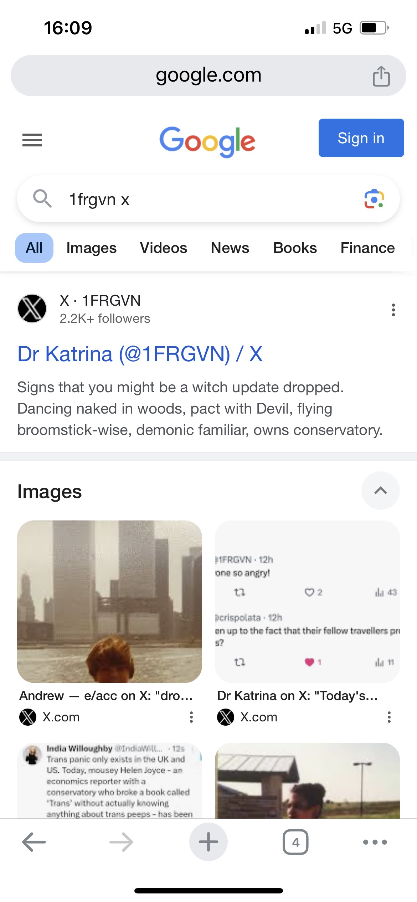
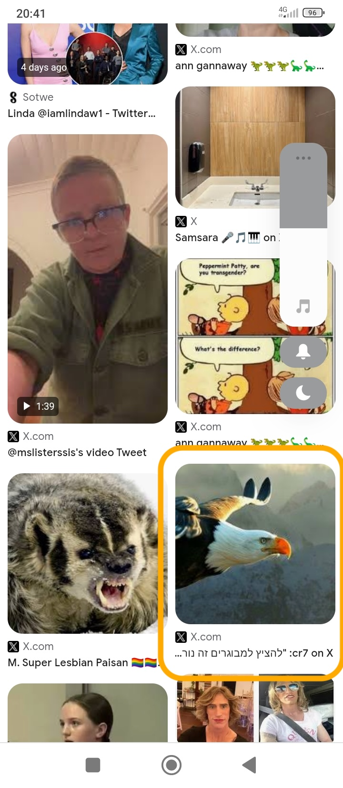

# April 2024

## Away from Spain

- I am away from Spain for the first week of April.
- I travel to India with a friend for a short tour.
- When I return to Spain, Christine arranges a hurried lunch. She wants to know who my friend is, what he does, where he lives.
- She asks me these questions over and over.
- I wonder why she is so interested when the hell I'm enduring in Denia seems to be a bit more important.
- Was she sent to urgently report back because I happen to be communicating with someone the criminal gangs are unaware of?
- Of course, the most worrying thing for a brave criminal gang terrorizing a single woman is if she is not, after all, alone. 
- Little did they know... although I did keep telling them.
- The inherent cowardice in this sort of thing is off the scale.
- I wonder if this prompted them to [wheel him out again](#the-trumpet-teacher-in-denia) and up the doses of euphoria, but I suspect that was more to do with prepping me for [Bali](may.md#bali).
- There must be something in my bathroom products while I'm in India, as I'm still high.

### Bring him to Me

- At one of the jyotirlingum temples, I whisper in Nandi's ear my romantic wishes about the trumpet teacher.
- As I whisper, I hear a booming voice coming from inside the temple saying, "Bring him to Me!"
- Were these the Instructions?
- How am I doing so far?
- The truth is, I wished the same thing that I heard.
- Is that alignment?

## Response from Generalitat

- On my return, I receive a letter from the Generalitat in response to my complaints dated the 3rd April 2024.
- It basically says they investigated and found nothing at all.
    - [Page 1 of GV response](../../content/documents/gv/Response%20from%20the%20Generalitat%203%20April%2024%202.JPG).
    - [Page 2 of GV response](../../content/documents/gv/Response%20from%20the%20Generalitat%203%20April%2024%201.JPG).

## Leak resumes

- The leak from my car washer has started again. I text Pedro the caretaker about it.

- The friend Pedro had mentioned back in September comes to check my car but doesn't see anything and tells me I have to bring it to the workshop.
- I don't want to leave my car with someone I don't know, and I don't know how I will travel there and back.
- Pedro tells me he will take me himself in his car.
- It all feels like a set up to get me alone with Pedro and I say no.
- Pedro is a bit pervy, you see.
- The leaks stops and/or is intermittent.
- The following June, my garage in North London fix a broken motor in the window washer function of my car and tell me there's no leak at all.
- I believe Pedro may be involved in adding narcotics to my car in some way, or knows something. If anyone tampered with my car in the garage, he would know.
- I wondered if they managed to add something to come through the air vents, or something I could touch on the door handles maybe.
- I told Pedro that I had been filmed sexually and I would pay 500 euros for any recordings.
- He was fired soon after that.

## Resign from the conservatory

- I send resignation letters to Paqui via email on Monday 8th April.
    - [Resignation letter in English](../../content/documents/emails/12.%20Resign%20from%20conservatory%20letter%20-%20EN.pdf).
    - [Resignation letter in Spanish](../../content/documents/emails/12.%20Resign%20from%20conservatory%20letter%20-%20ES.pdf).
    - [Email receipt of sending](../../content/documents/emails/12.%20Email%20receipt%20of%20resigation%20letter.png).
- I tweet the letter also.

{width=28%}
{width=28%}
{width=28%}

## Paqui's response

- Paqui responds via email on Tuesday 9th April.
    - [Paqui's response](../../content/documents/emails/14.%20Paqui's%20reply%20to%209%20April%20email.png).
- She says they have gone to the police that morning to "explain my situation", she also says she is "at my disposal for anything I might need".
- I ask her to confirm what they went to the police about.
- She ignores me.
- This triggers a PTSD reaction from the cyber stalking because I become convinced again I'm going to be arrested for some undisclosed matter; my friend suggests defamation.

## Paqui account

- The fake account with a very threatening picture of Paqui (as a younger person) appears again on Twitter.

- I believe the original account profile was: https://x.com/lane_deangelis but it could have been from other accounts too. Note the dogs on this one.

- This is a screenshot from the end of March of one of the accounts that had her picture on: https://x.com/Zingley2.

- This picture continues to appear on Google search results.

## The third time I'm convinced I'm going to be arrested

- I believe I'm going to be arrested at any moment. 
- As [in the second time the August previous](../2023/august.md#i-become-convinced-im-going-to-be-arrested), I carry my copy of A Course In Miracles, text and workbook, in my bag wherever I go, just in case, until the certainty wears off.

<audio controls>
    <source src="../../../content/sounds/i-have-the-feeling-im-going-to-be-arrested.mp3" type="audio/mpeg">
    Your browser does not support the audio element.
</audio>

- Given the outrageous behavior of teachers and staff at the conservatory, and the police's disinterest, and the seriousness of what's been happening to me, I'm quite sure that anything is possible.
- I guess a lot of these fears are also being triggered by hackers and stalkers online.
- I search for a lawyer and send an [email to a number of lawyers in the region asking for help](../../content/documents/emails/worried-the-conservatory-will-accuse-me-of-defamation.png).
- I get a response from someone and I video a call with them. The following videos are me talking to a lawyer looking for help. 
- I'm obviously extremely stressed and scared.

    - [Video of me speaking about this at this time - part 1](https://drive.google.com/file/d/1PbJYX7DG0pjAPE3Jh7OoyW5k9urXcDZE/view?usp=sharing).
    - [Video of me speaking about this at this time - part 2](https://drive.google.com/file/d/1kT-BFILgBWnVTBALHepboNzpGCxBoi4f/view?usp=drive_link).

- I contacted so many lawyers, I'm not sure why I didn't go ahead with any of them. 
- I'm not even sure who Lisa was now I was so stressed at the time. I'll add her details here when I find them. I guess she could have been someone connected to the criminal gangs.
- In response to one email I sent, I received a notification that my message had been blocked by the server. This was: https://carbrayinternational.com/.
- Eventually, I find a lawyer who can help me if I'm arrested who speaks English. He can also help me with any translating.
- I believe now he is likely connected to the criminal gangs and it was easy to direct me to him because, as we have seen, they have full access to my devices and online use in real time.

!!! info
    - It's very weird but I cannot remember if I met him in person or not in Alicante at [DPR](../../content/documents/letters/Ampliacion%20Denuncia_Katharine.pdf).
    - I was extremely stressed and had a long conversation with him, I can't remember when now.
    - My mind was clearly overwhelmed at this time. I felt then, and now to a lesser extent, extremely absent-minded and forgetful, as if there is literally no space for any more information.
    - Was I close to cracking and having a nervous breakdown? I believe this is possible. 
    - Although the anxiety I experienced this year never approached the intense anxiety I had experienced as PTSD from sexual violence, I do remember shaking, and not being able to perform simple tasks, and I couldn't think or speak clearly at all.
    - I also wonder if they were drugging me again through the water at home or some other way?

## Search for Vidal Sastre

- I periodically search for references for "Vidal Sastre Sanchez Hornero".
- There are relatively few on 15th April. However, I do note the name is listed on published Generalitat lists.

- It seems the team have been involved in numerous heinous crimes against women and girls; paying porn-addicts the world over delighting in the sexual excitement generated by their vile, twisted and murderous acts.

## Final chat with Jorge

??? note "WhatsApp with Jorge 16th April"
    [16/04/2024, 23:11:36] Niramisa Weiss: Hola a que hora cerran ustedes los jueves?
    [16/04/2024, 23:18:26] Jorge Esclapez Deckcard23: Hi. I m sorry but i am working in other company. If you need other thing you must contact with the lab.
    [16/04/2024, 23:18:48] Jorge Esclapez Deckcard23: Now i will send you the telephone.
    [16/04/2024, 23:26:53] Niramisa Weiss: Ok
    [16/04/2024, 23:36:26] Jorge Esclapez Deckcard23: 607349256

## Hacking expert

- I take the Asus Zenbook 13 that they took over in France the summer previous, the Yoigo router, and two webcams which I believe they accessed to the expert at DPR in Alicante.
- I meet David and his assistant.
- The lawyer helps with translating, I believe over the phone, but he may have been present.
- I tell them about how they have sexual films of me. I'm clearly very upset.
- The lady in the shop is bound to remember me as she looked very alarmed when I was telling her how I had been filmed sexually without my knowledge.
- However, I feel that I probably can't trust anyone here, so I only give them a few devices, and not the devices I am certain will come up positive for hacking.
- I give them the following:
    - My Asus Zenbook 13 laptop: He finds nothing on here so I ask him to reformat the device for me. This device could be rechecked now as it was connected again to my new Movistar router which was accessed by hackers immediately it was installed.
    - The Yoigo router: He asks for the password to the router. I give it to him. He then says that he can't analyze routers. Why did he need the password then? I kept the router so we can check again.
    - Two security cameras: There was no storage card in one of the webcams so he could not check anything here. I don't know what happened to the card.
- When I go to collect my devices, I pay 150 euros and he says he can check all my Twitter activity instead, so I give him both my account details and send Twitter archives too.
- I have never heard back from him on any of it.
- The same day a man has been removed from political office in Toledo after spy cam porn was released of him. I find this very similar to what's going on for me and say it's epidemic to the lawyer. He basically tells me to be quiet.

## I get an Orange SIM

- I go to Orange in Dénia to get a SIM for my analog phone that cannot connect to Internet.
- I'm hoping that I can use it in emergencies and that I can't be followed using it in the way that I have been.
- The number they give me ends in 007.
- I buy another simple phone which won't have access to Internet on Amazon: https://www.amazon.co.uk/gp/your-account/order-details?ie=UTF8&orderID=203-8343216-4317911&ref=ppx_yo2ov_dt_b_fed_order_details

## Constant stalking

- Even though I have left the conservatory, the stalking continues online and in person.
- I'm followed on a shopping trip to Iceland by a small wirey black-haired man who is hopping and dancing around as he tracks me around the isles.
- I'm followed on walks to Las Rotas and random people say disparaging things about me as they walk past, laugh and jeer, point and take photos.
- Every night, a car runs its engine outside my flats (and everyone else can hear it also of course), but it's just threatening the way whoever it is makes the car engine growl low, sometimes for hours, and often after midnight. 
- Everything is threatening to me now.
- I'm overwhelmed with sexual arousal yet again.

### Hackers seem to be annoyed

- A direct message springs up asking: "Why are your bank cards inaccessible?"

## Let that sink in

- Google search shows pictures of sinks, i.e. let that sink in.

- The message, which took me ages to get, was a kind of middle finger to me after having to leave my piano studies.
- Someone posts about witches owning conservatories on Google search results, see below.

## Owns conservatory

- There is something going on regarding Helen Joyce and the fact she owns a conservatory makes her unable to know anything about trans people, or something like this: https://x.com/mcdonnelljp/status/1777747038832136465.
- It comes up top, and alone, on my Google searches on mobile. I don't even remember it very well but I notice the message which is quite amazing.

## The boys

- You can see the two boys in the conservatory pic above.
- The B.A. Feldman account and another account close to this one posted pictures of (apparently) themselves as boys back sometime in November 2023.
- I'm supposed to think these are [the trumpet teacher and his brother](../2023/december.md#the-trumpet-teacher-has-a-brother), although they don't look very much like twins so I'm not convinced.
- These pics remain to this day on my Google search and I only ever looked at them one time.

- Both boys are in this screenshot from my mobile.

- The young man coming up in search since November 2023.

- The two boys even today.

!!! important
    - As a reminder, these tweets were posted way back in November or December, and those posts have consequently been deleted or I cannot find them.
    - I looked at them once, and never again.
    - There is no reason for these two pics to keep on coming up unless they have some sticky cookie element, but they come up even after a reset to factory settings, so I don't understand how they do it, unless they have access to my Google accounts.
    - It's never clear why they would do this apart from to somehow keep the game/con/fraud going, so that I will continue to believe there is a reciprocal relationship going on in some weird way.
    - They are long-game honey-trappers, after all.

## Counting Omer

- I start counting the Omer on X: https://x.com/1FRGVN/status/1782868597125095773.

## Let women Speak

- Posey Parker (Kelly Jay Keen) is coming to do a Let women Speak event in Madrid in May.
- I apply to volunteer and be a steward.
- I'm also planning to speak too.

## The trumpet teacher in Dénia

- It must be the 28th April, a Sunday, I go to the Chinese restaurant.
- As I'm walking back home, I pass by a group of gypsies, a small girl running up beside me who I smile at and who gets shy and runs back to the group.
- They're following along behind me.
- I'm walking up the Calle Diana and I'm nearly at the end where the tunnel is, and sitting outside the tapas place is a man with the same build as the trumpet teacher, who is sitting with his back to me next to a small girl with blond hair.
- I believe this is now a trigger to kick off more romance feelings in myself.
- I believe the drugging with aphrodisiacs in the water at my flat is ramped up at this time.

## Fake account posts about "peeping at pre-schoolers"

- I notice a fake account that's interesting.
- I'm triggered to become interested and translate the message because of the picture of an eagle which is a meme that has been running throughout the cyber stalking.

!!! warning
    - The photo of a the person with glasses here looks remarkably like an AI mix with me in it.

- I see "Peeking at adults is no..." translated so I open the image as it is clearly references voyeurism.

- The translation read ""Peeping at adults is terrible but peeping at preschoolers is...". 

!!! tip "August account with same triggers"
    - In August, a similar account likes something I've posted.
    - I describe this [here](august.md#hidden-camera-account).
    - It has the same eagle trigger, and Hebrew language as the one just mentioned.
    - I'm not sure if it is the same account. It could be.
    - The pinned thread on the timeline references a person targeted by someone who he had trusted, and had sex with, and was consequently stalked and filmed by secret cameras.
    - I assume this is to suggest the trumpet teacher was targeted by Domingo who has been blackmailing him in some way since then.
    - The account is here: https://x.com/Cr7Rival3711.
    - The pinned message is translated here:

    

    - In August, I respond to this terrible tweet thread that I have just read: https://x.com/1FRGVN/status/1823957507728896499.

## Body cam

- I buy a body cam and frame for security purposes.

## Twitter

- Tweets of interest to follow.

### `@1frgvn`

- https://x.com/1FRGVN/status/1784719295261384849 -> smelling toast.
- https://x.com/1FRGVN/status/1784677373998207117 -> speech snippets for Madrid Let women Speak.
- https://x.com/1FRGVN/status/1784565249028284779 -> I informed my old workplaces that I had been hacked while working for them.
- https://x.com/1FRGVN/status/1784542558862918107
- https://x.com/1FRGVN/status/1784540203220074912 -> mentioning remembering the face-pack thing from [2014](../early-years/2016.md#may).
- https://x.com/1FRGVN/status/1784528919112106410 -> I had told my friend it felt like all these witches were sitting round knitting and casting evil spells on me.
- https://x.com/1FRGVN/status/1784521239114953166 -> reference to hacking.
- https://x.com/1FRGVN/status/1784264538151370833
- https://x.com/1FRGVN/status/1784229315430768709 -> reference to sexual feelings.
- https://x.com/1FRGVN/status/1784109158037389456
- https://x.com/1FRGVN/status/1783619334906036671
- https://x.com/1FRGVN/status/1783616160992276606
- https://x.com/1FRGVN/status/1783615253118394766
- https://x.com/1FRGVN/status/1783194049417007494
- https://x.com/1FRGVN/status/1783193112896065859
- https://x.com/1FRGVN/status/1782487919497797676 -> strawberries
- https://x.com/1FRGVN/status/1782374466820968905
- https://x.com/1FRGVN/status/1782166832113144050
- https://x.com/1FRGVN/status/1782156422110650665
- https://x.com/1FRGVN/status/1782150606909563340
- https://x.com/1FRGVN/status/1781975115900584378
- https://x.com/1FRGVN/status/1781969760395166111
- https://x.com/1FRGVN/status/1781892021164109890
- https://x.com/1FRGVN/status/1781839580821397692
- Here's the search URL: https://x.com/search?q=(from%3A1frgvn)%20until%3A2024-04-30%20since%3A2024-03-31&src=typed_query&f=live

### `@JackChardwood`

- https://x.com/search?q=(from%3Ajackchardwood)%20until%3A2024-04-30%20since%3A2024-04-01&src=typed_query&f=live

### Google searches

- This guy showed up on `@jctot19` results for a long time. Sometimes just him and Carmen or Rocio Vidal. He is into sado-masochism.

.JPG)
