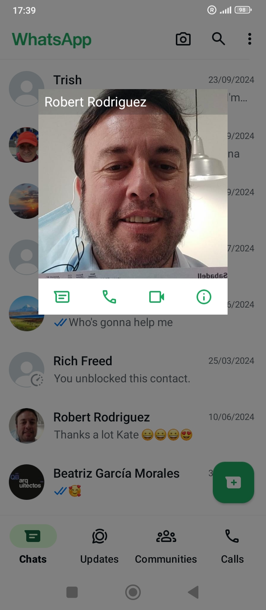

## Away from Spain

- I am away from Spain for the first week of April.

## Response from Generalitat

- I receive a letter from the Generalitat in response to my complaints on 3rd April 2024 and pick it up on my return.
- It basically says they investigated and found nothing at all.
    - [Page 1 of GV response](../../content/documents/gv/Response%20from%20the%20Generalitat%203%20April%2024%202.JPG).
    - [Page 2 of GV response](../../content/documents/gv/Response%20from%20the%20Generalitat%203%20April%2024%201.JPG).

## Leak resumes

- The leak from my car washer resumes. I text Pedro the caretaker about it.

{width=45%}

- The friend Pedro had mentioned back in September comes to check my car but doesn't see anything and tells me I have to bring it to the workshop.
- I don't want to leave my car with someone I don't know, and I don't know how I will travel there and back.
- Pedro tells me he will take me himself in his car.
- It all feels like a set up to get me alone with Pedro and I say no.
- Pedro is a bit pervy, you see.
- The leaks stops and/or is intermittent.
- The following June, my garage in North London fix a broken motor in the window washer function of my car and tell me there's no leak at all.
- I believe Pedro may be involved in adding narcotics to my car in some way, or knows something. If anyone tampered with my car in the garage, he would know.
- I wondered if they managed to add something to come through the air vents, or something I could touch on the door handles maybe.
- I told Pedro that I had been filmed sexually and I would pay 500 euros for any recordings.
- He was fired soon after.

## Resign from the conservatory

- I send resignation letters to Paqui via email on Monday 8th April.
    - [Resignation letter in English](../../content/documents/emails/12.%20Resign%20from%20conservatory%20letter%20-%20EN.pdf).
    - [Resignation letter in Spanish](../../content/documents/emails/12.%20Resign%20from%20conservatory%20letter%20-%20ES.pdf).
    - [Email receipt of sending](../../content/documents/emails/12.%20Email%20receipt%20of%20resigation%20letter.png).

## Paqui's response

- Paqui responds via email on Tuesday 9th April.
    - [Paqui's response](../../content/documents/emails/14.%20Paqui's%20reply%20to%209%20April%20email.png).
- She says they have gone to the police that morning to "explain my situation", she also says she is "at my disposal for anything I might need".
- I ask her to confirm what they went to the police about.
- She ignores me.
- This triggers a PTSD reaction from the cyber stalking because I become convinced again I'm going to be arrested for some undisclosed matter; my friend suggests defamation.

## Paqui account

- Another fake account with a very threatening picture of Paqui (as a younger person) on it appears on Twitter.

{width=65%}

- I believe the original account profile was: https://x.com/lane_deangelis but it could have been from other accounts too. Note the dogs on this one.

{width=55%}

- This is a screenshot from the end of March of one of the accounts that had her picture on: https://x.com/Zingley2.

- This picture continues to appear on Google search results.

## Lawyer

- I believe I'm going to be arrested. Given the outrageous behavior of teachers and staff, and the police's disinterest, and the seriousness of what's been happening to me, I'm quite sure that anything is possible.
- I guess a lot of these fears are also easily triggered online.
- I search for a lawyer and send an [email to a number of lawyers in the region asking for help](../../content/documents/emails/worried-the-conservatory-will-accuse-me-of-defamation.png).
- I find a lawyer who can help me if I'm arrested who speaks English. He can also help me with any translating.
- I believe now he is probably connected to the criminal gangs.

{width=45%}

!!! info
    - It's very weird but I cannot remember if I met him in person or not in Alicante at DPR.
    - I was extremely stressed and had a long conversation with him, I can't remember when now.
    - My mind was clearly so overwhelmed at this time. I felt then, and now to a lesser extent, extremely absent-minded and forgetful, as if there is literally no space for all this information.
    - Was I close to cracking and having a nervous breakdown? I believe this is possible. Although the anxiety I experienced never approached the intense anxiety I had experienced as PTSD from sexual violence, I do remember shaking, and I couldn't think or speak clearly.
    - Were they drugging me again through the water at home or some other way?

## Hacking expert

- I take one laptop, the Yoigo router, and a webcam which I believe they have accessed to the expert DPR we wrote to in Alicante.
- I meet David and his assistance.
- The lawyer helps with translating, I believe over the phone, but he may have been present.
- I tell them about how they have sexual films of me. I'm clearly very upset.
- The lady in the shop is bound to remember me as she looked very alarmed when I was telling her how I had been filmed without my knowledge.
- However, I know and feel that I probably can't trust anyone here, so I only give them a few devices, and not the devices I know will come up positive for hacking.
- I give them the following:
    - My Asus Zenbook 13 laptop: He finds nothing on here so I ask him to reformat the device for me. This device could be rechecked now as it was connected again to my new Movistar router which was accessed by hackers immediately.
    - The Yoigo router: He asks for the password to the router. I give it to him. He then says that routers aren't able to be analyzed. I kept the router so we could check again.
    - A security camera: There was no storage card in the webcam so he could not check anything here. I don't know what happened to the card.
- When I go to collect my devices, I pay 150 euros and he says he can check all my Twitter activity so I give him both my account details.

## I get an Orange SIM

- I go to Orange in Denia to get a SIM for my analog phone that cannot connect to internet so I can't be followed in the way that I have been.
- The number the give me ends in 007.

## Constant stalking

- I'm followed on a shopping trip to Iceland by a small wire black-haired man who is hopping and dancing around as he tracks me around the isles.
- I'm followed walking to Las Rotas and people say disparaging things about me and take photos.
- Every night, a car runs it's engine outside my flats (and everyone else can hear also of course), but it's just threatening. Everything is threatening to me now.

## Let that sink in

- Google search shows pictures of sinks, i.e. let that sink in.
- Someone posts about witches owning conservatories, which they post on Google search results.

## Twitter

### `@1frgvn`

### `@JackChardwood`

### Google searches

- 
