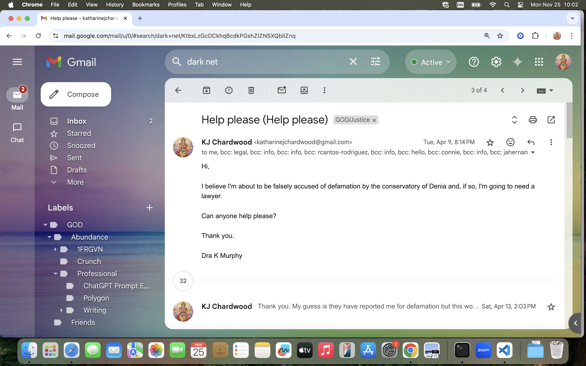

# April 2024

## Jyotirlinga trip to India

- I leave Spain on 29th March and spend the first week of April on a tour in India with a friend.
- I stay at a posh hotel near the airport in Mumbai for a couple of days by myself in safety.
- I feel like I'm getting pneumonia I'm coughing so much.
- I crack the same rib [I cracked at yoga class](march/1-12.md#cracked-rib) from coughing in my hotel room.
- I'm coughing up blood now.
- I call the hotel doctor. He prescribes serious antibiotics and pleurisy medicine and says to call him in a day to let him know how I'm doing.
- I manage to [write to the Guardia Civil](march/13-end.md#letter-to-the-guardia-civil) and send the letter registered from the hotel.
- I'm meeting my friend Yan from Singapore.
- We are going to visit the five jyotirlinga temples in Maharashtra with a driver.
- I invite Yan for breakfast the day before we take the tour. I tell him what's been happening to me, what I know. I'm coughing so hard I can hardly speak.
- Later that evening, feeling a little better, I contact my mother directly from a mock email I've created on my phone.
- I send her a picture.

- This is the first time she has seen me in three-and-a-half years.
- I use the name of my mock email on my X profile for a short while.

- Hackers have been more recently bombarding me with references to Elon Musk, hence the location reference.

### Bring him to Me

- I can't stop thinking about the trumpet teacher. 
- I think about him every thirty seconds or so. It's never ending, and inexplicable. 
- I deal with it as best I can.
- In retrospect, I'm definitely high on something. 
- That, coupled with the elevated divine energy on our tour may explain the following experience I had at Bhimashankar.
- Nandi, the little bull that Shiva uses for transport, always sits outside the Shiva temple looking in.
- They say if you whisper your wishes in Nandi's ear, he will grant them.
- At the first jyotirlinga temple we visit, [Bhimashankar](https://www.bhimashankar.in/), I whisper in Nandi's ear my wishes concerning the trumpet teacher.

- In the queue I have been preparing what I want to ask for, the sentence is ready, but when I go to whisper my waffly request into Nandi's ear, something takes over.
- My whispered wish becomes a bold statement: *Bring him to me!*.
- And, at *exactly* the same time, matching every word of mine, I hear a booming voice coming from inside the temple saying, "Bring him to Me!".
- I have no non-God explanation for this - apart from the mandrake that I must have been ingesting unawares from my toiletries, and that's also a God-explanation depending on who you talk to.

## Lunch with Christine

- I return to Spain.
- Christine BJ arranges a hurried lunch. 
- She wants to know about my friend Yan, the man I traveled with in India.
- Who he is, how I know him, how old he is, what he does for a living, where he lives, what his parents do, and repeat.
- She asks me these questions over and over.
- I think it bizarre, and I'm perplexed that a random man in my life is way more interesting to her than the hell I'm enduring at home in Dénia.
- Was she sent to gather urgent intel on Yan and report back?
- Was it because I have a friend who the criminal gangs were previously unaware of?
- Did they do a bit of research on him and find something out something that caused them anxiety?
- Of course, the most worrying thing for a brave and bold criminal gang terrorizing a single woman living alone is if she is not, after all, alone. 
- Little did they know... although I did keep telling them.
- The inherent cowardice is off the scale.
- Whenever I get a chance to change the subject I explain to Christine what's been happening to me at the hands of Dénia criminals.
- Chris BJ maneuvers the conversation back into generalities.
- We speak about bullying.
- She tells me she was a bully at boarding school.
- I express the sane and world-saving idea that it is far better to be bullied than to be a bully.
- *Who in their right mind would want to be a bully?*, I announce with some passion.
- Her face flashes surprise.

## Dodgy lorry, van, and car registrations

- I had been noticing some odd-looking vans and cars outside Carrer Furs for quite some time, probably since early 2023.
- It didn't seem to be anything I had to be concerned with until September 2023, at which time I started to write down registration numbers whenever I had the wit to remember to do so.
- I remember a very weird van with blacked-out windows and a big aerial, maybe even a satellite dish, parked right below my window every day.
- There were also similarly bizarre looking vans along the back road too.
- Given I live in a seaside town, and the beach is at the bottom of the road, I just assumed that these vehicles belonged to regular people living in vans by the sea and having their own Internet access. Sounds rather nice although a bit cramped.
- When the multiple cars started to [beep outside my apartment every day in a threatening manner as they drove past](may.md#threatening-cars-outside-my-apartment), I began to more assiduously take registration numbers.
- I had them on notes in the apartment, which I misplaced eventually, and sometimes I added them to my phone.
- Here's a small list from April 2024 I found on the Android phone I bought in the [Chinese telecom store in Madrid](march/13-end.md#madrid).

## Response from the Generalitat

- On my return, I receive a letter from the Generalitat dated the 2nd April 2024, and signed on 3rd April 2024.
- It is in response to my numerous complaints.
- They basically say they investigated and found nothing untoward going on.
- It's not clear what reports they requested, or from whom, or what's in them.
- The investigation they are referring to having done was the [inspector ambushing me at piano lesson on 5th March](march/1-12.md#an-inspector-calls) and bullying me even more for about five minutes.
- I'm not sure what they are referring to when they mention "former students". As far as I'm aware, I mentioned nothing about any former students.
- I did, in fact, state repeatedly I was concerned for the safety of *current* students as I have also stated in this police statement numerous times.

    - [Page 1 of GV response](../../content/documents/gv/Response%20from%20the%20Generalitat%203%20April%2024%202.JPG).
    - [Page 2 of GV response](../../content/documents/gv/Response%20from%20the%20Generalitat%203%20April%2024%201.JPG).

??? tip "Translation of the Generalitat's response into English"
    Alicante, April 2, 2024

    On October 22, 2023, she sent a letter to the Ministry of Education, in which she stated that she was being harassed by the teachers and staff of the Professional Conservatory of Music Mestre Tenor Cortis de Dénia, specifically indicating that she had suffered: harassment by gangs on social networks, cyberbullying, personal harassment by teachers and staff of the conservatory, damage to her personal property by teachers and staff; and harassment on the street by strangers. She also referred to Mr. Domingo Cano who was her piano teacher during the 14/15 academic year. Subsequently, she has sent different emails in which she exposes the same facts in which former students of the center would also be involved.

    The Education Inspectorate has carried out several actions in order to clarify the reported facts. Reports have been requested from the management team and an interview was held with the interested party herself, in which, among other things, she was informed that the Inspectorate had sent her a letter of reply dated 19/12/23, however, since the postal address she had provided was incomplete, it was returned by the postal service.

    Regarding the facts referred to, it should be noted that you have been enrolled in the Professional Conservatory of Music Tenor "Cortis" in the 2014/2015, 2015/2016. 2022/2023 and the current 2023/2024 years in the piano specialty, having received classes from about twelve different teachers and that you only received classes from Mr. Domingo Cano at the beginning of the 2014/15 school year, because the teacher was changed at your request.

    For all this, the investigations carried out show that there has been no evidence that any teacher has behaved inappropriately towards students at the centre and there are no complaints regarding any type of personal harassment or damage to their property, or towards any other student, in which conservatory staff may have participated. Likewise, the Inspectorate has not received any complaint from any parent or student on this issue.

    For all this, given that most of what you are referring to has occurred outside the scope of the conservatory, if you consider that there are facts that could constitute a criminal offense, you must contact the competent judicial authority to proceed with the corresponding complaint.

    In any case, the educational inspection will continuously monitor the activity of the center, advising the educational agents who are intervening in order to guarantee correct attention to the students and promote their well-being and academic development.

    The Territorial Director

    GENERALITAT

    Signed by Juan Antonio Castaño Diaz on 03/04/2024 08:36:08 N Position: Territorial Director

## Leak resumes

- One morning when I go to collect the car, I notice the [leak from the windscreen washing fluid tank](../2023/september.md#problem-with-my-car) has started again.
- I text Pedro the caretaker about it.

- Here's the downloaded [WhatsApp](../../content/whatsapps/April%202024/WhatsApp%20Chat%20with%20CONSERJE%20VILLAMAR.zip) chat.
- Eventually, we talk in person and I agree to Pedro's suggestion that his friend the mechanic comes to have a look at the problem.
- Pedro's friend comes to check my car the following day but can't find any problem.
- He tells me I will have to bring the car to the workshop.
- His workshop is quite far away in the industrial polygon.
- I don't want to leave my car with someone I don't know, and I don't know how I will travel there and back.
- Pedro, excited, tells me not to worry he will take me there and back himself, in his car.
- My body screams at me that it's a set up, maybe to get me alone with Pedro. Pedro is [a bit pervy](../2023/september.md#pedro-ogles-a-tourist), you see.
- I immediately say no and walk away.
- Pedro looks ashamed.
- After this, the leaks stops and/or is intermittent.
- In June when I'm in the UK, I take the car to Kwik Fit in London N12.
- They fix a broken motor in the window washer function of my car and tell me there's no leak at all.
- I believe Pedro, or others known to him, were able to access my car engine and cause what looked like a leak, but wasn't.
- I wondered if, by the same methods, criminals added some mind-altering substance that could come in through the air vents, or something I could touch on the door handles, wheel, or gearstick maybe.
- Could this be what caused [overwhelming sexual arousal on Hanuman Jayanti in 2023](../2023/april.md#hanuman-jayanti)?
- I eventually told Pedro that I had been filmed sexually without my knowledge, and that I would pay 500 euros for any recordings.
- He was fired very soon after that and replaced by an unusually surly man.
- Pedro [sends me a text at Christmas](december.md#pedro-sends-a-christmas-greeting).
- He tells me is just back from visiting a family at Carrer Furs.
- Did they hire him back once they were done with me?

!!! danger "Connections"
    - Reading this back reminds me that one of the targeted women the criminals sent multiple pictures of ended up in a car garage somewhere, clearly sedated, in increasing states of undress in the front seat and the back seat of a [grey sports car](september.md#another-upsetting-targeted-woman).
    - In one of the photos, you can see a small Hispanic man crouching down in the foot of the drivers side of the car, giving a sense of many people being around while these photos were taken.

## Resigning from the conservatory

- I send resignation letters to Paqui via email on Monday 8th April.
- I explain to her how I am genuinely afraid for my life, and how whatever is happening concerns Lorraine Blackbourn's untimely death.

    - [Resignation letter in English](../../content/documents/emails/12.%20Resign%20from%20conservatory%20letter%20-%20EN.pdf).
    - [Resignation letter in Spanish](../../content/documents/emails/12.%20Resign%20from%20conservatory%20letter%20-%20ES.pdf).
    - [Email receipt of sending](../../content/documents/emails/12.%20Email%20receipt%20of%20resigation%20letter.png).

??? info "Resignation letter to Paqui Fornet"
    Carrer Furs 15 
    Portal 1, ESC2, Piso 3, Apt 17 
    Denia 
    03700 Alicante 
    Monday 8th April 2024 
     
    To whom it may concern, 
     
    After a two-year campaign of gender violence in the form of bullying, aggression, and 
    psychological intimidation by teachers and staff at the Tenor Cortis conservatory in Denia, I now have sufficient fear for my personal safety that I will no longer be coming to classes. 
     
    The latest flurry of violent imagery and messages on Twitter, and the psychological bullying at the piano concert on Tuesday 12th March - in which a woman dressed up to look exactly like a friend, Lorraine Blackbourn, who tragically committed suicide in Denia after gender-based bullying and intimidation - I consider to signify a genuine threat to my life. 
     
    I previously understood the bullying to come from a small number of teachers and staff, and their families/friends on the streets of Denia, as I mentioned many times in my private letters of complaint I wrote to the Generalitat. As you know, these letters were ignored completely. I 
    received no reply at all. They were, instead, shared with teachers and staff at the conservatory. 
     
    Sharing these letters was obviously going to put me in even more danger at the school, online, 
    and in the streets of Denia. 
     
    I believe there are also private and stolen photos, recordings, and videos of me; hacked with the sole intention of shaming and silencing me, perhaps blackmailing too, and it concerns me that other students, especially young women and children, may be suffering in the same way. I have informed numerous authorities about this. 
     
    I now realize, albeit belatedly, that literally everyone at the school, teachers, staff, and students, and even the Generalitat itself - whether intentionally or because they are too scared to do otherwise - are firmly in support of me having to leave the school due to gender violence. 
     
    It is very shocking to me that a public institution funded by taxpayers could so easily treat a 
    student in this way. And it is not a unique event. 
     
    It remains to be said that at the conservatory in Denia, with the support of the Generalitat, there appears to be zero concern for the safety and wellbeing of students at the school who complain about inappropriate behavior from teachers and staff. 
     
    As I mentioned many times, the campaign of terror relates to me refusing a piano teacher who 
    had sought a romantic relationship with me 10 years ago. 
     
    There is also some suggestion that the collective hatred towards me has been further incited with reference to my political views on Twitter. 
     
    I myself have only ever wanted to play the piano in peace. 
     
    With the very best, 
    Dra Katharine Murphy

- I tweet the letter also, for good measure.

{width=28%}
{width=28%}
{width=28%}

### Paqui's response

- Paqui responds via email on Tuesday 9th April.

??? info "Translation of Paqui's response"
    Hello Katharine

    I'm sorry to read the letter you sent me.

    First of all, I want you to know that no private letters have been shared; in fact, I haven't seen them either. However, I am aware that the letters haven't been ignored.

    We went to the police this morning to explain your situation. You need to report this to law enforcement, providing some kind of proof to verify your statement, so they can investigate.

    I am available for anything you need

    Paqui Fornet

- I respond, asking her to confirm what they went to the police about.

- She ignores my email. 
- I never knowingly hear from her again.
- Here's the [full resignation email thread with Paqui](../../content/documents/emails/Full-resignation-email-thread.pdf).
- I carbon-copy the UK embassy and the Irish embassy into the email in case I'm arrested by the police.
- The mention of the police, together with the [suggestion from the Generalitat's inspector that she was going to report *me* to the police](march/1-12.md#an-inspector-calls), and my friend in Madrid's suggestion I could be arrested for defamation, triggers another strong PTSD reaction.
- I become convinced, yet again, I'm going to be arrested for some undisclosed matter.
- I believe this belief was being heavily reinforced by online manipulation during this period.
- I believe this is an irrational terror that was first triggered in my mind in 1989 by the Tottenham rape gangs, and how they very effectively silence children who have some respect for law enforcement.
- You could ask Winston May or Colin Day about that, I guess.
- Certainly, the Generalitat and Paqui Fornet also, somehow, seemed to be aware that this was an effective manner of frightening and silencing me.

### Paqui account

- Fake accounts with a (what I find at this moment to be an even more) threatening picture of Paqui appear again on my X account notifications.

- I believe they posted these pics of Paqui to *ensure* I didn't think about returning to the conservatory.
- This is a screenshot from the end of March of one of the other accounts that had her picture: https://x.com/Zingley2. 

- The picture of Paqui continues to appear on Google search results.
- There was a bunch of accounts like this at the time, and I see them pop up once again in September 2024, perhaps to ensure I didn't try and return to my studies again!
- No, by that time, I had been safely handed-over by the conservatory to the porn-gangs for their pleasure and Ferrari payments.

## The third time I'm convinced I'm going to be arrested

- I believe I'm going to be arrested at any moment. 

<audio controls>
    <source src="../../../content/sounds/i-have-the-feeling-im-going-to-be-arrested.mp3" type="audio/mpeg">
    Your browser does not support the audio element.
</audio>

- It's interesting I state it as a *feeling*.
- It was a very strong fearfulness, actually.
- Given the outrageous behavior of teachers and staff at the conservatory, and the total disinterest of the police, and the seriousness of what's happening to me, I'm quite sure that anything is possible.
- I'm convinced that online triggering from hackers and online-stalkers was exacerbating this feeling.
- I search for a lawyer and send an email to a number of lawyers in the region asking for help.

- I also call the British Foreign Office in Spain and speak to a lady called Lisa.
- I attach the videos and transcripts of the call below. 
- I'm obviously extremely stressed and scared. 

    - [Video of me speaking with the British Foreign Office - part 1](https://drive.google.com/file/d/1PbJYX7DG0pjAPE3Jh7OoyW5k9urXcDZE/view?usp=sharing) and [transcript](../../content/vids/scared%20and%20stressed%201_transcript.txt).
    - [Video of me speaking with the British Foreign Office - part 2](https://drive.google.com/file/d/1kT-BFILgBWnVTBALHepboNzpGCxBoi4f/view?usp=drive_link) and [transcript](../../content/vids/scared%20and%20stressed%202_transcript.txt).

- The British FO weren't able to help me at that time.
- These videos are extremely upsetting for me to watch. I see myself, a normal law-abiding citizen, trying to live a good life, and paying her taxes, while something so grotesque is happening and no-one cares. In fact, they're either part of it and snicker and make it worse, or they gaslight me suggesting nothing happened while it's obvious they've very nearly destroyed me.
- These criminals may have got no money from me, but they took everything else; a normal life, the ability to work, my sight, my kidney health, my personal safety nearly everywhere in the world, my human rights in their entirety. 
- Having said that, however, without this horrible set of circumstances I would not have been forced to fight for my life like I have been doing, and perhaps some good will come of it.
- In response to an email I sent to https://carbrayinternational.com/, I receive a notification that my message was blocked by the server. 
- All the other lawyers, apart from a couple of them, say they cannot help me, or don't have someone who can deal with me in English.
- Eventually, I find a lawyer who can help me if I'm arrested who speaks English and is registered with a British legal authority; [Roberto Rodriguez](#roberto-rodriguez-lawyer) based in Alicante.
- He also says he can also help me with any translating I need done with the cyber-expert.
- I believe now that I may have been shepherded towards this person online, as usual.

- Here's the [initial email conversation](../../content/documents/emails/roberto-rodriguez-email.pdf) I had with Roberto.
- From this point forward, he called me or we communicated on WhatsApp.

## Online searches for Vidal Sastre

- I periodically search online for references for "Vidal Sastre Sanchez Hornero".
- The results are often peculiar and seem curated, just for me.
- There are relatively few on the 15th April. However, I do note the name is listed on published Generalitat lists.

- In October, a Spanish government official will tell my friend from Madrid to tell me there is no record of anyone with this name in the Generalitat systems, a lie.
- Someone, somewhere, with sufficient access to my devices was helping me with my investigation into what was going on.
- Could it have been [number one trumpet teacher](../../crimes/protagonists/vidal-sastre.md#the-older-slimmer-greyer-man); a sole individual who saw exactly what the porn-addicted men of Spain have become, their self-made hellscape protected at the highest level, with seemingly nothing anyone can do about it?
- Was he an anomaly amongst men, unusually worried for his own children? 
- Am I the last hope for the dwindling sane in Spain?

## Final chat with Jorge Tuesday 16th

- I'm still vacillating on who I want to analyze my devices.
- I trust my friend in Madrid but I believe, from things she has told me, that she could also be hacked.
- I'm planning on visiting Alicante on Thursday and Friday of this week.
- I check in with Jorge.
- He is busy so I forget about him and decide to go with DPR, the company that [my friend helped me write to](march/13-end.md#cyber-expert).

??? note "WhatsApp with Jorge 16th April"
    [16/04/2024, 23:11:36] Niramisa Weiss: Hola a que hora cerran ustedes los jueves? 
    [16/04/2024, 23:18:26] Jorge Esclapez Deckcard23: Hi. I m sorry but i am working in other company. If you need other thing you must contact with the lab. 
    [16/04/2024, 23:18:48] Jorge Esclapez Deckcard23: Now i will send you the telephone. 
    [16/04/2024, 23:26:53] Niramisa Weiss: Ok 
    [16/04/2024, 23:36:26] Jorge Esclapez Deckcard23: 607349256 

## Reporting hacking to my previous jobs

- It's my obligation to report hacking to the jobs I worked at prior to Polygon Labs: [zkSync](../../content/documents/emails/zkSync.pdf) and [Digital Asset](../../content/documents/emails/DigitalAsset.pdf).
- I write emails to them both.
- I also tweet about it in an attempt to take back some control over my day-to-day life.

## Roberto Rodriguez, lawyer

- I am communicating with Roberto Rodriguez about visiting Alicante this week.
- I need a lawyer to represent me at the police station with evidence of hacking before they will investigate the crimes against me, and that's why I have hired him.
- We have spoken on the phone multiple times.
- He asks me to send him the information about the expert I intend to visit.
- I WhatsApp him for the first time with the details of [DPR Recovery](https://dprrecovery.com/) on the evening of Thursday 18th April.
- We have agreed to meet at the DPR offices at 13:00 the following day and I confirm this with him.
- Roberto has been talking about another company he is keen I use instead called [Tecnofix](#tecnofix).
- He tells me to contact them.
- In one voice recording during our WhatsApp chat he tells me he is at the company and they are expecting my call: `PTT-20240418-WA0002.opus`.
- I guess he knows these guys personally.
- I have no recollection of communicating with this company although I do seem to have made a 9 minute call to them on 18th April.
- Whatever was said, as far as I know, I had no further communication with them that day and decided to continue with DPR.
- Curiously, I have a [somewhat concerning communication with them](#tecnofix) on 28th October 2024, the week that criminal gangs try to murder me in my own home by poisoning.
- Here's my WhatsApp communication with Roberto up to Thursday 18th, the night before I visit the cyber expert DPR.

??? tip "WhatsApp with Roberto"
    18/04/2024, 17:43 - det sgt lydia cleaves: Hola Roberto this is the company https://dprrecovery.com/contacto/ 
    18/04/2024, 17:43 - det sgt lydia cleaves: And the address is ... 
    18/04/2024, 17:45 - det sgt lydia cleaves: You can see it on there.. 
    18/04/2024, 17:46 - det sgt lydia cleaves: I think the Chinese perito in Denia is involved in this too so I just don't know who to trust 😞 
    18/04/2024, 17:46 - det sgt lydia cleaves: See you tomorrow at 13:00 
    18/04/2024, 17:46 - det sgt lydia cleaves: I am Katharine Murphy 
    18/04/2024, 17:47 - det sgt lydia cleaves: I had to buy new phones and make new accounts on everything,that is why you see a funny name 
    18/04/2024, 18:02 - det sgt lydia cleaves: Calle Arzobispo Loaces 17 Local 03003 Alicante 
    18/04/2024, 19:24 - Robert Rodriguez: Ok It IS in the centre yes 
    18/04/2024, 19:25 - det sgt lydia cleaves: Ok 
    18/04/2024, 19:25 - Robert Rodriguez: Let me see if I fi now to the other shop and try to call them this evening 
    18/04/2024, 19:25 - det sgt lydia cleaves: Ok thank you much appreciated 
    18/04/2024, 19:25 - Robert Rodriguez: What IS exactly what you need and in what devices?? 
    18/04/2024, 19:25 - det sgt lydia cleaves: I have 2 security cams, 1 laptop, and a router 
    18/04/2024, 19:26 - Robert Rodriguez: PTT-20240418-WA0000.opus (file attached - this is where he asks me where are the security cams) 
    18/04/2024, 19:26 - det sgt lydia cleaves: I need analysis for intrusion through the router, Mac spoofing, spyware, man in the middle attack, DNS spoofing, 
    18/04/2024, 19:26 - det sgt lydia cleaves: Anything weird 
    18/04/2024, 19:27 - det sgt lydia cleaves: The security cameras watch the house when I was away 
    18/04/2024, 19:27 - det sgt lydia cleaves: They connect to the router and are very easy to attack 
    18/04/2024, 19:27 - Robert Rodriguez: Ok 
    18/04/2024, 19:28 - Robert Rodriguez: PTT-20240418-WA0001.opus (file attached - this is where he asks me what company I work for) 
    18/04/2024, 19:28 - det sgt lydia cleaves: I work for a company called polygon but I'm not bringing any of their devices 
    18/04/2024, 19:28 - det sgt lydia cleaves: And they have taken steps on their side 
    18/04/2024, 19:29 - Robert Rodriguez: Ok no idea of the company 
    18/04/2024, 19:29 - det sgt lydia cleaves: Because they noticed the router breach when I asked them to check it 
    18/04/2024, 19:29 - det sgt lydia cleaves: Their security team found evidence of a breach at the router about 4/6 weeks ago 
    18/04/2024, 19:29 - det sgt lydia cleaves: I had to stop working from home 
    18/04/2024, 19:30 - det sgt lydia cleaves: At the same time there was a very big psychological attack by the conservatory at the piano concert 
    18/04/2024, 19:30 - det sgt lydia cleaves: My webcam was accessed at that time and the day after 
    18/04/2024, 19:30 - det sgt lydia cleaves: That day and following day there was serious threatening activity in the street 
    18/04/2024, 19:31 - det sgt lydia cleaves: So I left for Madrid and lived in hotels for 2 weeks 
    18/04/2024, 19:31 - det sgt lydia cleaves: I didn't feel safe at all 
    18/04/2024, 19:31 - det sgt lydia cleaves: Men made scary "ghost" noises on the webcam 
    18/04/2024, 19:32 - det sgt lydia cleaves: It's related to a friend who committed suicide here 3 years ago who they were suggesting they did the same thing to and drove her to it, or worse 
    18/04/2024, 19:32 - det sgt lydia cleaves: That was my assessment of the threats, and I took it seriously, and still do 
    18/04/2024, 19:34 - Robert Rodriguez: Ok the most relevant thing of It all IS obviously the evidence . Use your phone to record weird things 
    18/04/2024, 19:34 - det sgt lydia cleaves: Yes I could have so many things but I haven't been recording anything 
    18/04/2024, 19:34 - det sgt lydia cleaves: I believe they will stop now because they know I am leaving 
    18/04/2024, 19:35 - det sgt lydia cleaves: And they have gone to the police about me... When I asked for details they didn't answer 
    18/04/2024, 19:35 - Robert Rodriguez: Thats a problem of course but if in the future It happens again... 
    18/04/2024, 19:35 - det sgt lydia cleaves: I think they will have denounced me falsely 
    18/04/2024, 19:36 - Robert Rodriguez: In what basis? Cant be a Big deal at all 
    18/04/2024, 19:36 - det sgt lydia cleaves: So I would like to defend this robustly if it comes to pass 
    18/04/2024, 19:36 - det sgt lydia cleaves: Defamation maybe 
    18/04/2024, 19:36 - det sgt lydia cleaves: Because I complained to the generalitat in private in letters about what was happening 
    18/04/2024, 19:37 - det sgt lydia cleaves: As it all relates to me turning down a piano teacher romantically 10 years ago 
    18/04/2024, 19:37 - det sgt lydia cleaves: And behaves extremely inappropriately with young girls 
    18/04/2024, 19:37 - det sgt lydia cleaves: And I voiced my concernd 
    18/04/2024, 19:37 - det sgt lydia cleaves: Concerns 
    18/04/2024, 19:37 - det sgt lydia cleaves: I did not accuse anyone of anything 
    18/04/2024, 19:38 - det sgt lydia cleaves: This man threatened me with violence at that time too 
    18/04/2024, 19:38 - det sgt lydia cleaves: They have been gang stalking me on twitter also 
    18/04/2024, 19:38 - Robert Rodriguez: PTT-20240418-WA0002.opus (file attached - he is at the Technofix shop now and tells me to call them) 
    18/04/2024, 19:38 - det sgt lydia cleaves: And I said a lot of things on twitter but no accusations 
    18/04/2024, 19:39 - det sgt lydia cleaves: Ok what's the number 
    18/04/2024, 19:39 - det sgt lydia cleaves: Do they speak English 
    18/04/2024, 19:39 - Robert Rodriguez: Tecnofix Informatica.vcf (file attached) 
    18/04/2024, 19:40 - Robert Rodriguez: Yes 
    18/04/2024, 19:40 - det sgt lydia cleaves: Ok 
    18/04/2024, 19:40 - Robert Rodriguez: Call them now pls 
    18/04/2024, 19:49 - Robert Rodriguez: null (I call them) 
    18/04/2024, 20:19 - det sgt lydia cleaves: Just one other thing is that I believe (know actually) that they have extremely private videos and recordings of me, of a sexual nature, and i expect planned to blackmail me with them at some point but I would be happy if they became public because then there would be excellent evidence . 
    18/04/2024, 20:20 - det sgt lydia cleaves: My question is .. given that many many people here in Denia will have seen these, it cannot be too hard to find them, do you have any idea of how we could get copies, ie private detective services maybe?? 
    18/04/2024, 20:41 - Robert Rodriguez: The Police should be able to do It better than anyone Kate 
    18/04/2024, 20:41 - det sgt lydia cleaves: But they want me to prove it exists to them first before they investigate! I know it exists 
    18/04/2024, 20:42 - det sgt lydia cleaves: It's very frustrating 
    18/04/2024, 20:42 - Robert Rodriguez: No, if you report It they should investigate it 
    18/04/2024, 20:42 - det sgt lydia cleaves: Ok 
    18/04/2024, 20:43 - Robert Rodriguez: This is why may be It IS better to use a lawyer, cos It sounds weird and they may think you are exagerating 
    18/04/2024, 20:43 - det sgt lydia cleaves: Exactly 
    18/04/2024, 20:43 - det sgt lydia cleaves: See you manyana 
    18/04/2024, 20:43 - Robert Rodriguez: Ok 
    18/04/2024, 22:16 - det sgt lydia cleaves: Remind me to tell you about the CCTV there probably is.. 

- Later, I read online that a man [has been removed from political office in Toledo](https://www.timesnownews.com/world/europe/spanish-politician-daniel-gmez-del-barrio-resigns-after-photos-reveal-he-offered-himself-as-sex-slave-article-109256687) after spy-cam porn was released of him.
- I find this very similar to what's going on for me.
- Roberto texts me again, very late, with what sounds like a made up excuse and cancels our meeting and says he is unavailable all day.
- It's disappointing.
- He says I can call him for help translating instead.

??? info "WhatsApp with Roberto"
    19/04/2024, 00:43 - Robert Rodriguez: Hola. Sorry but I have not had enough time to do my taxes and they expire very soon. Do you mind if we meet Up  in Tuesday or Wednesday? Sorry about this 
    19/04/2024, 00:43 - Robert Rodriguez: Cant Talk as I am in a meeting til 21:30 pm 
    19/04/2024, 00:56 - det sgt lydia cleaves: Ok 
    19/04/2024, 00:56 - Robert Rodriguez: Thanks and sorry 
    19/04/2024, 00:57 - det sgt lydia cleaves: Do you know someone who can translate maybe? It's ok I have a letter in Spanish for them 
    19/04/2024, 00:58 - det sgt lydia cleaves: I have to return next week to collect my equipment I believe, they keep it you see 
    19/04/2024, 01:18 - Robert Rodriguez: For tomorrow? No, sorry 
    19/04/2024, 01:18 - Robert Rodriguez: Return to Spain? Who keeps It? 
    19/04/2024, 01:19 - det sgt lydia cleaves: They keep the machines for some days 
    19/04/2024, 01:19 - det sgt lydia cleaves: DPR 
    19/04/2024, 01:19 - det sgt lydia cleaves: I will come and collect them we can meet then 
    19/04/2024, 01:19 - Robert Rodriguez: Ok 
    19/04/2024, 01:20 - Robert Rodriguez: What I could do IS if you go by yourself you could call me for me to explain them whatever you want 
    19/04/2024, 01:21 - det sgt lydia cleaves: Ok thank you, I appreciate it 😊 

- Who did he talk to?
- What did he find out that made him back off hurriedly?

### WhatsApp with Roberto the English-speaking lawyer

- Here's the rest of my communication on [WhatsApp with Roberto](../../content/whatsapps/WhatsApp%20Chat%20with%20Robert%20Rodriguez.zip) over the next months.
- He clearly doesn't want anything to do with me.
- One wonders what he found out and whether his Telegram pic suggests he knew *exactly* what was happening to me.

??? info "Final chats on WhatsApp over May and beginning of June"
    01/05/2024, 00:51 - det sgt lydia cleaves: Hi Robert I have had no news from anyone. 
    01/05/2024, 00:51 - det sgt lydia cleaves: Maybe that's a good thing. 
    01/05/2024, 00:52 - det sgt lydia cleaves: I'm going to be away for a few months over the summer. I wonder if I could set up a redirection service to you in case the police write to me and you could answer on my behalf? 
    01/05/2024, 02:38 - Robert Rodriguez: Sorry for my late response. My mum IS very ill in hospital and I am a bit disconnected 
    01/05/2024, 02:39 - det sgt lydia cleaves: I'm so sorry to hear it 
    01/05/2024, 02:39 - Robert Rodriguez: If you have reported It to the Police then you would need to sign a power of attorney for me to be able to represent you if any Court papers are sent to you 
    01/05/2024, 02:40 - Robert Rodriguez: If not then nothing would happen most probably 
    01/05/2024, 02:40 - det sgt lydia cleaves: I didn't report anything but if the conservatory denounced me and I was not here to receive some mail what would I do? 
    01/05/2024, 02:42 - det sgt lydia cleaves: They definitely suggested thats what they were doing so I would like to be able to answer anything they might say, if they did 
    01/05/2024, 02:43 - Robert Rodriguez: Are you leaving by yourself ? If not you could provide them your address 
    01/05/2024, 02:43 - det sgt lydia cleaves: I'm going to be away for maybe 3 months only June to September 
    01/05/2024, 02:43 - det sgt lydia cleaves: 3.5 months 
    01/05/2024, 02:44 - det sgt lydia cleaves: I might be back for a couple of weeks but not sure about it 
    01/05/2024, 02:44 - det sgt lydia cleaves: I keep my address here although I have to move eventually because of the threatening atmosphere 
    01/05/2024, 02:44 - det sgt lydia cleaves: I will have a few different addresses over the summer 
    01/05/2024, 02:54 - Robert Rodriguez: Most probably the Court wiuld not be able to deal with the case unless you receive the denuncia and if you are abroad you wont 
    01/05/2024, 02:54 - det sgt lydia cleaves: Oh I heard they go ahead anyway 
    01/05/2024, 02:55 - det sgt lydia cleaves: Anyway I'll do a forward to my mum in that case for a few months and she can tell me 
    01/05/2024, 02:55 - det sgt lydia cleaves: I guess the court is closed over summer 
    01/05/2024, 02:55 - det sgt lydia cleaves: I'm looking forward to meeting you soon when I come to pick up my tech 
    01/05/2024, 02:56 - det sgt lydia cleaves: I will be happy to talk to you and pay you for your time we already had and an hour or two chat 
    01/05/2024, 02:56 - det sgt lydia cleaves: All the best and love to mum 🫂I hope she is soon better 
    03/05/2024, 01:23 - Robert Rodriguez: Hola Kate. I am sorry for my late response. Very hard times. 
    03/05/2024, 01:24 - Robert Rodriguez: But do you live with your mum? If so and if she said that she knows you and collects It then yes 
    03/05/2024, 01:26 - Robert Rodriguez: You do not pay for a service, specially if It  IS so small, unless you are told un advance and I have not given you any budget cos I have not dine Nothing.. you are like me and I do appreciate ur wassup 😀 
    03/05/2024, 01:33 - det sgt lydia cleaves: Bless you, thank you,but we should definitely meet, I'm going to be away for 2 weeks then I'm back on 20th so hopefully the perito has some news and I can collect my equipment and nos vemos 😊 
    03/05/2024, 01:33 - det sgt lydia cleaves: And wishing you all well 
    03/05/2024, 01:34 - Robert Rodriguez: Ok cool 
    03/06/2024, 00:59 - det sgt lydia cleaves: Roberto I want to take the Generalitat to court for knowingly putting students in danger. They made me fear for my life, and I can prove it. They terrorised me on twitter and elsewhere and I can prove it. I don't care if I win or lose, I want the media attention. 
    03/06/2024, 00:59 - det sgt lydia cleaves: Can you help? 
    03/06/2024, 01:00 - det sgt lydia cleaves: I know my experience is a common thing in Spain. I want to help it stop, especially now they are technically advanced. 
    03/06/2024, 01:00 - det sgt lydia cleaves: Let me know what you think. 
    03/06/2024, 01:01 - det sgt lydia cleaves: Maybe u know someone who can help. 
    03/06/2024, 01:03 - det sgt lydia cleaves: I think they will offer to settle to avoid the publicity. But I don't want to settle, unless it's millions, which it won't be. 
    03/06/2024, 01:03 - det sgt lydia cleaves: They will be very keen to avoid the publicity. 
    03/06/2024, 01:03 - det sgt lydia cleaves: I complained about the dodgy teacher 10 years ago. 
    03/06/2024, 01:04 - det sgt lydia cleaves: They have just implemented a RULE that no mobiles are allowed in the conservatory, after I have no option but to leave due to fearing for my life. 
    03/06/2024, 01:04 - det sgt lydia cleaves: Think about it. 
    03/06/2024, 01:04 - det sgt lydia cleaves: Could make u v famous. 
    03/06/2024, 01:10 - det sgt lydia cleaves: I'm in Lourdes for 2 weeks let me know if I can light you any candles 💖 
    03/06/2024, 01:26 - Robert Rodriguez: Hola Kate. I could but I would need to see some evidence before I could give you a budget in case that I consider that you do not have a case so that you do not waste miney 
    03/06/2024, 01:27 - det sgt lydia cleaves: I don't care about the money 
    03/06/2024, 01:28 - det sgt lydia cleaves: Not the best thing to say to a lawyer I know 
    03/06/2024, 01:28 - det sgt lydia cleaves: 😅 
    03/06/2024, 01:28 - det sgt lydia cleaves: Think about it 
    03/06/2024, 01:28 - det sgt lydia cleaves: I've some really good evidence, we can make a decent case I'm sure of it 
    03/06/2024, 01:28 - Robert Rodriguez: Haha. Yes but I would not take a case if I consider that you have no prospectos if success as It would be unfair on you and on my ethics 
    03/06/2024, 01:29 - Robert Rodriguez: Ok if you can make a very brief resume and send me the best evidence that you have I Will check it 
    03/06/2024, 01:49 - det sgt lydia cleaves: I expect them to defend it robustly.. and I am one lone vulnerable female against the Spanish system essentially.. I don't care if I lose, I want the publicity 
    03/06/2024, 01:49 - det sgt lydia cleaves: I will send you a summary 
    03/06/2024, 01:49 - Robert Rodriguez: Ok 
    03/06/2024, 01:50 - det sgt lydia cleaves: Next few days or week, I have to travel , can I light a candle for your mum? 
    03/06/2024, 02:02 - Robert Rodriguez: Of.course! That would be fantastic , I always aks my Friends to pray or send her nice wishes 
    03/06/2024, 04:31 - det sgt lydia cleaves: I will do it 🥰 
    10/06/2024, 01:10 - det sgt lydia cleaves: IMG-20240609-WA0001.jpg (file attached)
    For your mum 
    10/06/2024, 02:08 - Robert Rodriguez: Thanks a lot Kate 😀😀😀😍 

- Are all sedated rape and multiple porn-gang cases out of legal ethical jurisdiction because it is assumed, due to sky-high corruption, that they'll never succeed?
- Has Spain sacrificed its women and children to the porn-gangs that control the country?

### Tecnofix

- Roberto recommended I use [this company](https://www.tecnofixinformatica.com/) instead of DPR Recovery.
- I speak to them, and decide not to use them, and then I forget about them completely.
- Curiously, I made a call to them without meaning to from Dénia on 28th October 2024 at the same time [I was being seriously poisoned in my own home](october.md#serious-poisoning-with-intent-to-kill).
- I think hackers took control of my phone at that moment and made this call.

{width=50%}{width=50%}

- Here's the [WhatsApp file](../../content/whatsapps/April%202024/WhatsApp%20Chat%20with%20Tecnofix%20Informatica.zip) of my communication with Tecnofix.

- I find the man I speak to in October rather strange, but, after all, I am on high-dosage hallucinogenic substances at this time.
- Although maybe even a little weirdness they'd usually get away with got exaggerated.
- He calls me by name, *Katterin* (sic).
- The spelling he used *Katterin* was how [Salva used to refer to me in choir](../2023/october.md#choir) and is likely sexually suggestive in colloquial Spanish/Valenciano, and is probably why Adriana and the other kids showed concern about his use of it.

## DPR cyber-expert Alicante

- I head to the DPR office with my devices and a copy of [the letter I wrote to them](march/13-end.md#cyber-expert).
- Roberto the lawyer has canceled our meeting, but tells me he can translate over the phone.
- I have very confused recollections of this morning except for feeling extraordinarily stressed and anxious, and out-of-my-mind for no particular reason I can ascertain.
- I put it down to everything that is happening, but it's not just that.
- When I speak to Roberto, I mention [the news report of the politician on spy-cam porn](https://www.timesnownews.com/world/europe/spanish-politician-daniel-gmez-del-barrio-resigns-after-photos-reveal-he-offered-himself-as-sex-slave-article-109256687) that I saw.
- I tell him this is what has been happening to me and I say it's epidemic.
- Roberto shuts the conversation theme down.
- I explain later on WhatsApp what I was trying to say.
- He hasn't formally told me he's not going to work with me so I assume he is still onside. This holds me back from looking for someone else.

??? info "WhatsApp with Roberto Rodriguez"
    19/04/2024, 18:47 - det sgt lydia cleaves: Done. Thanks for the help today :) 
    19/04/2024, 18:48 - det sgt lydia cleaves: They're gonna let me know when they're finished and I'll come and collect these things 
    19/04/2024, 18:48 - Robert Rodriguez: Cool 
    19/04/2024, 23:36 - det sgt lydia cleaves: Thanks for the help this week Robert. I'm confident we will get some results that will mean the police will take us seriously... The politician I was mentioning, I don't think he was hacked in the end, I think he wanted to be humiliated but Im certain that the hacking I'm suffering is epidemic .. anyway wishing you a wonderful weekend and I'll ping you as soon as there is any news 😊 
    19/04/2024, 23:53 - Robert Rodriguez: Ok but you need to be concerned only about your on case and about getting evidence now and after reporting It to make progress and stop the harassment. BEST weekenk 

- I am so stressed at the DPR office. 

!!! info "My state of mind that morning"
    - It's very weird but I have a feeling Roberto was there in person that morning, in his brown raincoat.
    - Does he have an extremely messy old-banger of a car? Did I get in this car at some point?
    - I was extremely stressed.
    - My mind was clearly overwhelmed at this time. 
    - I felt then, and now to a lesser extent, extremely absent-minded and forgetful, as if there was literally no space for any more information.
    - Was I close to cracking and having a nervous breakdown? 
    - I believe this is highly likely. 
    - Although the anxiety I experienced never approached the intense PTSD I had experienced as a child after sexual violence, or after the 2016 report to the Met which ironically was also to do with more recent sedated rape I didn't know about, I do remember shaking, and not being able to perform simple tasks, and I couldn't think or speak clearly at all.
    - My shoulders, arms, and hands ached.
    - I wonder if another [*distraction* event](../../crimes/poisoning.md#distraction-techniques-before-application) happened on my way to the Alicante offices.

- I meet David and his assistant and hand over my devices.
- I explain a little bit about what's happening and that I have been filmed sexually without my knowledge.
- Mostly, I pass the phone to them and Roberto does the talking. It might be good to get some clarification from DPR on what he said.
- I take the Asus Zenbook 13 that hackers [took over in France the summer previous](../2023/august.md#the-hackers-reveal-themselves), the Yoigo router, and two webcams.
- The lady assistant in the shop is bound to remember me as she looked very alarmed when I was telling her how I had been filmed sexually without my knowledge.
- Nevertheless, I feel that I probably can't trust anyone here either, so I only give them a few devices, and not the devices I am certain will come up positive for hacking.
- I give David the following devices:
    - My Asus Zenbook 13 laptop: He finds nothing on here so I ask him to reformat the device for me. This device could be rechecked now as it was connected again to my new Movistar router which was accessed by hackers immediately. On another reformat of this device in [December 2024](../2024/december.md#new-years-eve), they were in again in seconds. I have this device stored safely and believe the hardware is probably hacked.
    - The Yoigo router: David asks for the password to the router over WhatsApp after a long period of inactivity in which myself and my friend from Madrid are surprised we have had no communication from them. I give him the password. He subsequently says that he can't analyze routers. What did he need the password for then? I kept the router so we can check again.
    - Two security cameras: There was no storage card in one of the webcams so he could not check anything here. The other one gave no results. I don't know what happened to the card. I kept the security cam with the men making scary ghost noises on it secured safely for future analysis and never gave it to David.
- When I go to collect my devices in May, I pay 150 euros of the quoted 600.
- He's found nothing.
- He says he can check all my Twitter activity instead, so I give him both my account details and send full archives too.
- I have never heard back from him on any of it.
- Why not?
- Here is the [WhatsApp](../../content/whatsapps/April%202024/WhatsApp%20Chat%20with%20DPR%20Recovery%20Alicante%20-%20GoldenPhone%20informática.zip) chat to DPR:

??? tip "WhatsApp with DPR Recovery"
    29/04/2024, 15:53 - Messages and calls are end-to-end encrypted. Only people in this chat can read, listen to, or share them. Learn more.
    29/04/2024, 15:53 - DPR Recovery Alicante - GoldenPhone informática is a contact
    29/04/2024, 15:53 - DPR Recovery Alicante - GoldenPhone informática: Buenos dias Katherine, soy Nuria del Laboratorio de recuperación DPR Recovery, Sobre el análisis de los dispositivos, no tardaremos en darte noticias
    Hemos tenido retraso porque el compañero ha estado con unos juicios anteriores  y no ha podido terminar el tuyo pero lo antes posible volvemos a informarte
    Disculpa la tardanza
    29/04/2024, 15:54 - det sgt lydia cleaves: Ok gracias 😊
    29/04/2024, 15:54 - DPR Recovery Alicante - GoldenPhone informática: cuando puedas dime un correo electrónico porque el que tengo apuntado me dice que no es correcto, este es el que tengo : katherinejchardwood@gmail.com
    29/04/2024, 15:55 - det sgt lydia cleaves: Si es corecto y acabo de enviarle un mensaje
    29/04/2024, 15:56 - det sgt lydia cleaves: Para informales estou aqui en Denia hasta fin de semana y desoues estoy fuera 2 semanas regresando el dia 20
    29/04/2024, 15:56 - det sgt lydia cleaves: De mayo
    29/04/2024, 15:57 - det sgt lydia cleaves: Espero qué podemos reunir esta semana
    29/04/2024, 15:57 - det sgt lydia cleaves: El dia 19 de mayo de hecho
    29/04/2024, 15:59 - DPR Recovery Alicante - GoldenPhone informática: ok, cualquier cosa te informamos
    29/04/2024, 15:59 - det sgt lydia cleaves: Gracias
    07/05/2024, 16:02 - det sgt lydia cleaves: Hola hay una actualizacion por favor?
    07/05/2024, 16:56 - det sgt lydia cleaves: Le envio un email ...
    07/05/2024, 17:02 - DPR Recovery Alicante - GoldenPhone informática: Hola, le he pasado nota al compañero y me dice que tiene que terminar el analisis para poder decirte como esta todo, te informaremos pronto
    07/05/2024, 17:03 - det sgt lydia cleaves: Gracias
    07/05/2024, 17:03 - det sgt lydia cleaves: Por email mejor katharinejchardwood@gmail.com
    07/05/2024, 17:07 - DPR Recovery Alicante - GoldenPhone informática: si, te lo envia por mail cuando lo tenga todo claro
    23/05/2024, 13:36 - DPR Recovery Alicante - GoldenPhone informática: Buenos dias, me ha comentado el compañero que quieres formatear el ordenador
    23/05/2024, 13:36 - DPR Recovery Alicante - GoldenPhone informática: se borran todos los datos
    23/05/2024, 13:37 - DPR Recovery Alicante - GoldenPhone informática: es eso lo que quieres??
    23/05/2024, 13:55 - DPR Recovery Alicante - GoldenPhone informática: y aparte necesitamos la clave del router
    23/05/2024, 14:10 - det sgt lydia cleaves: Si borrar todo
    23/05/2024, 14:10 - det sgt lydia cleaves: Clave =
    23/05/2024, 14:12 - det sgt lydia cleaves: Saturday-healthy-grommet-tranche
    23/05/2024, 14:12 - det sgt lydia cleaves: Vengo esta tarde a las 5.30
    23/05/2024, 14:13 - DPR Recovery Alicante - GoldenPhone informática: ok, y solo ponemos ubuntu ??
    23/05/2024, 14:13 - det sgt lydia cleaves: Si clean installation
    23/05/2024, 14:13 - det sgt lydia cleaves: Porfa
    23/05/2024, 14:13 - DPR Recovery Alicante - GoldenPhone informática: ok
    23/05/2024, 14:14 - det sgt lydia cleaves: Dime si no funciona el password
    23/05/2024, 14:14 - DPR Recovery Alicante - GoldenPhone informática: y el usuario??
    23/05/2024, 14:16 - det sgt lydia cleaves: No se lo de normal.. the default
    23/05/2024, 14:23 - DPR Recovery Alicante - GoldenPhone informática: me dice el compañero que esa no funciona la clave, necesitamos la de entrada al router (no wifi)
    23/05/2024, 15:35 - det sgt lydia cleaves: Intenta la misma con miniscule s ... saturday..
    23/05/2024, 15:36 - DPR Recovery Alicante - GoldenPhone informática: ya lo ha probado y no entra
    23/05/2024, 15:38 - det sgt lydia cleaves: Ok one moment
    23/05/2024, 15:41 - det sgt lydia cleaves: Try..
    23/05/2024, 15:41 - det sgt lydia cleaves: saturdayhealthygrommettranche
    23/05/2024, 16:25 - DPR Recovery Alicante - GoldenPhone informática: ok, esa si
    23/05/2024, 16:27 - det sgt lydia cleaves: 😅
    06/11/2025, 10:13 - det sgt lydia cleaves: https://fearandloathinginlasmarinas.com/

## I buy an Orange SIM

- I go to the Orange shop in Dénia to get a SIM for my analog phone.
- I want a basic SIM that does not connect to the Internet.
- I'm hoping that I can use it in emergencies, and that I can't be followed using it in the way that I have been.
- The number they give me ends in `007`.
- When I take this phone out on [5th October in Dénia](october.md#saturday-5th-october), I'm tracked and followed.

## Constant stalking

- Even though I have left the conservatory, the stalking continues online and in person.
- It's maybe even worse than before.
- Perhaps my attendance at a government-run educational organization afforded me some safety which was now removed and so the porn-gang feeding-frenzy could really begin.
- My work trip to [Bali](may.md#bali) was coming up too, and I needed porn-prepping for that. 
- The Bali trip probably afforded me a little bit of safety; some delay before they came in for the kill I expect.
- One Saturday in April, I'm followed on a shopping trip to Iceland by a small wirey longish-black-haired Spaniard who is hopping and dancing around as he tracks me around the isles.
- I'm followed on walks to Las Rotas; random people saying disparaging things about me as they walk past laughing; a lot of jeering, pointing, and people taking photos of me.
- Cars start beeping as they pass my apartment on Carrer Furs, which is not a busy street.
- Every night, someone runs their car engine outside my apartment as I'm trying to get to sleep.
- The engine low-level runs, then spits and growls, sometimes for hours, and often after midnight.
- It is a red rally-type hatchback which always drives away eventually as if it is owned by a non-resident.
- Everything that happens to me is a threat now.
- I'm overwhelmed with sexual arousal in my apartment yet again, normally at lunchtimes between 13:00-16:00.
- Am I starring in the spy-cam masturbating lunchtime special?
- I tweet a reference to this.

### Hackers seem to be annoyed

- A direct message springs up asking: *Why are your bank cards inaccessible?"*
- Did they actually try to rob me at some point?
- I guess banking systems will have recorded any weird activity on the backend.

### Let that sink in

- Google search shows multiple pictures of sinks in the same way as it has done [tables](../2023/september.md#table) and [fridges](../2025/april.md#fridges) and [boyfriends](../2024/january.md#google-search-results-reinforce-the-idea-of-boyfriends).
- I take it to mean *let that sink in*.

- The message, I felt, was a kind of middle finger to me after having to leave my piano studies.

### Owns conservatory

- India Willyboy complains about Helen Joyce and the fact she owns a conservatory.

- A post flies by that I do like.

- When I check Google search on my mobile, the post comes up top, and alone.
- I notice the message *owns conservatory* which I find amazing and makes me think someone is on my side.

- Is this manipulated post supposed to make me feel slightly secure against the barrage of abuse?
- Or is someone really on my side?
- I guess we're about to find out, aren't we.

### The boys

- You can see the two boys in the most recent pic above.
- The B.A. Feldman account and another account named Andrew posted pictures of (apparently) themselves as boys sometime back in November 2023.
- I'm supposed to think these are [the trumpet teacher and his brother](../2023/december.md#the-trumpet-teacher-has-a-brother) who I thought must be twins but were in fact [the first and second of the switcheroo set](../../crimes/protagonists/vidal-sastre.md#four-distinct-men).
- I wasn't too convinced at the time because these two don't look at all like twins.
- The pics of these boys remain to this day (Sunday 21st April 2024) on my Google search and I only ever looked at them once in November 2023.

- The young man came up first in search since November 2023 and long into 2025.

- The two boys again in November 2024.

#### Backend Google engineer involvement in global porn-gang conspiracies?

- The original tweets were posted way back in November or December 2023, and the posts have consequently been deleted or I cannot find them.
- I looked at them once, and never again.
- There is zero reason for these two pics to keep on coming up unless they have some sticky cookie element, but they come up again even after a reset to factory settings.
- I have even checked results on other people's devices, and I see the same thing.
- I don't understand how they do it, unless whoever is behind it has access to my Google accounts and are able to manipulate the Google search algorithm itself.
- If so, that means insider porn-gang activity at tech-bro central Google, which, let's face it, would not be that suprising.
- It was never clear to me without this suspicion why they would want to torment me like this apart from to somehow keep the game/con/fraud going, so that I will continue to believe there is a reciprocal relationship going on in some weird way, and eventually hand over all my money to a brute as part of the deal.

## Counting Omer

- I start counting the Omer on X which gives me some comfort over this dreadful period.

## Let Women Speak

- Posey Parker (Kelly Jay Keen) is coming to do a [Let Women Speak](https://www.letwomenspeak.org/) event in Madrid in May.
- I apply to volunteer and be a steward at the event.
- I'm accepted.
- I'm also planning to speak about what's happening to me and how it relates to my views on gender ideology.
- I tweet my first thoughts.

- I meet the team online over zoom a couple of times before the event.

## Drugged in the street by Dénia gypsies

- It's Sunday 28th April, two days after the [grooming account `@beams_game`](may.md#beams) targets me online.
- I go to the Pekin Chinese restaurant for dinner.
- As I'm walking back home, I see a small group of gypsies in front of me.

- They're walking in the same direction as me, up the Calle Diana.
- There is an older man with three adult women and a small girl.
- The man and the women are small in stature, I am taller than all of them and I'm short.
- The child is tiny, about three or four years old, with long, blond, curly hair. She's beautiful.
- The man has a grandfatherly look about him with long grey-white curling hair.
- He looks a lot like Zoe BJ's dad, in fact.
- He also looks a lot like this guy who *popped up* on fake Facebook accounts, who also looks a lot like Zoe BJ's dad.

- [Zoe BJ's dad](../early-years/2008.md#meeting-zoes-dad) - roadie for well-known Islamicist Cat Stevens - wore denim dungarees just like this guy was wearing.
- The group are walking slowly; I suppose they're a family out for a stroll on a balmy evening.
- I pass the group just after the crossroads with the Marquis de Campo, opposite Deutsche Bank,  although it's difficult to be precise on this and it could have been further back.
- As I get to about two metres in front of the sauntering group, the small girl is told to run up beside me on the right, which she does.
- I look down at her; she looks up, seems to get shy, smiles and runs back.
- While this is happening, someone is doing something on my left side which I am unaware of; powder in my ear or neck, dissolving patch on some bare skin, some fast-acting psychoactive substance is applied somehow - a [distraction technique with drug application](../../crimes/poisoning.md#distraction-techniques-before-application).
- I keep walking, the gypsies behind me.
- I'm getting close to the top of the Calle Diana where the tunnel is.
- There is a tapas bar on the corner, Lizarran.
- I see a man and a girl sitting at an outside table.

- The man has the same build as [trumpet teacher number one](../../crimes/protagonists/vidal-sastre.md#the-older-slimmer-greyer-man) or [two](../../crimes/protagonists/vidal-sastre.md#the-brother-or-mark-from-english-class-in-2013); the height (which would pinpoint either/or) is unclear because he's sitting down.
- He's wearing the same dirty brown leather jacket he wore to class, and his back is to me.
- Beside him is a young girl with blond hair.
- It's set up so that I see her clearly (although I remember nothing specific about how she looked) but not him.
- Is it his daughter?
- If it is, the world just wobbled on its axis a little.
- He looks exactly like he did at the [choir concert set up in December 2022](../2022/december.md#choir-concert) and other occasions. 
- I immediately see the trap and decide to ignore them completely.
- I walk past them.
- I'm nearly at the tunnel when the drugs kick in and I start to think differently about everything.
- I nearly stop and turn to look, but I don't, I keep going towards the tunnel.
- Just inside the tunnel, set up on the left side, is a guitarist busker. I leave him a euro.
- I don't remember getting home.
- The guitarist is someone I've never seen before but one of the [Spanish engineers in Bali](may.md#bali) will remind me of him.
- From now until I leave for Madrid, I'm higher than usual at home.
- I find myself playing along more with the online stalking such as with the [Beams account](may.md#beams), and with fake accounts on [Telegram](may.md#telegramsignal) which I genuinely believe to be the trumpet teacher.
- I believe the gypsies were instructed to drug me at this time, and organize something to happen back at my apartment while I was sedated, as preparation for the [Bali trip](may.md#bali) where numerous high-paying tech-bro porn-addicts lay in wait.
- I guess there could be some CCTV of all that, there are countless cameras along the Carrer Diana.

!!! tip "Checking on X for clues on this evening's true date"
    - I am up all night on 28th and way into Monday 29th's early hours, up to 6am, tweeting.
    - I don't understand these tweet timings as I'm due to start work.
    - Why didn't I go to sleep?
    - Here's the [tweet search](https://x.com/search?q=(from%3A1frgvn)%20until%3A2024-04-29%20since%3A2024-04-28&src=typed_query).
    - I mention smelling toast, and I remember that as it was very unusual.

    

    - Why am I up all night tweeting exuberantly?
    - I said "Earlier today" at 6.07am, what did I mean by earlier?
    - I must know what happened to make me so crazy in love with no-one.
    - Then we'll be free.

### Another distraction event with a boy with fetal-alcohol-syndrome

- This happened before.
- Probably around September 2023 after the *switcheroo* season at the conservatory had ended and I didn't leave, and then the whole town really got involved.
- I was walking out of the tunnel and at the entrace there was a group of gypsies.
- A little boy was riding a toy tricycle and came up beside me on the right so I looked down.
- I don't remember much after that but I do remember the boy.
- He was small but probably a teenager pretending to be younger.
- He looked like he had suffered from fetal-alcohol-syndrome quite badly.
- I'm guessing while I was looking down at him and smiling, someone was applying something to some bare skin on my left side.

## Fake account posts about "peeping at pre-schoolers"

- A fake account catches my eye.
- The eagle triggers my interest.
- *Eagle* is a meme that has been running throughout the cyber stalking since I saw [five of them together at the Vignemale](../2023/august.md#eagles) the previous summer.

- I read "Peeking at adults is no..." in the translation, so I open the image to see the whole message as there is a clear reference to voyeurism.

- The translation read "Peeping at adults is terrible but peeping at preschoolers is...". 

- I believe it is the trumpet teacher I love trying to tell me something about Domingo.

### Same account in August 

- In August, a similar account likes something I've posted.
- I detail this [in the August section of this police statement](august.md#hidden-cameras-trigger).
- The account has the same eagle trigger and Hebrew language as the one just mentioned.
- I'm not sure if it is the same account. It could be.
- I believe it to be the trumpet teacher I love, yet again.
- The pinned thread on the account's timeline references a person targeted by someone who he had trusted, and had sex with, and was consequently stalked and filmed with secret cameras.
- This suggested to me that the trumpet teacher was targeted by Domingo, a civil servant with connections to government officials, who has been blackmailing him since then.
    - The account is here: https://x.com/Cr7Rival3711.
    - The pinned message is translated here:

    

    - In August, I respond to this terrible tweet thread that I have just read: https://x.com/1FRGVN/status/1823957507728896499 and at that time I start to think seriously about the possibility of hidden cameras in my apartment. But not until then.

## Body-cam and spy-cam

- I buy a body cam and frame for security purposes.
- I also buy a spy-cam for my walks on the Las Marinas beach and Las Rotas.

## Twitter

### `@1frgvn`

- I tweet a poll about how the story ends.

- I could see these women sitting in a circle knitting, or embroidering, and it felt like they were evil witches doing sorcery on me. I even told Alex about this strong idea I kept having.

- I expect I was not too far off the truth on this.
- I quite enjoyed the geriatric knitter meme and wondered what they would do if they got technologically advanced.

- I tweet a poll about why privacy laws might be criminal.

- I often mentioned how they never saw me coming. They ignored these warnings, and still are ignoring them, which is amusing.

- I think they did use "transphobia" to drum up hatred towards me, but in the end it wasn't nearly enough to explain a whole town on a murderous rampage. No, there was more, much more. I believe they went mad because I had been repeatedly sexually assaulted as a child by black men and that made me something detestable which needed to be destroyed. Prove me wrong.

- If I'm right, then Dénia really is a pedo's dream because anyone attacked is deemed worthless. How do they manage to protect anyone? They don't. It's bedlam.
- Someone knew the date.

- I loved winding them up.

- I was curious how much these people make from women they honey-trap.

- Little did I know they had made, and were still making, millions on my suffering alone.
- I thought of all sorts of possible scenarios these people had forced on the innocent.

- I posted a massive underestimation of my situation.

- I remain mindblown at the Generalitat's total protection of something utterly despicable and repellant putting all minors in harms way.

- Here's the [search URL for this month](https://x.com/search?q=(from%3A1frgvn)%20until%3A2024-04-30%20since%3A2024-03-31&src=typed_query&f=live). Maybe I'll come back and review them again one day. Hopefully not.

### `@JackChardwood`

- This is a good one.

- Here's the [search URL for this month](https://x.com/search?q=(from%3Ajackchardwood)%20until%3A2024-04-30%20since%3A2024-04-01&src=typed_query&f=live).
- If anyone sees anything interesting, you could raise a PR once I open the repo.

### Google searches

- This guy showed up on `@jctot19` results for a long time. 

- Sometimes just him and Carmen or Rocio Vidal showed up here.
- He is into sado-masochism and I believe I saw him [coming out of my apartment building](../2023/september.md#a-man-i-recognize) in September 2023.

.JPG)

- I guess sedating women in their own homes is a branch of sado-masochistic sex.
- The online suggestion was always that I was *caged*.
