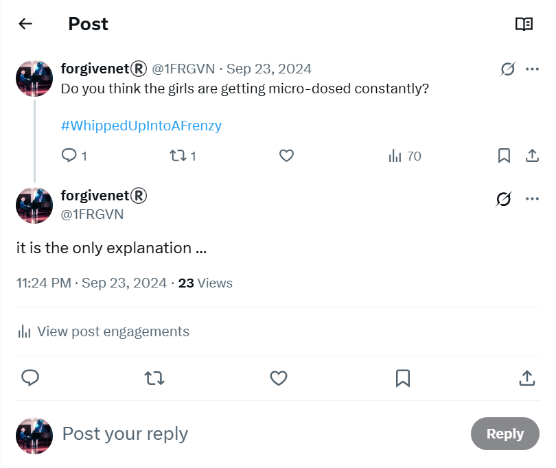
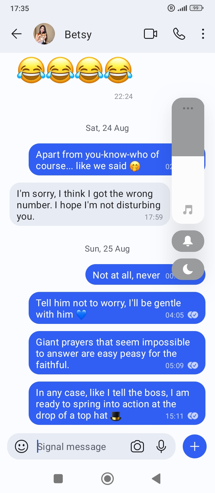
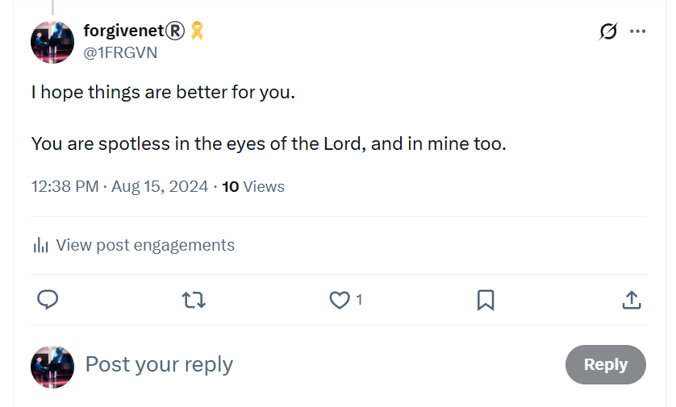
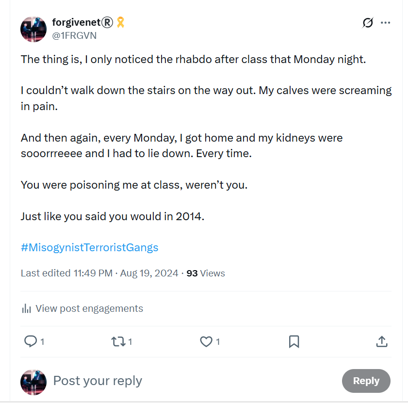
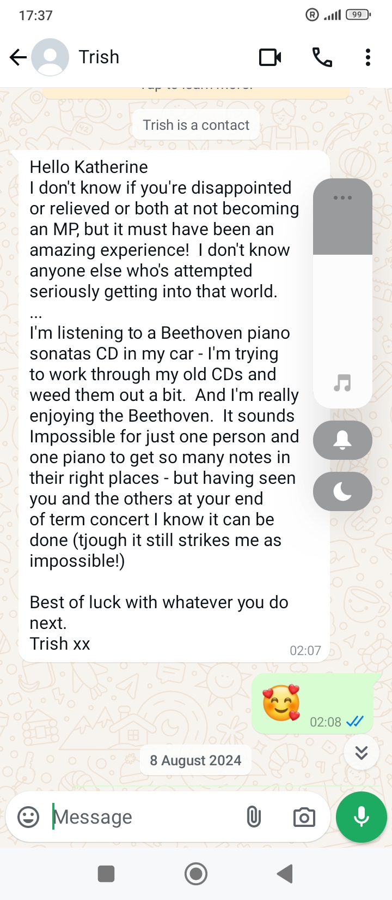
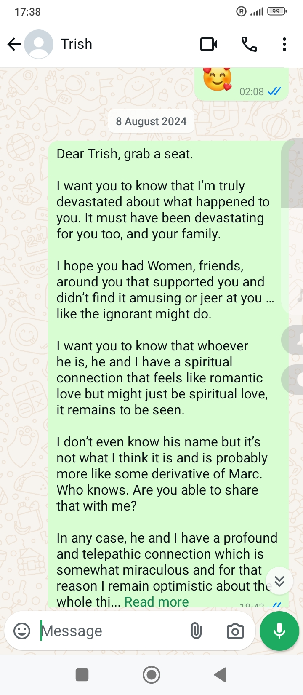
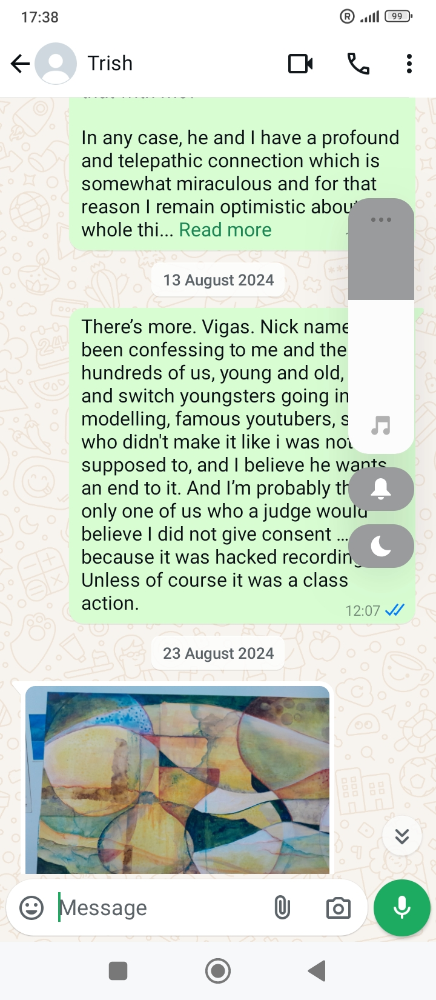
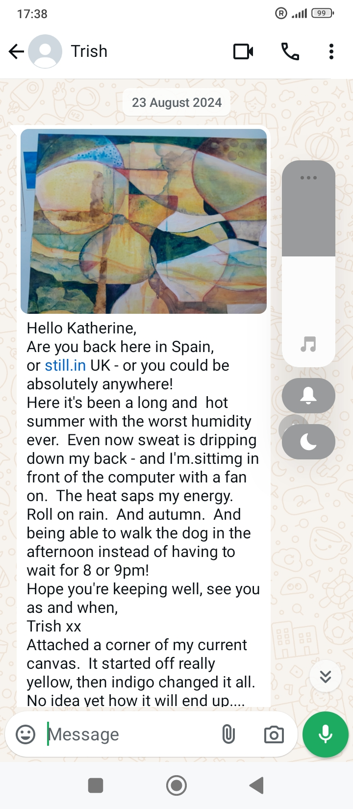
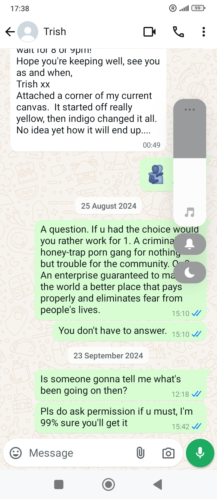

# August 2024

<div id="google_translate_element"></div>
<script type="text/javascript" src="//translate.google.com/translate_a/element.js?cb=googleTranslateElementInit"></script>
<script type="text/javascript">
function googleTranslateElementInit() {
  new google.translate.TranslateElement({pageLanguage: 'en'}, 'google_translate_element');
}
</script>

## Manipulated sexual arousal

- I head off to France to spend time in Lourdes and the Pyrenees.
- As soon as I'm out of Dénia, the intensity of the sexual arousal drops off, and then stops completely when I'm in Lourdes.
- I am, however, still extremely high and I know this because my head was swimming and spinning with constant thoughts about the trumpet teacher.
- Online harassment is ongoing, the [conversation with the hacker is continuous](july.md#big-chat-with-the-hacker-begins), and I am bombarded with porn.
- Curiously, I do find myself sexually aroused in Cauterets after having my coffee on a Monday morning, and no other time specifically.
- It's not clear why that would happen.
- [Sandra Diaz](../early-years/2014.md#sandra-rita-diaz) often visited on a Sunday evening and she always used the toilet.
- I noticed suspicious people around the whole time I was in Cauterets and, given accessing hotel rooms is no challenge for these people, it's likely they were coming into my room.
- Did whoever was tasked with adding the sexual-arousal drugs to my food or water do a bad job of it so that it only worked on a Monday morning, for some reason?
- Were they new and inexperienced porn-gang members?
- Did they add drugs to just one bottle of water maybe, which was finished by lunchtime on a Monday?
- It's bound to be something like that.

## The landlady changes the bank account for the rent, again

- Beatriz, my landlady, contacts me to inform me the bank account for the rent is changing once again.
- This is the second time in less than three years she has changed the bank account that receives the rent.
- It is my belief that Beatriz is not receiving my rent, and never was.
- These are the three Spanish bank account numbers that I paid rent to while I was living at Carrer Furs:

    ```txt
    ES7320950444909122412071 - from December 2021 to August 2022 (preliminary brain-damage poisoning period)
    ES1201280601880100047345 - from September 2022 to August 2024 (switcheroo porn period at the conservatory and with tech companies I worked for)
    ES6800865106190015755620 - from August 2024 onwards (the period of getting rid of me via honey-trap violent relationship with a pornographer, and when that didn't work murder)
    ```

- I wonder who these bank accounts really belong to?
- I now see why Beatriz had to have a [death clause](../2021/december.md#death-clause) in the rental contract.

## Interview with the hacker

- I'm in Lourdes for a week or so and then I spend the rest of the summer in Cauterets, France, up until 21st September when I return, via Madrid, to Dénia.
- In Lourdes, I stay at the [Hotel Padoue](https://www.hotelpadoue.fr/fr/lourdes-hotel) and I have the sensation I'm being watched and followed.
- I see a woman who looks like [Grace Torrellas](../2023/november.md#polygon); they have also been sending pictures of Grace-lookalikes on fake accounts.
- I remember feeling extremely high in Lourdes.
- The [conversation with the hacker](july.md#big-chat-with-the-hacker-begins) that started at home in Dénia is ongoing.
- From time to time, I believe I am talking to the trumpet teacher I love and that he loves me back.
- Our conversation is extremely intimate, and then it seems like other voices take over the conservation to make threats, send vile porn and images of violence, and play their ridiculous terror-games.
- The change of voice is obvious to me.
- Yet, it's hard for me to figure out what's going on as I believe there is only [one trumpet teacher](../../crimes/protagonists/vidal-sastre.md#vidal-sastre-sanchez-hornero), not four or more like [Maria had said back in June 2022 when I met her at the conservatory](../2022/june.md#maria-and-domingo).
- The whole thing felt like a puzzle I had to solve.
- I assume the strident and garish voices must be Domingo and Carmen Cano Lopez and their Spanish associates, along with Hazel and Sandra Smith and their British gang pals.
- I guess there could have been scores of people interacting with me during this time in a threatening or sexually grooming manner, indeed even colleagues.
- Perhaps the crime bosses allowed a little genuine communication with the actual man I loved to keep me interested and online, while still playing the long game where I would end up in their clutches.
- As mentioned, I communicate with the hacker directly in the following way:
    - I add a message to my Twitter profile - which I then delete to write the next one, hopefully making them feel safe enough to talk to me.
    - Hackers reply in the profile message of a fake account which quickly likes a post of mine so I see it immediately in notifications.
- I start to call the hacker, or the man I believe is the trumpet teacher I love, Vigas.

!!! info "Why Vigas?"
    - The name Vigas comes from the [beams interaction in May](may.md#beams).
    - I believe this is the trumpet teachers' nickname as he has big legs.
    - Vigas is the word for wooden beams in Spanish.

- Thinking back, I was shifting my tone depending on who I was talking with.
- Vigas (`@beams_game`) had been utterly repugnant in retrospect but I had been out of my mind on spiked-drugs and aphrodisiacs.

!!! tip "Present or past tense"
    - I'm finding it interesting now, at Christmas 2025, that I'm using the past tense where I stayed in the present for most of this statement. 
    - What's changed?
    - I have a sense of safety I did not previously have now that I know the truth.
    - Why use the present tense?
    - Because I was still inside the prolonged trauma, the lie, reliving it constantly in the present; and also maybe because I was still being drugged in the UK so I would not find out the truth.

- It's curious that I spoke to all the hackers I thought were the trumpet teacher as if they were one man, but I found all but one of them repellent.

- I write messages like this:

    - "Vigas Vigas, put me in the movies. Oh wait, you did already."
    - "How quickly we went from 'I'm a lowly school teacher to I control all the women in the Marina Alta'."
    - "Vigas Vigas, is it true what they're saying, that the women of the Marina Alta have stopped locking their doors since you fell in love with me".

- A lot of it was jokes, but there was serious stuff too.
- It's a two way conversation. 
- He tells me he's pure blood gypsy.
- He repeats, "I am a people".
- I tell him I don't care, I'll learn his language.
- He tells me his family will never accept me.
- He tells me he's married.
- I say I don't care, I hope he's happy, and we can all be friends.
- We talk about work and I send him job adverts for developers with salaries up to 300K; work that I should be doing with my skills and experience except the industry unilaterally hates women.
- I tell him he can go to the meetings and I'll help him with the coding (probably should be the other way around).
- He tells me that the gangs have targeted a multitude of women, young and old, in the region and he starts sending pictures of them.
- He already told me about [Rocio Vidal](../2023/october.md#rocio-vidal) back in October 2023.
- I had no idea what this meant.
- Now I do.
- I understand the true nature of the [state of Domingo's female students](../2022/june.md#maria-and-domingo) and ask him about that.



- He confirms my fears.
- I realize that Patricia and other British women have been targeted.
- I'm terrified for Trish's daughter and granddaughter, and realize this is why she doesn't talk to me normally, and why her son lives for long periods in his car in the UK (.. the gangs getting rid of any men who might raise the alarm).
- It's not Vigas, the `@beams_game` account, the [fourth man I remember from the trumpet teacher gang](../../crimes/protagonists/vidal-sastre.md#dark-thick-curly-haired-deep-set-man) that is speaking to me about these things, the tone is completely different; genuine, caring, exhausted.
- I screenshot some of the women; especially the ones I see again and again.
- There is also some suggestion that the gang has been involved in targeting children online as part of the global online child-sexual-abuse pornography epidemic. 
- After he talks to me about this a little, I see fake accounts with scared-looking children holding up plastic toys, or kitchen utensils, in their hands.
- I did not save or screenshot any of these. 
- I'm reminded of the [game they invited me to play in May](may.md#telegramsignal) and how it was attempting to lure me in.
- I sense whoever I'm talking to wants out of this dreadful life.
- I ask "How many more are you monitoring like me right now?".


- The answer comes, two more.
- I ask him why doesn't he just stop, put down his headphones, turn off his computer, and leave, do something else?
- He says they'll kidnap his daughters.

### Signal & Telegram harassment

- Since the run up to the [Polygon Bali conference](may.md#bali), I constantly receive messages on my various chat applications from weird accounts.
- I did enjoy winding them up at times, but it was relentless; missed calls, X profiles with Spanish mobile numbers, Telegram and Signal invitations to chat with fake accounts, WhatsApps from sinister-looking men I don't know.


- At least I kept them busy. 
- Here's an example from August in which I replied to a fake account on Signal.
- At the time I thought it must be [Hazel Smith](../early-years/2007.md#hazel-smith).
- Reading this back today, I wonder if I was, in fact, speaking to [Ugly](#ugly), and he mistook it for an invitation, and took me up on it?




- I think their pit-digging got the better of them and they all thought I was talking to them personally.

### Carmen Cano begging

- The conversation continues even when I'm out hiking.
- The day I visit the Viscos mountain, we chat again in the same way, except I am using the mobile instead of desktop.
- I find a curious parallel between [a book written by Paulo Coelho](https://fondationpaulocoelho.com/books/paulo-coelho-the-devil-and-miss-prym/) based in the village of Viscos, and the strange things going on between myself and the Dénia criminals.
- I realize at the time of writing this section (July 2025) and looking back at that time that I was totally high during this period in the mountains in 2024 as well as in 2023, and probably even in 2022 and 2021.
- I had no idea I was being drugged.
- While I'm hiking up towards the Viscos peak, I see in my mind's eye Carmen Cano on her knees begging for forgiveness or rather, begging someone, a man I believe, to take a different decision than the one they are taking which is causing her enormous upset.
- It's such a vivid picture in my mind, and I see it repeatedly while I'm at the mountain.
- I mention *Carmen* in some way to the hacker I'm communicating with at that moment - who I believe to be the trumpet teacher as usual.
- There is a curt retort.
- I believe now it was Carmen Cano I was conversing with at that time.
- Seeing her prostate and humble in my mind's eye has been somewhat helpful, especially when I bump into [her and another woman coming out of my apartment building and smiling at me](october.md#serious-poisoning-with-intent-to-harm-or-kill) during an attempt at murdering me by poisoning at the end of October 2024.

### The trumpet teacher sends me photos of himself and his family

- Whoever I'm talking to starts sending me photos of himself and his family.
- This one I believe to be of [trumpet teacher number three](../../crimes/protagonists/vidal-sastre.md#an-unknown-man-i-may-have-a-picture-of) and his family.


- His name may be Ivan.
- The girl in the photo always looked familiar and I wonder if it is Gloria the conservatory receptionist.
- The boy the trumpet teacher has his arm around I believe to be [the man that blew in my face](march/13-end.md#wednesday-13th-march) in March.
- The hacker talks about the above picture being his *lonely years*; he made references to being in the navy or armed services for some time.
- The picture, if indeed of trumpet teacher number four and Gloria, would be over 40 years old.
- He made sinister references to his dad, the dark figure in the background, even to the point of suggesting he and his brother had murdered him.
- The following photo is apparently his dad again, an extremely violent man who bullied his children appallingly, I was told.


- I'm really sad for him when I hear all this.
- The photo below was sent and looks like the trumpet teacher's son; in this case [trumpet teacher number two](../../crimes/protagonists/vidal-sastre.md#the-brother-or-mark-from-english-class-in-2013), the Mark version.


- He also looks a lot like *Sara de Pastor* who joined [the harmony classes in 2022-2023](../2022/september.md#harmony).
- My mother and I discuss how sad this young man looks.
- I'm not sure if anything I'm being sent is genuine.
- Nevertheless, I am delighted to receive them and I feel again a strong personal connection with whoever it is I'm communicating with.
- I believe this exuberance was manipulated online and with drugs.
- The set of photos I have now, including the two boys that always show up on Google search, make me feel like I have a decent collection of personal photos sent to me by the trumpet teacher. 


- I also have the strange sensation that the brother is called Andre because the name flies by incessantly online from dodgy stalker accounts; but I could be mistaking all the Andrew references to [the Greek man with a twitch from 2015](../early-years/2015.md#greek-man-with-a-twitch-and-sylvie).

#### Why would they do this?

- I can only assume a sick, honey-trap, violent and pornographic relationship is intended for me by Ivan, [the third trumpet teacher](../../crimes/protagonists/vidal-sastre.md#an-unknown-man-i-may-have-a-picture-of), and the pictures ensure I will recognize the man when I eventually see him.
- I had walked straight past him [when he attempted a personal meeting before](../2023/june.md#sunday-18th-june-alicante-airport), but I had recognized him.
- The sight of him there made me shudder.
- The interference with other men's pictures make everything confused online.
- Were other men trying for the same thing?
- Was it open season on *me*?

### Hidden cameras trigger

- One morning, I wake up and I see an [account](https://x.com/Cr7Rival3711) has liked one of my posts from the night before.
- It has an eagle as a profile pic; the same eagle profile pic on the account that posted about [peeping at pre-schoolers](april.md#fake-account-posts-about-peeping-at-pre-schoolers) in April.
- The account writes in the Hebrew language.
- I translate the pinned post.
- The writer details being targeted by someone who he had trusted, and had sex with, and was consequently stalked and filmed with secret cameras.
- The "he brought me back to him under different pretexts", sounds like the way Domingo and Hazel lured me back to Dénia again and again.
- I think it's a man's voice; the trumpet teacher.
- This is the message with translation:


- I respond to this terrible tweet thread that I have just read. 

[](https://x.com/1FRGVN/status/1823957507728896499.)

- This is the first moment I start to think seriously about the possibility of hidden cameras in my apartment.

### Conversations about porn

- The hacker starts to make references to having done porn, mainly gay porn, throughout his life.
- Video results on Google search for *@1frgvn x* now include gay porn.
- I feel like the trumpet teacher is baring his soul, telling me the truth about his life.
- It just seems to get worse and worse for him. 
- I empathize. I do not judge him.
- He is as he is.
- It makes sense to me now that he would not judge me when I made [my child sexual abuse disclosure](../2023/april.md#disclosing-child-sexual-abuse-to-the-trumpet-teacher) and perhaps he saw something of himself in me at that moment.
- I tell Sandra Diaz that the trumpet teacher has told me he was in porn. 
- She is horrified and asks me if I really want to be with someone like that.
- I say I don't know but I also tell her that I'm devoted somehow; that something's going on that I have no control over so I just have to trust that it is all part of God's plan.
- I bet this was lies. 
- Things had never gone as planned for the porn gangs of Dénia, and were continuing to spiral out of control.

### I realize I have been poisoned and drugged

- It took a while but I finally realize why I got [rhabdo at chamber music class](../2023/january.md#serious-poisoning-at-chamber-music-class) in January 2023.
- It was something I would never have suspected. 
- I had such a high regard for the teachers and staff at the conservatory.
- I tweet a message out to Domingo Cano Lopez about it.

[](https://x.com/1FRGVN/status/1825575948257009675)

- A hacker responds, *I am so sorry*.
- I start to think about my state of mind in general over the last two years.
- It's all becoming clear to me, finally; at least the drugging and poisoning is.
- On November 1st 2024, when I'm back in Dénia, the hacker uses a fake account to tell me something about this.
- I was back home from Fatima, where [I had just been fired egregiously from my job at Polygon](october.md#polygon-fires-the-whole-writing-team).
- A fake account with the name *Fatima* pops up with the word "medico" - doctor in Spanish.
- I'm triggered to translate the profile message.


- I wonder what they're trying to tell me; that the doctors in Dénia are poisoning people?
- Could it be true?
- There was a doctor from the hospital at the class before mine when they gave me rhabdo.
- I suspect this is also a warning to me because that last week I lived in my apartment in Dénia, sorry porn studio, I was being seriously poisoned.
- In fact, [they tried to murder me that week](october.md#serious-poisoning-with-intent-to-harm-or-kill) by poisoning my water, food, toiletries, everything.
- They had also doused all my belongings in pesticides while I was away in Fatima.
- The hacker says sorry again in a similar way, in July 2025, as I'm writing to Moorfields Eye Hospital to report deteriorating peripheral vision.


- This is just before [another failed murder attempt](../2025/july.md#lourdes) in Lourdes, carried out by a woman Domingo knows well who may be called Taya.
- They're not at all sorry, are they.
- Do they think that saying sorry before they murder someone, or telling them what their evil plan is ten years before they carry it out, somehow absolves them?

## Grooming an innocent girl into porn 101

- I start to see a woman on multiple fake accounts repeatedly.
- I have been seeing her probably for over a year already but only now and then.
- I think the earliest screenshot I have of her is from April 2024 but I had been seeing her for a much longer time back, probably even from back in May 2023.
- The pictures start innocently and modestly, as if she is getting some professional pictures taken.


- Perhaps her and the photographer start up a relationship and he asks for personal photos from her phone.


- The ducks are significant as this woman has been targeted by the porn gangs and is steadily being groomed and probably drugged too.
- For some reason, she is a "sitting duck".


- The photos then evolve into pictures of her privately sending nudes to someone.


- I then see her masturbating in private and filming it on her mobile where, in my screenshot below, you can only see her head. She is completely naked.


- The professional "photo shoots" also evolve into something sexual, with more naked skin showing each time.


- The pics then appear to be part of actual porn or prostitution. 
- In the first here, she is only wearing a vest top.
- I mention [vest tops](../2023/may.md#elvira) previously with regards to one of the children at the conservatory - Domingo's student - wearing a vest top just like this one for the choir concert.


- [Trumpet teacher number three](../../crimes/protagonists/vidal-sastre.md#an-unknown-man-i-may-have-a-picture-of) was in the audience that evening.

- Finally, I see photos where the woman appears to be doing professional porn.


- Note the tattoo on her stomach. 
- I see this tattoo again on my last walk along [Las Marinas beach in October](october.md#sunday-6th-october) where I was so high I was hallucinating, and I was stalked and followed by middle-aged men for the whole walk which I eventually cut short it was so threatening.
- I had the presence of mind to take my hiker's cam with me that day, and it was filming, and I believe I have images of them all.
- It was very disturbing to see this woman over and over; I've only posted a small selection of the images I saw of her.
- This was just the beginning of multiple women I saw in fake accounts; with images going from them privately sending nudes to ending up in a porn shoot non-consensual, sedated, and likely violent.
- The conversation with the hacker is now about these women; who they are, and how appalled I am.
- Some of the pics are of women in even more shocking scenarios.
- I ask the hacker how long it takes for them to (drug and) groom a woman like this.
- He responds; about six months.

### The woman's daughter

- I see [this woman](#grooming-an-innocent-girl-into-porn-101) every day, relentlessly.
- After a few weeks of this, I start to see another woman.
- She looks young, maybe 14, and she has exactly the same facial features at the innocent woman.
- It is her daughter.
- Whoever the father is, looks like [number three trumpet teacher](../../crimes/protagonists/vidal-sastre.md#an-unknown-man-i-may-have-a-picture-of) and of all the men pretending to be [Vidal Sastre Sanchez Hornero](../../crimes/protagonists/vidal-sastre.md#vidal-sastre-sanchez-hornero) that I remember he would be the only possible father due to skin color.
- I realize that the woman was targeted over a decade ago, and they got a baby from her.
- Here she is:


- More product.
- When I see the daughter, she is in suggestive poses; post sex wearing the man's shirt, that sort of thing.
- There were also a bunch of photos of her where she is *very clearly* underage, like 11 or 12.
- Are they trying to say to me - along with the sexual arousal and constant porn bombardment - look, this is what women we know do, you could do it too?
- I have a feeling that was always their end goal for me.

## Having a baby with the trumpet teacher

- This was another set of psychological triggers and symbolism coming from their hypno-tech.
- The suggestion was that we were going to have a child, myself and the trumpet teacher.
- The manipulation was extremely powerful and while I was high I did indeed believe this.
- I saw a newborn in my arms while sitting on the sofa in Carrer Furs one evening probably at the end of April.
- They posted pictures of a boy who might have been our child grown up.
- It was relentless, again, especially over this period of intense targeting and drugging.
- It's curious because I hadn't considered having children at my great (not really) age, but now I am open to it in a sane and healthy way, so they shot themselves in the foot a little there.
- Also, this particularly evil form of the psychological manipulation they subject women to was now revealed, for me to report on.
- It made me start thinking about all the babies these men must have had, and for what sick purposes; especially considering the hacker had been telling me about how a big part of their recent business had been [manipulating children online into porn](#interview-with-the-hacker).
- Makes Epstein & Co look like pipsqueaks.

## Communication with Patricia

- Patricia Penny, one of the British ex-pat hikers, sends me a WhatsApp message over this period which I find a little unusual.
- Trish rarely sends me WhatsApps and in the midst of intense targeting and drugging by the porn gangs, I find it suspicious; especially the piano content and no mention of how I've been driven out of the conservatory in fear for my life.
- Just like everything's normal... is it supposed to be a tiny psychological wounding?
- It is not the first time she did something like that.
- *Best of luck with whatever you do next*, is more than sinister if everyone's expecting me to end up in the field with the horse.

{width=35%}

- I reply candidly.
- It's astonishing to read these chats that reveal how something evil has gotten a hold of my mind and how I'm constantly rewriting it into love.
- Nevertheless, I know that whatever was happening to me, a very bad thing, has also happened to her.

{width=35%}
{width=35%}

- It's so curious I mention Marc, then Vigas.
- The random canvas she sends me looks a bit like a man and woman in bed.
- Does he have his hands around her throat?
- I wonder if it comes from a still of events at my apartment (sorry, sedated porn studio).
- Is it supposed to be another psychological wounding?
- That she completely ignores everything I have said to her, and then ignores my next messages, I find extremely sinister.

{width=35%}
{width=35%}

- She sounds tired and too hot to be sat at her laptop.
- Trish is in her seventies.
- I wonder if her husband is being kind to her or not.
- He's younger than her by quite a bit, Spanish.
- I wonder what's in the tea he brings her every morning.


- I wonder what happened to her British husband and why she married the man that probably came out to [terrorize me at Halloween 2023](../2023/october.md#halloween); the man who could be a brother of [trumpet teacher number four](../../crimes/protagonists/vidal-sastre.md#dark-thick-curly-haired-deep-set-man) who [I actually saw in my bed](../2023/april.md#dreaming-of-the-trumpet-teacher), thinking it must have been a dream, back in those heady nights of sedated switcheroo after chamber music class at the conservatory.

## Ugly

- The constant cyber-stalking, porn bombardment, psychological manipulation, and all the rest of it was completely separate to the more intimate and genuine conversation I was having with someone I believed was the trumpet teacher I loved. 
- Of course, I may have been *supposed to* think this, I thought often, until recently.
- Communication starts in a way which seems relatively private. 
- Then other voices get involved; there's a lot of piss takes and wind ups, insults, etc. And then finally there is some shocking threat of violence or similar and communication breaks down. 
- I've detailed numerous examples of that already. 
- So the same pattern had developed within this intimate conversation about [the targeted women](#suspected-targets) while I was seeing photo after photo of them on fake accounts.
- One evening, breaking into a communication I felt was genuine, a fake account likes one of my posts.
- I check the profile and I see an extraordinarily ugly looking man and numerous photos of him with a young girl of about eight years old.
- It's a classic fake account, just a few pics, all of him, some with the girl.
- He's brown-skinned and when I think back he may have been bare-chested.
- He was wearing kilos of gold chains.
- He looks, to me, like a very evil person.
- The profile shocks me.
- I'm so appalled, I close down my laptop and go to bed.
- I do not screenshot the profile or keep a link to it.
- To be fair to the man, his ugliness looks like the result of being beaten up extraordinarily badly so that he ended up disfigured.
- Someone had intended to kill him decades ago, I guess, and failed, it looked like.
- The child with him looks exactly like Marie Fielding or Henderson (Zoe BJ's friend) young daughter.
- I don't notice this at the time although my brain registers it today. I had assumed it was his daughter.
- Marie has two daughters, I met them back in 2012 probably; one was about eight and the other twelve or so.
- The photo could have been either of the daughters when they were about eight.
- A few days later, maybe even the next day, I'm at the thermal baths in Cauterets.
- This exact same man is sitting in one of the bubble chairs facing my direction.
- He's a lot older.
- He is sitting in the same [bubbly chair](../2023/august.md#in-the-baths-at-cauterets-with-sandra-rita-diaz) where I told Sandra Rita Diaz I would tame the trumpet teacher.
- He is with a younger woman with long curly reddish hair.
- The next day, a Monday I believe, I see them both in Lourdes.

### Distract and drug activity

- I'm walking alongside Les Halles heading towards the high street.
- I see the ugly man and the woman he was with at the baths walking towards me.
- I'm amazed.
- He passes me quickly, leaving the woman behind him.
- Then she starts to look concerned and worried, as if they're arguing, and she starts running after him.
- As she goes, she runs beside me on my right side.
- It's textbook gypsy poisoning tactics and I wonder today if he had gone around to my left while I was distracted and popped something into my ear, as they do.
- I would recognize him again.
- If anyone has a pic, that'd be cool.
- This happens after [I start writing the handwritten letters](#the-handwritten-letters), because I add a note about it at the end of my original letter as it was superlatively threatening and needed mentioning.
- And most curiously, I think I know who this person is.
- And was he the same ugly man [I saw in Amsterdam](../early-years/2001.md#amsterdam) all those years ago?

## Suspected targets 

- I realize I'm one of hundreds, maybe thousands of targets.
- women and girls lured into relationships that don't exist with the intention of blackmail and exploitation, or silencing.
- I'm seeing pictures of women that could be decades old. 
- I can't believe it could be just one man doing all this.
- I don't know I've been brain damaged and it will take a miracle in September 2025 for me to realize that four or more men had turned up to the conservatory of Denia on Monday evenings pretending to be the same one man.
- In this section, I'll publish all the accounts I believe had pics of targets on them but please understand some may be incorrect due to the ephemeral nature of the interactions.
- Also, please note that this is only a small proportion of what I saw. It has been impossible to collect everything. It would have meant taking constant screenshots.
- It is my belief that as soon as law enforcement starts to take action on what's been happening to me for so many years, we will be able to find out exactly how many women, children, and babies have been targeted, if they're still unwell, or murdered, how many were murdered and when, and where they are now.
- I believe it could be in the hundreds, maybe thousands in Denia alone.
- The hacker told me there were old and young, that the British expat community and other foreigners were targeted often, and he suggested one older woman may have dropped down dead from the shock of finding out, possibly in October 2022.
- He also stated he loved every one of them! I think this must have been Ivan speaking, Gloria's brother, the man who was probably planning on devouring me somehow, so safe he felt he was, he sent me a pic!
- Some of these photos I believe are illicit and the subject doesn't know she is being photographed. I believe many of these to be the "when she finds out" content and I wonder if this is a porn genre.
- Maybe we can start the whole thing up again and get some more photo evidence, the ones I didn't screenshot maybe.

| Suspected targets posted in August |
|-|
|  
This looks like a first meeting. Has she traveled over? She appears to have her overnight back with her. There are pictures later on which show her in a video shoot of some sort with much longer hair. |
|  |
|  The profile message on this pic mentioned three blows to the head. |
|  |
|  
The obvious inference of the above two pics is clear and extremely disturbing. |
|  
Referencing bunny girls maybe. Surely this is a photo shoot but the girls look extremely young. |
|  |
|  |
|  |
|   |
|   |
|   |
|   |
|  
This woman does not know she is being photographed. |
|   |
|   |
|   |
|   |
|  
The two pics above are the same woman I often see dressed as a sexy nurse on a bed about to engage in sexual activity. It's never clear if she's aware of being filmed. I wonder if she is the nurse that lived at my apartment for a couple of weeks. Note the vile profile message that suggests she is dead in an umarked grave.  |
| 
This pic looks exactly like a student of the conservatory studying under Domingo the piano teacher: [Elsa](../2023/october.md#gang-stalking-by-conservatory-civil-servants) who I have mentioned before. |

## Irene, the plate lady

- We're clearly having a very intimate conversation about some very dark matters.
- I ask, "So who was [plate lady](../2023/july.md#plate-lady-early-in-the-month) then?".
- An answer comes immediately, "Irene".
- I look up on Google "Irene, ceramics artist, Valencia". 
- There she is online. Except she is about 50 now: https://alfarim.es/coneix-nos. Irene Molina Pascual.
- There is no doubt. This is the woman I saw as a 30 year old in pics posted and manipulated for me to see via Google search in July 2023 when searching with the `@jctot19` and `@sinremite` accounts.
- I am amazed!
- Remember that the hacker at this stage is watching everything I do online in real time. We are having a real-time conversation.
- I say, "that's her isn't it?".
- The hacker responds, "nooooo". But it is undoubtedly her.
- Irene is a well known ceramics artist running her ceramics business in Onda in the Valencia region.
- I realize that the stalker/honey trap pattern is to target (potentially) successful women. Is this to stop women moving forward in the world, or is it to defraud them over long periods with sexploitation material?
- The pictures of Irene that I saw in July 2023 on the `@jctot19` and `@sinremite` accounts were at least 20 years old.
- The hacker highlights for me another lady who may be being targeted, a sportswoman in Castellon, Lidia Sanchez Puebla.
- I'm stunned.
- I believe I have enough evidence to share and I feel it's my responsibility to help these abused women.
- But how can I share the information I have without the hackers seeing it?

## The handwritten letters

- Given my laptop is fully accessed by hackers, I write, painstakingly by hand, a letter to my friend explaining everything that's happened.

    - [The handwritten letter explaining what's going on](../../content/documents/letters/scanned-hand-written-letter.pdf).

- I also copy and send this letter to 40+ agencies, newspapers, and well known people, all over the world.
- I do this for two reasons:
    - Justice for the good people of Dénia and the Marina Alta region; especially the children, women, and girls.
    - To ensure my safety in some way because these people clearly have no intention of leaving me alone.
- Along with the letter, I send some of the pictures that have been sent on fake accounts that may be related. I send all the [trumpet teacher photos](#the-trumpet-teacher-sends-me-photos-of-himself-and-his-family). 
- I also send pics of Rocio Vidal who I believe has been targeted since, as I mentioned, I saw a fake account pic of her on the bed about to take her clothes off.


- I also send a copy of the first page of my [denuncia from March](march/13-end.md#reporting-the-crimes-to-the-police-in-madrid).
- The conversation with the hacker continues as I do this.
- Did they know I was writing scores of letters by hand, I wonder?

## Gabriel Silva's first team meeting as manager

- It's late August and everyone is back from holiday.
- Gabriel has [taken over my role as manager of the docs team at Polygon](july.md#gabriel-silva-is-given-my-role-at-polygon).
- The whole team is there; Anthony, Hans, myself, and Gabriel.
- Hans and Anthony are good as gold. 
- Hans is particularly reverential towards Gabriel.
- I nearly guffaw.
- Gabriel announces, smiling, that he is going to be doing a bit of a ***switcheroo***.
- And giggles.
- He then distributes all my work to Hans and Anthony, leaving me with none.
- It's obvious to me what's going on, apart from the *switcheroo* reference at this stage.
- I start thinking about what I'm going to do.
- It's hard to get clear about what to do about anything else while I'm receiving [picture-after-picture of targeted women](#suspected-targets), and trying to get [the handwritten letters out](#the-handwritten-letters) to as many people as I can.
- Since understanding Gabe's reference to *switcheroo* in [September 2025](../2025/september.md#thunderbolt-clarity), I wonder if he is aware that for something so vile to work, the target has to be brain-damaged so that she can't identify objects out of context, including people.
- She also has to be continuously drugged to make her confused in situations in which those men appear.
- Of course, given the whole *switcheroo* at the conservatory thing had finished on [12th June 2023](../2023/june.md#monday-12th-june-2023) and I was obviously still of the mind there was *only one man*, everyone must have thought I'd never figure it out.
- But I had been looking at actual photos of the [minimum four distinct men](../../crimes/protagonists/vidal-sastre.md#four-distinct-men) who made up the *switcheroo* team at the conservatory since June 2023.
- It really was only a matter of time before I figured it out, and so murder is most likely the next step for women like me, and this must be understood very well by all involved.
- Time was ticking and my memory would be coming back...
- Is this the main reason behind the vicious persecution at work to get me to leave as soon as possible? 
- It is certainly the main reason behind continued drugging and poisoning in Spain and the UK in 2025.
- One wonders, if an absolutely certainty of my demise made my colleagues feel they could safely make references to what they knew was happening to me at the hands of a criminal gang.
- I have to thank Gabriel for using this term so egregiously; because it was the first thing I remembered after realizing there were at least four distinct trumpet teachers at the conservatory (and/or in my apartment).
- Who told everyone I'd never have the time to remember what was staring at me in the face?
- And why was everyone OK with that?

### Reprimanding me

- Soon after, in a one-to-one, Gabriel tells me I'm being watched carefully by Jonathan in HR and the business in general for taking too much holiday.
- Was Jonathan aware of what was going on too?
- You can't imagine the intensity of the persecution I was feeling at work alongside constant terror from carefree criminal porn-gangs who had a very sinister end goal for me.
- It was overwhelming and I'm surprised I'm here, sane, and able to tell my story.
- I pray some good comes from my experiences and that perhaps women and girls might be able to study engineering and work in tech safely.
- I guess none of this is surprising though.
