# August 2024

## Sexual arousal

- I head off to France.
- As soon as I'm out of Dénia, the intensity of the sexual arousal drops off and then stops when I'm in Lourdes.
- However, intermittently, I find myself aroused in Cauterets, usually after having my coffee in the morning.

## The landlady changes the bank account that receives the rent again

- Another plot failure sparks a new bank account change.
- This time probably to Carmen Cano's account, Domingo's sister, now tasked with finishing me off for good.

## Conversation with the hacker

- I travel to Lourdes and spend the whole summer in France up until 21st September when I return, via Madrid, to Dénia.
- I communicate with the hacker directly in the following way:
    - I add a message to my Twitter profile.
    - He replies in the profile message of a fake account.
- I start to call him Vigas.

!!! info
    - The name Vigas comes from the [beams interaction in May](may.md#beams).
    - I believe this is the trumpet teachers' nickname as he has big legs.
    - Vigas is the word for wooden beams in Spanish.

- I write messages like this:
    - "Vigas Vigas, put me in the movies. Oh wait, you did already."
    - "How quickly we went from 'I'm a lowly school teacher to I control all the women in the Marina Alta'."
    - "Vigas Vigas, is it true what they're saying, that the women of the Marina Alta have stopped locking their doors since you fell in love with me".
- A lot of it was jokes, but there was serious stuff too.
- It's a two way conversation. 
- He tells me he's pure blood gypsy. He repeats, "I am a people".
- I tell him I don't care, I'll learn his language.
- He tells me his family will never accept me.
- He tells me he's married. I say I don't care, I hope he's happy, and we can all be friends.
- We talk about work and I send him job adverts for developers with salaries up to 300K; work that I should be doing with my skills and experience except the industry unilaterally hates women. I tell him he can go to the meetings and I'll help him with the coding.
- He tells me that he has targeted 100s of women in the region and starts sending pictures of some of them.
- I realize this is exactly what has happened to Patricia and, coupled with the fact she has a daughter and granddaughter, this is why she doesn't talk.
- I see pictures on fake accounts of young and old women. I screenshot some of them.
- He's also feeding me information regarding secret filming, spiking, and drug taking.
- There is some suggestion that the gang has been involved in targeting children online as part of the global online child-sexual-abuse pornography epidemic. After he talks to me about this a little, I see fake accounts with scared-looking children holding plastic toys in their hands. I did not save or screenshot any of these. 
- I'm reminded of the [game they invited me to play in May](may.md#telegramsignal).
- I sense whoever I'm talking to wants out of this dreadful life.
- I ask "How many more like me?". The answer is two more.

## Signal and Telegram

- I get messaged on various chat applications by weird account.
- Here's one I added to the [Signal page](../../evidence/signal.md#signal)
- I did enjoy winding them up, but it was relentless; missed calls, X profiles with Spanish mobile numbers in... 
- At least I kept them busy. 
- Did they know I was writing scores of letters by hand, I wonder?

## Carmen Cano

- The conversation continues even when I'm out hiking.
- The day I visit the Viscos mountain, we chat again in the same way, except I am using the mobile instead of desktop.
- I find a curious parallel between [a book written by Paulo Coelho](https://fondationpaulocoelho.com/books/paulo-coelho-the-devil-and-miss-prym/) based in the village of Viscos, and the strange things going on between myself and the Dénia criminals.
- I realize at the time of writing this section (July 2025) and looking back at that time that I was totally high during this period in the mountains in 2024 as well as 2023.
- I had no idea.
- While I'm hiking up towards the Viscos peak, I see very clearly Carmen Cano on her knees begging for forgiveness or rather, begging someone, a man I believe, to take a different decision than the one they are taking which is causing her enormous upset.
- It's such a vivid picture in my mind, and I see it repeatedly while I'm at the mountain.
- I mention *Carmen* in some way to the hacker I'm communicating with at that moment - who I believe to be the trumpet teacher as usual.
- There is a curt retort.
- I believe now it was Carmen Cano I was conversing with at the time.
- Seeing her prostate and humble in my mind's eye has been somewhat helpful, especially when I bump into [her and another woman coming out of my apartment building and smiling at me](october.md#serious-poisoning-with-intent-to-harm-or-kill) while I was being seriously poisoned at the end of October 2024.

## I realize I have been poisoned and drugged

- It took a while but I finally realize why I got [rhabdo at class](../2023/january.md#serious-poisoning-at-chamber-music-class).
- It was something I would never have suspected. I had such a high regard for the teachers and staff at the conservatory.
- https://x.com/1FRGVN/status/1825575948257009675
- I start to think about my state of mind in general over the last two years.
- It's all becoming clear to me, finally.
- I say "omg, you drugged me at class and gave me rhabdo".
- He responds, "I am so sorry".
- On November 1st 2024, when I'm back in Dénia, and although the conversation by that time has stopped mostly, the hacker uses a fake account to tell me something about this.
- I've just recently got back from Fatima, and I see the word "medico" which is doctor in Spanish, so I'm triggered to translate the profile message.

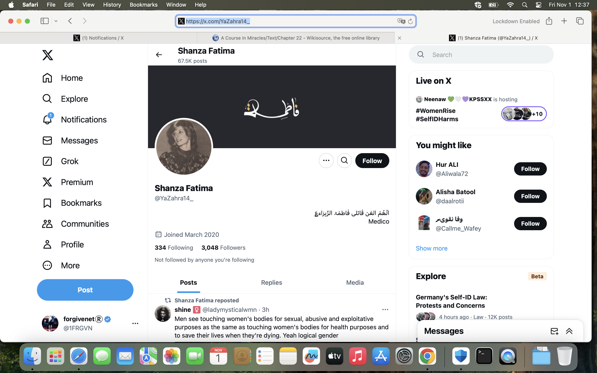
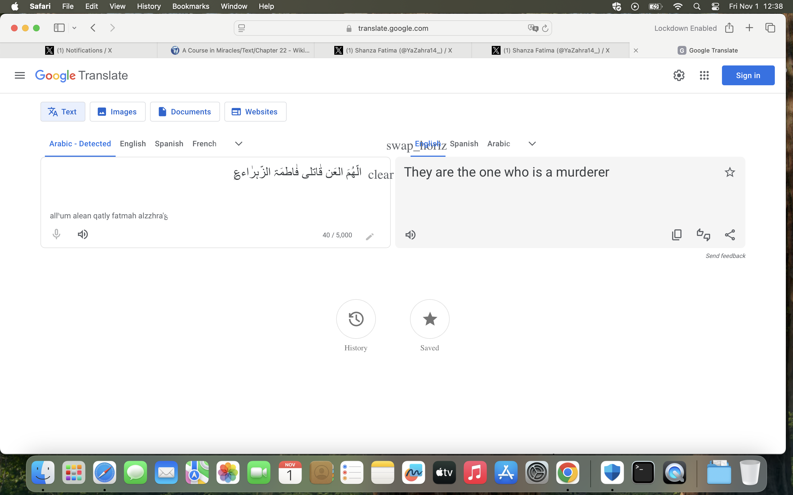

- I also suspect this is a warning because the week I am in Dénia at my flat, from 27th October until I leave for London on the 3rd November 2024, I am certain I am being poisoned, and quite seriously too.
- The hacker says sorry again in a similar way, in July 2025, as I write to Moorfields Eye Hospital to report deteriorating peripheral vision.

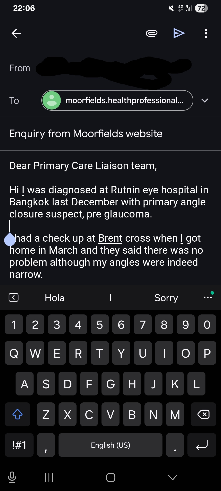

- It's difficult to know what to think about this.
- I would obviously accept a genuine request for forgiveness.
- I don't think it could possibly be the Cano's and associates who seemed to delight in the idea of my deteriorating health.
- I still have samples.

## Hundreds of women like me

- I realize I'm one of hundreds, maybe thousands of targets.
- women and girls lured into relationships that don't exist with the intention of blackmail and exploitation, or silencing.
- I'm seeing pictures of women that could be decades old. 
- I can't believe it could be just one man doing all this.

## The trumpet teacher pics

- He sends interactions with accounts that have pictures that could be the trumpet teacher and his family from a long while back.

- He talks about the above picture being the "lonely years" and there may be references to him being in the navy or armed services of some variety.
- The following pic is apparently his dad, an extremely violent man who bullied his children appallingly, I'm told. I'm really sad for him when I hear all this.

- I believe the pic below is the trumpet teacher's son, but of course I'm not at all sure about any of this and it could be an extremely elaborate con.

- Me and my mother discuss how sad this young man looks.
- I'm not entirely sure if these are genuine pics or not.
- However, I am delighted to receive them and I feel again a strong personal connection with whoever it is I'm communicating with.
- These pics, coupled with the pics of the two boys that always show up on Google search, make me feel like I have a collection of personal pics sent by the trumpet teacher. 
- I also have the strange sensation the brother (possible twin) is called Andre.

## Hidden camera account

- One morning, I wake up and I see an account that has liked one of my posts from the night before.
- It has an eagle as profile pic. The same eagle profile pic on the account that posted about [peeping at preschoolers in April](april.md#fake-account-posts-about-peeping-at-pre-schoolers).
- The account writes in the Hebrew language and I translate the pinned post.
- The post details being targeted by someone who he had trusted, and had sex with, and was consequently stalked and filmed by secret cameras.
- The account is here: https://x.com/Cr7Rival3711.
- The pinned message is translated here:

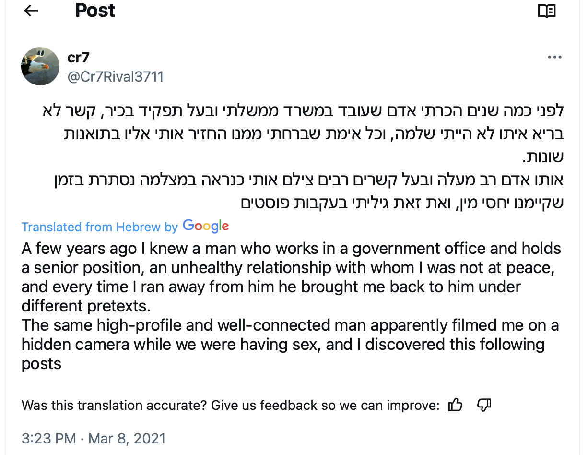

- I respond to this terrible tweet thread that I have just read: https://x.com/1FRGVN/status/1823957507728896499.
- I start to think seriously about the possibility of hidden cameras in my apartment.

## Conversations about porn

- The hacker starts to make references to having done porn, mainly gay porn, throughout his life.
- The video results on the Google search for "1frgvn x" now include gay porn.
- I feel like the trumpet teacher is baring his soul, telling me the truth about his life.
- It just seems to get worse and worse for him. 
- I empathize. I do not judge him.
- He is as he is.
- It makes sense to me now that he would not judge me when I made [my child sexual abuse disclosure](../2023/april.md#disclosing-child-sexual-abuse-to-the-trumpet-teacher) and perhaps he saw something of himself in me at that moment.
- I tell my friend from Lourdes that the trumpet teacher has told me he was in porn. She is horrified and asks me if I really want to be with someone like that.
- I say I don't know but I also tell her that I'm devoted somehow; that something's going on that I have no control over so I just have to trust that it is all in God's plan.
- I now wonder if everything I felt was just the long-term effects of narcotics I did not know I was ingesting.

## Communication with Patricia

- Patricia sends me WhatsApp messages over this period which are rather unusual.
- I'm very candid with her on [WhatsApp chats](../../evidence/whatsapps.md#patricia).
- I wonder if she is being asked to check up on me.
- She ignores everything I say in my messages but keeps communicating with me.
- I assume she is not allowed to make comments on anything I have said.
- It is very sinister. She sounds tired and too hot to be sat at her laptop. I wonder if her man is being kind to her.

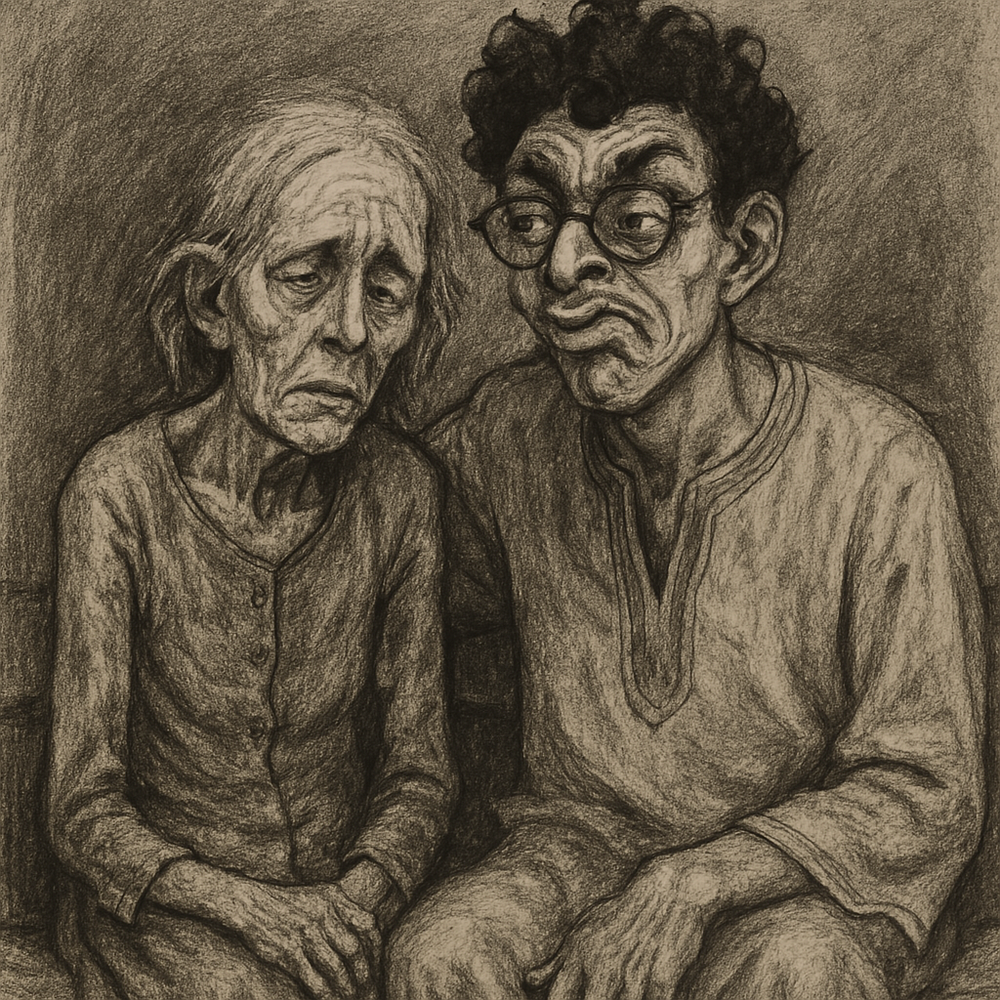

## Photos of abused women and girls

- At this time, I start to see a woman on fake accounts repeatedly.
- In fact, I have seen her probably for over a year, I think the earliest pic I have of her is from April this year but I was receiving them for a much longer time back also.
- The pictures start innocently and modestly, as if she is doing a modeling photo shoot.

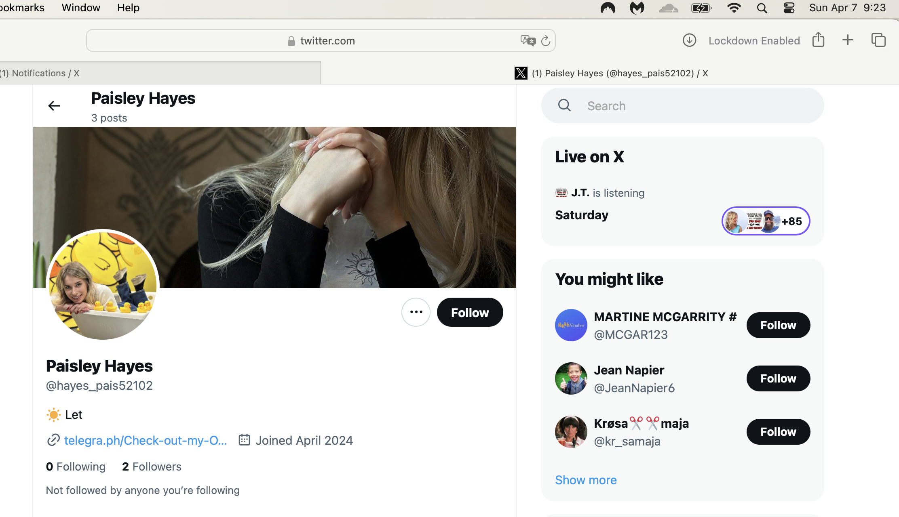

- They then appear to show her privately sending nudes to someone, and these private pics escalate into sexual activity.

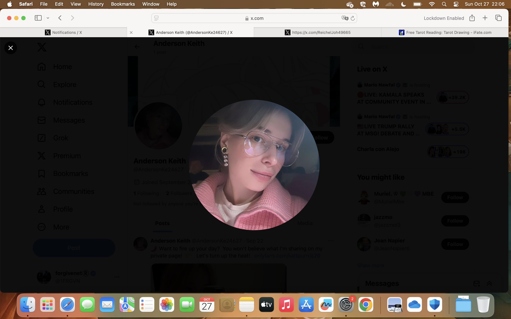

- They then become her masturbating in private and probably filming it on her mobile. I deleted this one but kept a screenshot of the account where it showed up. The pic of her masturbating is the bottom pic where you can only see her head. She is completely naked in this picture.

- The pics then become a process towards being involved in serious porn or prostitution.

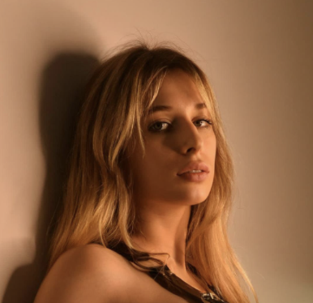
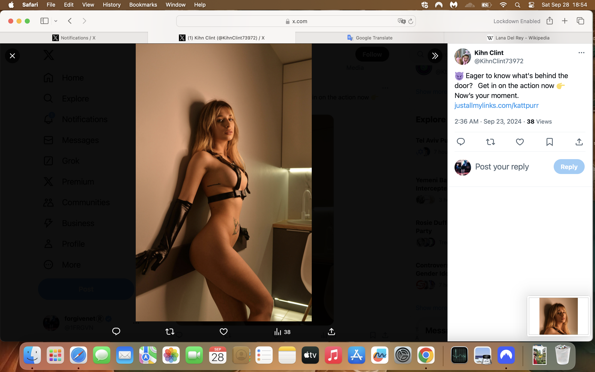
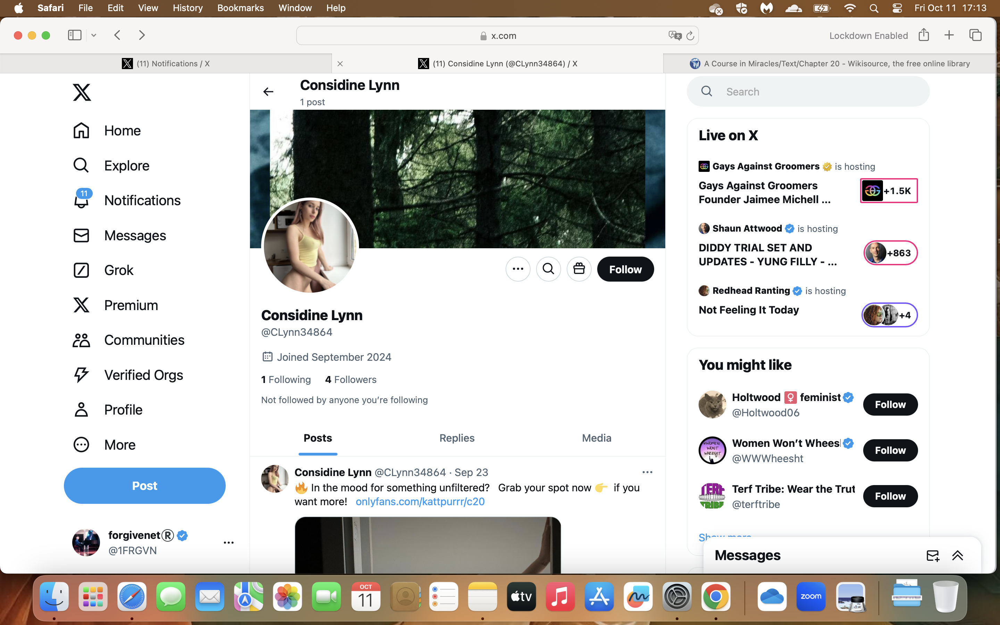
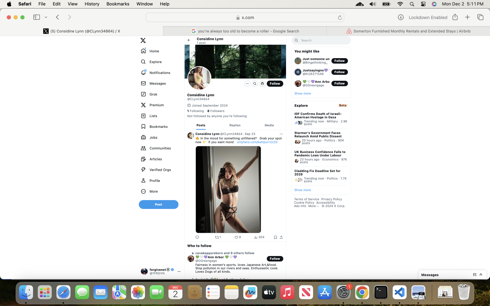

- It was very disturbing to see this woman over and over. And this is only a small selection of the images I saw of her.
- There were other women just like this too, going from privately sending nudes to clearly ending up in porn, likely sedated, non-consensual, and violent.
- The conversation I'm having with the hacker is about these women, who they are, and how appalled I am.
- They all look either that they believe they are in private, or they are drugged and in situations it is not clear they would agree to if they were in their right minds. 
- Many of the pics he sends via fake accounts appear to be a moment of shocked realization at having been filmed without consent or worse.

### The woman's daughter

- Pictures of this woman are posted to me every day, relentlessly.
- After a few weeks of this (although the first time I saw the woman was June 2023 most likely) another woman starts popping up.
- She looks about 18 and has exactly the same facial features.
- It is her daughter.
- Whoever the father is, looks a little bit like [number three trumpet teacher](../../crimes/protagonists/vidal-sastre.md#an-unknown-man-i-may-have-a-picture-of) and of all the men who I remember this would be the only possible father due to skin color.
- I realize that it is likely the original pics of the woman were taken maybe twenty years ago.
- They got a baby from her.
- Here she is:

- More product.
- When I see the daughter, she is in suggestive poses, post sex wearing the man's shirt, that sort of thing.
- There were also a bunch of photos of her where she is *clearly* underage.
- Are they trying to say - along with the sexual arousal and constant porn bombardment - look, this is what women we know do, you could do it too?

## Irene, the plate lady

- We're clearly having a very intimate conversation about some very dark matters.
- I ask, "So who was [plate lady](../2023/july.md#plate-lady-early-in-the-month) then?".
- An answer comes immediately, "Irene".
- I look up on Google "Irene, ceramics artist, Valencia". 
- There she is online. Except she is about 50 now: https://alfarim.es/coneix-nos. Irene Molina Pascual.
- There is no doubt. This is the woman I saw as a 30 year old in pics posted and manipulated for me to see via Google search in July 2023 when searching with the `@jctot19` and `@sinremite` accounts.
- I am amazed!
- Remember that the hacker at this stage is watching everything I do online in real time. We are having a real-time conversation.
- I say, "that's her isn't it?".
- The hacker responds, "nooooo". But it is undoubtedly her.
- Irene is a well known ceramics artist running her ceramics business in Onda in the Valencia region.
- I realize that the stalker/honey trap pattern is to target (potentially) successful women. Is this to stop women moving forward in the world, or is it to defraud them over long periods with sexploitation material?
- The pictures of Irene that I saw in July 2023 on the `@jctot19` and `@sinremite` accounts were at least 20 years old.
- The hacker highlights for me another lady who may be being targeted, a sportswoman in Castellon, Lidia Sanchez Puebla.
- I'm stunned.
- I believe I have enough evidence to share and I feel it's my responsibility to help these abused women.

## The letters

- Given my laptop is fully accessed by hackers, I write, painstakingly by hand, a letter to my friend explaining everything that's happened.

    - [The handwritten letter explaining what's going on](../../content/documents/letters/scanned-hand-written-letter.pdf).

- I also copy and send this letter to 40+ agencies, newspapers, and well known people, all over the world.
- I do this for two reasons:
    - Justice for the good people of Dénia and the Marina Alta region; especially the children, women, and girls.
    - To ensure my safety in some way because these people clearly have no intention of leaving me alone.
- Along with the letter, I send some of the pictures that have been sent on fake accounts that may be related. I send all the [trumpet teacher pics](#the-trumpet-teacher-pics). 
- I also send pics of Rocio Vidal who I believe has been targeted since, as I mentioned, I saw a fake account pic of her on the bed about to take her clothes off.

- I also send a copy of the first page of my [denuncia from March](march/13-end.md#reporting-the-crimes-to-the-police-in-madrid).
- The conversation with the hacker continues as I do this.

## Followed by the gypsy in France

- There comes a point in the conversation with the hacker over this time that feels like other people are now involved.
- Peppered into the conversation are threats of violence, porn references, references to Ana again, wind up messages, the usual harassment.
- However, in our chat I was very clear that I could not feel jealousy towards any woman that might make a man I loved happy, so I wondered who was posting these things. 
- It seemed like, somehow, this stalker activity was completely separate to the conversation I was having with the hacker who I believed was the trumpet teacher. Of course, I may have been "supposed to" think this.
- I assume others, Carmen Cano mainly, found out that we were communicating again and got involved. The reason I say Carmen Cano is because of things the hacker told me at that time, certain warnings he gave.
- This had always been the pattern. Communication starts in a way which seems relatively private. Then there seems to be other voices involved, then a lot of piss takes and wind ups, insults etc. And then finally there is some shocking threat of violence or similar and communication breaks down. This is the pattern from:
    - April to June 2023 while conversing over Twitter.
    - June to August 2023 while conversing over Twitter, although there were obviously more than one involved in this communication. As I mentioned to Matthew Copeland at the time, I felt I had an audience.
    - After that, the pattern repeats mainly with fake account activity, such as the American account Matthew, the account from Madrid at Christmas, Beams, HierEncore, etc, any stalker account that communicated with me directly followed this pattern of abuse and harassment. 
- So the same pattern has started to develop now within this intimate conversation we have been having that includes a discussion of targeted women over the years.
- An account likes one of my posts one evening, and I see this extraordinarily ugly looking man on it with his daughter. It's a classic fake account, just a few pics, all of him, but he looks like an evil person.
- A few days later, I see this exact same guy with a woman at the baths in Cauterets while I'm there. I'm shocked.
- He is sitting in the same [bubbly chair](../2023/august.md#in-the-baths-at-cauterets-with-sandra-rita-diaz) where I told Sandra Rita Diaz I would tame the trumpet teacher.
- I see him again a couple of days later in Lourdes. He nearly walks into me and his girlfriend is running after behind him worried.
- I would recognize him again.
- I add a note to this effect in my handwritten letter which you will see at the back on [page 21 and 22](../../content/documents/letters/scanned-hand-written-letter.pdf).
- A fake account suggests the man came up from Pau to check on me.

## Suspected targets 

- In this section, I'll publish all the accounts I believe had pics of targets on them but please understand some may be incorrect due to the ephemeral nature of the interactions.
- Also, please note that this is only a small proportion of what I saw. It has been impossible to collect everything. It would have meant taking constant screenshots.
- The hacker told me there were old and young, that the British expat community and other foreigners were targeted often, and he suggested one older woman may have dropped down dead from the shock of finding out, possibly in October 2022.
- He stated he loved every one of them!
- Some of these I believe are illicit and the subject doesn't know she is being photographed. I believe many of these to be the "when she finds out" content and I wonder if this is a porn genre.

| Suspected targets posted in August |
|-|
|  
This looks like a first meeting. Has she traveled over? She appears to have her overnight back with her. There are pictures later on which show her in a video shoot of some sort with much longer hair. |
| 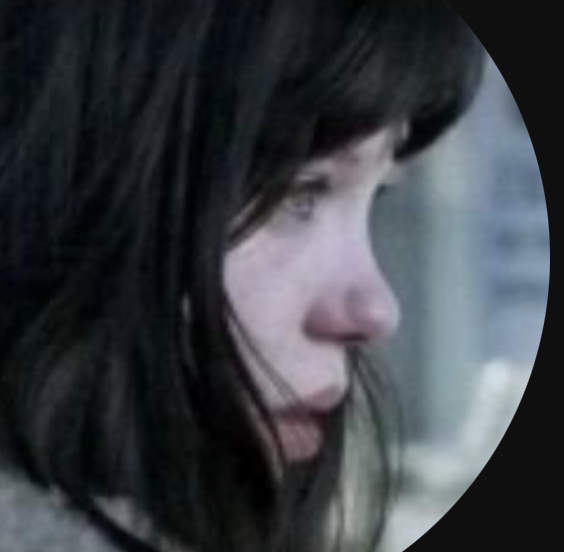 |
|  The profile message on this pic mentioned three blows to the head. |
|  |
|  
The obvious inference of the above two pics is clear and extremely disturbing. |
| 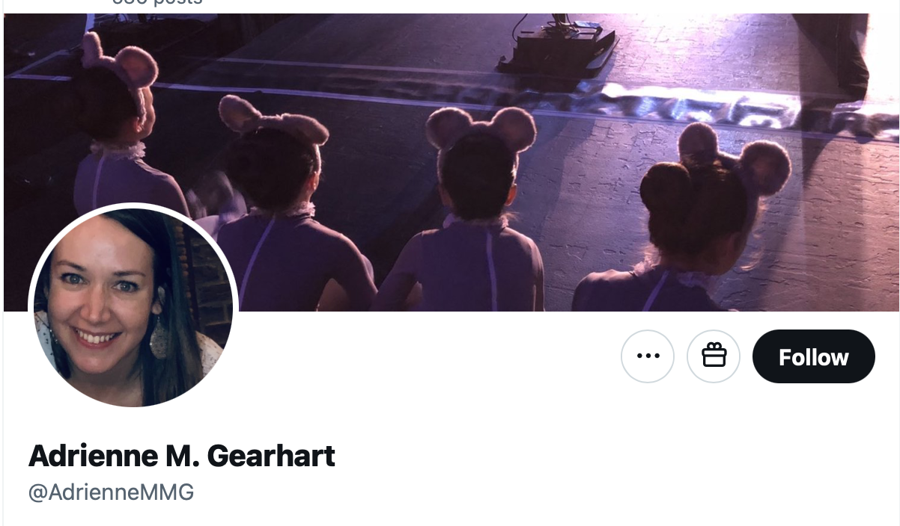 
Referencing bunny girls maybe. Surely this is a photo shoot but the girls look extremely young. |
| 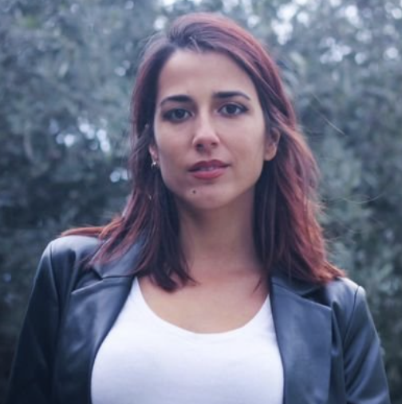 |
|  |
|  |
|   |
|   |
|   |
|   |
|  
This woman does not know she is being photographed. |
|   |
|   |
| 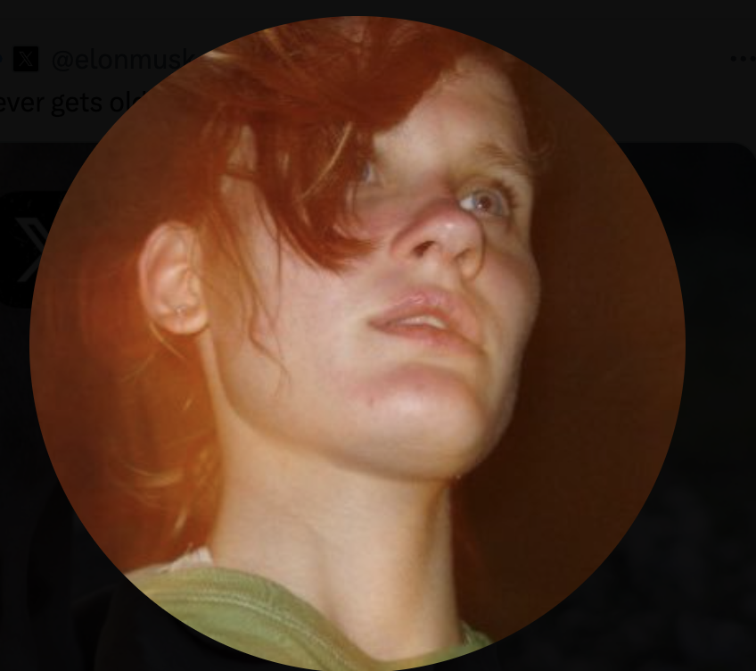  |
|   |
| 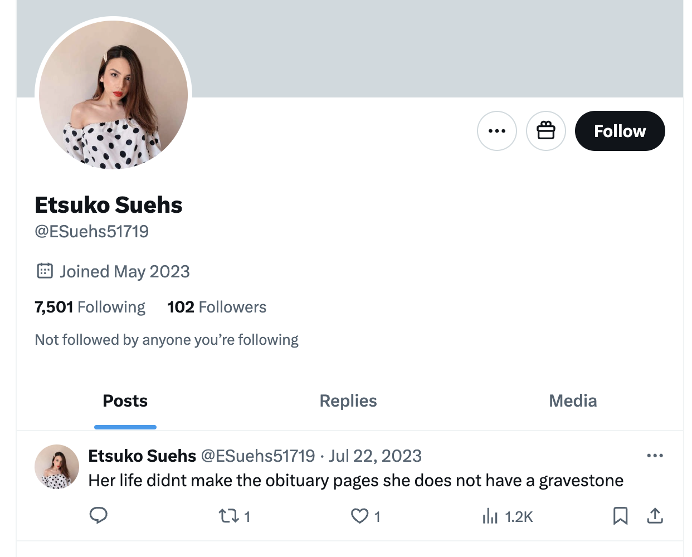 
The two pics above are the same woman I often see dressed as a sexy nurse on a bed about to engage in sexual activity. It's never clear if she's aware of being filmed. I wonder if she is the nurse that lived at my apartment for a couple of weeks. Note the vile profile message that suggests she is dead in an umarked grave.  |
| 
This pic looks exactly like a student of the conservatory studying under Domingo the piano teacher: [Elsa](../2023/october.md#gang-stalking-by-conservatory-civil-servants) who I have mentioned before. |

## Gabriel Silva's first team meeting as manager

- It's late August and everyone is back from holiday.
- Gabriel has [taken over my role as manager of the doc team at Polygon](july.md#gabriel-silva-is-given-my-role-at-polygon).
- The whole team is there; Anthony, Hans, myself, and Gabriel.
- Gabriel announces, smiling, that he is going to a bit of a *switcheroo*.
- He giggles.
- He then distributes all my work to Hans and Anthony, leaving me with none.
- It's obvious to me what's going on, apart from the *switcheroo* reference at this stage.
- I start thinking about what I'm going to do.
- It's hard to get clear about what to do about anything else while I'm receiving picture-after-picture of targeted women, and trying to get the handwritten letters out to as many people as I can.
- After understanding Gabe's reference to *switcheroo* in [September 2025](../2025/september.md#thunderbolt-clarity), I wonder if he is aware that for something so vile to work, the target has to be blinded, slowly over time so that she doesn't notice her vision becoming so blurry that she can't make people out properly.
