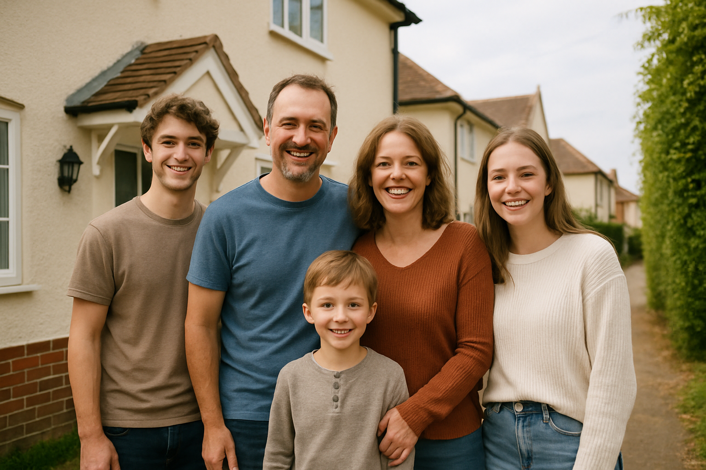
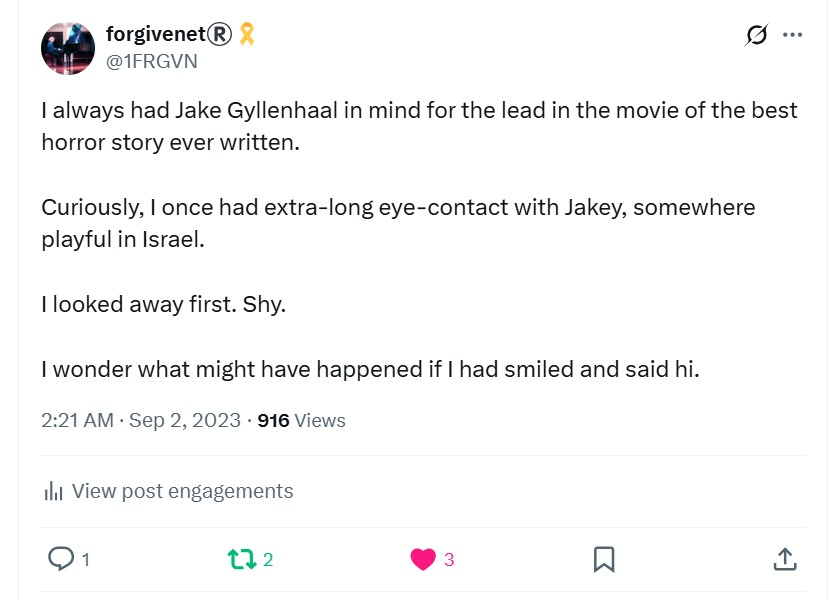

# December 2024

## Unable to access my laptop

- Sunday 1st December, my laptop is inaccessible. The password does not work at all.
- I change the password regularly and it worked a few days ago.
- I believe hackers have infiltrated my machine and forced me to have to reformat it again.
- I was unable to recover access myself and had to get help from a [local technician here in Bangkok](../../content/images/reformat-machine.JPG) where I'm staying.
- I lose a bunch of *extremely* interesting screenshots taken over the month of November - since I last reformated the machine - in the process. These include:
    - More pictures of targeted women.
    - Pictures of possums.
    - A picture of a woman I saw on the beach but about 20 years younger.
    - A very threatening picture of a man (rather like the [picture of the gypsy I saw in France](august.md#followed-by-the-gypsy-in-france)).
    - Direct references to Domingo and Carmen Cano, poison and murder.
    - I see a picture of a man I know very well. He is with his family, but they're people I’ve never met before; a wife, grown up kids. For nearly 20 years, this man has been pretending to be the boyfriend (partner she said for a time) of a *once* very wealthy woman I know, a family member. I often remember him being at her home, whenever we had planned I would go over, but I never saw any of his stuff. It was always like he was visiting. Their baby was taken off them immediately. I'm glad about that. Did someone already know what was going on and that people's children were in peril? He may have taken half-a-million from her, more even, over this time; and was likely involved in drugging and psychologically terrorizing her in EXACTLY the same way I have experienced. Unfortunately, the woman I know was not able to stand up to them; the same gang.

        

- Fortunately, I already posted some of them, such as the [threat to my brother's life](november.md#a-threat-to-my-brothers-life) as the hackers were getting extremely bold over November. I'll try to find some of the accounts I interacted with.
- When I look at Twitter on my mobile after my machine being inaccessible, the first two likes are honey trap or fakes accounts that seem to be taking the piss out of the fact I cannot access my machine.
- Taru Ann, the Finnish honey trap account, likes an old post of mine.

- Then two people like a post that is very suggestive of the situation. Zee and Luke would be references to old friends Zoe and Luke  from Dénia.

- We also, curiously, see some activity on the Cloudflare infrastructure that runs this site that shows that people in Finland are requesting pages.

## Patricia communicates again

- Patricia continues to make contact as if I'm an idiot.
- She sends an email around to everyone with significant dates on it.
- 7th October, a date in the 70s related to an Irish terrorist attack, and a date related to puppy love.
- I'll extrapolate later but I believe she is trying to remind me of the [puppy love and romance](../2023/april.md#overwhelming-romantic-feelings) from before, and keep me hooked in.

## So wants me to do an X Space

- So, Janet, my election volunteer presses me to run a Space describing X hacking.
- I wonder who asked her to do that.

## Threats

- I continue to get online threats from fake accounts.

## Jyotirlinga

- I visit India for a few days temple tour.
- Outside Shri Mahakaleshwar jyotirlinga temple, I meet a psychic.
- He reads my hand.
- He tells me what he sees.
- It's quite astonishing how accurate he is.
- He tells me about my love, but there are people in the way.
- He mentions how they are *wasting my time*, over and over. I don't really understand this reference.
- He talks about a small blond woman and a Muslim man waiting for me to die.
- He is very accurate with regards to Carmen Cano.
- I have no idea who the Muslim man could be, whether he got something wrong, or if there is more to this story I'm unaware of.

## Sunday 8th December 2024

- There is no doubt in my mind that what I have experienced at the hands of teachers and staff at the conservatory of Dénia, their friends and family, could give a person a nervous breakdown or drive them to suicide.
- Perhaps the intention was murder all along. It certainly seems so from my point of view.
- I suggest investigators check all local suicide stats and untimely deaths of anyone, particular young people, who have a history of complaining about being terrorized or harassed in any way.
- I would also double check any women that may have been accused of being "hysterical" or similar when making gang stalking claims against public institutions such as schools or colleges, particularly public musical clubs and activities in Spain.
- I suggest that gang stalkers are prosecuted for attempted murder.
- I suggest that anyone found involved in poisoning or drugging is prosecuted for attempted murder.
- I suggest that anyone found involved in sexual grooming is prosecuted for sexual abuse and/or rape.
- I suggest that anyone found involved in the management or distribution of mass online voyeurism channels and/or non-consensual information about a private person is prosecuted most forcefully.
- I suggest that, where possible, the bodies of any suspicious deaths in the region are exhumed and analyzed for poisons and narcotics.
- I suggest that, all previous residents in my flat or any flat managed by anyone related to these matters, is checked up on, and questioned.
- And a first point of call should be Lorraine Blackbourn's family, and anyone that knew her, and to have a look at any police complaints she may have made prior to her untimely death by suicide.
- Furthermore, if I was an investigator, I'd make sure to check every single student that Domingo the piano teacher has taught over the years to see how many of them ended up in porn or prostitution and/or were exploited financially in some way.

## Pedro sends a Christmas greeting

- Pedro the caretaker from Carrer Furs sends a Christmas greeting.
- I [message](../../content/whatsapps/WhatsApp%20Chat%20with%20PEDRO.zip) him asking him if he knows anything or if any other women in the building are being targeted.
- He does not reply.

## Sketching the novel

- I sketch some novel themes given there hasn't been a sudden rush to arrest any criminals or safeguard any children, an ongoing disappointment.
- I am visualizing and continually manifesting a three-season Netflix documentary special, but I am also seeing a true fiction series with Margot Robbie as me and Jake Gyllenhaal as Domingo (I always had him playing the role).

- Here's my notes from around this time:

??? info "Novel and documentary theme sketch"
    Novel documentary themes 
    Summary 
    - Traditional gang stalking of Women in Spain, and how everyone knew, and from when 
    - Modern gang stalking, mass voyeurism, close links with porn and sexual violence 
    - Hacking and access to everyone’s networks 
    - Cyber stalking and mobbing by the conservatory, fantastical choreographed events by teachers and staff, when it didn’t work it spread into the town, and townsfolk 
    - Poisoning and drugging, where and when 
    Back story 
    - Who was involved and to what extent 
    - Expat community 
    - Neighbors in the building 
    - The caretaker in the building 
    - Teachers and staff at the conservatory 
    - Kids at the conservatory 
    - National misogynist networks (Madrid) 
    - Townsfolk all 
    - Reporting, GV, police, perito, multiple handwritten letters in desperation to everyone  
    - Honey trapping 
    Back story 
    - Pedophilia, sexualization of children 
    Back story 
    - Damage to me personally: loss of jobs, constant stress and anxiety, racing mind, feeling intense sexual arousal, fear for my life, constant fear in Denia, actual kidney damage from poisoning 
    - Tecnofix Alicante Padre Marina 
    - Finish girl and boyfriend in the car with me January 24 breathing in whatever 

## Fake accounts and targets

- Every day I see fake accounts with another couple of women on a regular basis, one of whom appears to be extremely anorexic in one example but not others.
- These will be the last pics I post unless something extraordinarily egregious comes up.

| Fake accounts and targets |
|-|
|  |
|   |
|   |
|   
This pic is one of a series of a woman photographed without her consent. |
| 

This woman in this pic could be related to the [innocent lady groomed into porn](august.md#photos-of-abused-women-and-girls). They look very alike and I have seen her in countless pics. |

## Ongoing torment and terrorizing

- The stalking and harassment on Twitter has not ceased.
- There have been constant threats from Hazel and Sandra Smith. It has been relentless actually. One saying "stay away bitch", I didn't manage to screenshot it but it will be available on the likes from this tweet: https://x.com/1FRGVN/status/1867853572647596391 as will many others, including a bunch of messages in profiles about Toby going missing (Patricia's son); such as *Where's Toby?".
- I send a message to [mailto:016-online@igualdad.gob.es](https://violenciagenero.igualdad.gob.es/en/informacionUtil/recursos/telefono016/home.htm) asking for help about what I'm going to do when I come back to Spain and explaining how much danger I'm in.
- I get no help or advice from them in reply, just a message to say I can contact them for advice. They give me no advice. I read the reply email and get an immediate communication.

- I receive messages and interactions from fake accounts with threats every day.

- One of the fake accounts from [suspected targets I posted earlier](august.md#suspected-targets) likes one of my posts again. I challenge them: https://x.com/1FRGVN/status/1872110003626414167. 

- I ask if the "pussy" they're referring to is mine from when I was a minor: https://x.com/1FRGVN/status/1872129900842545220.
- There is no reply.
- Another dodgy account makes reference to gang rape by black men.

- On December 30th, I receive interactions from fake accounts related to Winston May.
- The first like is from a name "Winston" on a tweet of mine about women's safety. So I look.

- The first post on this fake account has his birthday, 5th December.

- The tweet this account likes is from 5th December also.

- I continue to be completely alone against thousands.
- It seems many many people would like me silenced.
    - Criminal porn gangs from London.
    - Criminal porn gangs from Dénia.
    - Any supporting the above including the Generalitat de Valencia.
    - Ineffective police in UK and Spain.
    - Misogynists generally.
    - women's groups who have been told things to discredit me that they believe.

### New Year's Eve

- I decided to try to use the Linux laptop again which the [technician](../2024/april.md#dpr-cyber-expert-alicante) reset to factory settings.
- I move my Google account over and change the password without connection to the MacOS.
- They're in immediately by knowing a password they shouldn't know from the MacOS which is not online.
- An account pops up on twitter which is a piss take.

- I already knew it but they have **total** access to my devices.
- I am feeling overwhelmed with what has happened to me over the last 3 years, what I've lost, and the constant abuse I have been suffering including poisoning and drugging constantly. I tweet about it: https://x.com/1FRGVN/status/1874100344021803398.
- Immediately a fake account called Sandra pops up.

### Google search on `jctot19 x`

- The usual pics coming up. One that I have noticed over the last months but it didn't register until today was a very scared looking man who looks exactly like Alfonso the Harmony teacher in year 4.
- He was very alarmed when I told everyone I had to leave because my life had been threatened.
- The hackers on Twitter referred to him as "Brat". I assume that would be Domingo as he would know him best.

### Lucyfer Adams

- An account flies by a lot over December 2024 while I'm in Thailand.
- The account name is "Lucyfer Adams"
- I note it.

## Detoxing in Samui, an unusual poo

- It is day 5 or 6 of the fast and cleanse.
- I go, as usual, to pick up my last detox drink at 7 o'clock.
- As I'm downing the wallpaper paste, I feel a strange rumbling in my belly, and a cramp beginning.
- I need the toilet!
- This is peculiar because I haven't eaten anything for 6 days and I have been doing colonics daily.
- Well.
- I am on the toilet for about 2 hours.
- There are at least three separate sittings as I think I've finished, get off, and then have to rush back quickly.
- It's as if the whole nasty Denia business, every second of it, is being released into the toilet bowl.
- I feel like I've been holding onto some serious poison for a long time, and here it is disappearing, down the toilet.
- On the last go, as I said about two hours after I started, I pretty much felt that was it, I could get going to my massage after I flush the toilet and wash my hands.
- I looked into the toilet bowl.
- The poo had formed into an X.
- Yes, an X.
- An not just any X, the Twitter X itself.
- It was a wow moment for me, I must say.
- I wondered what it could mean? It was very specific, very clear.
- Was it an instruction?
- Is X going down the toilet?
- I thought a lot about that poo, and never came up with anything particularly solid (no pun intended).
- I may have tweeted about Mary owning X due to it.
- Sorry about that.

## My Belgian friend

- I'm posting snippets from this police statement every day online.
- The information I have is horrific.
- I'm basically asking for help by writing this police statement.
- Except, no-one seems to care.
- So I keep writing.
- All I have is my words and there's no other option but to use them.
- One of my friends, who [I had visited back in July while I was at EthCC](july.md#meeting-my-belgian-friend) and told him what was going on for me, as far as I knew it at that time, tells me he's coming to help me move back to London from Denia.
- I'm so relieved. 
- Finally, a friend will help me.
- He's very *very* concerned.
- I then don't hear from him at all, for days.
- It's a bit like he's ghosted me.
- Did someone reach out and tell him to back off?
- Instead, I ask Paul if he will help me. 

## Man bares his teeth at me

- In the restaurant at the Spa Resorts.
- British man with long greasy hair, a Spanish wife and child, and very big teeth which he bares at me.
- Man looks like someone who had tried to rob H Samuel while I was on the till in Brent Cross in ... you guessed it ... 1989.
