## Unable to access my laptop

- Sunday 1st December, my laptop is inaccessible. The password does not work at all.
- I change the password regularly and it worked a few days ago.
- I believe hackers have infiltrated my machine and forced me to have to reformat it again.
- I was unable to recover access myself and had to get help from a [local technician here in Bangkok](../../content/images/reformat-machine.JPG) where I'm staying.
- I lose a bunch of *extremely* interesting screenshots taken over the month of November - since I last reformated the machine - in the process. These include:
    - More pictures of targeted women.
    - Pictures of possums.
    - A picture of a woman I saw on the beach but about 20 years younger.
    - A very threatening picture of a man (rather like the [picture of the gypsy I saw in France](august.md#followed-by-the-gypsy-in-france)).
    - Direct references to Dominic and Carmen Cano, poison and murder.
- Fortunately, I already posted some of them, such as the [threat to my brother's life](november.md#a-threat-to-my-brothers-life) as the hackers were getting extremely bold over November. I'll try to find some of the accounts I interacted with.
- When I look at Twitter on my mobile after my machine being inaccessible, the first two likes are honey trap or fakes accounts that seem to be taking the piss out of the fact I cannot access my machine.
- Taru Ann, the Finnish honey trap account, likes an old post of mine.

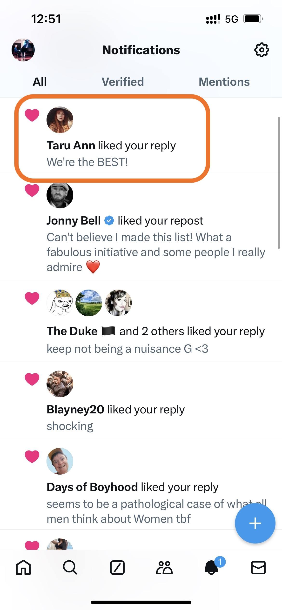

- Then two people like a post that is very suggestive of the situation. Zee and Luke would be references to old friends Zoe and Luke  from Denia.

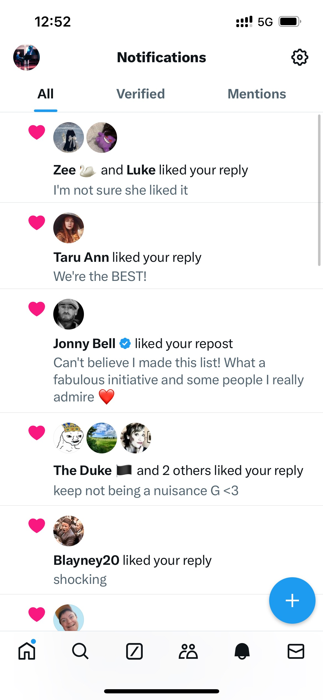

- We also, curiously, see some activity on the Cloudflare infrastructure that runs this site that shows that people in Finland are requesting pages.

## Threats

- I continue to get online threats from fake accounts.

## Sunday 8th December 2024

- There is no doubt in my mind that what I have experienced at the hands of teachers and staff at the conservatory of Denia, their friends and family, could give a person a nervous breakdown or drive them to suicide.
- Perhaps the intention was murder all along. It certainly seems so from my point of view.
- I suggest investigators check all local suicide stats and untimely deaths of anyone, particular young people, who have a history of complaining about being terrorized or harassed in any way.
- I would also double check any women that may have been accused of being "hysterical" or similar when making gang stalking claims against public institutions such as schools or colleges, particularly public musical clubs and activities in Spain.
- I suggest that gang stalkers are prosecuted for attempted murder.
- I suggest that anyone found involved in poisoning or drugging is prosecuted for attempted murder.
- I suggest that anyone found involved in sexual grooming is prosecuted for sexual abuse and/or rape.
- I suggest that anyone found involved in the management or distribution of mass online voyeurism channels and/or non-consensual information about a private person is prosecuted most forcefully.
- I suggest that, where possible, the bodies of any suspicious deaths in the region are exhumed and analyzed for poisons and narcotics.
- I suggest that, all previous residents in my flat or any flat managed by anyone related to these matters, is checked up on, and questioned.
- And a first point of call should be Elaine Black's family, and anyone that knew her, and to have a look at any police complaints she may have made prior to her untimely death by suicide.
- Furthermore, if I was an investigator, I'd make sure to check every single student that Dominic the piano teacher has taught over the years to see how many of them ended up in porn or prostitution and/or were exploited financially in some way.

## Fake accounts and targets

- Every day I see fake accounts with another couple of women on a regular basis, one of whom appears to be extremely anorexic in one example but not others.
- These will be the last pics I post unless something extraordinarily egregious comes up.

| Fake accounts and targets |
|-|
|  |
|   |
|   |
|   
This pic is one of a series of a woman photographed without her consent. |
|   
This woman in this pic could be related to the [innocent lady groomed into porn](august.md#photos-of-abused-women-and-girls). They look very alike and I have seen her in countless pics. |

## Ongoing torment and terrorizing

- The stalking and harassment on Twitter has not ceased.
- There have been constant threats from Hazel and Sandra Smith. It has been relentless actually. One saying "stay away bitch", I didn't manage to screenshot it but it will be available on the likes from this tweet: https://x.com/1FRGVN/status/1867853572647596391 as will many others, including a bunch of messages about Toby going missing (Patricia's son).
- I send a message to [016-online@igualdad.gob.es](https://violenciagenero.igualdad.gob.es/en/informacionUtil/recursos/telefono016/home.htm) asking for help about what I'm going to do when I come back to Spain and explaining how much danger I'm in.
- I get no help or advice from them in reply, just a message to say I can contact them for advice. They give me no advice. I read the reply email and get an immediate communication.

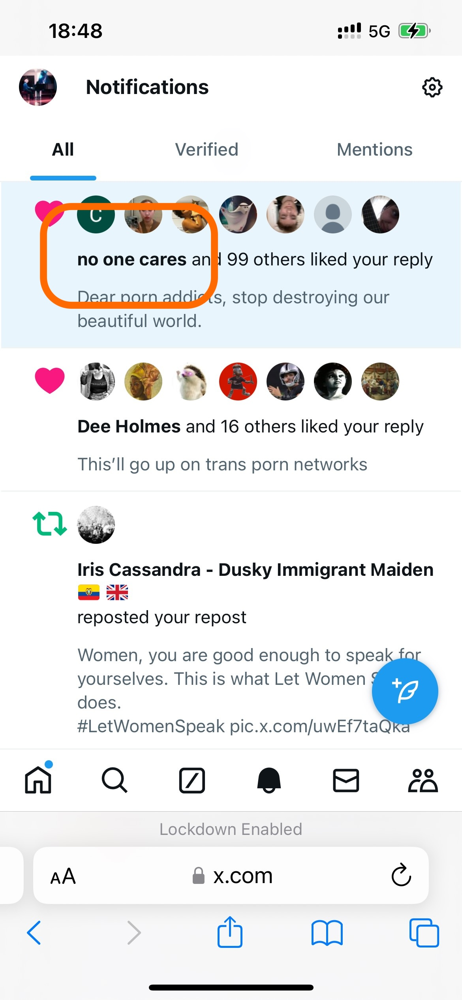

- I receive messages and interactions from fake accounts with threats every day.

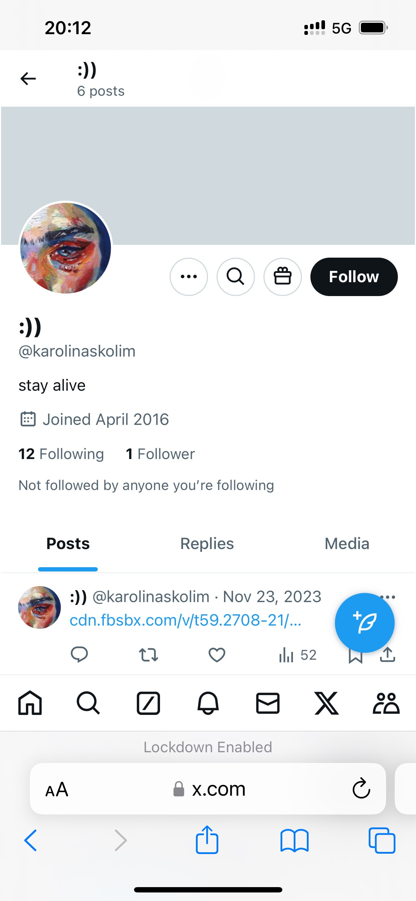

- One of the fake accounts from [suspected targets I posted earlier](august.md#suspected-targets) likes one of my posts again. I challenge them: https://x.com/1FRGVN/status/1872110003626414167. 

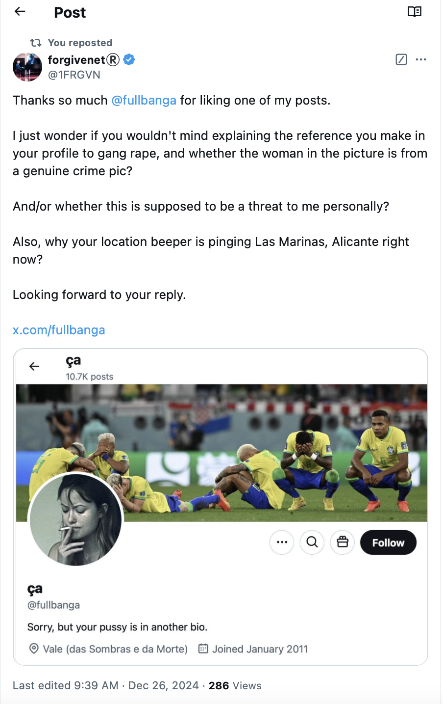

- I ask if the "pussy" they're referring to is mine from when I was a minor: https://x.com/1FRGVN/status/1872129900842545220.
- There is no reply.
- Another dodgy account makes reference to gang rape by black men.

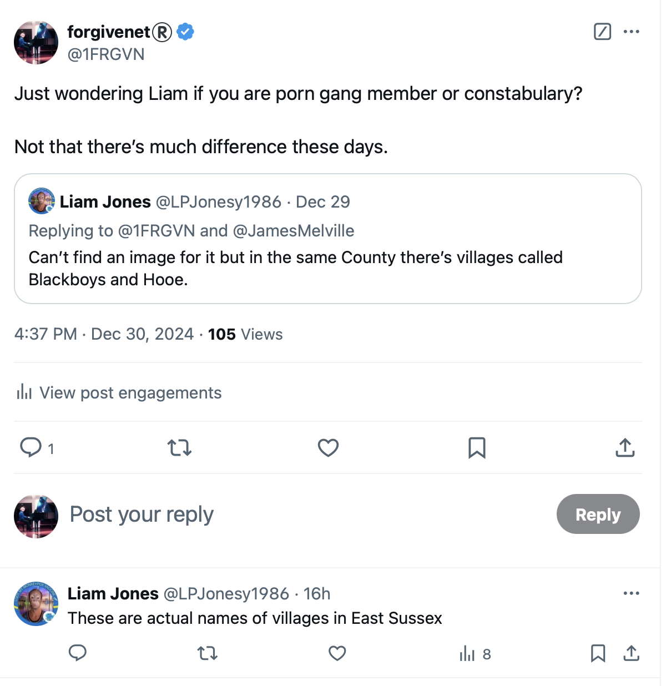

- On December 30th, I receive interactions from fake accounts related to Winston May.
- The first like is from a name "Winston" on a tweet of mine about Women's safety. So I look.

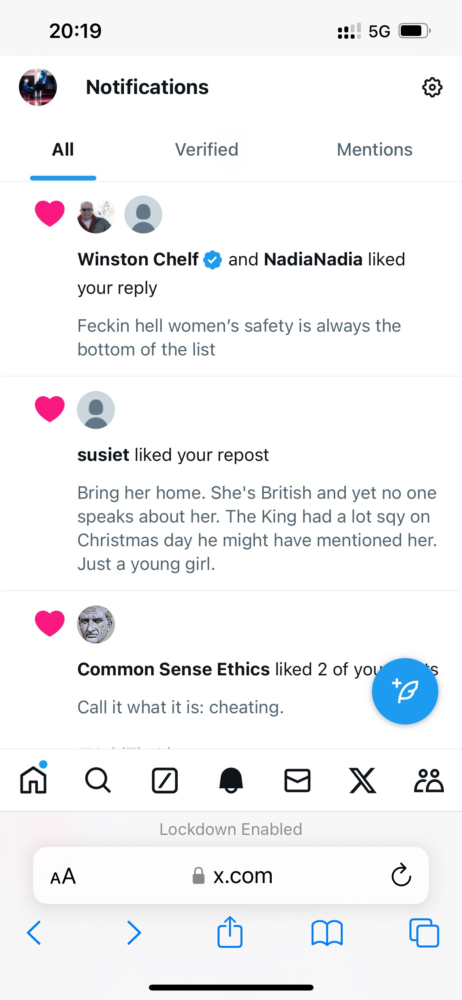

- The first post on this fake account has his birthday, 5th December.

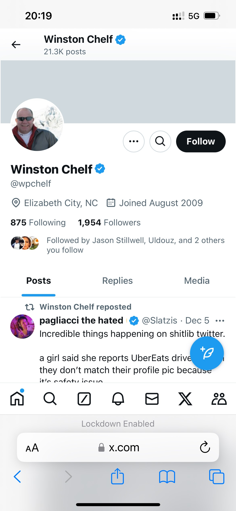

- The tweet this account likes is from 5th December also.

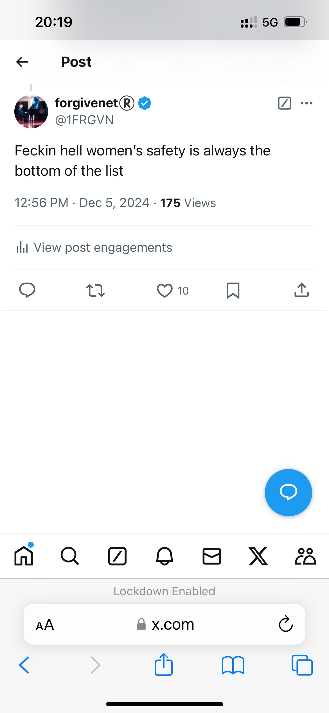

- I continue to be completely alone against thousands.
- It seems many many people would like me silenced.
    - Criminal porn gangs from London.
    - Criminal porn gangs from Denia.
    - Any supporting the above including the Generalitat de Valencia.
    - Ineffective police in UK and Spain.
    - Misogynists generally.
    - Women's groups who have been told things to discredit me that they believe.

## New Year's Eve

- I decided to try to use the Linux laptop again which the [technician](../2024/april.md#hacking-expert) reset to factory settings.
- I move my Google account over and change the password without connection to the MacOS.
- They're in immediately by knowing a password they shouldn't know from the MacOS which is not online.
- An account pops up on twitter which is a piss take.

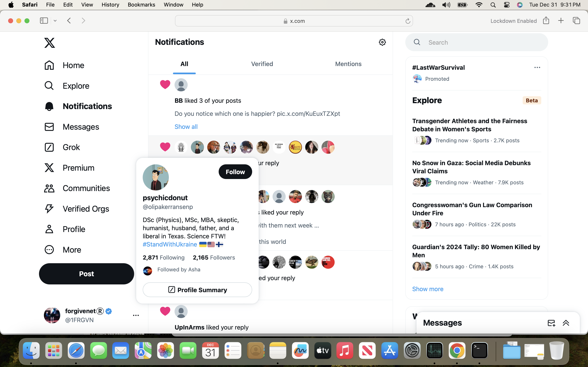

- I already knew it but they have **total** access to my devices.
- I am feeling overwhelmed with what has happened to me over the last 3 years, what I've lost, and the constant abuse I have been suffering including poisoning and drugging constantly. I tweet about it: https://x.com/1FRGVN/status/1874100344021803398.
- Immediately a fake account called Sandra pops up.

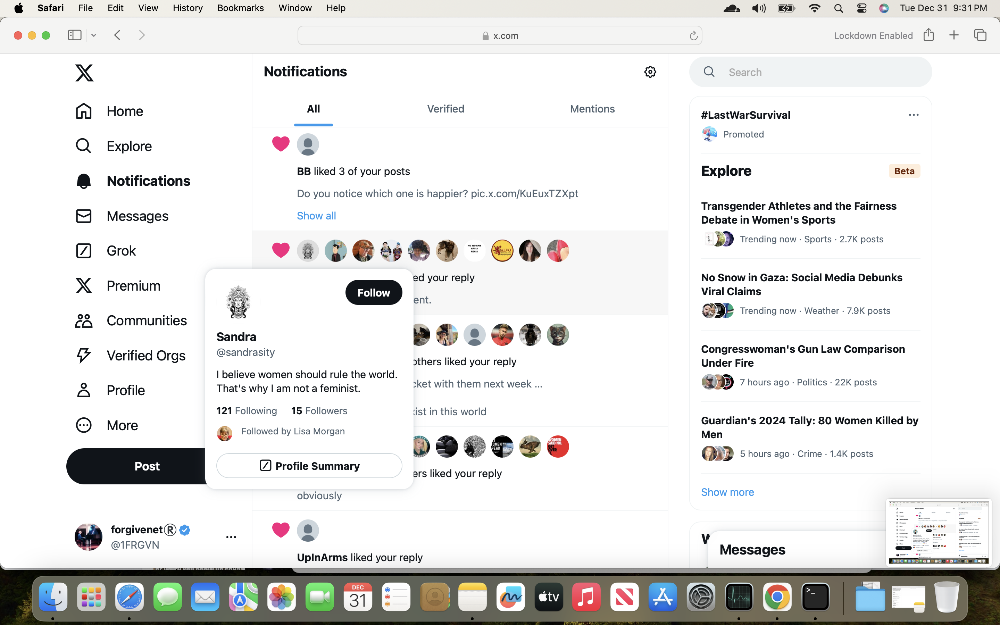

### Google search on `jctot19 x`

- The usual pics coming up. One that I have noticed over the last months but it didn't register until today was a very scared looking man who looks exactly like Alfonso the Harmony teacher in year 4.
- He was very alarmed when I told everyone I had to leave because my life had been threatened.
- The hackers on Twitter referred to him as "Brat". I assume that would be Dominic as he would know him best.

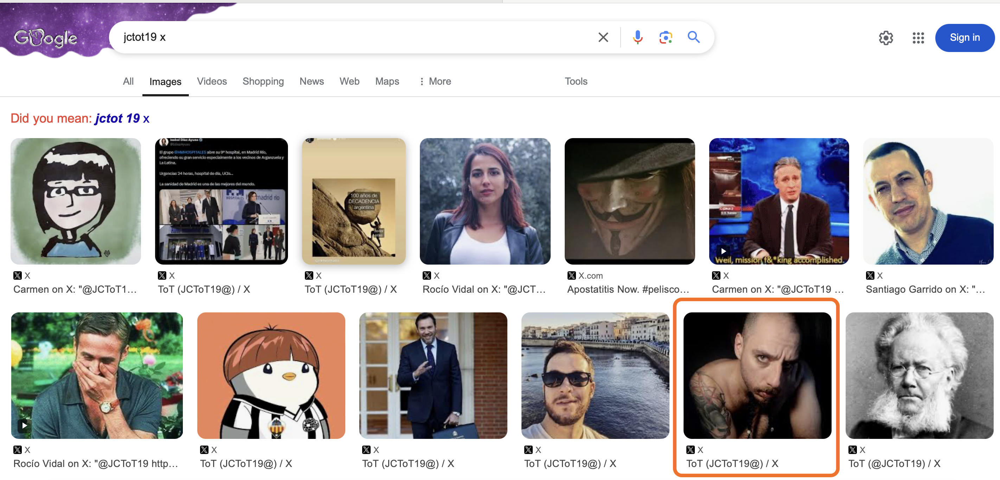
