# December 2024

## Unable to access my laptop

- Sunday 1st December, in Bangkok, my laptop is inaccessible, just a few days after [Paloma informed me via Inma](october.md#meeting-inma-and-paloma-the-spanish-official-in-madrid) that my website would be shutdown.
- The password does not work and I cannot get into the machine.
- Hackers have infiltrated my machine and changed the password.
- I'm forced to reformat my machine, again.
- They're trying to stop me writing.
- I take the machine to a [local technician in Bangkok](../../content/images/reformat-machine.JPG) at Terminal 21.
- When I look at X on my mobile instead, the first two likes are fake account messages taking the piss out of the fact I cannot access my machine.
- [Taru Ann](march/13-end.md#taru-ann), the Finnish honey trap account (Hazel), likes an old post of mine.

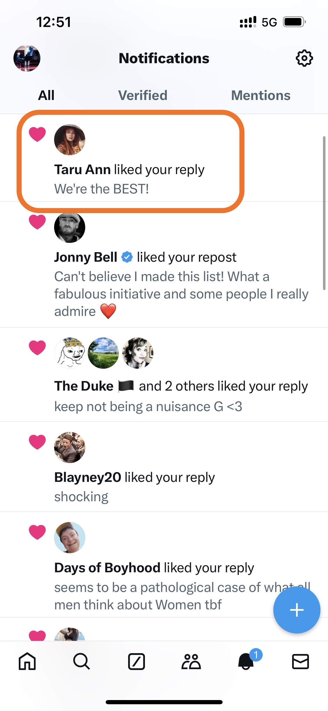

- Then two people like a post that is very suggestive of the situation.
- Zee and Luke are references to [Zoe BJ](../2001-to-2010/2008.md#zoe-bj) and [Luke BJ](../2001-to-2010/2008.md#meeting-luke-braganza-jones) from Dénia.

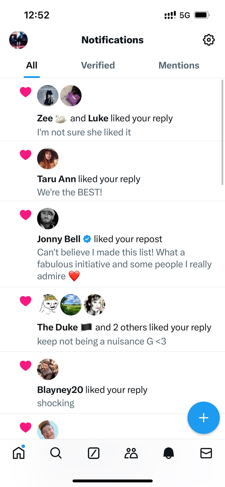

### Losing significant online communications sent by the porn-gangs

- Due to the hack, I lose a bunch of *extremely* interesting screenshots taken over the month of November that I was collecting for publishing.
- These include:
    - More pictures of targeted women.
    - Pictures of possums.
    - A picture of a woman I saw on the Las Marinas beach in October, but she's about twenty years younger.
    - A very threatening picture of a man that reminds me of [Ugly](august.md#ugly) but isn't him.
    - Direct references to Domingo and Carmen Lopez Cano, poison and murder.
    - **BUT MOST IMPORTANTLY**: I lose a screenshot of a man I know very well; my cousin's *partner/boyfriend* Chris. He seems to be in a family photo, but I thought his family was my cousin and their sons and these are people I’ve never met before. The photo is of him and what looks like his wife and grown up kids outside their house in the front garden. For over twenty years, this man has been my cousin's official boyfriend (partner she said for a time). My cousin received a huge Lockerbie compensation payout, far bigger than mine. I often remember him being at her home whenever we had planned I would go over, but I never saw any of his personal stuff in the house. It was always like he was just visiting. Their baby was taken off them immediately. I'm glad about that. Did someone already know what was going on and that children were in peril? Her first son, born in 1999, was abused by dangerous people coming into her home. It seems highly likely the same North London porn-gang targeted other Lockerbie family members. The *boyfriend* may have taken half-a-million from her, more even, over the last twenty-odd years and could even have been involved in drugging and psychologically terrorizing her in EXACTLY the same way I have experienced in Spain. Her brain is scrambled. Interestingly, my cousin started to stalk me on X around the same time the gangs were panicking about me returning to my piano studies - November 2023 onwards - and she contacted me incessantly during the time I was perma-spiked-high in London. I expect she was following instructions. 

        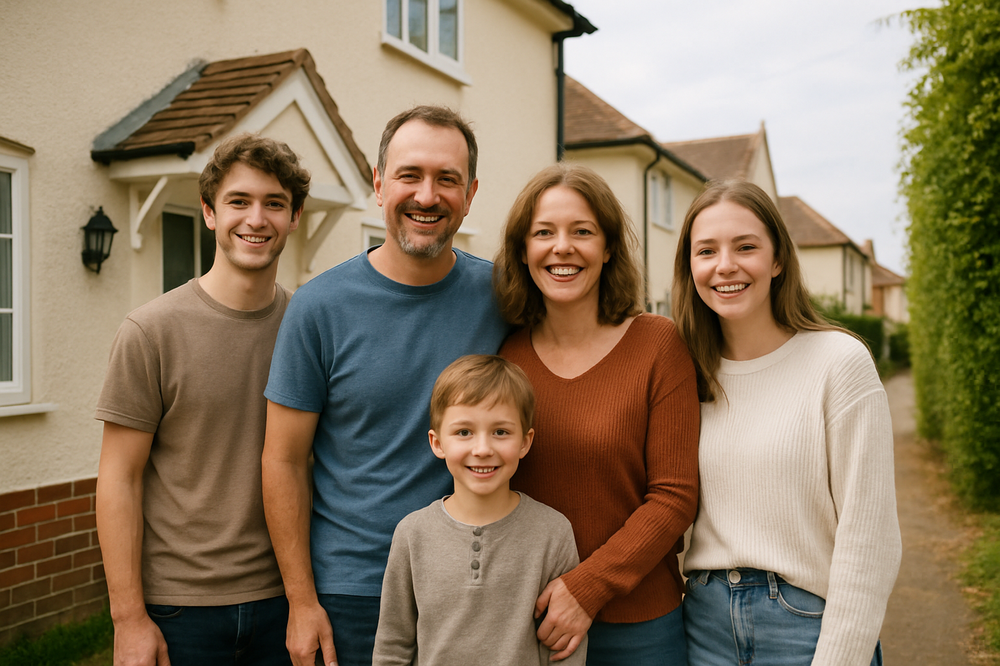

- Was this why they shut me down?
- Fortunately, I already posted some of the more obvious stalker-pics, such as the [threat to my brother's life](november.md#a-threat-to-my-brothers-life). 

## Trish Penny communicates terror again

- Trish continues to contact me in ways that make me certain she knows what's been happening to me and that she must think I'm an idiot.
- On the run up to the *conservatory-terror*, Trish had very obviously been instructed to say and do things on behalf of the criminal gangs that were intended to upset me and cause me anxiety.
- One good example of this was her painting of a portrait of me dressed as a clown with my double chin over-pronounced, and this was emailed to me one evening while I was at my kitchen table at the exact moment some frequency trigger was applied on my devices' hardware, while I had just come under the effects of a recent hallucinogenic dose (something in my dinner perhaps?). 
- I felt HORRENDOUS about her picture - more proof of how efficacious their emotional manipulation tech is - but it didn't make any logical sense to me at the time so I immediately filed it away as bogus.
- Actually, I responded quickly to her email the moment she sent it, asking her about the picture to which she replied with some vague explanation.
- The picture had been on display somewhere in the region and it wasn't the first "meaningful" painting she had informed me about on email.

- Trish sends an email around to all the expat walkers while I'm in Bangkok.
- It's a weird message with significant dates: 7th October from a year in the 60s or 70s, a date in the 70s related to an Irish terrorist attack, and a date related to puppy love.
- The email was about *What was number one on your birthday?*, and in this way she was able to bring in the three weird dates.
- At the time, the [puppy love trigger](../2023/april.md#overwhelming-romantic-feelings) keeps the trumpet teacher romance lie going.
- The other dates she mentions are perhaps even more curious.
- Everyone watching me online knows how upset I was about the Palestinian invasion of Israel on October 7th 2023, and the evil that occurred that day.
- The Irish terrorist connection is very weird and I don't understand it.
- In fact, I don't understand any of this email outside of Trish must be trying to mess with my mind again at the behest of her husband.
- When I return to the UK in January 2026 after having painstakingly saved thousands of emails, including everything Trish sent me I've just mentioned, and more, someone hacks into my Google accounts and deletes everything I've saved, and then renders my Google account completely unreachable.
- Is it messages like this from Trish they want to hide?
- In any event, the email gets me curious about what number one was on my birthday so I look it up.
- I was rather delighted to discover it was *Tie A Yellow Ribbon*.
- Even though Trish's behavior was very obviously malevolent towards me, I always felt worried about her.
- Things she said to me gave me cause for concern; for example, *my much-younger-Spanish-husband always brings me tea in the morning, every morning*.
- Did Trish find herself starring in horror-porn just like I did?
- Was it after she returned from her foundation art course in the UK - something she told me about on a loop - or just after her first, British husband died (or was murdered maybe)?
- Were these messages from Trish a way for the criminal porn-gangs of Dénia to communicate with the multiple law enforcement organizations I had sent [my handwritten letters to](august.md#the-handwritten-letters) so that they might make deals while they conclude their detailed investigations and before they nick everyone and stop the baby-rapists, pedophiles, incest-obsessed, and sedated-rape insane please God.

## So, Janet, asks me to run an X Space about hacking

- So, Janet, `@ladysolucky` on X - one of [my dubious UK general election volunteers](june.md#volunteers-not-what-they-seem) - presses me repeatedly to run an X Space describing hacking.
- I say I will and then find out I'm unable to get into X Spaces, inexplicably.
- After realizing she's somehow involved with the Spanish criminal gangs, [the "hunters"](october.md#we-take-what-we-want-they-say-were-hunters-they-say), I wonder who asked her to request that of me.
- No doubt someone with a direct hack into my machine via the X platform, and no doubt for porn-terror purposes.
- I have already told Janet that I'm officially unsafe in Spain.

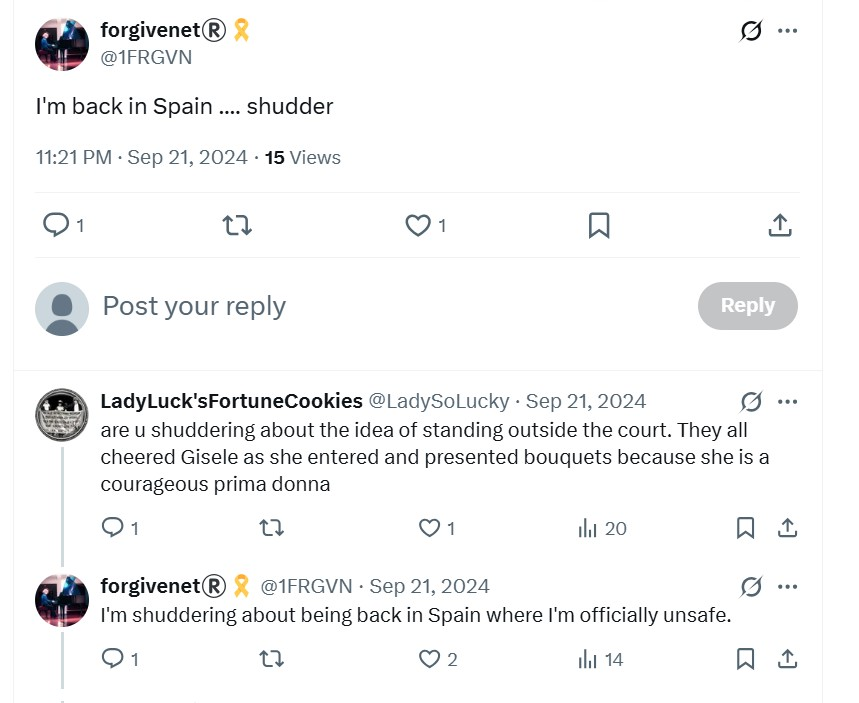

- On my return to the UK in January 2025, I find out I'm officially unsafe in the UK too.
- I spend the entire time I live in London in 2025 with nowhere else to go in a sort of liminal stateless state.
- I'm unable to access healthcare or even go outside without a horror-porn addict recognizing me, or a criminal gang member showing up to growl at me.
- After the [Metropolitan Police make it clear to me that they do not consider me a citizen with the same rights as everyone else](../2025/january.md#i-call-the-police), I realize that if anything bad were to happen to me in the UK, no-one would come to my assistance.
- You cannot imagine how stressful that realization was.
- In July 2025, I'll find out [I'm officially unsafe in France](../2025/july.md#lourdes) and pretty much everywhere and anywhere in the world.
- I have no option but to start a new life in a perma-liminal state; stateless essentially as anyone could do anything at all to me and no-one would assist.
- I'm unable to work as 1-in-3 Western men are horror-porn addicts, and the others have a mate who is one, and I'd be having to work with the people who masturbated over me living as a sedated sex-slave in my own home; men who expected me to be murdered, commit suicide, or just disappear and be forgotten I guess.
- I decide to devote my time to God and live on my substantial savings (the ultimate irony as these were intended to be inherited on my death by a porn-gang member through faux-marriage) until God says otherwise.
- He's always very clear about what to do; at least He is to me with the small things He insists upon while I don't understand anything else.
- I guess I'm really really famous aren't I.
- It's so gross.
- But mostly the women don't know yet, do they.
- I wonder how many women and children are in porn-hell right now because everyone's ashamed of themselves and hopes it'll all go away, poof!
- Or is the world officially evil now?
- Should normal, law-abiding, tax-paying citizens start expecting to be drugged and raped by (apparently) normal, law-abiding, tax-paying citizens?

## Jyotirlinga

- I visit India to visit two of the jyotirlinga temples.

### Mahakaleshwar temple

- In the queue outside Shri Mahakaleshwar jyotirlinga temple in Ujjain, I meet a psychic.
- He reads my hand.
- He tells me what he sees.
- It's astonishing how accurate he is.
- He tells me about my love, but he says there are people in the way.
- He mentions how these people are *wasting my time*, over and over.
- I don't understand this.
- He talks about a small blond woman and a Muslim man waiting for me to die.
- He is very accurate with regards to Carmen Lopez Cano.
- I have no idea who the Muslim man could be; whether the psychic got something wrong, or if there is more to this story.
- The psychic tells me the form of God he worships which protect and guide him are the brother-snakes belonging to Shiva and Vishnu.
- I will revisit the Mahakaleshwar jyotirlinga as part of the 51 Shakti temples pilgrimage I am planning as there is a major Shakti peeth alongside the jyotirlinga where Sita's upper lip is said to have fallen.

### Omkareshwar temple

- The next day, I visit Omkareshwar jyotirlinga temple.

- While waiting on the bridge over the river, I get a strong feeling, a message even.
- I understand that, at that moment, I could give all of the hell I have been enduring away, just drop it.
- I thought about this, a lot, right there.
- I quickly came to the conclusion that if I dropped it all, it would just mean delay.
- Oh, nearly forgot, dropping it required leaving [the jet stone pieces I had found on the beach in Lindisfarne](../2022/july.md#lindisfarne-jet) at Omkareshwar.
- Sometimes, you see, I would bring them with me to Mahadev for a blessing.
- The message felt like a one off opportunity; a too-good-to-be-true from a used-car salesman.
- And I'd have to get back around to my *gargantuan* karma at some point in the future anyway, and no-one else was going to stand up for the innocent and vulnerable involved, so I ignored the message and carried on calmly.

## Sunday 8th December 2024

!!! tip "These are my original thoughts"
    - This section is what I was thinking about it all back on the 8th December 2024.
    - The wider picture was unclear to me at that time, but I knew enough to know that something very evil had taken over the town of Dénia.
    - With just a few corrections, this is exactly what I drafted on that day, and all of it still stands.

- There is no doubt in my mind that what I have experienced at the hands of teachers and staff at the conservatory of Dénia, their friends and family, could give a person a nervous breakdown or drive them to suicide.
- Perhaps the intention was murder all along. It certainly seems so from my point of view.
- I suggest investigators check all local suicide stats and untimely deaths of anyone, particularly young people, and anyone who has a history of complaining about being terrorized or harassed in any way.
- I would also double check any women that may have been accused of being "hysterical" or similar when making gang stalking claims against Spanish public institutions such as schools or colleges, and particularly public music and dance clubs and children’s activity centres.
- I suggest that gang stalkers are prosecuted for attempted murder.
- I suggest that anyone found involved in poisoning or drugging is prosecuted for attempted murder.
- I suggest that anyone found involved in sexual grooming is prosecuted for sexual abuse and/or rape.
- I suggest that anyone found involved in the management or distribution of mass online voyeurism channels and/or non-consensual information about a private person is prosecuted most forcefully.
- I suggest that, where possible, the bodies of any suspicious deaths in the region are exhumed and analyzed for poisons, pesticides, and narcotics.
- I suggest that, all previous residents in my flat or any flat managed by anyone related to these matters, is checked up on, and the owners questioned.
- And a first point of call should be Lorraine Blackbourn's family, and anyone that knew her, and to have a look at any police complaints she may have made prior to her untimely death by suicide.
- Furthermore, if I was an investigator, I'd make sure to check every single student that Domingo Cano Lopez the piano teacher has taught over the years to see how many of them ended up in porn or prostitution, had an early death, and/or were exploited financially in some way.

## Pedro sends a Christmas greeting

- Pedro, the previous caretaker from Carrer Furs, sends me [a Christmas video-greeting on WhatsApp](../../content/whatsapps/WhatsApp%20Chat%20with%20PEDRO.zip).

- (Am I paranoid to be concerned about the walnut image?)
- I take the opportunity to mention again to him that I'm offering substantial rewards for copies of any porn I'm in.

??? tip "Pedro's message"
    25/12/2024, 09:41 - Messages and calls are end-to-end encrypted. Only people in this chat can read, listen to, or share them. Learn more.
    25/12/2024, 09:41 - PEDRO is a contact
    24/12/2024, 20:14 - PEDRO: VID-20241227-WA0000.mp4 (file attached)
    25/12/2024, 11:37 - det sgt lydia cleaves: Hola Pedro
    19/02/2025, 17:50 - det sgt lydia cleaves: https://statement-bhw.pages.dev/
    19/02/2025, 17:52 - det sgt lydia cleaves: Recompensas aun en oferta
    19/02/2025, 17:53 - det sgt lydia cleaves: Para grabaciones de mi qué Todo el mundo ha visto
    19/02/2025, 17:59 - PEDRO: Hola Katerine soy Pedro el antiguo conserje de Villamar, espero que estés bien .
    20/02/2025, 15:47 - det sgt lydia cleaves: Si bien aun buscando los videos de yo ... pagando hasta 1000 euros para Una copia .. gracias
    20/02/2025, 15:48 - PEDRO: Como puedo ayudarte
    20/02/2025, 16:44 - det sgt lydia cleaves: Enviame algunas videos qué todo el mundo ha visto para justificar atacandome y te Pago sin problema
    20/02/2025, 16:44 - det sgt lydia cleaves: Busco dos tipos de video
    20/02/2025, 16:45 - det sgt lydia cleaves: Original cuando yo era pequenya y Tipo spycam de denia
    20/02/2025, 16:45 - det sgt lydia cleaves: Gracias
    21/02/2025, 18:11 - det sgt lydia cleaves: Email me at info@forgivenet.co.uk with anything
    21/02/2025, 18:13 - PEDRO: Que es esto Katerine
    21/02/2025, 18:17 - det sgt lydia cleaves: Un email para mi
    21/02/2025, 18:22 - PEDRO: Hoy estuve en Villamar visitando a una familia,acabo de llegar a casa
    02/03/2025, 06:39 - det sgt lydia cleaves: Is my flat the only one they put poison and drugs in the water ?? Or are there other flats too with women they are targeting??
    06/11/2025, 10:29 - det sgt lydia cleaves: https://fearandloathinginlasmarinas.com/

- He tells me he just got back from a visiting a family at the Carrer Furs apartment complex.
- I ask him if he knows about any other women being poisoned and drugged in the apartment complex.
- He does not reply.
- It's not clear to me if hackers are deleting or scrambling my messages so that a recipient doesn't receive them correctly.
- They were dropping poor Pedro in it, weren't they.

## Sketching the novel

- Disappointed that there hasn't been a sudden rush to arrest any criminals or safeguard any children and babies, I shift gears and start thinking about my police statement in novel form.
- Perhaps I'm just a little naive about what can be done about a trillion-tentacled, spidery, murderous horror-porn enterprise, and whether if law enforcement takes its time, we get every last one of them!
- I dunno though; I do get down from time to time and it's been a long haul (time of writing May 2026).
- In December 2024, I am visually manifesting a three-season Netflix documentary special, but I'm also seeing a true fiction series with Margot Robbie as me, and Jake Gyllenhaal as Domingo (I always had him playing the role).

[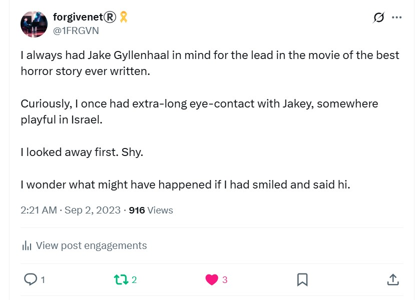](https://x.com/1FRGVN/status/1697691210301755536)

- I added this section in November 2025 while I was backing up my email accounts - backups that were stolen by hackers in the UK in January 2026 - and trying to organize the thousands of snippets of saved information I had at that time.
- The notes that inspired this section come from draft scribbles written the year before.
- Here's the MacBook note I wrote in or around December 2024:

??? info "Novel and documentary theme sketch"
    Novel documentary themes 
    Summary 
    - Traditional gang stalking of women in Spain, and how everyone knew, and from when 
    - Modern gang stalking, mass voyeurism, close links with porn and sexual violence 
    - Hacking and access to everyone’s networks 
    - Cyber stalking and mobbing by the conservatory, fantastical choreographed events by teachers and staff, when it didn’t work it spread into the town, and townsfolk 
    - Poisoning and drugging, where and when 
    Back story 
    - Who was involved and to what extent 
    - Expat community 
    - Neighbors in the building 
    - The caretaker in the building 
    - Teachers and staff at the conservatory 
    - Kids at the conservatory 
    - National misogynist networks (Madrid) 
    - Townsfolk all 
    - Reporting, GV, police, perito, multiple handwritten letters in desperation to everyone  
    - Honey trapping 
    Back story 
    - Pedophilia, sexualization of children 
    Back story 
    - Damage to me personally: loss of jobs, constant stress and anxiety, racing mind, feeling intense sexual arousal, fear for my life, constant fear in Dénia, actual kidney damage from poisoning 
    - Tecnofix Alicante Padre Marina 
    - Finnish girl and boyfriend in the car with me January 24 breathing in whatever 

## Fake accounts and targets

- Every day, I continue to see fake accounts with targeted or significant women on them.
- One woman I see over and over has the [same tattoo as the groomed-girl](august.md#grooming-an-innocent-girl-into-porn-101) and [the woman walking with possum-man](october.md#possum-man-on-the-beach) on the Las Marinas beach.
- She looks really young and in early-groom photos she looks slim, and then in obvious later-groom stages she seems extremely anorexic.
- She reminds me of a dreadfully sinister porn-account I saw in the early days of a severely emaciated girl who was always accompanied by a brutish father who she wrote about in sexual terms.
- Those images were grainy in the same way as the content on the [Taru Ann](march/13-end.md#taru-ann) account and others.
- I see photos of her leaving someone's bedroom at night dressed up as she is in the photos I'm posting here.
- The photographer appears to be taking her photo from a darkened bedroom and while, I assume, in bed.
- The house is modern, minimalistic, all white like some of the newer buildings in Las Rotas.
- These will be the last pics I post of women unless something extraordinarily egregious comes up.

| Fake accounts and targets |
|-|
|  |
|   |
|   |
| I'm not sure why I'm adding the lady above but she seems suspicious. Could it be Maria Hontanilla's mother? |
|   
The pic above is one of a series I saw of a woman photographed without her consent while on a date. |
| 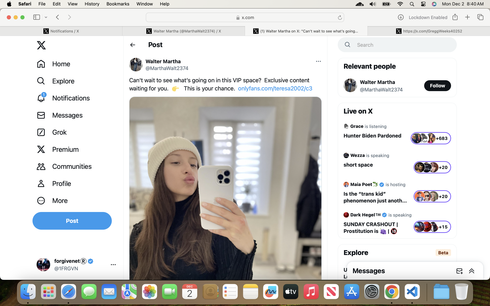 |
The woman in the pic above I believe is the [innocent lady groomed into porn](august.md#grooming-an-innocent-girl-into-porn-101)'s daughter. They look very alike and I have seen her in countless pics. She also looks a lot like [Bruno, one of the conservatory trumpet teachers](../../crimes/protagonists/vidal-sastre.md#a-man-possibly-called-bruno-with-at-least-one-son-called-bruno), Gloria the music-school secretary's brother, and the same man that was [waiting for me at Alicante airport arrivals on 18th June 2023](../2023/june.md#sunday-18th-june-alicante-airport). Could he be the father and therefore the groomer? |

## Ongoing torment and terrorizing

- The stalking and harassment on Twitter is unceasing.
- There have been constant threats from Hazel and Sandra Smith.
- The following is a tiny example of what I have been dealing with online constantly since [June 12th 2023](../2023/june.md#monday-12th-june-2023).
- One profile message says, "stay away bitch" - I didn't manage to screenshot it but it will be available on the likes from this tweet: https://x.com/1FRGVN/status/1867853572647596391 as will many others, including a bunch of messages in fake-account profiles about [Toby (Trish Penny's son) going missing](#wheres-toby).
- Are they worried that Trish's husband is going to drop them in it too?
- They do seem to be fighting amongst themselves, and I find this encouraging.
- I send a message to [mailto:016-online@igualdad.gob.es](https://violenciagenero.igualdad.gob.es/en/informacionUtil/recursos/telefono016/home.htm), a government gender violence organization in Spain, asking for help about what I'm going to do when I come back to Spain in January.
- I explain how much danger I'm in.
- I get no help or advice from them in reply, just a message to say I can contact them for advice.
- They give me no advice at all.
- I read the reply from them and receive an immediate communication, *no one cares*.

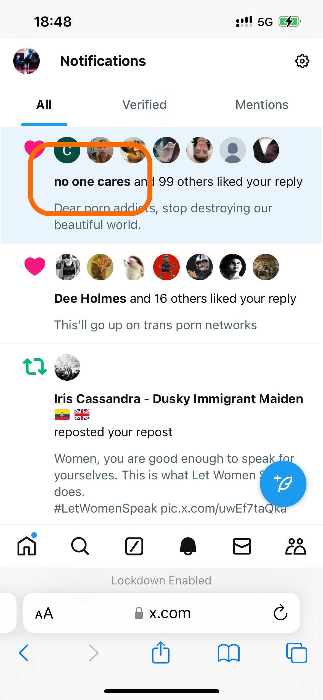

- I receive messages and interactions from fake accounts with threats every day.

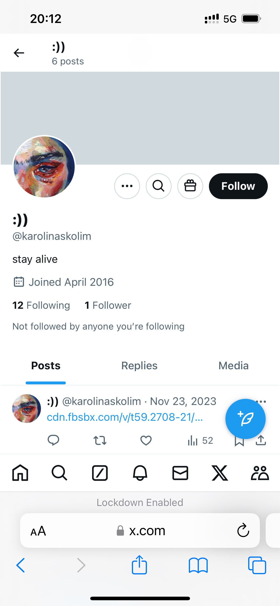

- Remember, Karolina is the name of the woman [Mike Wenham murdered](../2001-to-2010/2010.md#mike-wenham).
- One of the fake accounts [I posted earlier](august.md#4) likes one of my posts again. 
- I challenge them. 

[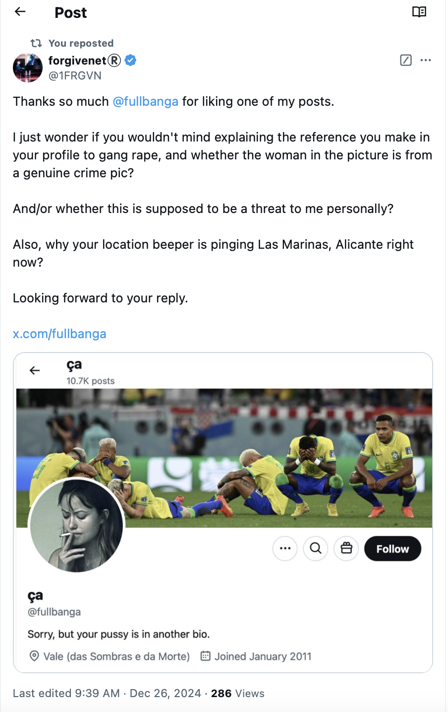](https://x.com/1FRGVN/status/1872110003626414167)

- And I ask them if the "pussy" they're referring to is mine from when I was a minor: https://x.com/1FRGVN/status/1872129900842545220.
- There is no reply.
- I challenge another dodgy account making reference to gang rape by black men.

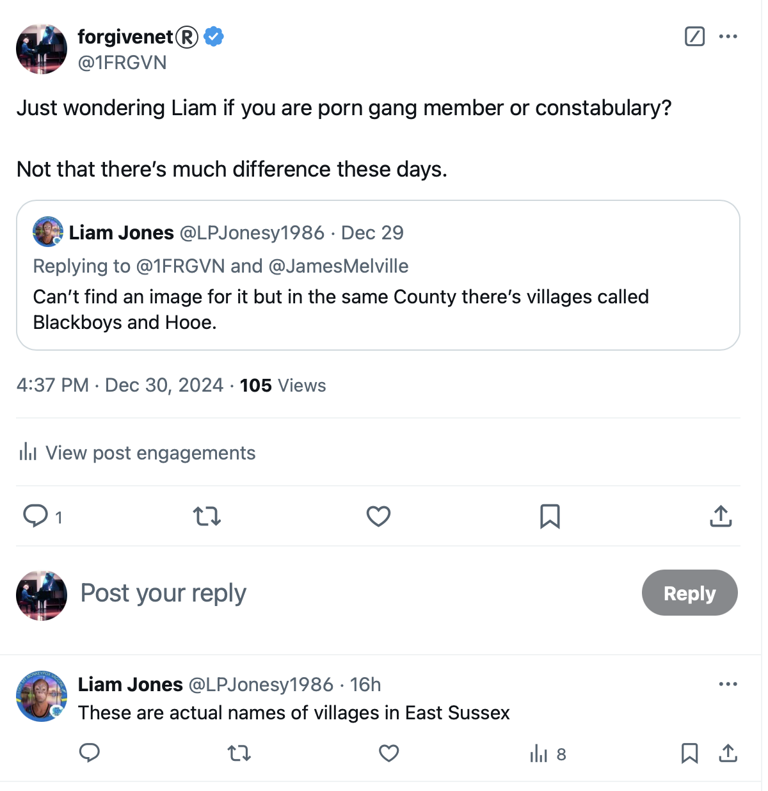

- On December 30th, I receive interactions from fake accounts containing content related to Winston May, North London rape-gang boss.
- The first like from "Winston" is on a tweet of mine about women's safety. 
- So I go look at the profile.
- I'm just noticing other curiously significant messages on here too (time of writing May 2026).

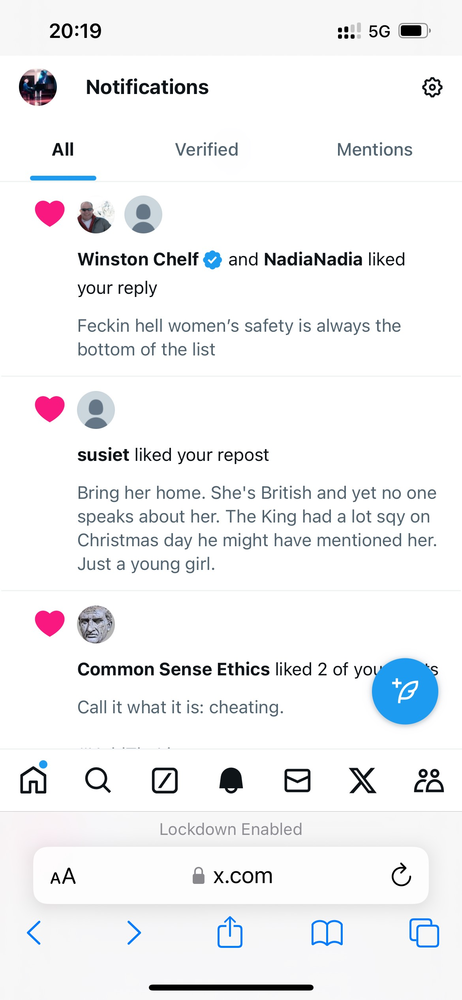

- The first post on the profile has Winston May's birthday, 5th December.

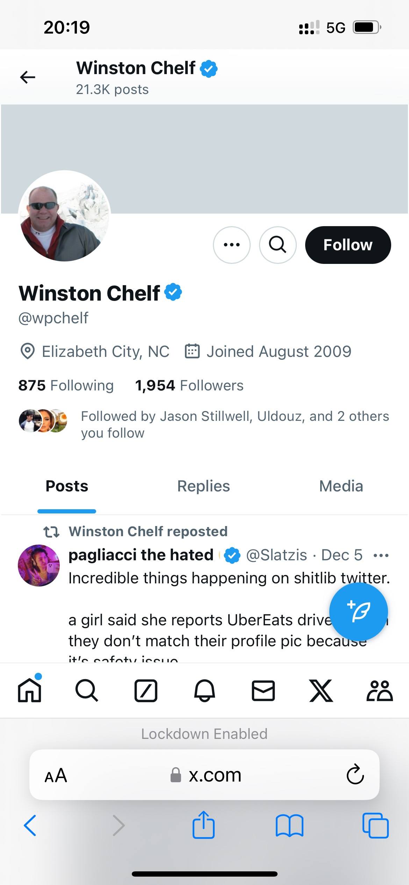

- The tweet the account liked is also from 5th December.

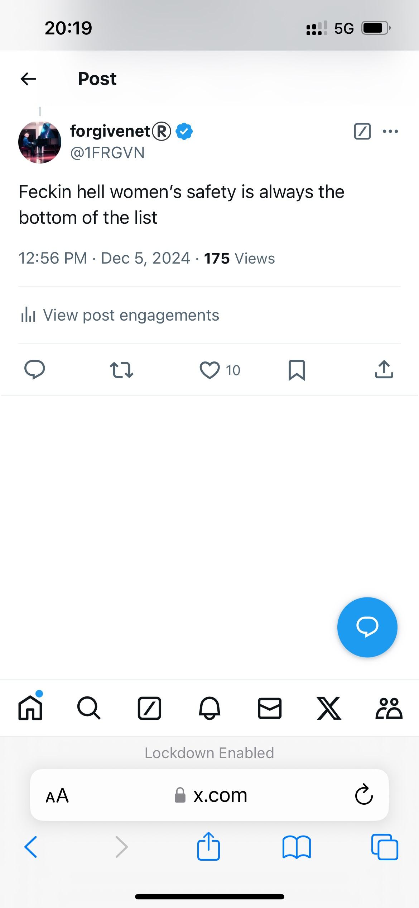

- I feel like I'm fighting a raging battle, all on my own, against thousands of perverts and their handmaidens.
- I'm unaware that a lot of what is going on is a conversation over-my-head between law enforcement and the criminals, as if innocent lives are in danger.
- It seems that many, many people would like me silenced:
    - Criminal porn gangs from London.
    - Criminal porn gangs from Dénia.
    - Anyone supporting the above including the Generalitat de Valencia.
    - Ineffective and corrupt police in the UK and Spain.
    - Misogynists generally.
    - Women's groups and sexual violence organizations who have been told to ignore me.

### Where's Toby?

- Threatening messages related to "Toby" are repeated constantly on fake account profiles managed by Hazel Smith.
- I'm starting to recognize her language patterns with very little input.
- I realize Toby is Trish's son by her first British husband.
- Were these threatening tweets about Toby more messages from criminals to law-enforcement that I was in the middle of?
- Later, another account flies by with the message, *Trish does things*.
- I have no idea what it means but I feel like my suspicions about Trish being involved malevolently in the porn-gangs grooming and stalking business were more than sound.
- The question remains if she has any choice in the matter, or whether she has been allowed the mental capacity to even understand what's truly going on.
- Trish told me one afternoon when we were hiking that she rarely knows where Toby is.
- She told me she thinks he mostly lives in his car in the UK.
- She told me he wants to live in Japan.
- She sounded worried about him and expressed a desire to have him back in Spain, but told me that Brexit had scuppered his residency status - which doesn't actually make sense.
- Is Toby suffering the same as me (a question posed at the time of writing, May 2026)?
- Was he so appalled by the outrageous and murderous goings-on in the region - and even perhaps what was happening to his own mother and family - that he is now stalked relentlessly by British and Spanish criminal gangs to the extent that he is stateless?
- Is Japan a country where they can't get hold of him?
- Did Toby apply for asylum in Japan citing relentless threats and gang-stalking by the porn-gangs of Dénia?

### New Year's Eve

- I decided to swap over from the MacBook and use the Linux laptop again; the machine which the [technician I hired to find evidence of hacking in April 2024](../2024/april.md#dpr-cyber-expert-alicante) had reset to factory settings.
- I move my Google account over.
- I then change the password to the laptop with no Internet connection.
- After connecting the Linux laptop online again, a ridiculous Facebook post tells me they're in already.
- They've have a password they shouldn't know, as if they're reading my mind.
- More logically, whatever hack they are using on my devices remains even when the device is cleaned by an expert!
- This is military grade hacking tech.
- An account pops up on X taking the piss.

- I already knew it but this proves again that Dénia and North London criminals have *total* access to my devices no matter what I do.
- I can't understand what's so special about me for them to have devoted so much effort into terrorizing me.
- I start feeling really overwhelmed with what has happened to me over the last three years; everything I've lost, the silence from law-enforcement, the constant abuse I have been suffering, never mind the poisoning and drugging.
- I tweet about it:

[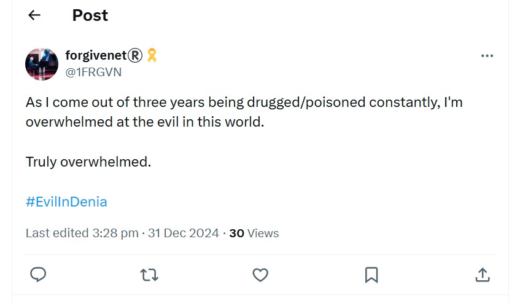](https://x.com/1FRGVN/status/1874100344021803398)

- Immediately, a fake account called "Sandra" pops up.

- At the time of writing, nearly 18-months later, precious little has changed and I understand the children of Dénia are still being sacrificed at the altars of porn.
- I wasn't to know then that the constant drugging and poisoning was very much set to continue as soon as I arrived back in the UK.

### The harmony teacher Alfonso pops up on Google search

- I do a search with `@jctot19 X`.
- The usual pics come up.
- One that I have noticed over the last months, but it didn't register until today, is a very scared looking man who looks exactly like Alfonso who taught harmony class from September 2023 at the conservatory.
- He, alone, expressed alarm when I told everyone I had to leave my conservatory studies in March 2024 because my life had been threatened.

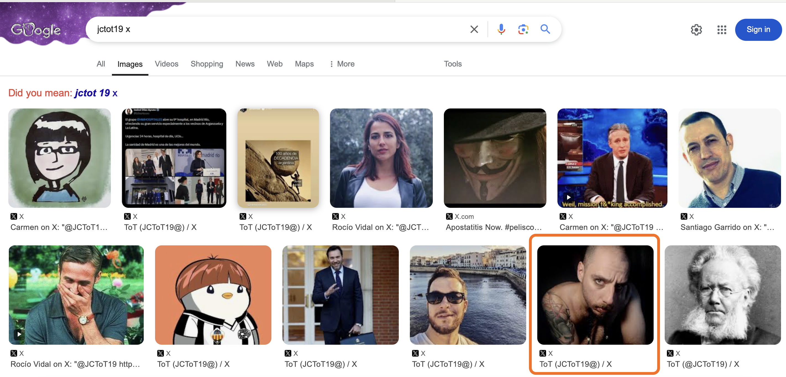

- The hackers on Twitter referred to him as a "brat". 
- Did Alfonso complain about what was going on, without realizing the fuller monstrous scale of the problem at the conservatory of Dénia.

### Lucyfer Adams

- A yappy stalker account flies by a lot over the month.
- The account name is "Lucyfer Adams".
- I note it as significant without knowing why.
- When I meet Paul - tasked with distracting me, topping me up, persuading me to travel to more illicit-porn film shoot locations, and God knows what else - in early January he will tell me about [his best mate Lucy](../2025/january.md#pauls-friend-lucy).
- Lucy is clearly a criminal gang member and I will bump into her a couple of times over the next few months in dubious circumstances.
- Is she the *Adams*, Adams?
- Are they offering her up too?
- Or is she safe and sound with the best of North London's finest?
- Am I about to find myself in even more danger when I move back to London?

## A curious new intuitive skill

- I'm not yet fully aware that my online conversations with criminal gangs have generated a lot of interest in international law enforcement organizations - although I'm sensing something's changed on the social-media hack I've been navigating for years.
- My handwritten letters - particularly the supplementary page - obviously had an impact.
- Every time I go online, I'm interacting directly with known criminals like Hazel Smith, the Denia porn-gang members, and other British and Spanish criminals.
- The thing is, the ability to do this on a social media space is somewhat unique; a new and very interesting skill.
- I expect my new-found ability is mostly to do with language pattern recognition abilities finely-tuned by years of spiked-hallucinogen intake.
- The criminals really shot themselves in the feet, didn't they.

## Detoxing in Samui, an unusual poo

- It is day 5 or 6 of the fast and cleanse.
- I go, as usual, to pick up my last detox drink at 7 o'clock.
- As I'm downing the wallpaper paste, I feel a strange rumbling in my belly, and a cramp beginning.
- I need the toilet!
- This is peculiar because I haven't eaten anything for 6 days and I have been doing colonics daily.
- Well.
- I am on the toilet for about 2 hours.
- There are at least three separate sittings as I think I've finished, get off, and then have to rush back quickly.
- It's as if the whole nasty Denia business, every second of it, is being released into the toilet bowl.
- I feel like I've been holding onto some serious poison for a long time, and here it is disappearing, down the toilet.
- On the last go, as I said about two hours after I started, I pretty much felt that was it, I could get going to my massage after I flush the toilet and wash my hands.
- I looked into the toilet bowl.
- The poo had formed into an X.
- Yes, an X.
- An not just any X, the Twitter X itself.
- It was a wow moment for me, I must say.
- I wondered what it could mean? It was very specific, very clear.
- Was it an instruction?
- Is X going down the toilet?
- I thought a lot about that poo, and never came up with anything particularly solid (no pun intended).
- I may have tweeted about Mary owning X due to it.
- Sorry about that.

## My Belgian friend

- I'm posting snippets from this police statement every day online.
- The information I have is horrific.
- I'm basically asking for help by writing this police statement.
- Except, no-one seems to care.
- So I keep writing.
- All I have is my words and there's no other option but to use them.
- One of my friends, who [I had visited back in July while I was at EthCC](july.md#meeting-my-belgian-friend) and told him what was going on for me, as far as I knew it at that time, tells me he's coming to help me move back to London from Denia.
- I'm so relieved. 
- Finally, a friend will help me.
- He's very *very* concerned.
- I then don't hear from him at all, for days.
- It's a bit like he's ghosted me.
- Did someone reach out and tell him to back off?
- Instead, I ask Paul if he will help me. 

## Man bares his teeth at me

- In the restaurant at the Spa Resorts.
- British man with long greasy hair, a Spanish wife and child, and very big teeth which he bares at me.
- Man looks like someone who had tried to rob H Samuel while I was on the till in Brent Cross in ... you guessed it ... 1989.
- She's not Spanish.

## A shift in the game

- wip
