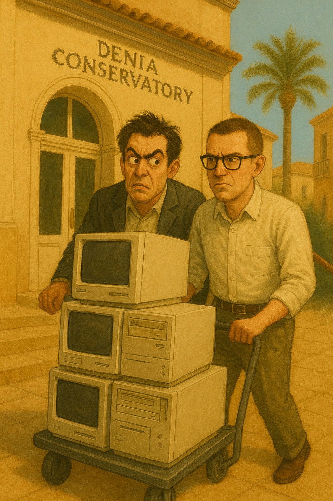

# February 2024

## Domestic violence in choir class

- [Salva](../2023/september.md#choir), the choir master, tells us we're going to be singing a new song for a sudden concert to be held at the [Centro Social](https://www.denia.com/centro-social/) just before Easter. 
- It's *La Puerta Violeta* by Rozalén.

<iframe width="640" height="360" src="https://www.youtube.com/embed/gYyKuLV8A_c" title="Rozalén - La Puerta Violeta" frameborder="0" allow="accelerometer; autoplay; clipboard-write; encrypted-media; gyroscope; picture-in-picture; web-share" referrerpolicy="strict-origin-when-cross-origin" allowfullscreen></iframe>

- The song is about domestic violence; apparently written with the intention of raising awareness about male violence against women.
- The words are very triggering and Salva's use of the song seems to me to be in *celebration of* domestic violence, which I am, arguably, suffering at the hands of the whole town and beyond.
- As I hear and understand the words of the song in class, I feel more and more anxious and alarmed.
- I watch the woman who sits beside me check my fingernails (which I chew and make bloody when I'm stressed).

!!! quote "Lyrics in English"
    A sad girl in the mirror 
    He looks at me prudently and doesn't want to talk 
    There is a gray monster in the kitchen 
    That breaks everything, that doesn't stop screaming 
     
    I got a hand on my neck that subtly 
    It prevents me from breathing 
    A blindfold covers my eyes 
    I can smell the fear and it's coming 
     
    I have a knot in the strings that soils my voice when I sing 
    I have a guilt that squeezes me 
    It lands on my shoulders and I have a hard time walking 
     
    But, I drew a purple door on the wall 
    And when I entered I freed myself, as the sail of a ship unfolds 
    I woke up in a green meadow, far away from here 
    I ran, I screamed, I laughed 
    I know what I don't want, now I'm safe 
     
    A flower that withers 
    A tree that does not grow because it is not its place 
    A punishment that is imposed on me 
    A verse that crosses me out and annuls me 
     
    I've got my whole body chained up (Uh, uh, uh) 
    Cracked hands, a thousand wrinkles on the skin 
    Ghosts talk in the back of the neck 
    The wound reopens and bleeds (Uh, uh, uh) 
     
    There's a goldfinch in my throat that's flying hard 
    I have the urge to turn the key and not look back 
     
    So I drew a purple door on the wall 
    And when I entered I freed myself, as the sail of a ship unfolds 
    I woke up in a green meadow far away from here 
    I ran, I screamed, I laughed 
    I know what I don't want, now I'm safe 

- I feel an intense aggression towards me in the classroom coming from Salva, the French horn player beside me, Samuel who wears a [chequered shirt which triggers me for reasons I'm unaware of](../../memes-triggers/memes.md#checked-shirts), and others.
- Undoubtedly I am ingesting some substance without my knowledge that exacerbates intense feelings of anxiety.
- While all this is going on, I realize that one of the other songs we have been singing since September has a repeated refrain, "ka ka ka", words I see [constantly from online abusers](../2023/september.md#immature-boy-bad-companions-or-both). 
- The song is *Dry Your Tears Afrika* by John Williams, and the score we all received in class had been edited to add *ka-ka-ka* at the ends of song lines.

- The African reference (black men) is now not lost on me either.

## New e-SIM with Yoigo

- I decide to get a new e-SIM from Yoigo on 7th February in the hope it might impede hackers.
- I go to the store in town and they do the backend administration and send me a confirmation email.
- It's such a complicated business however, I never manage to set it up, even though they sent me detailed instructions.
- The relevant part of the instructions on the email was missing, i.e. QR code, so I was never able to set up the e-SIM.
- I believe the email was interfered with and the QR code removed or made unreadable so that I could not set up the e-SIM.
- I was starting to find really very simple tasks quite impossible around this time.

## Constant gang stalking at the conservatory

### Ana and Ana

- Ana Girbes continues to be really angry at me for no reason whenever I see her, as does Ana Requena.
- On February 14th, Valentine's day, as I'm climbing the stairs to choir, Ana and Ana are sitting huddled together with their backs to me in Ana Girbes empty classroom with the door open as I pass so I can see them. 

- No-one else is around, curiously.
- Ana Girbes sees me and motions towards me and Ana Requena rushes out and peers at my face angrily, without looking at me or saying anything at all.
- I assume the intention is for me to think she is concerned I will have put makeup on for Valentine's day so that I think she thinks I have a date with the trumpet teacher.
- It's absolutely ridiculous and I know they are laughing at me as I continue on up to choir.
- I wonder now what they thought they were achieving.
- At a minimum, they must have intended I have a severe nervous breakdown.
- I wonder how many others they drove to madness or suicide?
- I wonder how many youngsters they shepherded, porn-ready, to the criminal gangs that control the town?

#### My funny valentine

<iframe width="672" height="378" src="https://www.youtube.com/embed/Are-c0BLyIg" title="Frank Sinatra - My Funny Valentine" frameborder="0" allow="accelerometer; autoplay; clipboard-write; encrypted-media; gyroscope; picture-in-picture; web-share" referrerpolicy="strict-origin-when-cross-origin" allowfullscreen></iframe>

### Nacho and the smug man destroying evidence

- Every time I go into practice the piano - most lunchtimes - something is going on.
- I see [Nacho](../2023/july.md#nacho-caresses-the-8-year-old-girl) carrying big cases full of files and desktop computers.
- I see the [smug man](january.md#the-smug-man-i-always-see) wheeling a trolley full of desktop computers into the conservatory offices.

- They seem to always be doing it as I arrive for practice, so I assume it is intended as yet another choreographed idiocy for me to become curious about.
- My assumption is that they are trying to make me think the [Generalitat is taking my complaints seriously](january.md#january-18th-correspondence-to-the-generalitat) and is doing due diligence on conservatory files and computers.
- It concerns me, if that is the case, that the culprits themselves are doing the investigations.
- But looking back, it's more likely my unassailable good opinion of people was still in the way and instead they were trying to make me think they were destroying evidence.

#### Official with a clipboard

- At class time, an officious looking black woman ([Domingo's ex again?](january.md#domingo-demonstrates-his-control-of-women-again)) wonders around the halls outside the classrooms where I can see her.
- She is carrying a clipboard and making notes on it.

- At the time, I assume this is an attempt to persuade me that the Generalitat are investigating and have sent an inspector; something that actually does happen at my [piano class in a month's time](march.md#an-inspector-calls).
- Now, at the time of writing, I believe that everything I witnessed is fake and set up.
- I'm curious if the Generalitat are aware of all this outrageous behavior and how many more complaints they've buried over the years.
- Indeed, are members of the Generalitat taking part by accessing the live-streams?

### Ana & Domingo concerts

- I see advertisements on the conservatory walls for concerts.
- Ana Requena and Domingo Cano are both performing concerts this month; at the boat club or in room 5.

- It's like the conservatory is declaring: we are totally 100% committed to destroying one or more of our students, and we know she is being sedated and raped in her apartment and has been for a few years now, we probably know the same thing was happening to her while she studied with us in 2015-15, and we are fully aware about other targets in the school, some very young, and we're enjoying watching it all and taking part, and ... we don't care.
- We're just carrying on as normal because that's what we do here.
- It's confusing to me because I still believe the Generalitat are going to help me.

## Highlights on Twitter

- It's exhausting and I'm really upset at how I'm being treated.
- I start to write my story and publish it on Twitter highlights.
- Everything in highlights relates to gang stalking: https://x.com/1FRGVN/highlights.

### The story published in highlights

- Part one - collecting my thoughts (the story): https://x.com/1FRGVN/status/1759737292472627532
- Part two - the trumpet teacher: https://x.com/1FRGVN/status/1759770318409695275 
- Part three - hacking: https://x.com/1FRGVN/status/1759837709365817828
- Part four - manipulating and involving the children: https://x.com/1FRGVN/status/1759864483244089476 -> I think the information in this statement covers that.

## Another email to the school board

- Things are getting worse and I'm getting more and more stressed.
- No one communicates with me and no one is trying to help me.
- I'm completely alone and the weight of what is going on for me is becoming overwhelming.
- It seems sensible to have some formal documentation on record and so I email the Generalitat Valenciana in Alicante, details given by the previous brief response I received in January:
    - [Another complaint in English](../../content/documents/emails/feb-10-email-to-alicante-en.pdf).
    - [Another complaint in Spanish](../../content/documents/emails/feb-10-email-to-alicante-es.pdf).
    - [Proof of sending via email](../../content/documents/emails/receipt-of-feb-email.pdf) -> this includes an extra short email I wrote about my concerns that Mercedes would lie about me and proof that was sent also.

## The conservatory knows about my correspondence to the Generalitat

- When I go to the conservatory the following week, it is very clear that everyone knows what I have said in the email I sent to the Generalitat at the weekend, particularly with regards to Mercedes, who is crying and moaning at reception with Gloria about something.
- It feels, again, set up and contrived.
- No one speaks to me about anything.

## Threats on X increase

- I'm followed by a weird fake account, Mark Moseley, who is just like the other fake accounts that interact with me directly, but decidedly more violent in tone. He seems unhinged.
- He is, apparently, a homeless drug addict from Portland Oregon but he baits me with information only the people of Dénia would know.
- This goes on for a few weeks. I, again, think it is the trumpet teacher or someone related to him. He gives many details of things only he or his associates could know.
- I tell him I don't believe who he says he is. He posts an identification document for Mark Moseley from Portland Oregon.
- I guess now that it's another delegate, hacked, or stolen account.
- He tells me how he prayed incessantly for something, help, and I came along. It seemed reasonable to me, still does.
- He asks me would I die for him. I do not respond. He says he would die for me. 
- In a DM, he tries to recruit me to his honey trap organization. This is on February 19th.
- I refuse in no uncertain terms.
- I have a copy of [the whole DM here](../../content/images/threats/mark-moseley-mail-in-full.pdf).
- Joe Biden's worst nightmare is Trump, of course. The *trump*et teacher has always used trump as a trigger or signpost for me.
- At the end of this chat, when I refuse to sign up to whatever he wants me to do - he'd said using fake accounts to find lonely men looking for love, or something like this - he threatens me with violence.
- His message says: "I hope you find an excellent plastic surgeon for your face."

- He says something else threatening about me which I didn't save at the time.
- Here's the thread aftermath when I asked my X friends what they thought: https://x.com/1FRGVN/status/1759685644278723021.

- At the time of writing, Sunday 24th November 2024, the account has been deleted and so I am unable to see his past messages live on Twitter.

- And there are some other threats around this from other accounts which are unsettling. An example:

- Interestingly, it is only a few days previous to drafting this section up, Wednesday 20th November 2024, that I checked this account and it was still live and posting.

- I consider that to demonstrate how hackers are still monitoring everything I do online in more-or-less real time.
- Going back to the original threat, I consider the threat to be credible and to mean that someone may throw acid on my face.
- A lot of my Twitter pals suggest reporting to the police: https://x.com/1FRGVN/status/1759685644278723021.
- He has deleted the account now.

!!! danger "Hackers still active - November 2024"
    - My movements are still being tracked and I'm still being hacked extensively.
    - I believe they deleted the Mark Moseley account at exactly the time I plan to be writing about it.
    - It is highly likely they are reading this statement while I write it.

- Perhaps any deleted accounts or messages are salvageable in Twitter caches.
- I sent a copy of the threat to the Alicante directorate too, asking them if they would do something now.

- There was, of course, no reply.
- I am starting to get seriously stressed and anxious now. And I'm scared too. 
- I call 112. I'm told to go to report the matter in person to the police.

## Guardia Civil

- On the same evening, I try to access the Guardia Civil webpage for reporting gender violence and cyber stalking. 
- The page fails to load at every attempt to access it. It's not a 404, or any normal error. It's a not connected to the internet error, except I am. 
- I literally cannot access any reporting pages on the Guardia Civil website at all.
- I know now I was blocked from accessing the Guardia Civil's gender violence and cyber stalking reporting line by hackers.
- This happens again when I try to access the European Union's human rights website and report there, after which I'm bombarded with fake account with titles related to "human rights".
- This may be [a message I sent them](../../content/documents/letters/possible-mail-to-the-GC.pdf) via an email address I found, I'm not sure now but the document I have is dated 20th February 2024.

## Policia Nacional

- Having been threatened with real violence, I (reluctantly I must say) go to report the gang stalking and everything that's been happening to me that I'm aware of at that time to the police in Dénia the next morning.
- I take all my documentation in Spanish detailing the story so far, including all my communication with the Generalitat.
- The policeman who deals with me reads the two letters I wrote to Concha the June before, tells me there is no crime, and that I should go home.
- I have a stack of documentation I would like them to read, but they are not at all interested.
- I tell them, but these people are civil servants in charge of children. They tell me I need to take a civil case out against the conservatory.
- I explain I'm being hacked. They say, how can teachers at the conservatory hack you, they are musicians.
- I tell them about the threat I received online the night before. They read it and tell me, "oh, he can say that because he probably thinks you're ugly".
- I'm utterly flabbergasted, and leave.
- While I was there, a woman police officer was holding up her mobile phone as if she was filming me the whole time.
- I wondered if they knew exactly who I was and what was happening to me.

## European Court of Human Rights

- On 26th February, I contact the European Court of Human Rights.
- I have a similar experience to what happened when I tried to access the Guardia Civil cyber stalking and domestic violence pages.
- I'm unable to find information about how to report what's going on for me.
- I send a [message in a comment box](../../content/documents/letters/echr-message.pdf) instead, to which I never receive a reply.
- Later that day, I get followed by fake accounts related to human rights. This is just one of them.

!!! note 
    - The profile message: "WHAT THE UN HAS CALLED #CYBERTORTURE (A/HRC/43/49) #CYBERTORTURE IS BEING DONE TO ME. LINK TO COMPLAINTS PUBLISHED BY THE RAPPORTEUR FOR TORTURE, NILS MELZER".

## Searching for a security expert

- The cyber stalkers are mentioning the child sexual abuse I endured more and more.
- They post suggestions they have porn videos with me in them.
- I see photos and silhouettes of what looks like me as a child of 16, lying on a bed, naked. 
- I try to find a security expert who can search for these images online. 
- I actually talk to a person: Andy Clarke <andy.clarke@fact-uk.org.uk> about this.
- He said he was unable to help me.

## The British girl at the conservatory

- I go to my piano lesson on one Monday this month.
- I am waiting outside, weirdly no-one is around.
- Suddenly, a girl of about 13 I know walks down the stairs.
- She is giggly, smiley, and I expect now, high.
- She is the half-British/half-Ukrainian-or-Russian girl that I have seen singing in concerts.
- She's beautiful, really lovely.
- I know she is British because of her very British accent whenever she speaks English, but her name is something Russian so I assume she has mixed-parents and is trilingual with the Spanish too.
- She has a Russian or Ukrainian friend of about the same age who is a little surly.
- They do piano duets together in concerts.
- In the rehearsal for the concert on 12th March, they are both there in room 11, with a few others.
- They perform God Save The Queen as a duet.
- The half-British girl then sings a solo accompanied by her teacher.
- She is so sweet with such a clear voice, I'm delighted and it must show on my face.
- Joan Carles glares at me angrily.
- I'm a little stunned.
- I realized this child must be a major target for the gangs shortly afterwards, and when I eventually realized I was being drugged continuously in classes, I realized she was high when she had walked down the stairs, like [the two girls Domingo had with him for me to see](../2022/june.md#maria-and-domingo) in June 2022.
- They must have set this up for me to see.
- The arrogance is staggering.
- I warned the British embassy about yet another child being in imminent danger, mentioning her and the others I knew about in January 2025.

## Twitter

### `@1frgvn`

- https://x.com/1FRGVN/status/1756669026153926765
- https://x.com/1FRGVN/status/1756669472239129004
- https://x.com/1FRGVN/status/1756609676563640497
- https://x.com/1FRGVN/status/1712456797456359427
- https://x.com/1FRGVN/status/1741728804320526343
- https://x.com/1FRGVN/status/1761507676171723144
- https://x.com/1FRGVN/status/1763160058647429141

### `JackChardwood`

- https://x.com/JackChardwood/status/1761022632202236020