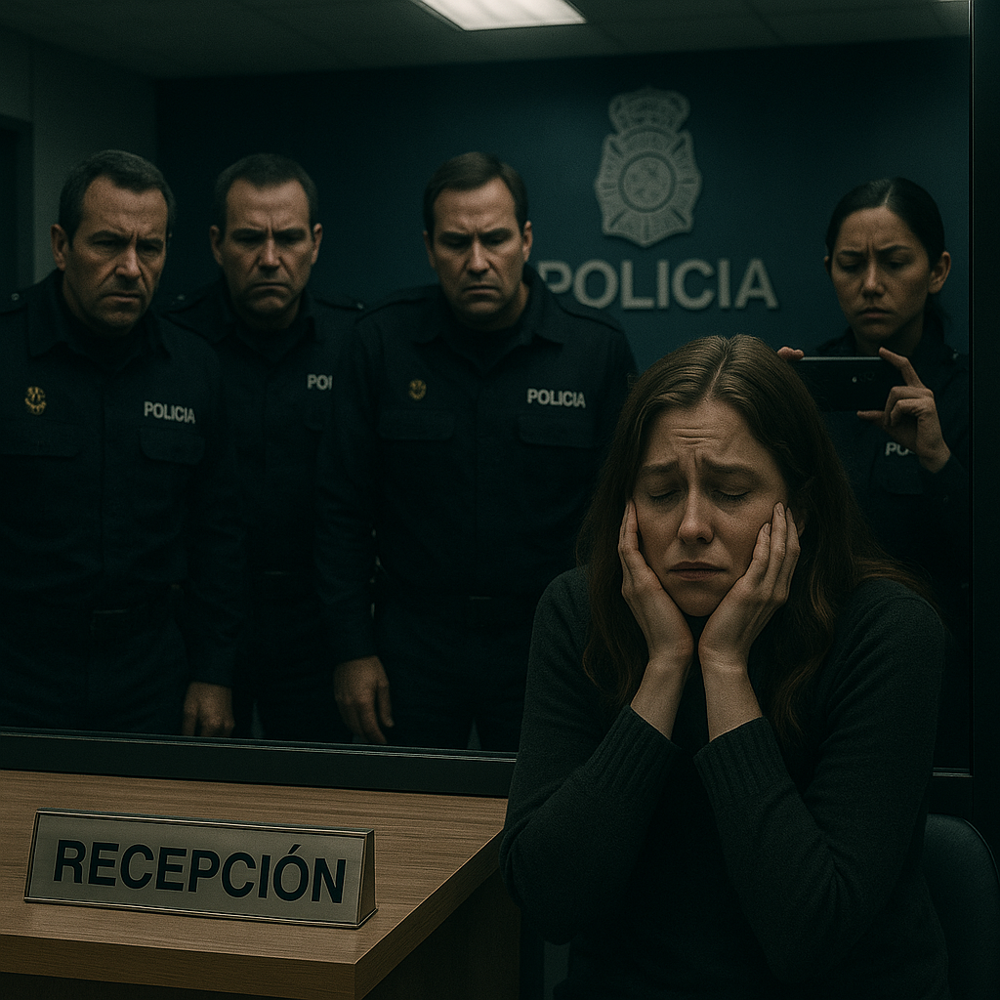

# February 2024

## Domestic violence in choir class

- [Salva](../2023/september.md#choir), the choir master, tells us we're going to be singing a new song for a sudden concert to be held at the [Centro Social](https://www.denia.com/centro-social/) just before Easter. 
- It's *La Puerta Violeta* by Rozalén.

<iframe width="640" height="360" src="https://www.youtube.com/embed/gYyKuLV8A_c" title="Rozalén - La Puerta Violeta" frameborder="0" allow="accelerometer; autoplay; clipboard-write; encrypted-media; gyroscope; picture-in-picture; web-share" referrerpolicy="strict-origin-when-cross-origin" allowfullscreen></iframe>

- The song is about domestic violence; apparently written with the intention of raising awareness about male violence against women.
- The words are very triggering and Salva's use of the song seems to me to be in *celebration of* domestic violence, which I am, arguably, suffering at the hands of the whole town and beyond.
- As I hear and understand the words of the song in class, I feel more and more anxious and alarmed.
- I watch the woman who sits beside me check my fingernails (which I chew and make bloody when I'm stressed).

!!! quote "Lyrics in English"
    A sad girl in the mirror 
    He looks at me prudently and doesn't want to talk 
    There is a gray monster in the kitchen 
    That breaks everything, that doesn't stop screaming 
     
    I got a hand on my neck that subtly 
    It prevents me from breathing 
    A blindfold covers my eyes 
    I can smell the fear and it's coming 
     
    I have a knot in the strings that soils my voice when I sing 
    I have a guilt that squeezes me 
    It lands on my shoulders and I have a hard time walking 
     
    But, I drew a purple door on the wall 
    And when I entered I freed myself, as the sail of a ship unfolds 
    I woke up in a green meadow, far away from here 
    I ran, I screamed, I laughed 
    I know what I don't want, now I'm safe 
     
    A flower that withers 
    A tree that does not grow because it is not its place 
    A punishment that is imposed on me 
    A verse that crosses me out and annuls me 
     
    I've got my whole body chained up (Uh, uh, uh) 
    Cracked hands, a thousand wrinkles on the skin 
    Ghosts talk in the back of the neck 
    The wound reopens and bleeds (Uh, uh, uh) 
     
    There's a goldfinch in my throat that's flying hard 
    I have the urge to turn the key and not look back 
     
    So I drew a purple door on the wall 
    And when I entered I freed myself, as the sail of a ship unfolds 
    I woke up in a green meadow far away from here 
    I ran, I screamed, I laughed 
    I know what I don't want, now I'm safe 

- I feel an intense aggression towards me in the classroom coming from Salva, the French horn player beside me, Samuel who wears a [chequered shirt which triggers me for reasons I'm unaware of](../../memes-triggers/memes.md#checked-shirts), and others.
- Undoubtedly I am ingesting some substance without my knowledge that exacerbates intense feelings of anxiety.
- While all this is going on, I realize that one of the other songs we have been singing since September has a repeated refrain, "ka ka ka", words I see [constantly from online abusers](../2023/september.md#immature-boy-bad-companions-or-both). 
- The song is *Dry Your Tears Afrika* by John Williams, and the score we all received in class had been edited to add *ka-ka-ka* at the ends of song lines.

- The African reference (black men) is now not lost on me either.

## New e-SIM with Yoigo

- I decide to get a new e-SIM from Yoigo on 7th February in the hope it might impede hackers.
- I go to the store in town and they do the backend administration and send me a confirmation email.
- It's such a complicated business however, I never manage to set it up, even though they sent me detailed instructions.
- The relevant part of the instructions on the email was missing, i.e. QR code, so I was never able to set up the e-SIM.
- I believe the email was interfered with and the QR code removed or made unreadable so that I could not set up the e-SIM.
- I was starting to find really very simple tasks quite impossible around this time.

## Another email to the Generalitat (the school board for the region)

- Things are getting worse for me, online and in person.
- I feel I'm in constant danger.
- I'm becoming more and more stressed and psychologically/emotionally injured.
- No one outside of X communicates with me, and I don't know who to ask for help as everyone has ignored me when my complaints should have been taken extremely seriously.
- I'm completely alone and the weight of what is going on for me is overwhelming.
- It seems sensible to have some formal documentation on record and so I email the Generalitat Valenciana in Alicante, details given by the [previous brief response I received in January](january.md#january-18th-correspondence-to-the-generalitat):
    - [Another complaint in English](../../content/documents/emails/feb-10-email-to-alicante-en.pdf).
    - [Another complaint in Spanish](../../content/documents/emails/feb-10-email-to-alicante-es.pdf).
    - [Proof of sending via email](../../content/documents/emails/receipt-of-feb-email.pdf) -> this document includes an extra short email I wrote regarding some of my concerns about Mercedes C Lara, and a screenshot of the [threat of violence](#the-denia-porn-gang-attempts-to-recruit-me) which prompts me to go to the police later in the month.

    !!! tip "My email to the Generalitat"
        Saturday 10 February 2024,  
        Denia Alicante  
        Dear sir or madam,  
        This letter is following the recent complaints I made about a teacher and his associates,
        particularly the computer technical staff- at the conservatory of Denia to which I have received no reply even though the male aggressive behavior against myself continues.  
        What has happened to me over the last 18 months is extraordinary, and a lot of it is even
        criminal, but my foremost concern is that this teacher and his computer technician associates
        have unlimited access to children, mostly girls, and their mobile phones. The ease and hubris
        with which he and his associates hacked my phone and laptop, took photos and videos of me
        half naked when I was home alone and disseminated them across the town, tracked my
        physical movements with my phone and set up intricate coordinated “attacks” around town and
        elsewhere, situations which were designed solely to terrorize me, can only mean that he has
        been doing similar with the minor children and women he has unlimited access to as a teacher
        over the years.  
        Currently, his students are giving me the overt cold shoulder, which is most welcome in fact as I am going to the conservatory to study music and not engage in what can only be described as being the victim of coordinated misogynistic stalking and bullying, male violence against women, in fact.   
        However, I remain more concerned about their safety and dignity than my own.  
        So many things have happened, the “attacks” have been pretty constant since October 2022 but
        crescendoed around June 2023 and since then. There are so many situations I could mention.
        For example, you might like to ask Domingo’s students what they were told about me in October
        2023 with regards to a very subtle tweet I posted on one of my accounts which was
        misinterpreted by him as me asking someone to travel somewhere in a romantic sense with me.
        Something ironically Domingo also mistakenly believed he did with me in December 2014 when
        I asked him to visit London with me, as a friend, and he lied to the conservatory about being sick so he could come with me and miss the important departmental meeting that December 2014.  
        Domingo’s students, in October 23, after I posted this misinterpreted tweet, came up to me in
        choir class and asked me directly about the trip I was going on with a boy and laughed and
        giggled as if they had been told something salacious about it, which was absolutely ridiculous.  
        But this is the kind of thing that has been going on constantly. Teachers should not be playing these sorts of games with their students. Are there no rules teachers have to follow with respect to their behavior towards students and minors or is Domingo Cano somehow exempt from them?  
        I believe now that Domingo’s original interest in me, apparently romantically, in 2014 was fake, and his true intentions were much darker. I found myself in a dreadful situation with this piano teacher who pushed himself into and involved himself personally in my life, someone who was extremely sexist, insulting, and rude and, in the end when it all went wrong for him, inevitably, I couldn’t do anything about it apart from ask for a new teacher.  
        When men in power overstep boundaries like this, we have to put up with them. We can’t get
        away without drama. They know this.  
        The story he has been telling everyone to discredit me is the sort of thing you think you might expect from teenagers at high school. They use the fact that they believe they tricked me into thinking one of the teachers liked me romantically to discredit and shame me. The problem is I knew about this trick from the choir concert in December 2022. It was so obvious and extremely unpleasant. Nevertheless, I played along, and by doing so they revealed their intentions and the fact that they have no limits on what measures they might take to hurt a student at the school they don’t like.  
        Domingo has control of WhatsApp groups with his students as members, he instructs them to
        spy on me and report back to him, and there is a very famous WhatsApp group that either
        himself or the computer technician is managing which publicizes my tweets to the members, but
        only tweets they have deemed interesting for whatever reason. This is the definition of stalking and is extremely concerning that public civil servants would have no qualms about doing this to a student. Everyone knows about this group.  
        The interest has dropped off recently, since my most recent complaint, which is welcome and
        something of an admission of guilt too, but they are still sharing some of my tweets. I can tell because you can see which tweets people are translating and then they make it known to me at the school that they heard about it. Someone is deciding which ones to share too and the
        criteria is not clear but my more condemning tweets regarding male violence, voyeurism, and
        sexual abuse do not get shared. Many of my tweets that have been disseminated amongst the
        conservatory staff and beyond are misinterpreted, taken personally, and have even caused
        teachers to be extremely angry with me when I have gone to the school!  
        You might like to ask any of the teachers how extremely private health matters I only ever told Google are common knowledge?  
        They have been utterly obsessed with me. It’s astonishing behavior, totally unacceptable from
        civil servants responsible for minors, other people’s children.  
        Nevermind my horrific experiences, I am extremely concerned for the safety and dignity of the
        young girls they are responsible for. There can be no way I am the only victim of this sort of
        thing. I also cannot believe I am the only person to ever complain about this sort of behavior
        which was designed to destroy me, to frighten me into leaving and to never return. The delight
        they took in engaging in this behavior was palpable and they were not expecting it to backfire so spectacularly.  
        A teacher who propositions a student romantically and gets turned down and becomes so upset
        they feel justified terrorizing them extensively over 10 years later should not be anywhere near women or children. It is gender abuse.  
        The way Domingo Cano spoke about the school girls walking past us in the street as we were
        having coffee one afternoon after class in October 2014 alerted me immediately to the fact that Domingo Cano has an extremely troubling over-sexualised view of schoolgirls alongside his
        appallingly low view of women in general.  
        I tweet a lot of concerns about child safety, gender abuse, and pedophilia. In fact, you might call me a feminist activist of some sort on Twitter and I have been so for nearly 3 years now. I believe these child-safety tweets surprised and upset Domingo and his associates to an even greater extent and put me in even more danger from them. Indeed, they have always been very quick to show me, in an exaggerated sense, how much power they have over young girls by overtly touching them in front of me, for example. It is appalling.  
        He is often seen in town chaperoning his young girl students and is mistaken for their father by the local townsfolk who don’t know him. In my view, he should be nowhere near young girls or have the unfettered access to their phones that he has been enjoying for many years.  
        I hope you will take some of what I am saying seriously, this is a very serious matter, and has caused me enormous distress and stress.  
        I suspect if you checked any of these men’s hard drives you would find concerning material.   
        And if you check historical complaints you are bound to find a bunch of complaints about him that are similar to this.  
        I don’t want to go to the police but if it continues I will eventually have no choice. However, I think my next port of call will be the media as it is such an astonishing story and extremely interesting to the public, especially parents.  
        As a Spanish taxpayer and upstanding member of the local, European, and global community, I
        have every right to study the piano at your most wonderful conservatory in Denia in peace and
        without being in danger from misogynists who find my existence offensive. It is a great privilege for me to attend the conservatory and study the piano and the extraordinarily high level of teaching is second to none. It is a great shame that a few abusive men have so much control over vulnerable students they are responsible for and don’t seem to know how to behave like adults within the law.  
        Please let me know if you need any further information. If anything else comes to light I may
        reach out again.  
        With the very best,  
        Sincerely,  
        Dra Katharine Murphy

    - When I read through this email, I sense my growing anxiety and exhaustion with what's happening to me.
    - Please note, dear reader, at the time of writing, September 2025, it is business as usual at the conservatory of Dénia, Alicante, Spain.

### Everyone at the conservatory knows I wrote to the Generalitat

- When I go to the conservatory the following week, it is very clear to me that everyone knows what I have said in the email I sent to the Generalitat at the weekend, particularly with regards to Mercedes, who is crying and moaning at reception with Gloria as I pass them.
- The bullying from [Ana and Ana](#ana-and-ana) and others online and in-person ramps up.
- Everything I experience feels, again, like it is set up and contrived.
- No one speaks to me.
- The Generalitat do not reply.

## Constant gang stalking at the conservatory

### Domingo's students conspire in chamber music class

- Chamber music class is also unpleasant.
- No-one talks to me (compare this to the year before up to [June 12th 2023](../2023/june.md#monday-12th-june-2023)) when everyone chatted to me in a friendly manner constantly, even if they were just information-gathering for Domingo.
- Domingo's students, Elvira a minor and Samuel an adult male, are on WhatsApp constantly.
- The chamber music teacher, Alfonso, seems to be a little frustrated with them, and even mentions it out loud at one point.
- *You're WhatsApping Domingo again?* he asks in an annoyed manner.
- Alfonso doesn't appear to have a choice on what to study in the classroom if Domingo insists upon overriding him.
- We're always listening to some piece of music that has a *meaningful* narrative.
- At one class, we have to listen to a hugely emotive piece with a narrative about about poisoning, Irish witches, and a tragic romance.
- *It's a bit intense don't you think*, I say.
- It's all very dull and boring, but apart from Domingo's gang-stalking activities, the class is good and I enjoy it.

### Ana and Ana

- Ana Girbes continues to be really angry at me for no reason whenever I see her, as does Ana Requena.
- On February 14th, Valentine's day, as I'm climbing the stairs to choir, Ana and Ana are sitting huddled together with their backs to me in Ana Girbes empty classroom with the door open as I pass so I can see them. 

- No-one else is around, curiously.
- Ana Girbes sees me and motions towards me and Ana Requena rushes out and peers at my face angrily, without looking at me or saying anything at all.
- I assume the intention is for me to think she is concerned I will have put makeup on for Valentine's day so that I think she thinks I have a date with the trumpet teacher.
- It's absolutely ridiculous and I know they are laughing at me as I continue on up to choir.
- I wonder now what they thought they were achieving.
- At a minimum, they must have intended I have a severe nervous breakdown.
- I wonder how many others they drove to madness or suicide?
- I wonder how many youngsters they shepherded, porn-ready, to the criminal gangs that control the town?

#### My funny valentine

<iframe width="672" height="378" src="https://www.youtube.com/embed/Are-c0BLyIg" title="Frank Sinatra - My Funny Valentine" frameborder="0" allow="accelerometer; autoplay; clipboard-write; encrypted-media; gyroscope; picture-in-picture; web-share" referrerpolicy="strict-origin-when-cross-origin" allowfullscreen></iframe>

### Nacho and the smug man destroying evidence

- Every time I go into practice the piano - most lunchtimes - something is going on.
- I see [Nacho](../2023/july.md#nacho-caresses-the-8-year-old-girl) carrying big cases full of files and desktop computers.
- I see the [smug man](january.md#the-smug-man-i-always-see) wheeling a trolley full of desktop computers into the conservatory offices.

- They seem to always be doing it as I arrive for practice, so I assume it is intended as yet another choreographed idiocy for me to become curious about.
- My assumption is that they are trying to make me think the [Generalitat is taking my complaints seriously](january.md#january-18th-correspondence-to-the-generalitat) and is doing due diligence on conservatory files and computers.
- It concerns me, if that is the case, that the culprits themselves are doing the investigations.
- But looking back, it's more likely my unassailable good opinion of people was still in the way and instead they were trying to make me think they were destroying evidence.

#### Official with a clipboard

- At class time, an officious looking black woman ([Domingo's ex again?](january.md#domingo-demonstrates-his-control-of-women-again)) wonders around the halls outside the classrooms where I can see her.
- She is carrying a clipboard and making notes on it.

- At the time, I assume this is an attempt to persuade me that the Generalitat are investigating and have sent an inspector; something that actually does happen at my [piano class in a month's time](march.md#an-inspector-calls).
- Now, at the time of writing, I believe that everything I witnessed is fake and set up.
- I'm curious if the Generalitat are aware of all this outrageous behavior and how many more complaints they've buried over the years.
- Indeed, are members of the Generalitat taking part by accessing the live-streams?

### Ana & Domingo play concerts

- I see advertisements on the conservatory walls for concerts.
- Ana Requena and Domingo Cano are both performing concerts this month; at the boat club or in room 5.

- It's like the conservatory is declaring: we are 100% committed to destroying one (and more) of our students, and we know she is being drugged in class, sedated and raped in her apartment, and has been for a few years now, we know the same thing was happening to her while she studied with us in 2014-15 too, and we are fully aware about other targets in the school, some very young, and we're enjoying watching it all, and taking part, and ... and ... we don't care.
- We're just carrying on as normal because that's what we do here.
- It's confusing to me because I still believe the Generalitat are going to help me.

## The Dénia porn gang attempts to recruit me

- I'm followed by a weird fake account, Mark Moseley [`@markmoseley072`](https://x.com/markmoseley072), who is just like the other fake accounts that interact with me directly, but decidedly more violent in tone. 
- He seems unhinged.
- Here are [my tweets to him that lead up to us DM'ing](https://x.com/search?q=(from%3A1frgvn)%20(%40markmoseley072)&f=live&src=typed_query). 
- All his tweets to me have been deleted.
- He is, apparently, a homeless drug addict from Portland Oregon but he baits me with information only the people of Dénia would know.
- For a few days or maybe a week or so running up to the 19th February, I see his irrelevant and sporadic posts on my timeline, at the top; posts that suggest he is enduring a romantic obsession.
- I empathize; and I think it could be the trumpet teacher, or someone close to him. 
- He gives many details of things only he, the Canos, or their associates could know.
- To be honest, I'm so desperate to communicate with the trumpet teacher, I believe everyone I interact with online could be him.
- I'm aware, also, that even if these people are not the trumpet teacher, something I'm pretty sure is the case, the trumpet teacher will see all my attempts at communication anyways.
- (That was really my state of mind, and my approach to the online abuse the whole time.)
- I tell him I don't believe he is who he says he is. 
- He posts an identification document for Mark Moseley from Portland Oregon, in exactly the same way other accounts have done; for example [`@lucyinbetween`](https://x.com/lucyinbetween).
- I guess now that the account was another delegate, hacked, or stolen account.
- It concerns me these people have copies of apparently genuine identity documents.
- He tells me how he had prayed incessantly for something, for help, and I came along. 
- It seemed reasonable to me, still does.
- He asks me would I die for him. I do not respond.
- He says he would die for me. 
- In a DM, he tries to recruit me to his honey trap organization.
- I refuse in no uncertain terms.
- He gets annoyed and threatens me with violence.
- There's a copy of [the whole DM here](../../content/images/threats/mark-moseley-mail-in-full.pdf).
- "We can end this. So let's end this k?", he says, and I take it to mean he is suggesting that we can end the vile and vicious prolonged psychological torment (and sexual abuse I'm unaware of) that has been going on since I moved back in February 2022 at the hands of the Cano family.

!!! tip "Mark Moseley's full DM"
    Brains Rewired Here  (Parody) 
    @markmoseley072 
    Welcome to High School 2.0 as we all find our clique. 
    Joined February 2024 
     
    5 Followers 
    Hi. 
    We can end this. So let's end this k? 
    Feb 19, 2024, 9:20 PM 
    You accepted the request 
    yes, how? 
    what do you want? 
    Feb 19, 2024, 9:28 PM 
    I want my 21-year-old daughter to not be terrified at the idea of bringing 
    a new human being into this world. 
    Feb 19, 2024, 9:29 PM 
    why is she terrified? 
    Feb 19, 2024, 9:30 PM 
    Politics 
    Feb 19, 2024, 9:30 PM 
    how is this relevant? 
    Feb 19, 2024, 9:30 PM 
    Let's start over. You play my side and I'll play yours. Okay? 
    Feb 19, 2024, 9:31 PM 
    who are you? 

    
    
    I'm Joe Biden's worst nightmare 
    Feb 19, 2024, 9:32 PM 
    this is not helpful 
    look I know I'm easy to wind up and its a laugh an' all, I can't believe you 
    would put so much effort into it though, I'm not that amusing am I?
    that's the only way you got into my laptop etc ... cos I'm just not that 
    interesting .. . 
    look, also, I know everything and I don't really care 
    Feb 19, 2024, 9:34 PM 
    I only care about the safety of kids , that's it
    that's the hill I'll die on 
    Feb 19, 2024, 9:34 PM 
    Then let's die on that hill together 
    Feb 19, 2024, 9:35 PM 
    who are you? 

    

    Feb 19, 2024, 9:35 PM 
    JC talks about something in ACIM about relationships and there being 
    holy relationships 
    Feb 19, 2024, 9:36 PM 
    I never knew what it meant, and I still don't but ... there are signs yah  
    yah 
    they're not easy, in fact they turn the world totally upside down ... 
    Feb 19, 2024, 9:37 PM 
    Holy relationships have God in the middle all of the time, as measured 
    by both humans believing that 
    Feb 19, 2024, 9:37 PM
    it's a relationship with God yes 
    God in the other person, you recognise God in the other person
    when you find something like that , you can be Creative in the truest 
    sense 
    Feb 19, 2024, 9:38 PM 
    Three-way human relationships tend to be VERY unstable 
    Feb 19, 2024, 9:38 PM 
    that's what JC told me ... 
    yes, we enter the ark 2-by-2 
    Feb 19, 2024, 9:38 PM 
    Evolution fixes that with inserting perfection as the third "person" 
    ideologically speakinh 
    Feb 19, 2024, 9:39 PM 
    that's you then ay? 
    Feb 19, 2024, 9:39 PM 
    so what do you/he want? 
    Feb 19, 2024, 9:40 PM 
    I want what you want. Safe kids 
    Feb 19, 2024, 9:40 PM 
    I mean sure, we can save the world, that's the project ... but practically, 
    now, in this business, are we ending this, or what? 
    Feb 19, 2024, 9:40 PM 
    Dating service. You find single women. I find kind single men; probably 
    nice men who get tongue-tied around women. We match them up. 
    Feb 19, 2024, 9:42 PM 
    I don't need photos. I need only what each woman is looking for. 
    Feb 19, 2024, 9:44 PM 
    well, there's a single woman here, should I ask her? 
    Feb 19, 2024, 9:44 PM 
    Yes. She wants someone she trusts. What else? 
    Feb 19, 2024, 9:44 PM 
    I have not been looking for a man since 2010. All those things, I can 
    hardly remember what they are anymore. I know how I felt. I want that. It 
    was not just sex. 
    I wasn't even in 2010, someone found me, that's usually been the way 
    with me. 
    I had no boundaries so men easily have pushed their way into my life. 
    Feb 19, 2024, 9:47 PM 
    Understood. I mis-communicated. 
    Feb 19, 2024, 9:47 PM 
    I only had one other genuine relationship in my life and only because I 
    drank at that time and had false confidence. But it was beautiful. 
    Feb 19, 2024, 9:47 PM 
    Your task is to find single women who are interested in meeting kind shy 
    men. 
    Feb 19, 2024, 9:47 PM 
    I found one right here. 
    See I said one other ... amazing 
    Feb 19, 2024, 9:48 PM 
    I found one right here. 
    Ask her something interesting on this topic then. 
    Feb 19, 2024, 9:49 PM 
    it's me dude 
    Feb 19, 2024, 9:49 PM 
    Oooooooooh 
    Oh. Okay. Can we do a "proof on concept" first? To refine our methods? 
    Feb 19, 2024, 9:50 PM 
    how so? 
    Feb 19, 2024, 9:51 PM 
    You find a single woman who is not you, who wants to meet kind shy 
    men. 
    Feb 19, 2024, 9:51 PM 
    why would I do that? 
    Feb 19, 2024, 9:52 PM 
    I'll do the same, but with men. Then, if we match them up well, then 
    philosophically speaking you and I will necessarily have the opportunity 
    to meet at their wedding. 
    Feb 19, 2024, 9:53 PM 
    why the f**keries bruv? 
    Feb 19, 2024, 9:53 PM 
    It'll be fun. I promise. 
    You can start with fake profiles! 
    Feb 19, 2024, 9:54 PM 
    noooo, I'm not doing that, I've no time for the bs
    honestly 
    Then I have no time for you. You don't trust me. I'm sad   
    Feb 19, 2024, 9:55 PM 
    ok 
    Feb 19, 2024, 9:56 PM 
    I hope you find an excellent plastic surgeon for your face. I'll pray for 
    that. 
    Feb 19, 2024, 9:56 PM 

- Joe Biden's worst nightmare is Trump, of course. The *trump*et teacher meme always used trump as a trigger or signpost.
- At the end of this chat, when I refuse to sign up to whatever they want me to do, he threatens me with violence.
- His message says: "I hope you find an excellent plastic surgeon for your face."
- I believe this to be a direct threat of violence towards me; possibly an acid attack in the town.

- I'm scared so I post the threat to my X friends and ask them what they think.

- You can see some of their replies here: https://x.com/1FRGVN/status/1759685644278723021.
- At the time of writing, Sunday 24th November 2024, the account is deleted (now suspended) and so I am unable to see any past messages I didn't screenshot.

- I see some other threats which are unsettling, including replies from fake quick-spin-up accounts the following morning before I go to the police. An example:

- Interestingly, only a few days prior to drafting this section up, on Wednesday 20th November 2024 in Bangkok, I checked this account and it was still live and posting.

- When I got around to drafting this section, just days later, the account had been deleted.
- I consider that to demonstrate how the porn-gang hackers were/are monitoring everything I do in real-time.
- Going back to the original threat, I consider the threat to be credible and to mean that someone may throw acid on my face. 
- I send a copy of the threat to the Alicante directorate too, asking them if they will now do something.

- There was, of course, no reply from the Generalitat.
- I am starting to get seriously stressed and anxious now. And I'm scared too. 
- I call 112.
- I'm told I have to go to report the matter in person to the police.
- I decide, very reluctantly and with a heavy heart, to go to the police the following morning.

## Documenting my conscious awareness on X

- It's the same evening after I've been threatened.
- I'm scared.
- I've just got off the phone to the police.
- The constant abuse is exhausting and I'm really upset at how I'm being treated by the people at conservatory.
- I start to write my story down on Twitter for evidential purposes.
- I publish everything and add my tweets to Twitter highlights.
- Everything I have put in highlights relates to the conservatory gang stalking: https://x.com/1FRGVN/highlights.

### The story published in highlights

- This is such an interesting documentation exercise because it shows how much I was aware of at this time, which is very little really.
- I have made assumptions on what is happening to me based on what I consciously know about it.
- The more hideous sex crimes, constant voyeurism, and live-streaming, which everyone else must know about, I'm unaware of at this time.
- Indeed, in retrospect, the full story of what has been happening to me at the hands of Domingo Cano and his family and associates, rather explains the psychopathy of teachers and staff at the conservatory, which was inexplicable to me at the time.
- Of course, teachers and staff involved in gang-stalking women and children for decades would be extremely keen to destroy me.
- Moreover, when normal people aren't able to do anything about the evil around them without getting murdered themselves, madness is safety (see, for example, Nazi Germany).
- Let's have a closer look at what I knew in February 2024.

- Part one - collecting my thoughts (the story): https://x.com/1FRGVN/status/1759737292472627532
- Part two - the trumpet teacher: https://x.com/1FRGVN/status/1759770318409695275 
- Part three - hacking: https://x.com/1FRGVN/status/1759837709365817828
- Part four - manipulating and involving the children: https://x.com/1FRGVN/status/1759864483244089476 -> I think the information in this statement covers that.

## Guardia Civil

- On the same evening, I try to access the Guardia Civil webpage for reporting gender violence and cyber stalking. 
- The page fails to load at every attempt to access it. It's not a 404, or any normal error. It's a not connected to the internet error, except I am. 
- I literally cannot access any reporting pages on the Guardia Civil website at all.
- I know now I was blocked from accessing the Guardia Civil's gender violence and cyber stalking reporting line by hackers.
- This happens again when I try to access the European Union's human rights website and report there, after which I'm bombarded with fake account with titles related to "human rights".
- This may be [a message I sent them](../../content/documents/letters/possible-mail-to-the-GC.pdf) via an email address I found, I'm not sure now but the document I have is dated 20th February 2024.

## Policia Nacional

- Having been threatened with real violence, I (reluctantly I must say) go to report the gang stalking and everything that's been happening to me that I'm aware of at that time to the police in Dénia the next morning.
- I take all my documentation in Spanish detailing the story so far, including all my communication with the Generalitat.
- The policeman who deals with me reads the two letters I wrote to Concha the June before, tells me there is no crime, and that I should go home.
- I have a stack of documentation I would like them to read, but they are not at all interested.
- I tell them, but these people are civil servants in charge of children. They tell me I need to take a civil case out against the conservatory.
- I explain I'm being hacked. They say, how can teachers at the conservatory hack you, they are musicians.
- I tell them about the threat I received online the night before. They read it and tell me, "oh, he can say that because he probably thinks you're ugly".
- I'm utterly flabbergasted, and leave.
- While I was there, a woman police officer was holding up her mobile phone as if she was filming me the whole time.
- I wondered if they knew exactly who I was and what was happening to me.

## European Court of Human Rights

- On 26th February, I contact the European Court of Human Rights.
- I have a similar experience to what happened when I tried to access the Guardia Civil cyber stalking and domestic violence pages.
- I'm unable to find information about how to report what's going on for me.
- I send a [message in a comment box](../../content/documents/letters/echr-message.pdf) instead, to which I never receive a reply.
- Later that day, I get followed by fake accounts related to human rights. This is just one of them.

!!! note 
    - The profile message: "WHAT THE UN HAS CALLED #CYBERTORTURE (A/HRC/43/49) #CYBERTORTURE IS BEING DONE TO ME. LINK TO COMPLAINTS PUBLISHED BY THE RAPPORTEUR FOR TORTURE, NILS MELZER".

## Searching for a security expert

- The cyber stalkers are mentioning the child sexual abuse I endured more and more.
- They post suggestions they have porn videos with me in them.
- I see photos and silhouettes of what looks like me as a child of 16, lying on a bed, naked. 
- I try to find a security expert who can search for these images online. 
- I actually talk to a person: Andy Clarke <andy.clarke@fact-uk.org.uk> about this.
- He said he was unable to help me.

## The British girl at the conservatory

- I go to my piano lesson on one Monday this month.
- I am waiting outside, weirdly no-one is around.
- Suddenly, a girl of about 13 I know walks down the stairs.
- She is giggly, smiley, and I expect now, high.
- She is the half-British/half-Ukrainian-or-Russian girl that I have seen singing in concerts.
- She's beautiful, really lovely.
- I know she is British because of her very British accent whenever she speaks English, but her name is something Russian so I assume she has mixed-parents and is trilingual with the Spanish too.
- She has a Russian or Ukrainian friend of about the same age who is a little surly.
- They do piano duets together in concerts.
- In the rehearsal for the concert on 12th March, they are both there in room 11, with a few others.
- They perform God Save The Queen as a duet.
- The half-British girl then sings a solo accompanied by her teacher.
- She is so sweet with such a clear voice, I'm delighted and it must show on my face.
- Joan Carles glares at me angrily.
- I'm a little stunned.
- I realized this child must be a major target for the gangs shortly afterwards, and when I eventually realized I was being drugged continuously in classes, I realized she was high when she had walked down the stairs, like [the two girls Domingo had with him for me to see](../2022/june.md#maria-and-domingo) in June 2022.
- They must have set this up for me to see.
- The arrogance is staggering.
- I warned the British embassy about yet another child being in imminent danger, mentioning her and the others I knew about in January 2025.

## Twitter

### `@1frgvn`

- https://x.com/1FRGVN/status/1756669026153926765
- https://x.com/1FRGVN/status/1756669472239129004
- https://x.com/1FRGVN/status/1756609676563640497
- https://x.com/1FRGVN/status/1712456797456359427
- https://x.com/1FRGVN/status/1741728804320526343
- https://x.com/1FRGVN/status/1761507676171723144
- https://x.com/1FRGVN/status/1763160058647429141

### `JackChardwood`

- https://x.com/JackChardwood/status/1761022632202236020