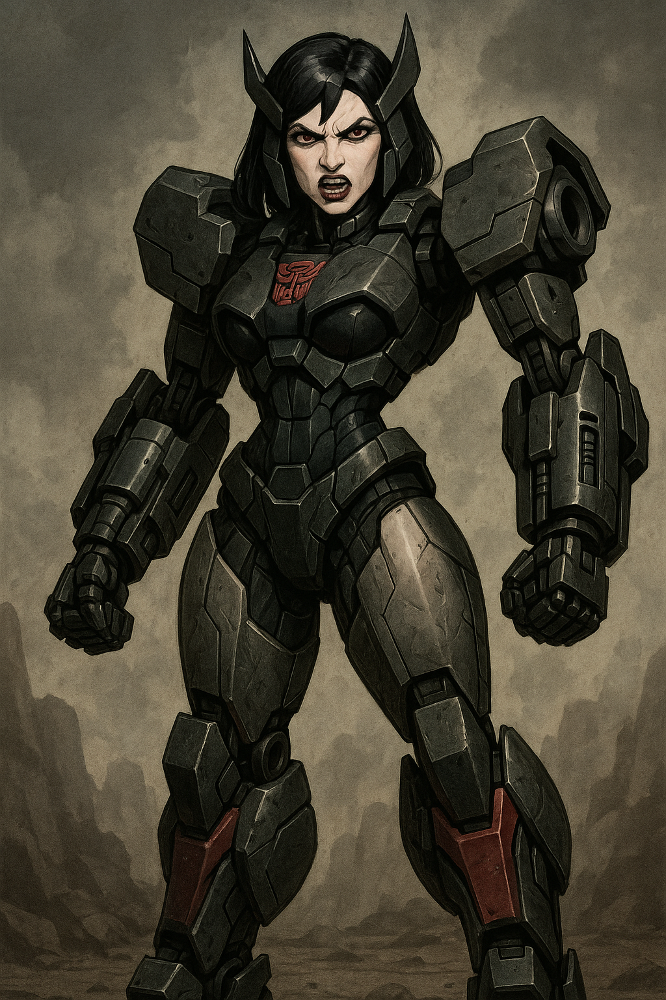

## Back in Dénia

- I am still high after Christmas and New Year. All the chats and interactions make me think I have a boyfriend; see the [Google search](#google-search) section for some elaboration on that.

!!! info "Disclaimer"
    - I don't really think this, not really, it's too absurd, but I can't seem to unhook myself from the game, which is relentless.
    - Whatever is triggering these beliefs is very powerful and I cannot think straight about it at all.
    - I believe this is proof I'm being drugged, as well as being manipulated by online seduction techniques.
     
- I chat with a fake account: https://x.com/ItsMe50474936 that I'm sure is either the trumpet teacher or someone close to him as they have information they could only know if they were involved in everything that has been happening.

!!! tip "Delegate accounts"
    - I believe many of these accounts are used by the trumpet teacher and others who have delegate access.
    - This means they can take over the account and post on its behalf at any time.

- It's the same account that posted the [hotel room selfie photo](../2023/december.md#hotel-room-selfie-pic) a few days before.
- https://x.com/ItsMe50474936: "It's me" is the name I use on any fake accounts I have created.
- This account also states that they're nervous they're "actually" talking to me instead of seeing me in the group.
- We chat. I'm sure it is the trumpet teacher. He tells me he likes to paint but he hasn't painted for many years. I ask him why not. It sounds like he had some sort of breakdown but I wonder if it's jail.

!!! tip "Patricia is an artist"
    - I wonder if Patricia and whoever the trumpet teacher is, someone she assuredly knows, share an interest in art.

- I end up blocking this person because it's just so weird but I think if you believe the lie, even a tiny bit, 10%, they have a hold over you. I believed it a little.
- And, of course, who wouldn't be influenced by love and a potential relationship, being with someone you believe you really like, even if it is manufactured and fake?

## Lucia in the dark room with Domingo

- Every time I go to the conservatory some psycho-emotional torture awaits me. Domingo is always behind everything, orchestrating, directing everyone.
- One Monday evening as I'm leaving class, I notice Domingo standing in the doorway of one of the teaching rooms beside where my class took place.
- He looks at me meaningfully and menacingly and, as I walk past the open classroom door, I notice, in the darkened room with no lights on, Lucia, the minor, Domingo's student, looking out at me.
- It's all set up to make me think something is going on.
- And yet, the thing I'm supposed to think, which Domingo can ensure no-one tells anyone about - because look what happens to people who are concerned about the safety of minors in the conservatory system - *is* actually happening.
- It's only a matter of time before the world finds out about the mass spy-cam porn voyeurism in Dénia that includes violent sex crimes and the preparing of its future stars and where they come from.
- The moment a victim feels safe enough to speak, and people are listening without wanting to murder them, there will be a tsunami of speakers, males and females. It's the same everywhere in the world.

## Google search

- I am seeing multiple posts about "boyfriends" on my accounts' Google search result images. 
- I believe that's what this tweet is referring to: https://x.com/JackChardwood/status/1742110623490506940.
- I mention this on Twitter: https://x.com/1FRGVN/status/1748488576860389657.
- How do they do it? I ask: https://x.com/1FRGVN/status/1748485970272419873. 
- I thought it might be cookies but I used someone else's device once to check and the results were the same. Unless they had hacked that person's phone too.

## `@JackChardwood` account content completely changed

- Up until early January, on my `@JackChardwood` account, I see mostly rather dull content about tech and self-help, motivational stuff. It's really very boring.
- Suddenly, the timeline has completely changed and it is now posting spiritual content, love and romance content, nothing like I was seeing before.
- It's weird. I note it: https://x.com/JackChardwood/status/1750917604393308599

## Galway

- I'm still extraordinarily high from Christmas.
- I head to Ireland on 10th January for my therapy course once again.
- When I inform the choir teacher I will be away, he says, "as long as you're not going away for the weekend with your boyfriend", referring to what Domingo had got [his student Elsa](../2023/october.md#gang-stalking) to ask me. He says this every time I have to tell him I'm going to skip a class.
- I open an anonymous account on Twitter, follow `@jctot19` on it, and post solely to my timeline without interacting with his account directly at all.
- A post from him on 9th January, which I have only just seen at the time of writing (November 2024), mentions a *chica* and it appears to be referring to me. If so, the implication is that I am chasing him again and again. However, this is undoubtedly what he, Domingo, and their co-conspirators have been setting me up to *appear* to be doing.
- I wonder if this is how they defend themselves if anyone dares accuse them of sexual coercion/grooming and fraud-related matters. They say, oh she was obsessed with me. Well duh, yeah. You might well get obsessed with someone who drugs you and seduces you.
- The first post I saw on his timeline, on 10th January, was an angel climbing a ladder to heaven, so I continued.
- I posted about my therapy, and looked on his timeline for responses, as before.
- There was a to-and-fro, as before, all positive.
- After a day of this, however, the content starts to be interspersed with references to porn, specifically violent and humiliating porn.
- I posted one tweet with a sexual connotation, and he immediately reaches out to a random woman he hasn't seen in years.
- The tweet I posted was "will you look me dead in the eyes".
- This is a direct reference to Winston May as Winston May (who I detested, by the way, but totally controlled me) always looked me dead in the eyes during sex.
- This may well be in my statement to the police, but it is more likely viewable in the porn they made.
- I immediately stop communicating with him and delete the twitter account I had created.

### Novel entries

- There are additions to this period in Ireland related to something Steve said to me, an email exchange between myself and him, and some interesting communications.

## Boots from Ireland

- I buy some expensive boots in Galway. They're beautiful.
- I bring them home and put them on my shoe rack.
- A few days later I notice they are quite severely scuffed. I never noticed this in the shop but I haven't worn them so I contact the seller to complain.

!!! danger "Evidence of people coming into my apartment"
    - Looking back, this sort of thing strikes me as being to do with people entering my apartment without my knowledge whenever they got the chance to cause mischief, and add poison/drugs to my food and toiletries.

- They are even more badly scuffed a year later when I pack them to leave in February 2024. I only wore them once for a couple of hours since complaining about the big scuff which looks to me malicious now.

## I buy an iPhone

- I take a colleague's advice and buy and iPhone in the hope it will impede hackers.
- Copy of the [confirmation from Apple](../../content/documents/evidence/iphone-bill.png).

## Ana and Ana

- Ana Girbes starts taking a role in the bullying at the conservatory. She makes herself visible and she is always glaring at me furiously whenever I see her. I have no idea why.
- One evening, she barks something at me as she walks past me, and then she says something derogatory to me about a private health matter I have only ever told Google search.
- Ana Girbes and Ana Requena create highly suggestive choreographed routines designed to make me anxious and stressed, and this goes on way into March.
- They are always furious at me but they never say a word to me.
- The implication is that Ana is furious at me for "being in love" with the trumpet teacher who is her boyfriend.
- At some point during the month, they both change their demeanor completely, and smile sweetly at me when I'm going to class or leaving the conservatory.

!!! danger "Remember"
    - I'd just like to take a moment to remind everyone at this point that these women are teachers in a public school with responsibility over many, many children.

- It then switches again and they are angry with me. 
- Paqui would sometimes reinforce this with an off the cuff remark at my piano class.

!!! info
    - Curiously, this was also part of my child sexual abuse statement to the police when I described what the pedophile had done to terrorize me and make me too afraid to say no.
    - He would be furiously angry with me, and then be kind, and then be angry again, and repeat, sometimes this was within seconds.
    - It was devastating to my mind and emotional stability and my body still reacts strongly to this sort of thing, even though inside I'm relatively calm.
    - I wonder did the two Ana's know about this, or were they simply taking instruction from Domingo who knew tactics like this would destabilize me because he had read the statement himself.

### Ana Girbes transformer figure

- I had started to see a transformer figure on the `@jctot19` search results since [Ana's show](../2023/december.md#ana-girbess-show).
- The character looked like a fierce and angry Ana Girbes carrying big guns. The likeness to Ana Girbes was startling.

- Ana Girbes is the musical language teacher at the conservatory. 
- This character remained in search results for a couple of months.

## Conservatory women

- At some point, I told Paqui that Domingo and his associates were terrorizing me. 
- It was just before a piano concert at the social centre in Dénia in January 2024 which the students of the conservatory are usually invited to. She asked me was I going to go, and I asked her if it was safe for me to go.
- She seemed alarmed at my question which is when I told her I was being terrorized by men, Domingo and others.
- I believe I can trust her at that point, at least a little bit.
- I had no idea she was 100% involved.
- Furthermore, as well as the two Ana's, Katia the singer is also angry with me in my chamber music class. I feel it is all very unfair. 
- Katia gives me her mobile number at some point.
- I can't believe the women could all be involved and I try to reach out to them.

## Conservatory men

- The weird guy who may be an engineer is always at the conservatory, quite often waiting at the door as I arrive with someone else.
- One evening, I pass him on the stairs. As I do, I smile at him. His face flashes fear. I tweet about it: https://x.com/1FRGVN/status/1747791280803815621.

## Fake accounts reference payments

- I sent a financial a gift to my monk friend for Christmas.
- Fake accounts post the amount to me, while in the middle of a chat with a [stalker account about "pandas"](march.md#thursday-7th-march), which I know is how they reference my Tibetan monk friend.

## Nacho says sorry

- The French horn player (an adult student) from choir class follows me out one evening to assess my reaction to Nacho when I see him.
- She sees me grimace when I see him, she looks satisfied, and walks off.
- A few mornings later, when I'm practicing, Nacho pops his head into my room and says sorry and then disappears again.
- I find it very weird and tweet about it. Something banal like, "hmm interesting", but they will know what I was referring to.
- The next choir class, Nacho continues to be part of the bullying and threats. 
- I see him interacting with all the young girls (Domingo's students) after class, and they're all saying "coffee" really loudly as he asks them if they'll "go for a coffee".
- I ask Samuel what's going on, why are they saying "coffee" loudly, and he says, oh it's just a game.

## Nacho follows me around town

- One Saturday, I need to run some errands in Dénia.
- Nacho is always there, wherever I am, walking by in view.
- He's following me, trying to upset me.
- I smile and laugh at him. He looks embarrassed.
- Nevertheless, I'm stressed and anxious about this.

## Threatening men outside

- On January 16th I'm coming back from practicing the piano.
- There is a car outside my building where I'm walking and there are two men in the car glaring at me angrily: https://x.com/1FRGVN/status/1747283258092425350.
- As I walk past them, they make the engine scream and howl, before speeding off, the tyres screechings.
- I recognize one as a man who had fixed my car back in 2013 who worked at the garage near my old flat. He had help me replace a flat battery.

## Constant threat

- In general, the threat level is growing in the town, at the conservatory, and online. 
- No one speaks to me, at all, but they are all extremely busy choreographing ridiculous "moments" which will "make me think" something about something.
- I'm becoming extremely anxious.
- It's getting difficult to perform simple tasks normally. I need extra effort for things I usually don't think about.
- My mind is constantly filled with concerns about what's going on.
- I now wonder if I was being spiked by something anxiety-forming at this time but perhaps the behavior of teachers, staff, and students at the conservatory during this period is enough to explain the anxiety I'm feeling.
- This anxiety grows until, probably, June when I'm in Lourdes and then head back to the UK for a few weeks. From February to May it is overwhelming. It is still not nearly as bad as the anxiety I experienced after reporting child sexual abuse to the police, however.
- Everything that's going on is extraordinarily evil and I can hardly believe it.
- I often wonder how many others have been targets like me. Undoubtedly loads. I wonder as well how many of those targets ended up in prostitution or porn, and if they were targeted as minors, or if they ended up having nervous breakdowns or killing themselves. I can't help but think about Elaine.

## Dick pics from the choir master

- The evening after my first choir class in September 2023, on Twitter, an [account named Salva, posted a dick pic](../2023/september.md#choir).
- I mention [dick pics on Twitter on 17th January 2024](https://x.com/search?q=dick%20pic%20(from%3A1frgvn)&src=typed_query&f=live) right before choir class.
- About half an hour into the class, Salva's WhatsApp beeps, and he takes out his phone to look at his messages.
- Suddenly, he's enraged. 
- He makes a dreadful fool of himself by talking about terrible things that happen to people to all the children.
- The children get really animated and excited. 
- I'm paraphrasing and misquoting, but the gist was there was someone in a class one time, who thought they were a spiritual mystic but were in fact psychotic and mentally ill. They brought a knife in to class and stabbed everyone. He may have even mentioned horrible details about cutting body parts off people. It was unbelievable.
- I was utterly appalled at his behavior in class. So was Samuel. 
- I mentioned to Samuel that Salva clearly didn't want his students to come back the following week.
- Salva had said things that would make parents stop their children coming to his class, if they knew he was like that.
- Someone unknown had sent him a link to my posts at that moment, for a joke, and, due to the guilt, he became uncontrollably enraged.

## January 18th correspondence to Katia and the Generalitat

- I've convinced myself the women can't be involved, they must be being lied to by the men.
- I [text Katia](../../content/whatsapps/text-to-katia.pdf). 
- Katia does not reply or even mention the text when I see her next at class. 
- Instead, she looks at me and says something like, "oh you are the best", in a weird way, and that's that.
- I also [email the Generalitat again](../../content/documents/emails/jan-18-email-to-GV.png) that day with an update of what's going on.
- The Generalitat reply to tell me they have transferred the matter to the Alicante office. 
- I have to ask them to give me a contact there.
- They're fobbing me off. 
- It's 3 months since I wrote the [original letter of complaint](../../content/documents/letters/3.%20Letter%20to%20Generalitat%20of%2022%20October%2023%20-%20ES.pdf) to which I never received any reply.
- I mention buying a new phone in the email to the Generalitat, which I did, which was expensive, an iPhone 14 as suggested by someone at work. They hacked into it pretty much immediately.

### Domingo demonstrates his control of women again

- The following day, I'm going to practice the piano at the conservatory.
- As I'm going up the stairs, Domingo is coming down the stairs and he's sort of behind and semi-forcing this woman down along with him at his pace, like frogmarching. They are closely connected.
- It reminds me of how the man forces [the woman in the tunnel](../2023/november.md#tonya) along whenever I see them.
- The woman looks mix-raced and I wonder if she is the German ex-girlfriend he mentioned back in 2014 although I would have expected her to be older, maybe.
- It's a demonstration for my benefit. I'm not impressed.

### Forwarded to Christine BJ

- I don't trust the Generalitat anymore but I know how important to have documented proof of what's going on.
- I forward [every communication I send to the GV to Christine](../../content/documents/emails/Screenshot%202024-02-20%20at%2008.48.40.png).

## Twitter

### @1frgvn

There's a lot of confirmation of what I have been saying here in these tweets. It's like I had time to breathe and assess things in the second half of this month. Did they stop spiking me/and manipulating me online temporarily?

Earlier in the month I remain exuberant and there are lots of deleted tweets, and suspended and deleted accounts involved.

- https://x.com/1FRGVN/status/1752602299803783584 -> talking about the smile of the trumpet teacher in Benijembla and class.
- https://x.com/1FRGVN/status/1752342228465262902 -> in reference to the sad woman at Benijembla.
- https://x.com/1FRGVN/status/1752340257280815497 -> declaring love again (under extreme manipulation of course).
- https://x.com/1FRGVN/status/1752243357399634152 -> mentioning threats.
- https://x.com/1FRGVN/status/1751698770314535410
- https://x.com/1FRGVN/status/1751679949734334725
- https://x.com/1FRGVN/status/1751332834835329038
- https://x.com/1FRGVN/status/1751275593352491469 -> stalker account `@1Loviatar` pretending they're my friend.
- https://x.com/1FRGVN/status/1751211014308139309 -> mentioning the "most brutal of wind ups the world has ever known". Do I think it's over at this point?
- https://x.com/1FRGVN/status/1751185092020519333 -> mentioning no depression to another stalker account `@Lucyinbetween`.
- https://x.com/1FRGVN/status/1751152861390467073 -> wondering about how many kids (conservatory students) have suffered the same as me.
- https://x.com/1FRGVN/status/1751146570521731402 -> all stalker-related content goes into Highlights.
- https://x.com/1FRGVN/status/1751145935646621796 -> stalker account `@AIinAmerica`. This one posted the boy that even today comes up first on Google searches. I'm supposed to think it's the trumpet teacher as a young man. I don't. In fact, I think I saw the actual man this is a picture of on the Las Marinas beach in October 2024.

- https://x.com/1FRGVN/status/1751135469306302843 -> unblocking Matthew account. I must be triggered again.
- https://x.com/1FRGVN/status/1751134068182339603 -> thinking the trumpet teacher is on my side again.
- https://x.com/1FRGVN/status/1750917987983294535 -> feeling like they're leaving me alone.
- https://x.com/1FRGVN/status/1750805760131436689 -> the crux of the matter?
- https://x.com/1FRGVN/status/1750625565168533819 -> has the spiking stopped/paused? Some reaction to this post, I wonder if this is when they posted a horror face picture directly in the middle of my screen.
- https://x.com/1FRGVN/status/1750530601487385009
- https://x.com/1FRGVN/status/1750526658594111715
- https://x.com/1FRGVN/status/1750178193963671859
- https://x.com/1FRGVN/status/1750258545382007014 -> stalker account weird tweet.
- https://x.com/1FRGVN/status/1749706361003262351
- https://x.com/1FRGVN/status/1748699479916572952 -> asking stalkers why no one talks to me.
- https://x.com/1FRGVN/status/1748651089568686511 -> summary of stalking experiences.
- https://x.com/1FRGVN/status/1748925404079956427 -> trying to communicate back cos everyone is treating me so badly. In response to Ana Requena and Ana Girbes tormenting me.
- https://x.com/1FRGVN/status/1748728422262546895 -> commenting on how once I had posted the screenshot of my bum, they removed it from the search results the following day.
- https://x.com/1FRGVN/status/1748707659014873275 -> always trying to communicate, this is a long convo.
- https://x.com/1FRGVN/status/1748690428814033168
- https://x.com/1FRGVN/status/1748661477542695104
- https://x.com/1FRGVN/status/1748658865330086076
- https://x.com/1FRGVN/status/1748658865330086076
- https://x.com/1FRGVN/status/1748653573347360955 -> mentioning the gypsies serenading me in the tunnel.
- https://x.com/1FRGVN/status/1748498545664016638 -> communicating with stalkers.
- https://x.com/Cult_De_Plucker -> major stalker account.
- https://x.com/search?q=(from%3ACult_De_Plucker)%20(to%3A1frgvn)&src=typed_query&f=live -> suspect this is Hazel.
- https://x.com/1FRGVN/status/1748493771837165912 -> commenting on how the overwhelming sexual arousal concerns me.
- https://x.com/1FRGVN/status/1748493251663761694 -> mentioning the Google search manipulation technique.
- https://x.com/1FRGVN/status/1748490081936003127 -> mentioning the men on the beach making porn noises and touching themselves as I walked by.
- https://x.com/1FRGVN/status/1748486972664946749
- https://x.com/1FRGVN/status/1748470435165987252 -> I think my browser caches might well be extremely interesting if someone unbiased could have a look at them.
- https://x.com/1FRGVN/status/1748281008422584715
- https://x.com/1FRGVN/status/1747792341992190029 -> hacking link?
- https://x.com/1FRGVN/status/1747717880903254325
- https://x.com/1FRGVN/status/1747575884947530204 -> ironically something I mentioned in my csa statement from 2015.
- https://x.com/1FRGVN/status/1747527940173082745 -> Ana Requena had smiled at me sweetly that day as I was leaving the conservatory. As you will see above, it changed to anger the following time I bumped into her, those times no one ever talked.
- https://x.com/1FRGVN/status/1747287478535442834
- https://x.com/1FRGVN/status/1747193607017177422 -> if they can take the piss, so can I.
- https://x.com/1FRGVN/status/1747003108067049819 -> more piss taking.
- https://x.com/1FRGVN/status/1746989463228596549 -> in response to the boyfriend/girlfriend images on Google search which are very numerous at this point.
- https://x.com/1FRGVN/status/1746828429746405782
- https://x.com/1FRGVN/status/1743914743172063303 -> still high and exuberant.
- https://x.com/1FRGVN/status/1742989177572987180 -> I believe, erroneously the trumpet teacher is trying to communicate. I think it only really works when they're spiking me at the same time.
- https://x.com/1FRGVN/status/1742137652537589965 -> stalkers responding to a poll.
- https://x.com/15john23 -> stalker account.
- https://x.com/1FRGVN/status/1741874776811950580
- https://x.com/1FRGVN/status/1741866348777472360 -> seeing the good in the monstrous.
- https://x.com/1FRGVN/status/1741864932839133252
- https://x.com/1FRGVN/status/1741842106937663832 -> 2012 might have been the first year I went to the international choir.
- https://x.com/1FRGVN/status/1741738099439259731
- https://x.com/1FRGVN/status/1741728804320526343
- https://x.com/1FRGVN/status/1741644588207439970 -> I really did not get the Alicante airport visit until November 2024.

### @JackChardwood

A lot of messages are in reply to an actual tweet but they're replying to something, deleted posts and/or accounts usually.

- https://x.com/JackChardwood/status/1748769496926494944
- https://x.com/JackChardwood/status/1747256644218892584 -> replying to some fake account message.
- https://x.com/JackChardwood/status/1747244233944092861 -> replying to some fake account message.
- https://x.com/JackChardwood/status/1743984054964252990 -> I wonder about these long sleeps now.