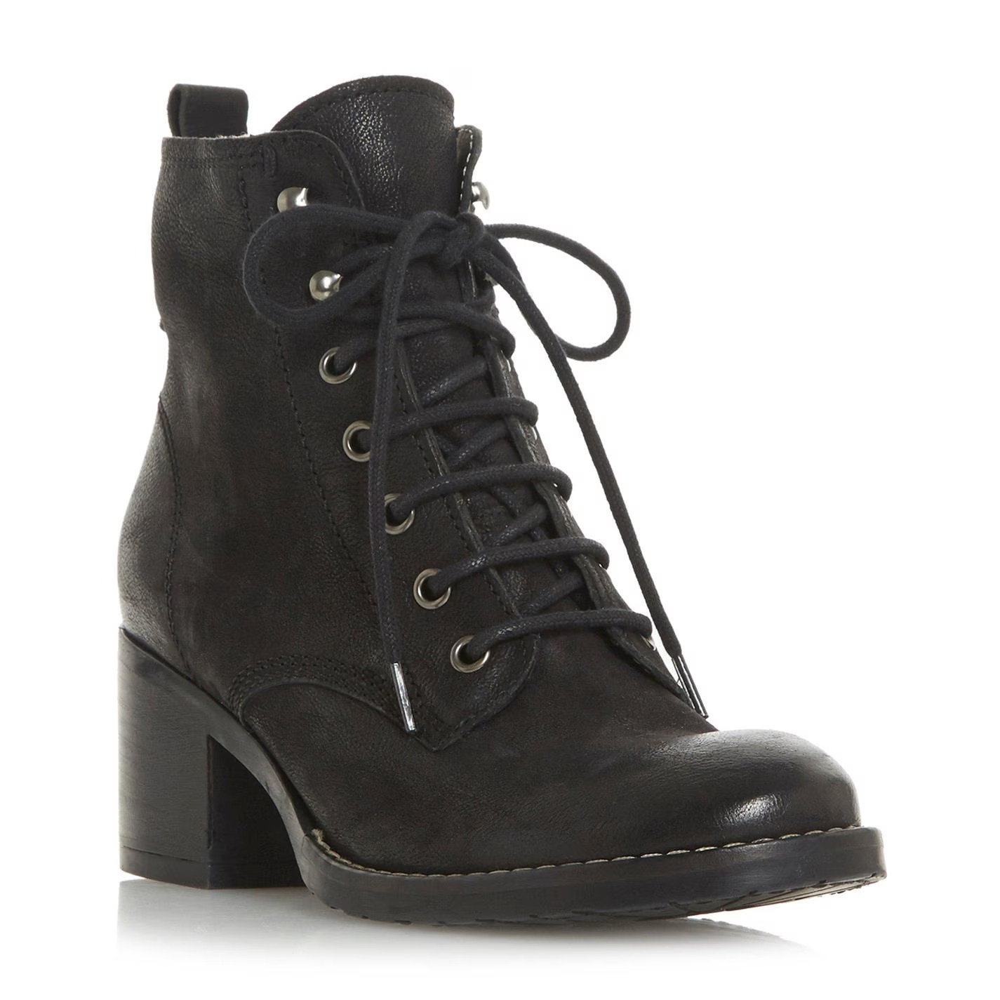

# January 2024

## Back home in Dénia

- I arrive home still high and euphoric after Christmas and New Year. 
- All the online interactions have made me think I have a boyfriend.
- Whenever I [Google search](#google-search-results-reinforce-the-idea-of-boyfriends) my own account or the `@jctot19` account, I see multiple references to boyfriends. 

!!! info "Disclaimer: and thoughts on what's really going on"
    - I don't really think I have a boyfriend, it's too absurd.
    - I know I'm being tricked online, but I can't seem to unhook myself from the relentless triggering.
    - It is post-after-post of meaningful words, phrases, and images related to the last year's activity.
    - Posts come from [multiple accounts I have never followed](#the-jackchardwood-x-feed-changes-completely), and often never see again.
    - On its own, I don't believe the online activity would be sufficient to maintain my interest, so I must have been ingesting mood-altering substances without my knowledge.
    - These two manipulation techniques meant that I could not think rationally about anything at all.
    - Whatever is triggering these beliefs is very powerful, and is connected to a daily overwhelming sexual arousal, something I did not experience before April 2023, and have not experienced since I left my apartment in October 2024.
    - I believe I was being drugged daily via the water coming into my apartment, tampered food and bathroom products, plus manipulation with online seduction techniques.
    - I still have multiple samples ready for inspection if anyone ever gets round to caring about the safety and wellbeing of children, women, and young girls living in the Spanish Valencian community.
    - I can't imagine how an inexperienced young girl or child could possibly survive a similarly vicious attack on the emotional and mental state.
    - I am convinced that such techniques have been used on children across the world by pornographers.
     
- I continue chatting with the [fake account that posted a picture of my hotel room](../2023/december.md#hotel-room-cyber-stalker).
- The content goes from Dénia specifics, and I've no doubt a man is speaking to me, to someone who is unusually delighted and claims to be a retired British lady in France showing me pictures of goats in her garden, and back and forth like this.
- I'm sure the account is either the trumpet teacher or someone close to him as they have information they could only know if they were involved in the crimes against me.
- Later, I wonder if the criminals have delegate access to accounts like these, which they can slip in and out of easily, with the owners full knowledge.
- The account states, again, that they're nervous they're *actually* talking to me instead of seeing me in the WhatsApp group.
- We chat.
- I'm sure it is the trumpet teacher. 
- He tells me he likes to paint but he hasn't painted for many years. 
- I ask him why not. 
- He doesn't say but it sounds like he had some sort of breakdown.
- I wonder if it is jail.
- I end up blocking the account because it's all just so weird; but I think if you believe the lie, even a tiny bit, they think they have a hold over you. 
- It's like if you talk to the Indian phone-scammer, even just a few words, they never leave you alone.
- I believed he loved me and wanted to communicate with me, a little.
- Don't we all want to be loved?
- Who wouldn't be influenced by feelings of love and a potential relationship with someone you believe you really like, even if it is manufactured and fake?
- Or did they set me up with someone they knew would be a perfect match? And someone who was more-or-less the same size and shape as the real monster?
- If true, how could they know that? Weird occultism or astrology, maybe?
- Did Christ the alchemist himself take over, [on request from us both, and more](https://www.biblegateway.com/passage/?search=matthew%2018:19-20&version=NIV#:~:text=19%20%E2%80%9CAgain%2C%20truly%20I%20tell%20you%20that%20if,in%20my%20name%2C%20there%20am%20I%20with%20them.%E2%80%9D)?

### The `@JackChardwood` X feed changes completely

- On my [`@JackChardwood`](https://x.com/JackChardwood) account, I have been seeing mostly rather dull content about crypto, tech, a bit of porn, and heaps of insipid Indian self-help accounts, motivational stuff. 
- It's really very boring.
- Suddenly, in early January 2024, my timeline changes completely.
- It's like I have a completely new account.
- I see masses of spiritual content, love and romance, boy meets girl, sexual innuendo, way more porn, nothing like I was seeing before.
- The fake accounts following me on this account reflect this too.
- It's so unusual I tweet about it.

- I mention it again in May 2024 suggesting what I'm seeing is all rather too much, which it is.

- I believe the hackers and honey-trappers start doubling down in January 2024, knowing that the conservatory have devised the [most outrageous psychological attack on me planned for March 12th](march.md#a-serious-attack-on-my-wellbeing-from-piano-teachers-at-denia-conservatory) which they must believe will certainly make me leave my studies, after which they can hand me over to the sex-gangs as was originally planned for [June 12th 2023](../2023/june.md#monday-12th-june-2023), but failed.
- Tired by their idiocy, the [staged event starring a woman dressed as Elaine Black](march.md#a-serious-attack-on-my-wellbeing-from-piano-teachers-at-denia-conservatory) just made me more disgusted with them, so they had to do even worse until I did leave Dénia for Madrid a couple of days later, terrified and terrorized.
- Once I had left the conservatory, teachers and staff must have felt relief that I had been finally handed over successfully to the porn gangs.
- I wonder how many other students have had similar experiences.
- The new content continues until I start writing my police statement in November 2024.
- At that time, 70% of the fake accounts following me on `@JackChardwood` disappear on one afternoon, and all activity drops off completely, never to start up again at the time of writing.

### Google search results reinforce the idea of boyfriends

- For a few weeks, every time I look, I see multiple posts about *boyfriends* on Google search results. 

- Like [tables](../2023/september.md#table) the year before, or [fridges](../2025/april.md#fridges) more recently, and the other continuously tailored Google search results, all I can see is a long list of various posts about boyfriends.
- I refer to this early in the month on X. Although I had been seeing content about *boyfriends* for some time already, this was exceptional.

- Many of the boyfriend-posts have the caption *I love my girlfriend*. This is so interesting I document it.

- How do they do it? I ask X.

- I mention how long I have seen manipulated Google search results.

- This post was quickly liked by a porn bot, another common trait of the cyber-stalkers. It's like I get an immediate agreement on any posts related to the stalking and abuse I was suffering.
- I didn't realize until [July 2024](july.md#evidence-of-mass-cyber-stalking-technology) that the cyber-stalkers had access to multiple fake, often but not always porn accounts; thousands of accounts that they could spin up in seconds.
- This is evidence of a seriously expensive and vast criminal software platform.
- Vulnerable targets whose phones have been accessed by criminals don't stand a chance, do they? 
- Significantly and ridiculously, the school board announced a *ban on all mobile phones* inside the conservatory building just after I had been terrorized into leaving due to being afraid for my life!
- I thought the Google search results might be done with cookies in the browser, but I checked with different browsers, different devices, and even someone else's device. 
- The results were the same as on my devices. 
- Of course, they may have hacked that young woman's phone too, anyone close to me probably which at that time was no-one uninvolved in the conspiracy.

## I see my naked 16-year-old body on X again

- Hackers flash up another example of the porn they have with me in it, made in 1989, where I am sedated and gang-raped by a group of predominantly black men somewhere near Tottenham, North London.
- Here's me happy-go-lucky, just a month or so before my life is destroyed completely and intentionally by Tottenham rape gangs.

- Unlike the previous example I had seen [flashed up to me on my X interface](../2023/november.md#first-time-they-flash-up-my-naked-16-year-old-body-on-x), where my body was in profile, this time I am looking down on myself from behind my head.
- I see my tiny, extremely pale, dappled even, naked child's body.
- I am on my back with my knees bent into a tiny ball, as before.
- I know exactly what the criminals of Dénia, including teachers and staff at the conservatory, have seen.
- The sickest thing is that they all know way more about what happened to me than I do!
- Yet after 35 years, I have an overwhelming sense of relief that I now know exactly what happened all those years ago, and why.
- My suspicions had been solid, all this time.
- I can only guess at how much money criminals made from these films, of which there were probably a few.
- Add to that the earnings that Dénia criminals were likely making on spy-cam porn of me in my apartment, and we are talking probably in the 10s of millions, owed to me personally, by criminal gangs in the UK and Spain, and the people and organizations that failed to stop it before it got incomprehensibly worse.
- Pervert gangs had been enriching their lives on mine and other children's suffering for decades; paying for their fast cars and flashy violent lives.
- Men and women continued to enjoy seeing me terrorized and abused, creating more suffering for me wherever they could, reminding me of what happened to me (things that I was unaware of) with words and symbols.

- Just like in London in 1989, after enduring a series of violent and sedated sexual assaults, those interested in protecting the rape gangs managed to persuade friends and family and community that I was the problem, that I was crazy and unhinged, and that I had deserved it somehow and certainly deserved to be treated like dirt from then on.
- It will be very interesting to find out exactly what has been said about me over the years, in the UK and Spain, and to figure out for what purpose.
- Undermining victims is an essential defense for criminal gangs if they ever see the inside of a police interrogation room, never mind courtroom.
- Typically everyone believes rapists over victims, although this is changing in some more evolved communities such as the UK hopefully.

## Menstruation

- I have a heavy period.
- I believe it is my last as I do not have one again.
- Eighteen-months later, when I'm safer and not being terrorized 24-hours a day, menstruation resumes.
- I believe it ceased due to the stress I was under.
- I believe the stress - in particular that caused by the relentless triggering around my experience of child sexual abuse - was intended to give me a nervous breakdown or lead me to suicide.
- I believe others, some of whom I know, have been led to extreme psycho-emotional unwellness or their deaths similarly.

## Galway, Ireland, TT

- I'm still extraordinarily high from Christmas.
- The non-stop euphoria and sexual arousal continues.
- I travel to Ireland on 10th January for my Transformational Touch therapy course.
- When I inform the choir teacher Salva I will be away, he says, "as long as you're not going away for the weekend with your boyfriend", referring to what Domingo had got [his student Elsa](../2023/october.md#gang-stalking-by-conservatory-civil-servants) to ask me previously concerning one of my tweets. 
- Salva says this every time I tell him I'm going to skip a class, and whenever else he gets the chance.
- After recent events in [Avila and Madrid](../2023/december.md#christmas), I'm convinced the trumpet teacher must want to communicate with me.
- When I'm in Ireland, I open an anonymous account on X on my mobile.
- I follow `@jctot19` on it, and post solely to my timeline without interacting with his account directly at all.

!!! tip "While drafting this section in November 2024..."
    - I see a post from 9th January which I wonder about.
    - When I read it, it seems like the `@jctot19` account might be finding ways to *get out of* what's been happening by pretending someone has been harassing him, i.e. me.

    

    - I only saw this post in November 2024 in Bangkok.
    - It is very curious that I did not see this post before, and that I did see the full thread originally including the replies from the other user `@LadyKilauea`.
    - When I read this in November 2024, still under the influence of something, I was upset.
    - The tone was outrageous actually. 
    - Draw a target in, again and again, drug and manipulate them online, then say they're harassing you!
    - Given we don't even know [who the trumpet teacher is](../../crimes/protagonists.md#vidal-sastre-sanchez-hornero), never mind who runs the `@jctot19` honey-trap account, that's quite a charge.
    - I wonder if this is how they defend themselves if a girl dares accuse them of sexual coercion/grooming and cyber-stalking, or anything at all.
    - Do these men say, *oh she was obsessed with me*.
    - Has that happened previously?
    - Well duh, yeah. You might well get obsessed with someone who drugs you and seduces you for sinister purposes. 
    - Isn't that the point?
    - Although, if the porn gangs set up a dummy love-interest, then maybe such a suggestion could be reasonable under those circumstances, albeit very unlikely and leaving too many more unanswered questions.
    - In a situation like my experiences at the conservatory, there's no way a dummy love-interest could not know what was going on. 
    - It appears the whole of the Marina Alta region of Spain knew what was going on!

- The first post I saw on his timeline, on 10th January, was an image of an angel climbing a ladder to heaven.

- It appeared to be a message to me, and gave me a loving feeling, so I continued posting.
- This, and a preponderance of the tweets I saw posted on this account throughout 2023 and 2024, have been deleted now.
- I posted about the transformational touch therapy protocol, and looked on his timeline for responses, as before.
- There was a to-and-fro, as before, all positive.
- After a day or two of this, however, the content starts to be interspersed with references to porn, specifically violent and humiliating porn; much of it containing unpleasant references to Ana Requena.
- I posted one tweet with a sexual connotation; *will you look me dead in the eyes?*.
- The account immediately reaches out to a random woman he hasn't seen in years with an anodyne tweet, now deleted.
- All communication ceased immediately from that moment.
- Did I surprise them?
- My tweet was a direct reference to Winston May; the rape-gang ring-leader from North London who I will see for the first time in over thirty years in [June 2024 while campaigning for the general election in the UK](june.md#winston-may).
- Winston May (who I detested when I was a child, by the way, but had totally controlled me) always looked me dead in the eyes while raping me.
- Given I was being triggered to remember events and instances from 1989, and [the trumpet teacher himself had reminded me of Winston May](../2023/september.md#alex-and-paul), it is unsurprising that odd memories like this *popped up* from time to time.
- This may well be in my statement to the police, but it is also possibly viewable in the porn.
- The other option is that the Spanish gangs spoke to Winston May about his sexual MO with vulnerable girls in order to use the information to terrorize me.
- It was as if I had turned the lights out with my statement. 
- There was no further interaction.
- I stopped communicating and deleted the twitter account.
- Did my words surprise whoever was running the account?
- The energy of the account owner was masculine and feminine over those days.
- If I had to guess, I would say that a very evil woman and a very sexually cruel man were managing the content together at that time.

### Flying back to Spain from Ireland

#### San Antonio and the cat

- After one of our transforming touch (TT) module sessions in Galway, Steve and I have a short chat.
- He remarks that he had been thinking of me a month before, on Saturday 14th December 2023.
- He had been in San Antonio, Texas, at his son's graduation ceremony.
- During or afterwards, they had gone to visit the shrine of Our Lady of Guadalupe; or they had been in the cathedral in San Antonio, I can't quite remember the details of where they went.
- Anyway, they were walking around and they saw a picture of Our Lady of Guadalupe.
- When Steve looked at it, he thought of me. 
- "Oh I'm thinking of Katharine," he said to his friend, something like this, again I can't quite remember.
- And then he looked and said, "what's that, is it a cat?"
- Here's the pic.

- He thought the angel holding the cloth beneath Our Lady was a cat.
- It was such a bizarre exchange, I ended up having to look it all up online later.
- I emailed Steve with the details.
- It turns out, it is not a cat at all, it's a man.
- It's Juan Diego.
- I sent Steve the results of my investigation.

- At this point, it is right and proper to say... Praise God in His Infinite Wisdom and Worldly Scheming that only the Fully Trusting could ever possibly understand.

#### Madrid airport

- While I'm emailing Steve on my mobile phone with the results of my investigation, I experience extreme activity online.
- Steve and I have a very loving, yet professional relationship.
- Nevertheless, whenever I finished an email to Steve with love while waiting for my flight to Valencia, I feel an intense jealousy, not from myself.
- When I get on the plane, I bang my head quite hard accidentally, except it doesn't seem accidental, and it didn't hurt at all.
- It felt intentional.
- I do not understand these thoughts and feelings, but I'm conscious that it is important to report them.

### The photographer

- When I get home, on my `@JackChardwood` feed, I see a photo of a woman swimming.
- The picture AI drew for me below is not quite right, but perhaps helpful.

- She has a camera in her hand.
- The person taking the photo is about twenty-feet down and looking up towards the surface where the woman is swimming.
- Her longish light-brown hair swirls outwards in the water.
- The sun shines through the top layer of the water but all around is darkness.
- I know that the woman is the same person who took the picture of the man swimming in the `@jctot19` profile.

- I have no idea why I know this.
- The feeling I have when I see the photo reminds me of the overwhelming feelings of love and romance that started up in [April 2023 or earlier](../2023/april.md#overwhelming-romantic-feelings).
- I also have a strong sensation that I own this woman. 
- I feel like she is mine to do whatever I want with.
- There is also a delighted sensation, like a tingling, that I am going to treat her badly and she won't be able to do anything about it.
- She reminds me a little bit of [Sylvie](../early-years/2015.md#greek-man-with-a-twitch-and-sylvie) but I don't see her face.
- I scroll away and when I go back to look at the photo again it is gone. 
- I never see it again.

### Therapy table

- I buy a therapy table with the intention of starting up a Transformational Touch (TT) trauma therapy practice in Dénia.

- Online in conversation with hackers, I mention that everyone might benefit from getting on my table.
- A post flashes up ***I'M NOT DOING THAT!!***, as if shouting.
- I realize later they are referring to the gang-rape on the table incident I had mentioned in [my police statement from 2015](../early-years/2015.md#statement-to-the-metropolitan-police) that Dénia terrorists had been trying to [remind me of at the beach](../2023/september.md#rape-gang-reminders), and on [Google search results](../2023/september.md#table) that showed only tables, and the [Carmen account mentioning tables](../2023/july.md#carmen) again and again.
- They had been triggering me online with the 'table' meme since at least August 2023, possibly before.
- I really had no idea what they were going on about, until [I saw myself in a still from child gang-rape porn](../2023/november.md#first-time-they-flash-up-my-naked-16-year-old-body-on-x) in November 2023, but even then I was not wholly certain about the table references.
- It's a curious irony that practitioners call the TT trauma therapy bed a table.
- It's an even more curious irony that someone, somewhere, attended TT therapy training with me. Every. Single. Session.

## Boots from Ireland

- I buy some expensive boots at [Brown Thomas](https://www.brownthomas.com/) in Galway.
- They're beautiful.

- I bring them home and put them on my shoe rack.
- A few days later I notice they are quite severely scuffed. 
- I never noticed this in the shop; in fact they were pristine when I tried them on.
- I hadn't even worn them once, so I contact the seller to complain.
- I assumed they'd given me an old pair from the back and I hadn't noticed because they were in the box already.
- I send pictures.
- I see that the boots are even more badly scuffed a year later when I pack them to leave in February 2024.
- I only wore them once for a couple of hours.
- They look like they've been worn a lot; it's very strange.

!!! danger "Evidence of people coming into my apartment?"
    - Looking back, I wonder if this sort of thing is to do with people entering my apartment without my knowledge whenever they got the chance to cause mischief, and add poison/drugs to my food and toiletries.
    - A similar thing happened with a pair of expensive jeans from El Corte Ingles in Zaragoza the year before.
    - It'd be interesting to know if anyone wore the boots out while I was away.
    - I certainly saw Carmen Cano outside the internal main door to my apartment block on 1 November 2024.
    - Could she and others have been coming in regularly; knowing, as they did, my location at any time?

## I buy an iPhone

- I take [my ex-colleague's advice](../2023/november.md#polygon) and buy an iPhone 14 in the hope it will impede hackers.
- Here's a copy of the [confirmation from Apple](../../content/documents/evidence/iphone-bill.png).
- Hackers enter my phone nearly immediately; I assume via my home network.
- I know this from fake account profile messages which match conversations I have had during the day, from clear evidence stalkers know exactly where I'm going to be at any given moment, and from my feeling that the threat level is increasing, online and in-person.

## Ana and Ana

- Ana Girbes starts taking a more central role in the bullying at the conservatory. 
- She makes herself visible to me whenever I come into class. 
- She seems to be waiting for me; at her door, or by reception, or even outside the toilet when I come out so she can "bump" into me and say something unpleasant.
- She glares at me furiously whenever I see her.
- I have no idea why. 
- As with everything else, there's no reasonable explanation for her bizarre and unpleasant behavior.
- I'm also still seeing the Ana Girbes transformer figure online on the `@jctot19 x` Google search.

- I wonder who else saw the pic. It was an exceptional likeness.
- One evening, Ana Girbes is waiting for me as I come out of the toilets.
- She barks something as she walks past me.
- It is a derogatory statement about a private urinary health matter I have *only ever told Google search*.

!!! tip "Private health concerns"
    - There is no way *anyone* could have known about the very private health issue I was suffering unless they had seen my online Google search activity.
    - I only ever told Google search, no-one else.
    - I never wrote about it, publicly or privately.
    - Ana Girbes either had access to my online activity herself, or someone was telling her what to say to me with the intention of terrorizing me by making me realize I had no privacy at all, even when it came to extremely personal health matters.
    - Interestingly, I only suffered this particular health symptom while I was being poisoned and drugged; so all throughout my time at Carrer Furs and when I was traveling during that time and was still ingesting something that had been added to bathroom products or health supplements.
    - At the time of writing, and since a recent colonic fast and detox undertaken in early June 2025, this symptom that suggests weak or damaged kidneys and urinary issues has disappeared completely!

- Ana Girbes and Ana Requena create highly suggestive choreographed routines designed to make me anxious and stressed, and this goes on way into March.
- They are always glaring at me furiously, but they never say a word.
- The implication is that Ana Requena is furious at me for *being in love* with the trumpet teacher who is her boyfriend. 
- This story is reinforced heavily online via my X feed and Google searches, and they even start suggesting she is pregnant by him.
- On one occasion during the month of January, they both change their demeanor completely.
- They smile sweetly at me instead, and never say anything.
- This changes back to feigned and intense fury the next time I go in.

!!! danger "More reenactments coming directly from information in my statement to the Metropolitan police"
    - Curiously, this was also part of my [child sexual abuse statement to the police](../early-years/2015.md#statement-to-the-metropolitan-police).
    - I described in detail what the pedophile had done to terrorize me and make me too afraid to say no to him.
    - One of those things was that he would be furiously angry with me, and then be kind, and then be angry again, and repeat this process; sometimes these changes happened in seconds.
    - The angry times included violent threats to my life.
    - This psychological destabilizing technique was devastating to my child's mind and emotional stability, and my body still can react to this sort of thing, even though inside I'm relatively calm.
    - Ironically, after suffering like this at the hands of teachers and staff at the conservatory, a lot of my PTSD reactions have disappeared.
    - At the time, however, my arms started to feel weak whenever I was around Ana and Ana, it's like I could not use them effectively, they hung off me, heavy, sore and achy.
    - This was a PTSD reaction coming from being held down sedated and got decidedly worse over the next months.

- Paqui Fornet would then reinforce their behavior towards me, as if it was justified, with an off the cuff remark at my piano class such as:
    - "Oh you never stop chasing another women's man do you", referring to me taking Ana's boyfriend! 
    - "You're a grass total", referring to me cataloguing any events at the conservatory on my X feed, perhaps sometimes that involving things she had said or done. 
    - "It's what the men do", referring to the overwhelming stress I am under, and other similarly triggering statements.
- I'd just like to take a moment to remind everyone at this point that these women are teachers in a public school with temporary-guardianship responsibility over many hundreds of children.

## I tell Paqui I'm being terrorized by teachers and staff at the conservatory

- At one of my piano classes, I tell Paqui Fornet, my piano teacher, that Domingo Cano and his associates are terrorizing me and have been terrorizing me since [June 12th 2023](../2023/june.md#monday-12th-june-2023).
- It was just before a piano concert at the social centre in Dénia in January 2024.
- The students of the conservatory are usually invited to such concerts. 
- Paqui had asked me if I was going to attend.
- I asked her if it was safe for me to go.
- She seemed alarmed at my question, which is when I told her I was being terrorized by the conservatory men, Domingo and others.
- I believed I could trust her at that point, at least a little bit.
- She didn't reply apart from saying that it would be safe for me to go to the concert.
- I had no idea she was 100% involved; a ringleader in fact.
- She had no further interest in finding out more about what I had told her.

### The concert

- I do go to the piano concert at the social centre, I believe the next day.
- I wait in line for the tickets. 
- I see Ana, Paqui, and a number of people I know from the conservatory.
- They whisper to each other, look at me, and even point sometimes.
- People I don't know laugh jeeringly behind me.
- No-one talks to me, or even acknowledges me.
- Even the students have stopped talking to me.
- I sit on my own upstairs, far away from everyone.

- Teachers and staff stare at me horribly; they do not return my smiles and waves, Paqui included.
- It's all very threatening.
- The constant stress and tension of being bullied and terrorized around the clock has started to take its toll on my health and wellbeing.

## Conservatory men

- The weird guy who may be an engineer is always at the conservatory, quite often waiting at the door as I arrive with someone else.
- One evening, I pass him on the stairs. As I do, I smile at him. His face flashes fear. I tweet about it: https://x.com/1FRGVN/status/1747791280803815621.

## Fake accounts reference payments

- I sent a financial a gift to my monk friend for Christmas.
- Fake accounts post the amount to me, while in the middle of a chat with a [stalker account about "pandas"](march.md#thursday-7th-march), which I know is how they reference my Tibetan monk friend.

## Nacho says sorry

- The French horn player (an adult student) from choir class follows me out one evening to assess my reaction to Nacho when I see him.
- She sees me grimace when I see him, she looks satisfied, and walks off.
- A few mornings later, when I'm practicing, Nacho pops his head into my room and says sorry and then disappears again.
- I find it very weird and tweet about it. Something banal like, "hmm interesting", but they will know what I was referring to.
- The next choir class, Nacho continues to be part of the bullying and threats. 
- I see him interacting with all the young girls (Domingo's students) after class, and they're all saying "coffee" really loudly as he asks them if they'll "go for a coffee".
- I ask Samuel what's going on, why are they saying "coffee" loudly, and he says, oh it's just a game.

## Nacho follows me around town

- One Saturday, I need to run some errands in Dénia.
- Nacho is always there, wherever I am, walking by in view.
- He's following me, trying to upset me.
- I smile and laugh at him. He looks embarrassed.
- Nevertheless, I'm stressed and anxious about this.

## Threatening men outside

- On January 16th I'm coming back from practicing the piano.
- There is a car outside my building where I'm walking and there are two men in the car glaring at me angrily: https://x.com/1FRGVN/status/1747283258092425350.
- As I walk past them, they make the engine scream and howl, before speeding off, the tyres screechings.
- I recognize one as a man who had fixed my car back in 2013 who worked at the garage near my old flat. He had help me replace a flat battery.

## Constant threat

- In general, the threat level is growing in the town, at the conservatory, and online. 
- No one speaks to me, at all, but they are all extremely busy choreographing ridiculous "moments" which will "make me think" something about something.
- I'm becoming extremely anxious.
- It's getting difficult to perform simple tasks normally. I need extra effort for things I usually don't think about.
- My mind is constantly filled with concerns about what's going on.
- I now wonder if I was being spiked by something anxiety-forming at this time but perhaps the behavior of teachers, staff, and students at the conservatory during this period is enough to explain the anxiety I'm feeling.
- This anxiety grows until, probably, June when I'm in Lourdes and then head back to the UK for a few weeks. From February to May it is overwhelming. It is still not nearly as bad as the anxiety I experienced after reporting child sexual abuse to the police, however.
- Everything that's going on is extraordinarily evil and I can hardly believe it.
- I often wonder how many others have been targets like me. Undoubtedly loads. I wonder as well how many of those targets ended up in prostitution or porn, and if they were targeted as minors, or if they ended up having nervous breakdowns or killing themselves. I can't help but think about Elaine.

## Dick pics from the choir master

- The evening after my first choir class in September 2023, on Twitter, an [account named Salva, posted a dick pic](../2023/september.md#choir).
- I mention [dick pics on Twitter on 17th January 2024](https://x.com/search?q=dick%20pic%20(from%3A1frgvn)&src=typed_query&f=live) right before choir class.
- About half an hour into the class, Salva's WhatsApp beeps, and he takes out his phone to look at his messages.
- Suddenly, he's enraged. 
- He makes a dreadful fool of himself by talking about terrible things that happen to people to all the children.
- The children get really animated and excited. 
- I'm paraphrasing and misquoting, but the gist was there was someone in a class one time, who thought they were a spiritual mystic but were in fact psychotic and mentally ill. They brought a knife in to class and stabbed everyone. He may have even mentioned horrible details about cutting body parts off people. It was unbelievable.
- I was utterly appalled at his behavior in class. So was Samuel. 
- I mentioned to Samuel that Salva clearly didn't want his students to come back the following week.
- Salva had said things that would make parents stop their children coming to his class, if they knew he was like that.
- Someone unknown had sent him a link to my posts at that moment, for a joke, and, due to the guilt, he became uncontrollably enraged.

## January 18th correspondence to Katia and the Generalitat

- I've convinced myself the women can't be involved, they must be being lied to by the men.
- Yet, as well as the two Ana's, Katia the singer is also ridiculously angry with me in my chamber music class.
- I'm worn down, and I feel it is all very unfair. 
- Katia gives me her mobile number at some point.
- I can't believe the women could all be involved and I try to reach out to them.
- I [text Katia](../../content/whatsapps/text-to-katia.pdf). 
- Katia does not reply or even mention the text when I see her next at class. 
- Instead, she looks at me and says something like, "oh you are the best", in a weird way, and that's that.
- I also [email the Generalitat again](../../content/documents/emails/jan-18-email-to-GV.png) that day with an update of what's going on.
- The Generalitat reply to tell me they have transferred the matter to the Alicante office. 
- I have to ask them to give me a contact there.
- They're fobbing me off. 
- It's 3 months since I wrote the [original letter of complaint](../../content/documents/letters/3.%20Letter%20to%20Generalitat%20of%2022%20October%2023%20-%20ES.pdf) to which I never received any reply.
- I mention buying a new phone in the email to the Generalitat, which I did, which was expensive, an iPhone 14 as suggested by someone at work. They hacked into it pretty much immediately.

### Domingo demonstrates his control of women again

- The following day, I'm going to practice the piano at the conservatory.
- As I'm going up the stairs, Domingo is coming down the stairs and he's sort of behind and semi-forcing this woman down along with him at his pace, like frogmarching. They are closely connected.
- It reminds me of how the man forces [the woman in the tunnel](../2023/november.md#tonya) along whenever I see them.
- The woman looks mix-raced and I wonder if she is the German ex-girlfriend he mentioned back in 2014 although I would have expected her to be older, maybe.
- It's a demonstration for my benefit. I'm not impressed.

### Forwarded to Christine BJ

- I don't trust the Generalitat anymore but I know how important to have documented proof of what's going on.
- I forward [every communication I send to the GV to Christine](../../content/documents/emails/Screenshot%202024-02-20%20at%2008.48.40.png).

## Twitter

### @1frgvn

There's a lot of confirmation of what I have been saying here in these tweets. It's like I had time to breathe and assess things in the second half of this month. Did they stop spiking me/and manipulating me online temporarily?

Earlier in the month I remain exuberant and there are lots of deleted tweets, and suspended and deleted accounts involved.

- https://x.com/1FRGVN/status/1752602299803783584 -> talking about the smile of the trumpet teacher in Benijembla and class.
- https://x.com/1FRGVN/status/1752342228465262902 -> in reference to the sad woman at Benijembla.
- https://x.com/1FRGVN/status/1752340257280815497 -> declaring love again (under extreme manipulation of course).
- https://x.com/1FRGVN/status/1752243357399634152 -> mentioning threats.
- https://x.com/1FRGVN/status/1751698770314535410
- https://x.com/1FRGVN/status/1751679949734334725
- https://x.com/1FRGVN/status/1751332834835329038
- https://x.com/1FRGVN/status/1751275593352491469 -> stalker account `@1Loviatar` pretending they're my friend.
- https://x.com/1FRGVN/status/1751211014308139309 -> mentioning the "most brutal of wind ups the world has ever known". Do I think it's over at this point?
- https://x.com/1FRGVN/status/1751185092020519333 -> mentioning no depression to another stalker account `@Lucyinbetween`.
- https://x.com/1FRGVN/status/1751152861390467073 -> wondering about how many kids (conservatory students) have suffered the same as me.
- https://x.com/1FRGVN/status/1751146570521731402 -> all stalker-related content goes into Highlights.
- https://x.com/1FRGVN/status/1751145935646621796 -> stalker account `@AIinAmerica`. This one posted the boy that even today comes up first on Google searches. I'm supposed to think it's the trumpet teacher as a young man. I don't. In fact, I think I saw the actual man this is a picture of on the Las Marinas beach in October 2024.

- https://x.com/1FRGVN/status/1751135469306302843 -> unblocking Matthew account. I must be triggered again.
- https://x.com/1FRGVN/status/1751134068182339603 -> thinking the trumpet teacher is on my side again.
- https://x.com/1FRGVN/status/1750917987983294535 -> feeling like they're leaving me alone.
- https://x.com/1FRGVN/status/1750805760131436689 -> the crux of the matter?
- https://x.com/1FRGVN/status/1750625565168533819 -> has the spiking stopped/paused? Some reaction to this post, I wonder if this is when they posted a horror face picture directly in the middle of my screen.
- https://x.com/1FRGVN/status/1750530601487385009
- https://x.com/1FRGVN/status/1750526658594111715
- https://x.com/1FRGVN/status/1750178193963671859
- https://x.com/1FRGVN/status/1750258545382007014 -> stalker account weird tweet.
- https://x.com/1FRGVN/status/1749706361003262351
- https://x.com/1FRGVN/status/1748699479916572952 -> asking stalkers why no one talks to me.
- https://x.com/1FRGVN/status/1748651089568686511 -> summary of stalking experiences.
- https://x.com/1FRGVN/status/1748925404079956427 -> trying to communicate back cos everyone is treating me so badly. In response to Ana Requena and Ana Girbes tormenting me.
- https://x.com/1FRGVN/status/1748728422262546895 -> commenting on how once I had posted the screenshot of my bum, they removed it from the search results the following day.
- https://x.com/1FRGVN/status/1748707659014873275 -> always trying to communicate, this is a long convo.
- https://x.com/1FRGVN/status/1748690428814033168
- https://x.com/1FRGVN/status/1748661477542695104
- https://x.com/1FRGVN/status/1748658865330086076
- https://x.com/1FRGVN/status/1748658865330086076
- https://x.com/1FRGVN/status/1748653573347360955 -> mentioning the gypsies serenading me in the tunnel.
- https://x.com/1FRGVN/status/1748498545664016638 -> communicating with stalkers.
- https://x.com/Cult_De_Plucker -> major stalker account.
- https://x.com/search?q=(from%3ACult_De_Plucker)%20(to%3A1frgvn)&src=typed_query&f=live -> suspect this is Hazel.
- https://x.com/1FRGVN/status/1748493771837165912 -> commenting on how the overwhelming sexual arousal concerns me.
- https://x.com/1FRGVN/status/1748493251663761694 -> mentioning the Google search manipulation technique.
- https://x.com/1FRGVN/status/1748490081936003127 -> mentioning the men on the beach making porn noises and touching themselves as I walked by.
- https://x.com/1FRGVN/status/1748486972664946749
- https://x.com/1FRGVN/status/1748470435165987252 -> I think my browser caches might well be extremely interesting if someone unbiased could have a look at them.
- https://x.com/1FRGVN/status/1748281008422584715
- https://x.com/1FRGVN/status/1747792341992190029 -> hacking link?
- https://x.com/1FRGVN/status/1747717880903254325
- https://x.com/1FRGVN/status/1747575884947530204 -> ironically something I mentioned in my csa statement from 2015.
- https://x.com/1FRGVN/status/1747527940173082745 -> Ana Requena had smiled at me sweetly that day as I was leaving the conservatory. As you will see above, it changed to anger the following time I bumped into her, those times no one ever talked.
- https://x.com/1FRGVN/status/1747287478535442834
- https://x.com/1FRGVN/status/1747193607017177422 -> if they can take the piss, so can I.
- https://x.com/1FRGVN/status/1747003108067049819 -> more piss taking.
- https://x.com/1FRGVN/status/1746989463228596549 -> in response to the boyfriend/girlfriend images on Google search which are very numerous at this point.
- https://x.com/1FRGVN/status/1746828429746405782
- https://x.com/1FRGVN/status/1743914743172063303 -> still high and exuberant.
- https://x.com/1FRGVN/status/1742989177572987180 -> I believe, erroneously the trumpet teacher is trying to communicate. I think it only really works when they're spiking me at the same time.
- https://x.com/1FRGVN/status/1742137652537589965 -> stalkers responding to a poll.
- https://x.com/15john23 -> stalker account.
- https://x.com/1FRGVN/status/1741874776811950580
- https://x.com/1FRGVN/status/1741866348777472360 -> seeing the good in the monstrous.
- https://x.com/1FRGVN/status/1741864932839133252
- https://x.com/1FRGVN/status/1741842106937663832 -> 2012 might have been the first year I went to the international choir.
- https://x.com/1FRGVN/status/1741738099439259731
- https://x.com/1FRGVN/status/1741728804320526343
- https://x.com/1FRGVN/status/1741644588207439970 -> I really did not get the Alicante airport visit until November 2024.

### @JackChardwood

A lot of messages are in reply to an actual tweet but they're replying to something, deleted posts and/or accounts usually.

- https://x.com/JackChardwood/status/1748769496926494944
- https://x.com/JackChardwood/status/1747256644218892584 -> replying to some fake account message.
- https://x.com/JackChardwood/status/1747244233944092861 -> replying to some fake account message.
- https://x.com/JackChardwood/status/1743984054964252990 -> I wonder about these long sleeps now.