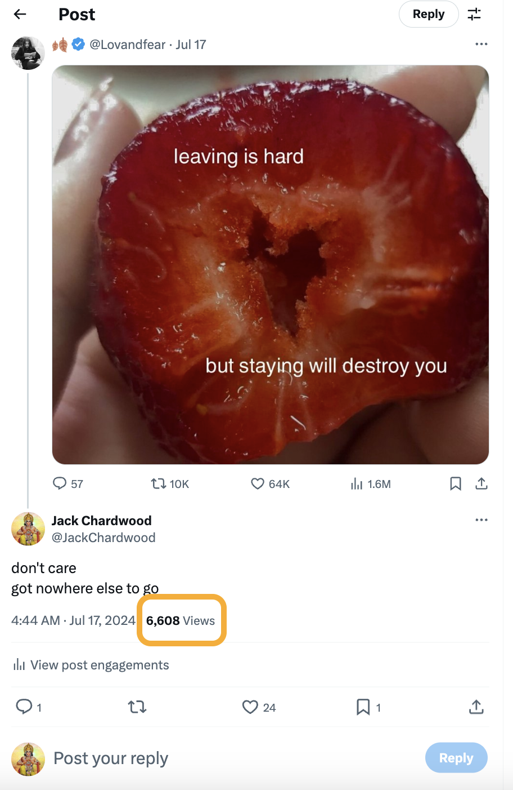
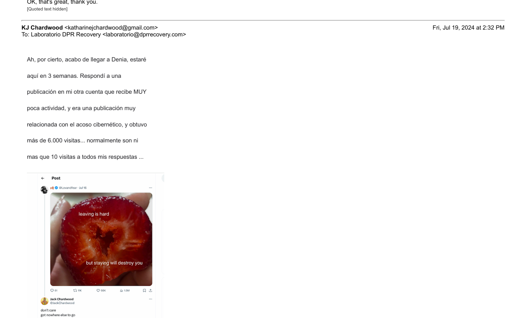
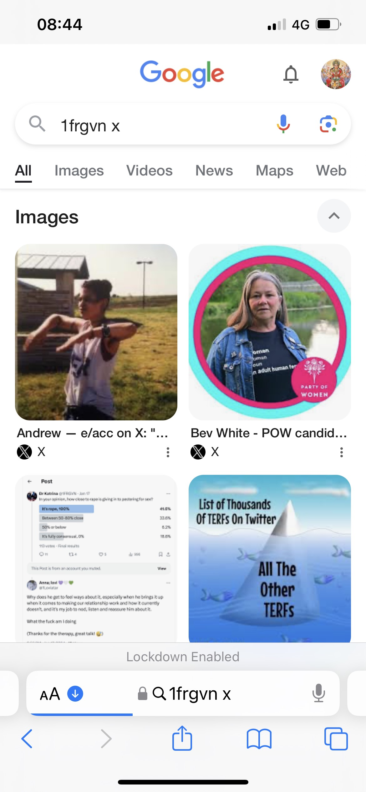

# July 2024

## EthCC

- I travel from London to Brussels to attend a crypto conference, [EthCC](https://ethcc.io/), as part of my role with [Polygon Labs](https://polygon.technology/about).
- I'm in Belgium till the 11th July, after which I return to London on the train and take the boat from Portsmouth to Bilbao and then drive home to Dénia.

### European Court of Human Rights

- In my hotel room, on my work laptop, away from my hacked home networks in Spain and North London, I'm finally able to access the ECHR website.
- Remember, in February I tried to contact the [European Court of Human Rights](february.md#european-court-of-human-rights) and was immediately blocked from doing so, then teased relentlessly online for having tried to do so.
- In Belgium, I'm able to find an easy way to report what is going on for me on the ECHR website and I write to them on my work laptop.
- I tell them I'm being terrorized in a public school in Spain and the Spanish school board appears to be complicit.
- I tell them my serious concerns about the safety of children at the school.
- I tell them I have been hacked and persecuted by people in the town.
- Like everyone else, the ECHR refuses to help me and fobs me off.
- I receive a response in early August to my letter.
    - [Receipt of sending from European Commission website](../../content/documents/evidence/eu-complaint.png).
    - [Response from ECHR to letter written in Brussels on 8th July](../../content/documents/evidence/ARES%202024_5484609.pdf).

### Mushroom man says sorry

- At the [Belgian crypto conference](https://ethglobal.com/events/brussels) mushroom man apologizes to me for saying something out of order in Bali.
- It must have been when he [met me in the morning to distract me before the Indian (he said Pakistani but I'm not convinced) guy could introduce himself](may.md#the-pakistani-yorkshire-man).
- Or, I wonder if he was apologizing for when he, Ajay, and Alicia and their respective teams were instructed to perform a military coup on my role in March.
- He's left mushroom man cards all over the conference, they're everywhere.
- I laugh with him about his cards.
- He's a fat boy and in his profile pic at Polygon he's dressed as a mushroom.
- When he and Jaime Lalinde met in March 2024 while the military coup on my job was going on, I was making tea and listening while they spoke endlessly about mushrooms and hallucinogens which, frankly, I thought was a little inappropriate at work.
- Did mushroom man know I was being drugged at home?
- I told him in Belgium that I was open to hallucinogenic plants, but for healing purposes only.
- I explained that I believe it is not a good idea to misuse a powerful living being such as a healing plant for any reason at all, and the karma can be immense.

### Meeting a weird guy

- Hassan maybe? Something Islamic for sure.
- This guy bumps into me, he's the only person who talks to me at EthCC.
- I'm having a burger for lunch at the burger bar, and he asks to join me I say yes.
- He's tall, dark-skinned, black curly hair.
- He gives me his card.
- He has an Islamic name I can't remember.
- He says he's looking for a technical writer and he has a crypto business in Alicante.
- He has a brown coat and is using a stick to walk.
- At one point in our conversation I ask him if he's a religious man.
- He gets scared.
- I think it's cos he's Islamic and they don't like talking to women about religion.
- Now, I'm not so sure.

### Gabriel Silva is given my role at Polygon

- While at the conference, a number of things happen.
- I discuss again with Miriam about what's being going on.
- Miriam, you may remember, is the [Spanish HR rep](may.md#bali) who I reported sexual harassment to.
- I say something has to happen, I'd like to step down from the role, it's too stressful, everyone hates me, no work is getting done, I can't manage a team of people who refuse to talk to me.
- She speaks to me like I'm dirt on her shoe.
- *What game are you playing*, she asks me when I say my team is subordinate.
- Someone has been telling lies about me, it's obvious.
- A day later, Paul tells me they've decided that Gabriel Silva is going to take over my role.
- He is going to be getting married but when he's back he'll be the team manager.
- I'm relieved.
- I don't think Gabriel Silva is part of any concerted efforts against me at that time.

#### Dreaming of Gabriel

- While Gabriel is getting married, I dream about him.
- It's a weird dream and feels like I'm in his head.
- He is with his wife on their wedding night.
- He is standing at the bottom of the bed wearing nothing but a baseball cap.
- He has an erection and he is swinging his penis from side to side.
- He then jumps up onto the bed and moves towards her.
- I wake up and feel quite unwell.
- I've no idea why I might be dreaming about that.

### Hacking expert

- Says he'll help me.
- Then says it'll cost £2000.

### Pig butchers and crypto-transaction tracking

- Very interesting talk.

### Meeting my Belgian friend

- WIP

## Evidence of mass cyber-stalking technology, or something more sinister

- I'm back in Dénia on 15th July. 
- I was not sexually aroused at all while away.
- After a couple of days back in Dénia, the sexual arousal starts up again.
- Moreover, communication with the hackers begins again in earnest.
- It starts in a very interesting way.
- A post comes up on my `@JackChardwood` account referencing [*strawberries*](../2023/october.md#strawberries) on July 17th, and something about staying or leaving. 
- Readers will remember the importance of [*strawberries*](../2023/october.md#strawberries) and the incident from [October 2023](../2023/october.md#strawberries).
- It also reads like a direct threat to me if I stay.
- I like the post and say something about how I won't be leaving as I've nowhere else to go.
- Suddenly, literally within minutes, 1000s of accounts view this post.

- This is extraordinary.
- I've never seen anything like it on my JC account which gets no views at all usually.
- And for this to happen on a tweet about [*strawberries*](../2023/october.md#strawberries).
- At the time, it appeared to me that the cyber-stalkers/hackers have technology that can generate this sort of intense activity on X at the drop of a hat. 
- I thought about it. It must be expensive technology. 
- Why would they be using such technology, such resources, to terrorize a lone and vulnerable foreign woman in Dénia? It didn't make any sense.
- However, if I was actually *already* very famous on spy-cam and sedated *switcheroo* porn networks, amongst others, something even my colleagues at Polygon may have been aware of and subscribing to, this random one-off event makes a lot of sense.
- Were these 1000s of accounts actually owned by real human porn-addict men?
- I tell my friend in Madrid (who doesn't seem to understand what I'm saying) and the expert in Alicante.
- I explain the situation very clearly to the expert, with screenshots:

- See the whole [email thread to the perito](../../content/documents/evidence/comms-with-perito.pdf).
- I never hear anything back from the expert in Alicante about this, or anything else.
- My friend phones him repeatedly for updates while the receptionist fobs her off.

## Texting Knowhere about the Russian or Ukrainian brutes

- I WhatsApp Knowhere.
- I added the info [here](../../evidence/whatsapps.md#asking-knowhere-if-they-have-security-cameras) but will edit back into here.

## Texting with Sandra Diaz

- I text Sandra Diaz during this time.
- She triggers the memory of [praying the rosary with the trumpet teacher](may.md#madrid) in Madrid.
- I mention this to her.
- She's done her job.

## Sexual arousal

- During the time I am back in Dénia over this month I am extraordinarily sexually aroused and masturbate often.
- Hackers post images with people in the same position I might have been while masturbating.
- Something was making me open my mouth and tilt my head back if I was in the bathroom, I have no idea what.
- I would masturbate under my covers in my bedroom, and after that I would see posts of people with their heads covered in blankets.

## Zoe and the transvestite

- I "bump" into [Zoe](../early-years/2008.md#zoe) on the Calle Diana.
- Zoe, who I now believe has been called in to talk to me; perhaps to see how I'm doing and report back on my state of mind.
- She is with a transvestite.
- It's meant to destabilize me.
- I shake his hand.
- We talk.
- It's friendly. I'm delighted to hear the little dog they had, Lola, is still alive. She was wonderful.
- Zoe tells me about her younger daughter who is doing very well by all accounts. She says nothing about the older daughter, and I sense a shadow.
- I explain to her what the people at the conservatory did, in brief because she is not asking for more information, and she is not interested at all in the way she normally would be in a story like this.
- When I mention someone dressing up as Lorraine Blackbourn at the piano concert in March, Zoe looks alarmed, scared even, but doesn't follow up.
- Zoe tells me she has been going to the police to translate for a woman in Ondara or Pedgreguer who is being terrorized by her neighbors who keep slipping nasty notes under her door.
- I ask her if the woman is foreign. She says yes, Dutch. I say it's always the same isn't it. She doesn't respond.
- I believe Zoe knows exactly what happened to Lorraine; perhaps everyone does.
- Does no-one talk because they were recruited by Hazel Smith years before and are therefore implicated?

### The running girl

- I continue on with my chores. 
- I think I needed to go to the post office after buying vegetables.
- I see a woman, anxious and stressed, constantly looking at her phone, running here and there.
- I know they're showing me her.
- Another target.
- She's dressed a little bit like a cheap porn star.
- She's tall, heavily made up, dark skinned, long black straightened hair, and she's wearing a skimpy dress and massive platform boots.
- She checks her phone, sighs anxiously again, and runs off.
- Another foreigner, I guess.
- Anyone born in the region, or having family there, will likely know what's going on and who is involved; that's why they go for newcomers mostly.

## Big chat with the hacker begins

- A conversation begins with the hacker(s) at that point which goes on all summer.
- We talk via my Twitter account's profile message, and they response to me in fake account profile messages.
- Here's an example of how I might ask them something.

- And here's an example of how they might reply.

- The conversation starts with me being astonished at the level of technology the hacker has at his fingertips. I realize it's his job.
- He confirms this.
- He says he wasn't expecting me to run for election.
- I believe I'm talking to the trumpet teacher still, or someone close to him.
- I joke about "whipping them up into a frenzy" and post tweets saying we're going for coffee and such like.
- He replies he never goes out but I say I'm just messing with them.
- I use this phrase from time to time: https://x.com/1FRGVN/status/1779265814186610831 as it references the way Domingo is somehow able to get the little girls all excited and nervous, giggly and embarrassed around him.
- Down at the beach, young men come up to me and make references to coffee.
- In this unusual way, we chat about things that have happened between us, that no one could know unless he told them, or is telling them; private looks we made to each other for example. I'm sure it's the trumpet teacher.
- I feel extremely sexually aroused these last two weeks in July before I leave for Lourdes.
- It's important to note that I felt no sexual arousal while I was away, it's only when I come back to Dénia and stay in my flat that this begins again.
- I don't go out much now as it feels so dangerous but I try to go to the beach in the afternoon as there are a lot of people there, tourists.
- I wear my hiker's camera on these outings.
- I masturbate and sometimes it feels like the trumpet teacher is in my head while this is happening. 
- Comments on fake accounts talk about things that have happened with regards to my sexual arousal which people could *only* know if there were hidden cameras in my apartment.

## I see Mercedes in the Carrefour

- I go to the Carrefour and Mercedes is behind me in the queue.
- She looks ashamed.
- I put my thumbs up to the cashier who laughs.

## Google search

- The Ana pic comes up a lot on Google search.
- This was posted the day Ana Girbes became enraged at me and shouted about my private health matter than only someone who had access to my laptop could possibly know about.

