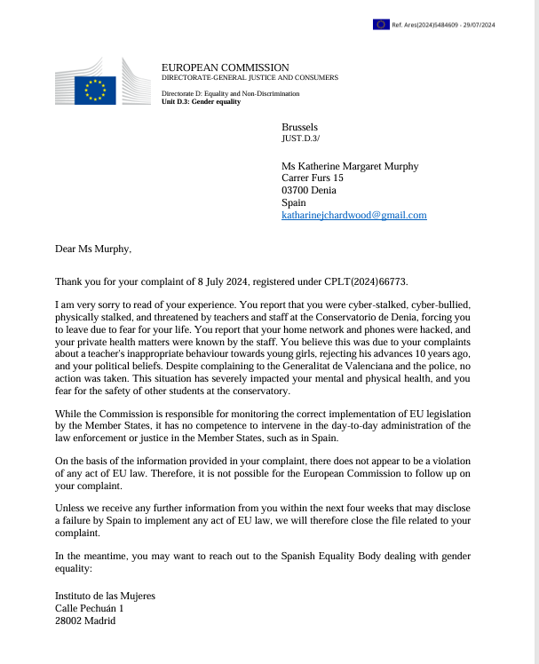
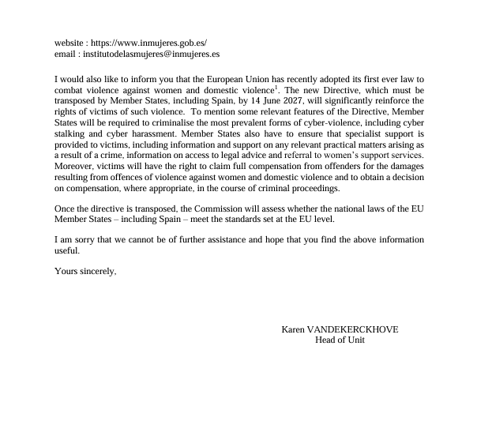

# July 2024

## EthCC

- I travel from London to Brussels to attend a crypto conference, [EthCC](https://ethcc.io/), as part of my role with [Polygon Labs](https://polygon.technology/about).
- I'm in Belgium till the 11th July, after which I return to London on the train and take the boat from Portsmouth to Bilbao and then I drive home to Dénia.

### European Court of Human Rights

- In my hotel room, on my work laptop, away from my hacked home networks in Spain and North London, I'm finally able to access the ECHR website.
- Remember, in February I tried to contact the [European Court of Human Rights](february.md#european-court-of-human-rights) and was immediately blocked from doing so, then teased relentlessly online for having tried to do so.
- In Belgium, I'm able to easily find a way to report what is going on for me to the European Commission and I write to them on my work laptop: [receipt from the European Commission website](../../content/documents/evidence/eu-complaint.png).

- I tell them I'm being terrorized in a public music school in Spain by teachers and staff, that the conservatory system is funded by European grants, and that the Spanish school board appears to be complicit.
- I tell them my serious concerns about the safety of children at the school.
- I tell them I made numerous complaints to the school board.
- I tell them I have been hacked and persecuted by people in the town.
- I tell them I have been to the Spanish police twice and ignored.
- Like everyone else, the commission refuses to help me, and fobs me off saying no law has been broken!
- I receive a response in early August to my letter.
    
    

- I take their advice and write numerous letters to the [Spanish government organization](https://www.inmujeres.gob.es/) they suggest I contact, to which I never receive a reply.
- I see now that, along with the police and the Generalitat, the European Commission gives British and Spanish criminal porn gangs the all clear to carry on doing whatever they like to children in the Spanish school system, and make a horrible example of me at the same time; someone who dared speak up about how criminal porn-gangs control schools in Spain, countrywide probably.

### Mushroom man says sorry

- At a Polygon evening event - part of the [EthCC conference in Brussels](https://ethglobal.com/events/brussels) - mushroom man, Hudson Jameson, apologizes to me for something he said in Bali.
- He won't tell me what it was though.
- I assume he is talking about when he [met me in the morning to distract me before the Indian (he said Pakistani but I'm not convinced) guy that looked like Jitendra Das could introduce himself](may.md#the-pakistani-yorkshire-man).
- Or, I wonder if he was apologizing for when [he, Ajay, Aman, and Alicia](may.md#ajay-alicia-aman-pandey-and-mushroom-man-perform-a-military-coup-on-my-job) and their respective teams performed a military coup on my role.
- He's leaving little business cards with his mushroom-man picture on them all over the conference; I see them everywhere.
- I laugh with him a little about his cards.
- On my way down to the event, I had stopped to listen to a busker singing Radiohead's Creep, which was amazing.
- We spoke a little about hallucinogens too.
- He told me how they help him with depression.
- I told him I was open to hallucinogenic plants, but for healing purposes only.
- I explained that it is not a good idea to misuse a powerful living being such as a healing plant for any reason at all, and that the karma can be immense with ever-spreading tendrils.

### Meeting a weird guy

- No-one speaks to me in Brussels.
- I do notice a lot of snickering whenever I walk past some of the engineers I work with.
- I even see Tom from Consensys, who would giggle hysterically while on Zoom with me (making me wonder if they were posting something just for him from my hacked laptop) ignores me
- I wonder if Leo from Polygon was told I was a sedated rape-porn star? I thought he was a nice boy.
- All this was just before Pelicot was found to be inviting the whole town round to rape his sedated wife and uploading it onto porn networks.
- I guess the pre-Pelicot masculine felt it was normal, something that just happens, their privilege perhaps, and that no-one would ever be held to account.
- Perhaps porn addicts still feel that sedating and raping women is their human right.
- Anyway.
- A weird guy does talk to me at EthCC, only one.
- His name is something Islamic, possibly Hassan but I can't remember.
- He's the only person who talks to me at EthCC.
- I'm having a burger for lunch at the burger bar, and he asks to join me.
- I say yes and he sits down opposite me.
- He's tall, dark-skinned, with black curly hair, gitano looking.
- He gives me his card.
- He's running a crypto business in Alicante, apparently, and he's looking for a technical writer, apparently.
- He has a brown flasher's overcoat coat and he is using a stick to walk, which is probably fake.
- At one point in our conversation I ask him if he's a religious man.
- He gets visibly scared.
- I think it's cos he's Islamic and they don't like talking to women about religion.
- Now, I'm not so sure.
- He'll be on CCTV, oh you know already, great.

### Gabriel Silva is given my role at Polygon

- While at the conference, a number of things related to my role and status in the company happen.
- The situation I'm in is ridiculous.
- My team (Hans and Anthony) refuse to talk to me, and I'm their manager, and none of my managers will support me.
- I don't realize Hans and Anthony have been instructed to behave this way.
- The whole thing is inexplicable to me at the time.
- I find Miriam, the Spanish HR representative, to talk to her again about what's being going on.
- Miriam, you may remember, is the woman I reported [threats of sexual violence over dinner to](may.md#the-pakistani-yorkshire-man) in Bali.
- I guess nothing happened about that.
- I remind her that [Hans and Anthony](june.md#taking-two-weeks-vacation-from-polygon) have mutinied and made my job impossible to do.
- I also remind her that Hans has done no work in months (I think now that Hans was probably contracted specifically to get me to leave post-Bali and so he doesn't actually have to do any work).
- She's very aware of the situation, as is Paul O'Leary my manager, as it was the justification for taking two weeks vacation at the last minute... and running my [UK general election campaign](june.md#uk-general-election).
- I tell her how stressed I am, that their behavior is insubordinate, especially Hans.
- I tell her I'd like to step down from my role, it's too stressful, everyone hates me, no work is getting done, I can't manage a team of people who refuse to talk to me.
- *What game are you playing*, she says.
- I'm amazed.
- I guess everyone has been expecting me to resign, but I've no intention of it.
- A day later, Paul O'Leary tells me that they've decided Gabriel Silva is going to take over my role.
- Gabriel is about to get married but when he's back he'll be the team manager in my place.
- I'm relieved.
- I don't realize, although perhaps it's obvious, that Gabriel Silva is a key part of concerted efforts to get rid of me post-Bali.
- Constant drugging and poisoning makes it hard to think clearly about things.

#### Dreaming of Gabriel

- Constant drugging and poisoning gives me strange and insightful dreams, however.
- While Gabriel is getting married, I dream about him.
- It's a weird dream and it feels like I'm in his head.
- He is with his wife on their wedding night.
- He is standing at the bottom of the bed wearing nothing but a baseball cap.
- He has an erection and he is swinging his penis from side to side, maybe even in circles like an baby elephant might do with their trunk.
- He then jumps up onto the bed and moves towards her.
- I wake up and feel quite unwell.

### Hacking expert - details tbc

- I go to a talk on the first morning which I'm extremely interested in.
- It is billed as a talk about hacking, specifically Twitter hacking.
- The talk is extremely interesting and the speaker is open to communication with the audience afterwards.
- I wait to talk to him at the end.
- I explain I'm hacked really badly on Twitter/X and have been for some time.
- I explain that whoever is targeting me can tailor the content on my UI and control my timeline.
- He says he can help me and he gives me his card and asks me to contact him later because there's a whole bunch of people waiting to talk to him.
- I say thanks and email him later on that day.
- I don't get a reply for ages, and I may send a reminder email.
- When he does eventually reply, he says he can help me but it will cost around £20000.
- He's fobbing me off.
- Someone warned him off me.
- Who?
- I'm beginning to understand that some of the more unusual hacking techniques I experience over the last years (such as controlled Google search results) must be coming from backend engineers at X, Google, YouTube, etc, who are fully involved in stalking and terrorizing me and other women as part of the *female-tech-colleague-you-hate* porn genre or worse.
- And why wouldn't they be.
- I'm just wondering if there are any good men in tech and why they aren't speaking up about their depraved colleagues.
- And how many women they have destroyed already, or are still in the process of destroying... snickering all the way.
- It's obvious that everyone was just waiting for me to die.
- Someone was assuring them, maybe still is, that it would only be a matter of time.
- And yet, I'm still here.

### Pig butchers and crypto-transaction tracking

- Very interesting talk.

### Meeting my Belgian friend

- WIP

### Ben says something weird, then leaves the company

- I go back to my hotel after meeting Nicolas.
- Earlier that day, I had bumped into Ben in the hotel foyer.
- He is standing in the middle of the hall, in my way, and he comes up to me and has a bit of a rant.
- Except, he's repeating the same words I said to [mushroom man at Bali](may.md#the-pakistani-yorkshire-man) when he was distracting me while the conference hall emptied and the [Jitendra Das lookalike](../early-years/2010.md#why-i-decided-to-be-celibate-for-the-rest-of-my-life), Aziz the Rust developer could introduce himself.
- Ben famously spent months looking for Azif the Rust engineer, or whatever his name was. He reported this in every management meeting and just a few weeks before Bali, he announced that he'd found him.
- Ben leaves the company about a week later which is so strange because he had, apparently, a key systems role in the business.
- I don't really understand it and wonder if he was bullied out, especially since he's repeated my bullied-person words back at me.
- I have an obsessive good view of people who probably don't deserve it, but that's OK.
- Interestingly, when I try to find references for Ben online, there are none at all. Zero.

## Evidence of mass cyber-stalking technology, or something more sinister

- I'm back in Dénia on 15th July. 
- I was not sexually aroused at all while away.
- After a couple of days back in Dénia, the sexual arousal starts up again.
- Moreover, communication with the hackers begins again in earnest.
- It starts in a very interesting way.
- A post comes up on my `@JackChardwood` account referencing [*strawberries*](../2023/october.md#strawberries) on July 17th, and something about staying or leaving. 
- Readers will remember the importance of [*strawberries*](../2023/october.md#strawberries) and the incident from [October 2023](../2023/october.md#strawberries).
- It also reads like a direct threat to me if I stay.
- I like the post and say something about how I won't be leaving as I've nowhere else to go.
- Suddenly, literally within minutes, 1000s of accounts view this post.

- This is extraordinary.
- I've never seen anything like it on my JC account which gets no views at all usually.
- And for this to happen on a tweet about [*strawberries*](../2023/october.md#strawberries).
- At the time, it appeared to me that the cyber-stalkers/hackers have technology that can generate this sort of intense activity on X at the drop of a hat. 
- I thought about it. It must be expensive technology. 
- Why would they be using such technology, such resources, to terrorize a lone and vulnerable foreign woman in Dénia? It didn't make any sense.
- However, if I was actually *already* very famous on spy-cam and sedated *switcheroo* porn networks, amongst others, something even my colleagues at Polygon may have been aware of and subscribing to, this random one-off event makes a lot of sense.
- Were these 1000s of accounts actually owned by real human porn-addict men?
- I tell my friend in Madrid (who doesn't seem to understand what I'm saying) and the expert in Alicante.
- I explain the situation very clearly to the expert, with screenshots:

- See the whole [email thread to the perito](../../content/documents/evidence/comms-with-perito.pdf).
- I never hear anything back from the expert in Alicante about this, or anything else.
- My friend phones him repeatedly for updates while the receptionist fobs her off.

## Texting Knowhere about the Russian or Ukrainian brutes

- I WhatsApp Knowhere.
- I added the info [here](../../evidence/whatsapps.md#asking-knowhere-if-they-have-security-cameras) but will edit back into here.

## Texting with Sandra Diaz

- I text Sandra Diaz during this time.
- She triggers the memory of [praying the rosary with the trumpet teacher](may.md#madrid) in Madrid.
- I mention this to her.
- She's done her job.

## Sexual arousal

- During the time I am back in Dénia over this month I am extraordinarily sexually aroused and masturbate often.
- Hackers post images with people in the same position I might have been while masturbating.
- Something was making me open my mouth and tilt my head back if I was in the bathroom, I have no idea what.
- I would masturbate under my covers in my bedroom, and after that I would see posts of people with their heads covered in blankets.

## Zoe and the transvestite

- I "bump" into [Zoe](../early-years/2008.md#zoe) on the Calle Diana.
- Zoe, who I now believe has been called in to talk to me; perhaps to see how I'm doing and report back on my state of mind.
- She is with a transvestite.
- It's meant to destabilize me.
- I shake his hand.
- We talk.
- It's friendly. I'm delighted to hear the little dog they had, Lola, is still alive. She was wonderful.
- Zoe tells me about her younger daughter who is doing very well by all accounts. She says nothing about the older daughter, and I sense a shadow.
- I explain to her what the people at the conservatory did, in brief because she is not asking for more information, and she is not interested at all in the way she normally would be in a story like this.
- When I mention someone dressing up as Lorraine Blackbourn at the piano concert in March, Zoe looks alarmed, scared even, but doesn't follow up.
- Zoe tells me she has been going to the police to translate for a woman in Ondara or Pedgreguer who is being terrorized by her neighbors who keep slipping nasty notes under her door.
- I ask her if the woman is foreign. She says yes, Dutch. I say it's always the same isn't it. She doesn't respond.
- I believe Zoe knows exactly what happened to Lorraine; perhaps everyone does.
- Does no-one talk because they were recruited by Hazel Smith years before and are therefore implicated?

### The running girl

- I continue on with my chores. 
- I think I needed to go to the post office after buying vegetables.
- I see a woman, anxious and stressed, constantly looking at her phone, running here and there.
- I know they're showing me her.
- Another target.
- She's dressed a little bit like a cheap porn star.
- She's tall, heavily made up, dark skinned, long black straightened hair, and she's wearing a skimpy dress and massive platform boots.
- She checks her phone, sighs anxiously again, and runs off.
- Another foreigner, I guess.
- Anyone born in the region, or having family there, will likely know what's going on and who is involved; that's why they go for newcomers mostly.

## Big chat with the hacker begins

- A conversation begins with the hacker(s) at that point which goes on all summer.
- We talk via my Twitter account's profile message, and they response to me in fake account profile messages.
- Here's an example of how I might ask them something.

- And here's an example of how they might reply.

- The conversation starts with me being astonished at the level of technology the hacker has at his fingertips. I realize it's his job.
- He confirms this.
- He says he wasn't expecting me to run for election.
- I believe I'm talking to the trumpet teacher still, or someone close to him.
- I joke about "whipping them up into a frenzy" and post tweets saying we're going for coffee and such like.
- He replies he never goes out but I say I'm just messing with them.
- I use this phrase from time to time: https://x.com/1FRGVN/status/1779265814186610831 as it references the way Domingo is somehow able to get the little girls all excited and nervous, giggly and embarrassed around him.
- Down at the beach, young men come up to me and make references to coffee.
- In this unusual way, we chat about things that have happened between us, that no one could know unless he told them, or is telling them; private looks we made to each other for example. I'm sure it's the trumpet teacher.
- I feel extremely sexually aroused these last two weeks in July before I leave for Lourdes.
- It's important to note that I felt no sexual arousal while I was away, it's only when I come back to Dénia and stay in my flat that this begins again.
- I don't go out much now as it feels so dangerous but I try to go to the beach in the afternoon as there are a lot of people there, tourists.
- I wear my hiker's camera on these outings.
- I masturbate and sometimes it feels like the trumpet teacher is in my head while this is happening. 
- Comments on fake accounts talk about things that have happened with regards to my sexual arousal which people could *only* know if there were hidden cameras in my apartment.

## I see Mercedes in the Carrefour

- I go to the Carrefour and Mercedes is behind me in the queue.
- She looks ashamed.
- I put my thumbs up to the cashier who laughs.

## Google search

- The Ana pic comes up a lot on Google search.
- This was posted the day Ana Girbes became enraged at me and shouted about my private health matter than only someone who had access to my laptop could possibly know about.

