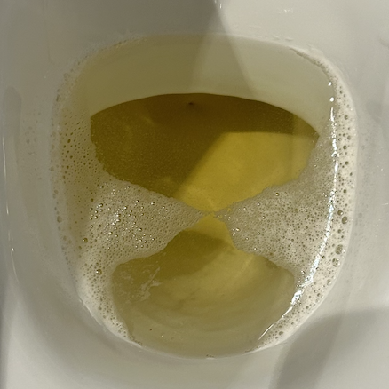

## Lourdes

- I spend two weeks in Lourdes.
- A snap election is called in the UK.
- An email comes round from the Party of Women asking us to run for election.
- Something tells me to run for election in the UK.

## UK

- I spend the rest of June in the UK running my election campaign.

### Election campaign

- Electioneering is a social business and I drink alcohol most days.
- However, I feel no ill effects like I do when I am at home in Dénia. It's weird.
- In Denia, I have frothy urine nearly every day. After about a week in Lourdes, this ceased.
- It starts up again when I got back to Denia in July.

### Speech at LWS

- At LWS on 28th June, I make a speech.
- It's obvious I'm being discredited in the community.
- When the video is posted on Twitter, the end part, including my speech is cut out.

