# June 2024

## Lourdes

- I spend two weeks in Lourdes.
- I have my laptop and I'm working from my hotel room.
- I visit the grotto every day to pray.
- I ask Mary to help me with the inexplicable and ferocious evil that surrounds me from all sides; at home in Dénia, online, and at work.
- She delivers, as usual.

### Polygon

- The extent of the hatred towards me is a little overwhelming.
- I feel that the constant persecution I'm experiencing at work cannot be unconnected to that which I've been experiencing in Dénia and online from Dénia cyber-stalkers.
- The energy is the same.
- At work, Paul Gebheim gives me an apparently impossible task.
- I decide to pull a *rabbit out of the hat* and show them how it's done.
- I do.
- They're all a bit surprised, and I literally never hear from anyone again about this excellent piece of work.
- Hans is even more aggressive in team meetings than he was previously, if that was at all possible.
- I'm still the lead.
- Anthony supports him.
- They both refuse to communicate with me. 
- They are literally ignoring the polite but firm messages I send them repeatedly.
- Who has told them it is OK to do this?
- These men aren't fools.
- Paul O'Leary ignores my pleas for help dealing with their insubordination.
- It's impossible to do the job I'm being paid for.

### UK General Election

- A snap general election is called in the UK.
- An email comes round from the [Party of Women](https://www.partyofwomen.org/) asking members to run.
- Something tells me I should apply to run for election in my constituency in the UK.
- I apply.
- I fly back to London from Toulouse for 24 hours to get the election forms in at Barnet Council on Friday 7th June.
- I believe Mary is telling me to stand for election given the timing, and what's been going on for me, and my fervent prayers for help at Lourdes.
- The criminals of Dénia and the wider porn-gang-controlled regions should have maybe taken a massive collective gulp, except they didn't at all because they know they are protected at the highest level of the land and beyond.
- Nevertheless, Mary's advice was sound, and running for election most certainly made me safer and better protected against the criminal porn-gangs overall.

### Party Of Women leaflet

- Here's my general election leaflet.

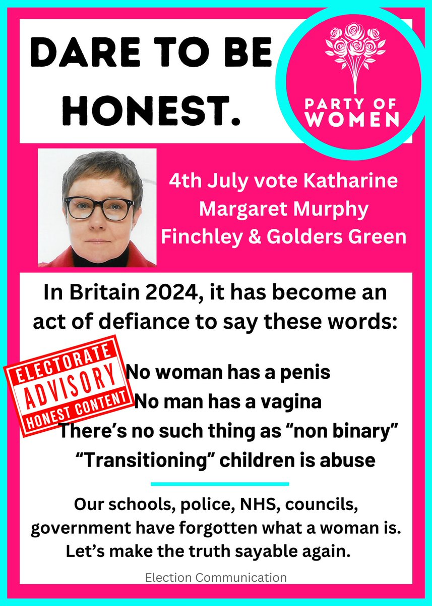
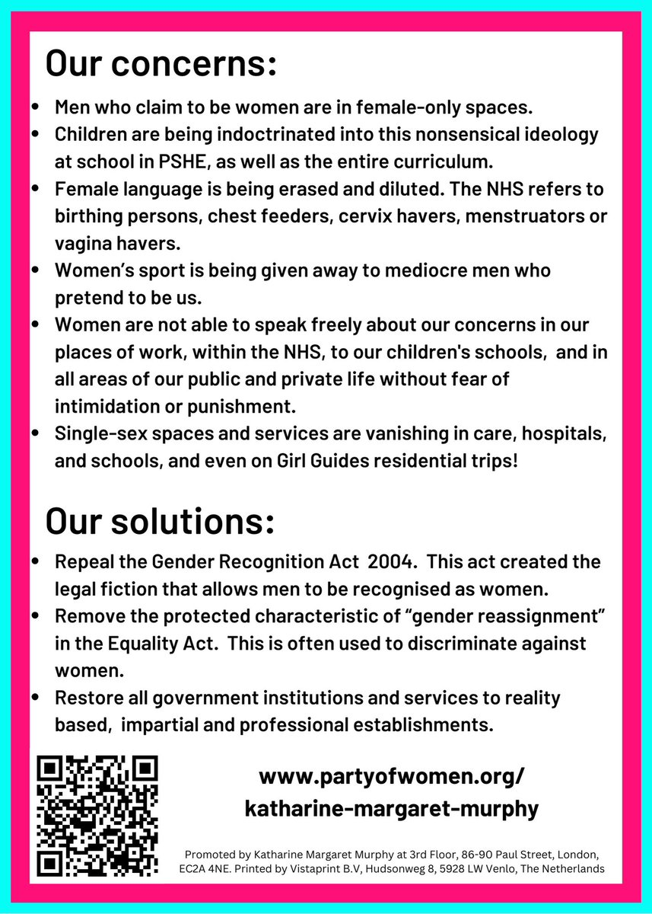

- It went out to 80,000 North London constituents in the Borough of Barnet.

### Transvestite nun

- The night before I leave for the UK, Friday 14th June, I go for a short drink on my way back to my hotel after prayers at the grotto.
- After a few minutes, three people walk in; two women, and a man, except the man is dressed as a nun.
- He has five-o'clock shadow and he is talking in a high squeaky voice.

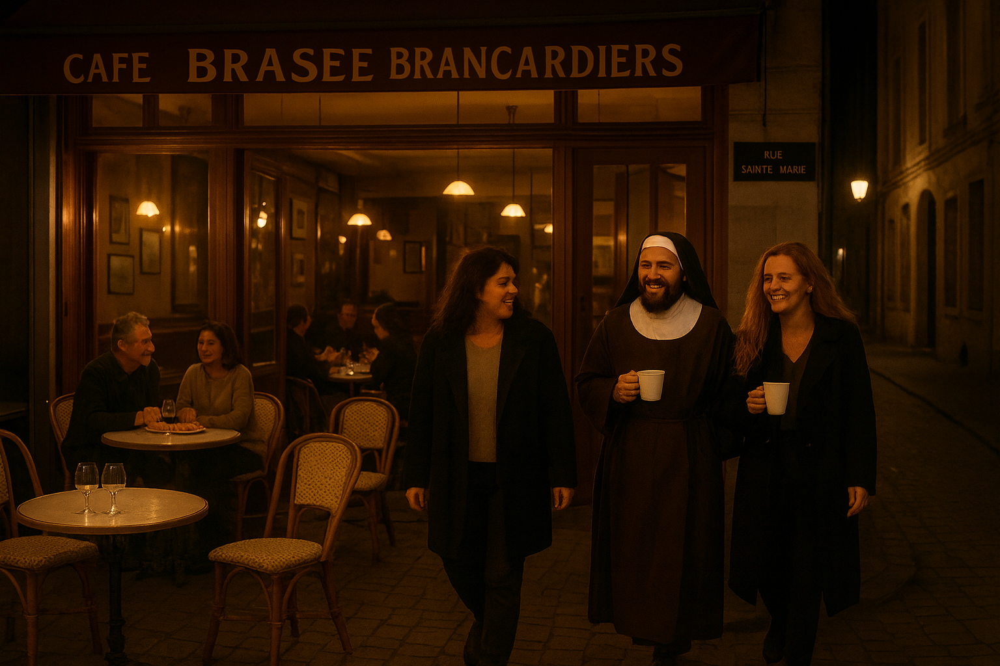

- He's a transvestite nun.
- I can hardly believe my eyes.
- I'm horrified and [I write to the Pope](../../content/documents/letters/Pope.pdf) about it.

??? tip "My letter to the Pope"
    Saturday June 15th 2024 
    Dear Pope Francis 
    I have been coming to Lourdes now since 2008 when Mary called me. A long story. 
    I ended up serving in the baths from 2012-17. I have just signed up to serve again this 
    year. 
    I’m not Catholic. My dad is. 
    The reason I’m writing to you is that I started to notice men masquerading as women in 
    the women’s section of the baths in 2014. They were usually Scottish. 
    There was also a man pretending to be a female doctor in Lourdes in 2015. Also from 
    Scotland. 
    Yesterday evening I noticed a French transvestite nun in the cafe I was having a drink in 
    after procession. He was putting that awful squeaky “woman’s” voice on that they do, 
    and surrounded by obsequious women. 
    I also noticed, on Twitter, a well-known and extremely litigious and vexatious transvestite 
    from the UK who has made relentlessly legal attacks on women posting his arrival at 
    Lourdes. I saw him later in a medical servers outfit.
    https://x.com/drljultra/status/1801720201085423675 
    Many many of these men have sexual abuse histories, particularly of minors, including 
    this one.
    https://x.com/ReduxxMag/status/1692260173069619599 
    Pope, the rise in numbers of men pretending to be women is due to the porn epidemic 
    alone. 
    They become so addicted to violent and degrading porn, needing more, and worse and 
    worse, that their mentally ill minds begin to seek their own selves as “women” for 
    subjects of their lust. 
    These men find ways to get close to vulnerable women and children as part of their fetish. 
    It seems we have unilaterally decided that these predominantly white, western, wealthy, 
    privileged men who need psychological help should be pandered to. 
    They have nothing to do with the gay community. 
    I’d like you to support #PartyOfWomen in the UK who is raising awareness of the 
    problem. 
    I’d also like you to do something about this in Lourdes where EXTREMELY vulnerable 
    people are now targets for porn fetishists. 
    Mary has undoubtedly given me the task of being Her voice with regards to this. 
    I attach a flyer for my political run in the election. 
    Please help protect your deeply vulnerable congregation. 
    Thank you. 
    Katharine Margaret Murphy

- I also tweet about it.

[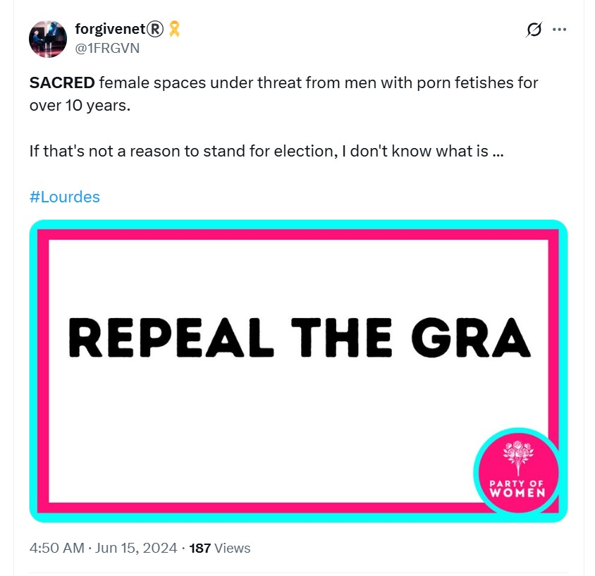](https://x.com/1FRGVN/status/1801734066611302728)

- And I get censored for using the word "tranny".

[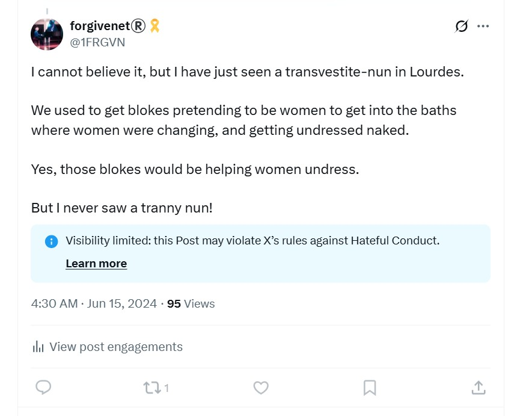](https://x.com/1FRGVN/status/1801728894816370874)

- It sort of feels like porn is taking over the whole world.
- Or trying to.
- Running for office makes me confident and optimistic, again.

[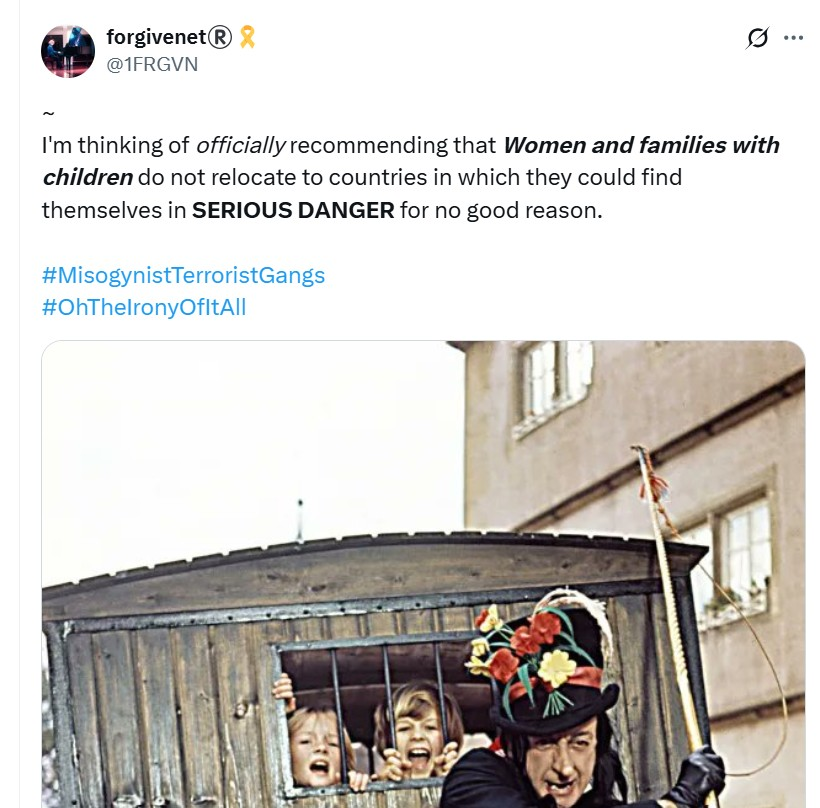](https://x.com/1FRGVN/status/1801532892847214694)

- I also want to wholly recommend standing for office to any woman being terrorized by men. It'll do a million times more to keep you safe than going to the police.

## Taking two-weeks vacation from Polygon

- Post-[Bali](may.md#bali), my team at Polygon has become unmanageable.
- Hans' behavior is so unbelievably rude, he should be fired on the spot.
- Due to, I believe at the time, no-one doing anything about Hans, Anthony had also become insubordinate.
- I now believe they were instructed to behave this way towards me. 
- I had to be got rid of. And quick.
- I wasn't to know any of this.
- I still had no idea I am an *international spy-cam sedated female-tech-colleague [switcheroo rape-porn star](../../crimes/protagonists/vidal-sastre.md#four-distinct-men)* and wasn't to know this for over a year more.
- My job at Polygon had become impossible with my team refusing to do any work or respond to me whenever I tried to communicate with them.
- My manager Paul should have sorted it out immediately, but he didn't.
- My manager David should have sorted it out immediately, but he didn't.
- They've both had *months* to get on top of this.
- Are they also part of the conspiracy? 
- I believe at the time their utter failure to help me is because the tech is failing yet again and they're too busy.
- The situation is getting really impossible to deal with and I don't know what to do.
- So, I fight like mad to get two weeks vacation so I can run a general election campaign instead of just being a paper-candidate.
- It would be that, or sitting doing nothing anyway because of my team's insubordination.
- Polygon management's lack of will to help me, or intention to not help me, was a total God-send in many ways because I could take the time off and run my election campaign instead.
- Delicious ironies.
- I reach out to Miriam in Spanish HR to ask for two weeks off, but she also deflects and ignores.
- Eventually, after much badgering and complaints about Hans and Anthony, they give me the time off.
- I start thinking about what I can do about this horrific and untenable work situation.
- I'm certain they want me to leave, but I love my job and have no intention of leaving.
- Just like I felt about studying the piano at the conservatory and being viciously hounded out there too.
- Coincidence? I think not.

## Election campaign

- I spend the rest of June in the UK running my general election campaign for Finchley and Golders Green.
- It is one of the most exhilarating times of my life.
- The Barnet Post runs an advertisement for all the candidates and I supply a short introduction to myself and why I'm standing.

[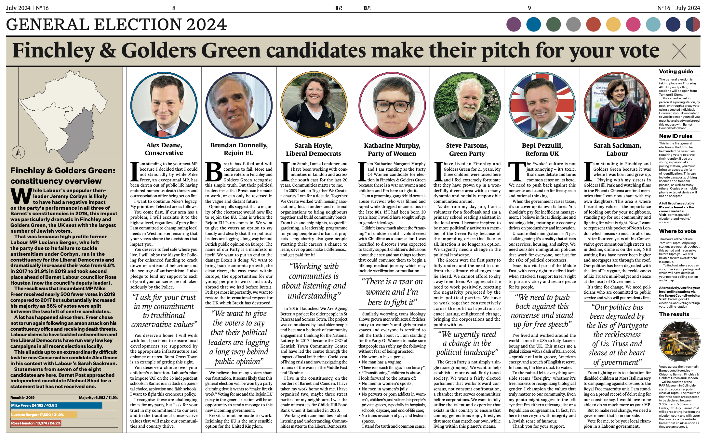](https://barnetpost.co.uk/wp-content/uploads/2024/07/Barnet-Post-July-2024.pdf)

??? quote "There is a war on women and I’m here to fight it"
    I am Katharine Margaret Murphy and I am standing as the Party Of Women candidate for election in Finchley & Golders Green because there is a war on women and children and I’m here to fight it. 
     
    I am a grooming-gang/child-sexual-abuse survivor who was filmed and raped while drugged unconscious in the late 80s. If I had been born 30 years later, I would have sought refuge     in gender ideology. 
     
    I didn’t know much about the “transing” of children until I volunteered with Childline as a counsellor. I was horrified to discover I was expected to tacitly support children’s delusions 
    about their sex and say things to them that could convince them to begin a lifelong medical journey which may include sterilization or mutilation. 
     
    Similarly worrying, trans ideology allows grown men with sexual fetishes entry to women’s and girls private spaces and everyone is terrified to tell the truth about it. 
     
    I am standing for the Party Of Women to make sure that people can safely say the following     without fear of being arrested: 
     
    • No woman has a penis; 
    • No man has a vagina; 
    • There is no such thing as “non-binary”; 
    • “Transitioning” children is abuse. 
     
    I look forward to the return of: 
     
    • No men in women’s sports; 
    • No men in women’s jails; 
    • No perverts or porn addicts in women’s, children’s, and vulnerable people’s private spaces, especially in hospitals, schools, daycare, and end-of-life care; 
    • No trans invasion of gay and lesbian spaces. 
     
    I stand for truth and common sense. 

- With regards to my situation in Dénia, running for election was a game changer.
- More importantly, it was about to become obvious to me that I was not just the most annoying and yappy sedated-spy-cam-rape victim the Spanish porn-gangs had ever encountered, my unexpected behavior was also seriously upsetting folk back here in the UK.
- A concerted attempt to frighten me out of politics began in North London. 
- I was amazed, I have to say, and with every nasty comment or outrageous event designed to terrorize me I became even more certain I was doing the right thing and far less likely to stop doing it.

### Barnet Post feedback

- My dad reads the article in the Barnet Post and gets upset.
- He says, *Why didn't you tell me?*, over and over.
- I say, "Everyone knew".
- The truth.
- Silence.
- Later, when drunk, dad makes a joke about how many men have had me!
- He repeats the *Why didn't you tell me?* nonsense for nearly a year until I take a moment to point out a few obvious things out to him.
- He seems keen to (lie probably and) point the finger about his own brother too, which I find utterly appalling.
- In September 2025, after hearing from the Rape Gang Inquiry lawyers, I excitedly tell him there might be a new investigation into the Tottenham rape gangs.
- Silence. 
- I don't bother explaining how a normal person should react to this news.
- Of course, he's worried about himself, never me.
- Pedo's always pick their victims wisely and will have always done their homework and family background checks.
- Something told them they would be able to get away with murder with me.
- God had other ideas.

### Social media and Paul

- I create a Facebook account for my election campaign: https://www.facebook.com/profile.php?id=61561067270886.
- I'm inundated with fake accounts. The usual; dogs, horses, caravans, men looking for love. 
- I figure the criminal gangs have a lot to do with this.
- I don't really mind.
- An old friend Paul Pompeus connects with me.
- He is exuberant and friendly.
- He sounds exactly like the person I used to know over twenty years before.
- "I'm so happy we're back in touch, you were my best friend back then, you're still my best friend, one of three."
- He sends me messages like this fairly regularly on Facebook up until I see him again in January 2025.
- I reach out to a number of other people on Facebook; including Paul's family and their friends and family that I know as well as I know him.
- They all ignore me.
- I assume it is because they are pro-trans or do not want to be associated with someone speaking up about the dangers of gender ideology.
- Perhaps they have trans kids?

### Continued stalking and health matters

- In-person, mostly male aggression begins.
- It's constant.
- I go to the garage to put petrol in the car. On the way home a car pulls up beside mine and a man insults me through our open windows.
- Every time I go out, if I'm on my own, I feel vulnerable.
- Mostly I'm with a bunch of election volunteers, but even then the behavior of people desperate to frighten me out of standing for office is outrageous.
- I'm convinced most of the people sent to frighten me are corrupt police getting jittery about my Tottenham rape-gang history, their informants who include members of the Tottenham rape-gang itself, the Labour party and others.
- I'm stalked online constantly by hackers while I'm in the UK, and a DM conversation continues with them via various fake accounts during this time. 
- I tell all my new friends about the gypsy trumpeter I'm in love with.
- None of them are particularly impressed, or surprised.
- Some of them seem to be trying to talk me out of it.
- Indeed, some seem to have a very precise background knowledge of what's been going on for me in Dénia.
- I'm aware that everything I do online is seen by hackers but the whole thing feels way bigger now.
- I feel like I was 100% right to connect teachers and staff at the conservatory of Dénia with the Tottenham rape-gangs.
- I've no idea how much more is at stake and for whom.
- Electioneering is a social business and I drink alcohol most days.
- However, I feel no ill effects like I do when I am at home in Dénia. It's weird.
- In Dénia, I have frothy urine and screaming kidneys nearly every day. 
- After about a week in Lourdes, this clears up completely.
- It starts up again when I go back to Dénia in July.
- Does that mean they poisoned me with the intention to maim or kill with anti-freeze, on top of whatever hallucinogenic and aphrodisiac substances they used?
- I do notice, however, that I am high all the time in the UK, and I believe that was from something Dénia poisoners had managed to add to my toiletries, and perhaps even *top ups* from some of the plentiful wrong 'uns surrounding me in North London.
- Obviously, continued drugging was essential so that I wouldn't suddenly get clear about the [switcheroo porn](../../crimes/protagonists/vidal-sastre.md#vidal-sastre-sanchez-hornero) that I was unaware of at that time.
- I can't imagine how multiple criminal porn-gang networks must have felt about me standing for office.
- I guess truly horrified might come close. 
- Imagine, a victim that always ends up dead or destroyed turning the tables on them.
- Even the vocabulary of it is an irony.
- Something had to be done of course; hence the relentless stalking in the UK, although I'm not quite sure what the end game was for them at this stage.
- Certainly Dénia hackers made it clear to me I had surprised them.
- *I wasn't expecting that,* she said on a fake account when I got home.
- I guess it all makes me a little bit infamous in the wrong sorts of circles, or perhaps I already was with the child rape-porn everyone knew about.
- The politics made me even more so I expect.
- From my side, and at the time, I've really no idea what's causing the rampant activity and I assume it must be due to the Tottenham rape-gangs and all the rape-porn they made with me and my childhood friends, sedated, in 1989, in their mothers' kitchens and dining rooms.

### Gang of adult men talking about getting their dicks out at Finchley Central tube station

- While handing out leaflets at Finchley Central tube one evening, a gang of about 8 men stood beside me.
- One of them told me about their "men's" group and how they meet every Tuesday, or similar.
- It seemed to me a bit contrived.
- As I walked past them, they were standing in a circle at the tube entrance talking loudly about getting their dicks out, and one of them, the one who had spoken to me originally, asked me if I wanted to see it.
- I told them no one wanted to see that.
- I believe they could be police now, they were that sort of man; youngish, all the same height and weight, reasonably fit-looking, some balding.
- In retrospect I wonder if they were trying to scare me.
- They didn't.
- The tube stations were where a lot of bizarre things happened during my election campaign.
- I made sure to tell the police's special election force where I was going to be every day because they were concerned enough for the safety of candidates to have set it up and I trust the police are concerned for my safety.
- I haven't felt safe like this for a good few years, if ever.
- I like it.

### The East Finchley summer festival

- The [East Finchley festival](https://www.eastfinchleyfestival.org/) takes place on the 23rd June in Cherry Tree Woods.
- We set up outside the park gate to give out leaflets and talk to people.
- I'm helped enormously by Stella, a [cartoonist from Bristol](https://www.radicalcartoons.com/) without whom I would have had even less of a clue about what I was doing.

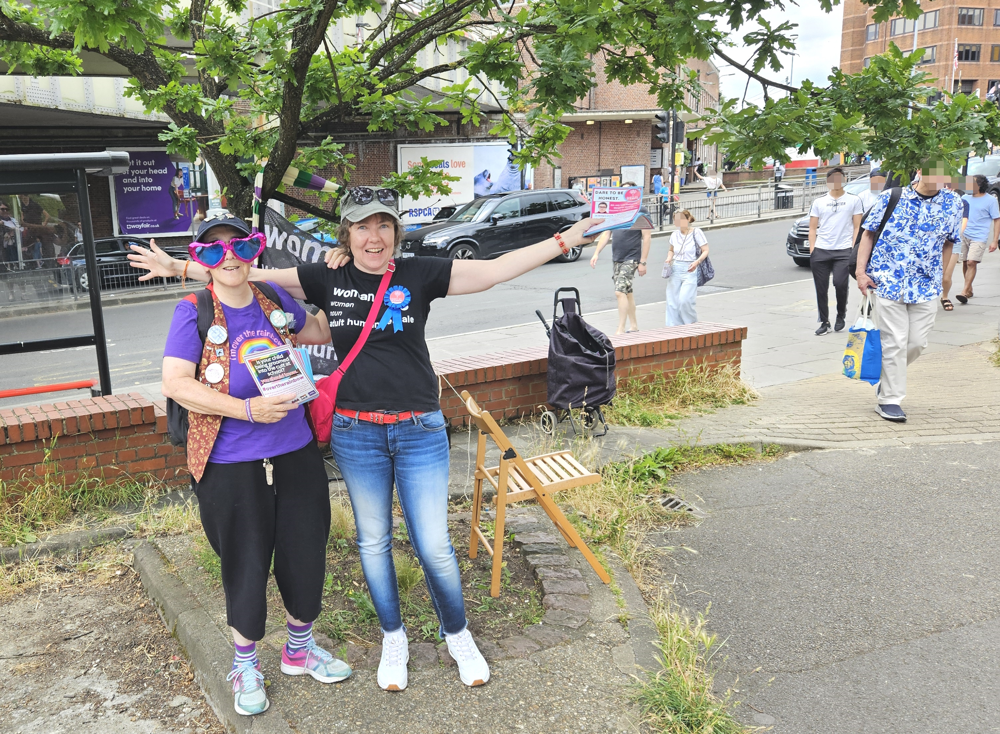

- A few more volunteers help out too.
- Steve and Athena come with Ruby the dog.
- A friend of Stella comes.
- Dad comes to watch.
- It was a great afternoon.

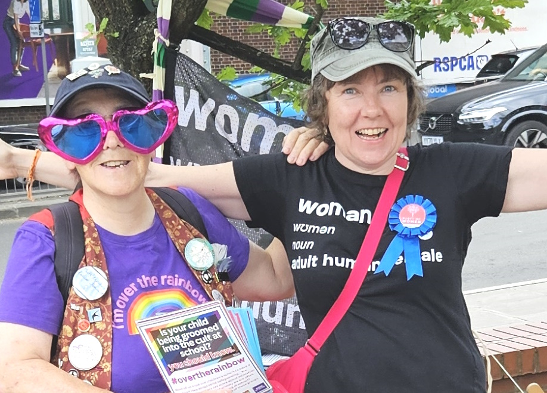

#### Trans kids and their parents

- There were a few upsetting moments.
- I was *accosted* at one stage by a teenage girl who thought she was *non-binary*.
- Her and her friend were intent on upsetting me.
- I told them I was doing it for them; so that they don't have to share a prison cell with a rapist when they can't pay their license fee, amongst other examples.
- It was as if a grey mist came down when I spoke sense to them, and off they went on another random tangent.
- I asked them if they went to Fortismere school.
- They got very upset with me; *why are you asking us that?*.
- The youngsters were totally lost and I felt bad that they had been so horribly manipulated.
- There were also a few extremely angry, I would say utterly broken and projecting, parents.
- This was the first time I had interacted with victims of trans ideology, children and parents, and it was very educational.
- I felt bad for them and I understood why the parents had to be angry at me.
- It was the only way to allay the guilt of what they were doing to their own children, which no-one, even the insane, can hide from.

#### So (Janet)

- So (Janet), a volunteer, attends for a short time. 
- She calls herself *So*, a poetry name, but her real name is Janet.
- She is an election agent for another Party Of Women candidate, Lesley, standing in Islington South.
- She says she can't stay out long because she gets too hot.
- She gives my dad, who has come along to watch, a badge.

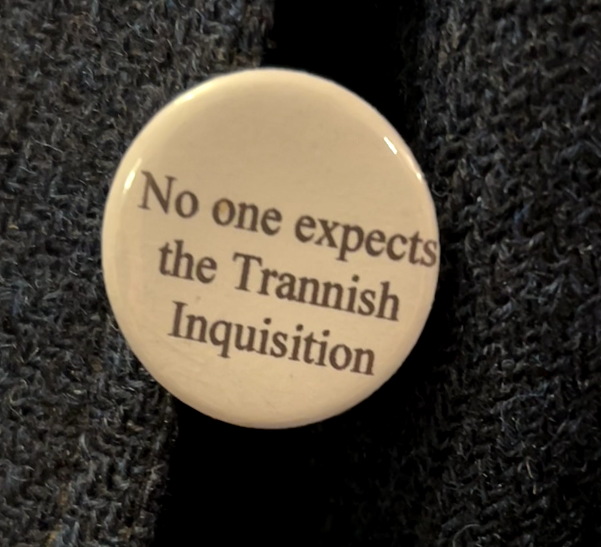

- My eyebrows fly up to the sky.
- Apart from the obvious link to Spanish gang-stalkers, this message was written verbatim on an early-day's (September 2023 when [I went public on X](../2023/september.md#going-public-on-twitter)) fake-account `@Fredegonde_R` which interacted with me excessively and I have to assume is managed somehow by Hazel and her associates.
- So (Janet) is close chums with another X account `@RadfemBeat` an account which causes endless trouble on X; when I say trouble I mean picking fights and splitting people apart.
- I wonder if So (Janet) is also an associate of Hazel, and if that suggests the use of criminal cyber-stalkers to undermine grassroots political movements such as Posie Parker's Let Women Speak organization and the Party of Women.
- If so, does that suggest Hazel's organization is involved in the mass-manipulation of children, mainly girls, into trans-ideology?
- It seems likely So (Janet) works for the criminal gangs primarily, but I also suspect she is a police informant.
- She was in attendance when they [wheeled out Winston May to frighten me](#winston-may) - the North London rape-gang member I had complained to the police twice about.
- So (Janet) tells me she has a gift for me, randomly.
- It's a gift from St Valentine's well in Glasgow, Scotland that she's just visited.
- She gives it to me at the [Party of Women party](#party-of-women-party) the following week.
- It is a little vial of holy water from the church in Glasgow which has some of St Valentine's relics.
- I mean... were they panicking at this stage?
- Let's see now...
- I can tell you that at the time I thought it was very weird and a bit *too* coincidental.
- Now, I believe it is part of the generalized witchery going on and there may have been a *top up* for me in that water, or on the paper it came in, or the bag itself, to make sure I didn't suddenly remember [the four distinct trumpet teachers](../../crimes/protagonists/vidal-sastre.md#vidal-sastre-sanchez-hornero) and instead kept obsessing about my *one true love*.
- It worked too, but that's was part of the bigger-and-better plan anyway wasn't it, *Our/Her/His Way*.
- Certainly at the party  after receiving the gift I noticed I had become extraordinarily physically sensitive in the way one might if they had taken a low-dose hallucinogen or ecstasy pill, or similar.

### Seonaid Dawn Barber

- It just gets madder and madder.
- You may remember [Seonaid Dawn](march/1-12.md#seonaiddawn) from a previous section where I describe intense cyber-stalking on the run up to the [conservatory piano concert](march/1-12.md#the-piano-concert) where someone dressed up as my deceased friend [Lorraine Blackbourn](../2021/july.md#lorraine-blackbourn-commits-suicide) who I believe was driven to suicide online.
- You may remember too that this account had been tag-teaming with accounts run by world-famous murderer [Hazel Smith](../early-years/2007.md#hazel-smith) and others such as [**Lorraine Tortured Whistleblower**](march/13-end.md#lorraine-tortured-whistleblower) to cause me distress over this period.
- Well, I was somewhat amazed to see Seonaid Dawn in the Party of Women zoom meetings on the run up to the general election, and to learn she was standing as candidate for West Worcestershire.
- It reminded me a little of [Anita Diamond popping up on Slack](../2021/march.md#qredo) at another suspicious job in 2021. 
- Weird.
- It was difficult to know what to think at the time, other than that this was a genuine link from people concerned about children being manipulated into the trans cult to the Dénia porn gangs. 
- What could the connection be?
- I had to assume Seonaid was yet another criminal gang member come to spy on our activities, but what for?
- The criminal porn industry was putting a lot of resources into making sure they knew everything women were doing against trans ideology?
- Why?
- Why does trans ideology concern criminal enterprises like Hazel's?
- We know their honey-trapping departments like to target middle-aged Western women over social media and elsewhere because we're kind and generous, quick to love maybe.
- But in-person spying too?
- What concerns the criminal porn industry so much that it sends spies into groups that are against the sterilization and mutilation of children?
- Could this grotesque process of turning a child, mostly girls, to the trans-darkside online be a multimillion dollar porn-genre too, just like [switcheroo is](../../crimes/protagonists/vidal-sastre.md#vidal-sastre-sanchez-hornero) or perhaps even birth porn? Nothing would surprise me any longer.
- Where does it end for porn-addicted men? 
- Will they only be satisfied with the total destruction of moral Western society?
- It seems so.

### Labour Party shenanigans

- Normally a fast learner, it took me a while to realize how politics makes people behave appallingly.
- Every day while campaigning, I was threatened by people I have to assume were working for other parties, or perhaps they were informers sent by the police who were horrified a rape-gang survivor might be standing for office.
- Maybe even the British and Spanish porn-gangs felt a need to try and terrorize me out of politics.
- Whoever they were, they made me more determined then ever!
- One woman I saw repeatedly; ripping up my leaflets, and shouting and glaring at me at tube stations, turned out to be an election officer for the Labour Party.
- I guess some of my volunteers could have been Labour Party too, or perhaps Green Party infiltrators.

#### An old friend

- One morning at East Finchley tube station while handing out leaflets, I see an old friend from the time the Tottenham rape-gang got hold of me in 1989, Geetha.
- Her mother and her mother's boyfriend Colin had been staunch members of the Labour Party in East Finchley.
- She's never been my friend - she bullied me horribly on three different occasions; the first time in 1980, and again viciously after the rape-gang attacks in which she wasn't targeted - I assume because she's black and they were predominantly black gangs.
- I wondered if the original bullying when I was really small had been brought about by parents and guardians angry with my dad about something.
- I'm happy to see her in any case.
- She doesn't have anything nice to say to me.
- She's seems nervous, her voice is shaking.
- She takes a photo of me and her, and leaves.
- I'm happy she came over to say hello and think nothing more of it.

### Party of Women party

- A party is held in Dalston for Let Women Speak and the Party Of Women on Saturday 29th June, the weekend before the general election.
- I go and meet many of the other candidates standing for election.
- [So (Janet)](#so-janet), my volunteer, is there.
- She flatters me a little, and buys me a drink, and says she'll be helping out the following week at the tube stations.
- She also gives me her significant, weird, and unnecessary gift of a vial of water from the church where St Valentines relics remain in Glasgow.
- Poor ole Valentine. Misused for centuries by wrong 'uns.
- Anyway.
- I meet another volunteer Sandra with her sister Susan Hamill.
- They also buy me a drink.
- I give them a lift home after the party too.
- I also meet Beverley who is standing in the general election against Emily Thornberry in Islington South.
- When I go to give Bev a hug to say hi, our cheeks brush.
- The softness of Bev's cheek skin is incredible, it's amazing, I'm blown away by the softness of her cheek!
- I'm so amazed at how soft Bev's cheek feels I tell a few people about it, including So, and one other woman who I met at Madrid (can't remember her name - but she tried to create some negativity with me that night by telling me a dark history with no details about how people have been saying things, oh you'll find out, Kate something, she said... I wasn't impressed).
- I think I told her I was going to eradicate porn!
- Two weeks later, Posie Parker repeats everything this woman said to me, word for word, on a video.
- It's pretty obvious to me I'm *persona-non-grata* and I will have no idea why [until late 2025](../2025/july.md#dad-tells-me-hes-a-spy-cop).
- Anyway.
- I'm used to ultra and extraordinarily high levels of persecution so it doesn't bother me.
- I've become immune to it.
- In retrospect, I believe that the very unusual way I felt about Beverley's soft cheek is proof, to me, that I was high that night on some sense-affecting substance; something either I was absorbing through my shampoo and toiletries I brought over from Spain, or via a top-up I had ingested that night without my knowledge.

### Winston May

- During my election campaign, me and my little group of volunteers handed out leaflets in the constituency, often at tube stations.
- On Wednesday 3rd July, between 5-7pm or so, we were at Brent Cross tube station.
- About half way into the leafleting session, one of my volunteers, [So (Janet)](#so-janet), stood very close to me and talked at me like a machine gun while blocking my view of the people coming in and out of the tube station.
- She appeared to be trying to distract me from something and, already suspicious, I ignored her.
- She had done this at other leafleting sessions too. 
- She then leaves. She only ever stays for a short time.
- I became even more suspicious of this woman's intentions as her already unusual behavior was exaggerated.
- After she had gone, only myself and one other volunteer was with me, Steve.
- We were standing at separate exits, fairly far apart from each other, but I could see him and he could see me.
- I see a group of people standing around him.
- Shortly afterwards, I see a tall black man holding the hand of a small boy and stumbling towards me through the station from the direction where Steve is standing.
- The man is wearing a yellow jumper with diamond checks and a cream chimney-sweep hat. 
- The small boy of about seven-years-old is arabic looking with dark skin.
- The man was stumbling as he walked, he was very unbalanced, tottering even, like he didn't know where he'd been or where to go next. 
- The little boy seemed to be leading him towards me.

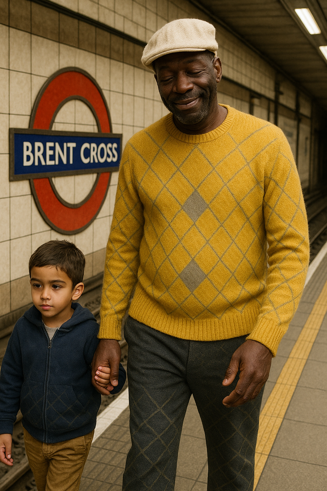

- I realized it was Winston May.
- Winston May, the Tottenham rape-gang pimp and procurer of minor children, who has probably always been working for the criminal porn gangs of North London and by wider implication Spain.
- I recognized him immediately; ringleader of the pedophile grooming gang in Tottenham that had raped and abused me repeatedly, and put me in porn, in the summer of 1989.
- He looks like he's out of his mind on drugs.
- I remembered during the horrors of 1989, at one time, he had mentioned traveling to the Mediterranean coast of Spain with his Soho-prostitute associate Nikki.
- I wonder if I added this to [the 2015 statement](../early-years/2015.md#statement-to-the-metropolitan-police). It's possible.
- Calm and collected, I offer Winston a leaflet and insist he take one when he said he already had one (that Steve had already given him).
- He scurries away from me as I walk towards him, unable to maintain eye-contact.
- Later, in the pub, I tell Steve what had happened. 
- Incidentally, for some reason, I felt I needed to change my will that day and did so.
- In the pub, after telling Steve about Winston May, Steve tells me a story about how he had been sexually abused as a child when he was 7, in an African country, and that he had seen the abuser again when he was about 16 holding the hand of a young arabic-looking boy.
- I think he was supposed to have told me his story before I told him mine; but I got there first.
- Could the Dénia criminal porn gangs have found ways to continue to terrorize me in London while I was running as a candidate in the general election?
- Or was this event set up by the Metropolitan police themselves; trying to terrorize a rape gang survivor that they had failed to help out of politics?
- Pretty desperate behavior if so.
- Had I been receiving subliminal death threats online which triggered a will change?
- It's difficult to understand exactly why this event happened, who would benefit, and how the Dénia criminal gangs could not be involved in some way.
- Later, I remember my portentous [dream from a month previous](may.md#dreaming-of-the-pedophile) while I was being battered with hallucinogens and [porn-prepped for the Bali Polygon conference](april.md#drugged-in-the-street-by-denia-gypsies) at home in my lovely apartment in Dénia.

### Leaflets

- A curious thing happened with my leaflets.
- It seems that everywhere in the world, ignorant people can justify treating anyone who is concerned about the erosion of women's rights and child safety with utter disdain, unlawful behavior, violence, and worse.
- I bought 70000 leaflets with VistaPrint and when they arrived it looked like the boxes had been destroyed purposefully.
- I complained and they sent me a whole new print run of 70000 leaflets, so I contracted a company to help me deliver them at the very last minute, StreetPR UK.
- They had five days, Friday through Wednesday, including Saturday, to do it.
- It was Thursday evening, and I paid the company thousands of pounds, and all of a sudden, bold as brass, they rang to tell me they didn't have a van to pick up my leaflets.
- It didn't occur to them that they could have easily hired a courier, which told me everything. 
- After complaining bitterly about this, they sent a man from South East London to collect them and he turned up on Saturday evening in his car. 
- He wouldn't say where he was taking them when I asked him.
- They then had three days to deliver them on 1st, 2nd, and 3rd July before the election on the 4th July.
- I felt I had been ripped off so took them to small claims, and lost.
- At small claims, in March 2024, I was struggling to think straight due to the toil of years of drugging, and all my belongings from my apartment in Spain that I brought back to London had been sprayed in pesticides so I was unwell from that too.
- At court, StreetPR's representative admitted that to do a job like mine requires 15-20 people, employed at the last minute.
- They weren't able to provide any proof of any people having been contracted to do the work.
- I lost the case but I wasn't very well prepared, and I was struggling hard to think straight.
- I'm just adding this for completeness.

### Speech at LWS

- At LWS in Hyde Park on 30th June, I make a speech.
- It's obvious I'm being discredited in the community. My past experience as a grooming gang survivor makes people uncomfortable, but there's much more to it than that. 
- I have no idea what it is or what I might have done to deserve being silenced by the women protesting about being silenced!
- It's ironic.
- When the video is posted on Twitter, the end part, including my speech is cut.

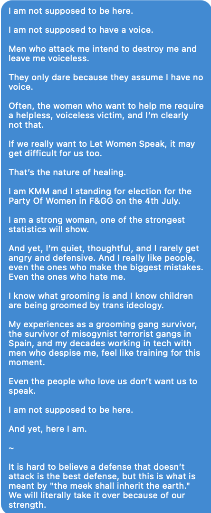

!!! important
    - Running for election at the UK General Election in July 2024 for the Party of women was a game changer for me, quite possibly a life saving act.
    - In one of the first messages in our long communication from July and over August, the hacker said "well I wasn't expecting that" with regards to it.

#### My friend from Madrid

- Curiously, my friend from Madrid is there and she records my speech on her phone. I have a copy.
- She brings her 14-year-old nephew, who she tells me has ADHD.
- He does seem a little high; he just grins a lot and keeps falling asleep.
- The thing is, she had a 5-year-old nephew in 2006, the year I met her.
- She told me she had visited London with him at that time.
- This boy is supposed to be the same nephew, but he's 10 years too young!
- I find it suspicious.

### Volunteers not what they seem

!!! danger "Volunteer list"
    - I believe most of my "volunteers" were connected to Hazel and Sandra Smith in Dénia in some way, or bent coppers trying to silence me due to my rape-gang survivor status.
    - Here is a list of them:

        - Janet (calls herself So): constantly and extremely weirdly trying to distract me from campaigning. She gave me some items which may have contained poison and were certainly related to my history; a vile of holy water from St Valentine, a badge my dad wore, etc. She significantly runs distracting game on me at [Brent X tube](#winston-may) while they're setting up the Winston May event.

        

        - Steve Norman: lovely man from N2 who kept saying he had been involved in vivisection activity in the 80s which I took to mean he was probably a police informant of some sort as he was significantly involved in the [Winston May event](#winston-may) at Brent Cross tube, but now I believe he could also be connected to the criminal gangs of Dénia. Perhaps the two interested parties work together very closely.
        - Athena Norman: Steve's "wife", a trans-sexual man. I believed this set up to be a way to discredit me in the future. Steve gave a speech at Let Women Speak about "his wife" sometimes in 2024.
        - Wesley Aguilar: a man who was clearly embarrassed about something as he could not look me in the eye. Had he seen the child rape porn I was in? I suspect he works for the police, along with a bunch of other men that are Let Women Speak regulars... who I have been told will block newcomers from interacting with the established group at LWS.
        - Sandra: a woman I initially trusted but after something she said, and some [experiences with her sister Susan](../2025/march.md#let-women-speak-aberdeen), I suspect she must be connected to the Smiths via North London criminal gangs and possibly the police.
        - There were a few other volunteers who I did trust that I won't mention here.

- I've since told So I don't trust her. I was warned about her on an [email from Patricia](../../content/documents/emails/trish-warning-about-So.png) on December 8th, 2024 (a significant date for me as everyone knows).
- I told her I didn't trust her. She since changed her profile with a message to me.

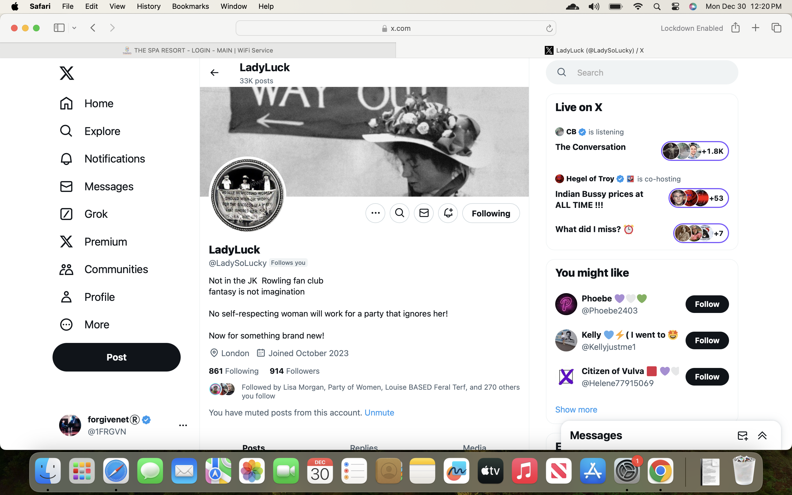

## No sexual arousal

- I am not sexually aroused at all this month in London at my family's home away from Dénia.
- However, I am high and extremely physically sensitive (a certain event makes me realize this).
- Looking back, I see that I am in a heightened state of consciousness during the whole month of June and into July.
- DMs with hackers reveal this.
- I believe the drugging is continuing via bathroom products most likely, but I'm too busy with the election to be sexually aroused and/or the social media sexual hypno-suggestions have dropped off because there's no spy-cams available for the gangs to cash in on.
- This may change as I have no choice but to move back to London in 2025.

[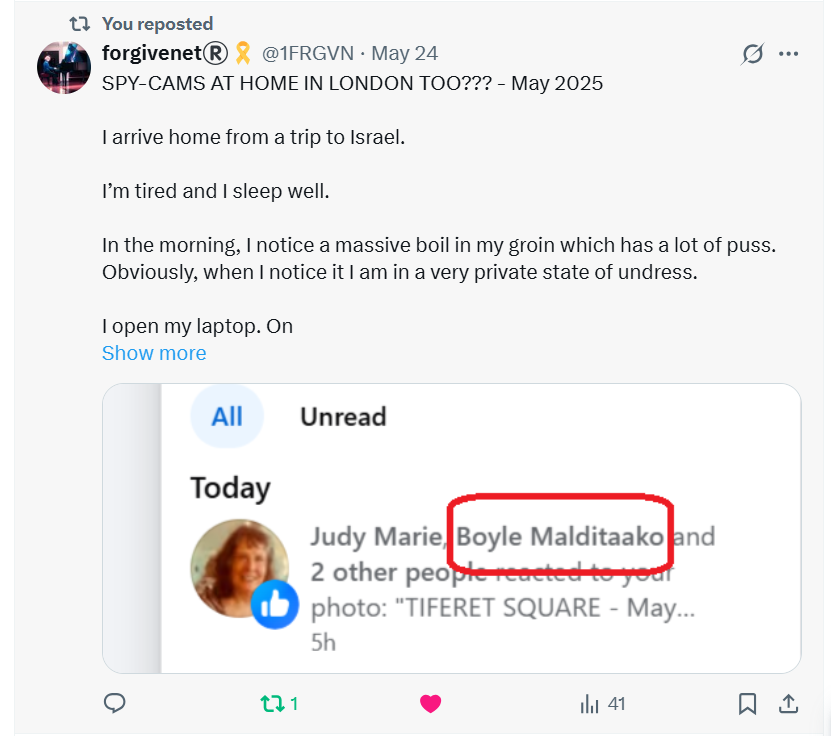](https://x.com/1FRGVN/status/1926266246925795504)

## Telling my brother at the White Lion

- I take my brother out to dinner at the White Lion in N2 and tell him everything.
- I had told my brother everything I knew in June 2024 about what was going on for me and how much danger I was in. 
- We were tracked in the pub at that time by *operatives*, police I expect, or criminal gangs, or both probably.
