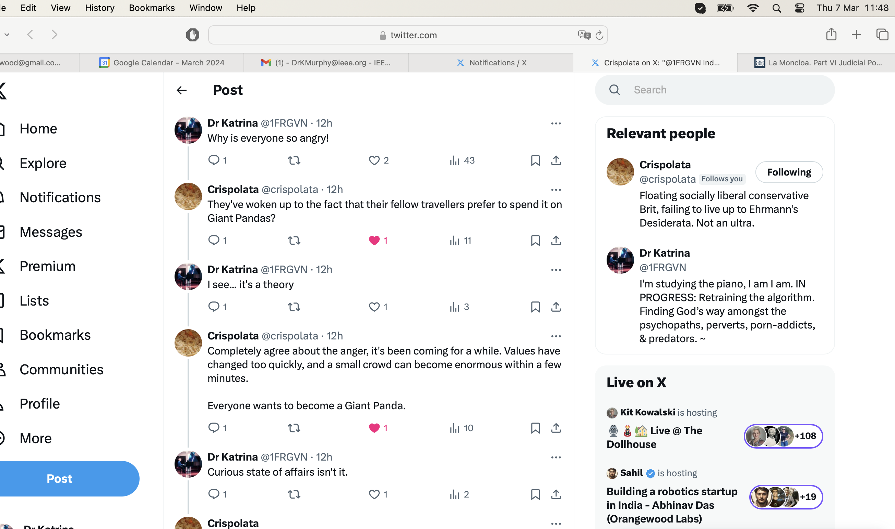
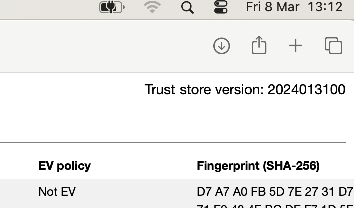
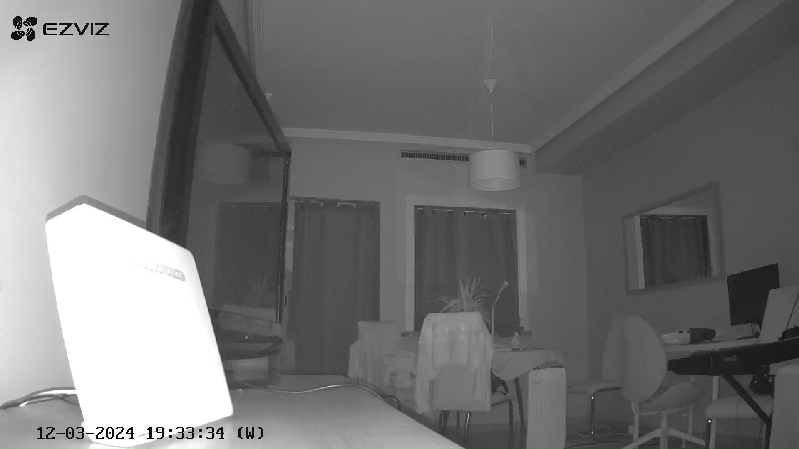
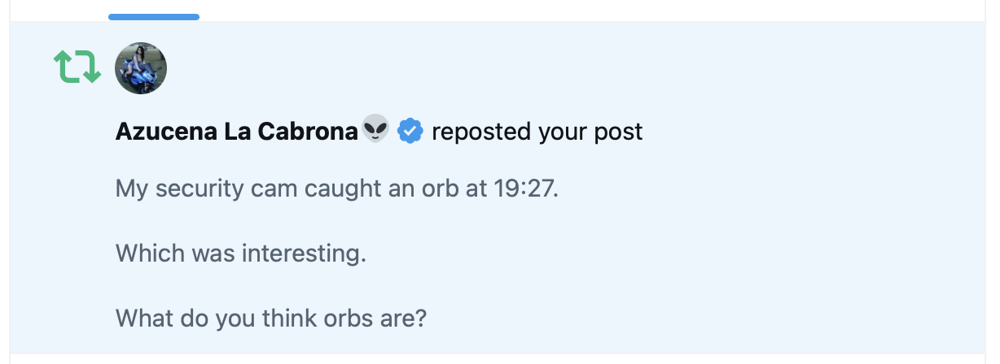

## Monday 4th March chamber music

- Esteve brings us a new song with two cats meowing at each other, Rossini's cat duet.
- The irony is not lost on me.
- I wonder if Esteve knows I am suffering from intense criminal gang stalking and violent harassment of my psycho/emotional state?

## Tuesday 5th March piano lesson

### An inspector calls

- I arrive at my piano lesson and, after a minute or two, all of a sudden, a woman enters the classroom.
- She is a large dark curly-haired woman of about 50 years old and I would recognize her again.
- Paqui explains the woman is an *inspector* from the Generalitat and she is here to help me.
- I feel like it's probably an ambush and put my phone on record.
- Paqui reiterates that the woman is here to help me with everything that's going on, and I understand that to mean because of how I previously told her I'm stressed because I'm being terrorized by Domingo and his mates. 
- The woman talks about having to get the police involved.
- I am delighted and express gratitude because something is finally happening after nearly two years of abuse instigated by a teacher, Domingo Cano.
- I ask her why the Generalitat has not replied to any of my emails or letters.
- She says they did but they not have my street address!
- She tells me they did reply in December but it came back to them because they did not have my street address. This is ridiculous.
- I mention that I sent the notices by email and that my address is in the systems and that they could have asked, or informed me, at any time.
- She ignores me. These are the documents she showed me.

    - [Document receipt copy with date info](../../content/documents/gv/8.%20Receipt%20date%20received%205%20March%20at%20piano%20lesson.JPG).
    - [The document receipt](../../content/documents/gv/8.%20Receipt%20of%20something%20from%20the%20Generalitat%201%205%20March%202023.jpeg).
    - [A part of the document they apparently sent](../../content/documents/gv/8.%20Receipt%20of%20something%20from%20the%20Generalitat%202%205%20March%202023.jpeg).

- Paqui looks nervous.
- I ask her for the content of the letter they sent which I do not see in the documents she has.
- The woman's tone is not at all friendly towards me. She says, oh that doesn't matter now.
- She starts saying everything is too public now and that the police will need to be called.
- I say thank God, I have been stalked for nearly 2 years, I wrote to the GV numerous times about this horrible situation where a student is being terrorized by teachers, and everyone ignored me so I would welcome the police getting involved.
- The woman is a bit taken aback, Paqui is very nervous, but she then goes on to reiterate that I have been saying things online and the police must be called.
- She starts asking me questions about what I'm saying on Twitter.
- I find it very threatening. 
- I tell her I don't like the way she is talking to me, and say that I'm not speaking to her further without a lawyer present.
- The woman leaves. I never hear from her or anyone else from the Generalitat again until I receive a letter in April after I have left my studies due to becoming afraid for my life.

## Wednesday 6th March

### Stolen iPad

- I can't find my iPad and I believe it is stolen.
- I ask Gloria at the conservatory if anyone has handed in an iPad.
- She becomes extremely concerned about it and we go looking around the building.
- She is really upset about the thought an iPad might have been stolen. I find it astonishing.
- Her concern for my iPad far extends any concern she might have had for me, a student, being terrorized by Domingo, a teacher, and his associates, which includes her of course.
- When we are upstairs, I speak to her about what's going on privately. I tell her I can't believe how it just goes on and on.
- She looks scared. She is shaking and her voice is trembling.
- I tell her "you know it's not just me they're looking at online". An alarmed flash crosses her face.
- She suggests I go and talk to Enric Gil who is works at the town hall in the capacity of welcoming foreign people who have just moved to the area.

### Enric Gil

- I go to see Enric. I know him already from  when I lived in Denia previously in 2006-9, and we had friends in common.
- I tell him everything. 
- As I start to mention the threats from Domingo he shuts me down.
- He says I should see the Denia local police who have a division for gender violence.
- We go outside.
- I'm speaking to him and he's laughing at me while I do. I wonder if someone is behind me making faces or playing the fool. It's unsettling.
- He goes to talk to a local police officer and comes back.
- He says I cannot raise anything with them as I don't have a partner and they only deal with male violence when it occurs within a partnership.

### Trying to find help

- I don't know what to do, where to turn, who to ask for help.
- The Policia Nacional are disinterested, the local police don't want to know, the Generalitat is suggesting they are going to have *me* arrested for being a victim of cyber stalking and gang stalking and talking about it on Twitter. It's overwhelmingly stressful.
- I have searched for a human rights lawyer and send some random emails to try and get help.
- I was able to finally communicate with the ECHR when I was in Brussels in July: https://x.com/1FRGVN/status/1811523447123558841.

!!! warning
    - The stress levels are really intensifying during this period.

### A donation to a twitter account

- I make a £100 donation to a Twitter account online: https://x.com/latsot.
- This is a well known account in the UK feminist communities and is even supported by https://niaendingviolence.org.uk/.
- At the very moment I make the donation, he posts this: https://x.com/latsot/status/1765118778684342347.
- A fake account comments on being jealous.
- I'm so concerned about this, I look up Rob Smith's websites, and I see he does an awful lot of fundraising but there are no pictures of him doing anything at all.
- I contact nia about it I'm so concerned but they're convinced he's legit.
- I wonder if Rob Smith is connected to Sandra and Hazel Smith.

### Carmen Cano

- Right after this, a fake account whizzes by on likes with the name Carmen Cano.
- I can only assume it is a message from someone to make me think Carmen Cano is behind the scam.
- Carmen Cano being Domingo Cano's sister.

### Scarfs from the lady who knows who I am

- I buy some scarves from a shop in the Calle La Mar, could be Vintage Ibiza.
- It's run by a polish woman who is very nice.
- We chat and I tell her I'm studying piano at the conservatory.
- She becomes very embarrassed and is unable to speak to me. She knows who I am.
- This shop had a picture in the window of Frida Khalo for months.
- Often, in the Google search results for `@jctot19` there were pictures of Frida Khalo and references to the trumpet teacher having another girlfriend.
- Ridiculous, I know.
- Amazing that the people of Denia would put so much effort into all this, and it must have cost a lot of time, effort, and money to keep it going. 
- I now wonder if they were perhaps making more money than they were spending from either:
    - Mass voyeurism on social media of "hunted" or targeted women in Spain.
    - Mass voyeurism of women being filmed on hidden cameras in their homes, possibly amateur porn networks, something I often saw in my Google results.
    - Mass voyeurism of people who enjoy watching others suffer.

## Thursday 7th March

### Hackers reference payments I have made

- I start to see references to payments I have made online, including exact figures, and sometimes even mentions of the payee.
- One was in reference to a charity gift I gave to a Twitter account around that time, after which I receive a follow from a fake account that was "jealous".
- Shortly after this, another remarkable set of tweet references were related to a monetary gift I had sent to my monk friend of 333 euros at Christmas.
- As you may remember, they refer to the monk as "panda".

- I'm pretty sure the `@crispolata` account is Hazel or Sandra Smith, or one of their associates.

### Change root password

- I change the root password on my laptop.
- The router is off.
- The following morning, Friday 8th March, half of my new root password appears on a fake account's profile message.

## Friday 8th March

### Report hacking to work

- I opened a Twitter account for work on my work laptop, I can't remember when.
- Immediately, I was followed by accounts with names related to the gang stalking.
- I filed it away, it was too much to deal with at that moment, although I did raise a ticket with IT at one point when I saw something weird.
- With everything going on, I realize it's time to tell the security department at my work I think I've been hacked.
- Gordon Bishop of Polygon Labs investigates. 
- He asks me to access 1.1.1.1 on my browser. What he's expecting to happen, doesn't happen. 
- He's expecting to see the WARP webpage but, instead, we get the login page for the network router.

- He also sees some weird stuff with Mac certificates.

- He asks me to check on FireFox too.

!!! tip
    - The screenshots above are from my work laptop.

- He says this is enough evidence of hacking through the router for them to lock me down and reformat my laptop.
- I have to work somewhere else, i.e. not at home, while I get a new router and change the ISP from Yoigo to Movistar.
- They put the `FalconSensorMacOS.MaverickGyr.pkg` on both my work and my personal laptop. The files are [here](https://drive.google.com/file/d/1MPTzekQ0o7pLizShUsWR_b-3qq73Aa-W/view?usp=sharing).
- A few hours later, a stalker account tweets about 11.11 and references relationships.

- The following day, I tweet about it.

- From this point, I block all my cameras on laptops and phones with post it notes, or paper and sticky tape. 

### Nowhere

- I get a desk at Nowhere co-working space in Denia: https://knowheredenia.com.

### I tweet about it

- Sharing information always makes me feel safer.
- The following tweets are translated a lot.
    - https://x.com/1FRGVN/status/1766039222308188548
    - https://x.com/1FRGVN/status/1766127546100228463
    - https://x.com/1FRGVN/status/1766062150693396914
    - https://x.com/1FRGVN/status/1766017527300149464

## Sunday 10th March

### Text my family at the Chinese

- Online, the stalkers are continuing to suggest I call my family.
- With my iPhone, I send a text to my mother's mobile number at the Chinese while I'm having dinner one Sunday evening.
- There is a celebratory noise from my phone, and from another phone nearby.
- I'm not able to get through to my mother.
- I believe they are trying to target my family now, with phone numbers, etc, for the purposed of fraud.
- Writing about this now, I realize that it was all too much to comprehend and so, like I always did with abuse, I noticed it, and filed it away until such time as I could deal with it.

## Monday 11th March

### Chamber music class

- I am extraordinarily stressed and explain to Katia that I am fearful for my life and I'm worried I'm going to be robbed.
- An account pops up over the next few days which appears to be [referencing Katia moaning about this publicly](../../content/images/fake-accounts/list/52.png).

### Cracked rib

- I crack a rib during yoga class.
- I wonder if whatever I'm ingesting that is making me extremely stressed and anxious causes bone thinning, because it happened again a few months later.
- I have to pause yoga for a month or so while it gets better.
- It's good timing.
- Some drugs make your bones thinner and make it more likely to experience this sort of thing.

## Tuesday 12th March

### Ana dresses as if she's pregnant

- The Ana girlfriend lie continues and, with the help of others, she choreographs ridiculous situations - i.e. tracks my movements using shared WhatsApp groups with the other teachers - in order that I see her going to the toilet dressed as if she is pregnant.
- It's around this time I am feeling like I want to have a child, although this has been on and off for months. I believe this is suggestions from Twitter or online hacking, subliminal messages, etc.
- On one of the last times I attended classes at the conservatory, probably Wednesday 13th March, Ana is playing trumpet music on her laptop and I hear it from her classroom as I walk by.

### A serious attack on my wellbeing from piano teachers at Denia conservatory

- On Tuesday 12th March, there is a end of term piano concert at the Casa de Cultura in Dénia.
- It's a huge set up, all meant to terrify me, probably give me a nervous breakdown, and maybe kill myself too.
- Each piece the kids play at the concert is related to things I have said on Twitter, or in letters to the Generalitat asking for help that were ignored.
- There are pieces with related names, including something like "Four Aunts" by a modern composer called Porsche Zavala (this is a horribly aggressive piece that Antonio Signes Argudo plays very well), [poison and aunts](../early-years/2014.md#back-in-denia), and other related things.

- Before we begin, people are coming in to listen. Many of them look at me and smile.
- I recognize a couple as [two people I saw on the beach](../2023/september.md#people-on-the-beach) following me and part of the group of people making sexual noises the September previous.
- At 7.30, the concert begins.
- At that moment, the lights go down, and the door to the hall opens, and in walks a woman who has dressed to look exactly like Elaine Black, my friend who committed suicide.
- She has done a really good job of it too. 
- I gasp.
- At precisely that moment, my security camera at home goes off and sounds an alarm on my phone. I don't have time to look.
- The woman dressed as Elaine (who I now believe to be Carmen Cano, Domingo's sister) and a man sit directly behind me, in seats that have been saved for them.
- Patricia, Christine BJ, and another English woman have come to listen. They maybe know what's going on, it's not clear. Certainly there is a frosty feeling, and when we walk out and I insist I'm going to continue playing the piano, and play some Spanish flamenco at the next concert, Patricia visibly grimaces.
- When I get home that night, I check my camera security camera. 

- There's an orb in the video it captured. 
- I post a Twitter poll about it: https://x.com/1FRGVN/status/1767647188698509820
- a stalker account retweets my poll and makes a weird comment.

- After the concert, I'm blocked from downloading the videos of the concert on the Generalitat's systems.

### My crypto account

- I lose access to my Coinbase crypto account that night.
- I don't know if they have stolen 70K from me or not.
- My account is completely locked.
- I'm really concerned about this.
- I tweet about it: https://x.com/1FRGVN/status/1768093834188087798.

## Wednesday 13th March 

### Translator

- It's time to go to the police again but I need a translator to help me deal with them properly.
- After my experience with the [police in Denia in February](february.md#policia-nacional), I believe I need firm proof of hacking before I can go to them again!
- I get a recommendation, Sara Lebanon, through an Irish woman Brenda who incidentally knows Alessandra very well. 
- I tell her everything, the child sexual abuse I suffered (she's very alarmed at this) and how it made me intolerant of children being sexualized at the conservatory, and how I had been targeted for basically mentioning that very informally in 2015. 
- She says to me, "Oh at least you know you're not imagining it." I wonder why she would say that. She says it a few times.

!!! important "Gaslighting"
    - *It must be a relief to know you're not imagining it*, and similar sentiments.
    - This is a recurring theme that's repeated to me by Sara here, Paul, Alessandra, Chris BJ, and others.
    - Paul says it one time I meet him, and retracts it the next time when he downplays everything.
    
- On the Guardia Civil website there's a list of experts who analyze devices for hacking for the police.
- We look one up and she phones him. 
- He is an expert in Alicante, Jorge. He sounds like he's totally stoned.

### Jorge checks some stalker accounts

- At some point, Jorge the expert looks at a list of stalker accounts that I send him.
- Here is his response:

- Here is the [whole WhatsApp chat with Jorge](../../content/whatsapps/WhatsApp%20Chat%20-%20Jorge%20Esclapez%20Deckcard23.zip).

### Choir class

- I turn up to choir class that evening.
- The teachers and the adult staff are extremely angry with me for showing up.
- They set up Pablo to "bump" into me on the way into class. He seems really upset he had to do this and I'm furious about that.
- In class, my security cam alarm goes off on my phone. I check it.
- I can hear, recorded on my security camera, a group of men making ghost noises; "woooo-woooo". I laugh.
- While I'm sitting in class, I text a message to Chris BJ saying something like "I think all this aggression is probably training for my political career".
- Both the choir teacher's and the woman who sits beside me's (French horn player) phones beep at about the same time to alert them they've received a WhatsApp message.
- They both read it at the same time.
- They both look at me angrily: https://x.com/1FRGVN/status/1773436669007380597.
- The choir repertoire includes a song about domestic violence which is very aggressive and unpleasant, a horrible irony.
- That night I become extremely anxious and scared.
- On my way home, through the tunnel, a man walks towards me grinning and blows in my face.

### Stalker activity

- Stalker activity this night is relentless.
- One of the fake accounts posts something like: "leave her, she's had enough now", and I felt an enormous upset. 
- I believe this statement is audible in one of the rape porn films taken from 1989, probably when I was sedated, which was likely quite violent.

### Chest infection

- I get very unwell after choir class, a cold which becomes a chest infection.
- It doesn't get better, it gets worse and worse.
- I'm extremely unwell for the next few weeks, and, in Madrid, I can hardly talk.
- Eventually, in India in the first week of April, I'm prescribed hardcore antibiotics and medicine for pleurisy.
- It's not before I have snapped a rib from coughing so hard.
- Notifications on fake accounts mention the coughing.
- The medication works and I recover in India.

## Thursday 14th March

### The dose ramps up

- I believe today the dose of anxiety causing substances was increased at my flat because I began to be extraordinarily stressed and scared the night of the 13th, probably after drinking a large mug of tea.
- Given that I was not fearful after the ridiculous piano concert on the 12th, and went to choir on the 13th, it seems reasonable to suppose I was relatively unaffected by this choreographed terror, perhaps I was getting used to it.
- However, the link to Elaine Black was extremely sinister and got to me.
- Eventually, I text and tweet to everyone that I would never commit suicide and, if I turn up dead and it looks like I did, it's suspicious: https://x.com/1FRGVN/status/1768046490272870687.
- The following morning I am severely anxious. I'm bumping my head on things. I have to go to town. I am terrorized the whole way in and out. I feel horrendous.
- I believe I was on serious drugs at this point that they were putting in the water.

### Practicing the piano 

- I go into practice at the conservatory.
- I had an errand to run in town and I felt like everyone was looking at me, staring, and the threat levels were intense.
- A van drives towards me with "VIDAL" on the front of it, which makes me smile but is actually rather threatening.
- I'm extremely anxious and feel really uneasy in the piano room.
- I call the British embassy from there looking for help. They tell me they can't do anything for me and suggest I go to the police.
- On the way out I see Gloria. She's laughing at me, and says; "finally you're leaving now".

### Nowhere big blokes

- I had been working at Knowhere that day before going in to practice.
- I went back to work
- After a while, five big Russian or Ukrainian blokes come in and stand opposite me at the desks. They are pretending to talk about the computer. They are dressed like labourers. They are extremely rough types, five of them.
- I find it extremely threatening.
- I decide to leave Denia.
- When I leave the offices about two hours later, they are outside at the exact the moment I step outside the door, surrounding a blond woman I've seen before in Denia.

### Madrid

- In fear, I leave Denia to go to Madrid and I stay from 14th-24th March at the AC Hotel Atocha by Marriot.

!!! important
    - My hotel costs run into the thousands but I feel I have no choice.

- The threats continue: https://x.com/1FRGVN/status/1769859075813101947.
- More threats: https://x.com/1FRGVN/status/1769860927296258167.
- When I get to Madrid, I buy a new Android phone for my Spanish SIM and a small analogue phone at a shop called Movixoz. A man in the phone shop appears to know who I am and says something threatening to me.
- I am followed and tracked in Madrid. 
- Things that I say to my friend at lunch are repeated on fake account profiles later on. This happens every time I go to Madrid to see my friend.
- I write a letter **by hand** to my parents and I date it the following morning. This is the first contact with them for nearly 3 years.
    - [Letter to parents of 15th March](../../content/documents/letters/letter-to-parents-march-15.pdf).
- I explain I'm being terrorized and by whom. I try to keep it calm because my parents are elderly, and I don't know how things are with them. I don't want to upset them too much.
- I tell them I believe that Domingo and his family are planning to murder me.
- I remind them of what he told me all those years ago, the threat of poisoning, something that I had told them at that time.
- While I'm in Madrid I reformat to factory settings both my Mac and iPhone. It doesn't appear to make any difference at all.

## 15th March

### Reporting the matter to the police in Madrid

- With the help of a friend I make a proper denuncia to the police in Madrid.
- The report goes well, although I am finding it very difficult to think straight, and my friend's translations and the consequent additions to the denuncia documents are not quite right.

    - [Denuncia page 1](../../content/documents/evidence/Madrid%201.JPG).
    - [Denuncia page 2](../../content/documents/evidence/Madrid%202.JPG).
    - [Denuncia page 3](../../content/documents/evidence/Madrid%203.JPG).

- I start to show the police officer some of the screenshots I have, including the picture of me in my pants they put on Google search.
- At that moment, the conversation is somewhat shutdown and she tells us that before they can investigate I need to get a cyber expert to examine my devices in order to prove I've been hacked.
- I'm astonished.

### Cyber expert

- We do some research into getting my devices examined for hacking so that I can amplify my report to the police.
- We find out to have this done can cost thousands.
- We find an expert in Alicante who is reasonable, and quotes 600 euros for a laptop, phone, and two webcams.
- My friend helps me [write a letter](../../content/documents/letters/Ampliacion%20Denuncia_Katharine.pdf) to David Piñeiro, the technical expert at D.P.R., Arzobispo Loaces, 17, Local 1 - 2, 03003 Alicante.

## 16th March

### Gaslight by Chris BJ

- Chris BJ gaslights me on WhatsApp by obviously and weirdly referring to a tweet I sent after the piano concert.

- When I ask her about it, she denies it.
- Throughout most of my communication with Chris BJ about the whole business there has been a high level of gaslighting coming from her, even though I shared all my documentation I sent to the Generalitat and other things.
- Her tone was always dismissive and given I knew she was obviously involved somehow, as I found out in January when I got such a weird reaction to talking about the trumpet teacher and was consequently uninvited from walking, I never trusted her fully, but she was useful.
- At the time of writing, I wonder if the English ladies have been involved in the terrorizing on Twitter too. It would not surprise me at all. It seems the whole region has been involved.
- I wonder if they're aware they were mobilized solely for the protection of pedophiles, and misogynist porn-gang fun incidentally.

## 17th March 

### Email to Paqui

- I [email Paqui](../../content/documents/emails/Letter%20to%20Paqui%2017-3.pdf) about the concert and subsequent events. I want her to clarify why I should feel fearful about going to the conservatory. She does not reply.
- Her silence speaks a thousand words.
- I realize I am indeed not safe so I excuse myself from classes following the week of Fallas which means public holidays in the Valencia region.

## Online threats during this period

### Google search

- This one references my private health matter which I told no one about except Google, but they all knew about it. 

### Twitter screenshots

- The B.A. Feldman account has been pretending to be the trumpet teacher for a while. Quite often, Trump features in accounts I'm supposed to believe are the trumpet teacher's.

- The following account is an example of a few which had pure violence as content around this time. 

### Random threats of violence

- Norma relates to chamber music class and the bullying there.

- Khadidjatu sounds like Ka did you too. Africas is related to a song at choir and my personal life.

- A very threatening message. This whole tweet conversation with this account was extremely threatening and phosphorous poisoning was mentioned.

- I wondered if this account was the technician guy at the conservatory or the owner of the mobile phone shop.

- Tyburski I took to mean they were going to tamper with my car. The comment is derogatory of course. Note this profile pic looks like the [nurse again](../2021/december.md#semen-stains-on-the-sofa).

- The message translates to: "TERF I live for revenge."

- Gone fission I took to refer to a conversation I had with Christine BJ at lunch where I was explaining how being stalked like this felt. This was back in probably November 2023 sometime. 
- I had said that I believe the trumpet teacher was going to be the man I married and that he was doing the "if he likes you he treats you badly" thing to nuclear fission levels.

- An account called `@HierEncore49002` converses with me on Twitter. Peppered throughout the chat are threats and references to jail, drugs, and poisoning. Here's the search: https://x.com/search?q=%20%20(from%3AHEncore49002)%20(to%3A1frgvn)&src=typed_query&f=live and following are some examples.

- Interesting deleted reference. I'll try and remember what it was. I think it was in reference to me going no contact with my family.

- I believe this account, like many others, is manned by either Hazel or Sandra Smith together with Domingo and Carmen Cano by delegation. 
- The reason I say that is because the English is extremely fluent, very vernacular for some messages, and then not at all.

### Ana account 

- I wonder if this was Ana Girbes by delegation or otherwise. 
- Whoever it was, the account interacted with me a lot and in a most unpleasant manner at times. 
- I guess it's entirely possible this is just a random account which happened to find itself in the middle of a professional cyber stalking attack, but I doubt it.
- Note she is calling herself `@loviatar` which is a bit of a play on words for avatar, and reminds me of the transformer figure I see on the `@jctot19` account every day, a figure which is drawn to look exactly like Ana Girbes, the musical language teacher at the conservatory.

- The evening after the following interaction, [Ana Girbes barks](january.md#ana-and-ana), literally, at me about my very private health matter that no one *could possibly* know about unless they had access to my Google search activity.

- I can see them all laughing and giggling together after terrorizing me in this way at the conservatory.

!!! danger
    - Another reminder that these people are responsible for other people's children.

- The account seems to be priming me to believe it is Ana Requena, and she is talking about her boyfriend the trumpet teacher. 
- A lot of posts from her make these suggestions.
- The account would go from being extremely mean to suddenly caring and kind. Here's the account being reasonable at one point.

- And this is an example of the sort of gaslighting I would get after having been terrorized, as if I was imagining it. 

### Elaine threats 

- Another account appeared to be a trigger to remind me of Elaine Black who had hung herself in July 2021 in Denia. 
- This account had been following me since January but the threat level ramped up in March.

- I thought `@kiwipally` was also a stalker account as they were very active at this time.

- The account no longer exists.

## 19th March

### Changing card PIN numbers

- I order a new bank card but I won't be able to use it until I get back to Denia in April.
- I decide to change the card PIN numbers on my bank cards in Madrid.
- This process is extraordinarily difficult, it is as if I don't have the mental capacity to do a simple task like this.
- It takes me three or four trips to the ATM machine at the banks to finally do it, a whole day in fact.
- I'm so unbelievably stressed, simple tasks like this are becoming extraordinarily difficult to complete.
- I'm not at home, and I haven't been at home for 5 days so I wonder now what is continuing to impede my cognitive ability so much.

## Continuing threats

### Mike Wenham

- Mike Wenham was an old boss of mine at my first ever programming job with British Telecom in 2010.
- He was a psychopath and had terrorized the one other woman at work so badly, she walked out.
- When she left, they turned on me. It was horrible; rape jokes, porn on my screen. 
- I was forced to leave before 6 months was done on my first ever job in tech after gaining my PhD. It was devastating.
- In 2014 his wife emailed everyone to tell us Mike had murdered a woman and would we be able to help with character references for the police as she thought he'd had temporary insanity.
- Turned out he had had a penis enlargement operation which had gone horribly wrong and he lost a few inches, and after that had become obsessed with murdering a woman; it all came out in court.
- He ended up found guilt of murder and imprisoned, even though some of his colleagues took the stand and said what a good bloke he was.
- I wrote about this on Twitter when I was anonymous, in 2021 and 2022:
    - https://x.com/1FRGVN/status/1434110111895654402
    - https://x.com/1FRGVN/status/1566353197878362114
- I never once mentioned Mike Wenham, the name of the murderer, and yet, I am DM'ed by an account that asks me about him.

- I looked at the profile of the account and it was a typical fake account used by stalkers, just a few messages and followers.
- The message on the timeline was very suggestive because I had just found my mum's Twitter account. My cousin Leah had found me somehow a while back and I believe she told my mum I was on Twitter and gave her my details. 
- I saw her following me and subsequently found out it really was her. Curiously, the hackers were more sure of that than me at that time! Initially, I had thought it was another fake account.

- Anyway, the whole interaction with this account was extremely threatening.

- Whoever it was had done a fair bit of research on my Twitter activity and background to it.
- Again, the English is extremely vernacular so it has to be a native.

!!! danger "Did Mike Wenham have murderous intent towards me personally?"
    - It turned out, around 2 weeks before Mike Wenham murdered Karolina, he had invited me out to drink ayahuasca, which I found rather strange, and I had refused.
    - After Karoline was murdered, I remembered that while I was working for Mike in 2010, December time, he had also been doing part time building in a house in Leslie Road just up from my road. He had insisted I come and see him at this house on a Saturday morning in mid-December 2010. I went. 
    - He had plastic all over the floors. It was a top floor maisonette and I was climbing the stairs. I noticed he had a stanley knife in his hand. Something didn't feel right and I left. He urged me to come up but I said I didn't have time.
    - I didn't think about it again until after the murder.
    - The similarities were extraordinary.
    - Could anyone from Denia be involved in these events? It seems unlikely ...

## 20th March

### Domingo Cano

- The account `@AllyBrisket` had always seemed suspicious to me.
- Samuel from harmony class back in [May 2023 when the cyber stalking really got going](../2023/may.md#harmony-class-that-week) may have signalled this account out to me during a weird chat.
- At this point I'm so stressed I start communicating with accounts directly as if they are who I they think they are.

## 24th March

### Valencia

- I return to Valencia on the 24th March and stay in the Barcelo from 24th-27th, and then the Holiday Inn Express near the airport from 27th-29th March.
- I have a flight scheduled from Valencia to India on 29th March returning on Saturday 6th April so I need to be back in Valencia.
- In Valencia I feel like I am being constantly watched, that people know who I am, and everything is extremely unfriendly and unpleasant. 
- I did not have this experience in Madrid.
- I believe now this is to do with whatever drug they gave me prior to me leaving, which was a high dose, and it has made me very paranoid.
- I wonder also if they managed to re-dose me somehow, or whether it was added to the car and so I got a dose after a long drive, or was the damage done at that point.
- I was extremely paranoid in Valencia and I was constantly stalked by fake accounts on Twitter.

## 31st March

### Letter to the Guardia Civil

- I write to the Guardia Civil from my hotel room in Mumbai.

    - [Letter in English](../../content/documents/evidence/civil-guard.pdf).
    - [Letter in Spanish](../../content/documents/evidence/civil-guard-spain.pdf).

- I print and send it registered from my Mumbai hotel.
- I don't know if anyone received it.

## Tweets

### `@1frgvn`

- https://x.com/january_myth/status/1772034747775992249 -> the Taru Ann account, which may be sometimes run by Patricia retweets a post from 29th August 2023, around the time the hackers are revealing themselves. I don't remember seeing it at that time but I may have and it just didn't register as connected.

- At the same time, she retweets a pic from 12th June 2023, which I have been unable to locate so [asked the account owner about it directly](../../content/tweets/long-long-way-to-go.png) and she has posted the pic: https://x.com/january_myth/status/1860955287672213591/photo/1 but not the poem that went with it. I remember seeing that one but, again, I made no connection to this account.
- I ask her about the poem.

- It's curious that she deleted the tweet from 12th June 2023.
- She just deleted a tweet replied to me today (Friday 29th November) in a way to **call out** the fact that she deletes tweets from time to time, except she never did it before today (Friday 29th November).
- I begin to suspect that whoever is managing the Taru Ann account could be well known to me.
- On September 22nd, after weird communication from Patricia all summer, I wonder if Taru Ann is Patricia from time to time by delegation: https://x.com/1FRGVN/status/1837596563557831058. The account likes my question in response. It could be anyone I guess but certainly someone involved somehow.

- https://x.com/1FRGVN/status/1764211138269422006
- https://x.com/1FRGVN/status/1764210826007728603
- https://x.com/1FRGVN/status/1764554104469180450
- https://x.com/1FRGVN/status/1764557706151538997
- https://x.com/1FRGVN/status/1764555858963222694
- https://x.com/1FRGVN/status/1765679070510026786
- https://x.com/1FRGVN/status/1766020478387306801
- https://x.com/1FRGVN/status/1766020032608227754
- https://x.com/1FRGVN/status/1766018992202813506
- https://x.com/1FRGVN/status/1766412512306618714
- https://x.com/1FRGVN/status/1768008919329198108
- https://x.com/1FRGVN/status/1768046490272870687
- https://x.com/1FRGVN/status/1770013466180387194
- https://x.com/1FRGVN/status/1770385824359608528 -> this was another tactic the stalkers used, posting my own tweets back at me, or liking them so that I would see the messages in order to terrorize me further.
- https://x.com/1FRGVN/status/1771830853091422337
- https://x.com/HEncore49002/status/1771577638932328955
- https://x.com/1FRGVN/status/1770308212945834336
- https://x.com/1FRGVN/status/1772072527218504061
- https://x.com/1FRGVN/status/1772071779210498481
- https://x.com/1FRGVN/status/1772075005066568065
- https://x.com/1FRGVN/status/1772074205938319624 -> pretty sure there is some sort of bet on.
- https://x.com/1FRGVN/status/1772059637384151485
- https://x.com/1FRGVN/status/1772071533839597976
- https://x.com/1FRGVN/status/1772070689496830409
- https://x.com/1FRGVN/status/1772062320069398540
- https://x.com/1FRGVN/status/1772060317524070527
- https://x.com/1FRGVN/status/1772080804933357870
- https://x.com/1FRGVN/status/1772255398801576139
- https://x.com/1FRGVN/status/1772602721276751926 -> apologizing for not being able to go to choir because I am in fear for my life.
- https://x.com/1FRGVN/status/1773059705549508827 -> Paqui on a fake account. She looks like she wants to kill herself.
- https://x.com/1FRGVN/status/1773450210930270351
- https://x.com/1FRGVN/status/1773459307423568301
- https://x.com/1FRGVN/status/1773488720185798746
- https://x.com/1FRGVN/status/1773488467281936384

### `@JackChardwood`

- It seems the tweets in here for this period are mostly related to romance and relationship, i.e. keeping the lie going.
- Here's a link to the search: https://x.com/search?q=(from%3Ajackchardwood)%20until%3A2024-03-31%20since%3A2024-03-01&src=typed_query&f=live

