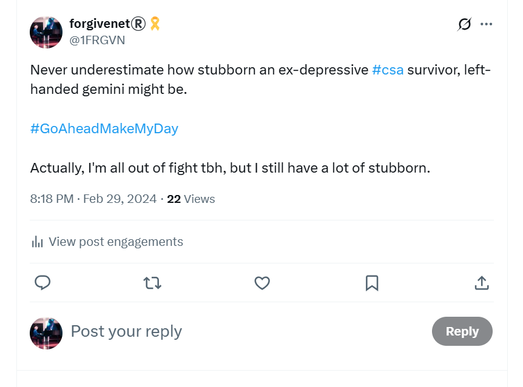

# March 1st-12th 2024

## Monday 4th March chamber music class

- Esteve the chamber music teacher brings us a new song to perform.
- It is [Rossini's cat duet](https://en.wikipedia.org/wiki/Duetto_buffo_di_due_gatti) for two sopranos and piano.
- The irony is not lost on me.

<iframe width="504" height="378" src="https://www.youtube.com/embed/nRFCQ7A4GBI" title="Montserrat Caballé a Montserrat Martí - Duetto Buffo Di Due Gatti" frameborder="0" allow="accelerometer; autoplay; clipboard-write; encrypted-media; gyroscope; picture-in-picture; web-share" referrerpolicy="strict-origin-when-cross-origin" allowfullscreen></iframe>

- Katia didn't turn up for class that Monday so the other lady and I are practicing together.
- I find the whole thing rather amusing and laugh. I guess I'm supposed to be offended, stressed, terrorized, etc., but it is just too ridiculous for words.
- Esteve is surprised at my reaction and asks, "do you find it funny?"
- What did he expect?
- I wonder at that moment if Esteve is aware that I am suffering from intense criminal gang stalking and violent harassment online and in the town.
- I can't believe it, he's such a lovely fellow. In retrospect I guess I was wrong about everyone but the question remains, to what degree was I wrong about him.
- Curiously, as I am accompanying the other student meowing loudly, a black and white cat comes up to the window, and sits, and listens.
- I point the cat out to everyone. 
- They both look and are slightly amazed.
- You can ask them about that :)

### A fake account with Esteve's face as profile

- In April, I'm followed by an account `ChoralSymphony` with a profile picture of Esteve on it.

- This account is either run by [Hazel Smith herself](../../early-years/2007.md#hazel-smith), or someone pretending to be her, perhaps someone from the Cano family?
- Whoever it was, they knew a lot of extremely private matters about her that only I knew, and had *never told anyone*.
- Even in October 2023, [when I tweeted the story on X of how I had been drugged - possibly with the intention of murder in Denia in 2007](../../2023/october.md#tweeting-about-being-spiked-in-2007), and very *very* interestingly just after waking up in the wee hours and feeling compelled to do so, even then I never mentioned her name. 
- But, if she was part of the constant surveillance, she would have known immediately. 
- Just a few days before Esteve's class, I had reported another fake account with a photo of Hazel's face mixed with mine by an AI process.

- Another fake account pops in right after.

## Online communication with gang-stalkers

### Porn fatwa

- Sometimes, I tweet messages which show how I'm always trying to figure out what is going on.
- I'm getting close to [the truth](../../early-years/2003.md#porn-fatwa) here.

### I tell them why I won't leave

- I've thought about it carefully, and I realized leaving my studies at the conservatory - and away from people who might notice me go missing, or die, or whatever - would put me in enormous danger.
- I tweet polls and explain my thinking on this in detail.

- The following two tweets are in conversation to someone close to the matter suggesting I should leave.

- It's interesting that given indeed they do get me to leave my studies in a matter of weeks from now, I'm still working for Polygon, so they can't dispatch with me while I'm turning up for meetings every day online.
- Is this why they manipulated the job at Polygon for me? So I would have a lot more money to rob in a violent honey-trap relationship.
- I would also be extremely easy to [fire, isolate, and destroy forever](../../2024/october.md#polygon-fires-the-whole-writing-team) while being live-streamed to the world?
- Did the whole Polygon staff, as well as [British node operators given bus tickets sitting beside me](../../2023/september.md#polygon-node-operators-on-the-bus-home), know what was happening to me?
- How many of my colleagues were paying for live-stream subscriptions of me sedated in my Dénia apartment?

### Reporting being drugged

- Is this tweet evidence of being drugged again?

### Reporting cyber-stalking intensity growth

### Winding them up

- I admit, I really enjoyed winding them up.

- Nevertheless, I constantly try to communicate normally with them too.

### The forgivenet

- I never stop thinking about how much these people could help my forgiveness app get going.
- They would be an ideal first batch of genuine users, imho.

## Tuesday 5th March piano lesson

### An inspector calls

- I arrive at my piano lesson.
- Paqui Fornet, my piano teacher, is busy at her desk.
- I wait, and a moment later there is a knock at the door.
- The director of the conservatory, Jaume Signes, is at the door with a woman I've never seen before.
- Jaume introduces the woman briefly to Paqui and leaves.
- I'm feeling excessive stress at this moment. 
- My arms feel very heavy and it's difficult to move them.
- The woman is a large, dark, curly-haired woman of about 50 years old and I would recognize her again.

- Paqui explains the woman is an *inspector* from the Generalitat and she is here to help me.
- Paqui repeats the phrase that the woman is *here to help me* a number of times.
- I feel like it's probably an ambush and put my phone on record, except my fingers aren't working properly and I'm not sure if I have done it correctly.
- The women are not concerned I might be recording them.
- Paqui reiterates that the woman is *here to help me* with everything that's going on.
- I understand this to mean that she is here to help me because I previously told Paqui I was [being terrorized by Domingo Cano and his associates](../january.md#i-tell-paqui-im-being-terrorized-by-teachers-and-staff-at-the-conservatory) and was concerned about my safety.
- The first thing the woman says is they are going to get the police involved.
- I am delighted and express gratitude because something is finally happening after nearly two years of abuse instigated by a piano teacher.
- Paqui looks nervous.
- I ask the inspector why the Generalitat has not replied to any of my emails or letters.
- She tells me they did reply in December 2023 but the letter was returned because they did not have my street address. This is ridiculous, obviously.
- I mention that I sent all my complaints by email, from my email address which they have, and that my street address is in the systems, and that they could have asked me, or informed me, or replied to me at any time.
- She ignores me and shows me the enclosing envelope and the return notice from the post office.

- [The document receipt in full](../../../content/documents/gv/8.%20Receipt%20of%20something%20from%20the%20Generalitat%201%205%20March%202023.jpeg).

- I ask her for the content of the letter they sent, which I do not see in the documents she has.
- She says, *oh that doesn't matter now, it's too late for that now*.
- The woman's tone and demeanor is not at all friendly towards me. 
- She wants to know about my social media activity, particularly on X.
- She suggests I have been saying things I shouldn't have been saying.
- She says *everything is too public now and the police will need to be called*.
- I say something like *thank God, I have been stalked for nearly 2 years, I wrote to the GV numerous times about this horrible situation, so I would very much welcome the police getting involved*.
- The woman is a bit taken aback; Paqui looks even more nervous.
- The woman then goes on to reiterate that I have been saying things online and the police must be called.
- I ask her what *exactly* she has a problem with?
- She doesn't reply and instead starts asking me questions about what I'm saying on Twitter.
- I find it very threatening. 
- I tell her I don't like the way she is talking to me, and say that I'm not speaking to her further without a lawyer present.
- The woman leaves. 
- I never hear from her or anyone else from the Generalitat again until I receive [a letter in April ignoring all my complaints and saying there is nothing untoward going on at the conservatory](../april.md#response-from-generalitat).
- They send this letter after I have left my studies due to becoming genuinely afraid for my life.
- Is that what they were hoping would happen over [Christmas when the gang-stalking broke all scholarly boundaries](../../2023/december.md#christmas), and yet I still returned?
- I can only assume that everyone, top to bottom, knew *exactly* what was happening to me, and in fact welcomed it as long as it got me to leave my studies as soon as possible.
- Furthermore, the constant noise I was making about what was going on online must have been making everyone extremely uncomfortable.
- I guess I had to be silenced and gotten rid of.
- Once I was gone, I expect they thought they would be able to get back to [normal operations](#domingo-adjusts-the-childs-rucksack).
- My suspicion is that normal operations never once ceased; not then and not today, with the blessing and support of the Spanish government and police.

### I make a donation on X

- I get home and while I'm on X I decide to make a £100 donation to an X account online: https://x.com/latsot.
- I'm extremely stressed after my [horrible piano class](#an-inspector-calls).
- I always found being generous and helping other people in need somehow has a stress-reset button.
- The account is a well known fundraiser in UK feminist communities - i.e. middle-aged women with money to spend, the juiciest morsels.
- The account holder, *Rob Smith*, raises funds for a women's charity: https://niaendingviolence.org.uk/.
- At the very moment I make the donation, literally when I click the submit button and the payment is approved, he posts this:

- Then, a fake account flies by with a comment about being jealous.
- I'm so concerned about these two notices, I look up Rob Smith online.
- I see that he does an awful lot of fundraising but there are no photos of him actually doing anything at all.
- I [contact nia about it](../../../content/documents/emails/nia-email-concern.pdf) I'm so concerned but they're convinced he's legit.
- I start to wonder if Rob Smith is connected to Sandra and Hazel Smith.
- Hazel did mention having a brother when [we met in 2007](../../early-years/2007.md#hazel-smith).

!!! tip "The names"
    - A criminal involved in drugging and poisoning may well consider taking a false name containing a reference to addled minds such as *haze* for example.
    - A criminal involved in lies, subterfuge, and distraction may well consider a false name containing a reference to *throwing sand in the eyes*, maybe. (I never knew so many dodgy Sandra's before.)
    - A criminal involved in stealing middle-age women's money may well consider an extremely obvious fake name.
    - The porn gangs love to tell everyone what they're doing while they do it, sometimes even years before they do it, as we have seen in this statement.
    - It gives them a little kick, a *razón d'être* perhaps.
    - It belies their deep and understandable sense of utter worthlessness.

### Carmen Cano

- Right after this, a fake account whizzes by on likes with the name Carmen Cano.
- I can only assume it is a message from someone to make me think Carmen Cano is behind the current scam.
- Carmen Cano being Domingo the piano teacher's sister.

- I took the screenshot the following day.
- Is Carmen Cano managing Rob Smith's account too?

## Wednesday 6th March

### Stolen iPad

- I can't find my iPad.
- I look everywhere.
- I believe it is stolen.
- When I go to practice the piano, I ask Gloria if anyone has handed in an iPad just in case I left it in the building.
- She becomes extremely concerned, *extremely concerned*, and we go looking for it in various rooms around the building.
- She is really upset about the thought an iPad might have been stolen from the conservatory.
- She exclaims, *nothing is ever stolen from here*!
- I find her exaggerated worry about this astonishing.
- Her concern for my iPad far extends any concern she might have had for me, a student, being terrorized and sexually groomed by Domingo, a teacher, and his associates (which includes her of course).
- Her cognitive dissonance shrieks at me.
- When we are upstairs, I speak to her about what's going on privately.
- I tell her I can't believe how the terror and harassment just goes on and on.
- She looks scared. 
- She is shaking and her voice trembles when she speaks.
- I say: *you know it's not just me they're looking at online*.
- An alarmed flash crosses her face.

- She suggests I go and talk to Enric Gil who works at the town hall in the capacity of welcoming foreigners who have just bought houses and moved to the area.
- (She's getting rid of me, and someone will be phoning Enric to warn him I'm on my way, most likely.)
- I get home later and find my iPad in a place I'm sure I checked a 100 times.
- My constant state of anxiety makes me think it was my mistake all along.
- It wasn't.

### Enric Gil

- On Gloria's suggestion, I immediately go to see Enric Gil at the town hall.
- Enric is foreigner liaison officer for the local council.
- I know him already from when I lived in Dénia previously in 2006-9.
- We had friends in common, Anne & Pete who since left Spain to return to UK, at least that's what Enric tells me.
- I tell him everything that has been going on.
- As I start to mention the threats of poisoning from Domingo he shuts me down.
- He says I should see the Dénia local police who have a division for gender violence.
- He calls them and then says let's go outside.
- We go outside.

- While I'm speaking to him outside, he laughs at me from time to time. It's very disconcerting given the information I am sharing.
- It seems like someone is standing behind me, as I speak, and making faces or playing the fool.
- It's very unsettling.
- There is a local policeman in the square in front of the town hall.
- Enric says he will go and speak to him.
- I watch him walk over and talk to the local police officer for a short time.
- Enric comes back.
- He says I cannot raise anything with them as I don't have a partner, and they will only deal with male violence when it occurs within a partnership.

### Trying to find help

- I don't know what to do, where to turn, who to ask for help.
- The Policia Nacional are disinterested, the local police don't want to know, the Generalitat is suggesting they are going to have *me* arrested for being a victim of cyber-stalking and gang-stalking by their employees and talking about it on X. 
- It's overwhelmingly stressful.
- I have searched for a human rights lawyer and I send some random emails to try and get help, but no-one ever replies to me.
- (I was able to finally communicate successfully with the ECHR when I was in Brussels in July 2024: https://x.com/1FRGVN/status/1811523447123558841. Soon after I write to them, the ECHR inform me they will *not* be doing anything to help me and give no particular reason.)
- The stress levels are really intensifying during this period.
- I feel completely isolated and in imminent danger.
- God is with me, nonetheless, and I'm certain of it.
- I pray and I find the strength to go on with my head held up.

### Scarves from the lady who knows who I am

- On the way home, I buy some scarves from a shop in the Calle La Mar, could be Vintage Ibiza.

- It's run by a Polish woman who is very nice.
- She has the scarves outside on the street and I've been looking at them for a few weeks and thinking I might buy some for my upcoming trip to India.
- We chat and I tell her I'm studying piano at the conservatory.
- She becomes very embarrassed, flushed and tongue-tied.
- She knows who I am.
- This shop had a picture in the window of Frida Khalo for months.
- I would see it every time I walked by on my way home from the conservatory.
- Often, in the Google search results for `@jctot19` there were pictures of Frida Khalo with references to the trumpet teacher having another girlfriend.
- Ridiculous, I know; or was it sinister rather than ridiculous?
- I thought it amazing that the people of Dénia would put so much effort into all this, and it must have cost a lot of time, effort, and money to keep it going. 
- But perhaps they were making more money than they were spending from either:
    - Mass voyeurism on social media of *hunted* or targeted women in Spain.
    - Mass voyeurism of women being filmed on hidden cameras in their homes, possibly on amateur porn networks, something I often saw in my Google results.
    - Mass voyeurism by people who enjoy watching others suffer.
- Or was this indeed another girlfriend of one of the trumpet teachers, and all his multiple girlfriends in the region know exactly what he is and what he's been up to for decades?
- My sense was the [third trumpet teacher was her boyfriend](../../../crimes/protagonists/vidal-sastre.md#an-unknown-man-i-may-have-a-picture-of); a large and lumbering man you wouldn't be able to say no too if he insisted.
- Could all the *girlfriends* have consented? Or did they have no choice?
- As we have seen, a single foreign businesswoman would be a target of choice for the gangs. 
- Is there a foreign businesswoman in Dénia who has not been targeted?

## Online activity over the last couple of days

- I formally put the Smiths on notice. 
- I wonder how many other people understood what this tweet meant.

- A stalker account, `@auralfixation`, seems to suggest they know who lives upstairs, or who hangs out upstairs on [Monday nights after chamber music and beyond](../../2023/january.md#noises-upstairs-after-mondays-chamber-music-classes).

- I post parallels to my experience, namely the Wayne Couzens sex offending that was obvious to everyone prior to it escalating into murder.

## Thursday 7th March

### Fake accounts reference payments I have made online

- I start to see references to payments I have made online, including the exact figures, and sometimes even mentions of the person I paid too.
- One example was in reference to curious activity on X at the time [I make a charity donation to an X account](#i-make-a-donation-on-x) I mention above, after which I receive a follow from a fake account that suggested someone was *jealous*.
- Shortly after this, another remarkable set of X references came in related to a monetary gift I had sent to my Tibetan monk friend, Lama Ashak, of 333 euros at Christmas.
- As you may remember, [they refer to the Tibetan monk as *panda*](../../2023/september.md#the-tibetan-monk-visits).

- The *completely agree about the anger* statement is a direct reference to my situation, and somewhat threatening.

- I wonder if the *Sexless* mention here is a distraction from the truth. If so, it suggests *panda* might have not been masked up and perhaps was even wearing his robes. I do hope I'm wrong about that.

- I'm pretty sure the `@crispolata` account was run by Hazel or Sandra Smith, or one of their English-speaking associates in the area.

### Changing my laptop's root password

- That night, I change the root password on my laptop.
- The router is off. I turn the network off at night.
- The following morning, Friday 8th March, half of my new root password appears on a fake account's profile message on X.
- I'm in no doubt at all there are key-loggers on all my devices, and every letter I type on any of my devices is being read by Dénia criminals, and maybe even teachers and staff at the conservatory too.

## Friday 8th March

### Reporting hacking to Polygon Labs

- I realize it's time to tell the security department at my work that I'm hacked.

!!! tip "I noticed evidence of cyber-stalking from the moment I received my Polygon laptop"
    - I opened an X account on my work laptop, probably about a week after I joined in November 2023.
    - I used it throughout my tenure.
    - I can't remember the account name but may have it written down somewhere.
    - The day after I opened the account, I was followed by numerous fake accounts with names and profile messages related to myself and the Dénia gang stalking.
    - I filed it away; it was too much to deal with at that moment, although I did raise a ticket with IT at one point when I saw something extremely weird.
    - They found nothing at that time but they did no serious investigation.
    - The IT operative who helped me at that time was John Michael.
    - He was sleeping in the hotel room next to mine at the [Bali offsite in May 2024](../may.md#bali).

- Gordon Bishop of Polygon Labs security team investigates. 
- He asks me to access 1.1.1.1 on my browser. 
- What he's expecting to happen, doesn't happen. 
- He's expecting to see the WARP webpage but, instead, we get the login page for the network router.

- He also sees some weird stuff with Mac certificates.

- He asks me to check on FireFox too.

!!! important
    - The screenshots above are from my work laptop.

- He says this is enough evidence of hacking through the router for them to lock me down and reformat my laptop.
- I have to work somewhere else, i.e. not at home, while I get a new router and change the ISP from Yoigo to Movistar.
- They put the `FalconSensorMacOS.MaverickGyr.pkg` on both my work and my personal laptop. 
- The files are [here](https://drive.google.com/file/d/1MPTzekQ0o7pLizShUsWR_b-3qq73Aa-W/view?usp=sharing).
- A few hours later, when I return from lunch, a stalker account tweets about 11.11 and references relationships.

- The `@CabronaVirusV69` account no longer exists. I get the feeling it might have been run by Zoe BJ or someone close to her.
- I believe this tweet was in answer to this one: https://x.com/1FRGVN/status/1766017527300149464.
- The following day, I tweet about it.

- From this point onwards, I block all my cameras on laptops and phones with post it notes, or paper and sticky tape.
- I forget to block the outgoing camera on the phone, and only block the selfie view cameras. I realize my mistake in October 2024 when hackers [post pictures of my Fatima hotel room](../october.md#fatima-20-26th-october).

### zkSync and DigitalAsset

- I also inform my previous jobs at zkSync and DigitalAsset that I believe I am hacked by local criminal gangs, including while I was working for them.
- I send emails and get responses.
- I feel it's important that they know what has been going on in case of industrial espionage and the fact I sign NDAs for all the companies I work for.
- I didn't tell Consensys. Perhaps I should have.

### Nowhere

- I get a desk at Nowhere co-working space in Dénia: https://www.knowheredenia.com/.
- I intend to work from here for the next couple of weeks while I sort out the router.

### I tweet about what's been happening

- Sharing information always makes me feel safer.
- It happened to be Shivaratri also. Wow.

- These tweets read like they're coming from a extraordinarily anxious woman.
- They were.
- This one is maybe the first time I offer a reward for any illegal videos of me.

- I am really upset.

- I put all the accounts I believe are part of the stalking into a pic and post if with a description of what's happening to me. I apologize if anyone's account got into the pic by accident.

## Sunday 10th March

### Text my family at the Chinese

- Online, the stalkers are continuing to suggest I call my family.
- With my iPhone, I send a text to my mother's mobile number at the Chinese while I'm having dinner one Sunday evening.
- There is a celebratory noise from my phone, and from another phone nearby.
- I'm not able to get through to my mother.
- I believe they are trying to target my family now, with phone numbers, etc, for the purposed of fraud.
- Writing about this now, I realize that it was all too much to comprehend and so, like I always did with abuse, I noticed it, and filed it away until such time as I could deal with it.

## Monday 11th March

### I tell my team at Polygon

- wip.
- What I say, from where, and their reactions.
- Esp Hans over concern and eagerness to repeatedly urge me to reach out any time.

### Chamber music class

- I am extraordinarily stressed and explain to Katia that I am fearful for my life and I'm worried I'm going to be robbed.
- An account pops up over the next few days which appears to be [referencing Katia moaning about this publicly](../../../content/images/fake-accounts/list/52.png).

### Cracked rib

- I crack a rib during yoga class.
- I wonder if whatever I'm ingesting that is making me extremely stressed and anxious causes bone thinning, because it happened again a few months later.
- I have to pause yoga for a month or so while it gets better.
- It's good timing.
- Some drugs make your bones thinner and make it more likely to experience this sort of thing.

## Online activity over 7th-11th March

- wip

## Tuesday 12th March

### Pablo is given a role again

- I'm walking into Denia to attend harmony classes with Alfonso.
- As I approach the road of the conservatory, Pablo from my chamber music class comes out of a doorway. He looks frustrated and upset. I realize he has been asked to join in the choreography of terror against me.
- I feel bad for him and run past him.

### Domingo adjusts the child's rucksack

- Teachers glare at me angrily as I enter the conservatory. 
- It's a warning.
- Domingo has his hands on a small girl of about 6 years old's shoulders, apparently adjusting her rucksack.
- They're on the steps going up to the front door as I pass them.
- He glances at me meaningfully in the way he does.
- It looks like he is adjusting her rucksack but I wonder now if this is a demonstration for my benefit of the power he has over very young children and how no-one can do a thing about it.
- Is this how they drug people; create a diversion and add powder into the neck area or ear maybe?

### Ana dresses as if she's pregnant

- The Ana girlfriend lie continues and, with the help of others, she choreographs ridiculous situations - i.e. tracks my movements using shared WhatsApp groups with the other teachers - in order that I see her going to the toilet dressed as if she is pregnant.
- It's around this time I am feeling like I want to have a child, although this has been on and off for months. I believe this is suggestions from Twitter or online hacking, subliminal messages, etc.
- On one of the last times I attended classes at the conservatory, probably Wednesday 13th March, Ana is playing trumpet music on her laptop and I hear it from her classroom as I walk by.

### A serious attack on my wellbeing from piano teachers at Dénia conservatory

- On Tuesday 12th March, there is a end of term piano concert at the Casa de Cultura in Dénia.
- I leave from the conservatory and walk over to the venue.
- It's a huge set up, all meant to terrify me, probably give me a nervous breakdown, and maybe kill myself too, it's certainly intended to make me leave the conservatory for good.
- I arrive and sit in my alloted place in the front. Behind me, rows of parents are sitting.
- There are two empty chairs directly behind mine.
- I see Trish Penny, Chris BJ and another one of the walkers arrive and sit at the back.
- Each piece the kids play at the concert is related to things I have said on Twitter, or in letters to the Generalitat asking for help that were ignored.
- I'm surprised and somewhat alarmed to see the little Romanian boy who had been so energetic and full of life whenever I saw him previously looking so unwell and anxious. It makes me wonder.

!!! danger
    - I'm really worried about this boy now, he was a beautiful boy.
    - Could they be so sick and twisted, they were demonstrating proudly what they do to children?
    - Just like [the two drugged girls](../../2022/june.md#maria-and-domingo) in June 2022.
    - Or the [girls at the audition](../../2022/june.md#conservatory-audition).
    - Or [Elvira in her vest](../../2023/may.md#elvira).
    - Or the [tiny child Domingo was apparently helping](#domingo-adjusts-the-childs-rucksack). 
    - Horrifying.
    
- There are pieces with related names, including something like "Four Aunts" by a modern composer called Mercedes Zavala (this is a horribly aggressive piece that Antonio Signes Argudo plays very well), [poison and aunts](../../early-years/2014.md#poisoned-aunts), and other related things.

- Before we begin, people are coming in to listen. 
- Many of them look at me and smile at me.
- I recognize a man as [someone I saw on the beach](../../2023/september.md#dog-tags-and-his-missus) in September 2023. 
- Him and a woman followed me every day I went to the beach; he was always wearing dog tags.
- He was part of the group of people making [sexual noises on kitchen chairs](../../2023/september.md#rape-gang-reminders) over the same period.
- Medium build, balding light-hair, white skin.. I'll do a pic later.
- The main door is shut, and people keep opening it to come in loudly. I believe this is for setting up the next scene so I don't miss it.
- At 7.30, the concert begins.
- At that moment, the lights go down, everyone is quiet, the door to the hall opens, and in walks a woman who has dressed to look exactly like Lorraine Blackbourn, my friend who committed suicide.

- She has done a really good job of it too. 
- I gasp.
- At precisely that moment, my security camera at home goes off and sounds an alarm on my phone. I don't have time to look.
- The woman dressed as Lorraine (who I now believe to be dog tag's missus, Carmen Cano is too short and slim for this woman who was quite chunky) and a man, dog tags, the man who smiled at me previously, sit directly behind me, in the seats that have been saved for them.
- Beside these seats, the beautiful boys parents are sitting looking upset.
- I remember the father's face for some other reason too. He won't look at me.
- When I go up to play, I'm certain I'm not leaving my handbag at my chair (as I usually would) because these criminals are sitting right behind me. Instead, I take my bag onto the stage and leave it on the floor by the piano.
- I do a surprisingly good job with the Mozart Sonata I've been memorizing, apart from the last bit which I muck up. The pounding heart, screaming nervous system, and overwhelming stress is somehow helpful in getting focused on the job at hand.
- Patricia, Christine BJ, and another English woman have come to listen. They probably know what's going on, it's not clear. They're pretending not to know if they do know. Certainly there is a frosty feeling.
- When the concert is over I go to talk to them. They're sitting at the back.
- I'm watching the protagonists - Paqui, dog tags, the woman who has dressed as Lorraine - chatting and laughing at the front while I talk to them.
- Paqui eventually comes over. 
- She makes the Hindi god hand movement that I make every time I'm watching the Hanuman show on my sofa at home and they do it on the show.
- She's been watching my activities in my house, and she wants me to know it.
- I high-five her raised hand instead. Her eyes register confusion.
- She says how was it. I say *I'm very happy*.
- She walks off.
- When myself and the walkers leave, I insist I'm going to continue playing the piano, and play some Spanish flamenco at the next concert.
- Patricia visibly grimaces.
- When I get home that night, I check my camera security camera. 

- There's an orb in the video it captured. 
- I post a Twitter poll about it: https://x.com/1FRGVN/status/1767647188698509820
- a stalker account retweets my poll and makes a weird comment.

- After the concert, I'm blocked from downloading the videos of the concert on the Generalitat's systems.
- I literally think these people are total idiots.
- I go into practice the piano at the conservatory the next morning.

## Online stalkers

- Although I believe I've done a good job at describing the continuous online terror, and posting screenshot references to it happening, it's hard to really write about the intensity of it over this period.
- I was stalked *incessantly* by fake accounts I never saw again.
- *You don't want me to get my flying monkeys, do you?*, she (Hazel Smith I believe) would call them later on in the year, threatening the same.
- Any time I posted something revealing, or published a snippet of this police statement online, the *flying monkeys* would come out, and I would know I'd touched a nerve.
- It was encouraging.
- Aside from the *flying monkeys*, which I believe were generated by an elaborate and extremely process-heavy AI tech-system designed to spin-up 1000s of accounts in seconds for targeting normal people with specific emotional content (in my case fear anxiety and threat over this period, but previously and again in the not so distant future it will be sexual desire) there were some repeat offenders using the same account over and over, as we have seen, and stalking me via those.
- Sometimes, it was as if these account all came out together; like they were on the clock.

.

- Here are some of the more important ones.

### `@AniLoviator`

- This account is very interesting indeed.
- It tag-teamed with other accounts during this period, with the specific intention of cyber-stalking myself, such as with the [`@SeonaidDawn`](#seonaiddawn) account below.
- A series of tweets described a predatory male family member and what she (the account) had to put with. 
- Many of the account's tweets have been deleted.
- Some of these conversations took place over a few days.

- Note the "not done annoying you yet" reply below which seems to be confirmation of stalker-gang-membership. 
- I answer as if I believe it is the trumpet teacher (the reference to *swami*). 

- It occurs to me at this point was there some sort of *trumpet teacher* mental trigger that threw my mind off the fact I was having a conversation with a woman experiencing extreme male violence.
- I wonder why she said she's hard to get rid of.
- I don't know who it is but I know it is someone involved in the cyber-stalking. I know it isn't the trumpet teacher, even though I responded as if it was the day before.

#### Apropos of nothing

- The account says sorry to me for no reason.

- Again, for me, this is proof whoever is running this account knows exactly what is happening to me and saying sorry for it is another twist of the knife.
- Later, I start to wonder who would use a term like *apropos of*.
- Certainly, you would have to have been very well educated, or over 70, to use a term like that in an environment like this.
- I wondered if it might be one of the Spanish music teachers; extremely well educated individuals and often with a stronger grasp of English than many of us natives.
- However, I now believe it is Patricia Penny and she was telling me all her secrets without realizing it.

### `@AuralFixation`

- tbc

### `@AIInAmerica`

### `@SeonaidDawn`

- The owner of this account ends up running for election with the Party Of Women alongside me in June.
- You can't make this stuff up.

### `@ChiefPlucker`

### tbc

- You've got to start wondering what it is that everyone finds so worrying about me that no-one will help me and instead there is an international effort to silence me by continual sexual attacks or references to it and the trauma from that, I expect, and when I don't seem to be able to scare or traumatize sufficiently, continuous harassment online and in person.
- Then poisoning with the intent to kill or maim after I post a video on a PoW candidate's online platform explaining I think I've been drugged and filmed masturbating in my apartment by spy cams.
- Why am I so interesting? I'm just a quiet little girl who wants to play the piano, aren't I?
