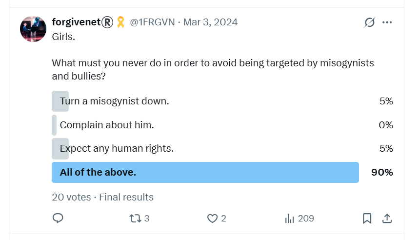

# March 1st-12th 2024

## Monday 4th March chamber music class

- Esteve the chamber music teacher brings us a new song to perform.
- It is [Rossini's cat duet](https://en.wikipedia.org/wiki/Duetto_buffo_di_due_gatti) for two sopranos and piano.
- The irony is not lost on me.

<iframe width="504" height="378" src="https://www.youtube.com/embed/nRFCQ7A4GBI" title="Montserrat Caballé a Montserrat Martí - Duetto Buffo Di Due Gatti" frameborder="0" allow="accelerometer; autoplay; clipboard-write; encrypted-media; gyroscope; picture-in-picture; web-share" referrerpolicy="strict-origin-when-cross-origin" allowfullscreen></iframe>

- Katia didn't turn up for class that Monday so the other lady and I are practicing together.
- I find the whole thing rather amusing and laugh. I guess I'm supposed to be offended, stressed, terrorized, etc., but it is just too ridiculous for words.
- Esteve is surprised at my reaction and asks, "do you find it funny?"
- What did he expect?
- I wonder at that moment if Esteve is aware that I am suffering from intense criminal gang stalking and violent harassment online and in the town.
- I can't believe it, he's such a lovely fellow. In retrospect I guess I was wrong about everyone but the question remains, to what degree was I wrong about him.
- Curiously, as I am accompanying the other student meowing loudly, a black and white cat comes up to the window, and sits, and listens.
- I point the cat out to everyone. 
- They both look and are slightly amazed.
- You can ask them about that :)

### A fake account with Esteve's face as profile

- In April, I'm followed by an account `ChoralSymphony` with a profile picture of Esteve on it.

- This account is either run by [Hazel Smith herself](../../early-years/2007.md#hazel-smith), or someone pretending to be her, perhaps someone from the Cano family?
- Whoever it was, they knew a lot of extremely private matters about her that only I knew, and had *never told anyone*.
- Even in October 2023, [when I tweeted the story on X of how I had been drugged - possibly with the intention of murder in Denia in 2007](../../2023/october.md#tweeting-about-being-spiked-in-2007), and very *very* interestingly just after waking up in the wee hours and feeling compelled to do so, even then I never mentioned her name. 
- But, if she was part of the constant surveillance, she would have known immediately. 
- Just a few days before Esteve's class, I had reported another fake account with a photo of Hazel's face mixed with mine by an AI process.

- Another fake account pops in right after.

## Online communication with gang-stalkers

### Hacking

- The hacking is getting really very obvious now.
- I tweet about it.

### Porn fatwa

- Sometimes, I tweet messages which show how I'm always trying to figure out what is going on.
- I'm getting close to [the truth](../../early-years/2003.md#porn-fatwa) here.

### I tell them why I won't leave

- I've thought about it carefully, and I realized leaving my studies at the conservatory - and away from people who might notice me go missing, or die, or whatever - would put me in enormous danger.
- I tweet polls and explain my thinking on this in detail.

- The following two tweets are in conversation to someone close to the matter suggesting I should leave.

- It's interesting that given indeed they do get me to leave my studies in a matter of weeks from now, I'm still working for Polygon, so they can't dispatch with me while I'm turning up for meetings every day online.
- Is this why they manipulated the job at Polygon for me? So I would have a lot more money to rob in a violent honey-trap relationship.
- I would also be extremely easy to [fire, isolate, and destroy forever](../../2024/october.md#polygon-fires-the-whole-writing-team) while being live-streamed to the world?
- Did the whole Polygon staff, as well as [British node operators given bus tickets sitting beside me](../../2023/september.md#polygon-node-operators-on-the-bus-home), know what was happening to me?
- How many of my colleagues were paying for live-stream subscriptions of me sedated in my Dénia apartment?

### Reporting being drugged

- Is this tweet evidence of being drugged again?

### Reporting cyber-stalking intensity growth

### Winding them up

- I admit, I really enjoyed winding them up.

- Nevertheless, I constantly try to communicate normally with them too.

### The forgivenet

- I never stop thinking about how much these people could help my forgiveness app get going.
- They would be an ideal first batch of genuine users, imho.

## Tuesday 5th March piano lesson

### An inspector calls

- I arrive at my piano lesson.
- Paqui Fornet, my piano teacher, is busy at her desk.
- I wait, and a moment later there is a knock at the door.
- The director of the conservatory, Jaume Signes, is at the door with a woman I've never seen before.
- Jaume introduces the woman briefly to Paqui and leaves.
- I'm feeling excessive stress at this moment. 
- My arms feel very heavy and it's difficult to move them.
- The woman is a large, dark, curly-haired woman of about 50 years old and I would recognize her again.

- Paqui explains the woman is an *inspector* from the Generalitat and she is here to help me.
- Paqui repeats the phrase that the woman is *here to help me* a number of times.
- I feel like it's probably an ambush and put my phone on record, except my fingers aren't working properly and I'm not sure if I have done it correctly.
- The women are not concerned I might be recording them.
- Paqui reiterates that the woman is *here to help me* with everything that's going on.
- I understand this to mean that she is here to help me because I previously told Paqui I was [being terrorized by Domingo Cano and his associates](../january.md#i-tell-paqui-im-being-terrorized-by-teachers-and-staff-at-the-conservatory) and was concerned about my safety.
- The first thing the woman says is they are going to get the police involved.
- I am delighted and express gratitude because something is finally happening after nearly two years of abuse instigated by a piano teacher.
- Paqui looks nervous.
- I ask the inspector why the Generalitat has not replied to any of my emails or letters.
- She tells me they did reply in December 2023 but the letter was returned because they did not have my street address. This is ridiculous, obviously.
- I mention that I sent all my complaints by email, from my email address which they have, and that my street address is in the systems, and that they could have asked me, or informed me, or replied to me at any time.
- She ignores me and shows me the enclosing envelope and the return notice from the post office.

- [The document receipt in full](../../../content/documents/gv/8.%20Receipt%20of%20something%20from%20the%20Generalitat%201%205%20March%202023.jpeg).

- I ask her for the content of the letter they sent, which I do not see in the documents she has.
- She says, *oh that doesn't matter now, it's too late for that now*.
- The woman's tone and demeanor is not at all friendly towards me. 
- She wants to know about my social media activity, particularly on X.
- She suggests I have been saying things I shouldn't have been saying.
- She says *everything is too public now and the police will need to be called*.
- I say something like *thank God, I have been stalked for nearly 2 years, I wrote to the GV numerous times about this horrible situation, so I would very much welcome the police getting involved*.
- The woman is a bit taken aback; Paqui looks even more nervous.
- The woman then goes on to reiterate that I have been saying things online and the police must be called.
- I ask her what *exactly* she has a problem with?
- She doesn't reply and instead starts asking me questions about what I'm saying on Twitter.
- I find it very threatening. 
- I tell her I don't like the way she is talking to me, and say that I'm not speaking to her further without a lawyer present.
- The woman leaves. 
- I never hear from her or anyone else from the Generalitat again until I receive [a letter in April ignoring all my complaints and saying there is nothing untoward going on at the conservatory](../april.md#response-from-generalitat).
- They send this letter after I have left my studies due to becoming genuinely afraid for my life.
- Is that what they were hoping would happen over [Christmas when the gang-stalking broke all scholarly boundaries](../../2023/december.md#christmas), and yet I still returned?
- I can only assume that everyone, top to bottom, knew *exactly* what was happening to me, and in fact welcomed it as long as it got me to leave my studies as soon as possible.
- Furthermore, the constant noise I was making about what was going on online must have been making everyone extremely uncomfortable.
- I guess I had to be silenced and gotten rid of.
- Once I was gone, I expect they thought they would be able to get back to [normal operations](#domingo-adjusts-the-childs-rucksack).
- My suspicion is that normal operations never once ceased; not then and not today, with the blessing and support of the Spanish government and police.

### I make a donation on X

- I get home and while I'm on X I decide to make a £100 donation to an X account online: https://x.com/latsot.
- I'm extremely stressed after my [horrible piano class](#an-inspector-calls).
- I always found being generous and helping other people in need somehow has a stress-reset button.
- The account is a well known fundraiser in UK feminist communities - i.e. middle-aged women with money to spend, the juiciest morsels.
- The account holder, *Rob Smith*, raises funds for a women's charity: https://niaendingviolence.org.uk/.
- At the very moment I make the donation, literally when I click the submit button and the payment is approved, he posts this:

- Then, a fake account flies by with a comment about being jealous.
- I'm so concerned about these two notices, I look up Rob Smith online.
- I see that he does an awful lot of fundraising but there are no photos of him actually doing anything at all.
- I [contact nia about it](../../../content/documents/emails/nia-email-concern.pdf) I'm so concerned but they're convinced he's legit.
- I start to wonder if Rob Smith is connected to Sandra and Hazel Smith.
- Hazel did mention having a brother when [we met in 2007](../../early-years/2007.md#hazel-smith).

!!! tip "The names"
    - A criminal involved in drugging and poisoning may well consider taking a false name containing a reference to addled minds such as *haze* for example.
    - A criminal involved in lies, subterfuge, and distraction may well consider a false name containing a reference to *throwing sand in the eyes*, maybe. (I never knew so many dodgy Sandra's before.)
    - A criminal involved in stealing middle-age women's money may well consider an extremely obvious fake name.
    - The porn gangs love to tell everyone what they're doing while they do it, sometimes even years before they do it, as we have seen in this statement.
    - It gives them a little kick, a *razón d'être* perhaps.
    - It belies their deep and understandable sense of utter worthlessness.

### Carmen Cano

- Right after this, a fake account whizzes by on likes with the name Carmen Cano.
- I can only assume it is a message from someone to make me think Carmen Cano is behind the current scam.
- Carmen Cano being Domingo the piano teacher's sister.

- I took the screenshot the following day.
- Is Carmen Cano managing Rob Smith's account too?

## Wednesday 6th March

### Stolen iPad

- I can't find my iPad.
- I look everywhere.
- I believe it is stolen.
- When I go to practice the piano, I ask Gloria if anyone has handed in an iPad just in case I left it in the building.
- She becomes extremely concerned, *extremely concerned*, and we go looking for it in various rooms around the building.
- She is really upset about the thought an iPad might have been stolen from the conservatory.
- She exclaims, *nothing is ever stolen from here*!
- I find her exaggerated worry about this astonishing.
- Her concern for my iPad far extends any concern she might have had for me, a student, being terrorized and sexually groomed by Domingo, a teacher, and his associates (which includes her of course).
- Her cognitive dissonance shrieks at me.
- When we are upstairs, I speak to her about what's going on privately.
- I tell her I can't believe how the terror and harassment just goes on and on.
- She looks scared. 
- She is shaking and her voice trembles when she speaks.
- I say: *you know it's not just me they're looking at online*.
- An alarmed flash crosses her face.

- She suggests I go and talk to Enric Gil who works at the town hall in the capacity of welcoming foreigners who have just bought houses and moved to the area.
- (She's getting rid of me, and someone will be phoning Enric to warn him I'm on my way, most likely.)
- I get home later and find my iPad in a place I'm sure I checked a 100 times.
- My constant state of anxiety makes me think it was my mistake all along.
- It wasn't.

### Enric Gil

- On Gloria's suggestion, I immediately go to see Enric Gil at the town hall.
- Enric is foreigner liaison officer for the local council.
- I know him already from when I lived in Dénia previously in 2006-9.
- We had friends in common, Anne & Pete who since left Spain to return to UK, at least that's what Enric tells me.
- I tell him everything that has been going on.
- As I start to mention the threats of poisoning from Domingo he shuts me down.
- He says I should see the Dénia local police who have a division for gender violence.
- He calls them and then says let's go outside.
- We go outside.

- While I'm speaking to him outside, he laughs at me from time to time. It's very disconcerting given the information I am sharing.
- It seems like someone is standing behind me, as I speak, and making faces or playing the fool.
- It's very unsettling.
- There is a local policeman in the square in front of the town hall.
- Enric says he will go and speak to him.
- I watch him walk over and talk to the local police officer for a short time.
- Enric comes back.
- He says I cannot raise anything with them as I don't have a partner, and they will only deal with male violence when it occurs within a partnership.

### Trying to find help

- I don't know what to do, where to turn, who to ask for help.
- The Policia Nacional are disinterested, the local police don't want to know, the Generalitat is suggesting they are going to have *me* arrested for being a victim of cyber-stalking and gang-stalking by their employees and talking about it on X. 
- It's overwhelmingly stressful.
- I have searched for a human rights lawyer and I send some random emails to try and get help, but no-one ever replies to me.
- (I was able to finally communicate successfully with the ECHR when I was in Brussels in July 2024: https://x.com/1FRGVN/status/1811523447123558841. Soon after I write to them, the ECHR inform me they will *not* be doing anything to help me and give no particular reason.)
- The stress levels are really intensifying during this period.
- I feel completely isolated and in imminent danger.
- God is with me, nonetheless, and I'm certain of it.
- I pray and I find the strength to go on with my head held up.

### Scarves from the lady who knows who I am

- On the way home, I buy some scarves from a shop in the Calle La Mar, could be Vintage Ibiza.

- It's run by a Polish woman who is very nice.
- She has the scarves outside on the street and I've been looking at them for a few weeks and thinking I might buy some for my upcoming trip to India.
- We chat and I tell her I'm studying piano at the conservatory.
- She becomes very embarrassed, flushed and tongue-tied.
- She knows who I am.
- This shop had a picture in the window of Frida Khalo for months.
- I would see it every time I walked by on my way home from the conservatory.
- Often, in the Google search results for `@jctot19` there were pictures of Frida Khalo with references to the trumpet teacher having another girlfriend.
- Ridiculous, I know; or was it sinister rather than ridiculous?
- I thought it amazing that the people of Dénia would put so much effort into all this, and it must have cost a lot of time, effort, and money to keep it going. 
- But perhaps they were making more money than they were spending from either:
    - Mass voyeurism on social media of *hunted* or targeted women in Spain.
    - Mass voyeurism of women being filmed on hidden cameras in their homes, possibly on amateur porn networks, something I often saw in my Google results.
    - Mass voyeurism by people who enjoy watching others suffer.
- Or was this indeed another girlfriend of one of the trumpet teachers, and all his multiple girlfriends in the region know exactly what he is and what he's been up to for decades?
- My sense was the [third trumpet teacher was her boyfriend](../../../crimes/protagonists/vidal-sastre.md#an-unknown-man-i-may-have-a-picture-of); a large and lumbering man you wouldn't be able to say no too if he insisted.
- Could all the *girlfriends* have consented? Or did they have no choice?
- As we have seen, a single foreign businesswoman would be a target of choice for the gangs. 
- Is there a foreign businesswoman in Dénia who has not been targeted?

## Online activity over the last couple of days

- I formally put the Smiths on notice. 
- I wonder how many other people understood what this tweet meant.

- A stalker account, `@auralfixation`, seems to suggest they know who lives upstairs, or who hangs out upstairs on [Monday nights after chamber music and beyond](../../2023/january.md#noises-upstairs-after-mondays-chamber-music-classes).

- I post parallels to my experience, namely the Wayne Couzens sex offending that was obvious to everyone prior to it escalating into murder.

## Thursday 7th March

### Fake accounts reference payments I have made online

- I start to see references to payments I have made online, including the exact figures, and sometimes even mentions of the person I paid too.
- One example was in reference to curious activity on X at the time [I make a charity donation to an X account](#i-make-a-donation-on-x) I mention above, after which I receive a follow from a fake account that suggested someone was *jealous*.
- Shortly after this, another remarkable set of X references came in related to a monetary gift I had sent to my Tibetan monk friend, Lama Ashak, of 333 euros at Christmas.
- As you may remember, [they refer to the Tibetan monk as *panda*](../../2023/september.md#the-tibetan-monk-visits).

- The *completely agree about the anger* statement is a direct reference to my situation, and somewhat threatening.

- I wonder if the *Sexless* mention here is a distraction from the truth. If so, it suggests *panda* might have not been masked up and perhaps was even wearing his robes. I do hope I'm wrong about that.

- I'm pretty sure the `@crispolata` account was run by Hazel or Sandra Smith, or one of their English-speaking associates in the area.

### Changing my laptop's root password

- That night, I change the root password on my laptop.
- The router is off. I turn the network off at night.
- The following morning, Friday 8th March, half of my new root password appears on a fake account's profile message on X.
- I'm in no doubt at all there are key-loggers on all my devices, and every letter I type on any of my devices is being read by Dénia criminals, and maybe even teachers and staff at the conservatory too.

## Friday 8th March

### Reporting hacking to Polygon Labs

- I realize it's time to tell the security department at my work that I'm hacked.

!!! tip "I noticed evidence of cyber-stalking from the moment I received my Polygon laptop"
    - I opened an X account on my work laptop, probably about a week after I joined in November 2023.
    - I used it throughout my tenure.
    - I can't remember the account name but may have it written down somewhere.
    - The day after I opened the account, I was followed by numerous fake accounts with names and profile messages related to myself and the Dénia gang stalking.
    - I filed it away; it was too much to deal with at that moment, although I did raise a ticket with IT at one point when I saw something extremely weird.
    - They found nothing at that time but they did no serious investigation.
    - The IT operative who helped me at that time was John Michael.
    - He was sleeping in the hotel room next to mine at the [Bali offsite in May 2024](../may.md#bali).

- Gordon Bishop of Polygon Labs security team investigates. 
- He asks me to access 1.1.1.1 on my browser. 
- What he's expecting to happen, doesn't happen. 
- He's expecting to see the WARP webpage but, instead, we get the login page for the network router.

- He also sees some weird stuff with Mac certificates.

- He asks me to check on FireFox too.

!!! important
    - The screenshots above are from my work laptop.

- He says this is enough evidence of hacking through the router for them to lock me down and reformat my laptop.
- I have to work somewhere else, i.e. not at home, while I get a new router and change the ISP from Yoigo to Movistar.
- They put the `FalconSensorMacOS.MaverickGyr.pkg` on both my work and my personal laptop. 
- The files are [here](https://drive.google.com/file/d/1MPTzekQ0o7pLizShUsWR_b-3qq73Aa-W/view?usp=sharing).
- A few hours later, when I return from lunch, a stalker account tweets about 11.11 and references relationships.

- The `@CabronaVirusV69` account no longer exists. I get the feeling it might have been run by Zoe BJ or someone close to her.
- I believe this tweet was in answer to this one: https://x.com/1FRGVN/status/1766017527300149464.
- The following day, I tweet about it.

- From this point onwards, I block all my cameras on laptops and phones with post it notes, or paper and sticky tape.
- I forget to block the outgoing camera on the phone, and only block the selfie view cameras. I realize my mistake in October 2024 when hackers [post pictures of my Fatima hotel room](../october.md#fatima-20-26th-october).

### zkSync and DigitalAsset

- I also inform my previous jobs at zkSync and DigitalAsset that I believe I am hacked by local criminal gangs, including while I was working for them.
- I send emails and get responses.
- I feel it's important that they know what has been going on in case of industrial espionage and the fact I sign NDAs for all the companies I work for.
- I didn't tell Consensys. Perhaps I should have.

### Nowhere

- I get a desk at Nowhere co-working space in Dénia: https://www.knowheredenia.com/.
- I intend to work from here for the next couple of weeks while I sort out the router.

### Qredo

- I bought my personal laptop from [Qredo](../../2021/march.md#qredo), the company I was working for in 2021.
- I go to reformat it.
- They have not removed admin access from my laptop so I'm unable to reformat my personal laptop.
- I get in touch with them and they remove it.

### I tweet about what's been happening

- Sharing information always makes me feel safer.
- It happened to be Shivaratri also. Wow.

- These tweets read like they're coming from a extraordinarily anxious woman.
- They were.
- This one is maybe the first time I offer a reward for any illegal videos of me.

- I am really upset.

- I put all the accounts I believe are part of the stalking into a pic and post if with a description of what's happening to me. I apologize if anyone's account got into the pic by accident.

#### Response from Yoigo

- Of course, Yoigo is not interested in helping me understand how the router was hacked, or doing anything about it.

- I kept the router for detailed examination any time investigators take an interest.

#### Shivaratri

- I visit the temple in Valencia to celebrate Shivaratri.
- I'm following by young Spanish men who come in and sit a while.

## Sunday 10th March

### Texting my family at the Chinese restaurant

- Online stalkers continue to suggest I call my family.
- This has been a message I've been receiving from someone I think is the trumpet teacher since I was at [Avila in December 2023](../../2023/december.md#avila).
- On my new iPhone, I send a text to my mother's mobile number while I'm having dinner at the Chinese.

- I thought I had remembered her number correctly.
- The moment I hit send, I hear a celebratory noise coming from my phone, and from another phone nearby in the restaurant - I kid you not.
- I'm not able to get through to my mother.
- I believe they are trying to target my family now, with phone numbers, etc, for the purposes of theft and fraud, and that's why they're trying so hard to get me to contact my family.
- Writing about this now, I realize that it was all too much to comprehend and so, like I always did with abuse, I noticed it, and filed it away until such time as I could understand it properly and deal with it.

## Monday 11th March

### I tell my team at Polygon I'm being stalked and hacked by my neighbors

- Since [Polygon's security department found evidence of hacking on my router](#reporting-hacking-to-polygon-labs) and insist I replace it, I plan to work for two weeks at [Knowhere in Dénia](https://www.knowheredenia.com/), a co-working space, while I organize a new Internet service for my home.
- At my Monday team meeting with Polygon, I tell the team, Hans and Anthony, that I'm being terrorized by local people and that they have hacked my router and I cannot work from home for a while.
- They are shocked.
- Hans is particularly upset and repeats to me that I must contact him urgently, anytime, if I need help.
- He tells me this more than a few times.
- This attitude is in stark contrast to how Hans treats me over the next few months; forcing me to step down as manager due to his insubordination and no work getting done.
- I wonder who spoke to him from the organization, and Anthony, and what they said.
- Were they advised on how to deal with me before or after [I tell Gabriel what's going on](13-end.md#i-tell-gabriel-silva)?

### Chamber music class

- I am extraordinarily stressed at class; the level of stress is slightly inexplicable.
- We practice the [cat duet](#monday-4th-march-chamber-music-class) again.
- Katia is present.
- I explain to Katia and the other woman that I have been hacked by local people and that my work has found evidence of it.
- I tell them I'm going to have to leave my studies.
- I explain that I'm working in shared office space, and I am fearful for my safety, and I'm worried I'm going to be robbed.
- The other woman looks alarmed and scared as I explain these things.
- Katia not so much.
- A fake account pops up over the next few days which appears to be referencing Katia moaning about this publicly.

- Another account that no longer exists.
- I wonder who might say something like *I like square sossij*?

### Cracked rib

- At yoga that evening, I crack a rib.
- We're doing backbend preparation, and as I lean on my right rib cage I practically hear my rib snap. 
- I'm in excruciating pain.
- It's actually the site of an old injury, and I think the bone is weak there anyway.
- More recently, I wonder if whatever poison, herb, or medication I was ingesting without my knowledge causes bone thinning because it happened again a few months later and then again in early 2025 at the same site.
- I have to pause yoga for a month or so while it gets better.
- It's good timing as my life descends into total chaos while I try to understand what has been happening and how I can get help.
- I find out that methanol can thin the bones, also some hormones. 
- I'm pretty certain that mandrake is the main drug the porn-gangs use and that I was ingesting it for at least three years over 2021-2024.
- It's highly likely I was also ingesting it over the years 2012-2016 when I lived in Dénia and that, plus any sedated spy-cam activity in my Joan Fuster apartment, may well have triggered a suicidal depression and my return to the police about the 1989 attacks.
- It's interesting to note that, as well as making fists constantly, around that time I started to suffer from a medical condition called hidradenitis suppurativa which is basically posh words for outbreaks of boils in sensitive regions, in my case the genital region.
- It was formally treated by the NHS UK in 2018 with a prescription for a steroid cream that eventually worked, although it returns slightly from time to time.
- I wonder how the sedating porn gangs dealt with the very large and obvious boils.
- Is there a [boil porn genre](../../2025/may.md#spy-cams-in-london-n2-also)?

## Tuesday 12th March

- Today is the day of the end-of-term piano concert.
- It is taking place at the Casa de Cultura in Dénia.
- I have memorized the first movement of Mozart Sonata K331 in A Major, the whole thing!
- I'm very excited.
- I will first go to my harmony class after work at around 6 at the conservatory building in Sant Telm, then walk over to the concert venue afterwards.

### Pablo is given a role again

- I set off into town for my harmony class with Alfonso.
- As I approach the conservatory, Pablo comes out of the front door of a building right in front of me.
- Remember Pablo? 
- The 14-year-old boy trumpet-student that came to [chamber music classes with me and the trumpet teacher](../../2022/november.md#the-trumpet-teacher) from November 2022 to June 2023?

- Pablo will remember at least two or three, possibly four, of the switcheroo-porn trumpet teachers: the [first man I still have a good feeling about, but perhaps not romantic anymore :)](../../../crimes/protagonists/vidal-sastre.md#the-older-slimmer-greyer-man), and likely his [younger brother](../../../crimes/protagonists/vidal-sastre.md#the-brother-or-mark-from-english-class-in-2013) who may have further switcheroo'ed with a man I had taught English to in 2014, Mark.
- He will also remember the [third larger man](../../../crimes/protagonists/vidal-sastre.md#an-unknown-man-i-may-have-a-picture-of) who initially led our small [chamber music concert](../../2023/may.md#chamber-music-concert) in May 2023 that Carmen Cano attended.
- Pablo, 15 now, looks downwards; he's ashamed, frustrated, and upset. 
- I realize he has been asked to do something for the criminal gangs again, so I do not engage with him.
- I feel bad for this young man and the life he has to live.
- I run past him, wishing him the best as I whizz by.

### Domingo adjusts the child's rucksack

- As I walk up to the conservatory front door, teachers glare at me angrily.
- After [bumping into Pablo just before](#pablo-is-given-a-role-again), it's another warning.
- I enter and go up the steps towards the reception area.
- Domingo is on the steps.
- He has his hands on the shoulders of an extremely small child, I'm guessing of about 6 years old.
- He is, apparently, helping her adjust her rucksack with his hands on her shoulders, back, and head. 
- He is as close as you could get to a person.
- As I pass them, he glances at me meaningfully.
- Is this a demonstration for my benefit of the power he has over very young children and how no-one can do a thing about it?
- Is this how they drugged me outside my apartment; create a diversion to get close enough to add powder into the ear or apply dissolving patches onto the neck or arms?
- It reminds me of [the woman I saw in France at Lourdes this year](../../2025/july.md#lourdes) who walked right into the waitress, getting as close to her as she could, and watching the waitress's head whirl backwards while she spun around and walked off as if nothing had happened.

.

- The woman I saw at Lourdes is to the left of this picture; Domingo the piano teacher is in the middle with the rucksack. They could be related I suppose.
- An urgent safety check is long overdue for the innocent-looking lady sitting next to him.

### Ana dresses up pregnant

- [Ana Requena](../../../crimes/protagonists/domingo-et-al.md#ana-requena) is still pretending she is in a relationship with the trumpet teacher.
- It has progressed to her being pregnant with him; this idea has been reinforced intensely for me online.
- I'm standing outside the harmony class chatting with Alfonso the harmony teacher.
- Alfonso has his phone in his hand, and he is looking down at WhatsApp repeatedly.
- It's the end of the class and I'm about to leave for the piano concert.
- He keeps me talking.
- Moments later, Ana walks by towards the toilet dressed in maternity gear.
- She looks like she could be four-to-five months gone.

- I find it curious she's wearing a summer outfit as it's still pretty cold outside.
- Ana's classroom is on a different floor to the harmony classroom.
- There are toilets on Ana's floor she could go to more easily.
- You may remember [her initial trip to the toilet where she bumped into](../../2022/november.md#the-trumpet-teacher) one of the larger-bodied trumpet teachers; either [the brother](../../../crimes/protagonists/vidal-sastre.md#the-brother-or-mark-from-english-class-in-2013) or [the even larger man that led the chamber music concert](../../../crimes/protagonists/vidal-sastre.md#an-unknown-man-i-may-have-a-picture-of).
- Incidentally, it's around this time I start feeling like I want to have a child, although this idea has been entering my mind for months.
- I believe the idea comes from online manipulation due to my hacked-browser's subliminal messaging further reinforced by the mandrake or whatever it is I'm ingesting.
- Ironically, and in keeping with the unintended positive outcomes of all the attacks, I still feel like this and I think it would be an absolute blessing to have children.
- Furthermore, and in keeping with the unintended positive outcomes of all the attacks, this is when I started to realize that they were mass-manipulating women into having babies, and the obvious implications of that for a criminal porn-gang controlling a small region of Spain.

### A serious attack on my wellbeing from piano teachers at Dénia conservatory

#### Carrie 2

- In November 2023, just as I'm starting my new role at Polygon, I'm so nervous at the conservatory, I'm convinced they're planning another attack. 
- I tweet about my concerns. 

- Carrie 2 is obviously a reference to [Carrie 1 on 12th June 2023](../../2023/june.md#monday-12th-june-2023).
- My suspicions played out well.

#### The piano concert

- After the angry glares from teachers, and bumping into [Pablo the trumpet student again](#pablo-is-given-a-role-again), and seeing [Domingo very close to the small child](#domingo-adjusts-the-childs-rucksack) and [Ana looking pregnant](#ana-dresses-up-pregnant), I leave the conservatory and walk over to the Casa de Cultura to play in the piano concert.
- The concert is a huge set up; they mean to terrify me, give me a nervous breakdown, and I can't imagine that killing myself is off their table of hoped-for outcomes.
- Whatever they want, they certainly intended I leave my studies at the conservatory for good.
- I don't know this at the time, but I can feel a heavy evil weight over everything.
- I arrive and catch Joan Carles eye.
-  He glares at me furiously.
- I sit in my alloted place in the front with the other students, children.
- Behind me, rows of parents and friends are gathering.
- There are two unfilled chairs directly behind me in the second row.
- I see Trish Penny, Chris BJ, and another of the British ex-pat walkers come in and sit at the back. I had bumped into them in the cafe on the way in. The atmosphere was frosty, forced, fake.
- I see the Romanian parents of the [beautiful boy](../../2022/march.md#conservatory-open-day) sitting behind me next to the empty chairs.
- I smile at them, but they look away sadly.
- The mother is looking downwards, her head bowed.
- The father stares inanely into the distance.
- I recognize a man as one of [a couple who stalked me on the Las Marinas beach](../../2023/september.md#dog-tags-and-his-missus) every day in September 2023.
- They followed me every day I went to the beach; he was always wearing dog tags visibly, sometimes swung around his neck so I was sure to see them when he had his back to me.
- I got very close to the woman once, and smiled at her sweetly, at which point she became terrified and I knew she was a stalker.
- Dog tags was also part of the group of men making [sexual noises on kitchen chairs](../../2023/september.md#rape-gang-reminders), his missus standing close by.
- Someone shuts the main door, and people keep opening it loudly to come in.
- I believe this is for setting up the next scene so I don't miss it.
- Dog tags is standing by a chair on the far side of the auditorium.
- Our eyes meet and he smiles at me. I recognize him.

- He sits.
- The auditorium lights go down.
- At 7.30pm, the concert begins.
- The stage lights go up.
- Everyone is quiet.
- The door to the hall swings open loudly again, and in walks a woman who has dressed to look *exactly* like [Lorraine Blackbourn](../../early-years/2008.md#working-for-lorraine-blackbourn), my friend who [committed suicide](../../2021/july.md#lorraine-blackbourn-commits-suicide).

- She has done a really good job of it too. 
- I gasp.
- At precisely that moment, my security camera at home goes off and sounds an alarm on my phone in my bag by my feet. 
- I don't have time to look as the concert is beginning and everyone is applauding.
- The woman dressed as Lorraine (who I now believe to be dog tag's missus, Carmen Cano is too short and slim for this woman who was quite chunky) and the man, dog tags, the man who smiled at me previously from the other side of the room, sit directly behind me, in the seats that have been saved for them.
- He was waiting for her to arrive and he joined her when she did.
- The concert begins.
- The names and order of pieces is displayed on a screen behind the piano.
- Each piece the kids play is related to things I have said on X, or in letters to the Generalitat asking for help, letters that were ignored.
- The beautiful Romanian boy gets up to play.
- I'm surprised and alarmed to see him looking so unwell and anxious, hunched over, dark rings under his eyes.
- It reminds me of how I looked and felt some mornings in my apartment.
- It makes me wonder.

!!! danger
    - I'm extremely concerned about this boy now.
    - Could teachers and staff at the conservatory be so sick and twisted, they were demonstrating proudly what they do to children?
    - Just like [the two drugged girls](../../2022/june.md#maria-and-domingo) in June 2022.
    - Or the [girls at the audition](../../2022/june.md#conservatory-audition).
    - Or [Elvira in her vest](../../2023/may.md#elvira).
    - Or the [tiny child Domingo was apparently helping](#domingo-adjusts-the-childs-rucksack). 
    - Or the [British girl who looked high](../february.md#the-british-girl-at-the-conservatory).
    - Horrifying.
    
- The pieces have related names, including something like "Four Aunts" by a modern composer, Mercedes Zavala, - this is a horribly aggressive piece that Antonio Signes Argudo plays very well - see previous references to [poison and aunts](../../early-years/2014.md#poisoned-aunts), and other related things.

- I glance back again at the Romanian boy's parents.
- I remember the father's face for some other reason too...
- When I go up to play, I'm certain I'm not leaving my handbag at my chair (as I usually would) because these criminals are sitting right behind me. 
- Instead, I take my red handbag onto the stage and leave it on the floor by the piano.
- I do a surprisingly good job with the Mozart, apart from the last bit.
- The pounding heart, screaming nervous system, and overwhelming stress is somehow helpful in getting focused on the job at hand.
- The concert ends. 
- I go to the back of the auditorium to talk to Patricia Penny, Christine Betterton-Jones and the other lady whose name I have forgotten. 
- Trish is babbling on about fingers incessantly, which is a bit strange.
- As we talk, I'm watching the protagonists at the front - Paqui, dog tags, the woman who has dressed as Lorraine.
- They are chatting and laughing, giving each other high fives.
- Paqui Fornet, my piano teacher, eventually comes over. 
- She makes the Hindu god hand movement that I make every time they do it on the Hanuman show I watch on my sofa at home in front of the television.

- She's been watching me in my house, while I'm on my own watching TV, and she wants me to know that.
- I jump to high-five her raised hand which she moves upwards to try to stop me. I catch it anyway.
- Her eyes briefly register confusion.
- She asks me how it was.
- I say *I'm very happy*.
- She asks again, and I repeat it.
- She walks off.
- When myself and the walkers leave, I insist I'm going to continue playing the piano, and play some Spanish flamenco at the next concert.
- Patricia visibly grimaces.
- When I get home that night, I check my camera security camera alarm that went off at the moment the woman dressed as Lorraine Blackbourn walked in. 

- For the record, my home security system alarm rarely went off; once in six-months, maybe, and those times [may also have been doctored](../../2022/october.md#vomiting-and-sickness-in-the-flat).
- There's an orb in the video it captured. I tweet about it.

- A stalker account retweets my poll and makes a weird comment - which I didn't manage to screenshot before the account got deleted.

- Another stalker account posts something weird.

- After the concert, I'm blocked from downloading the videos of the concert on the Generalitat's systems.
- In my mind, I have no doubt that these people are total idiots, the most ignorant well-educated people I have ever come across.
- I go to practice the piano at the conservatory the following morning.

!!! tip "Later thoughts"
    - The attack is so vicious, one wonders how these people sleep at night.
    - Except, if they were aware of what was *really* going on for me, then they might have thought it wasn't a big deal at all.
    - Certainly, if I had complained about the concert to officials in a state of fear and anxiety, they would have been very quick to suggest I was imagining it, the English ladies in support no doubt.
    - The perfect alibis for the vilest sex crimes imaginable.

#### X activity after the concert

- Some marvelous stuff here.
- Here's Romina, an account I consider to be managed by Domingo and from extremely early on in this story of good-versus-evil - from February 2022 even - kind of confirming everything.

- Does *faith in change* refer to them *really believing they would scare me*?
- I think so.
- It also suggests that terrorizing students successfully is what they are more familiar with, and I'm possibly the *one* unusual case in maybe 100s if not 1000s of cases.
- The tweet below is also interesting.

- A few days later, when *everything* has changed for me emotionally, and I 100% believe I am going to be murdered, Chris BJ texts me repeating the words I say here in a sly way.
- I respond saying I wasn't talking about them (the English ladies), which I wasn't.
- (The lost don't understand love or that, when you're full of it, everyone is your friend.)
- Here's an account doing a trumpet-teacher love-trigger on me.

- I am pretty clear-headed on this evening, the fight has brought out something very strong from within, and I guess they didn't plan to sedate or drug me that night on top.
- The TT love triggers aren't so effective, and this is clearly a stalker account.
- I tweet a lot of sanity on this evening: https://x.com/search?q=(from%3A1frgvn)%20until%3A2024-03-13%20since%3A2024-03-11&src=typed_query&f=live and it must be *very clear* I am not at all frightened.
- They'll have to double down.
- They do.

## Online stalkers

- Although I believe I've done a good job at describing the continuous online terror, and posting supporting screenshot references, it's really hard to describe the intensity of it over this period.
- I was stalked *incessantly* by fake accounts I never saw again.
- *You don't want me to get my flying monkeys, do you?*, she ([Hazel Smith](../../early-years/2007.md#hazel-smith) I believe) would call them later on in the year, threatening the same.
- Any time I posted something revealing, or published an explosive snippet of this police statement online, the *flying monkeys* would come out, and I would know I'd touched a nerve.
- It was encouraging.
- Aside from the *flying monkeys*, which I believe were generated by an elaborate and extremely process-heavy AI tech-system designed to spin-up 1000s of accounts in seconds for targeting normal people with specific emotional content (in my case fear anxiety and threat over this period, but previously and again in the not so distant future it will be overwhelming sexual desire and wanting a child) there were some repeat offenders using the same account, over and over.
- Sometimes, it was as if these account all came out together; like they were on the clock.

- Here are some of the more important ones.
- Many of the more familiar [fake accounts](../../../evidence/twitter-account.md#fake-accounts) seem to be set on auto-loop, coming round again on a regular basis to like a tweet but no-one managing them.

### `@AniLoviator`

- This account is very interesting indeed.
- I believe I was supposed to think it was [Ana Requena](../../../crimes/protagonists/domingo-et-al.md#ana-requena) as many posts referenced a relationship of some sort, and looking after this man's *daughters*, and how the relationship was constantly faltering.
- The name also referenced [Ana Girbes in her fierce aviator form](../../2023/november.md#the-adams-family).
- The account tag-teamed with other accounts during this period, with the specific intention of cyber-stalking myself, such as with the [`@SeonaidDawn`](#seonaiddawn) account below, and the [Lorraine Tortured Whistleblower](13-end.md#lorraine-tortured-whistleblower) account.
- A series of tweets described a predatory male family member and what she (the account holder) had to put up with. 

- Some of our conversations took place over a few days.
- Many of the account's tweets, and tweet-replies to me, have been deleted at the time of writing this sentence.
- At the time of writing *this sentence*, the account no longer exists (see the Git commit records for dates).

- Note the "not done annoying you yet" reply below which seems to be confirmation of stalker-gang-membership. 
- I answer as if I believe it is the trumpet teacher (the reference to *swami*). 

- It occurs to me at this point was there some sort of *trumpet teacher* mental trigger that threw my mind off the fact I was having a conversation with a woman experiencing extreme male violence.
- I wonder why she said she's hard to get rid of.
- The reference to *very much last one* suggests an older lady.
- Is the *no worries, not done annoying you yet* a sinister reply to my concerns about murder with consent? 
- I don't know who it is but I know it is someone involved in the cyber-stalking. 
- And I do know it isn't the trumpet teacher, even though I responded as if it were the day before.

- This account is also involved in continued gaslighting, and here is an exceptionally good example of the sort of thing the gaslighters, such as [Chris BJ](13-end.md#chris-bj-by-gaslight) and [Sandra Diaz](../../early-years/2014.md#sandra-rita-diaz), would say, as if they were reading from a manual.

- I heard these very words from Chris BJ, Sandra Diaz, Paul, and others - and only during the most extreme moments of stress such as on and after [13th March after choir](13-end.md#distraction-then-drugging) and when I was being [poisoned with the intent to kill](../october.md#poison-warnings).
- *Youre never alone*, is also threatening.
- Notice the *same gaslighting message popping up in first place on Google search* in [September 2024](../../2024/september.md#google-searches) (scroll down to the bottom pic in the list), during the time I was being drugged and poisoned so much so that I was hallucinating, badly, in my own home, criminal porn-gangs closing in on me, to finish me off, I expect...

- ...[Paqui Fornet](13-end.md#email-to-paqui) in second place.

#### Apropos of nothing

- The account says sorry to me for no reason.

- Again, for me, this is proof whoever is running this account knows exactly what is happening to me and saying sorry for it is another twist of the knife.
- Later, I start to wonder who would use a term like *apropos*.
- Certainly, you would have to have been very well educated, or over 70, to use a term like that in an environment like this.
- I wondered if it might be one of the Spanish music teachers; extremely well educated individuals and often with a stronger grasp of English than many of us natives.
- However, I now believe it is [Patricia Penny](../../2023/january.md#hiking-with-the-english-ladies) and she was telling me all her secrets without realizing it.
- The reply I make suggests, again, I have switched into believing I am talking to the *trumpet teacher* and the reference is to the love I felt/even now feel for this man.
- It's amazing for me to see all this in retrospect and without being high on some mind-altering substance.

### `@SeonaidDawn`

- In March 2024, this account is very active in the cyber-stalking efforts.
- Sometimes, she tag-teams with the [`@AniLoviator`](#aniloviator) account.
- Posts refer to violence and criminal drug gangs, and my lack of safety.

- The owner of this account ends up running for election with the Party Of Women alongside me in June, which is surprising.

### `@AuralFixation`

- I wonder if perhaps this account was run by [Samuel](../../2022/september.md#harmony).
- The reason I say that is because in the harmony class in October 2022 when I found out Samuel knew Lorraine and I cried, he told me that Lorraine had said he was a *dark horse*.
- I replied, *I'm glad she said that about you*, and I wasn't entirely sure why.
- Samuel used a porn distribution company name as his [email address](../../2022/october.md#sam-shares-some-files-with-me) he sent me early on, and this is in keeping with how the gangs tell you everything up front.
- It certainly wasn't a female person.

- Note the dark horse picture, *and* the students sitting behind in what looks to be a classroom.

### `@AIInAmerica`

- Very active over this period.
- I describe interactions with this account in the [December 2023](../../2023/december.md#ba-feldman) section of this police statement.

### `@ChiefPlucker`

### `@january_myth` - Taru Ann

- The following information supports my suspicion that *enormous* communities of occultists are involved in targeting women and children online for criminal porn-gangs internationally.
- I believe my personal experience of this insidious manipulation is just a small task on a massive todo list for these (I expect mostly) women (the men are busy with the sedating and raping and filming, right?).

- The account posted the Yeats poem above at the exact moment I went into meltdown on [29th August 2023](../../2023/august.md#i-become-convinced-im-going-to-be-arrested) and became certain I was going to be arrested.
- I don't remember seeing it at that time as I was disintegrating.
- I hadn't yet twigged that the `@january_myth` account was involved in the conspiracy, so even if I did see the tweet, it would have made no impact.
- These posts were used to *drag me back into the lie*, as it were, even when it was obvious to me that I was in grave danger.
- The account, named **Taru Ann**, meaning *Legend Ann* in Finnish, seems completely legitimate. It has masses of followers and appears to be well-known in the online gender-critical community.
- The collocations *legend Ann* and *January myth* together are significant and suggestive of the evening the [good-looking trumpet teacher](../../../crimes/protagonists/vidal-sastre.md#the-younger-brother-of-the-first-man) [first turned up for class](../../2022/november.md#the-trumpet-teacher) just as I was drugged, and he and Ana did their little act together outside the toilet, thus creating the love-triangle myth.
- I found the pictures she posted very *fake-account* in style and content; grainy and twee interior scenes. 
- Interestingly, [So (Janet)](../../2024/june.md#volunteers-not-what-they-seem), my general election campaign volunteer, would post some just like them in November 2024 while suggesting I come and stay with her at her home!
- So (Janet) even more interestingly traveled to Avignon to be at the Pelicot trial. 
- I wonder if places where multiple sex-abuse victims (perfect online porn fodder) might go is also well attended by online porn-gang researchers?
- Some of the `@january_myth` account's more personal themes didn't ring true to me at all.
- At one point, she posted repeatedly about needing to buy an expensive tomb stone for her sister, and I did wonder if she was building up to asking everyone for money.
- It turns out, the Taru Ann account had already posted a meaningful poem on the night of [12th June 2023](../../2023/june.md#monday-12th-june-2023).
- I remembered this when she retweeted the picture from it, without the poem.

- I went looking for the original tweet from 12th June 2023.
- I discovered, with some curiosity, that it had been deleted.
- I asked about it.

 

- I ask her about the poem.

- I remembered it from 12th June 2023 because of the poem.
- On 25th March 2024, Psalm Sunday and an evening I post a lot about the *Light*, the account holder retweets the post from 29th August 2023, and I reply.
- It as if she's annoyed I'm not getting it, and she needs me to know she's involved.
- Was the *Light* also annoying?
- Eventually I begin to suspect that whoever is managing the Taru Ann account could be well known to me.
- I wonder if it is Ana Requena, due to the namings.
- On 22nd September 2024, after weird communication from Trish Penny all summer, I wonder if Taru Ann is Trish, at least from time-to-time by delegation. 

- Liking my question, *Trish?*, seems like a confirmation.
- I remembered that during one particular series of personal tweets in 2022 in which the Taru Ann character had fallen and broken her wrist, Trish Penny had a broken wrist at the same time.
- Do the surrounding and supporting social media accounts slowly reveal themselves to a target the closer (they believe) the target is to giving in to the gangs?
- On Friday 29th November 2024, this account deleted a tweet reply I had made.
- It felt like she was **calling out** the fact that she deletes tweets from time to time - to explain deleting the significant poem from 12th June 2023.
- The purpose behind accounts like these I can only assume is in support of criminal gangs.
- What's terrifying is that there are 1000s of them in any particular graph, all connected, and all in support of each other. One wonders if they have a Slack to keep contact while they work.
- It makes me realize that when you send your kids onto social media, it's literally like sending them all alone and naked into a sex club.
- Curiously, this account posted the pic I mention [in the first timeline entry](../../early-years/2001.md#amsterdam) that reminded me of a weird event from so long before.

- Yet another breadcrumb on the road to giving into the gangs?
- Or a massive error on the part of a nation of sex-and-violence-obsessed criminals?

### Thoughts on it all

- You've got to start wondering why no-one will help me.
- Whatever it is, it meant that criminals feel safe enough to do whatever they like, and I guess their pleasure worsens-and-worsens the less they're held to account.
- It must be addictive, having the power of life and death over anyone and everyone.
- Perhaps being free to do my own investigation is a blessing from God. 
- His schemes are never obvious while you're in them.
- I'd wholly welcome this.
