# March 13th to end

## Wednesday 13th March 

- I wake up and leave for the [serviced offices](https://www.knowheredenia.com/) in Dénia where I'm having to work due to hacking.
- At lunchtime, I head down to the conservatory to practice, head held high after the previous evening's [Spanish-civil-servant super-s-show](../march/1-12.md#the-piano-concert).

### Translator

- Since [Polygon's security department found evidence of hacking](../march/1-12.md#reporting-hacking-to-polygon-labs), I intend to report it to the police.
- After my experience with the [national police in Dénia in February](../february.md#my-first-trip-to-the-spanish-police-in-denia), I need to understand clearly what's required of me in order to report the hacking officially, and I need a translator to help me communicate it.
- I get a recommendation, Sara Lebanon, through an Irish woman Brenda who incidentally knows Alessandra very well *and* whose sister attended the [TT module in Galway in June 2023](../../2023/june.md#ireland) right after the [12th June 2023 porn-gang music-student-funeral at the conservatory](../../2023/june.md#monday-12th-june-2023) when ridiculous childish bullying by Spanish civil servants did not come near to explaining the obvious and extreme trauma I was processing.
- I meet Sara and she says we should go to the main square outside the tunnel to talk, I'm not sure why. 
- Was she told to take me there by someone? If so who? 
- The square is completely empty.
- I tell Sara everything; the child sexual abuse I suffered (she's very alarmed at this) and how it made me intolerant of children being sexualized at the conservatory (she's even more alarmed at this), and how I believed I had been targeted for [mentioning that very informally in 2015 to Joan Carles](../../early-years/2015.md#joan-carles).
- As I tell her the story of how I have been gang-stalked and cyber-stalked by teachers and staff at the conservatory, and the [appalling spectacle of someone dressing up as Lorraine Blackbourn, deceased](../march/1-12.md#a-serious-attack-on-my-wellbeing-from-piano-teachers-at-denia-conservatory), from the night before at the Casa de Cultura, it must be very obvious how traumatizing it all is.
- My voice is shaking; I'm holding back a lot of stress.
- She says to me, "Oh at least you know you're not imagining it". 
- I wonder why she would say that. She says it a few times.
- I never once thought I was imagining it. 
- Whenever she says it, I feel an internal sort of clunk, as if I'm bumping into an object I can't see.

!!! important "Gaslighting"
    - *It must be a relief to know you're not imagining it*, and similar statements and sentiments.
    - This is a recurring theme that's repeated to me by Sara here, Paul and Chris BJ repeatedly, Alessandra, Zoe in July 2024, and others.
    - Paul says it one of the times I meet him at the shop on my way to the Indian, and retracts it the next time I see him there when he downplays everything as if nothing is happening.
    - I wonder if this is how they *explained away* previous targets' complaints?
    - Or, could it be that non-technical targets would not have noticed clear evidence of hacking immediately, as I did?
    - How many women and children in the region have had similarly *imagined* horrific stories of online and in-person bullying? 
    
- We walk over to the Knowhere offices and go into the meeting room for privacy.
- On the Guardia Civil website we read that you have to provide proof of hacking before the police will investigate.
- Whatever...
- There's a list of police-recommended experts who analyze devices for the police.
- Sara looks one up.
- She finds one quickly and phones him.
- He is an expert in Alicante, [Jorge](https://www.linkedin.com/in/jorge-alejandro-esclapez-bonet-16629a1b7/) from [Deckcard23](https://deckcard23.com/). 
- On speaker-phone he sounds totally stoned, in an over-exaggerated way.
- I mention this to Sara. She agrees.
- I sense the probability of more conspiracy to come.

### Jorge checks some stalker accounts

- At some point, Jorge the expert looks at a list of stalker accounts that I send him.
- Here is his response:

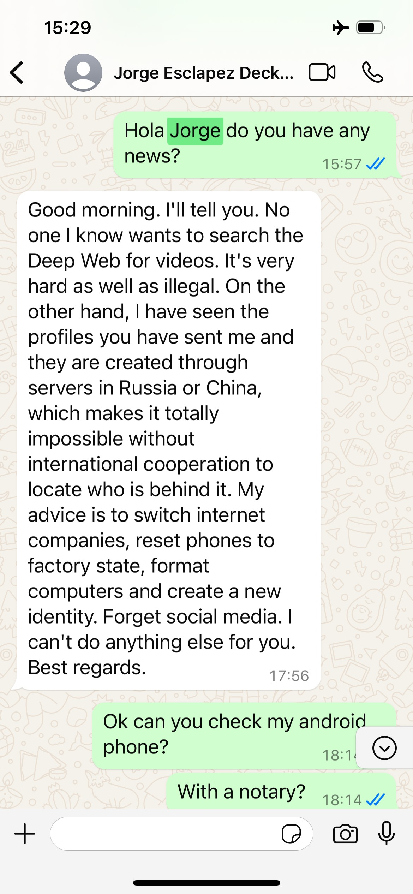

- Here is the [whole WhatsApp chat with Jorge](../../../content/whatsapps/jorge-chat.txt).
- It's interesting how I mention the `@drmuffy` account I was using for Polygon at the time.
- I see the handle has been completely taken over now, the time of writing being 20th October 2025.
- Certainly you would have needed to be logged in on my account to make the change, and I didn't have the chance to log out.
- Did they swap it for a fake account straight away?
- I guess Polygon backend engineers must have done that when [they fired me and shut down my system](../../2024/october.md#polygon-fires-the-whole-writing-team).

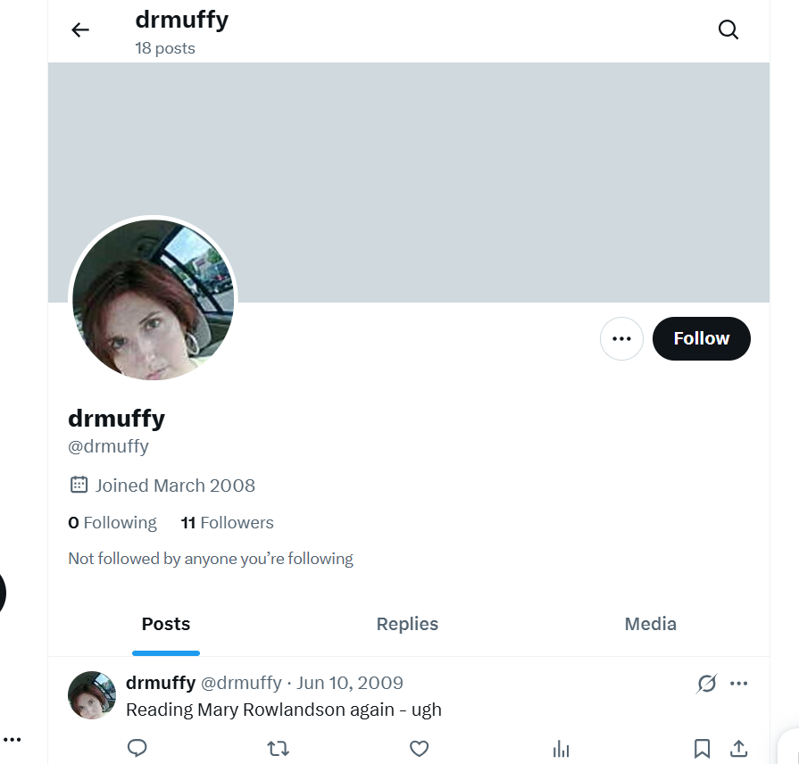

- The chat goes on over a few days and then a month later. 
- It is very *very* informative and corroborating when you check the times against the information.
- I lied, once, because I was beginning to have even more doubts about this man and I felt his manner had changed after I had given him certain pieces of information.
- In the end, I went elsewhere with some of my devices, but I kept the best stuff back because I didn't trust anyone in the Comunidad Valenciana at that point.

### The woman at Nowhere

- In the afternoon, a woman comes in to work at Nowhere and sits diagonally away from me.
- She looks familiar.
- She tells me she's an accountant and her name is Hazel.
- I ignore this.
- Thinking back, I either saw her online in June and July 2023 when I was practicing Transforming Touch over Zoom with a Dutch lady.
- Or/and, I saw her in some of the porn they flashed up at me on Google search. The older woman I saw in a porn posture (a private nude maybe) was very similar looking and was on my search results for months.
- Or/and, she was the [woman getting her photo taken after getting married](../../2023/april.md#a-wedding-on-las-rota-beach).

### Choir class

- I turn up to choir class that evening.
- The teachers and the adult staff are extremely angry with me for showing up.
- They set up Pablo to "bump" into me on the way into class. He seems really upset he had to do this and I'm furious about that.
- In class, my security cam alarm goes off on my phone. I check it.
- I can hear, recorded on my security camera, a group of men making ghost noises; "woooo-woooo". I laugh.
- While I'm sitting in class, I text a message to Chris BJ saying something like "I think all this aggression is probably training for my political career".
- Both the choir teacher's and the woman who sits beside me's (French horn player) phones beep at about the same time to alert them they've received a WhatsApp message.
- They both read it at the same time.
- They both look at me angrily: https://x.com/1FRGVN/status/1773436669007380597.
- The choir repertoire includes a song about domestic violence which is very aggressive and unpleasant, a horrible irony.
- As I leave the building, Ana is playing trumpet music on her laptop and I hear it from her classroom as I walk by.
- On my way home, through the tunnel, a longer-haired blond and stocky man of about 45 walks towards me grinning and blows in my face.
- That night I become extremely anxious and scared.

!!! tip "A little bird told me"
    - They sedated me that night and put a plastic bag over my head and tied it shut and left me sedated in this state to the point of death before undoing it.
    - That feels true and could explain the cold I was getting that evening becoming a six-week-long chest infection with a cough that made me crack a rib.

### Stalker activity

- The next thing I remember is waking up past midnight afraid for my life.
- I'm certain I'm in danger and it is related to whatever happened to Lorraine.
- I text Christine BJ, Alessandra, Brenda, and Sarah Lebanon to say that I would never commit suicide and I think whatever happened to Lorraine is happening to me.
- Online stalker activity is relentless.
- One of the fake accounts posts something like: "leave her, she's had enough now", and I felt an enormous upset. 
- For some reason, I thought Maria my old piano teacher posted this statement.
- It sounded like her voice; I know this doesn't make sense.
- I believe this statement is audible in one of the rape porn films taken from 1989, probably when I was sedated, which was likely quite violent.
- Did something similar happen to me that night sedated in my apartment?
- I wonder what the special was on Denia TV.

### My crypto account

- I lose access to my Coinbase crypto account that night.
- I don't know if they have stolen 70K from me or not.
- My account is completely locked.
- I'm really concerned about this.
- I tweet about it: https://x.com/1FRGVN/status/1768093834188087798.

### Chest infection

- I get very unwell after choir class, a cold which becomes a chest infection.
- It doesn't get better, it gets worse and worse.
- I'm extremely unwell for the next few weeks, and, in Madrid, I can hardly talk.
- Eventually, in India in the first week of April, I'm prescribed hardcore antibiotics and medicine for pleurisy.
- It's not before I have snapped a rib from coughing so hard.
- Notifications on fake accounts mention the coughing.
- The medication works and I recover in India.

## Thursday 14th March

### The dose ramps up

- Given that I was not fearful after the ridiculous piano concert on the 12th, and went to choir on the 13th, it seems reasonable to suppose I was relatively unaffected by this choreographed terror, perhaps I was getting used to it.
- However, the link to Lorraine Blackbourn was extremely sinister and got to me.
- Eventually, I text and tweet to everyone that I would never commit suicide and, if I turn up dead and it looks like I did, it's suspicious: https://x.com/1FRGVN/status/1768046490272870687.
- The following morning I am severely anxious. I'm bumping my head on things. I have to go to town. I am terrorized the whole way in and out. I feel horrendous.
- I believe I was on serious drugs and poison at this point that they were putting in the water.

### Spider man

- I'm heading back to my apartment.
- A man dressed as spider man is limping towards me.
- I recognize him.

### Devastated parents 

- Nevertheless, I set off for the conservatory.
- I pop into the church again just off the Carrer Loreto.

- A couple prays together at the front of the church, crying softly.
- They carry a picture of a young girl; a daughter they lost to the sex-slave industry, maybe?

- I hum the Salve from the back.

### Practicing the piano 

- I go into practice at the conservatory.
- I had an errand to run in town and I felt like everyone was looking at me, staring, and the threat levels were intense.
- A van drives towards me with "VIDAL" on the front of it, which makes me smile but is actually rather threatening.
- I'm extremely anxious and feel really uneasy in the piano room.
- I call the British embassy from there looking for help. They tell me they can't do anything for me and suggest I go to the police.
- On the way out I see Gloria. She's laughing at me, and says; "finally you're leaving now".

### Nowhere big blokes

- I had been working at Knowhere that day before going in to practice.
- I went back to work
- After a while, five big Russian or Ukrainian blokes come in and stand opposite me at the desks. They are pretending to talk about the computer. They are dressed like labourers. They are extremely rough types, five of them.
- I find it extremely threatening.
- I decide to leave Dénia.
- When I leave the offices about two hours later, they are outside at the exact the moment I step outside the door, surrounding a blond woman I've seen before in Dénia.

### Madrid

- In fear, I leave Dénia to go to Madrid and I stay from 14th-24th March at the AC Hotel Atocha by Marriot.
- I'm so stressed I bang my head really hard on the car boot.
- As I'm driving out of Denia, the blond woman I saw with the Russian men limps across the road in front of me.

!!! important
    - My hotel costs run into the thousands but I feel I have no choice.

- The threats continue: https://x.com/1FRGVN/status/1769859075813101947.
- More threats: https://x.com/1FRGVN/status/1769860927296258167.
- When I get to Madrid, I buy a new Android phone for my Spanish SIM and a small analogue phone at a shop called Movixoz. A man in the phone shop appears to know who I am and says something threatening to me.
- I am followed and tracked in Madrid. 
- Things that I say to my friend at lunch are repeated on fake account profiles later on. This happens every time I go to Madrid to see my friend.
- I write a letter **by hand** to my parents and I date it the following morning. This is the first contact with them for nearly 3 years.
    - [Letter to parents of 15th March](../../../content/documents/letters/letter-to-parents-march-15.pdf).
- I explain I'm being terrorized and by whom. I try to keep it calm because my parents are elderly, and I don't know how things are with them. I don't want to upset them too much.
- I tell them I believe that Domingo and his family are planning to murder me.
- I remind them of what he told me all those years ago, the threat of poisoning, something that I had told them at that time.
- While I'm in Madrid I reformat to factory settings both my Mac and iPhone. It doesn't appear to make any difference at all.
- I contact my friend I saw at [Christmas 2022](../../2022/december.md#madrid) and [Christmas 2023](../../2023/december.md#madrid).
- I tell her that I'm experiencing the hostile cyber-stalking flying-monkey attacks that she told me her sister was experiencing too, and I tell her what teachers and staff at the conservatory have done also.
- She advises we go to the police the following morning.

## 15th March

### Reporting the matter to the police in Madrid

- With the help of my friend I make a proper denuncia to the police in Madrid.
- The report goes well, although I am finding it very difficult to think straight, and my friend's translations and the consequent additions to the denuncia documents are not quite right.

    - [Denuncia page 1](../../../content/documents/evidence/Madrid%201.JPG).
    - [Denuncia page 2](../../../content/documents/evidence/Madrid%202.JPG).
    - [Denuncia page 3](../../../content/documents/evidence/Madrid%203.JPG).

- I start to show the police officer some of the screenshots I have, including the picture of me in my pants they put on Google search.
- At that moment, the conversation is somewhat shutdown and she tells us that before they can investigate I need to get a cyber expert to examine my devices in order to prove I've been hacked.
- I'm astonished.

### Cyber expert

- We do some research into getting my devices examined for hacking so that I can amplify my report to the police.
- We find out to have this done can cost thousands.
- We find an expert in Alicante who is reasonable, and quotes 600 euros for a laptop, phone, and two webcams.
- My friend helps me [write a letter](../../../content/documents/letters/Ampliacion%20Denuncia_Katharine.pdf) to David Piñeiro, the technical expert at D.P.R., Arzobispo Loaces, 17, Local 1 - 2, 03003 Alicante.

## 16th March

### Gaslight by Chris BJ

- Chris BJ gaslights me on WhatsApp by obviously and weirdly referring to a tweet I sent after the piano concert.

- When I ask her about it, she denies it.
- Throughout most of my communication with Chris BJ about the whole business there has been a high level of gaslighting coming from her, even though I shared all my documentation I sent to the Generalitat and other things.
- Her tone was always dismissive and given I knew she was obviously involved somehow, as I found out in January when I got such a weird reaction to talking about the trumpet teacher and was consequently uninvited from walking, I never trusted her fully, but she was useful.
- At the time of writing, I wonder if the English ladies have been involved in the terrorizing on Twitter too. It would not surprise me at all. It seems the whole region has been involved.
- I wonder if they're aware they were mobilized solely for the protection of pedophiles, and misogynist porn-gang fun incidentally.

## 17th March 

### Email to Paqui

- I [email Paqui](../../../content/documents/emails/Letter%20to%20Paqui%2017-3.pdf) about the concert and subsequent events. I want her to clarify why I should feel fearful about going to the conservatory. She does not reply.
- Her silence speaks a thousand words.
- I realize I am indeed not safe so I excuse myself from classes following the week of Fallas which means public holidays in the Valencia region.

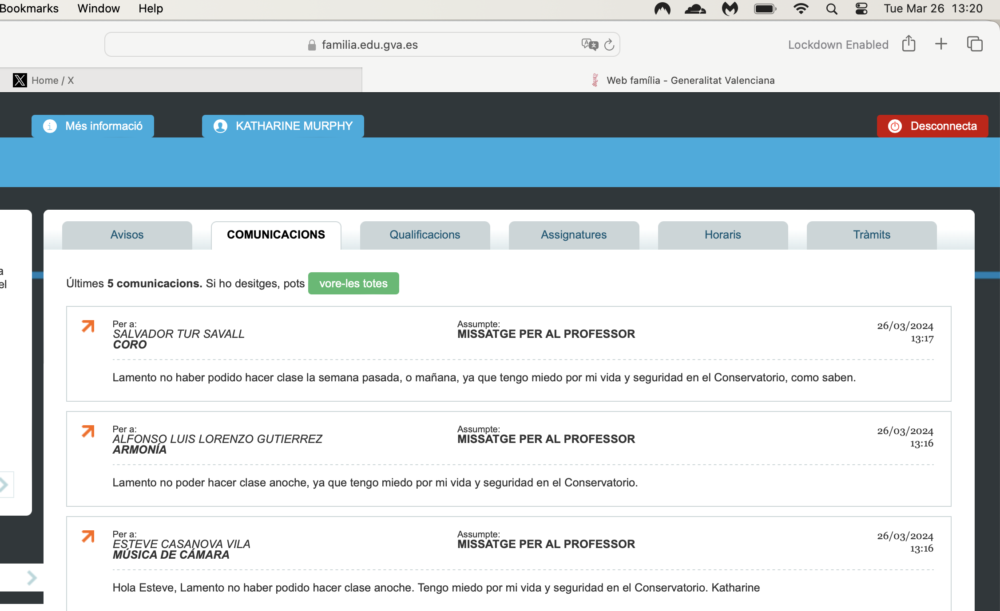

## 18th March

### I tell Gabriel Silva 

- wip.

## Online threats during this period

### Google search

- This one references my private health matter which I told no one about except Google, but they all knew about it. 

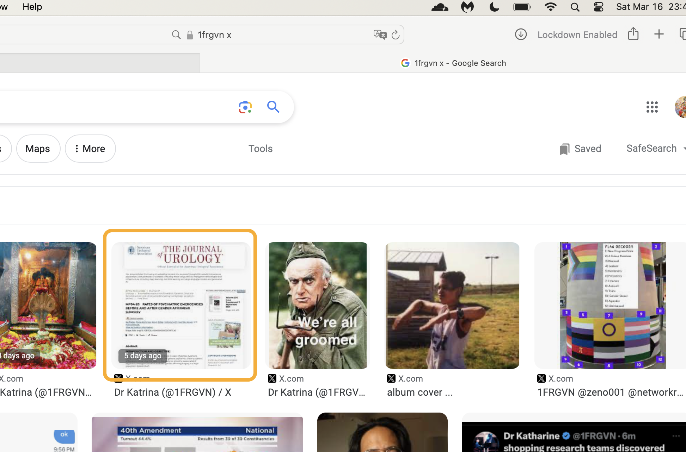

### Twitter screenshots

- The B.A. Feldman account has been pretending to be the trumpet teacher for a while. Quite often, Trump features in accounts I'm supposed to believe are the trumpet teacher's.

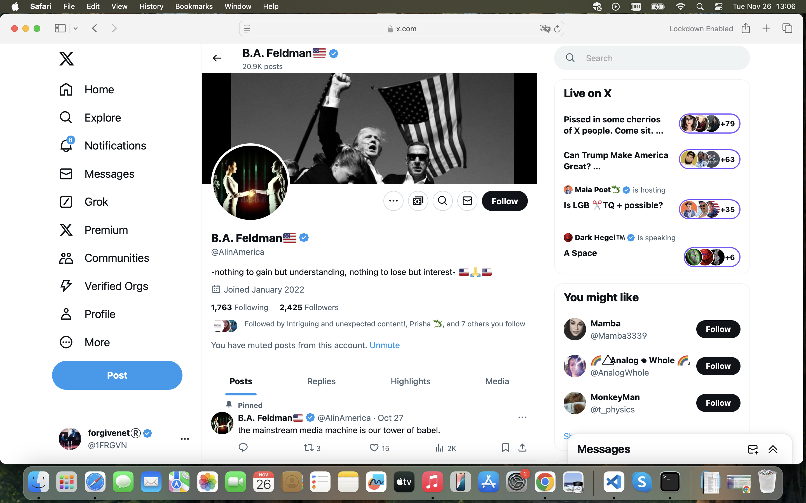

- The following account is an example of a few which had pure violence as content around this time. 

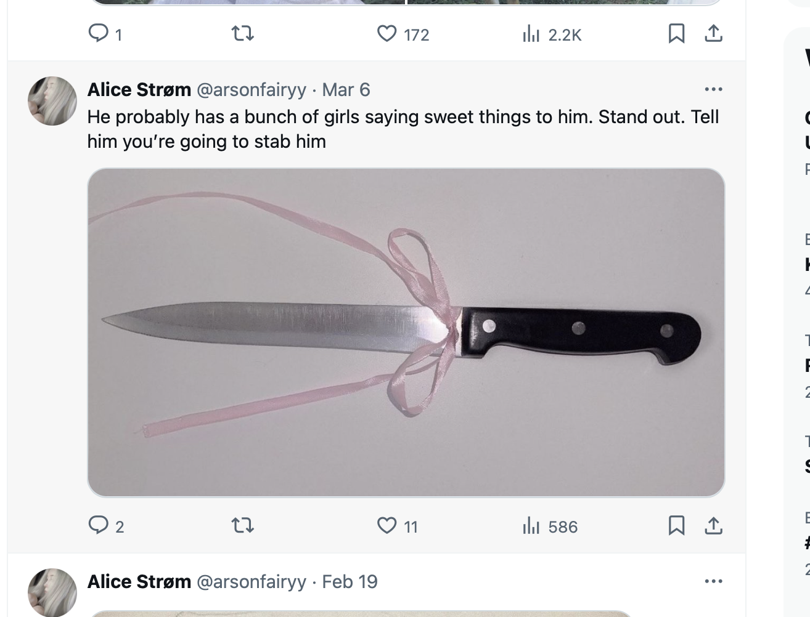

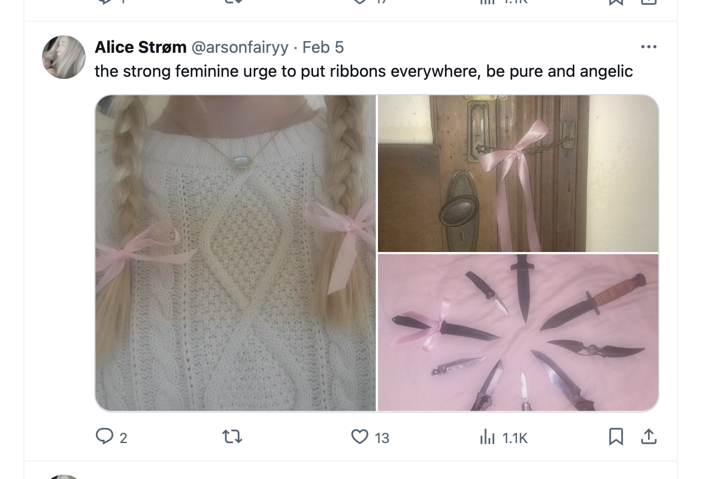
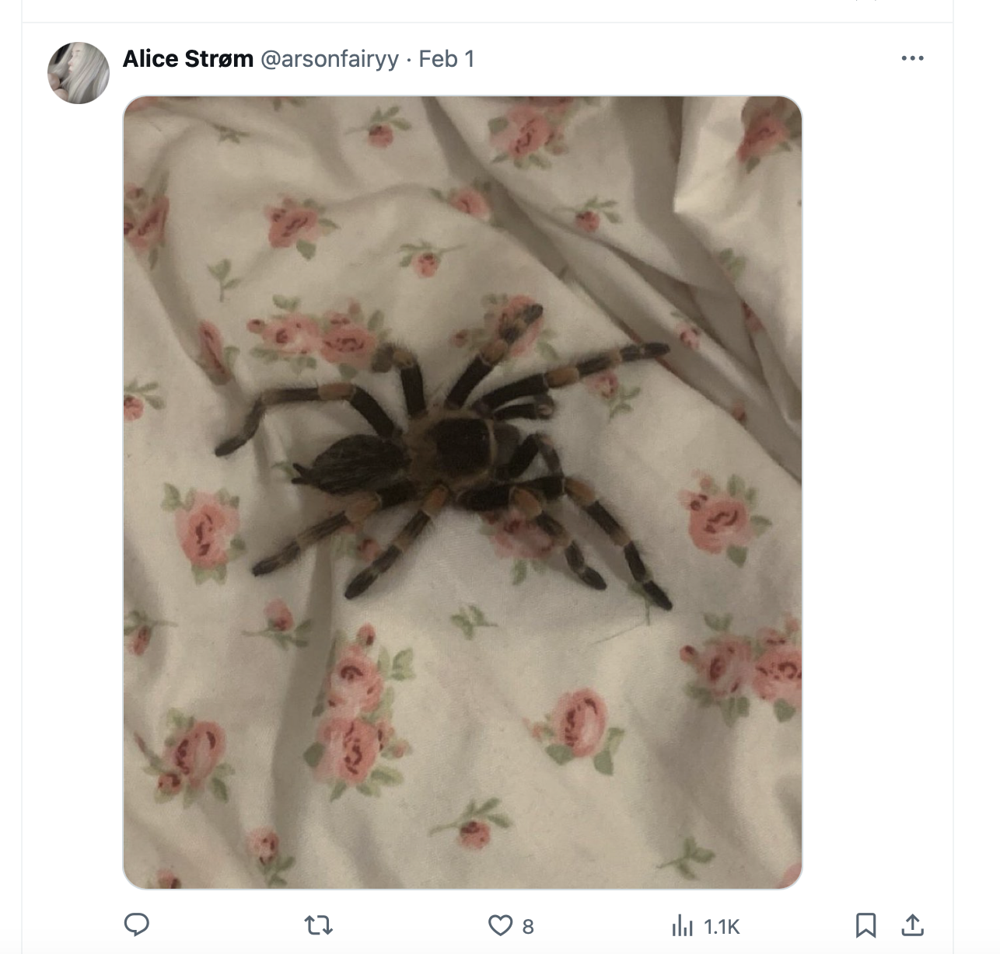
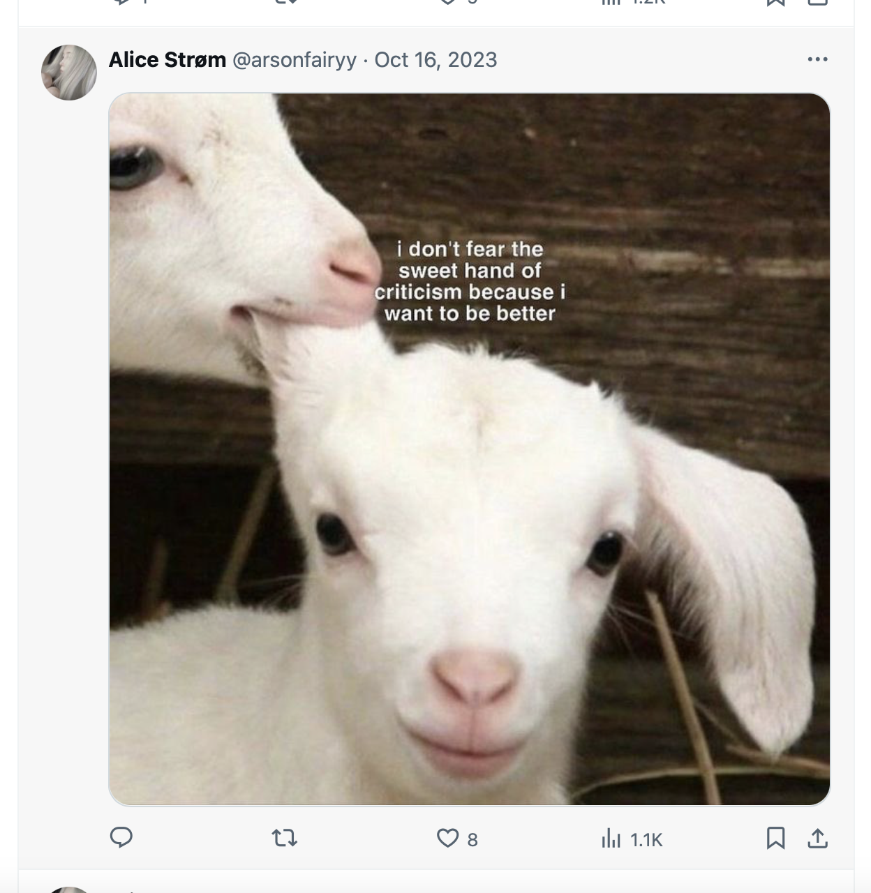

### Random threats of violence

- Norma relates to chamber music class and the bullying there.

- Khadidjatu sounds like Ka did you too. Africas is related to a song at choir and my personal life.

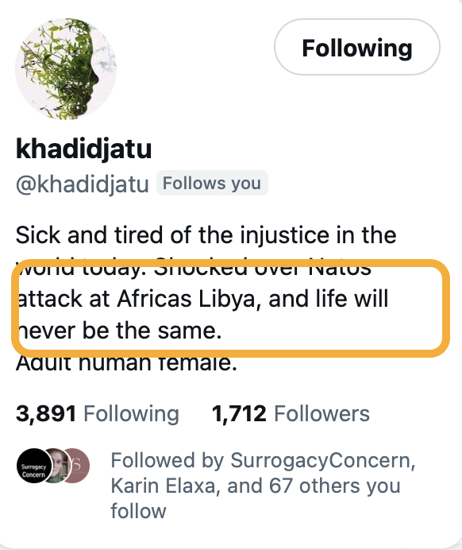

- A very threatening message. This whole tweet conversation with this account was extremely threatening and phosphorous poisoning was mentioned.

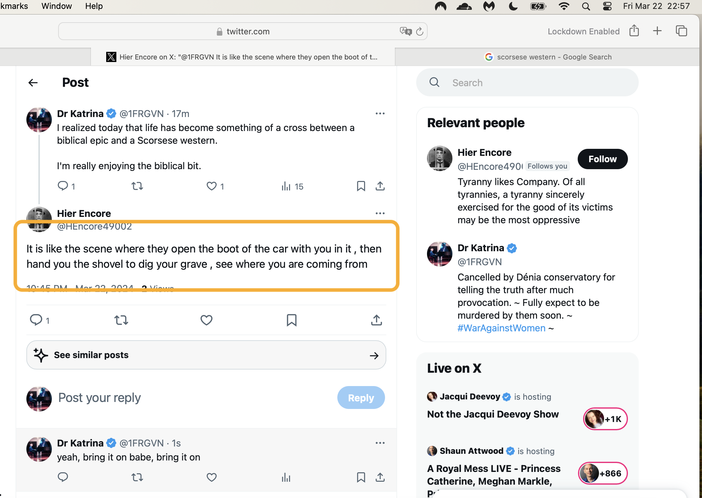

- I wondered if this account was the technician guy at the conservatory or the owner of the mobile phone shop.

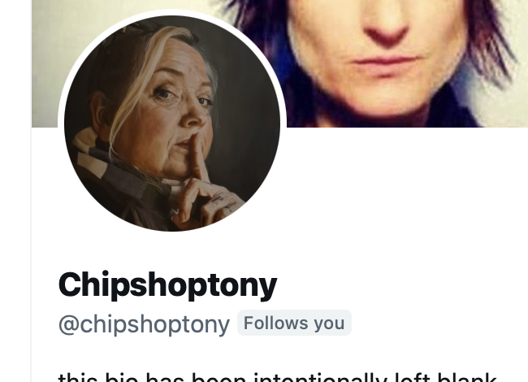

- Tyburski I took to mean they were going to tamper with my car. The comment is derogatory of course. Note this profile pic looks like the [nurse again](../../2021/december.md#semen-stains-on-the-sofa).

- The message translates to: "TERF I live for revenge."

- Gone fission I took to refer to a conversation I had with Christine BJ at lunch where I was explaining how being stalked like this felt. This was back in probably November 2023 sometime. 
- I had said that I believe the trumpet teacher was going to be the man I married and that he was doing the "if he likes you he treats you badly" thing to nuclear fission levels.

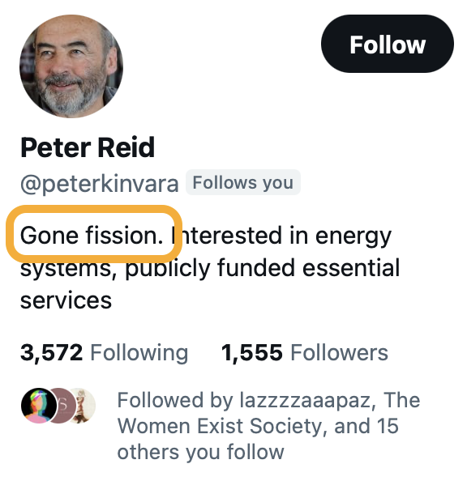

- An account called `@HierEncore49002` converses with me on Twitter. Peppered throughout the chat are threats and references to jail, drugs, and poisoning. Here's the search: https://x.com/search?q=%20%20(from%3AHEncore49002)%20(to%3A1frgvn)&src=typed_query&f=live and following are some examples.

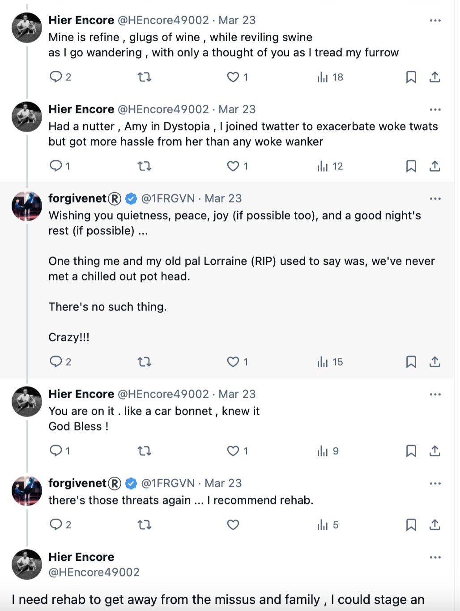
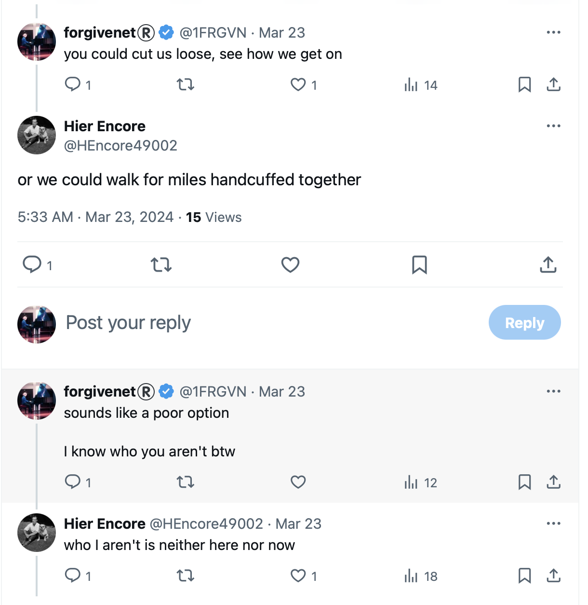

- Interesting deleted reference. I'll try and remember what it was. I think it was in reference to me going no contact with my family.

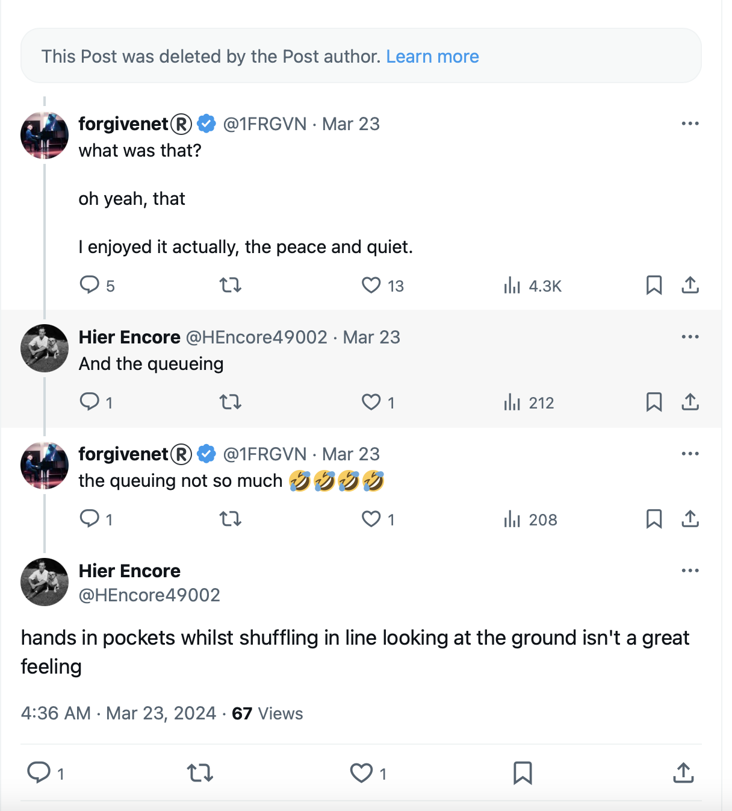

- I believe this account, like many others, is manned by either Hazel or Sandra Smith together with Domingo and Carmen Cano by delegation. 
- The reason I say that is because the English is extremely fluent, very vernacular for some messages, and then not at all.

### Ana account 

- I wonder if this was Ana Girbes by delegation or otherwise. 
- Whoever it was, the account interacted with me a lot and in a most unpleasant manner at times. 
- I guess it's entirely possible this is just a random account which happened to find itself in the middle of a professional cyber stalking attack, but I doubt it.
- Note she is calling herself `@loviatar` which is a bit of a play on words for avatar, and reminds me of the transformer figure I see on the `@jctot19` account every day, a figure which is drawn to look exactly like Ana Girbes, the musical language teacher at the conservatory.

- The evening after the following interaction, [Ana Girbes barks](../january.md#ana-and-ana-and-paqui), literally, at me about my very private health matter that no one *could possibly* know about unless they had access to my Google search activity.

- I can see them all laughing and giggling together after terrorizing me in this way at the conservatory.

!!! danger
    - Another reminder that these people are responsible for other people's children.

- The account seems to be priming me to believe it is Ana Requena, and she is talking about her boyfriend the trumpet teacher. 
- A lot of posts from her make these suggestions.
- The account would go from being extremely mean to suddenly caring and kind. Here's the account being reasonable at one point.

- And this is an example of the sort of gaslighting I would get after having been terrorized, as if I was imagining it. 

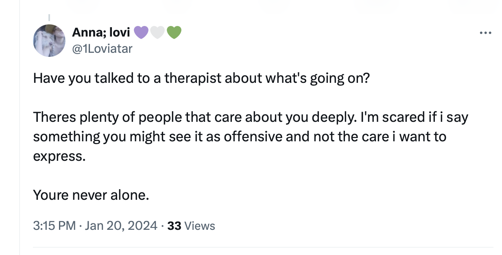

### Lorraine threats 

- Another account appeared to be a trigger to remind me of Lorraine Blackbourn who had hung herself in July 2021 in Dénia. 
- This account had been following me since January but the threat level ramped up in March.

- I thought `@kiwipally` was also a stalker account as they were very active at this time.

- The account no longer exists.

## 19th March

### Changing card PIN numbers

- I order a new bank card but I won't be able to use it until I get back to Dénia in April.
- I decide to change the card PIN numbers on my bank cards in Madrid.
- This process is extraordinarily difficult, it is as if I don't have the mental capacity to do a simple task like this.
- It takes me three or four trips to the ATM machine at the banks to finally do it, a whole day in fact.
- I'm so unbelievably stressed, simple tasks like this are becoming extraordinarily difficult to complete.
- I'm not at home, and I haven't been at home for 5 days so I wonder now what is continuing to impede my cognitive ability so much.

## Continuing threats

### Mike Wenham

- Mike Wenham was an old boss of mine at my first ever programming job with British Telecom in 2010.
- He was a psychopath and had terrorized the one other woman at work so badly, she walked out.
- When she left, they turned on me. It was horrible; rape jokes, porn on my screen. 
- I was forced to leave before 6 months was done on my first ever job in tech after gaining my PhD. It was devastating.
- In 2014 his wife emailed everyone to tell us Mike had murdered a woman and would we be able to help with character references for the police as she thought he'd had temporary insanity.
- Turned out he had had a penis enlargement operation which had gone horribly wrong and he lost a few inches, and after that had become obsessed with murdering a woman; it all came out in court.
- He ended up found guilt of murder and imprisoned, even though some of his colleagues took the stand and said what a good bloke he was.
- I wrote about this on Twitter when I was anonymous, in 2021 and 2022:
    - https://x.com/1FRGVN/status/1434110111895654402
    - https://x.com/1FRGVN/status/1566353197878362114
- I never once mentioned Mike Wenham, the name of the murderer, and yet, I am DM'ed by an account that asks me about him.

- I looked at the profile of the account and it was a typical fake account used by stalkers, just a few messages and followers.
- The message on the timeline was very suggestive because I had just found my mum's Twitter account. My cousin Leah had found me somehow a while back and I believe she told my mum I was on Twitter and gave her my details. 
- I saw her following me and subsequently found out it really was her. Curiously, the hackers were more sure of that than me at that time! Initially, I had thought it was another fake account.

- Anyway, the whole interaction with this account was extremely threatening.

- Whoever it was had done a fair bit of research on my Twitter activity and background to it.
- Again, the English is extremely vernacular so it has to be a native.

!!! danger "Did Mike Wenham have murderous intent towards me personally?"
    - It turned out, around 2 weeks before Mike Wenham murdered Karolina, he had invited me out to drink ayahuasca, which I found rather strange, and I had refused.
    - After Karoline was murdered, I remembered that while I was working for Mike in 2010, December time, he had also been doing part time building in a house in Leslie Road just up from my road. He had insisted I come and see him at this house on a Saturday morning in mid-December 2010. I went. 
    - He had plastic all over the floors. It was a top floor maisonette and I was climbing the stairs. I noticed he had a stanley knife in his hand. Something didn't feel right and I left. He urged me to come up but I said I didn't have time.
    - I didn't think about it again until after the murder.
    - The similarities were extraordinary.
    - Could anyone from Dénia be involved in these events? It seems unlikely ...

## 20th March

### Domingo the piano teacher

- The account `@AllyBrisket` had always seemed suspicious to me.
- Samuel from harmony class back in [May 2023 when the cyber stalking really got going](../../2023/may.md#harmony-class-the-week-after-my-first-explosive-tweet) may have signalled this account out to me during a weird chat.
- At this point I'm so stressed I start communicating with accounts directly as if they are who I they think they are.

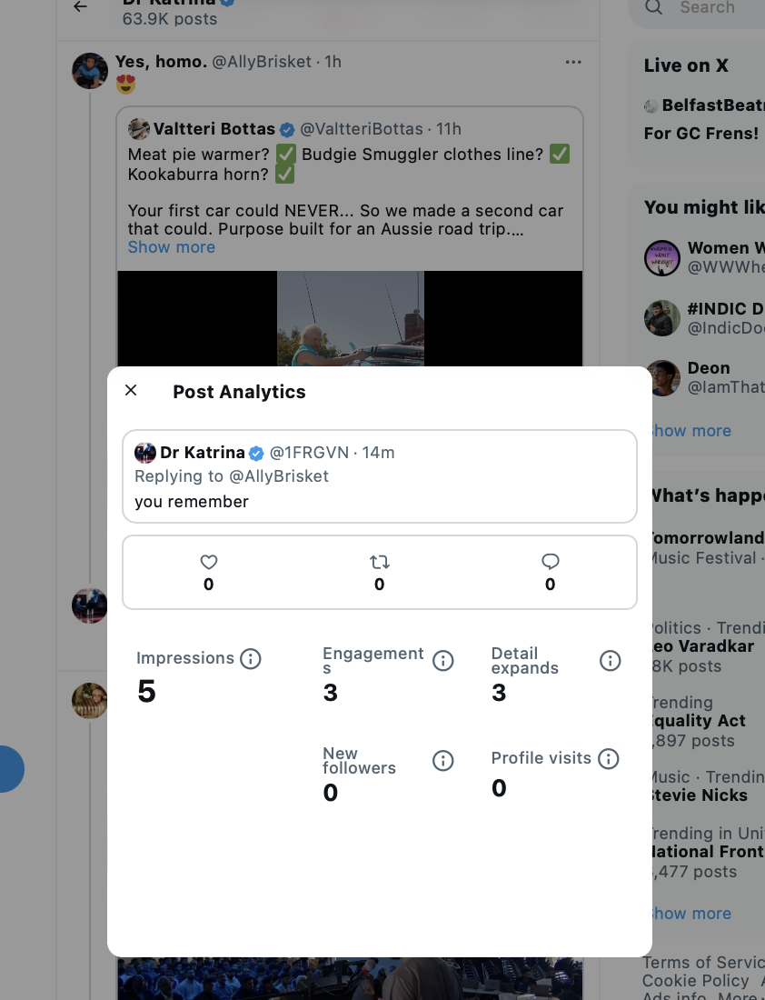

## 24th March

### Valencia

- I return to Valencia on the 24th March and stay in the Barcelo from 24th-27th, and then the Holiday Inn Express near the airport from 27th-29th March.
- I have a flight scheduled from Valencia to India on 29th March returning on Saturday 6th April so I need to be back in Valencia.
- In Valencia I feel like I am being constantly watched, that people know who I am, and everything is extremely unfriendly and unpleasant. 
- I did not have the intensity of this experience in Madrid, although it seemed I was being stalked there too.
- I believe now this is to do with whatever drug they gave me prior to me leaving, which was a high dose, and it has made me very paranoid.
- I wonder also if they managed to re-dose me somehow, or whether it was added to the car and so I got a dose after a long drive, or was the damage done at that point.
- I was extremely paranoid in Valencia and I was constantly stalked by fake accounts on Twitter.
- I also believe there are quite solid misogynist networks in the region which can be relied upon to inflict extra terror on a target whenever necessary.

## 31st March

### Letter to the Guardia Civil

- I write to the Guardia Civil from my hotel room in Mumbai.

    - [Letter in English](../../../content/documents/evidence/civil-guard.pdf).
    - [Letter in Spanish](../../../content/documents/evidence/civil-guard-spain.pdf).

- I print and send it registered from my Mumbai hotel.
- I don't know if anyone received it.

## Cowards hiding behind the women

- What I find very interesting is how the women in this sick history are as equally evil as the men.
- What's unsurprising is how the men are happy to remain hidden while they push the women out in front, to eventually take the blame when it all goes tits-up for them, which is inevitable of course.
- I wonder if, nowadays, girls with parents in the know get jobs as make-up artists, set designers, poisoners, rape victim shepherdesses, and similar, in the burgeoning local rape-spy-cam porn industry while their parents pray fervently that their daughters will not be targeted, but I guess even they become a coward's worthy challenge.

