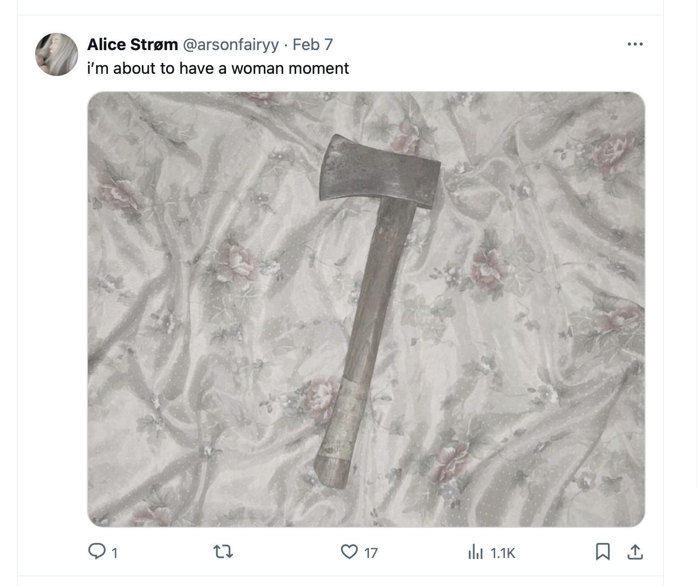
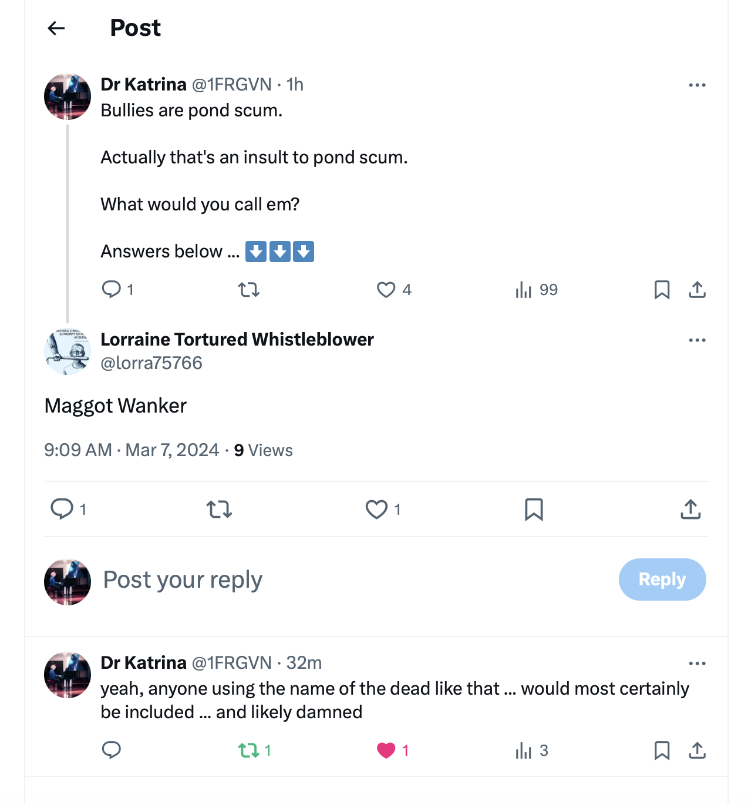
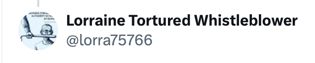
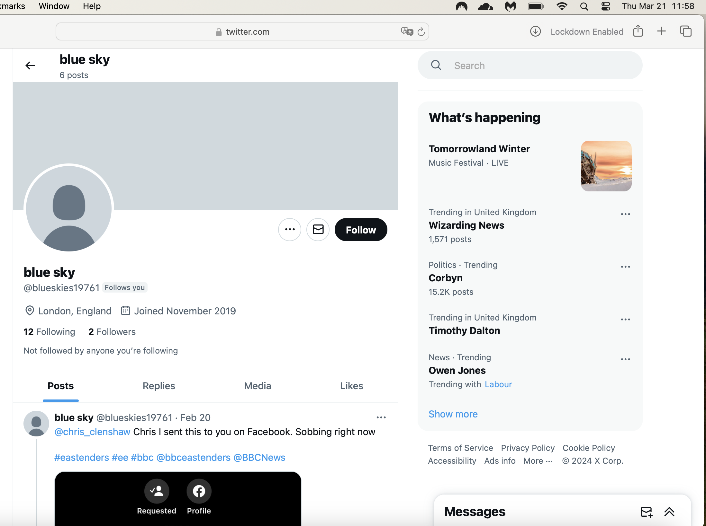

# March 13th to end

## Wednesday 13th March 

- I wake up and leave for the [serviced offices](https://www.knowheredenia.com/) in Dénia where I'm having to work due to hacking.
- Before I go, I post my feelings about the [previous night's](1-12.md#the-piano-concert) extraordinary spectacle on X.

- At lunchtime, I head down to the conservatory to practice, head held high after the previous evening's [Spanish-civil-servant super-s-show](1-12.md#the-piano-concert).

### Translator

- Since [Polygon's security department found evidence of hacking](../march/1-12.md#reporting-hacking-to-polygon-labs), I intend to report it to the police.
- After my experience with the [national police in Dénia in February](../february.md#my-first-trip-to-the-spanish-police-in-denia), I need to understand clearly what's required of me in order to report the hacking officially, and I need a translator to help me communicate it.
- I get a recommendation, Sara Lebanon, through an Irish woman Brenda who incidentally knows Alessandra very well *and* whose sister attended the [TT module in Galway in June 2023](../../2023/june.md#ireland) right after the [12th June 2023 porn-gang music-student-funeral at the conservatory](../../2023/june.md#monday-12th-june-2023) when ridiculous childish bullying by Spanish civil servants did not come near to explaining the obvious and extreme trauma I was processing.
- I meet Sara and she says we should go to the main square outside the tunnel to talk, I'm not sure why. 
- Was she told to take me there by someone? If so who? 
- The square is completely empty.
- I tell Sara everything; the child sexual abuse I suffered (she's very alarmed at this) and how it made me intolerant of children being sexualized at the conservatory (she's even more alarmed at this), and how I believed I had been targeted for [mentioning that very informally in 2015 to Joan Carles](../../early-years/2015.md#joan-carles).
- As I tell her the story of how I have been gang-stalked and cyber-stalked by teachers and staff at the conservatory, and the [appalling spectacle of someone dressing up as Lorraine Blackbourn, deceased](../march/1-12.md#a-serious-attack-on-my-wellbeing-from-piano-teachers-at-denia-conservatory), from the night before at the Casa de Cultura, it must be very obvious how traumatizing it all is.
- My voice is shaking; I'm holding back a lot of stress.
- She says to me, "Oh at least you know you're not imagining it". 
- I wonder why she would say that. She says it a few times.
- I never once thought I was imagining it. 
- Whenever she says it, I feel an internal sort of clunk, as if I'm bumping into an object I can't see.

!!! important "Gaslighting"
    - *It must be a relief to know you're not imagining it*, and similar statements and sentiments.
    - This is a recurring theme that's repeated to me by Sara here, Paul and Chris BJ repeatedly, Alessandra, Zoe in July 2024, and others.
    - Paul says it one of the times I meet him at the shop on my way to the Indian, and retracts it the next time I see him there when he downplays everything as if nothing is happening.
    - I wonder if this is how they *explained away* previous targets' complaints?
    - Or, could it be that non-technical targets would not have noticed clear evidence of hacking immediately, as I did?
    - How many women and children in the region have had similarly *imagined* horrific stories of online and in-person bullying? 
    
- We walk over to the Knowhere offices and go into the meeting room for privacy.
- On the Guardia Civil website we read that you have to provide proof of hacking before the police will investigate.
- Whatever...
- There's a list of police-recommended experts who analyze devices for the police.
- Sara looks one up.
- She finds one quickly and phones him.
- He is an expert in Alicante, [Jorge](https://www.linkedin.com/in/jorge-alejandro-esclapez-bonet-16629a1b7/) from [Deckcard23](https://deckcard23.com/). 
- On speaker-phone he sounds totally stoned, in an over-exaggerated way.
- I mention this to Sara. She agrees.
- I sense the probability of more conspiracy to come.

### Jorge checks some stalker accounts

- At some point, Jorge the expert looks at a list of stalker accounts that I send him.
- Here is his response:

#### Chat with Jorge Wednesday 13th

??? note "Chat with Jorge 13th March"
    [13/03/2024, 19:40:50] Jorge Esclapez Deckcard23: ‎Messages and calls are end-to-end encrypted. No one outside of this chat, not even WhatsApp, can read or listen to them. 
    [13/03/2024, 19:40:50] Niramisa Weiss: Hola Jorge soy Katharine 
    [13/03/2024, 19:41:18] Niramisa Weiss: La irlandesa con los problems en Dénia 
    [13/03/2024, 19:41:27] Jorge Esclapez Deckcard23: Hello 
    [13/03/2024, 19:41:42] Jorge Esclapez Deckcard23: Nice to meet you 
    [13/03/2024, 19:41:50] Niramisa Weiss: Likewise ☺️ 
    [13/03/2024, 19:42:20] Niramisa Weiss: So I have a very sensitive request which can be quite triggering 
    [13/03/2024, 19:42:29] Niramisa Weiss: Maybe upsetting 
    [13/03/2024, 19:42:55] Niramisa Weiss: Should i continue? 
    [13/03/2024, 19:43:15] Jorge Esclapez Deckcard23: Yes. How can i help you? 
    [13/03/2024, 19:43:35] Niramisa Weiss: Ok so when I was a child i was drugged and abused and it was filmed 
    [13/03/2024, 19:43:45] Niramisa Weiss: It’s a long time ago 1989 
    [13/03/2024, 19:44:19] Jorge Esclapez Deckcard23: 😳 omg 
    [13/03/2024, 19:44:23] Niramisa Weiss: I have been to the police and they arrested someone , about 8 years ago, they had a lot of evidence but they did not charge in the end 
    [13/03/2024, 19:44:32] Niramisa Weiss: You know how it is 
    [13/03/2024, 19:44:49] Jorge Esclapez Deckcard23: Ok. I understand. 
    [13/03/2024, 19:45:20] Niramisa Weiss: Yes so I believe these videos are online somewhere 
    [13/03/2024, 19:45:31] Niramisa Weiss: And they would be proof 
    [13/03/2024, 19:45:52] Niramisa Weiss: Maybe if you knew someone who could help 
    [13/03/2024, 19:46:10] Jorge Esclapez Deckcard23: Do you think that this person could be spy you? 
    [13/03/2024, 19:46:15] Niramisa Weiss: No 
    [13/03/2024, 19:46:45] Niramisa Weiss: But last year I was targeted by a man who I had turned down romantically in Denia 10 years ago 
    [13/03/2024, 19:46:54] Jorge Esclapez Deckcard23: Ok. That kind of videos are in the dark web. 
    [13/03/2024, 19:47:01] Niramisa Weiss: A piano teacher at the conservatory 
    [13/03/2024, 19:47:41] Niramisa Weiss: I used to live here and left for 8 years . I came back 2 years ago and started my studies again 
    [13/03/2024, 19:48:03] Jorge Esclapez Deckcard23: It's difficult find someone to search that kind of videos. 
    [13/03/2024, 19:48:14] Niramisa Weiss: But he was not happy about this and caused me a lot of problems, including hacking my laptop and phone through the router 
    [13/03/2024, 19:48:33] Niramisa Weiss: They took very private videos and recordings of me 
    [13/03/2024, 19:48:48] Niramisa Weiss: And sent the around the town here in denia 
    [13/03/2024, 19:48:58] Niramisa Weiss: I would like those too if possible 
    [13/03/2024, 19:49:22] Niramisa Weiss: Literally everyone knows what is going on and no one helps me 
    [13/03/2024, 19:49:40] Niramisa Weiss: I complained to the generalitat and they ignored me 
    [13/03/2024, 19:49:49] Jorge Esclapez Deckcard23: Ok. Then you need found the videos. 
    [13/03/2024, 19:49:56] Niramisa Weiss: I’m threatened on twitter and the police aren’t interested 
    [13/03/2024, 19:50:23] Jorge Esclapez Deckcard23: Sure. 
    [13/03/2024, 19:50:54] Niramisa Weiss: I see messages on twitter about my bank balance, payments I have made, they even sent me a picture I took of myself that they stole … a bit AI but me for sure 
    [13/03/2024, 19:51:03] Niramisa Weiss: It’s overwhelming 
    [13/03/2024, 19:51:28] Niramisa Weiss: They have access to this phone 
    [13/03/2024, 19:51:35] Niramisa Weiss: It’s a nightmare 
    [13/03/2024, 19:52:13] Jorge Esclapez Deckcard23: And what is the police answer? 
    [13/03/2024, 19:52:19] Niramisa Weiss: There’s probably about 50 minimum accounts tracking me on twitter 
    [13/03/2024, 19:52:39] Niramisa Weiss: Police sent me away, no crime, but they didn’t want to help me at all 
    [13/03/2024, 19:53:03] Niramisa Weiss: I’m worried about my family being robbed 
    [13/03/2024, 19:53:18] Niramisa Weiss: Phished now because they have so much information 
    [13/03/2024, 19:53:51] Jorge Esclapez Deckcard23: Well. Then the solution is discover who is the person behind the Twitter profiles? 
    [13/03/2024, 19:54:05] Niramisa Weiss: The people at the conservatory know private things about me that I only ever told google 
    [13/03/2024, 19:54:26] Niramisa Weiss: Can you do that? 
    [13/03/2024, 19:54:40] Niramisa Weiss: I know who it is 
    [13/03/2024, 19:54:47] Niramisa Weiss: Ring leader at least 
    [13/03/2024, 19:55:56] Jorge Esclapez Deckcard23: I can try Discovery using social engineer and investigation. 
    [13/03/2024, 19:56:29] Jorge Esclapez Deckcard23: I dont understand that expresion.😅 
    [13/03/2024, 19:56:35] Niramisa Weiss: Thank you 
    [13/03/2024, 19:56:43] Niramisa Weiss: Respect 
    [13/03/2024, 19:58:24] Jorge Esclapez Deckcard23: Ok. If you send me any information i Will try found about that. 
    [13/03/2024, 19:58:43] Niramisa Weiss: What do you need? 
    [13/03/2024, 19:59:13] Niramisa Weiss: I have 2 twitter accounts they are manipulating 
    [13/03/2024, 19:59:24] Jorge Esclapez Deckcard23: Any Twitter account for instance. 
    [13/03/2024, 19:59:32] Jorge Esclapez Deckcard23: Perfect. 
    [13/03/2024, 19:59:47] Niramisa Weiss: Ok I have 2 and I can send you details of the main suspect accounts 
    [13/03/2024, 20:00:30] Jorge Esclapez Deckcard23: Great. I see that and after i will contact you again. 
    [13/03/2024, 20:00:37] Niramisa Weiss: They seem to be a honey-trap type gang or gangs for estafa 
    [13/03/2024, 20:01:05] Niramisa Weiss: How can I send without them knowing? 
    [13/03/2024, 20:01:32] Niramisa Weiss: I can send in an hour or two 
    [13/03/2024, 20:02:22] Jorge Esclapez Deckcard23: Take a screenshot. 
    [13/03/2024, 20:02:45] Jorge Esclapez Deckcard23: When you want. No worries. 
    [13/03/2024, 20:02:57] Niramisa Weiss: Ok 
    [13/03/2024, 20:03:53] Niramisa Weiss: You can look at my accounts now 1FRGVN and jackchardwood 
    [13/03/2024, 20:04:41] Niramisa Weiss: And even my work twitter they got hold of immediately I created it 
    [13/03/2024, 20:05:03] Niramisa Weiss: Drmuffy 
    [13/03/2024, 20:05:15] Niramisa Weiss: I have 2fa on all 3 
    [13/03/2024, 20:05:51] Jorge Esclapez Deckcard23: 👍 
    [13/03/2024, 20:06:13] Jorge Esclapez Deckcard23: 😳 
    [13/03/2024, 20:06:18] Niramisa Weiss: Yes 
    [13/03/2024, 20:06:31] Niramisa Weiss: But they have access to my machines directly so 
    [13/03/2024, 20:06:45] Jorge Esclapez Deckcard23: You must have any kind of stalkerware in the pc. 
    [13/03/2024, 20:07:00] Niramisa Weiss: If you look at highlights in 1frgvn you see the whole story 
    [13/03/2024, 20:07:06] Jorge Esclapez Deckcard23: Or in the router. 
    [13/03/2024, 20:07:24] Niramisa Weiss: It was the router, they told me it was Mac spoofing 
    [13/03/2024, 20:07:35] Jorge Esclapez Deckcard23: Ok. I see It ASAP. 
    [13/03/2024, 20:07:59] Niramisa Weiss: If you look at August last year this was the very interesting time 
    [13/03/2024, 20:08:07] Jorge Esclapez Deckcard23: They? 
    [13/03/2024, 20:08:17] Niramisa Weiss: Yes 
    [13/03/2024, 20:08:30] Niramisa Weiss: It will be this guy and his family and friends 
    [13/03/2024, 20:08:39] Niramisa Weiss: And they may be criminals 
    [13/03/2024, 20:08:41] Jorge Esclapez Deckcard23: Ok. 
    [13/03/2024, 20:09:18] Niramisa Weiss: In August last year I had very few followers and no one was looking at my tweets, just them 
    [13/03/2024, 20:09:46] Niramisa Weiss: I could tell because they were translating them and I only ever log in on uk VPN 
    [13/03/2024, 20:10:10] Niramisa Weiss: They terrorized me with threats so I went public and got 2000 followers overnight 
    [13/03/2024, 20:10:31] Niramisa Weiss: At that point the stalking got really really bad for me here 
    [13/03/2024, 20:10:43] Jorge Esclapez Deckcard23: Ok. A lot of information. I start with that and in a couple of days i Will contact to you again. 
    [13/03/2024, 20:10:54] Niramisa Weiss: Ok I’ll send some screenshots in a bit 
    [13/03/2024, 20:11:07] Jorge Esclapez Deckcard23: Great. 
    [13/03/2024, 20:11:08] Niramisa Weiss: Thank you 
    [13/03/2024, 20:11:23] Jorge Esclapez Deckcard23: 👍👋👋 
    [13/03/2024, 20:11:42] Niramisa Weiss: And if you know someone who might be able to trawl the dark web for me let me know 
    [13/03/2024, 20:12:16] Niramisa Weiss: The hackers mentioned things related to those times so I wonder if they found something already because they’re obsessed with me 
    [13/03/2024, 20:12:22] Jorge Esclapez Deckcard23: Of course. 
    [13/03/2024, 20:12:38] Niramisa Weiss: Thank you. I appreciate this so much 
    [13/03/2024, 20:12:57] Niramisa Weiss: Jctot19 is one of them 
    [13/03/2024, 20:13:10] Niramisa Weiss: Also they manipulate google search 
    [13/03/2024, 20:14:03] Niramisa Weiss: So if you search for “1frgvn x” or “jctot19 x” the results are manipulated to send me messages 
    [13/03/2024, 20:14:19] Niramisa Weiss: That’s how they sent me the pic 
    [13/03/2024, 20:14:38] Niramisa Weiss: Which I will forward but it’s in highlights actually in 1frgvn 
    [13/03/2024, 20:14:51] Jorge Esclapez Deckcard23: Ok. I Will be that too. 
    [13/03/2024, 20:14:59] Niramisa Weiss: 🙏 
    [13/03/2024, 20:16:29] Niramisa Weiss: I’d really like to know how they do that btw 
    [13/03/2024, 20:27:09] Niramisa Weiss: They are using a lot of AI images too of mixed faces of people I know 
    [13/03/2024, 20:32:31] Jorge Esclapez Deckcard23: Ok, i m going to work . I contact to you in a few days and we continue the conversation. 
    [13/03/2024, 20:32:46] Jorge Esclapez Deckcard23: Best regards. 
    [13/03/2024, 20:53:07] Niramisa Weiss: Thank you 
    [13/03/2024, 21:14:31] Niramisa Weiss: https://drive.google.com/file/d/1EturDPGMRS2Lsd_pGxKEeCNcF_Vc1XFm/view?usp=drivesdk 
    [13/03/2024, 21:14:43] Niramisa Weiss: Folder in there with screenshots 
    [13/03/2024, 21:14:51] Niramisa Weiss: Let me know if you need access 

- I didn't get back to finishing this conversation until the early hours of the following morning.
- It's as if something interrupted the flow while I was walking and texting on my way back home from choir.
- Here is the [whole WhatsApp chat with Jorge](../../../content/whatsapps/jorge-chat.txt).
- It's interesting how I mention the `@drmuffy` account I was using for Polygon at the time.
- I see the handle has been completely taken over now, the time of writing being 20th October 2025.
- I guess Polygon backend engineers must have done that when [they fired me and shut down my system](../../2024/october.md#polygon-fires-the-whole-writing-team).

- Certainly you would have needed to be logged in on my account to make the change, and I didn't have the chance to log out.
- Did they swap it for a fake account straight away?
- The chat goes on over a few days and then a month later. 
- It is very *very* informative and corroborating when you check the times against the information.
- I lied, once, because I was beginning to have even more doubts about this man and I felt his manner had changed after I had given him certain pieces of information.
- The response I screenshot felt like my *desperate need* for help was being shut down.
- If I had followed his advice, I'd have been porn-mincemeat.
- In the end, I went elsewhere with some of my devices, but I kept the best stuff back because I didn't trust anyone in the Comunidad Valenciana at that point.
- I still have them.

### The woman at Knowhere

- In the afternoon, a woman comes in to work at Knowhere and sits diagonally across from me.
- She looks familiar.
- She tells me she's an accountant and her name is Hazel.
- I ignore this. She is not Hazel Smith.
- Thinking back, I either saw her online in June and July 2023 when I was practicing Transforming Touch over Zoom with a Dutch lady. They looked similar for sure.
- Or/and, I saw her in some of the porn they flashed up at me on Google search. The older woman I saw in a porn posture (a private nude maybe) was very similar looking and was on my search results for months.
- Or/and, she was the [woman getting her photo taken after getting married](../../2023/april.md#a-wedding-on-las-rota-beach).

### Choir

- I turn up to choir class that evening, as normal.
- The feeling at the conservatory is colder and frostier than it has ever been.
- I can nearly see the hatred towards me dripping off teachers and staff, and some students too.
- Teachers and staff are furious with me for showing up this evening after [their second failed crucifixion](1-12.md#the-piano-concert) which must have taken enormous resources and efforts to organize.
- Adriana, the Romanian girl, Domingo's student, has been told something about me and she is confused about it.
- It's as if someone wants me to know she's a porn-gang target.
- I'm *extremely* concerned about the safety of Adriana, and have been since at least 12th June 2023. She's beautiful and looks older than 14.
- As with all the other children these people have control over, literally no-one cares about their safety and wellbeing. It's horrifying.
- In class, my security cam alarm goes off on my phone again, [just like the night before at the concert](1-12.md#the-piano-concert). 
- I check it.
- I can hear, recorded on my security camera alarm, a group of adult men making ghost noises; "woooo-woooo". 
- I laugh. 
- It's ridiculous.
- They are demonstrating total access to my network, and I still have the recording.
- I tweet a message to the Spanish police at this moment, because I know they'll read it and it's *all* I can do to defend myself against these continuous assaults.

- A little bit later, I text a message to Chris BJ saying something like: *I think all this aggression is probably training for my political career*.
- (This is a curious thing for me to have said given the trajectory of the next few months.)
- Moments later, the WhatsApps of both the choir teacher, Salva, and the woman who always sits beside me (dumpy French horn player called Vicen, I believe) audibly go off.
- They get their phones out and read the message at the same time.
- They look at me angrily. 
- Vicen sneers.

- They are demonstrating to me how everything private I do in my life is monitored and disseminated in seconds.
- It means the lengthy texts [I send to Jorge during choir and beyond](#jorge-checks-some-stalker-accounts) are also being read in real-time.
- We sing the [horrible domestic violence song again](../february.md#domestic-violence-in-choir-class) which is obviously a *celebration of* (sexual) violence against women and girls, and how the whole community comes out for that.
- As I leave the building, Ana is playing trumpet music on her laptop; I hear it playing softly in her classroom as I walk by.
- I'm texting with Jorge while walking as I leave to go home.
- As I approach the tunnel, a longer-haired blond and stocky man of about 45 swaggers towards me grinning.
- He looks like a seventies DJ.
- He walks right up to me and blows in my face.

- I'd remember him in an instant. 
- Everyone will know who the seventies DJ is.

#### Distraction, then drugging

- It is my view, the *blowing in the face* routine is a distraction technique used by criminals to drug people, and I was drugged immediately by another man coming in from the side or behind me, probably with a dissolving patch on any visible skin or perhaps powder in my ear.
- Was I frog-marched back home, like [the other drugged lady](../../2023/november.md#tonya) I used to see regularly?
- I don't remember anything more about the evening until much later when I wake up in my bed in a state of terror.

### State of terror

- The next thing I remember is being conscious of something evil in my vicinity, to the point of being concerned that I might be murdered and they would make it look like suicide.

- I'm certain I'm in danger, and that it is related to whatever happened to Lorraine Blackbourn.
- I no longer believe that Lorraine Blackbourn committed suicide.
- I text Christine BJ, Alessandra, Brenda, and Sarah Lebanon to document further that I would never commit suicide and if I turn up dead it's murder.
- None of them reply to these texts in a normal way, if they reply at all.
- I tell them that I think whatever happened to Lorraine is happening to me.
- Online stalker activity is relentless, and I'm not posting much at all.
- One of the fake accounts posts something like: "leave her, she's had enough now", and I feel an enormous upset, like a punch in the stomach.
- For some reason, I thought Maria the piano teacher posted this statement.
- It sounded like her voice; I know this doesn't make sense.
- I believe this statement is audible in one of the sedated-child gang-rape porn films made in 1989 which was likely quite violent.
- Did something similar happen to me that night while I was sedated in my apartment?
- Who was there? Did anyone see them coming in with me?
- I wonder what the special was on Denia TV that night.
- My shoulders, arms, and hands feel numb, like they've stopped working.
- Even pressing touchscreen buttons on my phone is challenging.

### Did they rob my crypto account?

- I try to access my Coinbase crypto account around 2am.
- I'm locked out.
- I don't know if criminals have stolen 60K from me or not.
- Could they have done this while they were in my apartment with me without my conscious awareness?
- I'm really concerned about this and send a tweet to Coinbase as I'm unable to contact them through the app.

- Even with all this going on, I tweet an "up yours" to Dénia criminals.

- There is a sense of having become so accustomed to the daily terrorizing, I'm able to withstand it, collect myself, and continue on into battle.
- I want them to know I *will* be going to the conservatory to practice the piano in the morning.

## Thursday 14th March

### Chat with Jorge Thurs 14th

- I finish texting Jorge.
- Something had interrupted me while I was texting him on my way home from choir the night before.
- I hadn't got around to sending him the pic I had promised on [Wednesday 13th at 20:14](#chat-with-jorge-wednesday-13th).
- I also tell him I think I've been robbed.

??? note "WhatsApp with Jorge 14th March"
    [14/03/2024, 03:48:29] Niramisa Weiss: ..attached: 00000114-PHOTO-2024-03-14-03-48-29.jpg 
    [14/03/2024, 03:48:48] Niramisa Weiss: That's my bottom half the top is AI 
    [14/03/2024, 03:48:55] Niramisa Weiss: There are lots of these 
    [14/03/2024, 03:49:04] Niramisa Weiss: I will pay you of course 
    [14/03/2024, 03:51:54] Niramisa Weiss: They may have accessed my Coinbase account. I'm blocked and I cannot contact Coinbase so I don't know if they've robbed me or not 
    [14/03/2024, 12:36:20] Niramisa Weiss: Looks like they robbed me 60k euros 

### Chest infection

- At choir the night before, I was getting a cold.
- The following morning, it worsens and I lose my voice.
- The cold deteriorates into a chest infection and constant coughing fits.
- I'm extremely unwell for the next few weeks and I can hardly talk.
- Eventually, in India in the first week of April, three weeks later, I'm prescribed hardcore antibiotics for pneumonia and medicine for pleurisy by the hotel doctor.
- I call the hotel doctor after [I snap the same weak rib I snapped in yoga](1-12.md#cracked-rib) from coughing so hard.
- Notifications on fake X accounts mention the coughing in a jeering manner, sometimes right after a fit.
- It seems they are listening to everything I do and making a lot of effort to upset me.
- The medication works and I recover in India.
- My lungs have always been a trauma weak point.
- Whatever happened to me on the [night of Wednesday 13th March](#state-of-terror) shocked my whole system and I believe was likely connected to my respiratory function.
- People in the town know what happened to me at the hands of the porn-gangs, and they delighted in it.

### The hallucinogen dose ramps up

- The following morning I wake and go about my business as usual.
- I make coffee and drink water.
- I skip breakfast.
- I head into town with my laptop and piano books.
- Something starts to cause me *extreme* anxiety.
- Is it visceral memories of what happened the night before?
- I seemed to be OK when I woke up and was getting ready in my apartment.
- The new information I have about Lorraine Blackbourn is on my mind.
- Did they tell me or show me something while they were in my apartment without my conscious awareness?
- I have an errand to run before I start work.
- As I walk through the tunnel, and along the streets of the old town, people give me dirty looks, some stand staring with their mouths open, women mumble underhand comments as I walk by them.
- A van drives towards me screeching its wheels.
- *VIDAL* is written in giant letters on the front bonnet, which makes me smile but is actually very threatening.

- Later, I will bump my head badly on my car boot door.
- I'm walking into things. 
- My shoulders, arms, and hands feel numb.
- I'm wobbly on my feet.
- I feel terrorized by everyone and no-one.
- Its horrendous.
- Am I ingesting strong anxiety-forming substances through my water now; like a stronger hallucinogen than normal, something on top of the daily mandrake dose which is exacerbating the reasonable anxiety I have?

### Practicing the piano 

- I leave the Knowhere offices to practice the piano at the conservatory.
- I'm extremely anxious and I feel really uneasy in the piano room, as if I'm being watched.
- I can't play; my arms, hands, and fingers are not working properly.
- I call the British embassy from the piano room asking for help. 
- They tell me they can't do anything for me and suggest I go to the police.
- I explain what happened with the [police in February](../february.md#my-first-trip-to-the-spanish-police-in-denia).
- They don't seem to care.
- I start thinking about going to the police in Madrid.
- I leave the conservatory.
- Gloria is walking towards me. 

- She's laughing at me.
- She says; *Finally, you're leaving now*.
- I don't understand what would make her say that and be so sure of it.

### Devastated parents 

- Returning to work, I decide to take a detour to the Carmelite church on the Carrer Loreto to light a candle for myself.
- I need one.

- A middle-aged couple is praying together at the front of the church; they are crying softly.
- They carry a picture of a young girl; a daughter they lost to the porn-gangs.

- I wonder if she was a musician, or a dancer.
- I hum the Salve from the back.

### Threatening men at Knowhere

- At the Knowhere offices I ask the French manager to borrow a paper shredder.
- He finds one for me.
- I'm so worried about being robbed, I have brought stacks of my personal financial paperwork into the office from home to destroy.
- I believe the honey-trappers want all my money.
- I still have no idea what has happened to the [60K in my Coinbase account](#did-they-rob-my-crypto-account).
- After lunch, and my [failed attempt to practice the piano](#practicing-the-piano) at the conservatory, I return to the Knowhere offices to work.
- I'm sitting there quietly.
- A group of very rough-looking Russian or Ukrainian men come in and stand at the opposite desk to me.

- They are pretending to talk about the computer. 
- It is a totally incongruous scene. 
- Men like these do not come into serviced co-working spaces to randomly discuss computers.
- They are dressed like labourers. 
- They are extremely rough types, four or five of them.
- Each of them glances at me from time to time.
- I find it extraordinarily threatening.
- I decide to leave Dénia immediately and I book a hotel in Madrid.

#### Leaving the Knowhere offices

- When I'm ready to leave the offices about two hours later, the same group is right outside the door at the exact the moment I step outside.
- They are walking by in formation.
- They surround a blond woman I've seen before in Dénia who is walking in step with them.

- They have timed this precisely; someone directing them knows my exact location by either my phone or from a conspirator in the office who has been waiting for me to leave, or both probably.
- The woman looks like a nurse who used to [sing in Klara Sarkadi's choir back in 2013](../../../crimes/introduction-agents.md#klara-sarkadi) just before [I met Mercedes there and she suggested I study the piano at the conservatory](../../early-years/2013.md#meeting-mercedes).

#### Asking for the CCTV of the men

- Later, sometime in April I believe (I will confirm with supporting documentation in due course), I text and email the manager of Knowhere and ask him to save the CCTV of both these events.
- I tell him I'm being terrorized by people in the town.
- He doesn't believe I am who I say I am, and he blocks me on WhatsApp.
- I email instead.
- I give him the exact times and location of these men inside and outside the office.
- I gift the remaining days I paid for to an old and very dear friend who I noticed was in the pictures on the walls of people who regularly use the offices.

### Spider-man

- At home, I organize my belongings and pack for an extended stay away.
- It's hard to think straight about anything and my arms and shoulders hurt. 
- I have wet laundry that needs drying.
- I take it to the [La Colada laundry](../../2023/november.md#the-laundry) five minutes walk away.
- As I'm heading back to my apartment with my dry laundry, a sickly-looking man dressed as spider-man is *limping* towards me.
- His limp is sort of a mock act where he drags one leg behind him.
- The costume is baggy; it is way too big for him.
- He passes me at the gate to my apartment building.
- He looks at me.
- I recognize him, but I don't know from where.

- He looked a little bit like [the man who bared his teeth at me in Samui](../../2025/january.md#samui), but a lot more like the man I saw at the Chinese superstore with [the toddlers dressed up as porn stars](../../2022/november.md#a-sexualized-4-year-old-at-the-chinese-bazaar).

### Madrid

- In fear, I leave Dénia and drive to Madrid.
- I'm horribly anxious; I feel wobbly on my feet, and my arms and hands ache and don't seem to work properly.
- I slam the boot door down hard onto my own head by accident.
- I wonder if Gloria and the others expected me to crash the car. It's a 450km drive to Madrid.
- I stay from 14th-24th March at the AC Hotel Atocha by Marriott. 
- It's close to where I have a friend; the only person I know in Spain who might be able to help me.
- My hotel costs run into the thousands but I have no choice.
- As I'm driving out of town, the [blond woman I saw with the brutes outside Knowhere](#leaving-the-knowhere-offices) limps across the road in front of me in exactly the same way [spider-man did a short while before](#spider-man), dragging a leg behind her in a mocking manner.

- Threats continue online. It took a few days for me to collect myself enough to start screen-shotting these.
- This one hints at conservatory music ([Norma](../../2023/november.md#chamber-music)) and may be alluding to whatever happened to me after [the man blew in my face](#distraction-then-drugging) with *laryngospasm is nasty*.

- This one feels like a direct threat.

- After checking into my hotel in Madrid, I walk to a telecom shop called Movixoz close by.
- A smart man in a suit and tie comes in right behind me and stands with me at the counter.
- I buy a new Android phone and a small analogue phone for emergencies.
- The shopkeeper wants to know if I want to buy a wallet for the phone. He's using a word I never heard before so I don't understand.
- The man standing beside me looks at me unsmiling and says, **cage**, an English word, in a suggestive tone.
- It's not the right word in Spanish or in English.
- I find this event extremely threatening given I have been a caged animal for years in Dénia.
- The whole time I'm in Madrid, I feel like I am being followed.
- Back at the hotel, I set up the new Android and reformat both my personal Mac and iPhone to factory settings.
- Once I'm logged in to my accounts, however, it's obvious to me I'm still being cyber-stalked to the same extent as before.
- I wonder if the Chinese telecommunications shops all over Spain are implicated in the cyber-stalking epidemic, and to what extent?
- I remember how obvious it was the [shopkeeper in the telecommunications shop in the Calle Diana](../../2023/october.md#telecommunications-shop) knew who I was, and not in a good way.
- Did my new Android phone come hardware-hacked off the shelf?
- Are Spain’s online networks run entirely by porn-sick men supported by Chinese telecommunication shop specialists?
- Is the end goal like trans ideology elsewhere; weaken a country's populace with sexual perversion?

#### Contacting my friend Inma

- I contact an old friend who lives in Madrid, Inma.
- We've known each other for many years. 
- We attended a trauma healing workshop together in 2005 in Barcelona run by an ex-manager of the Grateful Dead, Sat Santokh, and we mostly stayed in touch, although I had no contact with her while I was suicidally depressed over the years 2015-2022.
- I tell her everything I know, in the way I understand it at that time.
- I tell her that I'm experiencing the same hostile cyber-stalking flying-monkey attacks that she told me her sister was experiencing when we met for dinner in December 2022.
- I tell her about what teachers and staff at the conservatory have done also.
- She is the same friend I met at [Christmas 2022](../../2022/december.md#madrid) and at [Christmas 2023](../../2023/december.md#madrid), so she knows something about what's going on already.
- I'm coughing constantly; I can hardly speak.
- Things we chat about whenever we meet are repeated on fake X account profiles later on in the day. 
- This happens every time I visit my friend in Madrid.
- She suggests we go to the gender-violence police department the following morning.

#### Writing to my parents

- That night, I write a letter **by hand** to my parents.
- Pen and paper is the only way I can communicate securely, although I'm not confident the envelope will not be intercepted within Spain.
- Reigniting communication with my family is, sadly, the very last thing I want to do but I feel I have no choice anymore. I even mention why this is the case in the letter.
- Nevertheless, I have to explain what's happening to them in case I'm murdered or something horrible happens to me.
- I have also become concerned that Dénia hackers have been trying to get personal information about my family in order to rob them too.
- Little did I know my *whole* family had all been targeted by North London criminal gangs with Spanish connections from the moment we received the [Lockerbie compensation](../../early-years/2006.md#lockerbie), if not before.
- I date the handwritten letter the following day and the next morning I send it by registered mail to London from the post office near to my hotel.
- This is the first contact I have had with my family for nearly 3 years.
    - [Letter to parents of 15th March](../../../content/documents/letters/letter-to-parents-march-15.pdf).

{width=30%}
{width=30%}
{width=30%}
{width=30%}
{width=30%}
{width=30%}
{width=30%}
{width=30%}
{width=30%}

- I explain I'm being terrorized and by whom.
- I try to keep my letter as calm as possible because my parents are elderly, and I don't know how things are with them. 
- I don't want to upset them too much, but I'm very scared and someone needs to know what's going on in case something happens to me.
- I tell them I believe that Domingo and his family are planning to murder me.
- I explain that I am no longer depressed, and why, and that I would NOT commit suicide.
- I remind them of what Domingo told me all those years ago, [the threat of poisoning](../../early-years/2014.md#poisoned-aunts), something that I had told them and some friends at the time as it was so frightful. 
- As I read this letter back today, I find that in the middle of this hell-on-earth there is something very loving and kind around and within me that I am expressing with my words.
- It's really obvious from this letter I had no idea to what extent I had been drugged and poisoned, and for how long.
- And I have no inkling there could have been [more than one trumpet teacher](../../../crimes/protagonists/vidal-sastre.md#four-distinct-men) either.

## 15th March

### Reporting the crimes to the police in Madrid

- With the help of my friend Inma, I report the crimes to the police in Madrid.
- When I meet her in the morning, she tells me about some unusual online events at her home.
- Every time I see or speak to her until I travel back to the UK in January 2025, she reports strange events online in her home; random words popping up on her screen, the TV turning itself off and on, other things I have forgotten.
- I'm not surprised.
- We walk to the gender-violence office of the Policia Nacional in Madrid at C. de las Huertas, 76-78, Centro, 28014 Madrid, Spain.
- After waiting a short while we are ushered into a reporting booth where a female police officer is taking notes as I detail what has been happening.
- My lack of Spanish is a barrier but Inma is helping me as much as possible.
- It all seems to be going well, although I am extremely stressed and I am finding it very difficult to think straight.
- The report is supposed to detail the crimes I am reporting, but it ends up being just a simple sketch of what I tell her, with mix ups.

    - [Denuncia page 1](../../../content/documents/evidence/Madrid%201.JPG).
    - [Denuncia page 2](../../../content/documents/evidence/Madrid%202.JPG).
    - [Denuncia page 3](../../../content/documents/evidence/Madrid%203.JPG).

- I explain the following:
    - How it all began in [2014 with Domingo's unwanted attention](../../early-years/2014.md#first-piano-class-at-the-end-end-of-september).
    - The officer neglects to mention the [threat of poisoning](../../early-years/2014.md#poisoned-aunts) I told her about.
    - How Domingo's sexualized attitude to the little girls was extremely concerning.
    - How a man calling himself Vidal SASTRE SANCHEZ HORNERO turned up in the role of trumpet teacher in November 2022.
    - The officer has skimmed through everything I said about the cyber-stalking on page two of the report, and she has mixed stories up and consequently makes a lot of errors.
    - She also neglected to add specific dates which I did supply, such as [12th June 2023](../../2023/june.md#monday-12th-june-2023) for the conservatory *funeral*.
    - She correctly recounts some of the abuses I experienced in the street, such as [stones thrown at me from a car](../../2023/september.md#the-stoning); a lot of the other stuff, like the [gang rape replays](../../2023/september.md#rape-gang-reminders) for example, I didn't understand the reasoning behind, but I did explain these to her as threatening events.
    - She does not detail them.
    - She does recount my experience of a private photograph of me in my underwear being stolen by hackers and [posted back to me](../../2023/december.md#picture-of-me-in-my-pants-on-google-search).
    - She adequately describes how I receive constant messages of private matters no-one should know about.
    - She did not mention that teachers and staff at the conservatory would do the same thing in person, and I absolutely made sure to tell her this; specifically that [Ana Girbes knew about a private health matter](../../2024/january.md#ana-and-ana-and-paqui) that I had only told Google.
    - I detail the connection with Lorraine Blackbourn and my concerns she was also targeted and may be dead as a result. The officer neglects to add the information about Lorraine to the report.

- When I read this back, I find the police notes do nothing to capture the intense horror I have been suffering for nearly two years.
- Now that I'm aware of so much more they were doing without my knowledge, I find this report even more horrifying. It's a formal document that will assure well-connected criminals that they are safe to continue making money from me in spy-cam and sedated rape porn; that they are free to set up a honey-trap romance and drug me to render me incompetent, while they rob me and eventually do away with me like so many others.
- At the time, I'm not convinced the police are taking me seriously at all, or have any intention of investigating.
- As I start to show the police officer some of the screenshots I have, including the picture of me in my underwear, my friend notices the officer taking the decision to shut things down.
- Did she see a warning on her screen about something?
- Is there a wider investigation going on about foreign women reporting crimes in the Las Marinas area who eventually turn up dead or maimed?
- She tells us that before they will investigate I need to pay a cyber expert to examine my devices in order to prove I've been hacked.
- Then, and only then, will they investigate, the officer says.
- I'm astonished.
- At least we got the name down: Vidal SASTRE SANCHEZ HORNERO.

- We can only guess at why they didn't have a cursory look at the [L'Amistat band](../../../crimes/protagonists/vidal-sastre.md#email-address) which this man apparently directed.
- They might have noticed a whole bunch of historical complaints.
- It makes me even more curious why the [Spanish government official](../../2024/october.md#madrid-and-paloma) would insist this man was *not* in the Generalitat systems, on or around the same day he was picking up his government prize at the Palau de Arts in Valencia.
- Are women and girls in Spain born and raised to be porn-gang fodder? 

### Cyber expert

- Later that afternoon and over the next days, my friend and I do some research into getting my devices examined for hacking so that I can amplify my report to the police, and maybe then they'll investigate.
- We find out that to have this done properly can cost thousands.
- We get a quote in Madrid for 4000 euros.
- I say no.
- Eventually we find an expert in Alicante who quotes us 600 euros to analyze a laptop, phone, and two webcams.
- I'm not happy about the location, but my friend speaks to David at the office and is impressed by his professional manner.
- Over the next week, my friend helps me [write a letter](../../../content/documents/letters/Ampliacion%20Denuncia_Katharine.pdf) to David Piñeiro, the technical expert at [D.P.R.](https://dprrecovery.com/), Arzobispo Loaces, 17, Local 1 - 2, 03003 Alicante.

- We include matters I forgot to mention or that were ignored by the [Madrid police's gender-violence department](#reporting-the-crimes-to-the-police-in-madrid).
- My friend advises we do not include my suspicions about Lorraine Blackbourn as it is tangential to the hacking and device analysis.
- We take our time preparing the letter.
- I send the letter by registered mail on the 21st March.

??? tip "Translation of my letter to the device analyst in Alicante"
    Dear Sirs: 
    Sincerely, David Piñeiro 
    Madrid, March 21, 2024 
    Following the telephone conversation I had with you today, I am attaching the Police Report I filed last Friday, March 15, 2024, in Madrid, detailing the facts I need to prove for a future expansion of the report. 
    To this end, I would like to expand on the information that the National Police did not include, and which I consider important: 
    - I forgot to indicate the X account (formerly Twitter) of one of the people involved in the harassment, Vidal Sastre Sánchez Hornero, which is: `@jctot19`. 
    - That they have access to all my personal, financial, and work information, knowing how much I earn, what I buy, how much I spend, who I have paid... 
    - That they have also hacked my work computer, which I have reported to the IT Security Department, and they have confirmed the hack. For this reason, I have to travel to a co-working office near my place of residence in order to work, with the added danger of the constant threats I face on my commute to and from home, which I also mention in the aforementioned police report. 
    - They have attempted to access the "Cryptocurrency" account I maintain with the company "Coinbase," blocking it (possibly due to its security controls), and which I have not yet been able to access. Therefore, to this day, I do not know if they have managed to steal a significant amount of money from me. I am still trying to re-identify myself to gain access to it. 
    - That the two people I mention in the Police Report, both civil servants in the Public Administration, have created a WhatsApp group with many members, including teachers from the aforementioned Music Conservatory, as well as residents of the town of Denia, sharing in said group my original Twitter messages and other false and offensive messages attributed to me, as well as my private WhatsApp messages, photos, recordings, and videos stolen from my devices. The proof of this is that many people in the town know private things that I have never told anyone.  
    - That I have written up to four times to the Department of Education of the Generalitat Valenciana, complaining about the attacks by the teachers I mention in the Report, and finally, when they dispatched an Education Inspector from Alicante, she addressed me in a threatening tone, suggesting that I was the cause of the problems.  
    - The digital security camera I connect to my apartment every time I leave the house has been hacked. I have received alerts from the app and threatening noises have been recorded on the data card, which I can also test. I have mentioned this to my company's security team and they have recommended that I turn it off completely, as if they control it, they can easily access my home without being seen.  
    - In short, the entire hacking I've described—which likely began two years ago—as well as the daily threats I receive, have put me in grave danger, fearing for my physical safety, not only from the individuals I mention in the Complaint, but also from the other criminals who abound on the Levantine coast and around the world.  
    - Unfortunately, the National Police in Denia, which I visited last February, ignored me, denying me the right to file a Complaint, which is why I had to travel to Madrid to do so. I mentioned this fact to the police officer who took my statement, but it has not been included in the Complaint I attach.  
    Dr. Katharine Murphy  
    Carrer dels Furs, 15, Block 1, Building 2, 3rd Floor, Door 17, 03700 Denia  

### A second letter to my parents

- That night, I become frightened again.
- I'm convinced I'm going to be murdered.
- Online stalker activity is relentless. 
- Do my exaggerated fears come from online manipulation or is the obvious lack of support from the police behind them?
- I realize that my [letter of the day before to my parents](#writing-to-my-parents) probably didn't have enough sense of urgency.
- I had been more concerned about their feelings over my own safety.
- I decide to write again.
- I write another letter **by hand** stating very clearly I believe I'm going to be murdered, perhaps disappear.
- I'm so concerned the intention is to rob me of my considerable wealth, I detail my finances.
- I list exactly how much money I have and where it is.
- I give detailed info of all my bank accounts, savings, and crypto accounts, and the amounts in them.
- I would *NEVER* do this if I wasn't really really scared and certain something bad was going to happen to me.
- I also detail *all* my hacked devices.
- I add a memory stick with my Twitter archives from `@jackchardwood` and `@1frgvn`.
- I post the handwritten letter in the same way as before - registered from the post office.
- In the envelope I enclose my hacked Android phone, [the parking ticket from outside the police station in Dénia on 20th February](../february.md#my-first-trip-to-the-spanish-police-in-denia), and some other documentary evidence.
- Unfortunately, or perhaps fortunately, my parents never received this letter and it was sent back to me by the postal service some time in April or May.
- Consequently, I have the sealed envelope to this day, and it doesn't look like anyone tampered with it.
- The Android phone is still inside.

### Chat with Jorge Friday 15th

??? note "WhatsApp with Jorge 15th March"
    [15/03/2024, 15:57:04] Niramisa Weiss: Hola Jorge do you have any news? 
    [15/03/2024, 17:56:35] Jorge Esclapez Deckcard23: Good morning. I'll tell you. No one I know wants to search the Deep Web for videos. It's very hard as well as illegal. On the other hand, I have seen the profiles you have sent me and they are created through servers in Russia or China, which makes it totally impossible without international cooperation to locate who is behind it. My advice is to switch internet companies, reset phones to factory state, format computers and create a new identity. Forget social media. I can't do anything else for you. Best regards. 
    [15/03/2024, 18:14:32] Niramisa Weiss: Ok can you check my android phone? 
    [15/03/2024, 18:14:40] Niramisa Weiss: With a notary? 
    [15/03/2024, 18:31:33] Jorge Esclapez Deckcard23: I can scan the terminal for malware or spyware. I would use the Cellebrite tool that is used by police and other law enforcement. The analysis in the PREMIUM version that allows better results has a cost of EUR1,200. They used to have the standard version but the license has run out. I take him to a specialized forensic laboratory in Alicante with which I have a very good relationship. 
    [15/03/2024, 18:32:53] Jorge Esclapez Deckcard23: As for the notary, it is only necessary if you want to keep what you find in case you later go to court to present it as evidence. If at first what you are interested in knowing is if someone is spying on you, you don't need to. 
    [15/03/2024, 18:36:07] Jorge Esclapez Deckcard23: Then there's another, more artisanal system. It consists of performing a manual examination of the mobile terminal. To do this, you would have to change everything to another mobile phone as it is a very aggressive procedure and it is possible that the device will be damaged and become insensible. I do it myself and the cost would be 400 EUR. What I do is try to unlock the phone and get administrator permissions so that I can scan the entire terminal with malware tools and spyware detection. 
    [15/03/2024, 18:38:30] Niramisa Weiss: The third option is ok but is it admissible evidence if you find something? 
    [15/03/2024, 18:41:52] Jorge Esclapez Deckcard23: No. If you want a valid evidence you need a notary. 
    [15/03/2024, 18:42:30] Jorge Esclapez Deckcard23: The third option is only if you want to know if your mobile have malware or stalkerware. 
    [15/03/2024, 18:42:49] Niramisa Weiss: Ok 
    [15/03/2024, 18:42:51] Niramisa Weiss: Gracias 
    [15/03/2024, 20:58:35] Niramisa Weiss: Hola Jorge, I'm thinking of coming next Friday to do the android phone with a notary 
    [15/03/2024, 21:37:21] Jorge Esclapez Deckcard23: You don't need to bring a notary. We keep the withdrawal of the mobile phone as proof and deposit it with our trusted notary. We also give you a copy of the extraction along with the report. 
    [15/03/2024, 21:37:38] Niramisa Weiss: Ok 
    [15/03/2024, 21:37:55] Niramisa Weiss: How long does it take? 
    [15/03/2024, 21:38:06] Niramisa Weiss: Can I come on Friday? 
    [15/03/2024, 21:39:10] Jorge Esclapez Deckcard23: I'm going to see it and I'll tell you something as soon as I have the date. Let's see if it can be on March 22nd, next Friday. 
    [15/03/2024, 21:43:42] Niramisa Weiss: This would be the best date 

- By telling me to shut down all my social media, [Jorge](#jorge-checks-some-stalker-accounts) is, in fact, giving me advice which would have me a permanently drugged, hardcore-porn slave or worse, at my home in Carrer Furs, to the delight of many thousands of paying porn addicts worldwide, all in a matter of months.
- This is close to the actual trajectory of what did happen to me, criminals emboldened by my departure from the conservatory and apparent isolation.
- Did Jorge know what was *really* going on?
- Does every Spaniard working in tech know?
- It's disgusting that I had to run around to find someone to help me *prove* what was really obvious to me already before Spanish police would even consider the case for hacking.
- It's even more disgusting that this pre-requisite for the Spanish police costs 1000s of euros.
- I can only assume that many 1000s of women and children, *all over Spain*, are being hacked by Spanish porn-addict engineers, and no-one cares.

## 16th March

### Chris BJ by gaslight
#### Or.. gaslit by Chris BJ

- Chris BJ gaslights me on WhatsApp by obviously and weirdly referring to a tweet I sent in the early morning after [the piano concert spectacle that the English ladies had been required to attend](1-12.md#the-piano-concert).

- Her WhatsApp states something like, *Oh, by the way, we do like you.*
- This message, and many more, are on [my Android phone in the sealed envelope](#a-second-letter-to-my-parents).
- When I ask her about it, she denies it.
- I wasn't referring to the English ladies anyway; I had suspicions but no clear idea about their involvement until later.
- Whilst being perma-drugged, I was not clear about anything much.
- Was Chris BJ's text a confession of some sort, or was she somehow trying to tell me I had support somehow?
- Throughout most of my communication with Chris BJ about the whole business there was a high level of gaslighting.
- This is notable considering I shared with her all the documentation I sent to the Generalitat and other things too.
- Her tone was always dismissive and, given I knew she and Trish at least were involved somehow, as I found out [in January 2023 when I got such a weird reaction to talking about the trumpet teacher and was consequently uninvited from walking](../../2023/january.md#hiking-with-the-english-ladies), I never trusted her fully, but she was definitely useful.
- When I challenged her once again on the gaslighting, she claimed she was playing devil's advocate, which I guess was an honest statement of some sort. I wonder who the devil requiring advocates was, for Chris BJ?
- At the time of writing, I wonder if the English ladies have been involved in the terrorizing on Twitter too. It would not surprise me at all. It seems the whole region has been involved.
- I wonder if they're aware they were mobilized solely for the protection of pedophiles and rapists, and misogynist porn-gang fun incidentally.
- Are they conspiring because of the real risk of murder? Or because they enjoy it? It was never clear to me.
- If there is a real risk of murder, and many British people they know have disappeared or died in suspicious circumstances after standing up to local criminals, do they reluctantly submit to the porn-gangs in fear, then sort of go a little crazy and start to enjoy the malevolent power they have been given?

## 17th March 

### Email to Paqui

- I [email Paqui](../../../content/documents/emails/Letter%20to%20Paqui%2017-3.pdf) about the concert and subsequent events. I want her to clarify why I should feel fearful about going to the conservatory. She does not reply.
- Her silence speaks a thousand words.
- I realize I am indeed not safe so I excuse myself from classes following the week of Fallas which means public holidays in the Valencia region.

## 18th March

### I tell Gabriel Silva 

- wip.

## Online threats during this period

### Google search

- This one references my private health matter which I told no one about except Google, but they all knew about it. 

### Twitter screenshots

- The B.A. Feldman account has been pretending to be the trumpet teacher for a while. Quite often, Trump features in accounts I'm supposed to believe are the trumpet teacher's.

- The following account is an example of a few which had pure violence as content around this time. 

### Random threats of violence

- Norma relates to chamber music class and the bullying there.

- Khadidjatu sounds like Ka did you too. Africas is related to a song at choir and my personal life.

- A very threatening message. This whole tweet conversation with this account was extremely threatening and phosphorous poisoning was mentioned.

- I wondered if this account was the technician guy at the conservatory or the owner of the mobile phone shop.

- Tyburski I took to mean they were going to tamper with my car. The comment is derogatory of course. Note this profile pic looks like the [nurse again](../../2021/december.md#semen-stains-on-the-sofa).

- The message translates to: "TERF I live for revenge."

- Gone fission I took to refer to a conversation I had with Christine BJ at lunch where I was explaining how being stalked like this felt. This was back in probably November 2023 sometime. 
- I had said that I believe the trumpet teacher was going to be the man I married and that he was doing the "if he likes you he treats you badly" thing to nuclear fission levels.

- An account called `@HierEncore49002` converses with me on Twitter. Peppered throughout the chat are threats and references to jail, drugs, and poisoning. Here's the search: https://x.com/search?q=%20%20(from%3AHEncore49002)%20(to%3A1frgvn)&src=typed_query&f=live and following are some examples.

- Interesting deleted reference. I'll try and remember what it was. I think it was in reference to me going no contact with my family.

- I believe this account, like many others, is manned by either Hazel or Sandra Smith together with Domingo and Carmen Cano by delegation. 
- The reason I say that is because the English is extremely fluent, very vernacular for some messages, and then not at all.

### Ana account 

- I wonder if this was Ana Girbes by delegation or otherwise. 
- Whoever it was, the account interacted with me a lot and in a most unpleasant manner at times. 
- I guess it's entirely possible this is just a random account which happened to find itself in the middle of a professional cyber stalking attack, but I doubt it.
- Note she is calling herself `@loviatar` which is a bit of a play on words for avatar, and reminds me of the transformer figure I see on the `@jctot19` account every day, a figure which is drawn to look exactly like Ana Girbes, the musical language teacher at the conservatory.

- The evening after the following interaction, [Ana Girbes barks](../january.md#ana-and-ana-and-paqui), literally, at me about my very private health matter that no one *could possibly* know about unless they had access to my Google search activity.

- I can see them all laughing and giggling together after terrorizing me in this way at the conservatory.

!!! danger
    - Another reminder that these people are responsible for other people's children.

- The account seems to be priming me to believe it is Ana Requena, and she is talking about her boyfriend the trumpet teacher. 
- A lot of posts from her make these suggestions.
- The account would go from being extremely mean to suddenly caring and kind. Here's the account being reasonable at one point.

- And this is an example of the sort of gaslighting I would get after having been terrorized, as if I was imagining it. 

### Lorraine threats 

- Another account appeared to be a trigger to remind me of Lorraine Blackbourn who had hung herself in July 2021 in . 
- This account had been following me since January but the threat level ramped up in March.

- I thought `@kiwipally` was also a stalker account as they were very active at this time.

- The account no longer exists.

## 19th March

### Changing card PIN numbers

- I order a new bank card but I won't be able to use it until I get back to Dénia in April.
- I decide to change the card PIN numbers on my bank cards in Madrid.
- This process is extraordinarily difficult, it is as if I don't have the mental capacity to do a simple task like this.
- It takes me three or four trips to the ATM machine at the banks to finally complete the task, a whole day in fact.
- I'm so unbelievably stressed, simple tasks like this are becoming extraordinarily difficult to complete.
- I'm not at home, and I haven't been at home for 5 days so I wonder now what is continuing to impede my cognitive ability so much.

#### Drugs in my toiletries

- What I was not to realize until December 2024 was that criminal gang members, certainly Carmen Cano but no doubt my neighbors at Carrer Furs and others, were entering my apartment while I wasn't there - my movements being obvious to anyone looking at the spy-cam live-stream and tracking me on my phone.
- Now I had been terrorized into leaving, they could start the maiming with the intention of blinding at a minimum (so I could be easily robbed) and then eventually murder.
- My suspicion is low level methanol doses which affected my sight determintally but, worse, decimated my cognitive capacity.
- This event of not being able to do the most simple task of changing two PIN numbers on bank cards at respective ATMs, was the first time I really noticed my cognitive skills in decline.
- Prior to March 2024, I was doing detailed and complicated mental tasks at work on a daily basis with no issue.
- From March 2024, my cognitive skills went into serious decline.
- I found out, alarmingly, I was unable to play chess anymore in September 2024, and I had been a good player and was able to beat other good players my whole life.
- I can only assume some deadly substance was added to my toiletries which I continued to ingest while I was away.
- Another cognitive skill I have completely lost since March 2024 is my spatial awareness, which has been very strange for me as it was excellent prior to being attacked with the intention to maim and kill by Denia criminal porn-gangs and honey-trappers.
- When I finally realized what was going on, and threw out all my toiletries in Bangkok in December 2024, my sight and health improved immediately. And then I knew for sure.

### Chat with Jorge

??? note "Chat with Jorge 19th March"
    [19/03/2024, 02:51:06] Niramisa Weiss: Is 22nd ok Jorge?
    [19/03/2024, 02:51:14] Niramisa Weiss: In the morning
    [19/03/2024, 03:14:24] Jorge Esclapez Deckcard23: Hi. Sorry but the people in the lab is on hollyday. I confirma you the wednesday at morning. My apologies. See you.
    [19/03/2024, 13:03:48] Niramisa Weiss: Ok thank you

### Continuing threats

#### Mike Wenham

- Mike Wenham was an old boss of mine at my first ever programming job with British Telecom in 2010.
- He was a psychopath and had terrorized the one other woman at work so badly, she walked out.
- When she left, they turned on me. It was horrible; rape jokes, porn on my screen. 
- I was forced to leave before 6 months was done on my first ever job in tech after gaining my PhD. It was devastating.
- In 2014 his wife emailed everyone to tell us Mike had murdered a woman and would we be able to help with character references for the police as she thought he'd had temporary insanity.
- Turned out he had had a penis enlargement operation which had gone horribly wrong and he lost a few inches, and after that had become obsessed with murdering a woman; it all came out in court.
- He ended up found guilt of murder and imprisoned, even though some of his colleagues took the stand and said what a good bloke he was.
- I wrote about this on Twitter when I was anonymous, in 2021 and 2022:
    - https://x.com/1FRGVN/status/1434110111895654402
    - https://x.com/1FRGVN/status/1566353197878362114
- I never once mentioned Mike Wenham, the name of the murderer, and yet, I am DM'ed by an account that asks me about him.

- I looked at the profile of the account and it was a typical fake account used by stalkers, just a few messages and followers.
- The message on the timeline was very suggestive because I had just found my mum's Twitter account. My cousin Leah had found me somehow a while back and I believe she told my mum I was on Twitter and gave her my details. 
- I saw her following me and subsequently found out it really was her. Curiously, the hackers were more sure of that than me at that time! Initially, I had thought it was another fake account.

- Anyway, the whole interaction with this account was extremely threatening.

- Whoever it was had done a fair bit of research on my Twitter activity and background to it.
- Again, the English is extremely vernacular so it has to be a native.

!!! danger "Did Mike Wenham have murderous intent towards me personally?"
    - It turned out, around 2 weeks before Mike Wenham murdered Karolina, he had invited me out to drink ayahuasca, which I found rather strange, and I had refused.
    - After Karoline was murdered, I remembered that while I was working for Mike in 2010, December time, he had also been doing part time building in a house in Leslie Road just up from my road. He had insisted I come and see him at this house on a Saturday morning in mid-December 2010. I went. 
    - He had plastic all over the floors. It was a top floor maisonette and I was climbing the stairs. I noticed he had a stanley knife in his hand. Something didn't feel right and I left. He urged me to come up but I said I didn't have time.
    - I didn't think about it again until after the murder.
    - The similarities were extraordinary.
    - Could anyone from Dénia be involved in these events? It seems unlikely ...

## 20th March

### I tell my manager at Polygon

- wip

### Domingo the piano teacher

- The account `@AllyBrisket` had always seemed suspicious to me.
- Samuel from harmony class back in [May 2023 when the cyber stalking really got going](../../2023/may.md#harmony-class-the-week-after-my-first-explosive-tweet) may have signalled this account out to me during a weird chat.
- At this point I'm so stressed I start communicating with accounts directly as if they are who I they think they are.

## Chat with Jorge

??? note "Chat with Jorge 20th March"
    [20/03/2024, 17:01:27] Jorge Esclapez Deckcard23: Hello. I´m waitting an answer. At 14:00 the lab tell me if the Friday could serve you.
    [20/03/2024, 17:06:30] Niramisa Weiss: Ok thx
    [20/03/2024, 17:42:50] Niramisa Weiss: Hi Jorge sorry for inconvenience, I have found someone in Switzerland who will do a full and complete check so I just sent it to them via courier
    [20/03/2024, 17:43:16] Niramisa Weiss: We could check the Linux box instead?
    [20/03/2024, 17:43:43] Niramisa Weiss: This is where they accessed my video and took videos of me which were very private
    [20/03/2024, 17:44:33] Niramisa Weiss: However I have reformatted a few times since then and removed the manjaro os completely so I’m not sure what you think about that?
    [20/03/2024, 17:47:39] Jorge Esclapez Deckcard23: I don´t understand that question. Linux box?
    [20/03/2024, 17:49:04] Niramisa Weiss: My ASUS laptop on which I was running Manjaro when they had access to the camera
    [20/03/2024, 17:56:58] Jorge Esclapez Deckcard23: Lets see if I understand. The MAC computer at some point had an installation of the Manjaro distribution. Was this distribution running at the same time as the MAC one? Did you have it as a virtual machine? Or did you format the MAC and install this version of Linux?
    [20/03/2024, 18:00:02] Niramisa Weiss: I started to use the Mac when I realised the ASUS was hacked.
    [20/03/2024, 18:00:28] Niramisa Weiss: I had been using the ASUS for ages with a manjaro/windows install
    [20/03/2024, 18:00:34] Niramisa Weiss: Partitions
    [20/03/2024, 18:01:17] Niramisa Weiss: Last August they took control of my keyboard and at that moment I knew I’d been hacked 100%
    [20/03/2024, 18:01:43] Niramisa Weiss: So I stopped using it and used the Mac instead which I hadn’t used for ages and was already reformatted
    [20/03/2024, 18:01:56] Niramisa Weiss: They got into the Mac pretty quickly
    [20/03/2024, 18:02:54] Niramisa Weiss: But the ASUS is where the videos were taken and since then I have blocked all my cameras except the phones
    [20/03/2024, 18:03:30] Niramisa Weiss: However I removed the Manjaro OS although the boot record is there still
    [20/03/2024, 18:03:37] Jorge Esclapez Deckcard23: So the ASUS computer has evidence of the hack if it has not been formatted. If it has been formatted, it depends on the type of formatting, whether or not information can be recovered. Also the type of hard drive. If the hard drive is SSD and is not mechanical, nothing can be recovered.
    [20/03/2024, 18:04:14] Niramisa Weiss: I reformatted it
    [20/03/2024, 18:04:39] Niramisa Weiss: Is SSD same for Mac too?
    [20/03/2024, 18:39:45] Niramisa Weiss: Ok I think some boot records remain
    [20/03/2024, 18:39:53] Niramisa Weiss: From before
    [20/03/2024, 18:40:09] Niramisa Weiss: But if you think it’s not possible that’s ok
    [20/03/2024, 18:51:47] Niramisa Weiss: I can send you some logs and you can have a think about it if you like?
    [20/03/2024, 19:03:33] Jorge Esclapez Deckcard23: SSD is a kind of hard disc.
    [20/03/2024, 19:06:22] Niramisa Weiss: Yes I know.. so it’s true for Mac also
    [20/03/2024, 19:06:53] Niramisa Weiss: Once reformatted no possibility of proof, even though they still have access
    [20/03/2024, 19:06:58] Niramisa Weiss: 😔
    [20/03/2024, 19:07:07] Niramisa Weiss: They are quite sophisticated

## 21st March

### Chat with Jorge

??? note "WhatsApp with Jorge 21st March"
    [21/03/2024, 17:09:53] Jorge Esclapez Deckcard23: Hi. Tomorrow when you want in San Joan D´Alacant, Juan Sebastian Elcano, 24 Street.
    [21/03/2024, 17:10:10] Jorge Esclapez Deckcard23: I am waitting you.
    [21/03/2024, 17:10:37] Jorge Esclapez Deckcard23: Sorry but yesterday Javier was very busy with several cases.
    [21/03/2024, 17:12:25] Niramisa Weiss: Hi so tomorrow what time?
    [21/03/2024, 17:12:38] Niramisa Weiss: And which depositivo?
    [21/03/2024, 17:25:51] Niramisa Weiss: The ASUS?
    [21/03/2024, 17:26:01] Niramisa Weiss: Zenbook 13
    [21/03/2024, 17:26:51] Jorge Esclapez Deckcard23: both. And after speak with Javier we will decided the best option.
    [21/03/2024, 17:27:31] Niramisa Weiss: Ok what time?
    [21/03/2024, 17:27:44] Niramisa Weiss: I need to be back at 3
    [21/03/2024, 17:28:24] Jorge Esclapez Deckcard23: I will start to work at 9:30
    [21/03/2024, 17:28:45] Jorge Esclapez Deckcard23: When you want.
    [21/03/2024, 17:28:50] Niramisa Weiss: Ok I can be with you at 9.30
    [21/03/2024, 17:29:15] Niramisa Weiss: I will bring the ASUS Zenbook 13
    [21/03/2024, 17:29:31] Niramisa Weiss: I reformatted my MacBook and I don’t have the phone
    [21/03/2024, 17:29:55] Niramisa Weiss: I believe they got back into my iPhone even tho I reformatted it too
    [21/03/2024, 17:39:08] Niramisa Weiss: Aqui?
    https://maps.app.goo.gl/kkKTifiGY7Py6QQ26?g_st=iw
    [21/03/2024, 17:58:28] Jorge Esclapez Deckcard23: Yes, here is the office and the forensic lab. See you tomorrow.
    [21/03/2024, 17:59:13] Jorge Esclapez Deckcard23: Well, i speak english well with writting but my listening is awful. But don´t worries I have google translator. 😀
    [21/03/2024, 17:59:37] Niramisa Weiss: My Spanish is awful in exactly the same way sorry 😔
    [21/03/2024, 17:59:49] Niramisa Weiss: We will manage
    [21/03/2024, 17:59:55] Niramisa Weiss: ☺️
    [21/03/2024, 22:05:40] Niramisa Weiss: Hola Jorge lo siento mucho pero por razones inevitables tengo k cancelar de manyana
    [21/03/2024, 22:06:26] Niramisa Weiss: Posiblemente podriamos vernos en abril, te dire
    [21/03/2024, 22:18:12] Jorge Esclapez Deckcard23: 👍

## 24th March

### Valencia

- I return to Valencia on the 24th March and stay in the Barcelo from 24th-27th, and then the Holiday Inn Express near the airport from 27th-29th March.
- I have a flight scheduled from Valencia to India on 29th March returning on Saturday 6th April so I need to be back in Valencia.
- In Valencia I feel like I am being constantly watched, that people know who I am, and everything is extremely unfriendly and unpleasant. 
- I did not have the intensity of this experience in Madrid, although it seemed I was being stalked there too.
- I believe now this is to do with whatever drug they gave me prior to me leaving, which was a high dose, and it has made me very paranoid.
- I wonder also if they managed to re-dose me somehow, or whether it was added to the car and so I got a dose after a long drive, or was the damage done at that point.
- I was extremely paranoid in Valencia and I was constantly stalked by fake accounts on Twitter.
- I also believe there are quite solid misogynist networks in the region which can be relied upon to inflict extra terror on a target whenever necessary.

#### Management team meeting at Polygon

- I'm scheduled to attend the management team meeting.
- I log in from my hotel room at the Holiday Inn Exress near Valencia airport.
- I believe I will be clearly disheveled and stressed.
- There will be videos saved of these meetings.
- I wonder now if the porn-subscribers, perhaps men I was working with, will have had video footage of the [piano concert](1-12.md#the-piano-concert) as well as spy-cam footage from my apartment, and hacked work activity and meetings.

## 31st March

### Letter to the Guardia Civil

- I write to the Guardia Civil from my hotel room in Mumbai.

    - [Letter in English](../../../content/documents/evidence/civil-guard.pdf).
    - [Letter in Spanish](../../../content/documents/evidence/civil-guard-spain.pdf).

- I print and send it registered from my Mumbai hotel.
- I don't know if anyone received it.

## Cowards hiding behind the women

- What I find very interesting is how the women in this sick history are as equally evil as the men.
- What's unsurprising is how the men are happy to remain hidden while they push the women out in front, to eventually take the blame when it all goes tits-up for them, which is inevitable of course.
- I wonder if, nowadays, girls with parents in the know get jobs as make-up artists, set designers, poisoners, rape victim shepherdesses, and similar, in the burgeoning local rape-spy-cam porn industry while their parents pray fervently that their daughters will not be targeted, but I guess even they become a coward's worthy challenge.

