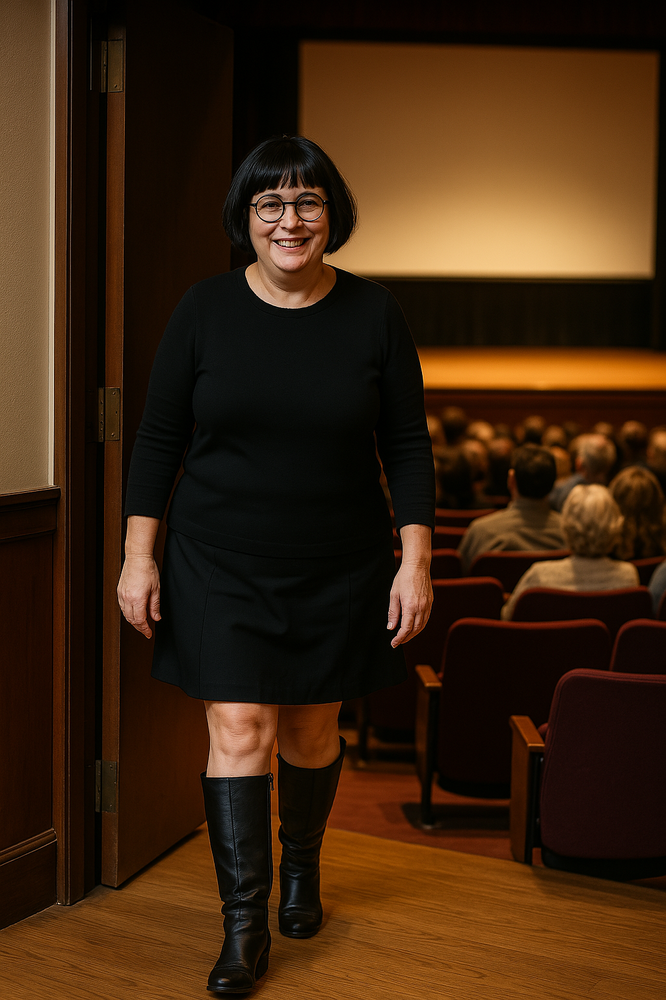

# March 2024

- I'm splitting out this chapter into two parts as the events of March 2024 were *extremely* significant and an awful lot happened.
- It felt like I was experiencing terror and psychological assault minute-by-minute, online or in the town whenever I left my house.
- The porn-gangs together with teachers and staff at the conservatory were determined to get me to leave my piano studies, and they did achieve their goal.
- I spent much of this month in a state of total anxiety and fear.
- Later on in the month I was not able to perform really simple actions and I expect that means I was being seriously drugged with fear-forming substances and maybe sedatives as well.
- I have no idea how many times my apartment was entered without my permission but I'm guessing many times, and while I was there.
- My body and mind felt as if I had suffered continued assault.

## First half of the month

- This section details all the activity leading up to the piano concert that took place on 12th March that I have remembered so far.
- It includes the company I was working for, Polygon, finding evidence of hacking which forced me to work from serviced offices.
- It includes trying to find out how to report hacking to the police and hiring a translator to explain the process.
- It includes informing my team at work, and Gabriel Silva in a meeting, that I was being terrorized by local people in a most hideous manner. I report on any odd reactions.
- It details the most outrageous psychological assault you could imagine that took place at the piano concert in the Casa de Cultura on 12th March where the [woman (and man) I'd seen following me on the beach](../../2023/september.md#dog-tags-and-his-missus) the previous September attended.
- The woman had dressed exactly like Lorraine Blackbourn and at the moment she entered the auditorium my security cam alarm went off at home.

- I describe that while all this is going on, the online attacks become extremely exaggerated.
- I start to see pictures of our protagonists at the conservatory in fake accounts that follow me and threaten me in various ways.

## Last half of the month

- This section details how I still insisted on continuing my studies after the psychological attack on the 12th and how the porn-gangs had no choice but to double down and do some *serious* terrorizing.
- It details how a few days later I became convinced I was going to be murdered and decided I had no choice but to stop my studies.
- I describe how I realize with horror that Lorraine's fate is interlinked with what is going on for me.
- I explain how I escaped to Madrid and reported the cyber-stalking, gang-stalking, bullying, hacking, and how they had taken private photos of me from hacked machines to the police there.
- It details all my failed attempts to get help.
- It's a horrible story and very triggering.
- I can only guess at how many other women, girls, beautiful boys and babies went more directly to hell without the change to make a complaint.
