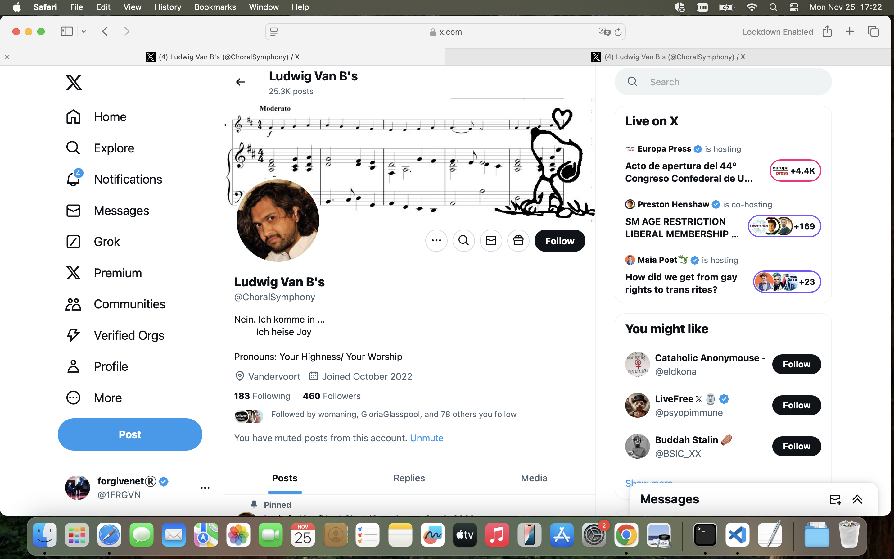
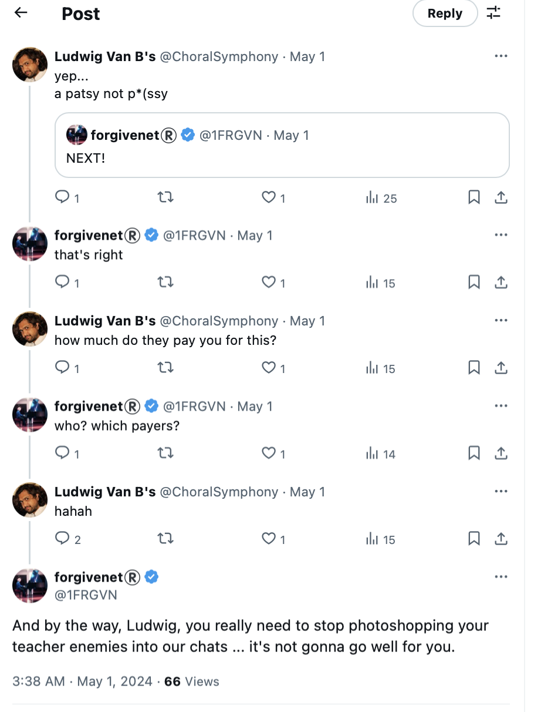
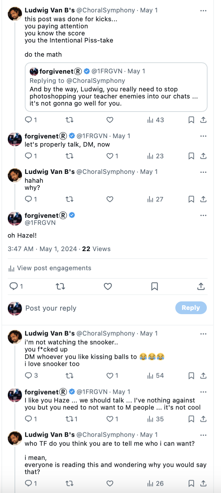
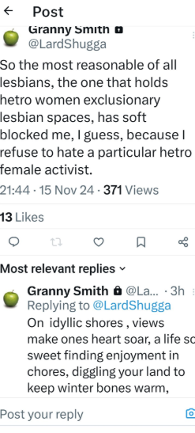
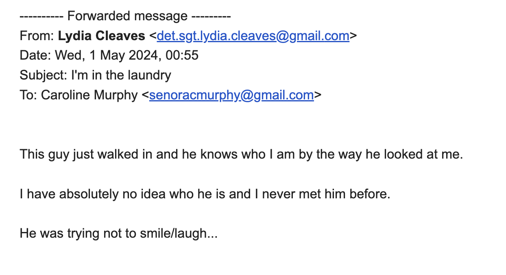
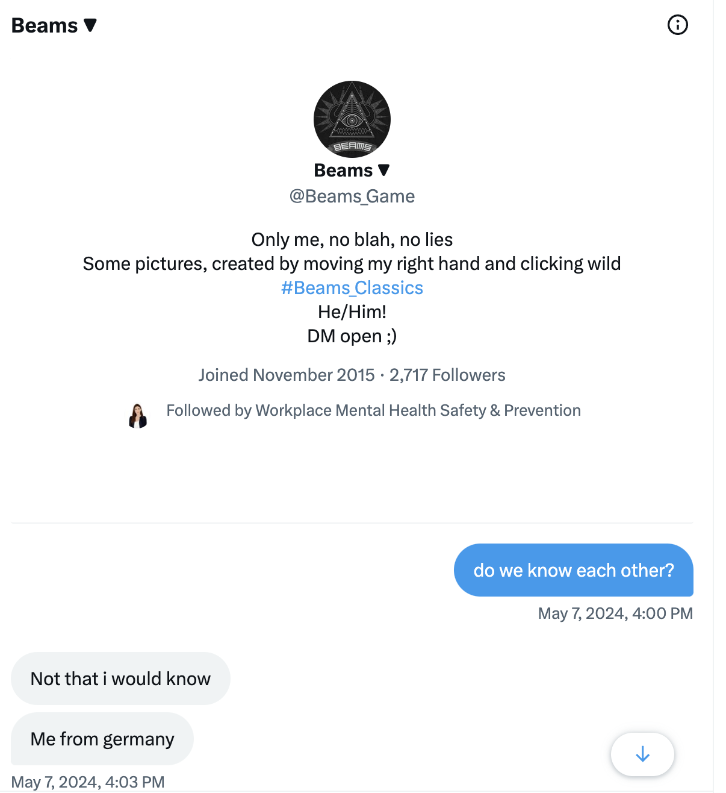
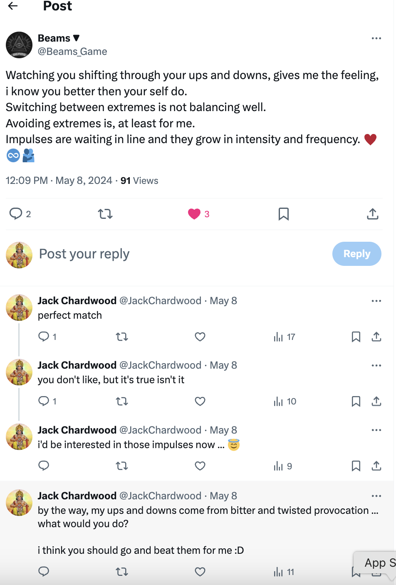
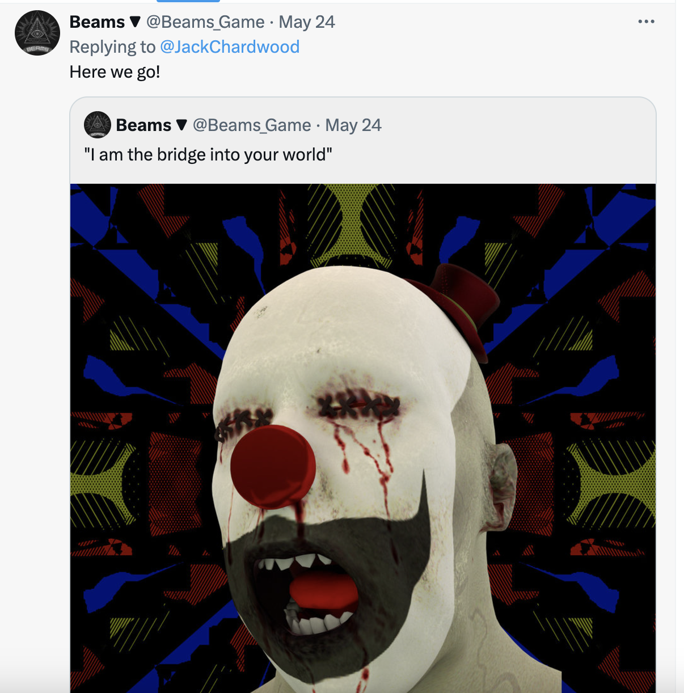

## Hazel Smith on Twitter

- This account was likely Hazel, or her mum, as we had a long chat: https://x.com/1FRGVN/status/1785410648802734485.
- The English on many of the stalker accounts was native. It could have been anyone in the region I suppose, except this account knew things that only myself and Hazel (or people who know her intimately) would know.
- The account profile pic is the face of my chamber music teacher that year, Esteve, which means that Hazel must be connected to Domingo in some way.
- Esteve was a genuinely nice man in my opinion.

- More recently (27th November), another account has popped-up as significant, Granny Smith. This account has been targeting people close to me who thought they met them in person, but in the end we discovered they never had.

- This account was deleted over the last two days. The timing on that is interesting.

## The laundry

- I go to the laundry to dry my clothes.
- A man comes in who recognizes me. I have no idea who he is.
- I email my mother and tell her.

## Cars beeping outside

- Every day, in the morning and around lunchtime, a couple of cars will drive by and beep their horns when they're level with my apartment.
- One of the cars looks like the same car as was [lingering outside my flats in February](january.md#threatening-men-outside).
- One of the cars was a grey Porsche sedan, or similar, sporty.

## Climbing the Montgo

- I climb the Montgo one Saturday afternoon.
- Close to the top, I "bump" into Ana Requena, the violin teacher. She is with a husky dog and a short, slightly built man.
- I realize it was this man in the [blue car incident](../2023/november.md#ana-in-the-blue-van), ducking down so he wouldn't be seen.
- I also remember him from meeting [Paul and Alessandra back in September 2023](../2023/september.md#alex-and-paul) in a cafe as one of the people who suddenly sat down beside us.
- She says hello in an angry way. 
- I find it utterly ironic and wonder if all Spanish people are psychopaths.

## Beams

- An account has been interact with my @JackChardwood account in an usual way: https://x.com/search?q=%20(to%3Ajackchardwood)(from%3Abeams_game)&src=typed_query&f=live
- The interaction runs from 26th April to 31st May.
- The account's name is `@Beams_Game`.

- There is some tweetage and we DM too.
- He talks candidly about his extremely violent father. Much of this content is deleted now.
- On 8th May he posts "Watching you shifting through your ups and downs, gives me the feeling, i know you better then your self do." sic.

- He originally liked all my replies.
- I know it's related and non-random, just like the other accounts that have interacted with me previously.
- I look up "beams" in Spanish. It is "Vigas". I'm nearly sure that's the trumpet teacher's nickname because he has big legs.
- There are sinister references from this account too, suggestions of violence. The "impulses are waiting in line" sentence is very suggestive.
- Close to the end of our interaction he posts an extremely sinister picture.

- This is a good example of the pattern of content coming from the various anonymous accounts that have interacted with me, which I know are related to the trumpet teacher and Domingo:
    - Subtle threats of violence.
    - Subtle mentions of knowledge we share.
    - Trigger words and symbols, memes.
    - Content peppered with romance and kindness, normal communication apparently, then a shock of some sort like the clown pic.
- I remain extraordinarily highly sexually aroused during this month.

!!! danger
    - Whatever is going on is showing no signs of stopping, even though I have been terrorized sufficiently to stop my studies at the conservatory.

## Dreaming of the pedophile

- I dream of Winston M.
- I don't think I have ever dreamed of Winston M, apart from a few months after the sex attacks occurred in 1989 and I dreamed he and I were in the same house in Plevna Crescent, and I asked him if I could go to the toilet, like a child asks an adult, and when I went to the toilet in the dream, I wet the bed in real life.
- I think this was a memory of something that had happened just after an extraordinary traumatic event.
- I hadn't wet the bed since I was very small.
- In my dream in May 2024, he is wearing a yellow and grey checked jumper and a white chimney-sweep hat.
- We are in a kind of makeshift wooden room, like an external annex or temporary building.
- There are fold up tables with people sitting at them; papers on the tables.
- He looks at me.
- I walk over to him and try to talk to him.
- He turns his head away and doesn't speak.

## Madrid

- I head to Madrid and stay from the 5th to the 11th of May. 
- I'm flying out of Madrid on the 11th May to Bali for an event with work and need to get away from Dénia as it is stressful being there.
- Outside my hotel in Madrid, I see strange guys hanging around and I always have the sense I'm being followed.
- Words from random conversations I have are posted on fake account profiles.
- Inside the hotel, online, I am stalked continuously and I believe they get full access again to my new Spanish mobile at this time.
- I have forgotten to block the camera and there is a significant message that describes something in the room or something I'm wearing
- On May 6th, I receive [an email notification that the conservatory has banned mobiles from the building](../../content/documents/emails/prohibiting-mobiles-conservatorio.pdf) and I inform my friend about this.
- I am extremely sexually aroused during this time. And it felt like the trumpet teacher was in my mind.
- They must have managed to drug me somehow during this time. I was out of my mind.

### Novel events

- A significant event from this time will go in the novel.

## My speech

- On Saturday 11th May, I give a speech at the Let women Speak event in Madrid: https://youtu.be/l9X6o11IwBc?t=1988.
- My speech describes being targeted by a "manada" (which is vernacular for "rape gang" in Spanish) in Dénia and how it parallels precisely the child sexual abuse by a North London grooming gang I experienced when I was 16.
- I make the point that, I would be trans had I been born 30 years later and experienced the same thing.

### The Spanish feminists tell me why they didn't support me

- At the event, and in the online meetings prior, I meet Spanish feminists.
- They realize they know me from the [previous September when I went public on Twitter](../2023/september.md#going-public-on-twitter).
- One of the organizers explains that, yes, we heard about someone from Dénia conservatory, but it wasn't you.
- I tell her, yes it was me. I was asking for help for the same things I'm talking about today.
- "No, no, it couldn't be you. We heard this woman was unstable", she says, "like a victim of domestic violence".
- I remain flabbergasted.
- A woman interrogates me about what happened at lunch but my Spanish is so poor I can barely describe it.

## Telegram/Signal

- I believe the hackers/stalkers had started to drug me seriously again at home since getting back to Dénia in April.
- A Telegram chat on my Spanish phone invited me to play a game which I downloaded, probably how they so easily got access again, and it was just endless boredom.

!!! danger
    - I wonder now if this is how they target children.
    - Get them hooked into a game and then communicate online with them, hack their webcams like mine was, and manipulate them into something pedophilic. 

- Then, in May, I was contacted on Twitter by an Elon Musk's brother, a fake account obviously, who told me Elon wanted to talk to me, and gave me the Signal details.
- Weirdly, I'm hooked.
- One of the first things this account says is "send pics". 
- I am angry, and tell them I'm not interested in pics, and I don't want to see any male genitals, but I still continue to talk.
- It's not clear why although something in my mind believes it is the trumpet teacher again. It's very strange.
- It was extremely weird in fact. I sent an extraordinarily long rant to this person's account while I was flying to Bali in May.
- In it, I mentioned one image seen on `@jctot19` Google search throughout December which was a film directed by Mel Gibson about child sex trafficking, a true story: https://www.imdb.com/title/tt7599146/.
- The film is playing on Turkish Airlines at the time and I watch it.
- It is a true story and the protagonist's wife is called Katharine.
- It's all so "meaningful".
- I wonder why they would have put that in Google search results for me to see, and I think the worst.

!!! info
    - Was the trumpet teacher alerting me to child sex trafficking going on in Dénia, with the conservatory somehow the training or recruitment ground?
    - It seemed preposterous to me.
    - More likely, they were referring to my child sexual abuse experience of grooming and trafficking that they had known about ever since I [reported it to the Metropolitan police](../early-years/2015.md#statement-to-the-metropolitan-police) and had become obsessed by it for some reason.

## Perito - technical expert DPR

- There are a bunch of emails over this time with the [perito in Alicante](../../content/documents/evidence/comms-with-perito.pdf).
- I collect my equipment and pay 150 eur on 23rd May.
- I receive an invoice document at that time.

    - [Invoice and receipt first page and payment](../../content/documents/evidence/DPR-1.JPG).
    - [Invoice and receipt second page](../../content/documents/evidence/DPR-2.JPG).

## Bali

- I am in Bali from 11th-19th May.

## Lourdes

- I leave for Lourdes at the end of the month.
- I plan to spend two weeks in Lourdes.
- I need to be out of Dénia as much as possible.
- It's enormously stressful being there as anytime I leave my house, shopping, going to the laundry, walking to the beach, I am harassed and followed by locals.
- It's clear to me, however, that no matter where I am, the cyber stalking will continue.

## Tweets

### `@1frgvn`

- https://x.com/1FRGVN/status/1794467120207765821
- Search URL: https://x.com/search?f=live&q=(from%3A1frgvn)%20until%3A2024-05-31%20since%3A2024-05-01&src=typed_query

### `@JackChardwood`

- Search URL here: https://x.com/search?q=(from%3AJackChardwood)%20until%3A2024-05-31%20since%3A2024-05-01&src=typed_query&f=live
