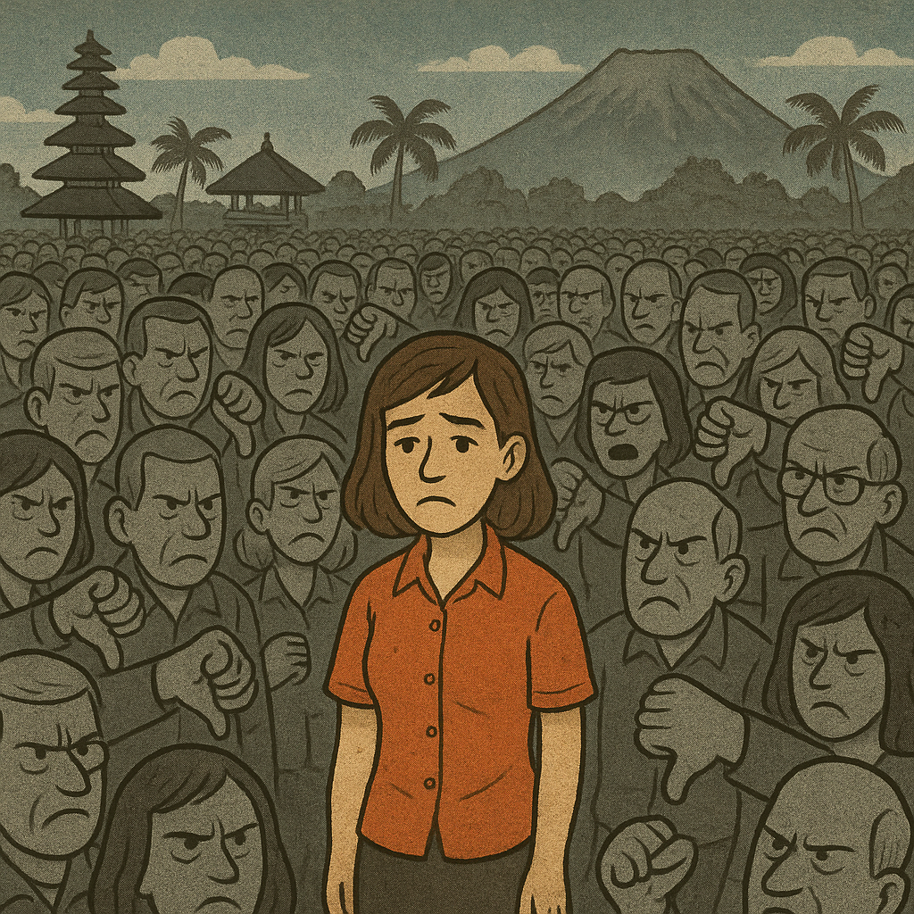

# May 2024

## Post-conservatory, pre-Bali

- I was forced to leave my conservatory studies [in fear for my life](march/13-end.md#distraction-then-drugging).
- I'm doing my best to [get some technical and legal help](april.md#dpr-cyber-expert-alicante) so I can return to [the police in Madrid](march/13-end.md#reporting-the-crimes-to-the-police-in-madrid) and they will investigate.
- Everything I try to do to help my situation, however, seems to falter.
- I have no idea what has really been going on for over two-years in my apartment; I still think I have just been the victim of gang-stalking and bullying, and my devices hacked. 
- The idea that I was lured to my apartment online in 2021, and that it is set up with spy-cams, and that I'm an online porn sensation internationally, and that everyone in Dénia, man woman and child, is aware of this, is something utterly incomprehensible to me.
- The porn-gangs are now preparing for Bali, after which I assume the intention is that I am completely destroyed by porn world; psychologically, emotionally, sexually, and of course financially.
- To that end, online stalking ramps up with constant threats, suggestions of violent relationships, and abusive put downs in what I assume is an attempt to weaken me so I don't make *such a fuss* when the time comes.
- Is this what [Zoe was trying to do](../early-years/2008.md#lauding-male-violence) whenever she spoke to me relentlessly about violent relationships?
- The criminal gangs only had a few weeks before Bali.
- [I had just been porn-prepped after being drugged by the gypsies](april.md#drugged-in-the-street-by-denia-gypsies) on my way home from dinner, and I remember this whole period and on into June and beyond as being a time when I was *constantly* high.
- Everyone involved is certain that no-one is going to help me.
- Consequently, [Hazel Smith](../early-years/2007.md#hazel-smith) doesn't even bother trying to hide anymore.

## Hazel Smith pretends to be Esteve online

- The fake account below has the face of [Esteve the chamber music teacher](../2023/september.md#chamber-music) in the profile pic but no-one is expecting me to think he's running it.

- It *pops up* as usual on my timeline and berates me incessantly for weeks.
- I know it's Hazel immediately and tell her.

- She is not holding back.
- I suggest she not *want to M people*.

- Of course, I'm referring to [what happened between us in 2007](../early-years/2007.md#hazel-smith), something *no one else* knows about.
- She doesn't like me saying this.

- There was a lot of talk about the mother, Sandra, and the account became apoplectic saying that she had died and how dare I talk about her this way. The usual aggressive verbiage to try to make you cower and apologize. I probably did a bit, apologize that is.
- You can go through this tweet graph at your leisure. It's quite fun.
- At the time, I thought it could have been anyone in the region with excellent English, except this account knew things that only myself and Hazel (or people who know her intimately) could have known.
- I wonder who *DS Lc* is?

- Oh yeah, it's me, Lydia Cleaves... except I'm a DCI on X. I'm a [DS on Google mail](#the-laundry). Mistake?
- There was a lot of talk about how *I* had *f*ed up*, which was curious.
- Indeed, she spent a lot of energy telling me how I had *f-ed up* which was an interesting projection, but as I mentioned probably intentionally meant to whittle away at my inner resources so I would be more easily inclined to give up my life to the porn-gangs post-Bali.

- She didn't really know what I was doing, or why, which was nice.

- But she had some small concerns, and made sure to tell me who was in charge.

- It took them over a year more before they started wondering if they might have made a gargantuan mistake targeting me.
- More recently (27th November 2024), another account *popped-up* in the same significant way, Granny Smith. 

- The language reads exactly like the [`@HierEncore49002`](march/13-end.md#hierencore49002) account.
- This account was highlighted to me by *So (Janet)* one of my [dodgy general election volunteers](june.md#volunteers-not-what-they-seem) in November 2024.
- I believe *So (Janet)* could very well know the Smiths in a professional manner and so too the Dénia porn-gangs who she termed *hunters* in a nearly reverent way, after they themselves had called themselves the same online. 
- The `@LardShugga` account (I'd put money on being run by Sandra Smith) was deleted over the last two days (November 2024). The timing is interesting.
- I thought it might be interesting to have a look at our shared followers and, indeed, there are some dubious references on here, and some solid followers and friends as you might expect given the history.

- After these interactions, I would see this account's posts on my timeline frequently.
- It was as if she was on an AI auto-rant about a man who had been obsessed with her, who'd followed her to Scotland, etc etc: relentless drivel with, I expect, truths thrown in.

## The laundry

- I go to the laundry to dry my clothes.
- A man comes in who recognizes me. I have no idea who he is.
- He seems surprised to see me and snickers in that way they do.
- I email my mother and tell her.

- My mother has some pre-baked gaslight for it, as usual.
- The [La Colada laundry](../2023/november.md#the-laundry) has CCTV, by the way.

## Threatening cars outside my apartment

- Every day, in the morning and evening and around lunchtime, cars drive by and beep their horns, triumphantly and repeatedly, outside my window when they're level with my apartment.
- One of the cars is the same car that was [lingering threateningly outside my apartment building in January](january.md#threatening-men-outside); a grey Mercedes coupe, or similar, sporty and expensive.
- Another time I see [Ana Requena's blue van](../2023/november.md#ana-in-the-blue-van) again and whoever is driving is extremely muscular as his arms is leaning on the window.
- At night, from about midnight, a parked car sits outside my apartment running it's engine low for hours it seems until it screeches off at some ungodly hour.
- It's a red hatchback and the owner has taken a lot of care in keeping in clean and shining.
- Sometimes, it sounds like there are two or three cars doing the same thing at night.

## Climbing the Montgo

- I climb the Montgo one Saturday afternoon.
- Close to the top, I *bump* into Ana Requena, the violin teacher. She is with a husky dog and a short, black curly-haired man.

- I realize this was the man driving in the [blue car incident](../2023/november.md#ana-in-the-blue-van); ducking down so he wouldn't be seen and the myth of the [trumpet teacher's new car and relationship with Ana](../2023/october.md#the-trumpet-teacher-drives-past-me-in-his-car) could continue.
- He is small enough to not be seen if he ducked down.
- I also remember this man from when I met [Paul and Alessandra back in September 2023](../2023/september.md#alex-and-paul) in a cafe as one of the people who suddenly sat down beside us.
- And I realized even later that this was [the man who told me how everyone got used to the yoga teacher's relaxing horror-show music](../early-years/2015.md#nati-de-prati-yoga) back in 2015.
- Ana barks *Hola* to me. 
- I find this event utterly ironic, and I wonder if all Spanish people are psychopaths.
- I tweet about this event at in July in response to a tweet from, you know who, [`@january_myth`](march/13-end.md#january_myth).

- Is this how criminals hiding behind fake accounts use real people to avoid capture? 
- Do Ana and her boyfriend, and everyone else, have to obey an order to perform a certain choreographed event which can then be used later as evidence of their involvement?
- Does this ensure their silence?
- What happens if they refuse the order? Or are they happy to shepherd porn-gang targets to their demise?
- Is the idea that, if the worst came to the worst and the police did decide to get their finger out, Ana and the rest of them go to prison instead of the real criminals?
- I expect so.
- I can tell I was on high-potency hallucinogens at this stage because in that altered state of mind I barely recognized Ana due to increasingly blurry vision, for one, and [I was also trying to see if she was pregnant!](march/1-12.md#ana-dresses-up-pregnant)
- Ana had walked quickly by me while her husband stopped and stood beside me for a few seconds while the dog looked at me.
- It was so upsetting, in fact, I canceled my hike and went home.
- I wonder if sometimes they're tasked with throwing people off mountains. 
- Certainly there have been a few examples of foreign women dying in this way while out walking with their Spanish husbands.
- One of Lorraine's good friends died like this; a tragic accident. I was always suspicious.

## Dreaming of the pedophile

- I dream of Winston May.

- I don't think I have ever dreamed of Winston May, apart from once; a few months after the [child sex attacks occurred in 1989](../early-years/2015.md#statement-to-the-metropolitan-police). 
- At that time, I dreamed he and I were in the same house in Plevna Crescent, and I asked him if I could go to the toilet, like a child asks an adult.
- He gave me permission, and when I went to the toilet in the dream, I wet the bed in real life.
- I was 16.
- I think this dream was a true memory of something that had actually happened just after an extraordinarily traumatic event.
- I hadn't wet the bed since I was very small. I haven't wet the bed since.
- In my dream in May 2024, he is wearing a yellow and grey checked jumper and a white chimney-sweep hat.
- We are in a kind of makeshift wooden room, like an external annex or temporary building.
- There are fold up tables with people sitting at them. 
- There are piles of papers on the tables.
- He looks at me.
- I walk over to him to talk to him.
- He turns his head away and doesn't speak.

## Beams

- Grooming via social media, and unknown substances I'm ingesting without realizing it, continues apace on the run up to the Bali trip.
- An account interacts with my `@JackChardwood` account [in an usual way](https://x.com/search?q=%20(to%3Ajackchardwood)(from%3Abeams_game)&src=typed_query&f=live).
- The interaction runs from 26th April to 31st May when I leave for Lourdes and away from the spy-cams at home and in Bali, and then they're done.
- The account's name is `@Beams_Game`.

- The account starts the conversation by replying to a reply.

- And immediately goes into a long and, what I find now to be a rather irritating rant.
- The rant has echoes of [`@hierencore49002`](march/13-end.md#hierencore49002); a way of keeping a conversation going without saying anything much at all.
- I do immediately wonder if it is someone I know. 
- I suspect my cousin because of the psychotic nature of the rant.
- The account mentioned they were on a ketosis diet at one point and I thought, oh, it's Domingo, except it could be any muscle man obviously.
- At the time, I become convinced *extremely quickly* that it's the trumpet teacher, although I drop in and out of having this belief.
- It's not at all clear why I would think this.
- My replies, at least to me, are proof I'm being dosed up on aphrodisiacs at home, and there's no question I'm on something hallucinogenic.
- He talks candidly about his extremely violent father, sharing intimately; yet another predator grooming mechanism.
- Much of this content is deleted now.
- One tweet I can't find anymore was posted on 8th May when he says *Watching you shifting through your ups and downs, gives me the feeling, i know you better then your self do.* sic.

- The watching me through ups and downs, and *impulses are waiting in line* sentences are suggestive of men taking turns on me.
- It's hard for me to understand why I was so utterly convinced I was talking to the trumpet teacher I loved, especially when there was a whole bunch of them.
- Do they have public conversations like these with targets, and stream them into a porn channel somewhere, while playing the sedated rape footage on the same screen?
- The account originally liked all my replies, always exactly when I posted. Was deleting them a means of letting me know I no longer served any purpose?
- I know the communication is related and non-random, just like the other stalker accounts that have interacted with me previously.
- He talks about a female *friend* coming in from time to time and indeed another account starts playing the same game for a short while: `@karisuesaxe`.

- I guess it's likely this is Domingo and Carmen, but it could be any of them.
- I find myself eager for communication; the trick is working.
- I look up *beams* in Spanish.
- It is "Vigas". 
- I become convinced that this is the trumpet teacher's nickname because he has big legs.
- At least, three of the set of trumpet teachers have big legs; not the [first man](../../crimes/protagonists/vidal-sastre.md#the-older-slimmer-greyer-man), although they might be thickish they're not big and muscular like the [fourth muscle man](../../crimes/protagonists/vidal-sastre.md#dark-thick-curly-haired-deep-set-man), or like the other two (or three) who were tall men.
- Certainly the [fourth man](../../crimes/protagonists/vidal-sastre.md#dark-thick-curly-haired-deep-set-man), the man that [interviewed me online with perfect English in 2016](../early-years/2016.md#march) was pumping iron.
- Could this indeed be that guy's nickname? I bet it is.
- There are sinister references from this account too, suggestions of violence.
- Another post talks about just having had *coffee and pork crusts*.

- My responses back to this person are even more telling. 
- I appear to be totally out of my mind and ready to jump into bed with this person and throw away my whole life to be with him.

- Is that exactly what they have in mind for targets? I expect so.
- I, interestingly, told this person a story about my father; the answers are telling maybe, carefully worded.

- At the time, I wondered about these odd replies.
- Close to the end of our interaction, post-Bali, he posts an extremely sinister picture, I believe with the intention of shutting things down.

- The Beams interaction is a good example of the pattern of content coming from the various anonymous stalker-accounts that have interacted with me:

    - Subtle threats of violence.
    - Subtle mentions of knowledge we share.
    - Trigger words and symbols, memes.
    - Content peppered with romance and kindness, normal communication apparently, then a shock of some sort like the clown pic.

- If it wasn't obvious from the threads, I remain extraordinarily highly sexually aroused throughout this month.
- Do the porn gangs find that without an *object of interest*, a target is not so responsive, let's say.
- I expect so.

## Telegram/Signal

- I was extraordinarily high at home for the whole of April, and on into May and beyond.
- This made me very vulnerable to online triggering and suggestion, and I found myself overwhelmingly sexually aroused on most afternoons which meant I had to masturbate.
- Often, on Google search, I would see a woman in her bed with the covers over her face and this made me wonder if someone was watching me, but then I would forget as another wave of euphoria kicked in.
- I was prompted to do a number of things online that I would never normally do.
- A Telegram chat on my Spanish phone invited me to play a game which I downloaded.
- It was a child's game and it was never going to end, but the person on the Telegram chat kept egging me on to keep going and by level 326, or so, we could then chat personally.
- I quickly got bored with this, but I did wonder if this is how they hook the youngsters in, and I wondered whether my love the trumpet teacher was trying to tell me something important here.
- Then, sometime in early May, just before I left for Madrid, I was DM'ed on Twitter by a fake-account with some name connected to Elon Musk's brother.
- The account is deleted now and, even though I kept the DM, it is now gone from my inbox.
- The account told me Elon wanted to talk to me, and gave me the Signal address.
- Weirdly, I'm utterly hooked. Utterly.
- I don't even have a second thought about it. I know it is the trumpet teacher and I want to speak to him immediately.
- I text him on Signal.
- One of the first things the account says is *send pics*, obviously nudes is implied. 
- I am angry, and tell them I'm not interested in pics, and I don't want to see any male genitals either - the porn bombardment includes an erect penis at least once a day on my timeline, and even today albeit less frequently - but I still continue to talk to this person as if it is the man I love.
- I do not understand it. It's very strange.
- Are they playing some low-level sub-audio track that connects me to him somehow?
- It was extremely weird in fact.
- The first text I sent to him, interestingly, was *why don't you come to Bali with me?*
- I explained, *I need someone to talk to the founders in Spanish about the forgivenet*.
- He replied, *What for?*
- I said, *Because men don't listen to women with good ideas, so I need you to do the talking for me.*
- He said, *Oh yeah, that's true*.
- The communication continued right up to the Bali trip and I sent an extraordinarily long rant to the account while I was [flying to Bali](#flight-to-bali).
- In the rant, I mention an image I had seen on Google search on what I thought was his X account, `@jctot19`, throughout December 2023.
- The image I had seen on Google search was a still from a film about child sex trafficking, *Sound of Freedom*, a true story:

- I saw this curious image of the protagonist in a car so often on the Google search results, I ended up looking it up.
- I found out it was from a film about child sex trafficking.
- It felt, again, like the trumpet teacher I loved was conspiring with me against Domingo, as [I had suggested to him in class back in February 2023](../2023/february.md#plot-awareness) to end this our way.
- The film was playing on my Turkish Airlines flight to Bali.
- I watch it.
- It is a true story of child trafficking and the protagonist's wife is called Katherine.

- It's all so *meaningful*.
- I post a screenshot of what I'm watching to the Signal account I irrationally believe is the trumpet teacher I love.
- I wonder why the `@jctot19` account would have added that image in Google search results for me to see, and I start to think the worst about the Tenor Cortis conservatory of Dénia.

!!! info "Messages for me"
    - Was the trumpet teacher alerting me to child sex trafficking in Dénia, with the conservatory somehow operating as the training and/or recruitment ground?
    - It seemed preposterous to me.
    - More likely, I felt, they were referring to my child sexual abuse experience of grooming and trafficking that they had known about ever since I [reported it to the Metropolitan police](../early-years/2015.md#statement-to-the-metropolitan-police).
    - But indeed, perhaps something even more startling was going on.
    - Did I recruit [trumpet teacher number one](../../crimes/protagonists/vidal-sastre.md#the-older-slimmer-greyer-man) to save the world with me without even knowing it?

## Madrid

- I drive to Madrid and stay from the 5th to the 11th at the [Princesa Plaza](https://www.marriott.com/es/hotels/madpp-madrid-marriott-hotel-princesa-plaza/overview/). 
- I'm flying out of Madrid on the 11th May to Bali for an event with my work, [Polygon Labs](https://polygon.technology/about), and I need to get away from Dénia as living there under attack every time I leave my house is stressful to say the least.
- I'm not thinking straight, and I assume this is due to long-term drugging, or I would be organizing some definitive way out of the situation.
- My sight is blurry, all the time.
- I start to put on weight, quickly.
- Outside my hotel in Madrid, I see strange men hanging around.
- I always have the sense I'm being followed.
- Words from random conversations I have during the day, even from work meetings, are posted on fake account profiles that like my X posts.
- I am stalked online continuously.
- I have forgotten to block the camera on the phone and I see a significant message that describes something in the hotel room and/or something I'm wearing.
- They have full access to my new Spanish mobile, and there is something more going on which I cannot explain.
- On May 6th, I receive [an email notification that the conservatory has banned mobiles from the building](../../content/documents/emails/prohibiting-mobiles-conservatorio.pdf).

- I inform my friend in Madrid about this. 
- She says I have set a precedent.
- I wonder if it's more so that no evidence of ongoing wrong-doing will be available by any means.
- And I wonder what they did find that prompted this?
- I have the sensation when I'm praying the rosary in my hotel room that [the monster trumpet teacher](../../crimes/protagonists/vidal-sastre.md#dark-thick-curly-haired-deep-set-man) is standing with me and praying the rosary too. 
- I cannot explain this.
- I am extremely sexually aroused during this time. 
- It felt like [trumpet teacher number four](../../crimes/protagonists/vidal-sastre.md#dark-thick-curly-haired-deep-set-man) was in my mind.
- I wasn't aware of it at the time but it's obvious to me now I was ingesting some strong mind-altering substance via my toiletries which had been accessed, as usual, by people entering my apartment at Carrer Furs without my knowledge.
- I was out of my mind on the run up to the Bali Polygon conference, but curiously and ironically the euphoria I experienced from whatever they were dosing me up with was giving me an unusual strength and fortitude which appeared to be bolstering my willpower and my connection to God so that I began to do things I would probably wouldn't have done in any normal situation.

## My speech at Let Women Speak Madrid

- On Saturday 11th May, I give a speech at the Let Women Speak event in Madrid.
- I'm wearing my body cam.

- I describe in Spanish being targeted by a "manada" (vernacular for "rape gang") in Dénia and how my current experience parallels precisely the child sexual abuse by a North London grooming gang I suffered when I was 16.
- Amazingly, a fake-account I believed to be run by the Cano's that stalked me endlessly in 2023 had that term in the profile.

- I make the point that, had I been born 30 years later and the same thing had happened to me (or I saw it happening to friends and family) I would have sought comfort and safety in trans ideology, mutilating and sterilizing myself in the process.

### Spanish feminists tell me why they refused to help me

- At the event, and in the online meetings prior, I meet Spanish feminists.
- They realize they know me from the [previous September when I went public on Twitter](../2023/september.md#going-public-on-twitter) asking for help.
- One of the organizers explains that, yes, we heard about someone from Dénia conservatory, but it wasn't you.
- I tell her, yes it was me.
- She seems uncomfortable.
- I tell her that I was asking for help for the same things I'm talking about today.
- *No, no, it couldn't be you. We heard this woman was unstable*, she says, *like a victim of domestic violence*.
- I remain flabbergasted.
- Another woman interrogates me about what is happening at lunch but my Spanish is so poor I can barely describe it.
- What I don't know is that I'm being drugged so I'm not at all clear about what's going on, and when I think about the trumpet teacher I get giggly because of the triggered sexual arousal.
- They must know, it must be very familiar to them.
- These people are running a well-oiled machine in business for decades. There's no way Spanish feminists don't know what the men are doing, in my view.
- They were warned off helping me, and it's not at all clear why.
- Later, in January 2025, someone posts a picture of the woman who was organizing the Spanish feminists on my Facebook.
- The pic is her face in the Sphinx of Egypt.
- I take this to mean the woman has gitano connections and that she was told to discredit me in whatever way she could; and she could not refuse the request as per cultural patriarchal obligation.
- Is feminism in Spain reserved for those who will *never* be targeted by misogynist terrorist gangs?

## Bali

- I am in Bali from 11th-19th May with work.
- We stay at the [Grand Hyatt](https://www.hyatt.com/grand-hyatt/en-US/balgh-grand-hyatt-bali).
- In my toiletries, accessed via criminal entry to my apartment and likely my hotel room in Madrid, and possibly even my Bali hotel room too, are mind-altering substances which cause a sense of euphoria and overwhelming sexual arousal (perhaps coupled with my hacked phone's audio playback) and which also cause a detrimental effect on vision.
- I have recently been [porn-prepped](april.md#drugged-in-the-street-by-denia-gypsies) possibly with involvement from [the trumpet teacher I continue, without clear reason, to be in love with](../../crimes/protagonists/vidal-sastre.md#the-older-slimmer-greyer-man).
- I guess he'll be able to tell us about what happened here and how the whole porn-target mechanism works, hopefully before we get to the *Who Is This* sections of this police statement where I will post photo-after-photo of women who have fallen foul of the Dénia porn gangs over the past decades.
- Hopefully, by that time, we will have gone very viral and we can start healing some broken hearts, and perhaps prompting some porn-addicts to choose again.

### Pre-Bali shenanigans

#### Ben finds a Rust developer

- Benjamin, the Polygon Zero manager, is struggling to find a Rust developer.
- He reports this at every management meeting.
- Eventually, just before Bali, he finds one.
- Is it Aziz?
- They do have the same Oxbridge accent.
- I like Ben.
- Ben leaves the company soon after Bali, hurriedly, just like a couple of the others do, notably Alicia and the Aussie guy, Jarrod Watts, who Gabriel instructed to make me look incompetent.

#### Ajay, Alicia, and mushroom-man perform a military coup on my job

- Cross-company marketing teams are instructed to perform a military coup on my role.
- Hans and Anthony are not included in the intense pressure these teams put me under while they attempt to cause me severe anxiety and demonstrate my incompetence.
- Led by Ajay, Alicia, and mushroom man, in a meeting of about 15 people, I was informed their teams were coming in to overhaul the documentation, to fix it up, to help me.
- Mushroom man's profile pic on Slack is him dressed up like a magic mushroom. I can't remember his name right now but will do so eventually, not that it matters.
- He gives out thousands of little pictures of himself dressed like this at [EthCC](july.md#uk-and-belgium) in July. They were everywhere.
- I thanked them initially because I had a million things to do and no time to do them.
- I wrote a clear list on what I needed and how the process must work.
- They ignored my gratitude and everything I said, and went off in tangents doing whatever they felt like and blatantly taking over my role as docs team lead.
- Mushroom man was particularly unpleasant, ignoring my requests as I was making them and doing something orthogonal.
- It was, of course, all intentional.
- It was pretty horrendous.
- Porn gangs were watching of course, as well as international security services.
- The coup began late February or early March, right after the redundancies.
- I wonder who gave the original order for this. 
- Was it David and Jordi; or their Spanish underlings?
- Were the gangs live-streaming these constant *humiliations* as part of the porn genre?
- Was this particular humiliation, like the [zkSync increasing terror](../2023/june.md#elon), set to build up while pressure at the conservatory was building up to [12th March 2024](march/1-12.md#the-piano-concert) in the same way that it had on the run up to [12th June 2023](../2023/june.md#monday-12th-june-2023).
- Did Alicia, Ajay, and mushroom man know about the sedated spy-cam porn conspiracy, live-streaming from my apartment?
- I bet Alicia didn't know.
- It was horrible but frankly what I was dealing with online, and at home in my apartment, and at the conservatory was far worse; it made the marketing team at Polygon's bullying capabilities look a little pip-squeaky, at least to me.
- During the military coup-style approach they took on my job, mushroom man was speaking online one afternoon to Jaime about his lengthy experience with drugs and hallucinogens.
- Was this so the porn gangs, or porn subscribers, monitoring my every move would know he was a *cool guy*?
- At the time, I thought the constant vicious behavior from staff at Polygon was due to my women's rights activities online, but it wasn't really that at all, although it's possible that's how the big important men justified it to everyone else.
- I wonder why no-one told them I had been operating undercover for Scotland Yard's OCG department since 2017.

#### David Schwartz steps down

- While I'm in Madrid or just before, my manager David Schwartz is replaced by Paul O'Leary CTO.
- I now report to Paul.
- In the meeting with David, he tells me he is focussing full time on founder management, and asks me if I know what that means.
- I don't know and ask him to enlighten me.
- He changes the subject.
- I inform him I'm still being terrorized by the people of Dénia and I have had to stop my piano studies because I'm afraid for my life.
- He changes the subject. He's not interested.
- Has David Z stepped down as my boss in order to distance himself from me? 

### Flight to Bali

- I fly Turkish airways to Bali from Madrid via Istanbul.
- I am [utterly high and out of my mind](april.md#drugged-in-the-street-by-denia-gypsies) from constant porn-gang interventions.
- On the flight, I write an enormous text to [someone I inexplicably believe is the trumpet teacher](#telegramsignal).
- I take some pics and send them to this person as part of the chat.

- I'm also amazed they're showing a film which was posted on the `@jctot19` Google search results around Christmas. 
- It's about child sex trafficking.
- I talk about this [in another section](#telegramsignal) on this page.
- The film is [The Sound of Freedom](https://en.wikipedia.org/wiki/Sound_of_Freedom_(film)); a true story about child sex trafficking.
- A still from the film had come up as a result on `@jctot19 x` searches around December 2023.
- This is a photo from the plane journey itself.

- It's curious it was released on the same day I started at Polygon; the day I was recovering from my right kidney exploding after [poisoning at Halloween](../2023/october.md#halloween).
- The picture I had seen on the `@jctot19` searches at that time had peaked my curiosity so much, I looked it up and discovered it was a film about child sex trafficking.
- I watch the film.
- I write an extraordinarily long message to a hacker I believe is the trumpet teacher on Signal while I'm on the plane.
- I explain I'm watching the film I believe he posted on my Google search results for me to see.
- We find out at the end of the film that the real life protagonist, Tim Ballard, is married to a woman called Katherine.
- I find the whole thing extraordinarily significant.
- Is someone checking in to make sure I know I'm not alone?
- Is the trumpet teacher I am in love with working for good and with me against the baby rapists after all?
- On arrival at Bali I meet some colleagues. 
- Everyone seems happy to see me, chatty and friendly.
- Expectant, maybe.

### Arriving at the hotel

- My hotel room is next to John Michael from IT support. I reported my concerns about hacking to him previously.

### Bullying at the conference

- I notice constant "set up" events, just like in Denia, which mean someone is tracking mine, and other's, movements in order to create "chance" meetings.
- I seem to have "bumping into" episodes every day; *meaningfully* set up events and situations, or literally bumping into people meaningfully.
- The first one of these "chance meetings" is with Gabriel Silva on the first morning as I'm leaving my room.
- Did something happen the night before in my room?
- The second one is with Alicia.
- Then the writer I worked with Jaime, Alicia again a few times, the Head of IT ... perhaps some of these were random. I hope so.
- You can tell when they know it's a set up by the way they walk towards you: wooden.
- During the week, numerous people come up to me to ask me, "when am I leaving?", or "I heard you're leaving".

- It's clearly very easy to whip up bullies into a frenzy.
- At the time, and due to the outrageous [bullying at work](#ajay-alicia-and-mushroom-man-perform-a-military-coup-on-my-job), I assume it must be to do with [Nadim getting hold of my X account](../2023/november.md#nadim-kobesi) the November before and telling everyone I'm a TERF.
- I wonder what they might have though if they knew they were supporting a mass-pedophile baby-rape porn network, amongst other things, in Denia.
- I guess they were probably delighted about the sedated *switcheroo* porn; at least the men would have been. I can't imagine any women knew about it, but you never know.
- Gabriel Silva, nothing to do with the writing team at that point, mentions how he is going to be sorting out the docs (my work) using other people who are not on the writing team. 
- I complain to my manager, Paul O'Leary about it referencing an earlier complaint I had made to him.
- It's yet another military coup; and that's *exactly* how I describe it to my manager Paul.
- When I speak to Paul O'Leary about this in Bali, he sort of [groans with familiarity](october.md#madrid-and-paloma), in exactly the same way Spanish government official Paloma groans when I tell her about the porn-gangs and possible pedophilia going on at the conservatory of Denia.
- I believe Polygon Spanish male founders and developers know exactly what is going on for me in Denia, and are involved in the conspiracy and they're aware that I'm due to end up in hardcore porn, robbed, blind, perhaps murdered, and they don't want me working for them while that's happening.
- Something very sinister happened in Bali because I was [re-programmed into feeling extraordinarily sexually aroused by the gypsies](april.md#drugged-in-the-street-by-denia-gypsies) just before traveling to Bali.
- I remain high and euphoric and extraordinarily sexually aroused throughout May, and especially in Bali.
- Is my hotel room set up with spy-cams?

### My shampoo goes missing from my room

- I weirdly notice that my shampoo goes missing from my room.
- I assume the cleaner threw it away, and leave it.
- Every morning I am extraordinarily sexually aroused and masturbate.
- Sometimes, I do yoga at the same time.
- I have no idea why I would do this; I have never done it before or since in my whole life.
- Are they somehow triggering a memory of [Jitendra Das](../early-years/2010.md#why-i-decided-to-be-celibate-for-the-rest-of-my-life) along with the [Pakistani Yorkshireman just I haven't met yet](#the-pakistani-yorkshire-man)?
- If I'm in porn again, filmed at the Polygon Bali conference, you'll see me masturbating in tree pose.
- Bit embarrassing, I hope you find it.

### The Pakistani Yorkshire-man

- On the first morning of sessions, I'm stressed and anxious as people have been making sly comments to me continuously.
- Maybe something happened to me the night before in my hotel room too. It's not clear. I'm overly anxious and there's not really a good reason for the level of stress I'm feeling.
- At the end of the morning session in the main hall, someone comes over to talk to me.

- It's the mushroom man guy who has been involved in a military coup on my job over the last couple of months.
- The mushroom man (I'll remember his name, everyone knows who he is) says concerning things in a sinister way, like oh I hear you're leaving, and some other unpleasant stuff. He is the fat man with the mushroom hat on his profile pics. I can't remember his name just now, but he was pals with Jaime, and part of a concerted bullying attack in March with Alicia and her team.
- He's waiting for everyone to leave. Once they're gone, and I'm reasonably more upset than I already was, he walks away down the aisle, giving an Indian man on the other side the nod as he goes by.
- I see the Indian-looking fellow grinning at me at that moment.
- He walks over. No-one else is around.
- There is a handful of people at the back of the conference hall.
- Are they watching?
- The man has long black hair and enormous grinning white teeth. 
- He looks like, and reminds me of, [Jitendra Das](../early-years/2010.md#why-i-decided-to-be-celibate-for-the-rest-of-my-life). No exaggeration. 
- In July 2025, I wonder whether he was supposed to look like Jitendra Das!
- He tells me he's Pakistani, from Rochdale, Yorkshire; rape-gang territory.
- His Oxford-English accent says otherwise.
- He grins at me constantly.
- At dinner, he makes violent sexual threats towards me.

- I tweet about it and tell Spanish HR the following morning.

- I tweet about it.

- While this guy, Aziv Abad (maybe his name, probably not), a Rust engineer who had started the job that week was talking to us, his chatter was so disordered he reminded me of [Nadim Kobesi](../2023/november.md#polygon) and I say so.
- He starts talking about his PornHub account.
- Was this sexually threatening man another actor, just like Nadim was?
- Were they both hired to terrorize me, and for no other reason?
- I remember saying to Anthony that night that the man had Nadim energy.
- He behaved extremely strangely and menacingly towards me.
- I wonder who he really is, and how much Polygon management paid him, and if I'm on some sort of destroy-the-woman porn soap-opera somewhere?
- It seems more and more likely doesn't it. 
- Do they do the same to the kids now?

### The security guy knows something

- Gordon Bishop is the man on the security team who helped me with my [hacked work laptop](march/1-12.md#reporting-hacking-to-polygon-labs).
- He meets me before a dinner one evening.
- He is nervous.
- He wants to tell me something but he can't.
- He talks at me, very fast, a lot, and doesn't let me speak.
- He's concerned.
- He knows something about what's going on.
- I have had long chats with Gordon before and this is not like him.
- I know he's a family man.

### Spanish engineer I recognize

- I meet a lot of the Spanish engineers.
- One of them seems out of place, embarrassed. 
- Nobody introduces him and he never speaks.
- He can't look me in the eye.
- He reminds me of the busker in the tunnel at the [end of April](april.md#drugged-in-the-street-by-denia-gypsies) just after the gypsies drugged me.
- Is he the guy they brought over to Bali to do the sedating?

### Telling people about the forgivenet

- wip

### Alicia

- Alicia Katz worked at Polygon and was part of the bullying I described to my manager (the CTO at the time that took over from David Schwartz) as a military coup operation.
- At Bali, I was set up to "bump" into her a couple of times. 
- I assume engineers at Polygon had the same sort of pinpoint location access to my physical whereabouts as did teachers and staff at the conservatory of Denia, and local townsfolk and porn-gang members.
- I'm pretty sure, like most people at Polygon and elsewhere, she was persuaded to go along with bullying me because of my women's rights activities and concerns about child safeguarding. It's a common thing, whatever.
- She wouldn't have known about the spy-cam and sedating porn going on at my apartment in Denia at the time. I didn't know myself.
- Anyway, shortly after Bali, Alicia leaves the firm suddenly. 
- In her leaving note, she mentions "the worst thing in the world happened" at Bali and how Sandeep Naiwal had really helped her out by getting her a new job.
- I wonder what "the worst thing in the world" was and if it was sexual in content.
- I have reached out to Alicia in case what happened to her at Bali is relevant to this story and to the global tech-bro porn conspiracy overall.

### Anthony

- You don't have to die: https://www.amazon.co.uk/Dont-Have-Anthony-Mpho-Matlala-ebook/dp/B00H2JPKRK/.
- Very curious, a good choker-seed for when my life is truly threatened after I'm caught up in some honey-trap relationship, probably with [number 3 trumpet teacher](../../crimes/protagonists/vidal-sastre.md#an-unknown-man-i-may-have-a-picture-of)?
- Or something closer to the divine?
- Anthony and I have a drink together one evening after dinner.
- I weep at the table.
- Anthony walks me to my bedroom door that night.

### Chess with the Head of IT

- I play chess at dinner with the Head of IT.
- This is the first time I notice my chess playing is appalling; I'm rubbish, below average.
- This is not like me at all.
- At the time, I just put it down to a *one off* scenario.
- In September, when I join Chess.com, I find out that my cognitive left-brain skills required to be a good chess player are all but disappeared.

### Eye troubles

- I meet people, or they are pointed out to me, but I'm struggling to remember them when I meet them again.
- It's like everyone's face is a bit blurry and the same.
- The founder Sandeep is annoyed that I don't know who he is, and I met him only the day before.
- The following day I do not recognize him again.
- Everyone talks to me like I'm the antichrist, and any tiny defect seems to be proof of it, this included.

### Hans

- Dinner with Hans.
- He hates me.
- Oh they're really gonna go for you, he says, when we talk about Hinduism and other things.
- Keeping look out.
- Hans is *always* hanging out on the path towards the rooms with one of two other men, Chinese men.
- I see him every time I'm walking back to my room at night.

### Team mutiny

- No help given.
- They want me to leave.

### Post-Bali

- Polygon is done with me post-Bali.
- Post-Bali, bullying continues over the following month after Bali where another employee, on Gabriel's orders, tries to pretend my systems are unusable, but he can't really and he just looks stupid. It's all in the Git records.
- The implication, however, is that I am incompetent. And mud sticks.
- This has been Gabriel's outward view of me since January after hearing from Grace Torrellas about my women's rights activities, and why, I assume, he stopped giving me any work at that time.
- However, there is something much more sinister going on at Polygon and I believe colleagues were instructed to go for me as aggressively as they pleased as whatever they had needed me for in Bali was now over and they were keen I left the company, and quickly.
- Bullying just got worse and worse for me after Bali with the intention, I believe, of me leaving, which I didn't.
- The reason there are nearly 3000 issues in the [GitHub repo](https://github.com/0xPolygon/polygon-docs/issues) is because my job was hacked by my colleagues around the time they had had enough of whatever they were doing with me and were ready to get rid of me. Did they know I was about to be murdered?
- Do they know that *switcheroo* involves long-term blinding of a target with poisons in her home so that she doesn't notice the slow deterioration of her sight, then drugging while it's happening so she can't make people out.
- My sight is permanently maimed, by the way. I have little peripheral vision and everything is always blurry unless I'm wearing my reading glasses.
- Will be checking this again soon, but very upset.
- Do they know also that targets are long-term drugged - probably methanol I would say - so the blindness is exacerbated and they also lose their ability to make sensible decisions, and this is why I can't play chess anymore.

### John Michael (JT)

- When we get back from Bali, a few days later there is a chat on Slack about John Michael.
- Someone has nominated him for being the best tech employee ever and Bali is mentioned.
- I agree. 
- John Michael is indeed a lovely man.
- Are they laughing at me?

### Tips for investigators

- Check with the conference team and hotel what special requirements were made for certain people's rooms, such as mine and JTs, and Alicia's, perhaps all the women attendees (about 5% of total attendees).
- Also check the guest list and attendees for any Spaniard, male or female, who may be linked to poisoning and sedating tech as this would have had to have been done by experts; it is ridiculously unlikely that porn-addict crypto tech-workers would have the knowledge and skill to sedate a target in the same way as the criminal honey-trappers and porn-gangs have been doing for decades (see also the highly professional McCann sedating and kidnap); someone who knows how to add sedating substances to cooling systems, for example, or is skilled in [distraction and poisoning techniques](../2025/july.md#lourdes) and may have been laying in wait to meet me, say hi, and drug me just before I went to bed.

### Elon visits Bali the same week

- Of course, Elon is in Bali that week.
- One of my Spanish colleagues tells me, I look it up and it's true.
- He's not that far from us either, apparently.
- Coincidence?

### My work with Polygon after Bali

- The intense bullying from my team begins.
- It is clear management are totally done with me post-Bali and now want rid of me.
- The behavior of Hans in particular (who did no work at all so I'm wondering if he was another actor, like Nadim and Aziz, brought in especially for one purpose) was outrageous.
- Anthony, HR, and my managers supported Hans; and ignored me completely.
- His insubordination would have gotten him fired on the spot in any normal situation.
- I believe they were trying to get me to leave as quickly as possible; they were done with me now. 
- They must have known what was coming up next for me, and my expected descent into being a permanently-drugged hardcore porn actress/slave, or marrying a violent male/pimp who beat me and took my money, while I was at work and able to tell people what was going on, would not have been helpful for the porn-gangs.
- Except, what they were expecting to happen didn't happen, did it.
- He attends the first team meeting with us a team leader from his car along the Portland Oregon lakeside area where just recently middle-aged women trying to protect children from trans ideology were punched and attacked by trans activist. 
- Was he there with his balaclava?

!!! danger "Could Nadim and Aziv, even Hans, have been yet more porn-gang spies?"
    - I wonder a bit about Nadim and Aziv (or whatever his name was) now.
    - It's easy to get paranoid when you're an international child rape-gang porn star of over 40 years and never knew it till very recently.
    - I did think Nadim was an industrial spy, but I now believe it's even more twisted.
    - Could Nadim have been set up to specifically get me the job, which made me a lot of money for future honey-trappers, and then cause me enough trouble to cause me to leave?
    - Or was it just plain and simple brutishness and I was a supreme target for abuse.
    - The implication is a conspiracy within the management team or amongst the founders at Polygon, specifically the Spanish ones.
    - And then, when James Dawes (Hans Bodani's ex-colleague) joins, finds out that I'm a target and does his research in UK male porn-addict networks, he finds out about all the other times I was targeted with sexual harassment and decides to use triggering words from those times at the [HR meeting in October 2024 just before I'm sacked](../2024/october.md#bullying-at-polygon) which felt like severe mental/emotional violence to me.
    - Was the Aziv sexual threat just more fun for them? Or were they hoping I would have violent sex with him.
    - Remember, I had been primed by the [gypsy sex drug ring right before leaving and the drugs had been put in my toiletries too](../2024/april.md#drugged-in-the-street-by-denia-gypsies).
    - I wonder what these two actors might tell the police if questioned.

## Perito - technical expert DPR

- There are a bunch of emails over this time with the [perito in Alicante](../../content/documents/evidence/comms-with-perito.pdf).
- I collect my equipment and pay 150 eur on 23rd May.
- I receive an invoice document at that time.

    - [Invoice and receipt first page and payment](../../content/documents/evidence/DPR-1.JPG).
    - [Invoice and receipt second page](../../content/documents/evidence/DPR-2.JPG).

## The streets of Denia

- Every time I go out I feel threatened.
- I'm walking down the Calle La Mar one afternoon and a waiter I've known for years who works at the Tasca Eulalia restaurant is walking across the street from me.
- He looks at me, and laughs in a horrible manner.
- Does the whole town know what's going?
- Are they all watching everything I do online?
- Have they all seen me masturbating in my apartment, or being sedated and raped in 1989 as a child?
- Or is the truth much, much worse than I can possibly imagine?

## Lourdes

- I leave for Lourdes at the end of the month.
- I plan to spend two weeks in Lourdes.
- I need to be out of Dénia as much as possible.
- It's enormously stressful being there as anytime I leave my house, shopping, going to the laundry, walking to the beach, I am harassed and followed by locals.
- It's clear to me, however, that no matter where I am, the cyber stalking will continue.

## Tweets

### `@1frgvn`

- https://x.com/1FRGVN/status/1794467120207765821
- Search URL: https://x.com/search?f=live&q=(from%3A1frgvn)%20until%3A2024-05-31%20since%3A2024-05-01&src=typed_query

### `@JackChardwood`

- Search URL here: https://x.com/search?q=(from%3AJackChardwood)%20until%3A2024-05-31%20since%3A2024-05-01&src=typed_query&f=live
