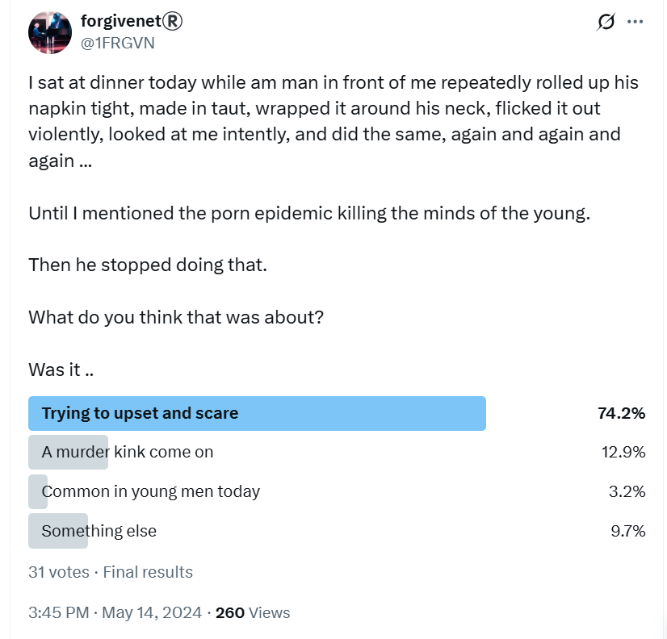

# May 2024

## Post-conservatory, pre-Bali

- I was forced to leave my conservatory studies [in fear for my life](march/13-end.md#distraction-then-drugging).
- I'm doing my best to [get some technical and legal help](april.md#dpr-cyber-expert-alicante) so I can return to [the police in Madrid](march/13-end.md#reporting-the-crimes-to-the-police-in-madrid) and they will investigate.
- Everything I try to do to help my situation, however, seems to falter.
- I have no idea what has really been going on for over two-years in my apartment; I still think I have just been the victim of gang-stalking and bullying, and my devices hacked. 
- The idea that I was lured to my apartment online in 2021, and that it is set up with spy-cams, and that I'm an online porn sensation internationally, and that everyone in Dénia, man woman and child, is aware of this, is something utterly incomprehensible to me.
- The porn-gangs are now preparing for Bali, after which I assume the intention is that I am completely destroyed by porn world; psychologically, emotionally, sexually, and of course financially.
- To that end, online stalking ramps up with constant threats, suggestions of violent relationships, and abusive put downs in what I assume is an attempt to weaken me so I don't make *such a fuss* when the time comes.
- Is this what [Zoe was trying to do](../early-years/2008.md#lauding-male-violence) whenever she spoke to me relentlessly about violent relationships?
- The criminal gangs only had a few weeks before Bali.
- [I had just been porn-prepped after being drugged by the gypsies](april.md#drugged-in-the-street-by-denia-gypsies) on my way home from dinner, and I remember this whole period and on into June and beyond as being a time when I was *constantly* high.
- Everyone involved is certain that no-one is going to help me.
- Consequently, [Hazel Smith](../early-years/2007.md#hazel-smith) doesn't even bother trying to hide anymore.

## Hazel Smith pretends to be Esteve online

- The fake account below has the face of [Esteve the chamber music teacher](../2023/september.md#chamber-music) in the profile pic but no-one is expecting me to think he's running it.

- It *pops up* as usual on my timeline and berates me incessantly for weeks.
- I know it's Hazel immediately and tell her.

- She is not holding back.
- I suggest she not *want to M people*.

- Of course, I'm referring to [what happened between us in 2007](../early-years/2007.md#hazel-smith), something *no one else* knows about.
- She doesn't like me saying this.

- You can go through this tweet graph at your leisure. It's quite fun.
- At the time, I thought it could have been anyone in the region with excellent English, except this account knew things that only myself and Hazel (or people who know her intimately) could have known.
- I wonder who *DS Lc* is?

- Oh yeah, it's me, Lydia Cleaves... except I'm a DCI on X. I'm a [DS on Google mail](#the-laundry). Mistake?
- There was a lot of talk about how *I* had *f*ed up*, which was curious.
- Indeed, she spent a lot of energy telling me how I had *f-ed up* which was an interesting projection, but as I mentioned probably intentionally meant to whittle away at my inner resources so I would be more easily inclined to give up my life to the porn-gangs post-Bali.

- She didn't really know what I was doing, or why, which was nice.

- But she had some small concerns, and made sure to tell me who was in charge.

- It took them over a year more before they started wondering if they might have made a gargantuan mistake targeting me.
- More recently (27th November 2024), another account *popped-up* in the same significant way, Granny Smith. 

- The language reads exactly like the [`@HierEncore49002`](march/13-end.md#hierencore49002) account.
- This account was highlighted to me by *So (Janet)* one of my [dodgy general election volunteers](june.md#volunteers-not-what-they-seem) in November 2024.
- I believe *So (Janet)* could very well know the Smiths in a professional manner and so too the Dénia porn-gangs who she termed *hunters* in a nearly reverent way, after they themselves had called themselves the same online. 
- The `@LardShugga` account (I'd put money on being run by Sandra Smith) was deleted over the last two days (November 2024). The timing is interesting.
- I thought it might be interesting to have a look at our shared followers and, indeed, there are some dubious references on here, and some solid followers and friends as you might expect given the history.

- After these interactions, I would see this account's posts on my timeline frequently.
- It was as if she was on an AI auto-rant about a man who had been obsessed with her, who'd followed her to Scotland, etc etc: relentless drivel with, I expect, truths thrown in.

## The laundry

- I go to the laundry to dry my clothes.
- A man comes in who recognizes me. I have no idea who he is.
- He seems surprised to see me and snickers in that way they do.
- I email my mother and tell her.

- My mother has some pre-baked gaslight for it, as usual.
- The [La Colada laundry](../2023/november.md#the-laundry) has CCTV, by the way.

## Threatening cars outside my apartment

- Every day, in the morning and evening and around lunchtime, cars drive by and beep their horns outside my window when they're level with my apartment.
- One of the cars is the same car that was [lingering threateningly outside my apartment building in January](january.md#threatening-men-outside); a grey Mercedes coupe, or similar, sporty and expensive.
- Another time I see [Ana Requena's blue van](../2023/november.md#ana-in-the-blue-van) again and whoever is driving is extremely muscular as his arms is leaning on the window.
- At night, from about midnight, a parked car sits outside my apartment running it's engine low for hours it seems until it screeches off at some ungodly hour.
- Sometimes, it seems there are two or three cars doing the same.

## Climbing the Montgo

- I climb the Montgo one Saturday afternoon.
- Close to the top, I "bump" into Ana Requena, the violin teacher. She is with a husky dog and a short, slightly built man.
- I realize it was this man in the [blue car incident](../2023/november.md#ana-in-the-blue-van), ducking down so he wouldn't be seen.
- I also remember him from meeting [Paul and Alessandra back in September 2023](../2023/september.md#alex-and-paul) in a cafe as one of the people who suddenly sat down beside us.
- She says hello in an angry way. 
- I find it utterly ironic and wonder if all Spanish people are psychopaths.
- Or was Ana now concerned she might be implicated in an actual murder and she was trying to cover her tracks in a confused way?

## Beams

- An account has been interact with my @JackChardwood account in an usual way: https://x.com/search?q=%20(to%3Ajackchardwood)(from%3Abeams_game)&src=typed_query&f=live
- The interaction runs from 26th April to 31st May.
- The account's name is `@Beams_Game`.

- There is some tweetage and we DM too.
- He talks candidly about his extremely violent father. Much of this content is deleted now.
- On 8th May he posts "Watching you shifting through your ups and downs, gives me the feeling, i know you better then your self do." sic.

- He originally liked all my replies.
- I know it's related and non-random, just like the other accounts that have interacted with me previously.
- I look up "beams" in Spanish. It is "Vigas". I'm nearly sure that's the trumpet teacher's nickname because he has big legs.
- There are sinister references from this account too, suggestions of violence. The "impulses are waiting in line" sentence is very suggestive.
- Close to the end of our interaction he posts an extremely sinister picture.

- This is a good example of the pattern of content coming from the various anonymous accounts that have interacted with me, which I know are related to the trumpet teacher and Domingo:
    - Subtle threats of violence.
    - Subtle mentions of knowledge we share.
    - Trigger words and symbols, memes.
    - Content peppered with romance and kindness, normal communication apparently, then a shock of some sort like the clown pic.
- I remain extraordinarily highly sexually aroused during this month.

!!! danger
    - Whatever is going on is showing no signs of stopping, even though I have been terrorized sufficiently to stop my studies at the conservatory.

## Dreaming of the pedophile

- I dream of Winston M.
- I don't think I have ever dreamed of Winston M, apart from a few months after the [child sex attacks occurred in 1989](../early-years/2015.md#statement-to-the-metropolitan-police). 
- At that time, I dreamed he and I were in the same house in Plevna Crescent, and I asked him if I could go to the toilet, like a child asks an adult, and when I went to the toilet in the dream, I wet the bed in real life.
- I think this was a memory of something that had happened just after an extraordinarily traumatic event.
- I hadn't wet the bed since I was very small.
- In my dream in May 2024, he is wearing a yellow and grey checked jumper and a white chimney-sweep hat.
- We are in a kind of makeshift wooden room, like an external annex or temporary building.
- There are fold up tables with people sitting at them. There are piles of papers on the tables, leaflets maybe.
- He looks at me.
- I walk over to him to talk to him.
- He turns his head away and doesn't speak.

## Madrid

- I head to Madrid and stay from the 5th to the 11th of May. 
- I'm flying out of Madrid on the 11th May to Bali for an event with work and need to get away from Dénia as it is stressful being there.
- Outside my hotel in Madrid, I see strange guys hanging around and I always have the sense I'm being followed.
- Words from random conversations I have are posted on fake account profiles.
- Inside the hotel, online, I am stalked continuously and I believe they get full access again to my new Spanish mobile at this time.
- I have forgotten to block the camera and there is a significant message that describes something in the room or something I'm wearing
- On May 6th, I receive [an email notification that the conservatory has banned mobiles from the building](../../content/documents/emails/prohibiting-mobiles-conservatorio.pdf) and I inform my friend about this.
- I wonder if it is so no-one can take images or films for evidence of wrong doing.
- I have the sensation when I'm praying the rosary that [the monster trumpet teacher](../../crimes/protagonists/vidal-sastre.md#dark-thick-curly-haired-deep-set-man) is standing with me and praying the rosary too. I cannot explain this.
- I am extremely sexually aroused during this time. And it felt like the trumpet teacher was in my mind.
- They must have managed to drug me somehow during this time. 
- I was out of my mind on the run up to the Bali Polygon conference.

## My speech

- On Saturday 11th May, I give a speech at the Let women Speak event in Madrid: https://youtu.be/l9X6o11IwBc?t=1988.
- My speech describes being targeted by a "manada" (which is vernacular for "rape gang" in Spanish) in Dénia and how it parallels precisely the child sexual abuse by a North London grooming gang I experienced when I was 16.
- I make the point that, I would be trans had I been born 30 years later and experienced the same thing.

### The Spanish feminists tell me why they didn't support me

- At the event, and in the online meetings prior, I meet Spanish feminists.
- They realize they know me from the [previous September when I went public on Twitter](../2023/september.md#going-public-on-twitter).
- One of the organizers explains that, yes, we heard about someone from Dénia conservatory, but it wasn't you.
- I tell her, yes it was me. I was asking for help for the same things I'm talking about today.
- "No, no, it couldn't be you. We heard this woman was unstable", she says, "like a victim of domestic violence".
- I remain flabbergasted.
- A woman interrogates me about what happened at lunch but my Spanish is so poor I can barely describe it.
- What I don't know is that I'm being drugged so I'm not at all clear about what's going on, and when I think about the trumpet teacher I get giggly because of the triggered sexual arousal.
- Later, in January 2025, someone posts me a picture of the woman who was organizing the Spanish feminists at this event as the face in the Sphinx.
- I take this to mean the woman has gitano connections and was told to discredit me whatever way she could; and she could not refuse the request.

## Telegram/Signal

- I believe the hackers/stalkers had started to drug me seriously again at home since getting back to Dénia in April.
- A Telegram chat on my Spanish phone invited me to play a game which I downloaded, probably how they so easily got access again, and it was just endless boredom.

!!! danger
    - I wonder now if this is how they target children.
    - Get them hooked into a game and then communicate online with them, hack their webcams like mine was, and manipulate them into something pedophilic. 

- Then, in May, I was contacted on Twitter by an Elon Musk's brother, a fake account obviously, who told me Elon wanted to talk to me, and gave me the Signal details.
- Weirdly, I'm hooked.
- One of the first things this account says is "send pics". 
- I am angry, and tell them I'm not interested in pics, and I don't want to see any male genitals, but I still continue to talk.
- It's not clear why although something in my mind believes it is the trumpet teacher again. It's very strange.
- It was extremely weird in fact. I sent an extraordinarily long rant to this person's account while I was flying to Bali in May.
- In it, I mentioned one image seen on `@jctot19` Google search throughout December which was a film directed by Mel Gibson about child sex trafficking, a true story: https://www.imdb.com/title/tt7599146/.
- The film is playing on Turkish Airlines at the time and I watch it.
- It is a true story and the protagonist's wife is called Katharine.
- It's all so "meaningful".
- I wonder why they would have put that in Google search results for me to see, and I think the worst.

!!! info
    - Was the trumpet teacher alerting me to child sex trafficking going on in Dénia, with the conservatory somehow the training or recruitment ground?
    - It seemed preposterous to me.
    - More likely, they were referring to my child sexual abuse experience of grooming and trafficking that they had known about ever since I [reported it to the Metropolitan police](../early-years/2015.md#statement-to-the-metropolitan-police) and had become obsessed by it for some reason.

### Targeting kids

- Online games.
- Cartoons.

## Bali

- I am in Bali from 11th-19th May with work.
- We stay at the [Grand Hyatt](https://www.hyatt.com/grand-hyatt/en-US/balgh-grand-hyatt-bali).

### Pre-Bali shenanigans

#### Ajay, Alicia, and mushroom-man perform a military coup on my job

- I think they must have started this in late February or early March.
- It'll be in the records somewhere. Alicia can confirm it.
- Did David Schwartz and the Spanish founders suggest this happen in a sort of parallel terrorizing to go along with what was happening at the conservatory?
- It certainly came from up high and multiple teams were involved in singling me and my job out.
- I assumed it was because of my TERFing online, but it wasn't really that at all, although it's possible that's how they justified it to, at least the women involved I hope.

### Flight to Bali

- I fly Turkish airways from Madrid via Istanbul.
- Previous DM from "Elon's brother" ...
- On the flight, I write an enormous text.
- I take some pics and send them.

- I'm also amazed they're showing a film which was posted on the `@jctot19` Google search results around Christmas. 
- It's about child sex trafficking.
- I take a pic and send it.

- On arrival I meet some colleagues. Everyone seems happy to see me, chatty and friendly.

### Arriving at the hotel

- My hotel room is next to John Michael from IT support. I reported my concerns about hacking to him previously.
- I notice constant "set up" events, just like in Denia, which mean someone is tracking mine, and other's, movements in order to create "chance" meetings.
- I seem to have "bumping into" episodes every day; *meaningfully* set up events and situations, or literally bumping into people meaningfully.
- The first one of these "chance meetings" is with Gabriel Silva on the first morning as I'm leaving my room.
- Did something happen the night before in my room?
- The second one is with Alicia a little later.
- Then the writer I worked with Jaime, Alicia again a few times, the Head of IT ... perhaps some of these were random. I hope so.
- During the week, numerous people come up to me to ask me, "when am I leaving?", or "I heard you're leaving".

- It's clearly very easy to whip up bullies into a frenzy.
- I wonder what they might think if they knew they were supporting a mass-pedophile baby-rape network, amongst other things, in Denia.
- I guess they were probably excited and delighted about the sedated *switcheroo* porn; at least the men would have been.
- I complain to my manager, Paul O'Leary about it - the American CTO who replaced David Z. - referencing an earlier complaint I had made to him.
- Gabriel Silva, nothing to do with the writing team at that point, mentions how he is going to be sorting out the docs (my work) using other people who are not on the writing team. 
- It's a military coup; and that's *exactly* how I describe it to my manager Paul.
- When I speak to Paul O'Leary about this in Bali, he sort of [groans with familiarity](october.md#madrid-and-paloma), in exactly the same way Spanish government official Paloma groans when I tell her about the porn-gangs and pedophilia going on at the conservatory of Denia.
- The bullying continues over the following month where another employee, on Gabriel's orders, tries to pretend my systems are unusable, but he can't really and he just looks stupid. It's all in the Git records.
- The implication, however, is that I am incompetent. And mud sticks.
- This has been Gabriel's outward view of me since January after hearing from Grace Torrellas about my women's rights activities, and why, I assume, he stopped giving me any work at that time.
- However, there is something much more sinister going on at Polygon.
- Polygon Spanish male founders and developers know exactly what is going on for me in Denia, and are involved in the conspiracy; at least from [12th June 2023](../2023/june.md#monday-12th-june-2023) when whatever was supposed to happen didn't, but possibly before.
- I believe this is why I was [re-programmed into feeling extraordinarily sexually aroused by the gypsies](april.md#drugged-in-the-street-by-denia-gypsies) just before traveling to Bali.
- I remain high and euphoric and extraordinarily sexually aroused throughout May, and especially in Bali.
- Is my hotel room set up with spy-cams?
- I write an extraordinarily long message to a hacker I believe is the trumpet teacher on Signal while I'm on the plane.
- Curiously, the film I watch on the plane is [The Sound of Freedom](https://en.wikipedia.org/wiki/Sound_of_Freedom_(film)); a true story about child sex trafficking, and more curiously the film's picture came up as a result on my `@jctot19 x` searches around December 2023.
- I find the whole thing very significant, obviously, and I am 100% convinced the person I'm talking to on Signal is the trumpet teacher.
- Bullying just got worse and worse for me after Bali with the intention, I believe, of me leaving, which I didn't.
- The reason there are nearly 3000 issues in the [GitHub repo](https://github.com/0xPolygon/polygon-docs/issues) is because my job was hacked by my colleagues around the time they had had enough of whatever they were doing with me and were ready to get rid of me. Did they know I was about to be murdered?

### The security guy knows something

- Gordon Bishop is the man on the security team who helped me with my [hacked work laptop](march/1-12.md#reporting-hacking-to-polygon-labs).
- He meets me before a dinner one evening.
- He is nervous.
- He wants to tell me something but he can't.
- He talks at me, very fast, a lot, and doesn't let me speak.
- He's concerned.
- He knows something about what's going on.
- I have had long chats with Gordon before and this is not like him.
- I know he's a family man.

### The Pakistani Yorkshire-man

- On the first morning of sessions, I'm stressed and anxious as people have been making sly comments to me continuously.
- Maybe something happened to me the night before in my hotel room too. It's not clear. I'm overly anxious and there's not really a good reason for the level of stress I'm feeling.
- At the end of the morning session in the main hall, someone comes over to talk to me.

- It's the mushroom man guy who has been involved in a military coup on my job over the last couple of months.
- The mushroom man (I'll remember his name, everyone knows who he is) says concerning things in a sinister way, like oh I hear you're leaving, and some other unpleasant stuff. He is the fat man with the mushroom hat on his profile pics. I can't remember his name just now, but he was pals with Jaime, and part of a concerted bullying attack in March with Alicia and her team.
- He's waiting for everyone to leave. Once they're gone, and I'm reasonably more upset than I already was, he walks away down the aisle, giving an Indian man on the other side the nod as he goes by.
- I see the Indian-looking fellow grinning at me at that moment.
- He walks over. No-one else is around.
- There is a handful of people at the back of the conference hall.
- Are they watching?
- The man has long black hair and enormous grinning white teeth. 
- He looks like, and reminds me of, [Jitendra Das](../early-years/2010.md#why-i-decided-to-be-celibate-for-the-rest-of-my-life). No exaggeration. 
- In July 2025, I wonder whether he was supposed to look like Jitendra Das!
- He tells me he's Pakistani, from Rochdale, Yorkshire; rape-gang territory.
- His Oxford-English accent says otherwise.
- He grins at me constantly.
- At dinner, he makes violent sexual threats towards me.

- I tweet about it and tell Spanish HR the following morning.

- I tweet about it.

- While this guy, Aziv Abad (maybe his name, probably not), a Rust engineer who had started the job that week was talking to us, his chatter was so disordered he reminded me of [Nadim Kobesi](../2023/november.md#polygon).
- Was this sexually threatening man another actor, just like Nadim was?
- Were they both hired to terrorize me, and for no other reason?
- I remember saying to Anthony that night that the man had Nadim energy.
- He behaved extremely strangely and menacingly towards me.
- I wonder who he really is, and how much Polygon management paid him, and if I'm on some sort of destroy-the-woman porn soap-opera somewhere?
- It seems more and more likely doesn't it. 
- Do they do the same to the kids now?

### My shampoo goes missing from my room

- I weirdly notice that my shampoo goes missing from my room.
- I assume the cleaner threw it away, and leave it.
- Every morning I am extraordinarily sexually aroused and masturbate.
- Sometimes, I do yoga at the same time.
- I have no idea why I would do this; I have never done it before or since in my whole life.
- Are they somehow triggering a memory of [Jitendra Das](../early-years/2010.md#why-i-decided-to-be-celibate-for-the-rest-of-my-life) along with the [Pakistani Yorkshireman just mentioned](#the-pakistani-yorkshire-man)?
- If I'm in porn again, filmed at the Polygon Bali conference, you'll see me masturbating in tree pose.
- Bit embarrassing, I hope you find it.

### Spanish engineer I recognize

- I meet a lot of the Spanish engineers.
- One of them seems out of place, embarrassed. 
- Nobody introduces him and he never speaks.
- He can't look me in the eye.
- He reminds me of the busker in the tunnel at the [end of April](april.md#drugged-in-the-street-by-denia-gypsies) just after the gypsies drugged me.
- Is he the guy they brought over to Bali to do the sedating?

### Telling people about the forgivenet

- wip

### Alicia

- Alicia Katz worked at Polygon and was part of the bullying I described to my manager (the CTO at the time that took over from David Schwartz) as a military coup operation.
- At Bali, I was set up to "bump" into her a couple of times. 
- I assume engineers at Polygon had the same sort of pinpoint location access to my physical whereabouts as did teachers and staff at the conservatory of Denia, and local townsfolk and porn-gang members.
- I'm pretty sure, like most people at Polygon and elsewhere, she was persuaded to go along with bullying me because of my women's rights activities and concerns about child safeguarding. It's a common thing, whatever.
- She wouldn't have known about the spy-cam and sedating porn going on at my apartment in Denia at the time. I didn't know myself.
- Anyway, shortly after Bali, Alicia leaves the firm suddenly. 
- In her leaving note, she mentions "the worst thing in the world happened" at Bali and how Sandeep Naiwal had really helped her out by getting her a new job.
- I wonder what "the worst thing in the world" was and if it was sexual in content.
- I have reached out to Alicia in case what happened to her at Bali is relevant to this story and to the global tech-bro porn conspiracy overall.

### John Michael

- When we get back from Bali, a few days later there is a chat on Slack about John Michael.
- Someone has nominated him for being the best tech employee ever and Bali is mentioned.
- I agree. 
- John Michael is indeed a lovely man.
- Are they laughing at me?

### Anthony

- You don't have to die: https://www.amazon.co.uk/Dont-Have-Anthony-Mpho-Matlala-ebook/dp/B00H2JPKRK/.
- Very curious, a good choker-seed for when my life is truly threatened after I'm caught up in some honey-trap relationship, probably with [number 3 trumpet teacher](../../crimes/protagonists/vidal-sastre.md#an-unknown-man-i-may-have-a-picture-of)?
- Or something closer to the divine?
- Anthony and I have a drink together one evening after dinner.
- I weep at the table.

### Hans

- Dinner with Hans.
- He hates me.
- Oh they're really gonna go for you, he says, when we talk about Hinduism and other things.
- Keeping look out.
- Hans is *always* hanging out on the path towards the rooms with one of two other men, Chinese men.
- I see him every time I'm walking back to my room at night.

### Chess with the Head of IT

- I play chess at dinner with the Head of IT.
- This is the first time I notice my chess playing is appalling; I'm rubbish, below average.
- This is not like me at all.
- At the time, I just put it down to a *one off* scenario.
- In September, when I join Chess.com, I find out that my cognitive left-brain skills required to be a good chess player are all but disappeared.

### Eye troubles

- I meet people, or they are pointed out to me, but I'm struggling to remember them when I meet them again.
- It's like everyone's face is a bit blurry and the same.
- The founder Sandeep is annoyed that I don't know who he is, and I met him only the day before.
- The following day I do not recognize him again.
- Everyone talks to me like I'm the antichrist, and any tiny defect is proof of it, this included.

### Tips for investigators

- Check with the conference team and hotel what special requirements were made for certain people's rooms, such as mine and JTs, and Alicia's, perhaps all the women attendees (about 5% of total attendees).
- Also check the guest list and attendees for any Spaniard, male or female, who may be linked to poisoning and sedating tech as this would have had to have been done by experts; it is ridiculously unlikely that porn-addict crypto tech-workers would have the knowledge and skill to sedate a target in the same way as the criminal honey-trappers and porn-gangs have been doing for decades (see also the highly professional McCann sedating and kidnap); someone who knows how to add sedating substances to cooling systems, for example, or is skilled in [distraction and poisoning techniques](../2025/july.md#lourdes).

### Elon visits Bali the same week

- Of course, Elon is in Bali that week.
- One of my Spanish colleagues tells me, I look it up and it's true.
- He's not that far from us either, apparently.
- Coincidence?

### My work with Polygon after Bali

- The intense bullying from my team begins.
- It is clear they are done with me post-Bali and now want rid of me.
- The behavior of Hans in particular (who did no work at all so I'm wondering if he was another actor, like Nadim and Aziz, brought in especially for one purpose) was outrageous.
- Anthony, HR, and my managers supported Hans; and ignored me completely.
- He would have been fired on the spot in any normal situation.
- I believe they were trying to get me to leave as quickly as possible; they were done with me now. 
- They must have known what was coming up next for me, and my expected descent into being a permanently-drugged hardcore porn actress/slave, or marrying a violent male/pimp who intended on taking my money, while I was at work and able to tell people what was going on, would not have been helpful for the porn-gangs.
- Except, what they were expecting to happen didn't happen, did it.

## Perito - technical expert DPR

- There are a bunch of emails over this time with the [perito in Alicante](../../content/documents/evidence/comms-with-perito.pdf).
- I collect my equipment and pay 150 eur on 23rd May.
- I receive an invoice document at that time.

    - [Invoice and receipt first page and payment](../../content/documents/evidence/DPR-1.JPG).
    - [Invoice and receipt second page](../../content/documents/evidence/DPR-2.JPG).

## Lourdes

- I leave for Lourdes at the end of the month.
- I plan to spend two weeks in Lourdes.
- I need to be out of Dénia as much as possible.
- It's enormously stressful being there as anytime I leave my house, shopping, going to the laundry, walking to the beach, I am harassed and followed by locals.
- It's clear to me, however, that no matter where I am, the cyber stalking will continue.

## Tweets

### `@1frgvn`

- https://x.com/1FRGVN/status/1794467120207765821
- Search URL: https://x.com/search?f=live&q=(from%3A1frgvn)%20until%3A2024-05-31%20since%3A2024-05-01&src=typed_query

### `@JackChardwood`

- Search URL here: https://x.com/search?q=(from%3AJackChardwood)%20until%3A2024-05-31%20since%3A2024-05-01&src=typed_query&f=live
