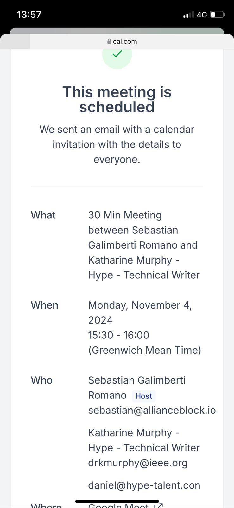
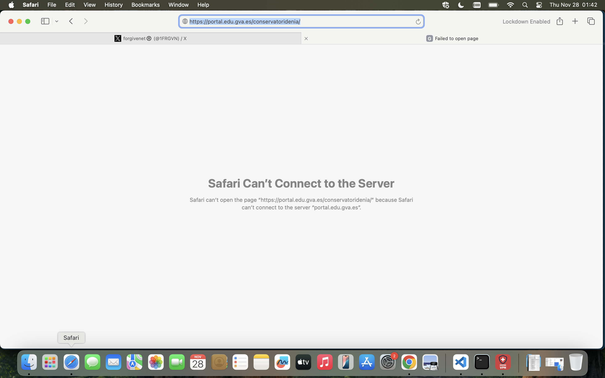

# November 2024

!!! note
    - This section is a bit disordered. 
    - Please be patient as I carefully edit previous sections.

## Going to the night shop

- I go down to the Open 24 Market for some wine in the evening of 2nd November.
- I guess the gang stalkers (the entire population of Dénia) think I'm going to the Indian because they've put a monstrous full-size figure (Halloween monster) in the seat that Paul usually sits in whenever they schedule me to "bump" into him.

## Poisoning at my apartment

- I'm feeling extremely unwell in my flat. My kidneys are aching.
- Dark circles suddenly appear under my eyes - like they did after the chamber music class in January 2023. 
- My eyes are extremely blurry. My mind is confused and I can't remember simple things. I'm sure I'm being poisoned.
- It's impossible for me to go out walking without feeling like I'm going to be attacked in some way; psychological usually.
- Every night, I hear a woman next door talking to a man. Her strident smoker's voice sounds like an extremely slow-motion machine gun; a hideous sound, monstrous.
- I hear her and another woman outside my door a lot. I look out of the spyhole and see them at the water main cupboard, every day.
- When I went shopping to the Carrefour the previous week, a couple parked their car close to mine and as I'm coming back to my car they start shrieking and laughing, and putting their phones up if they're recording me. I don't know who they are. The man looks like the [man who keyed my car on the Mongto](../2023/october.md#my-car-is-damaged-on-the-montgo). I recognize the woman somehow. Messages on Twitter fakes accounts that like my posts refer to it later on. It's been like that constantly since September 2023. Later, I dream the man slams the woman's face into the dashboard.
- So I don't go out and consequently, if they are poisoning me through the air vents, I'm unable to get out to clean my lungs.
- On Friday 1 November, as I come back from the taking the bin out, I bump into two women coming out of the apartment building, one of whom I recognize as Carmen Cano.
- Two weeks later in Thailand and I do feel better, my kidneys are not constantly aching and my mind is getting slowly clearer.

## I start writing this statement

- As suggested by [Paloma in Madrid](october.md#meeting-inma-and-paloma-the-spanish-official-in-madrid), I begin writing my police statement at the end of October when I get back from Fatima.
- I start locally without uploading to Git.
- I will not create the Git repo until 11th November.
- No one should know what I'm doing, except of course they know because they are monitoring everything I do online.
- A recruitment consultant, Joel Barden contacts me with a job. We arrange an initial chat for the 4th November.

- Here's our [WhatsApp chats](../../content/whatsapps/WhatsApp%20Chat%20with%20Joel%20Barden.zip).
- I have to move our chat to later on in the week and end up talking to him while I'm waiting for my flight to Bangkok from Madrid airport again on the 7th or so.
- We have a great chat and he tells me I will be getting a task to complete as the next step.
- He sends the task immediately.
- It's a week long intense task.
- I believe they're trying to distract me from my police statement.
- I tell them I cannot complete the task for at least a few weeks because I have a more pressing writing project at hand.
- They drop me from the interview process.

## My father falls down the stairs

- On Friday 1st November, my father falls down the stairs and breaks 21 ribs.
- He is rushed to hospital and will stay there for two months.
- I organize to return to London as soon as I can, and leave the next day.
- If this event had not occurred, I believe I would have been killed or permanently maimed by the poison being fed into my water at the apartment.

### Alarm on my phone

- As I'm driving out of Denia, my phone suddenly makes an unimaginably loud and alarming noise.
- It's apparently a DANA warning, which is over.
- They're trying to make me crash the car again.

## Drugs hair test

- A nurse at the Royal London hospital in Whitechapel recommends I get a drugs test.
- I phone the police to find out what to do.
- I tell them I believe I was poisoned with the intent to kill and I am suffering symptoms of that.
- They suggest I contact a third-party drugs test service, which I do.
- It costs £1000+ but I believe it must be done.
- I go along.
- A woman takes two hair samples from the root to tip.
- She explains she needs two samples in case one is not sufficient.
- She explains every centimeter has a month's information in it.
- We're talking and I explain I have been stalked and harassed probably because I'm a rape gang survivor from 1989 and I believe I have been drugged continually over a long period and more recently poisoned.
- She tells me about how she used to live in Spain and sometimes the Spanish men were a bit out of order.
- Suddenly the conversation changes and she tells a long story about how this poor man had been charged with rape by a woman who was lying, and he'd lost his family and his job, everything.
- I don't know why she is telling me this story.
- I know that sometimes people lie about being raped but it is a tiny statistic in masses of reports of rape; 1 every 3 minutes in London I heard, will confirm.
- It's weird that she would go to places which sound like she is minimizing what's going on for me.
- I don't respond but I do wonder if someone has told her to speak to me this way.

## Bangkok

- On 7th or so of this month, I return to Madrid to fly to Thailand, a trip I had arranged for some time.
- I stay at the Citadines Sukkumvit Soi 8 hotel.
- The cleaner looks like she has been crying, every morning.

### Writing my police statement

- I start writing a full draft of what's happened to me over the last few years in Denia.
- I decide to make a website of it, save it in git, and then use cloudflare to publish it.
- I WayBack machine all the pages after updates.

### Hiring a lawyer to help me with Polygon's illegal dismissal

- I get a recommendation of a lawyer from a friend who works for Deutsche Bank who made a successful complaint for unfair dismissal some years previous when she was working with another firm.
- The British lawyer cannot help me as I have a Spanish contract, but she recommends a Spanish lawyer in Madrid who I contact immediately.
- The company is [J. A. Cremades Y Associates](https://www.jacremades.com/) based in Madrid.
- See also [Miguel Angel Piano](../early-years/2014.md#signs-a-spanish-lawyer-is-not-behaving-correctly).
- Reading through our correspondence, I start to become suspicious about the Madrid law firm when it becomes obvious they are mis-hearing and re-writing important things I have said, which would make me look like a liar.
- They also appear to be ignoring the sexual harassment claim and referring to it as "opinion".
- They then appear to be colluding with the company I'm complaining about by only calling witnesses who work for the company, and ignoring [Nadim Kobesi](../2023/november.md#polygon) who may have been working for the porn-gangs, the British Pakistani man who made a [violent sexual threat towards me at dinner in Bali](../2024/may.md#bali) who again may have been working for the porn gangs via Polygon management, and the other sacked writer on my team Anthony who was there at the time who very likely would not have lied about what happened.
- I fire them.
- I'm upset about this. I feel this addition to the overwhelming oppression I have experienced could tip me into an angry meltdown; something I experience very rarely.
- At this moment, a sense of calm comes over me and I feel like God is with me. 
- I have a sensation that this is not the end of this story with this lawyer and Polygon, and I must wait till next year.
- Something I trust implicitly is telling me not to worry.
- I feel protected and guided, and I can get on with drafting this police statement without this distraction.

### A threat to my brother's life

- On Sunday 10 November, hackers post what I consider a threat to my brother's life.
- The profile pic is clearly my brother, although the bottom part of this person may be someone else.

- The account details show sniffing dogs (Cano Lopez) and have a clear reference to death: RIP.

### Porn-addicts of Bangkok out in force

- Hackers post fake accounts with information from emails I have just written or conversations I have just had.
- I visit Lumpini Park in Bangkok.
- The "Find My" app suddenly appears asking whether I want to remove it or not. I'm still being tracked.
- A man walks past me making porn faces at me.
- This happens multiple times in Bangkok.

### Hackers seem to be annoyed

- A direct message pops up: "Who's paying you?"

### Kidney health test

- Last week in Bangkok I had my kidney checked out and all signs are good, except for my anion gap which is excessively low, 6.0 L mmol/L and could mean bromide, iodide, or salicylate ingestion. Common medical diagnostic tests do not consider cases such as mine.
- If I drink one glass of wine, however, I have immediate frothy urine.
- Update on 2nd December, the froth in my urine has now disappeared even when drinking wine.

### Drugs test

- My drugs test over the last 12 months comes back completely negative.
- I can't believe it.
- I ask the test center for the second sample so I can get another lab to retest.
- They don't have it.
- I take a huge sample of hair immediately and keep it safe.

### An inexplicably bad haircut

- I go to get my haircut.
- I tell the hairdresser I am growing my hair so not to take too much off.
- I also explain that my hair is really fine and I would like some extra body on top so layers are helpful.
- The woman hacks my hair off in no uncertain terms.
- She gives me a very short hair cut.
- She even uses the clippers to remove hair at the back on my hair line.
- And she uses the thinning technique to remove great chunks of my hair and thin it out.
- I am devastated but do not complain because it is obviously an attack and they'll be ready to fight me.
- Why would she do this? 
- Was she told to do this by someone lying about me? The way they do.
- I wonder if it could be so I do not have enough hair to get a decent sample when I get my drugs test and find out it is negative.
- Fortunately, I already got a sample.
- The hairdresser notices where I was hacking away and makes a comment about it.

### The blind man

- I'm walking to the shopping center. I can hardly see.
- My vision is really blurry, my eyes are red and sore, I feel very unwell.
- I see a blind man being led along by two women.
- He is a tall Western man. The women are Thai.
- I don't know what happens but this sight makes me suddenly realize that, even though I'm away from my apartment, I'm *still* being poisoned somehow.
- I throw all my shower gel, shampoo, and face wash away and start to feel better immediately.

### Tattoo

- I was on my phone to my mother, telling her I'm going to get a tattoo in Bangkok.
- Two seconds later, a fake account follows me on Twitter with a woman with tattoos.

### The landlady

- I spoke to my mother the other day and told her I was thinking about leaving the flat on 15th February 2025 and handing in notice in December.
- I told no-one else this.
- This morning, 21st November, I receive a WhatsApp from Beatriz, my landlady, saying I had said I was leaving the flat.
- I did not say this to her at any time and I have been planning on staying until 2026.
- I ask her who told her I'd said that.
- I mention there is a problem with the water but we can discuss it later.
- I have raised the issue with the [water pipes](../2023/september.md#the-water-pipes) twice already.

- She hurriedly responds with a WhatsApp message from March when I had been terrorized and told her I would need to be leaving. But since then we have conversed and I never mentioned leaving again. In fact, quite the opposite so this reference is bogus.

### Sunday 24th November - note

- I have had sufficient messages from hackers on fake accounts at this time to be concerned they will impede this statement-writing process.
- I know they have pretty much full access to all my devices and I'm unable to access internet on my mobile right now for unknown reasons, the behavior is much like when I tried to access the Guardia Civil website and was blocked for doing so. 
- So I have sketched as much important stuff as possible from March 2024 to now just so it's added.
- Please note my mind was so badly affected by all this over this year, it is quite hard for me to get everything together correctly, and I will need to cross check with hotel and travel schedules, and Twitter messages, but this will take some time.
- I have completed up to January 2024 now, and fully drafted February 2024, so it's probably already enough to prove gang stalking, cyber stalking, and sexual grooming.
- Hopefully I will be able to continue as best I can, but nothing would surprise me at this stage.
- I believe I am continually targeted online by Domingo and Carmen Cano, Hazel Smith and her mother probably, and the trumpet teacher whoever he is.

### Accessing the conservatory website

- I wonder if the trumpet teacher has been re-employed by the Generalitat this year, under a different name of course, and I look up the conservatory website to check.
- I'm blocked from accessing the website in the same way I was blocked from accessing the Guardia Civil website and the ECHR website.
- If so, he will be there for one reason only, to sexually groom minors.

### Pre-glaucoma diagnosis

- On 28th November, I have an eye examination at Rutnin Eye Hospital in Bangkok.
- I get a diagnosis of PACS from the eye hospital (primary angle closure suspect). Sudden onset glaucoma risk basically. No one in my family has this and everything else is completely normal. It's unusual.
- My eyes have been red and blurry for weeks, and it's very difficult to focus. 
- They diagnose me with a pre-glaucoma condition which is very serious.
- My eye pressure is very high, over 20 in both eyes. My normal pressures should be around 12-15.
- The ophthalmologist suggests we do some breathing Buddhist meditation and this brings my pressures down to 15/17.
- She tells me it means I could go blind suddenly and very quickly.
- I'm told if I get any signs that my angles are closing, I need to go to A&E immediately and [my PACS medical certificate](../../content/documents/health/medical-certificate-PACS.JPG) will get me to the front of the queue.
- I'm horrified. 
- It's a sudden onset eye-condition coming directly from poisoning.
- I'm guessing methanol.
- I was right to replace my bathroom products; I also replace toothpaste, toothbrush and some other things.
- Symptoms decrease even more.
- Eventually, I will throw away everything ingestible I brought from home; sun tan lotion, liquid supplements, eye drops, everything.
- I realize what was behind the [unusually high eye pressure reported by Alain Afflelou](../../personal/health.md#eyes) the opticians in Ondara when I moved back to Denia in 2022, something I had never suffered from previously.
- I'm beginning to realize I have been being drugged and poisoned from the moment I moved back to Spain in February 2022.
- It looks like I was lured back to that apartment specifically for sinister and criminal purposes.
- The scale and duration and the amount of resources put into the conspiracy is mind-blowing.
- What could be so interesting about me to put so much time, effort, and resources into doing me serious harm? 
- None of it made any sense.

## Adding spy-cams to my London address

- If you knew your spy-cam porn star was moving house, and you were 100% convinced that no-one would ever help her, and you were making untold money on spy-cam porn from her alone, how would you arrange spy-cams to be set up in her bathroom before she moved back?
- Would you make sure you could manipulate her family's internet network?
- Would you have to, given that the network had been breached for decades already?
- Would you devise a method of stepping in when anyone in the family needed some work done?
- Would you give yourself a name which would pretty much ensure your fake company would be tasked with the job, a family name perhaps?
- Would you send the person with instructions to annoy the resident so much she would leave you alone for long periods in the house alone, where you could install as many spy-cams as you liked?
- Do you think you might do that, if you were a criminal gang with no concerns about getting caught?
- My mother employed a man, [Sean Murphy](https://find-and-update.company-information.service.gov.uk/officers/tqU3t9O-pOkVHJKKZIuE1h2cx3I/appointments) (a significant family name), to install stair lifts at the house.
- My dad doesn't believe that's his name and keeps calling him Dennis.
- Sean Murphy wound my mother up so much she nearly sacked him two or three times.
- He would turn up really late, or not at all, leaving her waiting around all day for him.
- On a couple of occasions this tactic meant my mother was so exasperated she left him alone in the house for long periods while she went out to do the shopping.
- Was he also employed to [install spy-cams](../2025/may.md#spy-cams-in-london-n2-also)?
- Starting to realize how comforting this might be.

## I'm banned for life on LinkedIn

- I change my LinkedIn profile pics and messages to things related to my political activities with the Party Of Women.
- I'm banned for life on LinkedIn.
- I seek help from the Free Speech Union.
- They ask me to request my data as is my right.
- I request LinkedIn send me all my personal data over the last few years.
- They refuse with some fobbing-off reason.
- I request again more clearly.
- They refuse again. They have no valid reason for refusing.
- My LinkedIn data includes all the fake bot accounts that prompted me to get jobs at [Polygon](../2023/november.md#polygon), [zkSync](../2023/june.md#elon), the [Torus](../2023/august.md#head-hunted-by-ex-polygon-director) scam, and all the tech-bros implicated in the international online porn-gang conspiracy that contacted me via LinkedIn.

## Fake account

- A fake account called Ligia Betton interacts with me. 

- I believe this is what is going on, i.e. a porn network (league) has a bet on me. People are making money off me now just like they have been since they made porn of me when I was 16.
- I pray that police will act at some point.
- I'm getting close to the truth.

## @jctot19

- I check the `@jctot19` account for the first time in ages, this Wednesday 20th November.

- He hasn't posted since the 15th January 2024, or he has deleted his posts from then.
- The highlighted post from 9th January, mentioning the *chica*, appears to be referring to me. The account he is replying to is protected so I cannot see the conversation. The implication is that I am chasing him again and again. However, this is undoubtedly what he, Domingo, and their co-conspirators have been setting me up to *appear* to be doing.
- This was after Christmas where I was extraordinarily high, flying is an understatement, and we have plenty of witnesses to that. I was exuberant. 
- I look back and see I must have been drugged with something.
- At that time, there were DM'ed conversations between myself and someone pretending to be him (the American account, Matthew). I relate all this in the [December 2023 section](../2023/december.md).
- Then there was another account in January that chatted with me, pretending to be him.
- I had gone to Dublin on my therapy course that [January 2024](january.md), opened an anonymous account on Twitter, followed `@jctot19` on it, and posted solely to my timeline without interacting with his account directly at all.
- I posted about my therapy, and looked on his timeline for responses, as before.
- The first post I had seen on his timeline during that time had been an angel climbing a ladder to heaven, so I continued.
- I posted one tweet with a sexual connotation and he immediately posts the response from 15th January where he apparently randomly reaches out to a woman he hasn't seen in years.
- I immediately stop communicating with him and delete the twitter account I had created.

!!! important
    - It may be helpful to know that if at any time the trumpet teacher had been honest with me, that would have been that.
    - Instead, he and his teams created convoluted situations in which I was always questioning whether he was interested or not, I was never really sure, and so it kept me hanging on in the attempt to find out what was going on, at a minimum.
    - And on top of that, somehow I was being spiked with drugs or herbs that made me extremely sexually aroused, and led me to masturbate for an unseen audience, while I was also being groomed HEAVILY online with MRA seduction tactics on Twitter and elsewhere.
    - We have to assume that I am the tip of the iceberg with regards to these sorts of honey-trap manipulation techniques and it is highly likely children are being targeted in the same way.

## Honey trap

- I believe that the `@jctot19` account is fundamentally a honey-trap account.
- Is it possible I blew his cover and that is why the original tweets stopped on 15th January? I think it's highly likely given they shut everything down when I said [something that directly related to Winston May](january.md#galway-ireland-tt).
- Nevertheless, bizarrely, Google search results related to this account are still active. I notice the newer entries are coming from retweeted posts. I suspect the retweets are automated.
- Carmen and Rocio Vidal still feature. Carmen is obviously Carmen Cano, Domingo's sister.
- I post about [seduction techniques](../../evidence/manipulation.md) on Twitter: https://x.com/1FRGVN/status/1860132157890679006. Immediately, an account interacts with me that has a warning, and suggests the trumpet teacher has an alibi, and not to forget to cross examine Domingo (Camo).

- I suspect Carmen Cano to be behind most of these, including the threat to my brother's life.
- This is my most translated tweet for ages:

