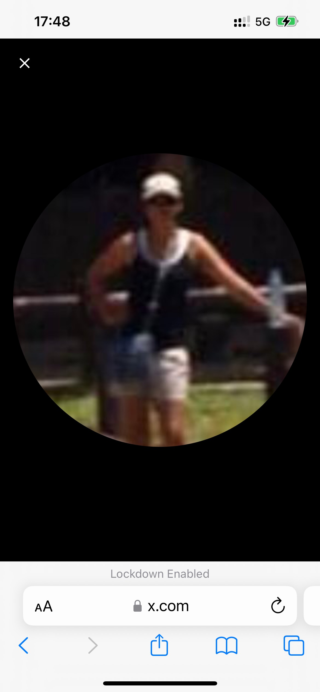
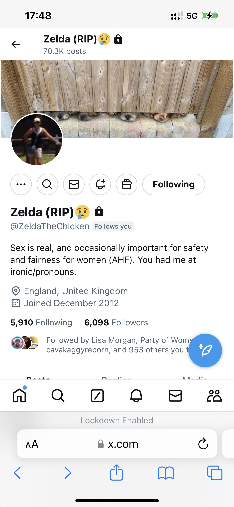

## Going to the night shop

- I go down to the Open 24 Market for some wine in the evening of 2nd November.
- I guess the gang stalkers think I'm going to the Indian because they've put a monstrous full-size figure (Halloween monster) in the seat that Paul usually sits in whenever I "bump" into him.

## Last October/early November

- I'm feeling extremely unwell in my flat. My kidneys are aching. I have suddenly appearing dark circles under my eyes. My eyes are extremely blurry. My mind is confused and I can't remember simple things. I'm sure I'm being poisoned.
- It's impossible for me to go out walking without feeling like I'm going to be attacked in some way; psychological usually, so I don't go out and consequently, if they are poisoning me through the air, I'm unable to get out to clean my lungs.
- On Friday 1 November, as I come back from the taking the bin out, I bump into two women coming out of the apartment building, one of whom appears to be Carmen Cano.
- My father is taken to hospital and I have to leave abruptly for London on 3rd November.

## A threat to my brother's life

- On Sunday 10 November, hackers post what I consider a threat to my brother's life.
- The profile pic is clearly my brother, although the bottom part of this person may be someone else.

{width=65%}

- The account details show sniffing dogs (Cano Lopez) and have a clear reference to death: RIP.

{width=65%}

