# November 2024

## Another attempt on my life

- On the last week of October 2024 running into the first week of November, the criminal porn-gangs of Dénia decided to murder me, again.
- They had already [doused all my belongings in pesticides](october.md#the-router-malfunctions) while I was away praying to Our Lady of Fátima in Portugal.
- They had instructed my colleagues at Polygon - those involved in watching the live-streams of my time as a sedated sex-slave at my home in Carrer Furs, and those involved in the sedating and rape at the [Bali offsite](may.md#bali) - to fire me before I arrived home because I was going to be murdered, and it wouldn't look good if I turned up for meetings while that was happening.
- Polygon obliged and I was fired the working day before I arrived back to my pesticide-doused apartment and belongings, and deadly drinking water.
- My feeling was I was ingesting methanol and other deadly substances through the mains water - I experienced [shooting nerve pains in my face and neck while drinking my coffee](october.md#serious-poisoning-with-intent-to-kill).
- I saw the [neighbor at number 18](october.md#activity-in-the-nextdoor-apartment-number-18) fiddling around daily at the mains water-pipe cupboard outside our front doors.
- Did they have some mechanism there for adding poisons to my mains water?
- I saw Carmen Lopez Cano, Domingo the piano teacher's sister, and the woman from number 18 grinning at me while they were leaving my apartment building on an occasion I had stepped out to go to the shop.
- Marie Carmen in number 16 was very active this week too; visitors speaking loudly with her outside our front doors every day.
- Was she also adding poisons to my drinking water with some mechanism built into our shared wall?
- In bed one night, I connected in with the sole human in all the world who cares about me, and we cried together at the thought of me dying this week and us never seeing each other again, and we prayed together too, and then a giant being of light flew down and covered me with its feathers and I went to sleep safely and the poison had no long-term effect and did me no harm. 

## I start writing my police statement

- As suggested by [Spanish foreign office official Paloma](october.md#meeting-inma-and-paloma-the-spanish-official-in-madrid), I begin writing my police statement at the end of October when I get back from Fátima.
- I consider it a serious task.
- I'm trying to make sense of the chaos for law enforcement, and for myself.
- I foresee the task lasting about a month to six weeks!
- I start writing locally without uploading to Git servers.
- I will not create the Git repo until 10th November.
- No one should know what I'm doing, except of course everyone knows what I'm doing because the porn-gangs are monitoring everything I do online and have been for decades without my knowledge.
- Joel Barden at Hype had started contacting me about jobs right after Bali, and long before Polygon eventually fired me.
- He had gotten me an interview bang in the middle of *extreme* persecution I was suffering in Dénia - probably around September 2023 sometime - with a company who treated me at the interview as if I was dirt. 
- The interviewer had put a ridiculous grinning face on his zoom welcome.
- Not long after, I'm followed by a fake account with the same grinning idiot face. 

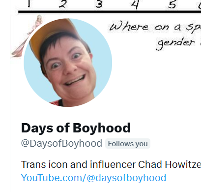

- The interview must have been a set up.
- Do they live-stream the various humiliating female-tech-colleague events direct onto porn networks the afternoon prior to a sedated sex-slave spy-cam event?
- Does this sort of thing drum up *massive* subscription-fee income?
- After getting fired from Polygon, I contact Joel about jobs again.
- Joel arranges an initial chat with Sebastian at Nexera for the 4th November.

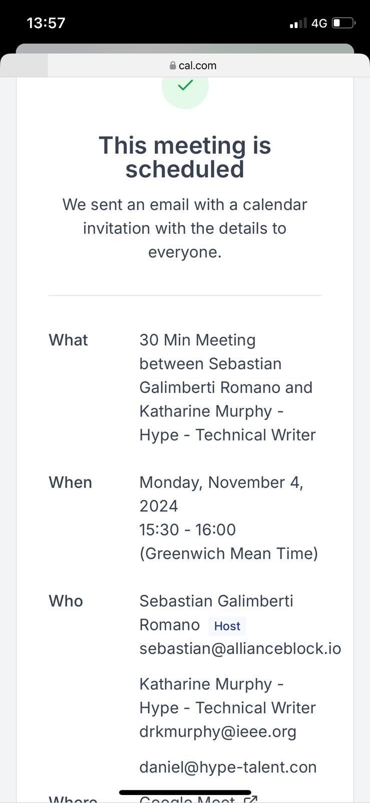

- Sebastian lives in Alicante.
- If he's not a paying member of the burgeoning porn-addict tech-bro women-despising networks in Alicante or indeed Spain, or even more deeply embedded, it would be very surprising, don't you think?
- I don't know who Daniel at Hype is.
- Here's all my [WhatsApp chats with Joel](../../content/whatsapps/WhatsApp%20Chat%20with%20Joel%20Barden.zip).

??? tip "WhatsApp chats with Joel Barden"
    16/09/2024, 15:46 - Joel Barden: Hey Katherine ! A new role focused on Technical Writing has landed. They are called Nexera Foundation (Ecosystem) - looking and have worked with another client of ours Project Zero. 
    Have some big names behind them check them out over the socials. The requirements for this one are as simple as...
    Technical Writer, Web3, Dev Background, Name in Web3 on CV
    https://x.com/Nexera_Official
    https://www.linkedin.com/company/nexerafoundation/
    https://www.nexera.foundation/
    https://nexera.medium.com/the-nexera-ecosystem-roundup-pushing-boundaries-with-tokenization-ebda15c68ba7
    Let me know if you would like me to bullet you :)
    27/10/2024, 23:57 - det sgt lydia cleaves: Hey Joel, checking in, probably you got my linked in, got made redundant on Friday :(
    28/10/2024, 04:22 - Joel Barden: Hey Katharine! Oh no well I have a technical writer role I can send you over too ! Let me share all the details tomorrow when I get to the office 😁
    28/10/2024, 04:23 - Joel Barden: In fact one moment I have my laptop will forward it all over
    28/10/2024, 04:25 - Joel Barden: We are also no longer connected on LinkedIn for some reason so will share here. Do you have an updated resume for me?
    28/10/2024, 04:27 - Joel Barden: https://www.linkedin.com/company/projectzeroio/
    https://www.projectzero.io/
    https://www.linkedin.com/in/sidjain02/
    https://x.com/ProjectZeroIO
    About Us
    Project Zero is on a mission to empower Web3 products and services by removing the burden of infrastructure and blockchain data management. We envision a future where businesses can seamlessly focus on creating solutions to their core problems instead of the complexities involved in maintaining blockchain data operation infrastructure. 
    Project Zero is dedicated to building innovative Blockchain Data Infrastructure Platform that empower developers. Data Scientists and drive the next generation of technology. We have a flat hierarchy and you will have complete autonomy for your work.
    28/10/2024, 04:28 - Joel Barden: Here’s the guys - looking for everything you have :) 
    Also some big parent companies also! Let’s touch base tomorrow and get that updated CV and make sure my notes are still active
    28/10/2024, 04:43 - det sgt lydia cleaves: Yes let me sort that out for you tomorrow..
    28/10/2024, 04:44 - det sgt lydia cleaves: We shld still be connected, I'll check first thing
    28/10/2024, 15:10 - det sgt lydia cleaves: Project zero looks good
    28/10/2024, 15:10 - det sgt lydia cleaves: Just trying to reconnect now on linkedin
    28/10/2024, 15:11 - det sgt lydia cleaves: Do you have my email? drkmurphy@ieee.org
    28/10/2024, 15:11 - det sgt lydia cleaves: Getting an updated CV together now
    28/10/2024, 15:48 - Joel Barden: Thanks Katharine - are you still flexible to the $135k with an overall packcage of incentives? Just updating the notes - Ideally $150k base but open to negotiation? Just accepted the invite
    28/10/2024, 15:50 - Joel Barden: Yes I have that email on my notes :)
    28/10/2024, 15:50 - det sgt lydia cleaves: My full package at polygon was 230
    28/10/2024, 15:50 - det sgt lydia cleaves: Base 170
    28/10/2024, 15:51 - det sgt lydia cleaves: Plus tokens
    28/10/2024, 15:52 - Joel Barden: Not sure everyone can accommodate the Polygon prices 😂 so what you be your lowest on flexibility>? These guys can push the boundaries whats the lowest base your looking for
    28/10/2024, 15:52 - det sgt lydia cleaves: ideally 17
    28/10/2024, 15:52 - det sgt lydia cleaves: Oops sorry 170
    28/10/2024, 15:52 - det sgt lydia cleaves: Happy to wait ,not in a rush either
    28/10/2024, 15:53 - det sgt lydia cleaves: Can you send me an email plz and I'll send over this CV
    28/10/2024, 15:53 - Joel Barden: No worries let me change the base to $170k - see if this is something they can accommodate :) 
    Joel@hype-talent.com
    28/10/2024, 16:02 - Joel Barden: Let me know when that has sent through
    28/10/2024, 16:13 - det sgt lydia cleaves: Sent
    28/10/2024, 16:15 - Joel Barden: Received :)
    01/11/2024, 15:57 - Joel Barden: Hey Katharine! Sent an interesting message on LinkedIn :)
    01/11/2024, 19:07 - det sgt lydia cleaves: Received and replied thank you. I keep this phone turned off mostly nowadays but check in every day so will get messages eventually.
    01/11/2024, 20:57 - Joel Barden: Thank you Katharine I’ve been in Dublin so got this sorted now! Booked 3:30pm BST Monday!
    01/11/2024, 21:01 - Joel Barden: <Media omitted>
    03/11/2024, 17:31 - det sgt lydia cleaves: Joel apologies I have to rearrange as my dad is in hospital and I'm racing back to London now
    05/11/2024, 20:47 - Joel Barden: Hope all is well! Good luck for the call in the AM with the team, I know they mentioned to todays candidate about potential cross over the whole of Nexera Ecosystem so that could also be great! Catch up tomorrow :)
    05/11/2024, 21:40 - Joel Barden: Even better they have opened it to the Nexera Ecosystem so this could be across the Ecosystem! Some good news they have just told us
    06/11/2024, 03:19 - det sgt lydia cleaves: Hi Joel, cool sounds interesting 😎
    06/11/2024, 15:20 - Joel Barden: Good luck this morning Katharine! Go smash it
    06/11/2024, 17:08 - det sgt lydia cleaves: Thanks Joel, they just rearranged the meeting to 4 today which I can't do unfortunately
    06/11/2024, 17:09 - det sgt lydia cleaves: I could do 4 tomorrow
    06/11/2024, 17:09 - det sgt lydia cleaves: Potentially
    06/11/2024, 17:09 - Joel Barden: Do they have a link on the email for you to re arrange your side?
    06/11/2024, 17:09 - Joel Barden: For when suits you
    06/11/2024, 17:09 - det sgt lydia cleaves: Let me check
    06/11/2024, 17:10 - det sgt lydia cleaves: One mo
    06/11/2024, 17:13 - det sgt lydia cleaves: Yeah hopefully for tomorrow evening but next week will be ok too
    06/11/2024, 17:13 - det sgt lydia cleaves: I'm in BKK for the next few weeks
    06/11/2024, 17:14 - det sgt lydia cleaves: If theyre going to Devcon I could potentially meet in person
    06/11/2024, 17:14 - Joel Barden: Great so have you re arranged this call for tomorrow or do you need me to do this my end
    06/11/2024, 17:14 - det sgt lydia cleaves: I think you're cool Joel , just waiting for a confirmation
    06/11/2024, 17:15 - Joel Barden: I can also ask for the devcon meet! Let me see if the team are going :)
    06/11/2024, 17:15 - det sgt lydia cleaves: I didn't manage to get a ticket but I'm in BKK
    06/11/2024, 17:17 - Joel Barden: Ive just asked let me know if they reply for the new meeting time suggested :)
    06/11/2024, 17:18 - det sgt lydia cleaves: I'm going off this phone now till later will text on Linkedin
    06/11/2024, 17:26 - Joel Barden: No worries :)
    07/11/2024, 16:08 - Joel Barden: Hi Katharine, whats the latest update did you manage to reschedule with the team or so I need to get another time booked in
    08/11/2024, 00:21 - det sgt lydia cleaves: Hi Joel yeah we're doing tomorrow evening around 7..
    08/11/2024, 15:52 - Joel Barden: Great
    11/11/2024, 17:32 - Joel Barden: Hey Katharine did you get the invite for 30
    Mins time?
    19/08/2025, 14:40 - Joel Barden: Waiting for this message

- I'm astonished how "normal" I sound on the days I'm being poisoned directly through the water in my apartment!
- No small thing.
- Anyway, I don't realize how much God I actually have at this time.
- I won't have the clarity of mind to consider it until late 2025 and I've finally understood the switcheroo-porn scenario at the conservatory.
- I move our chat to later on in the week and end up talking to him while I'm waiting for my flight to [Bangkok from Madrid](#bangkok) around the 7th.
- I have a great chat with Sebastian; he's really very friendly and decent, I think.
- I always think the best of everyone, as you know.
- He tells me I will be getting a task to complete as the next step.
- He sends the task immediately.
- It's a week-long extremely intense task.
- I believe they're trying to distract me from writing my police statement.
- The gangs MO has always been to try to distract me from making a sensible decision about my life, or finding out the truth about what's really going on by drugging and poisoning, with social media poison, and by using people like [Paul who will do whatever they say](../2025/january.md#paul).
- I tell Sebastian that I cannot complete the task for at least a few weeks because I have a more pressing writing project to complete.
- They drop me from the interview process.
- Were the gangs hoping I'd be distracted from writing my police statement for long enough so that the poisons properly kicked in and I would be unable to write anything anymore, or I'd be dead?

## Poisoning in my apartment and terror outside

- Although I haven't died, I do feel extremely unwell.
- My kidneys are aching.
- Dark circles suddenly appear under my eyes one morning - just like they did after [the chamber music class in January 2023](../2023/january.md#serious-poisoning-at-chamber-music-class), and probably other times where I was so high I don't remember but I have vague recollections of this happening at regular intervals in my home. 
- I saw other people who looked like this: Margaret Cornwell after months hanging out with Hazel, the beautiful Romanian boy at the conservatory after being taught by Domingo and the other poisonous teachers, many of the targeted women pics have that poisoned look too.
- My vision is extremely blurry. 
- My mind is confused.
- I can't remember anything.
- Simple tasks are extraordinarily difficult.
- I'm sure I'm being poisoned.
- It's impossible for me to go outside of my home without feeling like I'm going to be attacked by locals.
- Every night, I hear the woman next door in number 18.
- She is talking to a man.
- Her strident smoker's voice sounds like an extremely slow-motion machine gun; a hideous sound, monstrous.
- I hear her and another woman outside my door every day.
- I look out of the spyhole and see them at the open watermains cupboard, fiddling around, every day.
- The smaller woman is [Carmen Lopez Cano](../../crimes/protagonists/domingo-et-al.md#carmen-lopez-cano).
- Marie Carmen has very loud guests, also every day, and they stand outside my door and shout at each other, it sounds like.
- Are [the pipes in my kitchen squeaking](october.md#squeaking-pipes) because someone is accessing them through the wall from Marie Carmen's apartment at number 16?
- It must be really annoying I don't immediately just die, like everyone else has.
- Whenever I'm out, they're entering my apartment to add deadly poisons to my food and water.
- They also know I'm due to leave for Thailand for two months on the 7th.
- So to ensure my demise, they add deadly poisons to my bathroom products and supplements; things they know I will be taking away with me.
- On Friday 1st November, as I come back from the taking the bin out, a five minute job, I bump into the two women coming out of the apartment building as I'm about to enter.
- I can hardly see anything my vision is so blurry, but nevertheless I do see Carmen Cano Lopez smiling at me; the smile of a murderer enjoying her fun.

### Clowns at the Carrefour

- When I go shopping at the Carrefour one evening, a couple parks their car close to mine.
- As I'm coming back to my car they start shrieking and laughing, and putting their phones up if they're recording me.
- The man looks like the [man who keyed my car on the Mongto](../2023/october.md#my-car-is-damaged-on-the-montgo).
- I recognize the woman somehow.
- I think she's the bar woman who works at the cafe I used to meet Lorraine in back in 2014: Ciberdenia.

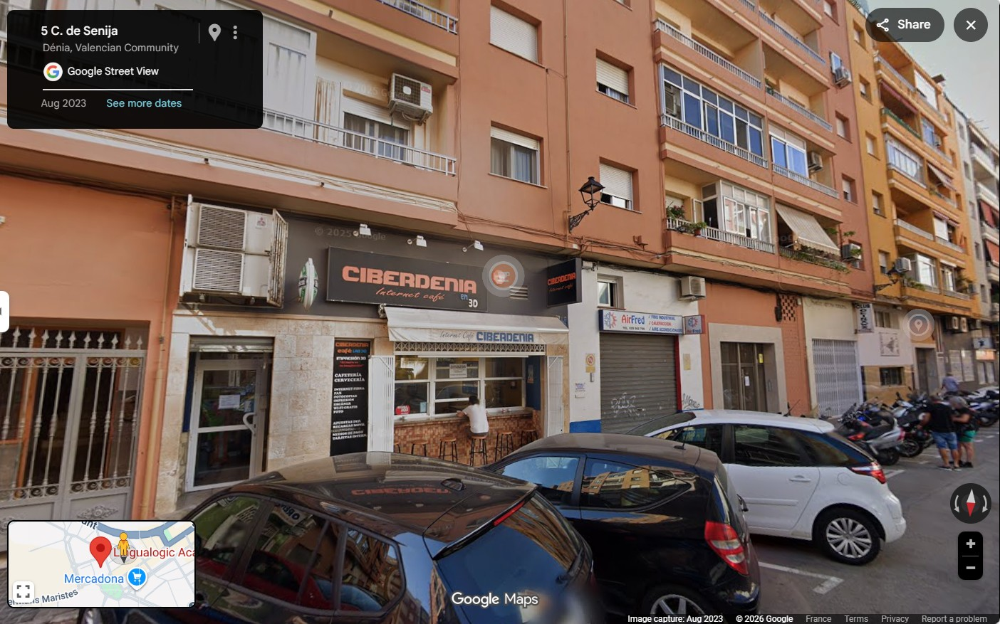

- Back at home, messages on fake accounts that like my posts refer to these two and their behavior.
- Later, I dream the man slams the woman's face into the car's dashboard.
- So, for the last week I lived at Carrer Furs, I stayed in and, consequently, I was unable to get out to clean my lungs of the pesticides fumes all over the flat coupled with the poisoning through the air vents.

## My father falls down the stairs

- On Friday 1st November, my father falls down the stairs and breaks 21 ribs.
- He is rushed to hospital and will stay there for two months.
- I organize to return to London as soon as I can.
- If this event had not occurred, I believe I would have been killed outright by the poisons drip-feeding into the water coming into my home.
- While I'm unaware of dad's connections to criminal porn-gangs, I believe that he saved my life by falling.
- Teachers and staff at the conservatory of Dénia and their associates have left me permanently and verifiably brain-damaged and maimed by poisoning.
- The gangs did not stop drugging and poisoning me until [October 2025 when I finally realized (after attending mass on St Michael's feast day) that there had been more than one trumpet teacher taking the class at the conservatory](../2025/october.md#thunderbolt-clarity), and this meant they had set up a porn studio in the music school itself, and I had been starring in a switcheroo-porn sedated-special.
- It also meant that whenever teachers, staff, students, my colleagues, and the local townsfolk laughed at me uproariously, pointing and staring, it was because they knew I had been brain-damaged by my music teachers.
- It continues to this day as my infamy reaches wherever there's pockets of criminal porn-addicts fooling the women and children around them.
- They think drugging and poisoning women and children for porn is funny!
- Do you think it's because these people are evil?
- Or should we consider it an expected result for people after decades of desensitization from watching the criminal porn made in Dénia and the surrounds and distributed globally by North London criminal gangs?

## Horror-town gone totally mad

- I go down to the Open 24 Market for some wine the evening before I fly back to London.
- This is where, famously, [I often bump into Paul](october.md#bumping-into-paul-again), when they want him to find out what my plans are, etc.
- Paul [knows me intimately](../2023/october.md#paul-and-alessandra) too.
- It's how they control people; getting them on film.
- I wonder exactly how many of the men, women, and youngsters of Dénia know me intimately.
- Certainly, back in 1989, Winston May thought his 5 year old nephew might like to "know me intimately".
- I can't imagine things have gotten any less evil since then.
- It's quiet, no-one's around.
- The porn-gangs think I'm heading to the Indian that evening.
- I'm not, so I don't pass the spot where I usually "bump into Paul".
- As I'm leaving the shop, I cast my eye over to that area and I see a monstrous full-size figure Halloween monster sitting in Paul's chair.

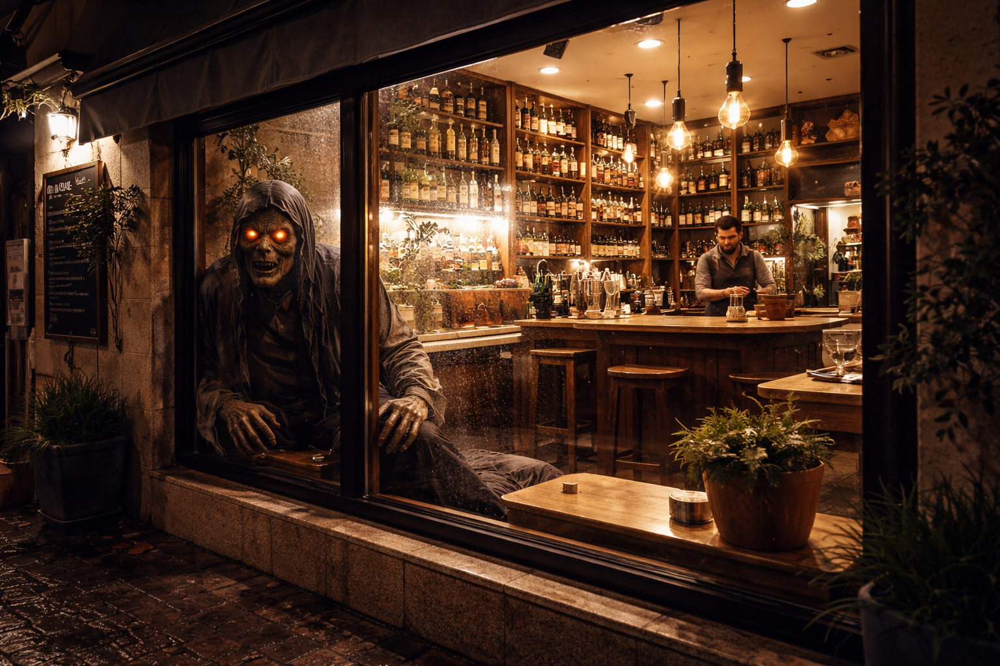

- It's a switcheroo surprise!
- I've been so powerfully drugged and poisoned this week they're expecting me to think it's Paul.
- The shop-keeper repeats his words over and over like he hasn't heard what I said, like he's a malfunctioning robot.
- He's playing the horror-porn-town game.
- I guess they do this sort of thing to all their sedated-rape victims.

## Cacophony coming from my phone while I'm driving

- As I'm driving to Valencia airport, on a particularly dangerous part of the road, my phone suddenly makes an unimaginably loud and alarming noise.
- I've just overtaken an ambulance.

- The noise goes on for about a minute while I scrabble around to shut the phone off because there's no other way to stop it.
- Before I do, I see a message saying it's a DANA warning.
- Except, the DANA storm is over.
- They're trying to make me crash the car, [again](october.md#visiting-inma-again-in-madrid).
- I realize that the hackers of Dénia have full administration access down to the inner hardware workings of my phone.
- They seem to be able to rewrite the machine code and even reprogram the chips.
- I wonder what evil that capability could wreak in the world?
- I heard certain frequencies coupled with trigger-images can manipulate people into believing they're sick; see [Alessandra, for example](../2001-to-2010/2009.md#alessandra-gets-sick-or-does-she) or even my belief I had a weak heart.
- I had that for years while I was *depressed* and it was total nonsense!
- Can the porn-gangs of Dénia make people sick by rewriting the chips to produce low-volume frequencies on hacked devices?
- Is this another way they make you sexually aroused too?
- If they do have this capability, I'm guessing it's well known.
- So why did the Spanish national Policia and the British Metropolitan police refuse to investigate my hacked devices?

## Testing my hair for spiked-drugs over the previous 12 months

- I speak to a nurse at the Royal London Hospital in Whitechapel.
- She was from South African and had been looking after my dad when he came in.
- I told her I had been drugged and poisoned in my apartment in Spain over many months.
- I explained it as a domestic violence situation because I figure that’s the only way I can describe what’s been happening to me so that people will understand.
- She advises me to leave the man (I'd explained that a man - Domingo - and his family were targeting me).
- I tell her I live on my own.
- She's shocked.
- She suggests I phone the police and maybe get a drugs and poisons test.
- I phone the police and explain I was being poisoned at my home in Dénia, Spain, until just a few days ago.
- I tell them I believe the poisoners intended to murder me, but didn't manage it, and I'm suffering the effects of those poisons.
- They suggest I contact a third-party drugs testing service.
- They explain it's the kind of service they send criminals, or suspected criminals, to for evidential purposes to comply with the courts.
- I look for a service online and find a company called [AlphaBiolabs](https://www.alphabiolabs.co.uk/).
- I set up an appointment in Wembley at the medical centre in Chaplin Road where they perform testing.

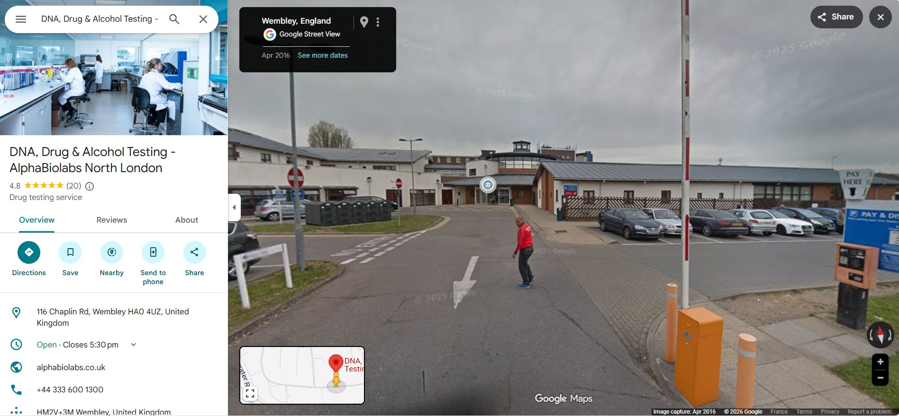

- The service costs over £1000 but there's no question I have to have this done; I'm probably the one-in-a-million of victims that can afford it.
- I set up a payment plan.

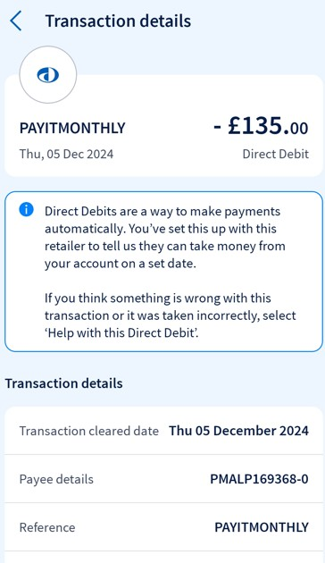

- I go along.
- The woman explains they're going to do a 12-month drug test using a hair sample.
- I answer a detailed questionnaire: whether I have taken any drugs in the last 12-months, how much alcohol I have drunk, and even if I could have sat next to someone who was smoking pot.
- Apart from the alcohol, it's a resounding no.
- She cuts two hair samples from the root to tip and bags them up.
- She explains she needs two samples in case they get any error on the first one, or if the courts aren't convinced and ask for a retest.

### Women who lie about men raping them

- We're talking, me and the nurse.
- I explain that I have been drugged, poisoned, stalked and harassed in Spain.
- I say it's probably because I'm a North London rape-gang survivor from 1989.
- I tell her I believe I have been drugged continually over a long period and more recently poisoned.
- I explain how I would become overwhelmingly sexually aroused in my apartment in Spain for no reason, usually at lunchtimes.
- I tell her I have been hacked, and that criminals have taken private images of me, and posted photos on my X timeline from porn made when I was sedated and gang-raped by groups of black men in 1989.
- The woman tells me about how she used to live in Spain and how sometimes the Spanish men were a bit out of order.
- She told me about an experience she'd had where she had smiled at a man in the shop one afternoon and he'd tried to break into her house later that night.
- Suddenly, the conversation changes.
- The woman starts to tell me a long story about how she'd know this poor man who had been charged with rape by a woman who was lying, and he'd lost his family and his job, everything.
- She's so upset and angry for this poor man.
- I don't know why she is telling me this story.
- It's a little incongruous and insensitive given I've just told her I'm a multi-rapist survivor.
- I'm dumbfounded, actually.
- She sounds exactly like the porn-gangs online who often post *women-who-lie-about-rape* memes, especially when I annoy them.
- It sounds like what evil men do when they think they can terrorize women; succeeding only when we still believe there's something good in them.
- It feels exactly like how [they wheeled Winston May out](june.md#winston-may) to terrorize me while I was campaigning at the General Election.
- At the very least, she is minimizing what's been going on for me and countless other women and children.
- Is it to save herself from the realization of my horrific reality?
- Or was someone telling her what to say?

### Drugs test results

- My drugs test results come back from AlphaBiolabs when I'm in Bangkok a few weeks later.
- They're completely negative.
- I can't believe it!
- I phone them up and tell them it's impossible, I've been drugged out of my mind daily for at least a year, and in some cases - such as at [Christmas in Madrid and Avila](../2023/december.md#christmas) - the drugging was extreme, using intense euphoric substances and hallucinogens.
- There is no way, I explain, that the sample could be negative.
- I agree that they probably they don't test for the brain-damaging herbs, or pesticides and brake-fluid; but the mind-altering substances, hallucinogens, mushrooms, extasy, speed, pot-derivatives, etc. should definitely have come up.
- The woman on the phone says: *you were being spiked*.
- I say yes.
- I ask her to give me the second hair sample so I can get another lab to retest.
- She goes away and checks, comes back and says they don’t have it.
- I ask her where it is?
- She says they must have thrown it away.
- I ask why.
- She has no good reason for it.
- After the call, I take another huge sample of my hair and keep it very safe and explain to people how valuable it is.
- If we find it is unavailable, then we have solid proof the porn-gangs own the men at 31.

#### Losing all my correspondence from the drugs laboratory

- When I arrive back in the UK in January 2026, criminal gangs access my `katharinejchardwood@gmail.com` account to make it inaccessible.
- I had been accessing the account easily for years.
- I have the password, multiple back-up email addresses, a fingerprint and pin number on my laptop, all sorts of ways to gain access it.
- Whenever I try to access it, all these options are unavailable.
- This must be malicious Google admin activity.
- Moreover, I had backed up and saved everything from this account to google drives, and as much as I could onto external drives.
- *All* the Google drive back ups are missing.
- I still have enough data on my hard drives to annoy everyone, however.
- Here's the results document which I cannot access because the password is on an email.

[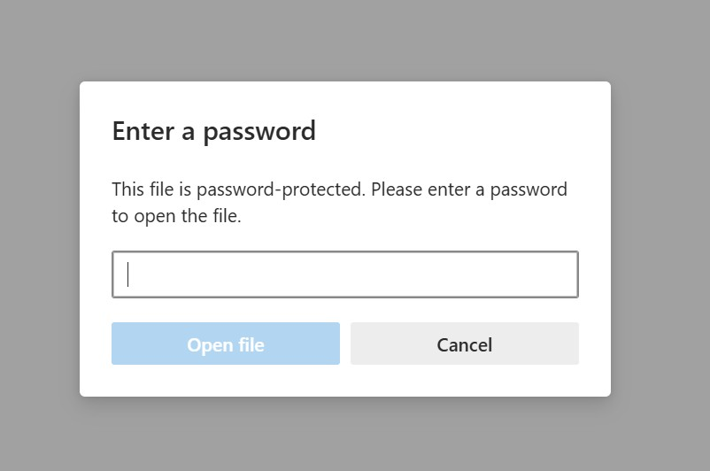](../../content/documents/drugs-test-results-C%20305106_MURPHY_COA_DOA.pdf)

- But who would want the drug-tests records deleted, I wonder?
- Could it be the Metropolitan police service; protecting pedophile pornographers in Spain and rape-gangs in North London?
- Is the drug test service owned by North London criminal gangs?
- Are Google porn-addict employees responsible for tampering with my Google search results owned by the gangs too?

## Bangkok

- On the 7th or so of this month, I return to Madrid from London and fly to Thailand, a trip I had arranged for some time.
- I was lucky and wealthy enough at the time to be able to organize prolonged trips away from my home in Dénia while trying to solve this hideous problem I was having with the people there.
- I can't imagine how the thousands of other victims have dealt with the same constant and vicious attacks with nowhere else to go.
- I guess many of them are backed into a corner with no option but to do porn, or whatever it is the gangs want.
- I stay at the Citadines Sukkumvit Soi 8 hotel in Bangkok for around three weeks.
- I like it there, the staff are great and the restaurant is good too.
- I don't like the area so much; there's a lot of very open prostitution and white Western men taking advantage of it.
- The cleaner looks like she has been crying, every morning.
- I think something must be going on in her life to make her so unhappy and I try to be kind towards her.
- One night, late, I hear a small child scream in pain repeatedly, loudly, from a bedroom down the hall.
- I shudder.
- It's too much to process while I'm starting to write this police statement and I'm still feeling unwell for some reason too.
- I believe now I was shepherded online to this accommodation specifically by the porn-gangs so that they knew where I was and what I was doing, and that they used it for *other stuff* too.

### Porn-addicts of Bangkok out in force

- I realize pretty quickly I'm being watched very closely by the porn-gangs while I'm in Bangkok; online and in person.
- Hackers post fake accounts with information from emails I have just written, or actual in-person conversations I have just had, like before.
- One afternoon, I visit Lumpini Park in Bangkok.
- Looking back, I was high that day.
- There's weirdly paralleled activity online on my mobile and in the park itself.
- The "Find My" app suddenly pops up asking whether I want to remove it or not.
- I'm still being tracked and followed.
- A man walks past me making [the same face I made while masturbating in my bathroom in Carrer Furs back in July](july.md#opening-my-mouth).
- This happens multiple times while I'm in Bangkok.
- Whenever I leave the hotel, I'm certain I'm being followed, and they're not being very clandestine about it either; they want me to know.
- It's a continuous threat.
- It's around now I start to shudderingly wonder if I'm some sort of spy-cam porn star?

### But I have help, too

- It's around this time I start to notice I'm getting help.
- I'm certain a group of people warned me about the poisons in my toiletries in a curious way; just like something teachers and staff at the conservatory might do - [a choreographed skit](#the-blind-man-and-the-copper), but for good purposes instead of evil.
- It's only in retrospect and with a clear mind that I'm able to tie all this together rationally.
- It looks like [my handwritten letters](august.md#the-handwritten-letters) had an impact somehow, and I was being taken seriously.
- As well as the porn-gangs, other people had started watching everything I was doing too; friendly people.
- This has been the state of my life ever since. 
- I'm not only hacked my the criminal porn-gangs anymore, but I also appear to be hacked by numerous international law enforcement organizations interested in what's been going on and very interested in the conversations I've been having with these criminals online.
- I've never been too sure who it is that's been helping me; I suspect the FBI or similar.
- It's comforting.
- But I do wish it were over, and that people were arrested, and that Spanish children and the children of visitors to Spain are safe again.

#### The hackers are annoyed

- A direct message pops up on my X UI: "Who's paying you?", it says.
- This sort of comment from hackers - I believe this was Hazel directly - made me even more sure that my situation had shifted into something new.
- [Hazel Smith](../2001-to-2010/2007.md#hazel-smith), and others, end up having a long conversation with me in Thailand; every word of it monitored by law enforcement.

### Hiring a lawyer to help me fight Polygon's illegal dismissal

- Polygon have accepted the dismissal is illegal but go ahead anyway.
- They're, apparently, firing everyone in the department.
- They send the letter to my home in Carrer Furs and I do not receive it until I return in February 2025.

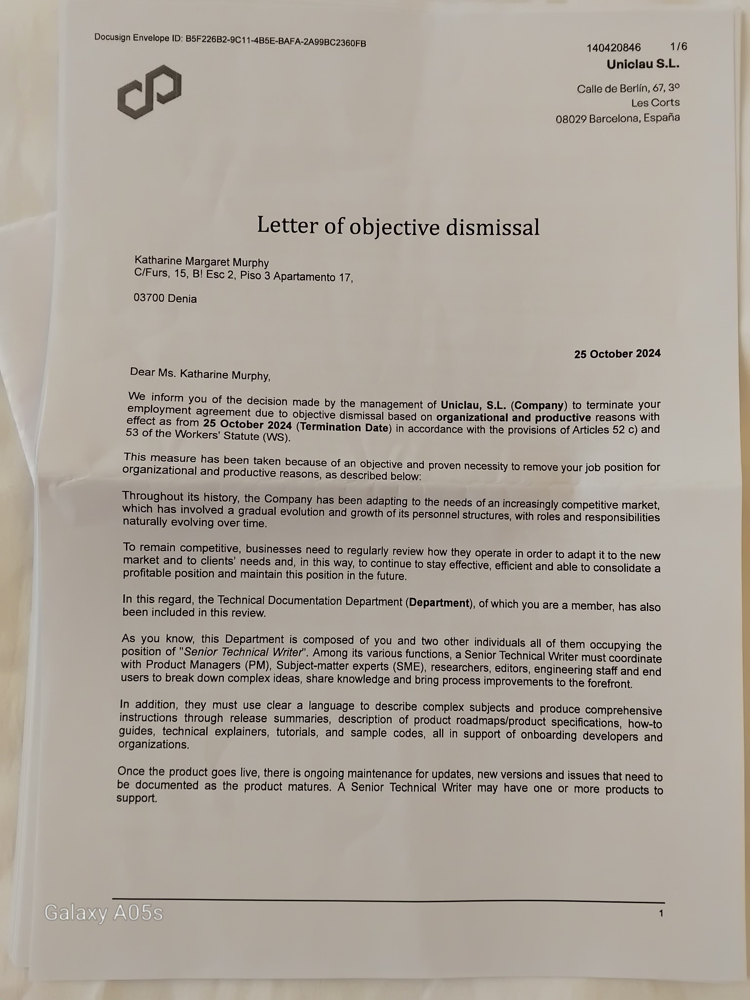
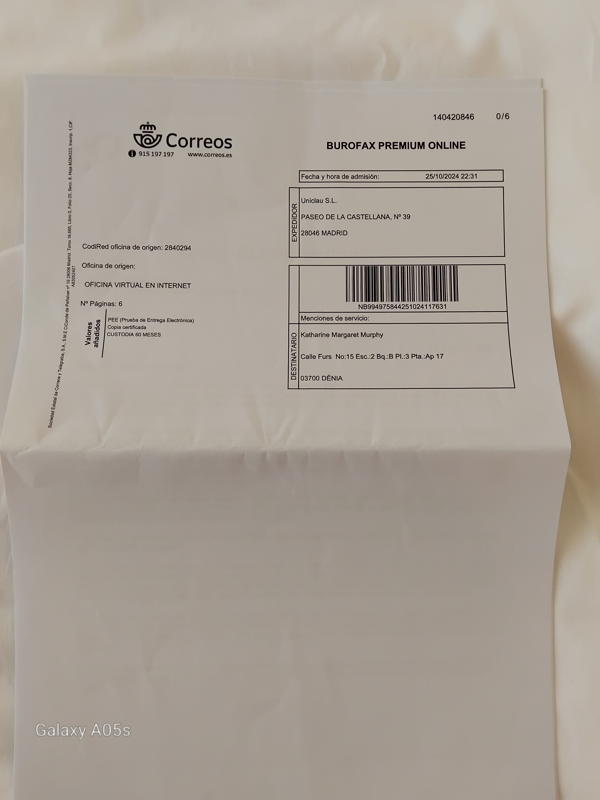

- They seem to be saying they're going to get unskilled employees doing other jobs to take over the professional writing function.
- I'm keen to fight them. 
- It's totally out of order and unfair.
- I'm also keen to claim for the constant bullying and harassment [I was already discussing with HR](october.md#bullying-ramps-up-at-polygon) including the [threat of sexual violence at dinner in Bali](may.md#the-pakistani-yorkshire-man).
- I get a recommendation from a British friend.
- The British lawyer cannot help me as I have a Spanish contract, but she in turn recommends a Spanish lawyer who I contact immediately.
- The company is [J. A. Cremades Y Associates](https://www.jacremades.com/) based in Madrid.
- Reading through our correspondence, I start to become suspicious about the Madrid law firm when they repeatedly misread and rewrite important things that I have told them *in writing* in a way which would make me look like a liar.
- They also appear to be ignoring the sexual harassment claim and refer to it as "opinion".
- Furthermore, after meeting Polygon representatives in Barcelona at court, my lawyer appears to be colluding again by *only* calling witnesses who work for the company, and ignoring [Nadim Kobesi](../2023/november.md#polygon) who was probably working directly for the porn-gangs, the British Pakistani man who made a [violent sexual threat towards me at dinner in Bali](../2024/may.md#bali) who was similarly dubious, and the other sacked writer on my team [Anthony](may.md#anthony) who had been at the dinner table that night and was tasked with making sure I got back to my hotel room every night at the offsite.

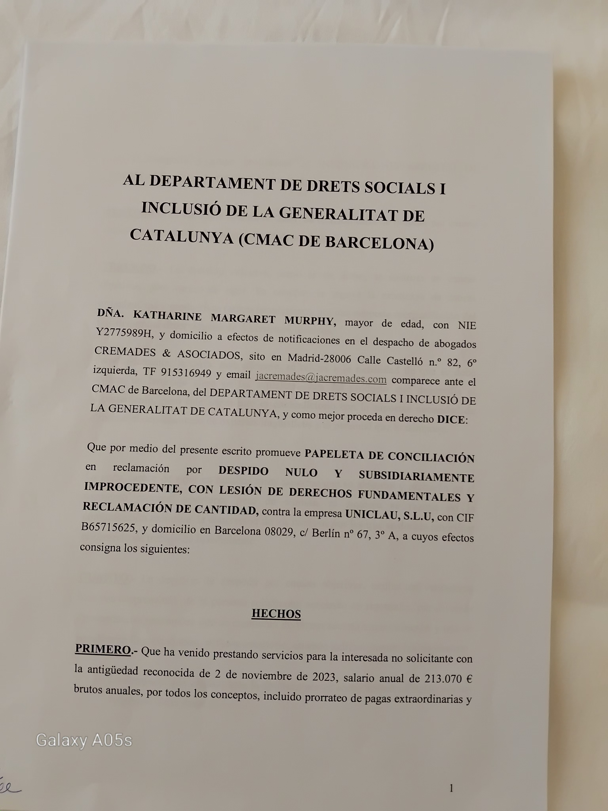

- They do however want to call [Hans Bodani](../2023/november.md#hans-bodani), the other member of the team who was [utterly insubordinate towards me, repeatedly, and never dealt with](may.md#post-bali).
- I find this very interesting and I start to wonder if Hans is still working for Polygon, perhaps as a writer with the Indian side.
- I fire the lawyers.
- I'm upset about it.
- It's another heavy addition to the overwhelming oppression I have been experiencing.
- I'm close to tipping into an angry meltdown; something I experience very rarely.
- At this moment, a sense of calm comes over me and I feel like God is with me. 
- An idea emerges in my mind, assuring me that this is not the end of this story with this lawyer and Polygon, and I must be patient and wait till the following year.
- Thank God I've no idea about my decades-long history of repeated sedated rape at this time, or that I starred in sedated-rape and drugged spy-cam porn direct from [my hotel room in Bali just a few months ago](may.md#bali).
- Something powerful in my mind that loves me unconditionally, and that I trust implicitly, is telling me not to worry.
- I feel protected and guided, and I continue drafting my police statement without this horrible distraction.

#### The Spanish embassy in Bangkok

- Since the lawyers need to attend court with Polygon's representatives in Barcelona, and I'm in Thailand, I have to organize a power of attorney.
- I walk round to the Spanish embassy a few times to organize this; it's just round the corner from where I'm staying.
- On one occasion, I'm chatting with the official at the desk and I have cause to mention how I have been unimaginably hacked in Spain.
- His eyes flash concerned recognition.
- I meet the ambassador to sign the document.
- As I walk into Spanish territory, I have a feeling people are interested in me, coming out to have a look.
- I wonder why.
- Prior to meeting the ambassador, I realized that a power of attorney document would give the Madrid lawyers, potentially, total control over my life; so I make sure to add a clause to the document saying it applies to the matter concerning Polygon's illegal dismissal alone, and no other matter.

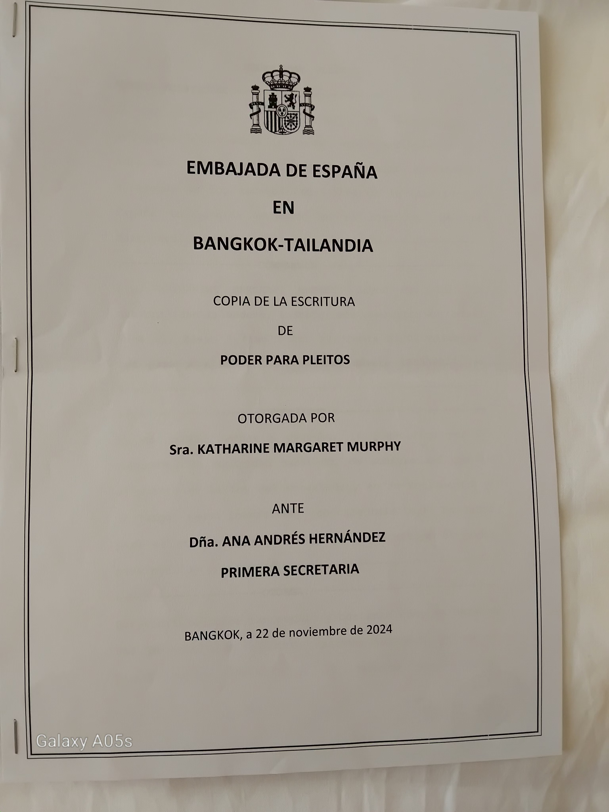

#### Travel expenses

- The lawyer asks for travel expenses to Barcelona and [sends a bill](../../content/images/polygon/cremada-lawyers-madrid.pdf).

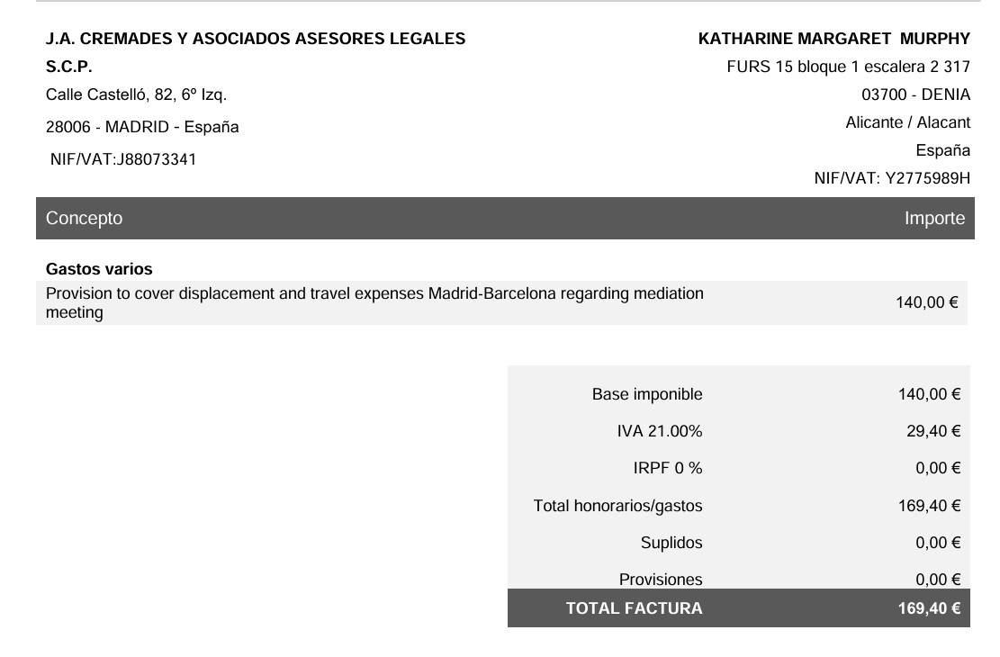

- I'm a bit surprised as I just paid them thousands of euros for their services which I had assumed would include court attendance.
- When I fire them, I ask for a refund for the agreed work not yet carried out.
- They refuse.
- They badger me endlessly for the travel expenses, and I pay them in January 2026.

### A threat to my brother's life

- On Sunday 10 November, hackers post a fake account containing a threat to my brother's life.
- The profile pic is very clearly meant to represent my brother.

- The account details show sniffing dogs (Cano Lopez) and there is a clear reference to death: *RIP*.

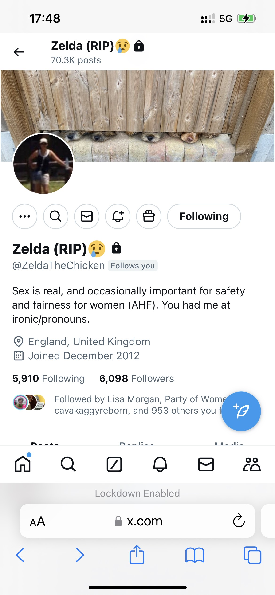

- I text my brother to inform him immediately.
- As with every other time I have told him about the criminal gangs and their activity, including how my life has been in constant danger, he responds with disinterest.
- Does he know they're only after me?
- Is he on their payroll too?

### Kidney health test

!!! tip "Kidney health check details"
    - Below are the exact words I used when I first drafted this section, just three weeks after Carmen Cano Lopez and her mother? or aunt?, and the neighbor Marie Carmen at number 16, tried to murder me, once again, by poisoning at my home in Carrer Furs.
    - I had the full kidney check-up performed at Bangkok Hospital's kidney department.

- Last week in Bangkok I had my kidney checked out and all signs are good, except for my anion gap which is excessively low, 6.0 L mmol/L and could mean bromide, iodide, or salicylate ingestion. Common medical diagnostic tests do not consider cases such as mine.
- If I drink one glass of wine, however, I have immediate frothy urine.
- Update on 2nd December, the froth in my urine has now disappeared even when drinking wine.

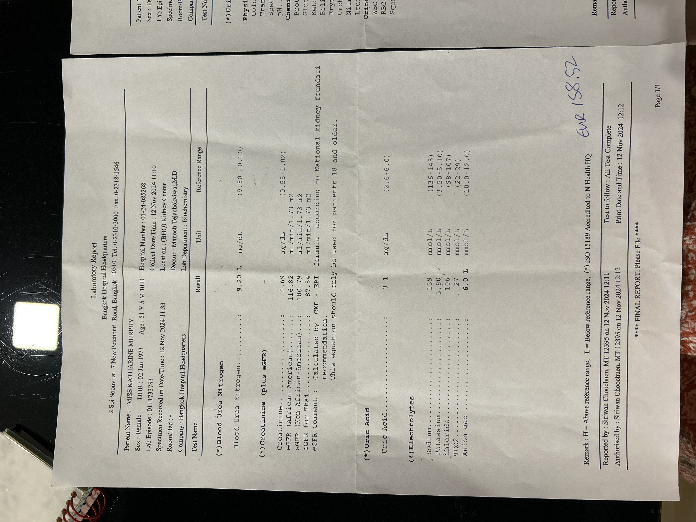
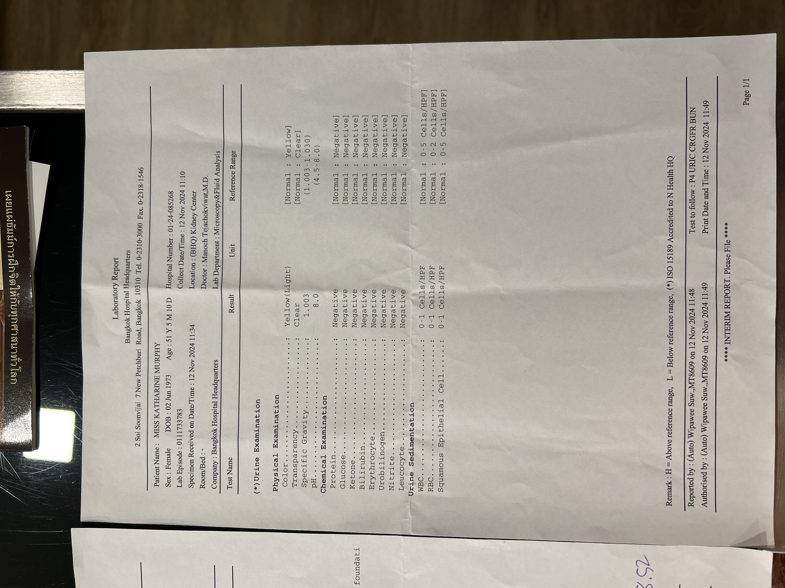

### An inexplicably bad haircut

- I go to get my haircut at Terminal 21.
- I tell the hairdresser I am growing my hair so please not to take too much off.
- I also explain that because my hair is really fine, I would like some extra body on top.
- It's obvious my hair is fine to anyone looking.
- She says no problem, then hacks all my hair off in no uncertain terms.
- She gives me an extremely short hair cut.
- She even uses the clippers to shave hair off at the back on my hair line.
- And, she uses the thinning technique to remove great chunks of my hair and thin it out.
- I am devastated but do not complain because it is so obviously an attack and they'll be ready to fight me.
- Why would she do this? 
- (I have to say that the haircut she did give me was exceptional and grew out really nicely.)
- Was she told to do this by some porn-addict lying about me to his missus? The way they do.
- I wondered at the time if the reason for doing this was so I do not have enough hair to get another decent sample when [I receive my drugs test and find out it is negative](#drugs-test-results).
- Fortunately, I already got a new sample and the hairdresser even noticed where I'd taken it.

#### Another inexplicably bad haircut in N10 in 2025

- In October 2025, I go for a haircut at the Japanese hairdressers in Muswell Hill.
- I've been before, three times, and they always did a good job.
- The first time I went, I told the Spanish woman there I had been targeted for porn in Spain by criminal gangs at a children's music school.
- The second time I went, the Japanese man with the bad skin gave me a really good haircut but I ended up vomiting afterwards in the street. I think this was because I was being constantly drugged and poisoned at that time in London and the pressure on the back of my neck while washing my hair caused nausea and vomiting.
- The vomit was all yellow, just like on detox, and I told Steve about that and he'd prayed for me.
- The third time I went, a Japanese woman gave me an amazing haircut.
- The fourth time I went, in October, the man with bad skin purposely hacked my hair to smithereens.
- He gave me three wobbly partings, a wonky fringe, and then he started thinning out the back like the woman had done in Bangkok before I told him to stop.
- My hair was a total disaster and two months later the next hairdresser I went to was rather alarmed at the state of it and said it would take a good few months to be able to fix properly.
- I lied and said I'd cut it myself.
- The next hairdresser I went to in March 2026 was amazed that one side of my hair was really thick and the other not. 
- He said, *this side is on steroids*, pointing to the area the Japanese man had not got round to thinning out.
- I'm telling this story because I was so upset about it, and couldn't understand why a hairdresser would do such a thing.
- I had been late 15 minutes to the appointment, so I thought maybe he did it so I'd never come back.
- But it was too egregious to explain away like that.
- Someone managed to poison this man's view to the extent where he would butcher, literally, a woman's hair.
- This was the time just after I had realized [the conservatory scam had been a switcheroo porn special](../../crimes/protagonists/vidal-sastre.md#at-least-four), and on the back of that I had quickly remembered [the sedated anal-rape incest porn](../early-years/2015.md#inexplicable-anal-fissure), and the gangs had obviously cranked up [the suicide manipulation again on my social media](../2025/november.md#suicide-content-on-my-jackchardwood-account), so my view is that the porn-gangs of North London somehow got him to apply an extra psychological wounding, the way they do.

### Still unwell

- Something's still making me feel very unwell.
- My vision is blurry and my eyes are red and stinging.
- Something's affecting my conscious awareness too. I can't explain it.
- My kidneys ache and I feel unwell just like I did in Carrer Furs; but *all* the time, not just for specific periods of the day.
- I am not, however, sexually aroused at all.
- I don't have time to think about it properly because all my energy is going into writing this police statement.
- I write for 16 hours a day.
- I'm certain that my life depends on me completing the task.

#### The blind man and the copper

- One afternoon, I'm on my way to Terminal 21 for food shopping; it's a short walk up the road or one stop on the metro.
- I can hardly see.
- My vision is really blurry, my eyes are red and sore, and I feel very unwell.
- I see a blind man being led along by two women.
- He is a tall Western man. The women are Thai.
- Then, crossing in front of these three, and in front of me, I see a character from The Bill, one of my favorite TV shows from when I was young.
- For those who don't know, The Bill was a UK cop show about the Metropolitan Police.

- This *very unusual sight* makes me suddenly realize that, even though I'm away from my apartment in Spain, I'm *still* being poisoned somehow.
- It's a lightbulb moment; the moment I realize the Cano Lopez's and co have been coming into my apartment and adding drugs and poisons to my toiletries and food, for years.
- This sudden realization explains so much of my experiences over the last few years; especially my lengthy trips away from Spain in the summer and at Christmas or Easter when I remained high and inexplicably sexually aroused.
- When I get back to my room, I throw all my shower gel, shampoo, and face wash away.
- I start to feel better immediately; literally the very next day the symptoms of poisoning have disappeared.

### Tattoo

- I have lost my little plastic Hanuman that I was carrying everywhere with me since October 2019 in Rishikesh with Guruji; the one [that fell out of my bag much to the British walkers' delight](../2022/november.md#hanuman-enters-the-picture) once I had started telling them a little about him.
- Did someone steal it? I'm not sure.
- I feel so unsafe in the world, I decide to get a Hanuman tattoo.
- That way, he will be with me always.
- I haven't made any mention about this online, but I have made up my mind to do it.
- I speak to my mother on my mobile. I tell her I'm going to get a tattoo in Bangkok.
- Two seconds later, a fake account follows me on Twitter that has a profile pic with a woman with tattoos.

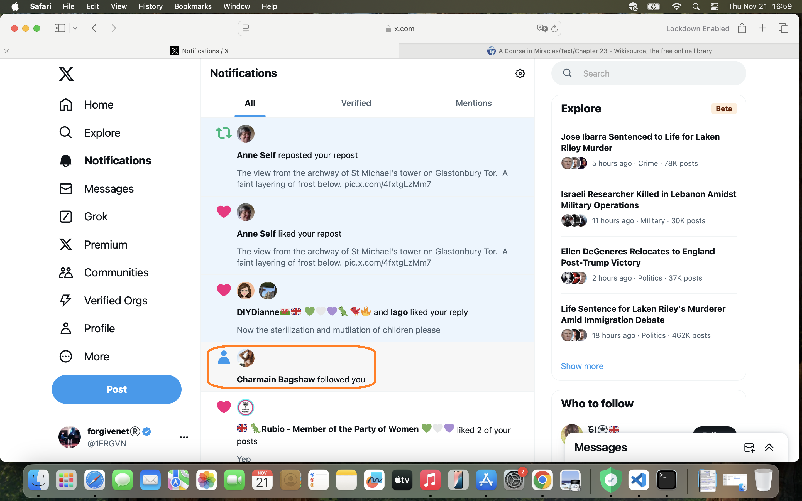

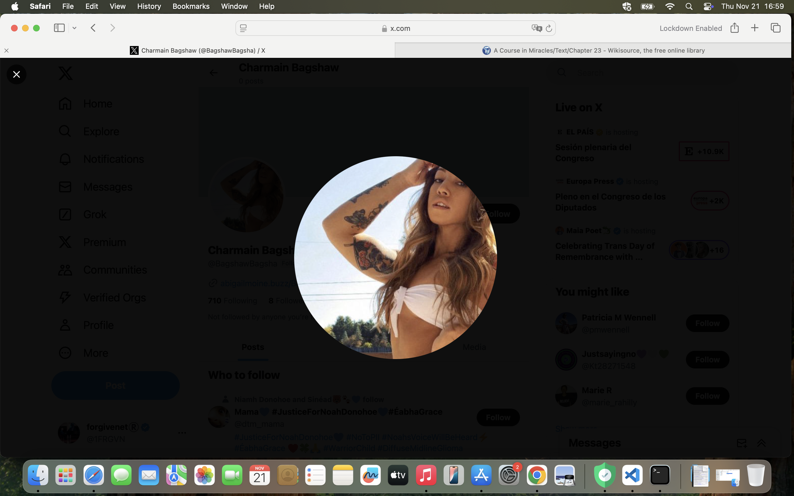

- The back-and-forth conversation between myself and international criminal porn-gangs is beginning.
- I post a pic of my tattoo when I get it.

[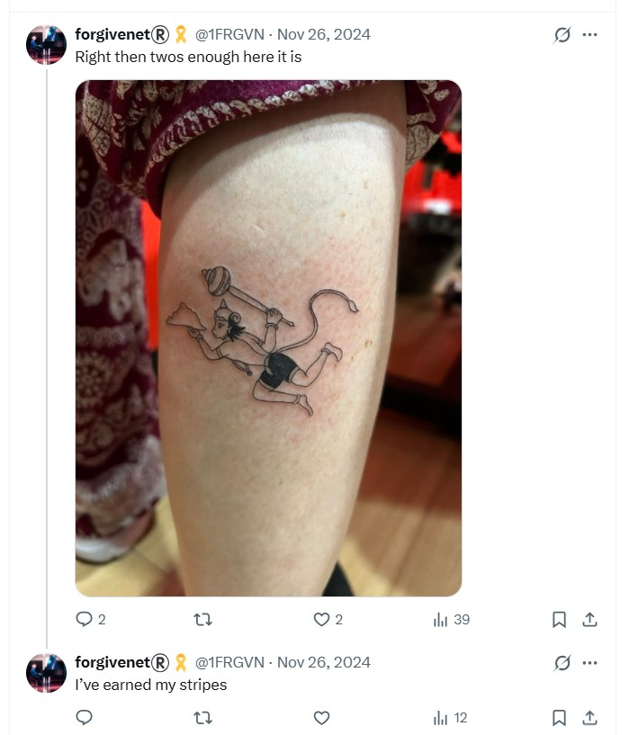](https://x.com/1FRGVN/status/1861394044070568000)

### The landlady

- Probably during [the same conversation I told my mother about the tattoo](#tattoo), I also told her I was thinking about leaving my apartment in Carrer Furs on 15th February 2025, and handing in notice to the landlady in December.
- I told no-one else this and never mentioned it online in personal notes either.
- The same day, 21st November, I receive a WhatsApp from Beatriz, my landlady, saying I had said I was leaving the flat.

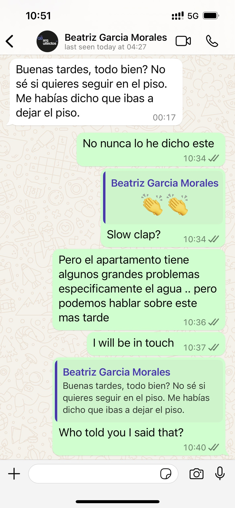

- I did not say this to her at any time and I was always planning on staying until 2026 or 2027, as she knows.
- I ask her who told her I'd said that.
- Bea hurriedly responds with a WhatsApp message from March when I was being terrorized by teachers and staff at the conservatory, and I had told her everything that that was happening to me, and that I believed at the time they were terrorizing me so that I would leave Dénia.
- Bea's response to me at that time was that *I had to solve my problem*, and that was it.
- Since then, we had conversed a few times, including when [she changed the bank account to pay the rent into a second time](august.md#the-landlady-changes-the-bank-account-for-the-rent-again), and I never mentioned leaving at that time.
- She's been told to contact me for information by the criminal porn-gangs.
- They're probably already planning for a new sedated-sex-slave victim to come and live in the flat; perhaps another woman international porn-addicts have requested to masturbate over, like they did with me, and [Rocio Vidal](august.md#6), and countless others.
- I mention the problem with the water pipes again with Bea.
- I've raised the issue with the [water pipes](../2023/september.md#the-water-pipes) with Beatriz twice already, and she ignores me every time.
- The *slow clap* reference is Bea's response to [my YouTube video with Kelly](october.md#youtube-with-kelly-oliver-dougall) after I sent her a link to it.

### Sunday 24th November - original note to readers

!!! tip "Info on this note"
    - This is the original text I wrote on Sunday 24th November while drafting this police statement.
    - In just a few days time, hackers will successfully block my access to my laptop.
    - It's interesting to read this in retrospect and note that I still believe Sandra Smith is Hazel's mother, I still believe just a few people are targeting me online - not a whole population of porn-addicts and criminal pornographers - and that there is only one trumpet teacher that came to teach classes at the conservatory, not [the actual four or more](../../crimes/protagonists/vidal-sastre.md#at-least-four) that I understand to be the same one man after having been successfully brain-damaged with deadly poisons.
    - It's upsetting for me to read back these words that show I have no idea that I have been cerebrally maimed and repeatedly sedated and raped by thousands, probably, over many decades.

- I have had sufficient messages from hackers on fake accounts at this time to be concerned they will impede this statement-writing process.
- I know they have pretty much full access to all my devices and I'm unable to access internet on my mobile right now for unknown reasons, the behavior is much like when I tried to access the Guardia Civil website and was blocked for doing so. 
- So I have sketched as much important stuff as possible from March 2024 to now just so it's added.
- Please note my mind was so badly affected by all this over this year, it is quite hard for me to get everything together correctly, and I will need to cross check with hotel and travel schedules, and Twitter messages, but this will take some time.
- I have completed up to January 2024 now, and fully drafted February 2024, so it's probably already enough to prove gang stalking, cyber stalking, and sexual grooming.
- Hopefully I will be able to continue as best I can, but nothing would surprise me at this stage.
- I believe I am continually targeted online by Domingo and Carmen Cano, Hazel Smith and her mother probably, and the trumpet teacher whoever he is.

### Pre-glaucoma diagnosis

- On 28th November, I have an eye examination at Rutnin Eye Hospital in Bangkok.
- I get a diagnosis of PACS from the eye hospital (primary angle closure suspect); a risk of sudden onset glaucoma.
- It's a very serious condition; something that can cause blindness if not treated immediately when symptoms show up.
- No one in my family has ever had glaucoma and everything else is completely normal.
- It's unusual, to say the least.
- My eyes have been red and blurry for weeks, and it's very difficult to focus. 
- My eye pressure is very high, over 20 in both eyes. 
- My normal pressures should be around 12-15.
- The ophthalmologist suggests we do some breathing Buddhist meditation and this brings my pressures down to 15/17.
- She tells me I could go blind suddenly and very quickly.
- I'm told if I get any signs that my angles are closing, I need to go to A&E immediately and my PACS medical certificate will get me to the front of the queue.

[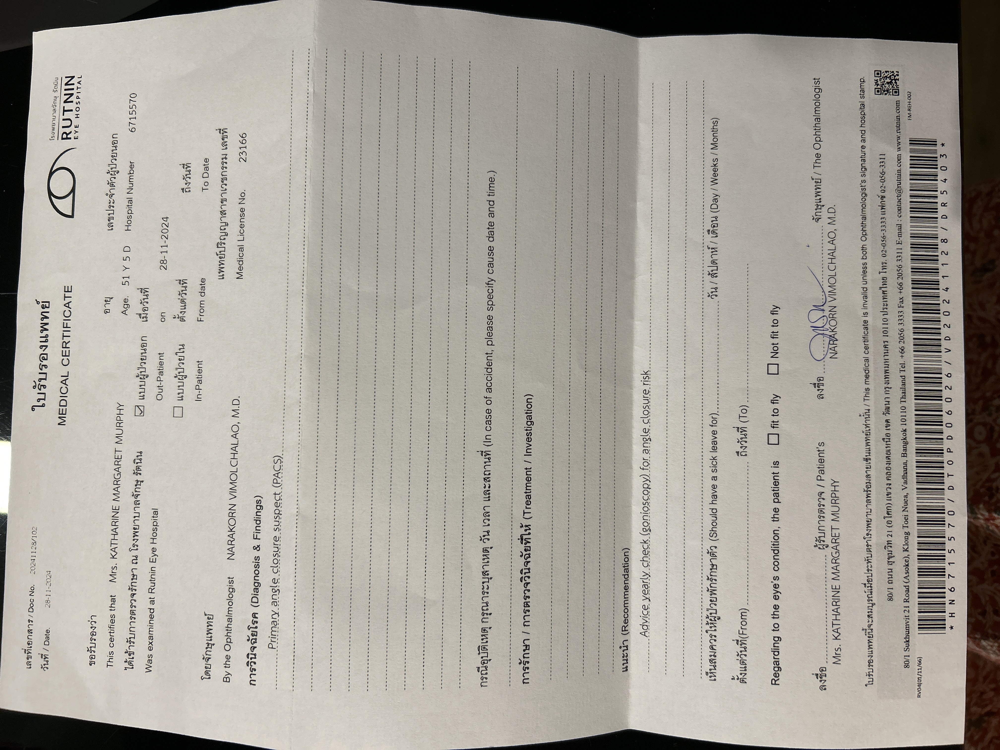](../../content/documents/health/medical-certificate-PACS.JPG)

- I'm horrified. 
- It's a sudden onset eye-condition coming directly from poisoning.
- At the time I'm guessing methanol.
- I was right to replace my bathroom products; that afternoon I also replace my toothpaste, toothbrush and some other things I use regularly.
- Symptoms decrease even more.
- Eventually, I will throw away everything ingestible I brought from home; sun tan lotion, liquid supplements, eye drops, everything.
- I realize that the poisoning was behind the [unusually high eye pressure reported by Alain Afflelou](../../personal/health.md#eyes) the opticians in Ondara when I moved back to Denia in 2022, something I had never suffered from previously.
- I'm beginning to realize I have been being drugged and poisoned from the moment I moved back to Spain in February 2022.
- It's horrifying.
- It looks like I was lured back to that apartment specifically for sinister and criminal purposes.
- The scale and duration and the amount of resources put into the conspiracy is mind-blowing.
- I cannot understand it.
- What could be so interesting about me to justify putting so much time, effort, and resources into doing me serious harm? 
- None of it made any sense at the time.
- Of course, in retrospect in 2026, it’s clear the gangs are making millions off mine and no doubt many other victims' suffering of repeated sedated rape porn, sex-slave spy-cam porn, drugging to provoke masturbation porn, brain-damaging porn and more including broadcasting live and direct from the music schools, children in starring roles, and it was very much worth their while, financially, to make such efforts.

### My ex-boyfriend Brian contacts me out of the blue

- Earlier in the year, when the terror from teachers and staff at the conservatory was at its peak and I believed they were going to murder me, my total isolation became enormously apparent to me and I started trying to reconnect with people I had known in London years ago.
- Although I was obviously a troubled person, I nevertheless had many friends.
- I sent friend requests on Facebook to many of the people I had spent time with regularly before I left for Holland at the end of 1999.
- Everyone ignored me; apart from Brian, Niall, and Paul!
- Later, when [I stand for election](june.md#election-campaign), I reconnect with many more people I know from school on Facebook - an account which was removed by Facebook just a few days ago for no apparent reason. Anyway.
- I believe something prompted Brian to contact me out of the blue on Facebook, and he did.
- We had a long loving and healing chat, I thought.
- A few weeks before, an X account I believe to be managed by Hazel Smith had posted a picture which triggered something in my mind.

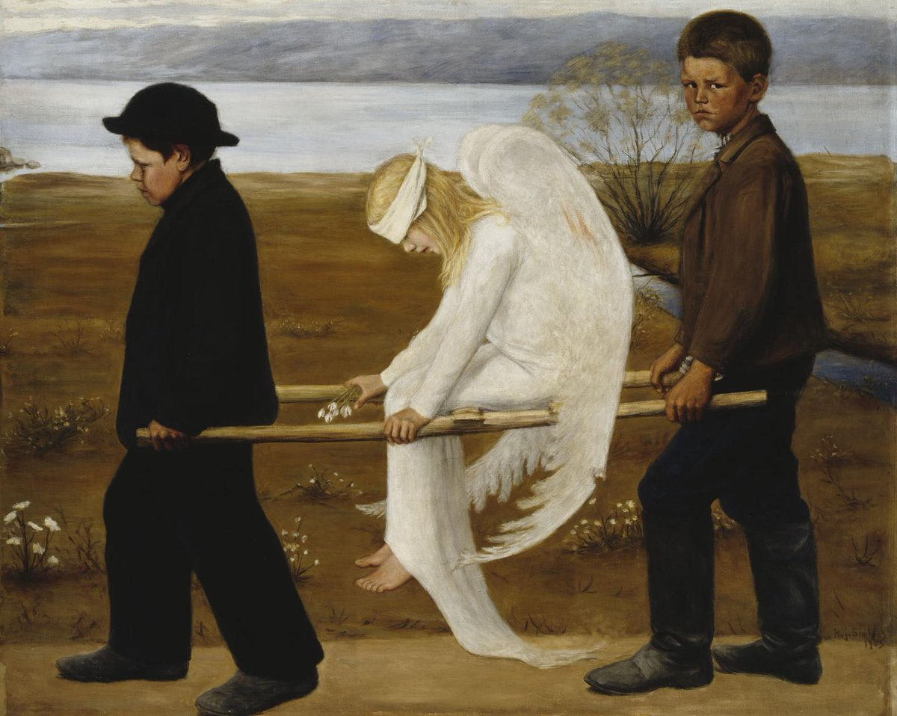

- But, the *very intentional* memory trigger didn't hit consciousness until after I had chatted with Brian on Facebook.
- I think the day after we chatted, the memory flew in and I remembered the unusual incident in Amsterdam in 2001 where [I had seen the very ugly man in the back of the car](../2001-to-2010/2001.md#amsterdam) as we were driving out of the hotel for the ferry back to the UK.
- Of course, I contact Brian immediately again to ask him if he remembers the events.
- He writes something like, *we were very high in those days", and blocks me.
- I think nothing of it, or I'm unable to think more on it, because I continue to be drugged clandestinely throughout 2024 and 2025, until October 2025 when I figure out [the switcheroo porn scam](../2025/october.md#thunderbolt-clarity).
- At that moment, I start to wonder if perhaps I wasn't dreaming that morning, and the strange event with the blindfold lady in the car in front, an ugly man in the car behind, and the drivers looking like two of the trumpet teachers, had happened as I'd remembered it.
- Was I sedated and raped and filmed back in 2001 in Amsterdam by the same porn-gang that has set up spy-cam porn-networks all over the Marina Alta region including in schools?
- Why was Hazel told to trigger this memory around the same time as Brian reaches out?
- Do the gangs realize they've gone too far now and are trying to blame the poisoning, pedophilia and baby-rape industry, never mind the horse porn, all on Ugly and his gang?
- Is this why [he popped up out of the blue in Cauterets](august.md#ugly) in August?
- Did they offer up Marie's daughter at the same time too; an introduction agent working close to foreigners and the children of Dénia?
- Did they think they'd be back in business in no time?

#### Brian and Ugly

- When something weird happens like that - people blocking you at very significant moments, for example - one has to start wondering if something very evil has been going on for a very long time.
- I looked back over my relationship with Brian.
- The initial phase of our relationship had some red flags: a love-triangle, trigger words, him saying he'd heard that I was a prostitute in Amsterdam.
- I remembered Brian and Niall referring briefly to a man they knew; they called him "Ugly".
- *Oh just someone we know,* they said when I asked about him.
- Were there other "dates" with Brian?
- Hazel said something to me one time as `@ChoralSymphony`, during one of our chats, that suggests to me there is more porn starring Brian and I, which I hope investigators will find if they haven't already.
- Brian was very troubled too.
- On one occasion while we were living together in Hastings, I had gone to the bathroom while he was out and the lightbulb wasn't working.
- I went to change it, but I couldn't reach so I didn't bother getting a chair, for some reason I just waited till Brian came back and asked him to do it.
- Brian asked me to get his electricity current reader before he did it because he thought the metal lampshade might be live.
- It was. Very live. Deadly, in fact.
- I called the property management company and the guy came out to fix it.
- He kept asking questions because it didn't make sense to him.
- Brian became extremely upset and paranoid about the man.
- We moved from this flat about a month later to a new one. 
- Eventually, we split up but he would phone me up drunk, years later when I was living in Cami Llavador in Dénia, complaining that he hadn't got any of my money.
- I thought I saw him in a car on the Las Marinas road a few years after that too.
- Was that the whole deal? That he'd get some of my money?
- Did Ugly tell him about the money before I had any idea I'd be getting some?
- I spent an awful lot of money on Brian when I did get some money.
- In Christmas 2023, I took him to Thailand - like I have been known to do for people that don't deserve it.
- He didn't even buy me a Christmas card.
- Anyhoo, it'll all be in the porn.

## Adding spy-cams to my London address

- If you knew your sedated spy-cam rape-porn star was having to return home to her parents due to vicious attacks, and you were 100% convinced that no-one would ever help her, and you were making untold money from her alone, like oodles of cash, you'd be pretty silly not to arrange for spy-cams to be set up in her family's home before she moved back?
- Would you make sure you had breached her family's internet network already, in preparation?
- Would you have to bother with that, given that the network had been breached for decades already?
- Would you have one of your operatives step in when someone needed some work done in the house?
- Would your operative's name ensure he would be tasked with the job, a family name perhaps?
- Would you send this person with instructions to annoy the resident so much she would leave him alone for long periods in the house alone, where he could install as many spy-cams as he liked?
- Do you think you might do that, if you were a criminal gang with no concerns about getting caught or being brought to justice?
- My mother employed a man, [Sean Murphy](https://find-and-update.company-information.service.gov.uk/officers/tqU3t9O-pOkVHJKKZIuE1h2cx3I/appointments) (a significant family name), to install stair lifts at the house.
- My dad doesn't believe that's his name and keeps calling him Dennis; which is interesting.
- Sean Murphy wound my mother up so much she nearly sacked him every day.
- He would turn up really late, or not at all, leaving her waiting around all day for him.
- On a couple of occasions this tactic meant my mother was so exasperated she left him alone in the house for long periods while she went out to do the shopping.
- Was he also employed to [install spy-cams](../2025/may.md#spy-cams-in-london-n2-also)?

### Boil porn and other things

- When I moved home in February 2025, I immediately started getting genital boils again. Immediately.
- I would "tend to them" in the shower sometimes, or in my bedroom.
- Hackers using fake X accounts sent messages to me about my boils right after I would do so.
- My elderly father was convalescing after [his fall](#my-father-falls-down-the-stairs) and I regularly helped him clean and shower if he had been unable to make it to the toilet in time.
- Eventually, I could get him set up and leave him to it.
- I have a feeling that hackers somehow informed him they had been watching him too - on one of our trips for coffee and shopping - because of the things he said to me that day.
- If the whole house was networked up with spy-cams while I was living there, I'd be very happy about it because, although the porn-gangs will have been behind it, I'm now aware that they won't have been the only folk watching.
- I imagine porn-gang hackers who are certain they'll never be brought to justice don't bother robustly securing their own breaches, and anyone can get in; a comforting thought.

## I'm banned for life on LinkedIn

- I change my LinkedIn profile pics and messages to things related to my political activities with the Party Of Women.
- I'm banned for life on LinkedIn.
- I seek help from the Free Speech Union.
- They ask me to request my data as is my right.
- I request LinkedIn send me all my personal data over the last few years.
- They refuse with some fobbing-off reason.
- I request again more clearly.
- They refuse again. They have no valid reason for refusing.
- My LinkedIn data includes all the fake bot accounts that prompted me to get jobs at [Polygon](../2023/november.md#polygon), [zkSync](../2023/june.md#elon), the [Torus](../2023/august.md#head-hunted-by-ex-polygon-director) scam, and all the tech-bros implicated in the international online porn-gang conspiracy that contacted me via LinkedIn.

## Fake account

- A fake account called Ligia Betton interacts with me. 

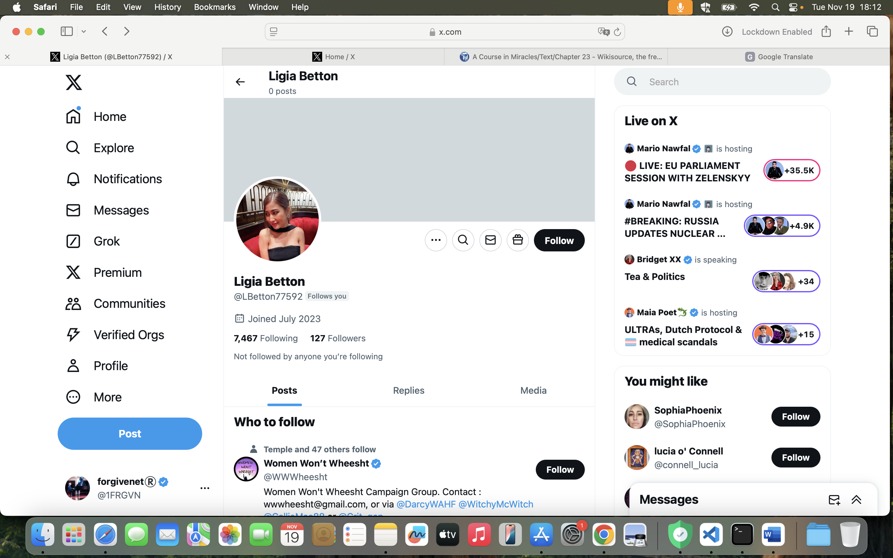

- I believe this is what is going on, i.e. a porn network (league) has a bet on me. People are making money off me now just like they have been since they made porn of me when I was 16.
- I pray that police will act at some point.
- I'm getting close to the truth.

## @jctot19

- I check the `@jctot19` account for the first time in ages, this Wednesday 20th November.

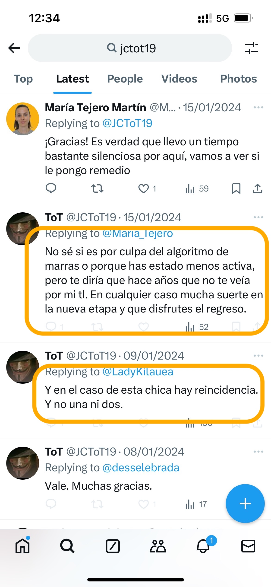

- He hasn't posted since the 15th January 2024, or he has deleted his posts from then.
- The highlighted post from 9th January, mentioning the *chica*, appears to be referring to me. The account he is replying to is protected so I cannot see the conversation. The implication is that I am chasing him again and again. However, this is undoubtedly what he, Domingo, and their co-conspirators have been setting me up to *appear* to be doing.
- This was after Christmas where I was extraordinarily high, flying is an understatement, and we have plenty of witnesses to that. I was exuberant. 
- I look back and see I must have been drugged with something.
- At that time, there were DM'ed conversations between myself and someone pretending to be him (the American account, Matthew). I relate all this in the [December 2023 section](../2023/december.md).
- Then there was another account in January that chatted with me, pretending to be him.
- I had gone to Dublin on my therapy course that [January 2024](january.md), opened an anonymous account on Twitter, followed `@jctot19` on it, and posted solely to my timeline without interacting with his account directly at all.
- I posted about my therapy, and looked on his timeline for responses, as before.
- The first post I had seen on his timeline during that time had been an angel climbing a ladder to heaven, so I continued.
- I posted one tweet with a sexual connotation and he immediately posts the response from 15th January where he apparently randomly reaches out to a woman he hasn't seen in years.
- I immediately stop communicating with him and delete the twitter account I had created.

!!! important
    - It may be helpful to know that if at any time the trumpet teacher had been honest with me, that would have been that.
    - Instead, he and his teams created convoluted situations in which I was always questioning whether he was interested or not, I was never really sure, and so it kept me hanging on in the attempt to find out what was going on, at a minimum.
    - And on top of that, somehow I was being spiked with drugs or herbs that made me extremely sexually aroused, and led me to masturbate for an unseen audience, while I was also being groomed HEAVILY online with MRA seduction tactics on Twitter and elsewhere.
    - We have to assume that I am the tip of the iceberg with regards to these sorts of honey-trap manipulation techniques and it is highly likely children are being targeted in the same way.

## Honey trap

- I believe that the `@jctot19` account is fundamentally a honey-trap account.
- Is it possible I blew his cover and that is why the original tweets stopped on 15th January? I think it's highly likely given they shut everything down when I said [something that directly related to Winston May](january.md#galway-ireland-tt).
- Nevertheless, bizarrely, Google search results related to this account are still active. I notice the newer entries are coming from retweeted posts. I suspect the retweets are automated.
- Carmen and Rocio Vidal still feature. Carmen is obviously Carmen Cano, Domingo's sister.
- I post about [seduction techniques](../../evidence/manipulation.md) on Twitter: https://x.com/1FRGVN/status/1860132157890679006. Immediately, an account interacts with me that has a warning, and suggests the trumpet teacher has an alibi, and not to forget to cross examine Domingo (Camo).

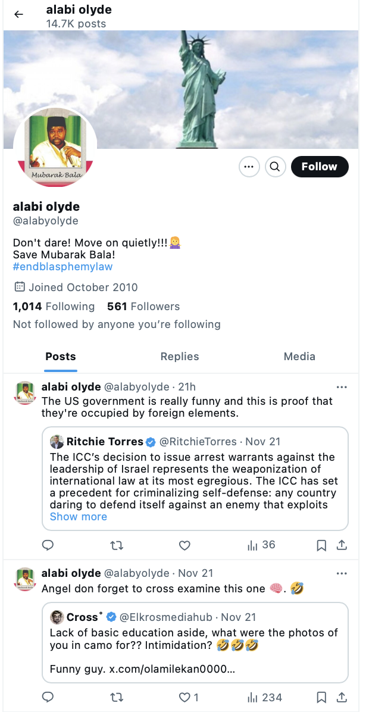

- I suspect Carmen Cano to be behind most of these, including the threat to my brother's life.
- This is my most translated tweet for ages:

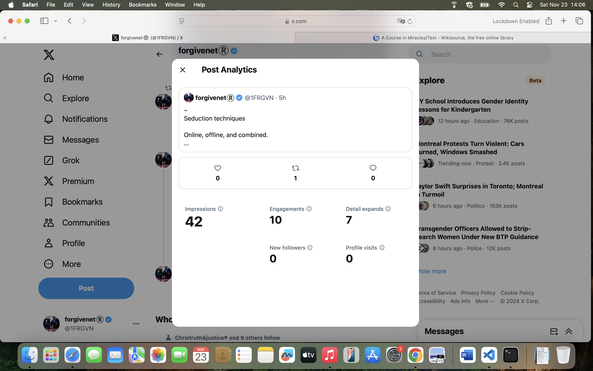
